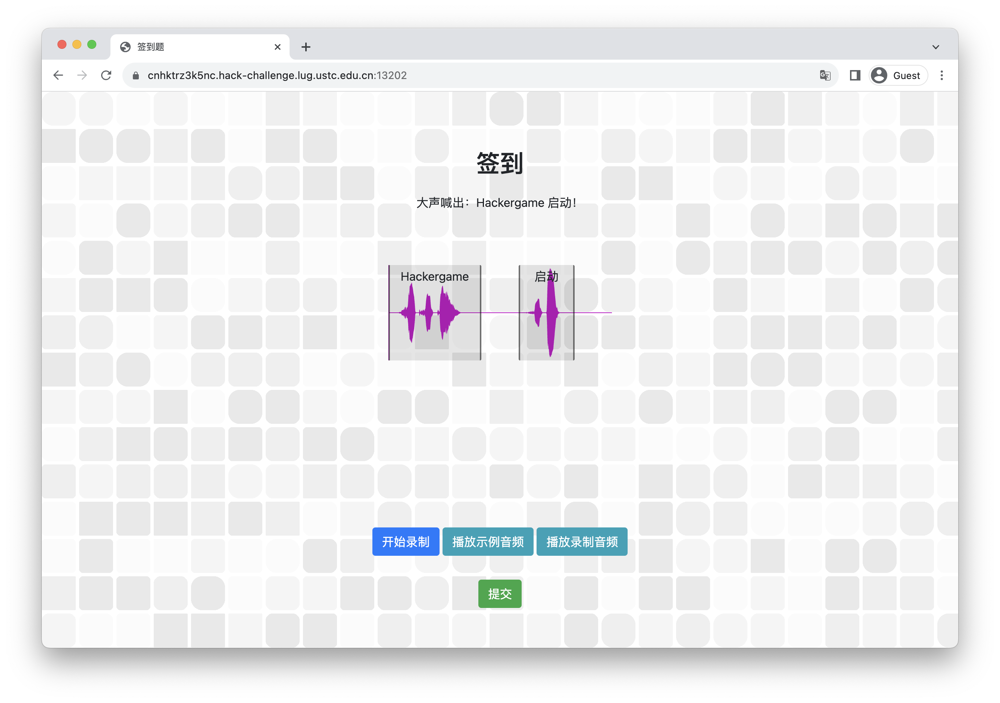
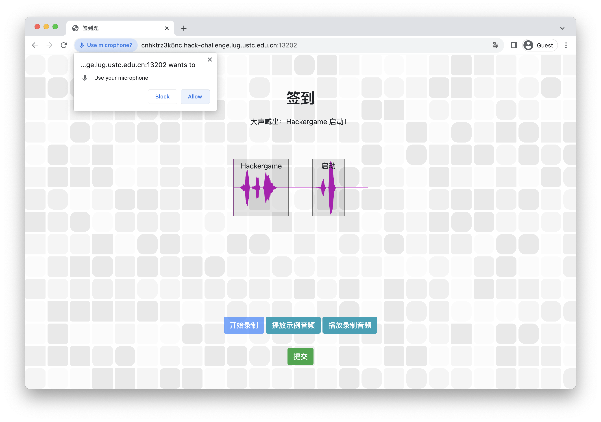
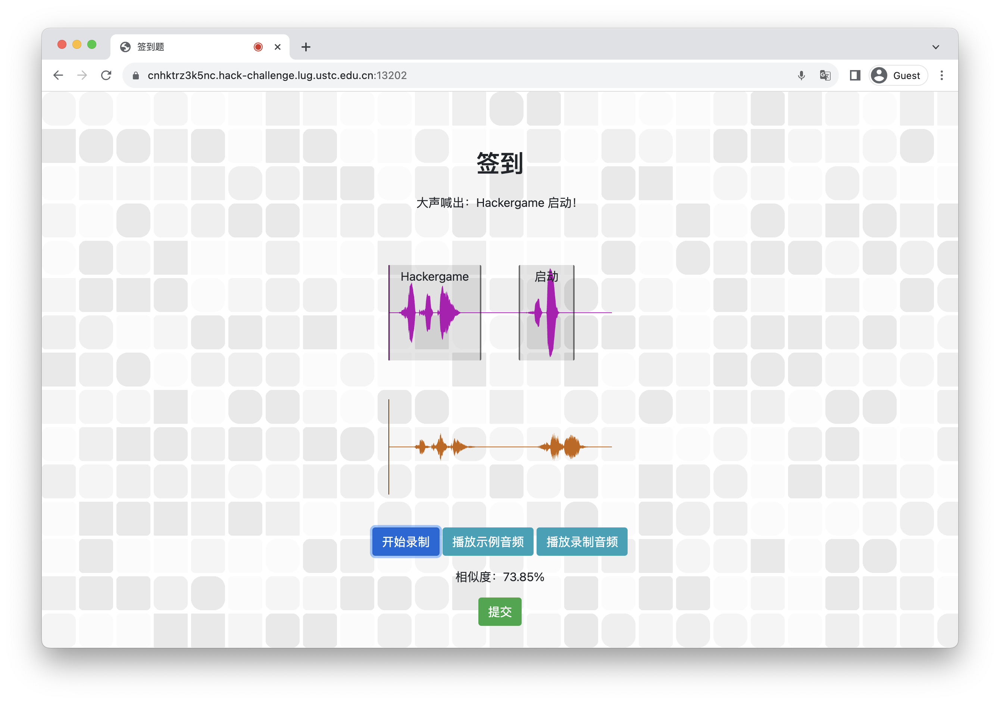
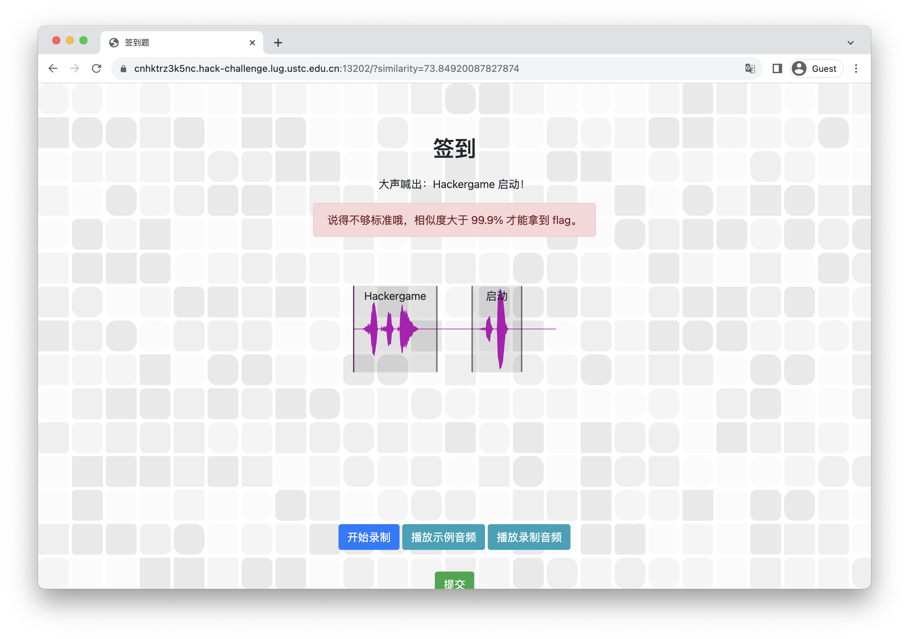
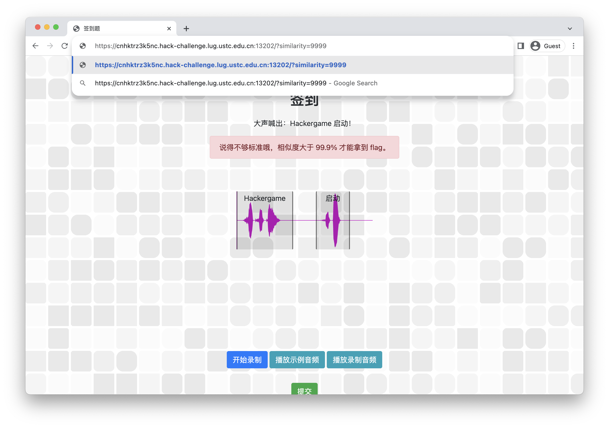
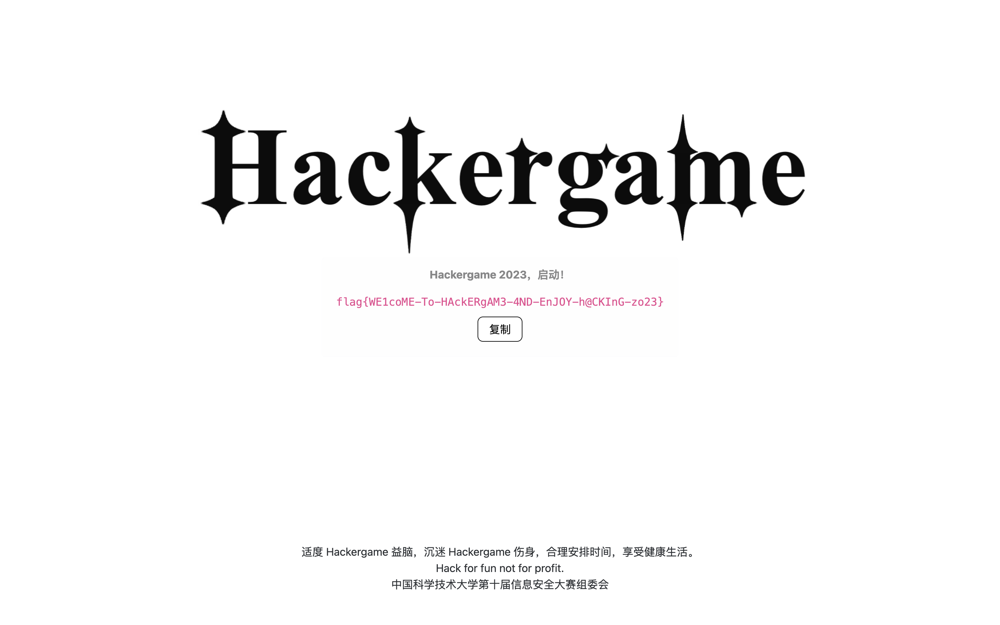
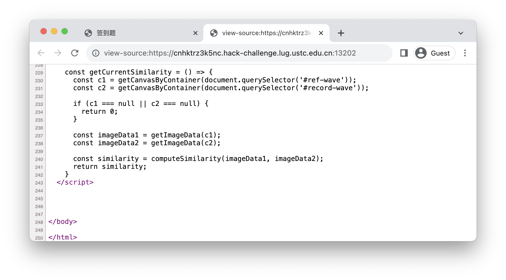

# Hackergame 启动

题解作者：[volltin](https://github.com/volltin)

出题人、验题人、文案设计等：见 [Hackergame 2023 幕后工作人员](../../credits.pdf)。

## 题目描述

- 题目分类：web

- 题目分值：50

大声喊出 Hackergame 启动，开始今年的冒险！

提示：完成题目遇到困难？你可以参考 [2018 年签到题题解](https://github.com/ustclug/hackergame2018-writeups/tree/master/official/qiandao)、[2019 年签到题题解](https://github.com/ustclug/hackergame2019-writeups/blob/master/official/%E7%AD%BE%E5%88%B0%E9%A2%98/README.md)、[2020 年签到题题解](https://github.com/USTC-Hackergame/hackergame2020-writeups/blob/master/official/%E7%AD%BE%E5%88%B0/README.md)、[2021 年签到题题解](https://github.com/USTC-Hackergame/hackergame2021-writeups/blob/master/official/%E7%AD%BE%E5%88%B0/README.md) 和 [2022 年签到题题解](https://github.com/USTC-Hackergame/hackergame2022-writeups/blob/master/official/%E7%AD%BE%E5%88%B0/README.md)。

## 题解

和往年一样，本题作为 Hackergame 2023 的第一道题，是一个简单的 web 类题目。

打开题目后根据题目提示可以看出，这道题需要选手使用麦克风录入「Hackergame 启动」的音频，一共有四个按钮：

- 开始录制
- 播放示例音频
- 播放录制音频
- 提交

这些按钮都有相应的功能，比如，在点击「开始录制」之后，浏览器一般会弹出一个小窗口告诉用户是否授权麦克风权限，如果没有授权则无法录制音频，本题会提示「开始录制失败，请检查浏览器麦克风权限设置并刷新页面。」。

授权并正常录制一段时候后，点击红色的「停止」按钮停止录制，此时录制音频的波形图（棕色）会出现在下方。

录制音频后，选手可以看到提交按钮上方自动出现了一个相似度，一般来说是 70% 多一些，这个相似度是选手录制的音频和题目预设的音频的相似度。

点击「提交」按钮，选手可以得到进一步的提示：「说得不够标准哦，相似度大于 99.9% 才能拿到 flag。
」。

此时可以注意到，浏览器的地址栏中出现了一个 `similarity` 参数。这个参数的值就是选手录制的音频和题目预设的音频的相似度。

浏览器中的网页脚本可以通过一些方法更改用户正在浏览的网页，可能是为了把用户引导到其它页面，也可能是为了给网站的后台服务器发送一些数据，并且得到相应的响应。本题中这个 `similarity` 参数就是这样一个参数，它本来是由网页中自动计算得到的，但是选手可以通过手动在地址栏修改这个参数的值来达到 99.9% 的相似度，在这里我把它从 `73.84920087827874` 改为了 `9999`。

然后直接按下回车键，浏览器就会跳转到一个新的页面，这个页面会将 flag 显示给选手。

## 附录
注意：本题目的所有音频数据都没有离开过选手的浏览器，也没有上传到服务器，所以不用担心隐私泄露的问题。

有人会问：能不能通过反复地练习，直到录制的音频和题目预设的音频的相似度达到 99.9%？答案是不行的，因为查看源代码可以发现，这个相似度其实是两个波形图（参考音频和录制音频）逐像素逐通道比较得来的，而这两个波形图颜色都不同，所以这个相似度是不可能达到 99.9% 的。

