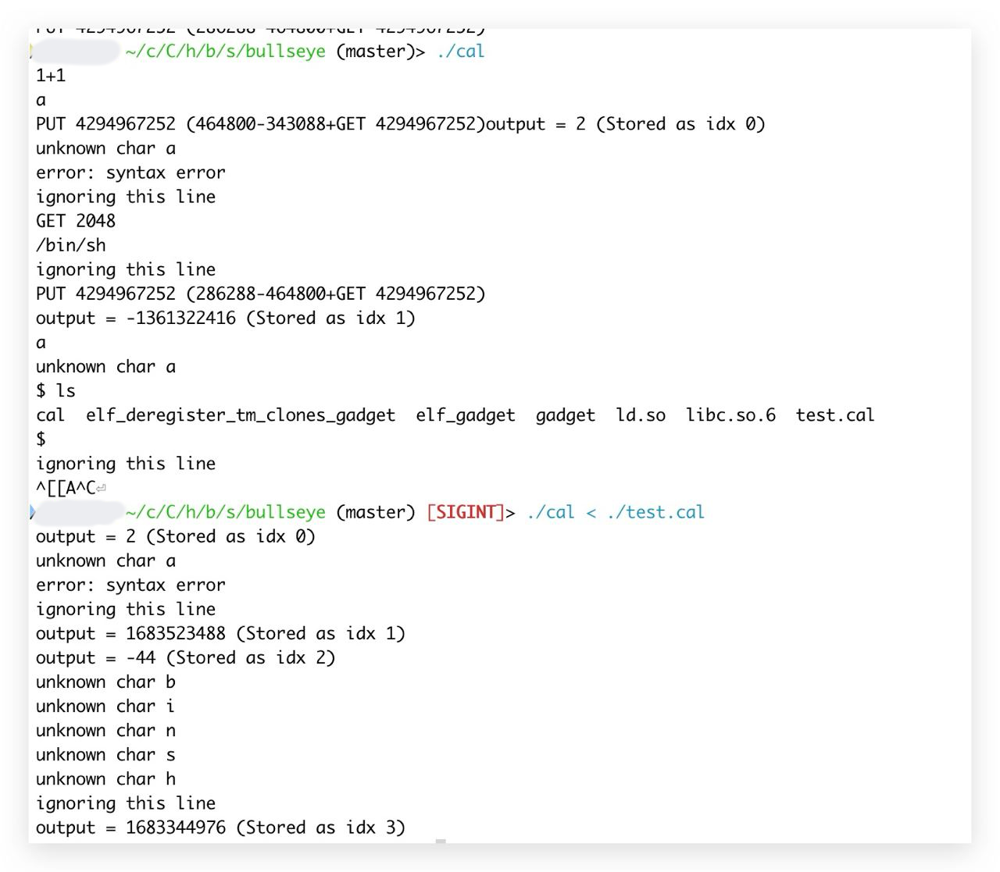

# It's MyCalculator!!!!!

题解作者：[Elsa Granger](https://github.com/zeyugao)

出题人、验题人、文案设计等：见 [Hackergame 2023 幕后工作人员](https://hack.lug.ustc.edu.cn/credits/)。

## 题目描述

- 题目分类：binary

- 题目分值：300

sy 同学拿着超额完成的用 flex 和 bison 实现的简单计算器，向编译原理助教 sk 申请加分。

「只要是我能做到的，我愿意做任何事」

「就连一个额外的 `GET` 和 `PUT` 功能都能写出漏洞，你能承受得起这加分吗？」

「但是，这是我写的计算器，我真的……」

「你不管什么事，满脑子只想着 GPA 呢」

---

编译原理客服小祥提供给您的计算器简单的示例：

```
1+1
output = 2 (Stored as idx 0)
GET 0
output = 2 (Stored as idx 1)
PUT 114 514
output = 514 (Stored as idx 2)
2*2+GET 114
output = 518 (Stored as idx 3)
1+1+PUT 1 2
output = 4 (Stored as idx 4)
GET 1
output = 2 (Stored as idx 5)
```

---

传话筒睦头人悄悄地告诉你 flag 在 `/flag` 的位置，但是她不知道怎么用计算器读取文件。

[题目附件下载](files/MyCalculator.zip)

你可以通过 `nc 202.38.93.111 12000` 来连接题目，或者点击下面的「打开/下载题目」按钮通过网页终端与远程交互。

> 如果你不知道 `nc` 是什么，或者在使用上面的命令时遇到了困难，可以参考我们编写的 [萌新入门手册：如何使用 nc/ncat？](https://lug.ustc.edu.cn/planet/2019/09/how-to-use-nc/)

## 题解

这个题目源自于 [CVE-2023-43641](https://github.blog/2023-10-09-coordinated-disclosure-1-click-rce-on-gnome-cve-2023-43641/)，是 @taoky 的 idea，我把后续的利用进行了实现。

漏洞的成因与 CVE 中的漏洞成因相同，为在 `[0-9]+		{ yylval = atoi(yytext); return NUMBER; }` 中，即使通过 `[0-9]+` 限定了无法输入负数，但是由于 `atoi` 在处理转换时会发生整数溢出的问题，`yylval` 可以变为负数。而在 `GET` 和 `SET` 指令中，只对 `$2` 进行了上界检查，没有进行下界检查（`if ($2 >= MAX_RESULT_BUFFER) {`），导致可以实现 int 32 范围的任意地址读写。

但是又与 CVE 不同的是，CVE 的程序中只提供了 `INDEX` 指令，只有任意地址写入。CVE 中程序可以进行任意地址写的偏移基地址 `track->index[i] = ind;` 在 `libcue.so` 中，在 `libc.so` 等动态库的上面，而不是本题的 ELF 中的 `.bss`。相比起 CVE 的利用，本题在使用 Debian 的 GCC 进行编译时，默认的是 `Partial Relro`，即可以通过在 `.bss` 段中的 `result_buffer` 实现对 `GOT` 表的任意写入。因此相比起 CVE 的利用，本题路线会相对更加清晰，利用难度更低。

在题解中利用的是 `yyerror` 中调用的 `fprintf(stderr, "error: %s\n", s);`，可以将 `fprintf` 替换为 `gets`，将 `cat /flag` 写入到 `stderr` 中。然后再将 `fprintf` 替换为 `system` 即可实现任意代码执行。

但是本题在输出处理上有一些坑的地方，会发现使用上面的逻辑进行的利用，通过手动输入的方式可以利用成功，但是如果使用重定向的方式就无法成功。



那当然就是因为 yy 在处理重定输入时与 interactive 的输入时行为不同导致，可以翻一下 yy 在处理用户输入时的逻辑。

检查使用 bison 和 flex 编译后，得到的 [`cal.tab.c`](./src/src/cal.tab.c) 和 [`lex.yy.c`](./src/src/lex.yy.c)，可以知道程序的主逻辑在 `cal.tab.c` 下面的 `yyparse` 函数中，`yylex` 函数负责从用户输入中解析得到一个新的 token，里面使用 `yy_get_next_buffer` 对用户输入进行读取。这个函数里面我们最关心的是 `YY_INPUT` 是如何被调用的：

```c
static int yy_get_next_buffer (void) {
...
		/* Read in more data. */
		YY_INPUT( (&YY_CURRENT_BUFFER_LVALUE->yy_ch_buf[number_to_move]),
			(yy_n_chars), num_to_read );
...
}
```

```c
#define YY_INPUT(buf,result,max_size) \
	if ( YY_CURRENT_BUFFER_LVALUE->yy_is_interactive ) \
		{ \
		int c = '*'; \
		int n; \
		for ( n = 0; n < max_size && \
			     (c = getc( yyin )) != EOF && c != '\n'; ++n ) \
			buf[n] = (char) c; \
		if ( c == '\n' ) \
			buf[n++] = (char) c; \
		if ( c == EOF && ferror( yyin ) ) \
			YY_FATAL_ERROR( "input in flex scanner failed" ); \
		result = n; \
		} \
	else \
		{ \
		errno=0; \
		while ( (result = (int) fread(buf, 1, (yy_size_t) max_size, yyin)) == 0 && ferror(yyin)) \
			{ \
			if( errno != EINTR) \
				{ \
				YY_FATAL_ERROR( "input in flex scanner failed" ); \
				break; \
				} \
			errno=0; \
			clearerr(yyin); \
			} \
		}\
\
```

可以看到在如果 `YY_CURRENT_BUFFER_LVALUE->yy_is_interactive == true` 的情况下，会使用 `getc` 的方式来进行逐字符的读取，但是在 `YY_CURRENT_BUFFER_LVALUE->yy_is_interactive == false` 时，会使用 `fread` 一次性读取 `max_size` 长度的输入，上面图片中的 `/bin/sh` 则是因为被 `fread` 读取到了缓冲区中，而无法被 `gets` 函数所读取。通过动态调试或直接看源代码，可以知道 `yy_get_next_buffer` 中调用 `YY_INPUT` 时传递的 `num_to_read` 为 8192。

当然有很多的解决方法，一个方法是在输入时，把 `cat /flag` 前面的输入填充到 8192 的长度，让 `fread` 无法读取到 `cat /flag`，从而可以被 `gets` 读取到。

生成 payload 的脚本在 [generate.py](./generate.py)

## 其他

@taoky: 这个 flex 和 bison 的代码是我拿自己 2019 年上编译原理课的时候拿到的实验一的代码修改的（虽然改得内容应该比较多。因为差不多忘了编译原理课上的东西，调试了好久才把规约-规约冲突消灭掉，剩下关于 `PUT` 其实还有几个规约-移进冲突，但是已经没有时间去考虑怎么处理了，因为开了 warning，手动编译也可以看到）。在此对李诚老师与 2019 秋季学期编译原理课上的助教表示感谢。另外我的水平也确实是只会出 pwn 题（写有问题的程序），但是不会做，所以在此也非常感谢 Elsa Granger 愿意在忙着出 AI 题的时候花时间来验证并完善这道题。
