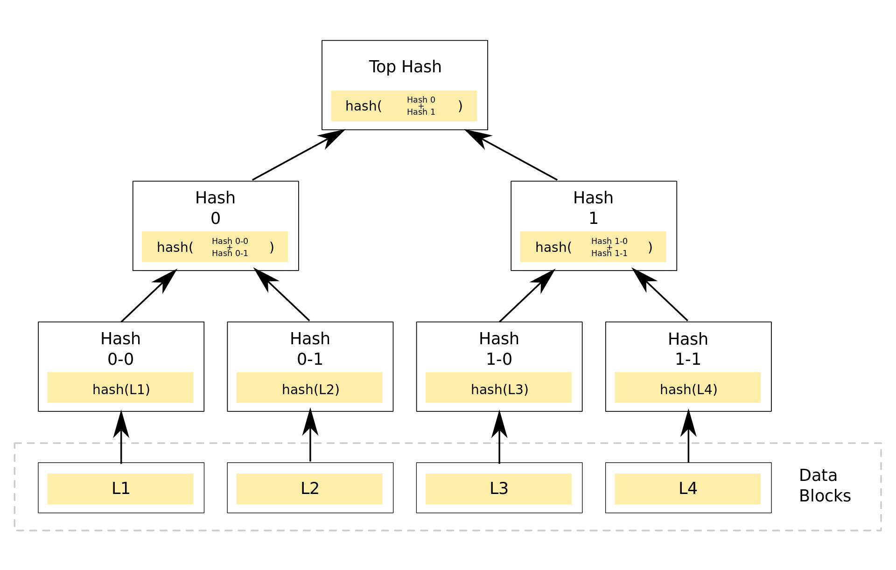
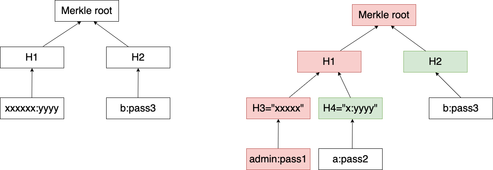

# O(1) 用户登录系统

题解作者：[zzh1996](https://github.com/zzh1996)

出题人、验题人、文案设计等：见 [Hackergame 2023 幕后工作人员](../../credits.pdf)。

## 题目描述

- 题目分类：math

- 题目分值：250

Z 同学是经历过当年三星工厂连连失火，SSD 价格疯涨的苦日子的。

直到如今，Z 同学还是会时常劝诫周围的同学，「1 字 1 位，当思来之不易。半 B 半 D，恒念物力维艰」。

虽然周围的同学由于都是 Linux 用户协会的成员，并不太能理解 Z 同学口中的 D 其实是指 DWORD 的含义，但是大家出于对学长的尊敬还是一脸赞同地深有所悟。

当然，厉行节约绝不是纸上空谈，Z 同学在写代码的过程中也确实对自己硬盘里每一个 bit 的占用都关心备至。比如公钥能用 ECC 绝不会使用 RSA；哈希能用 SHA-1 就不会用 SHA-256；加密能用 ECB 就绝对不用 GCM；压缩能用 ZPAQ 就不会用 LZMA。

而最近，Z 同学在了解 Merkle Tree 之后，惊喜地发现用户登录系统其实可以摆脱掉那些冗杂的数据库系统，无论有多少用户都可以只占用 O(1) 的储存空间，这相当于给 SSD 的价格降低了 O(n) 倍的程度。

「这样的话，既保证了系统的安全性，又再也不怕工厂失火了」，Z 同学一边这样想着，一边把新代码部署上生产环境。

没有感受到任何痛苦，服务器被入侵得很安详。

**[下载题目源代码](files/o1login.py)**

你可以通过 `nc 202.38.93.111 10094` 来连接，或者点击下面的「打开/下载题目」按钮通过网页终端与远程交互。

> 如果你不知道 `nc` 是什么，或者在使用上面的命令时遇到了困难，可以参考我们编写的 [萌新入门手册：如何使用 nc/ncat？](https://lug.ustc.edu.cn/planet/2019/09/how-to-use-nc/)

## 题解

Merkle Tree 的原理就是把叶子节点的数据按照树状结构一层一层计算 Hash 最终形成一个 Merkle root，每个节点的数据都是它左子树和右子树的数据连接起来再 Hash 得到的。由于哈希函数的性质，这个 Merkle root 是所有叶子节点的数据汇总起来得到的 Hash，所以只要任何叶子节点的数据被修改，Merkle root 都将产生变化，所以这个 Merkle root 可以看作是对所有数据的一个 commitment。Merkle Tree 最重要的特点是，只需要 O(log n) 的数据传输量和计算量，就可以证明一个叶子节点的数据真的属于这棵树。当你想证明某个叶子节点在树中时，你只需要把从叶子节点到树根一路上参与过 Hash 的其他节点都提交上去即可，具体逻辑可以参考题目代码。



题目实现了 Merkle root 的计算、proof 的生成、proof 的校验逻辑。仔细分析题目代码，可以发现题目的 proof 校验逻辑有一个缺陷，就是只验证了你提交的节点在树中，并没有确保你提交的节点真的是叶子节点，或者说**没有校验树的高度**。想象一下，如果你把树中间的一个非叶子节点提交上去，也可以通过校验。那我们自然会想，既然叶子节点不允许出现 `admin`，那我们能不能让中间的某个 Hash 是 `admin:` 开头的呢？

根据数据的格式（`用户名:密码`），我们要 40 字节的 Hash 值，因为你可以看出我们要伪造的用户信息其实替代了树中两个 Hash 连接起来的字节串，每个 Hash 是 20 字节，两个 Hash 可以分别枚举，我们只考虑第一个 Hash，因为它更难。前面 6 个字节是 `admin:`，后面是能被 UTF-8 正常解码的字符串（不然 Python 会报错）。我们可以估算一下 SHA-1 的穷举量。随机 14 个字节能够正常 UTF-8 解码的概率懒着算，直接随机跑一下，大概在 1/3500 左右（这里暂不考虑 `:` 和 `\n`）。所以总穷举量是 9.8e+17 左右，根据 4090 显卡的 Hashcat 跑分，可以估算大概要跑 200 多天，这种解法不予考虑。（我比较好奇有没有卡多的神仙选手用这种方法暴力跑出来的，其实 7 天时间完全有可能。）

接下来，我们换一种思考方式，既然我们没法提交高度小于真实叶子高度的节点，那我们还可以提交**高度大于真实叶子高度的节点**，也就是说，让上面图片里的 L1 下面还挂了更多的节点，但我们导入用户列表的时候只提交 L1，而登录的时候提交 L1 下面用户名为 `admin` 的节点的 proof。

做法如下图所示：



我们导入用户的时候提交给题目程序的是图中左侧那个树，只有两个用户，然后登录的时候实际上提交的是图中右侧树的 `admin` 用户的 proof。这样一来，我们只需要穷举出 `admin` 和 `a` 两个用户的密码，使得 `H3` 和 `H4` 两个哈希都是可 UTF-8 解码的，并且两个哈希中有且仅有一个包含一个冒号即可。值得注意的是，题目的实现中对两边 Hash 的大小关系有要求，即每次左侧的要小于右侧的，所以我们需要额外判断一下大小关系。

解题代码如下：

```python
from hashlib import sha1

pass1 = 0
while True:
    h3 = sha1(f'admin:{pass1}'.encode()).digest()
    try:
        x = h3.decode()
        assert '\n' not in x and ':' not in x
        break
    except:
        pass
    pass1 += 1

pass2 = 0
while True:
    h4 = sha1(f'a:{pass2}'.encode()).digest()
    try:
        x = h4.decode()
        assert '\n' not in x and x.count(':') == 1
        assert h4 > h3
        break
    except:
        pass
    pass2 += 1

pass3 = 0
while True:
    h2 = sha1(f'b:{pass3}'.encode()).digest()
    try:
        assert h2 > sha1(h3 + h4).digest()
        break
    except:
        pass
    pass3 += 1

print("1")
print(h3.decode() + h4.decode())
print(f'b:{pass3}')
print('EOF')
print("2")
print(f"admin:{pass1}:" + h4.hex() + h2.hex())

```

使用命令 `(echo TOKEN && sleep 1 && python3 solve.py && cat) | nc 202.38.93.111 10094` 即可跑出 flag。我的笔记本电脑上运行时间大约 10 秒。

值得注意的是，SHA-1 已经是不安全的哈希算法了，但是至今为止已知的 SHA-1 碰撞应该对求解本题没有帮助，因为本题对字符串长度和前缀的要求比较严格。至于为什么选用 SHA-1，是因为跑合法 UTF-8 的穷举量比较合适。
