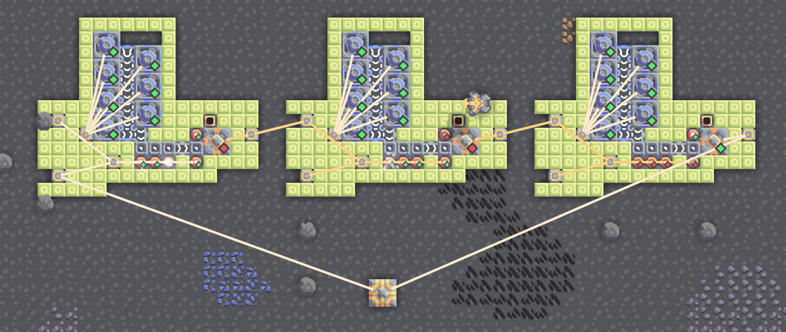

# 异星歧途

题解作者：[Peter Gu](https://github.com/regymm)

出题人、验题人、文案设计等：见 [Hackergame 2023 幕后工作人员](https://hack.lug.ustc.edu.cn/credits/)。

## 题目描述

- 题目分类：binary

- 题目分值：250

你降落在荒废星球的角落，开始新的征程，但从科技树底层一步步发展总是令人不快。幸运的是，在看似荒废的土地上仍然留存着高级文明的痕迹：你找到一台冲击反应堆——如果它工作起来，就可以获得用之不尽的电力——尽管它现在没有启动，并且控制工作条件的部件和工厂被 32 个按钮和相连的逻辑系统牢牢掌控。

于是：你的任务是在不进行任何其他操作的情况下拨动这 32 个按钮，使冲击反应堆能够**稳定运行**。

请点击下方的「打开/下载题目」按钮，下载题目文件。题目文件对应的 Mindustry 版本为 [7.0 Build 146](https://anuke.itch.io/mindustry)。打开游戏后依次选择 **地图编辑器—加载地图—选择题目文件 `the_planet.msav` —返回主菜单**，然后选择 **开始游戏—自定义游戏—选择导入的名为 the planet 的地图—不改变任何选项点击开始游戏** 。开启后的游戏界面如下图，按钮已经用红框标出：


将正确的按钮序列以 01 序列的形式提交至 [检查网站](http://202.38.93.111:10070/?token={token}) 或 `nc 202.38.93.111 10071` 获得 flag。按钮未按下（即游戏开始时默认状态）用 0 表示，按下（即点击按钮后按钮颜色变亮）用 1 表示，顺序从左到右。

提示：在游戏主菜单选择 **设置—图形—显示建筑状态** 可以开启建筑状态显示（即图片中建筑右下角的菱形），这可能有助于解题。

提示：为了完成目标，你可能需要以特定的顺序拨动这些按钮，但这不影响结果：只有唯一一组按钮组合能满足要求。如果在满足要求后再次改变按钮，冲击反应堆可能会继续运行一段时间，但会在 1-3 分钟后停止，不可能**稳定运行**。

> 如果你不知道 `nc` 是什么，或者在使用上面的命令时遇到了困难，可以参考我们编写的 [萌新入门手册：如何使用 nc/ncat？](https://lug.ustc.edu.cn/planet/2019/09/how-to-use-nc/)

**[打开/下载题目](files/the_planet.msav)**

## 题解

注：Mindustry 是一款开源游戏，[源代码](https://github.com/Anuken/Mindustry)在 GitHub 上。打开 [itch.io](https://itch.io/) 平台上它的页面时可以看到“Download Now”按钮旁有“Name your own price”字样，点击后选择“No thanks, just take me to the downloads”即可免费下载。

如果想深入了解游戏技巧和逻辑，可以参考[这篇](https://steamcommunity.com/sharedfiles/filedetails/?id=1935045318)和[这篇](https://steamcommunity.com/sharedfiles/filedetails/?id=1997547694)介绍。关于逻辑处理器，可以参考[这里](https://mindustrygame.github.io/wiki/logic/0-introduction/)。

题目分四部分，每组 8 个按钮，每组都要开启电力才能完成任务。

第一组：点开阅读处理器内容，只有 8 个按钮有满足类似 `if s1 == false` 的条件，就会调过执行 `set enabled of generator1 to 1` ，即不开启发电机，所以按钮顺序是代码中 8 条 Jump 所写的 true/false 取反。

第二组：还是要开启发电机。阅读汇编，发现前一部分是将 8 个按钮拼成一个 8 位数，而中间一部分是检查这个 8 位数是否是平方数。最后要求 sw6 和 sw1 都是开启，而满足这些条件的平方数只有一个。这段代码是用网友编写的 Mindustry 汇编编译器  生成的，使用的 Python 逻辑代码如下（处理器中的汇编经过手动调整，与如下逻辑不一定完全相同）：

```python
sw1 = switch1.enabled
sw2 = switch2.enabled
sw3 = switch3.enabled
sw4 = switch4.enabled
sw5 = switch5.enabled
sw6 = switch6.enabled
sw7 = switch7.enabled
sw8 = switch8.enabled
generator1.enabled(0)
t = sw1 << 7
number = t 
t = sw2 << 6
number = number + t
t = sw3 << 5
number = number + t
t = sw4 << 4
number = number + t
t = sw5 << 3
number = number + t
t = sw6 << 2
number = number + t
t = sw7 << 1
number = number + t
t = sw8
number = number + t
en = 0
for i in range(16):
    fl0 = i**2
    if fl0 == number:
        en = 1
        break
    fl1 = not sw1
    fl2 = not sw6
    fl3 = fl1 | fl2
    if fl3:
        en = 0
    generator1.enabled(en)
```

第三组：主要是游戏逻辑。小的处理器只是跟随炮塔的功能而已，大的处理器控制逻辑。要开启钍反应堆需要钍和冷冻液，必须保证被处理器控制的单元保持以下状态：

- conduit1/conduit2 禁用，否则水或者冷却液会流掉
- gate1 禁用，否则制造冷冻液的钛会全部转向到焚化炉烧掉
- conveyor2 开启
- mixer1 开启
- extractor1 开启
- reactor1/reactor2 开启
- meltdown1/meltdown2 关闭，否则会用掉所有的电量（此炮塔即使没有发射也会用电），以致无法生产冷却水

如果任何一个条件无法满足，都会导致一段时间后电力终止或反应堆爆炸。

可能需要最后开启 reactor 和 conveyor2，保证开启时已经有冷冻液。

而逻辑指出 sw8 需要和前一组的最后一个按钮保持相同状态，否则会操控反应堆爆炸。

第四组：模拟门电路和组合逻辑，这一部分乱七八糟的走线由三种门组成。

非门：

NAND 门：

与门：

分析后调整到输出有电就好了，也可以反复尝试。注意门有延迟，也可能短时间产生其他的输出。铺满塑钢墙是因为它可以阻值电力节点自动连接。

这里只用到了组合逻辑，但其实时序逻辑也可以实现，通过电力而不是传送带上是否有物品的好处是电力的传导不需要时间。但仍然，因为各类发电机等的生产时间是一秒钟左右，即使迅速把内部用装卸器清空，也需要等待一段随机的时长后才能停止工作，这严重限制了门的速度。

如下是一个由 NAND 门组成的 D 触发器，由三个非门组成的环形振荡器提供时钟，时钟较慢，而逻辑门的部分用超速穹顶将运行速度提升至了 250%。在这个尝试中，你可以手动拨动门的输入并真切体会到逻辑门的延迟、时钟抖动（jitter）、建立和保持时间等在真正的数字电路系统中不那么直观的概念。如果是物料传送带代表逻辑值，还可以体会到严重的时钟偏移（skew）。


一个加快逻辑速度的想法是靠控制发电机需要的水而不是物料，因为涡轮发电机只要有水就可以完全正常工作，只要水耗尽就会迅速停止，而不像控制物料的情况需要等待最后一个物料消耗完。但问题是进入发电机的水就不能取出，所以只能将水控制在很低的量，在有和没有直接反复跳动。

这好像很有发射极耦合逻辑电路（ECL）的味道。

图中是一个简单尝试，振动周期非常不稳定，大概在 2 Hz 左右。


