# 旅行照片 3.0

题解作者：[yliu7949](https://github.com/yliu7949/)

出题人、验题人、文案设计等：见 [Hackergame 2023 幕后工作人员](https://hack.lug.ustc.edu.cn/credits/)。

## 题目描述

- 题目分类：general

- 题目分值：神秘奖牌（150）+ 这是什么活动？（150）+ 后会有期，学长！（150）

你的学长去留学了，这一走短时间内怕是回不来了。于是，你在今年暑假来了一场计划已久的旅行，并顺路探望了这位久别的学长。翻阅当天拍下的照片，种种回忆和感慨油然而生。

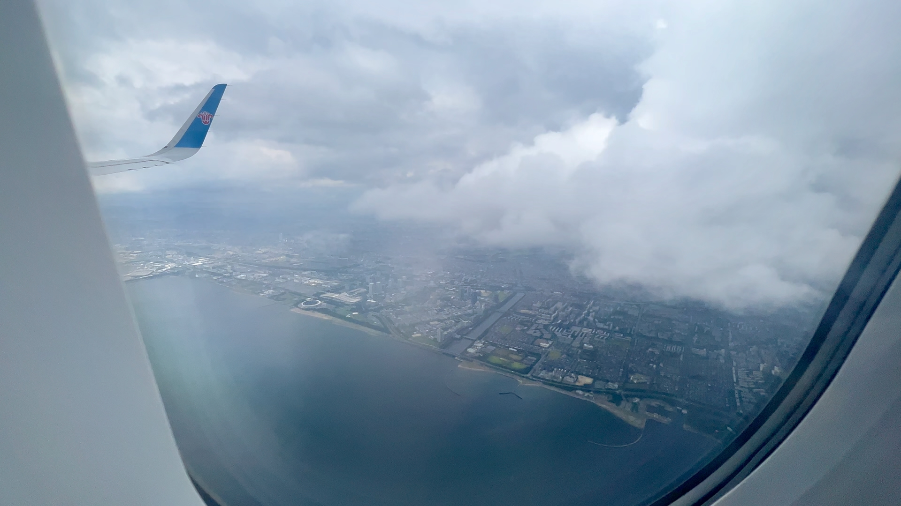

请观察照片并结合所有文字内容，正确回答题目以获取 flag。

<b style="color: red;">补充说明 1：如果在「旅行照片 3.0」题目网站中提交答案后提示答案错误，可能是由于同时打开了其他的题目造成的。如果你认为答案正确，请关闭所有题目页面后从平台重新进入再试一次。</b>

------

> 关键信息已加粗。

【🌻上午】与学长碰面后，他带你参观了**他的学校**。在**校园的一个展厅**内，你发现了一枚神秘的金色奖牌，它闪闪发光，令人心生羡慕。

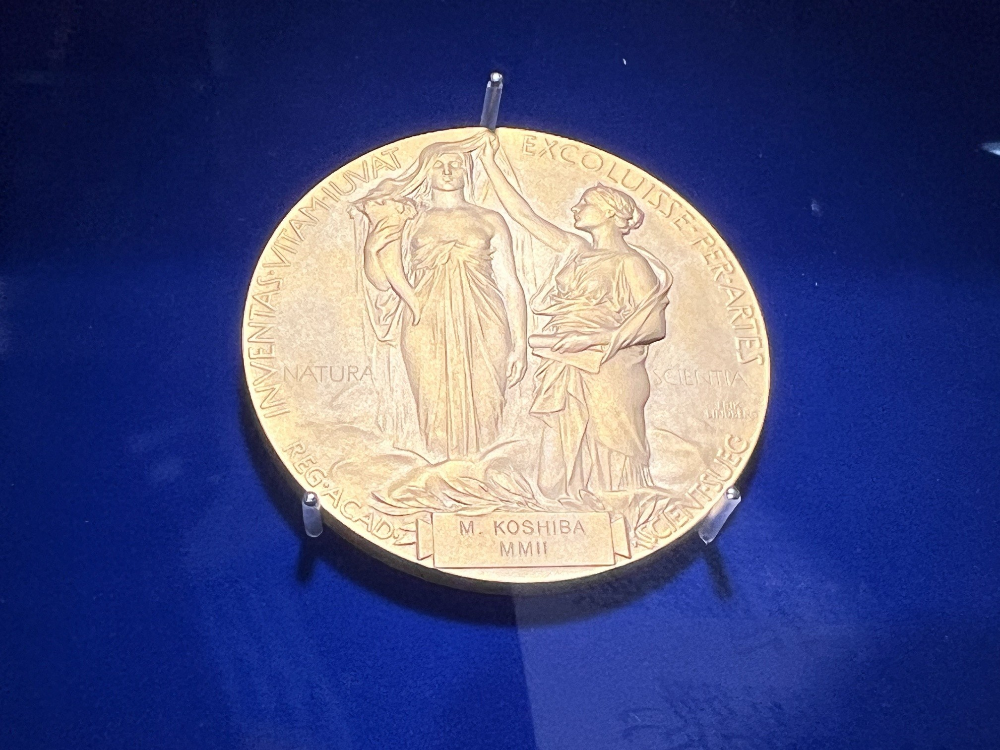

【🌻中午】离开校园后，你和学长**走到了附近的**一家拉面馆用餐。那家店里的拉面香气扑鼻，店内的装饰和氛围也充满了日式的风格。学长（**下图左一**）与你分享了不少学校的趣事。饭后，你们决定**在附近散步**，享受这难得的闲暇时光。当你们走到**博物馆前**时， **马路对面的喷泉**和它周围的景色引起了你的注意。白色的帐篷里**即将举办**一场大型活动，人们忙碌的身影穿梭其中，充满了期待与热情。

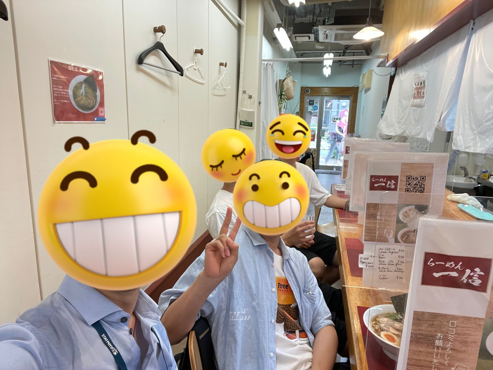

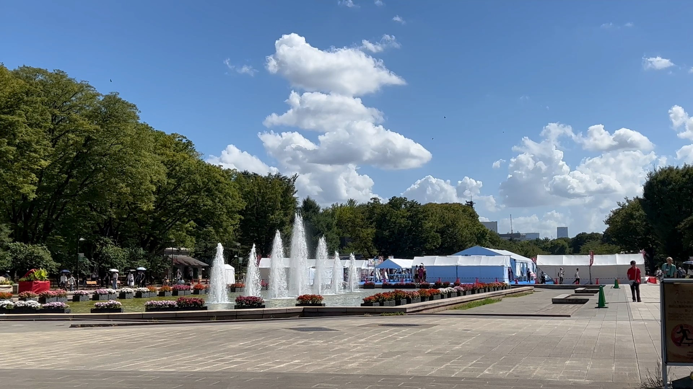

【🌻下午和夜晚】在参观完博物馆后，学长陪你**走到了上野站**。你们都感到有些不舍，但知道每次的分别也是为了下次更好的相聚。学长那天晚上将**继续他的学术之旅**，打算**乘船**欣赏东京的迷人夜景和**闪耀的彩虹大桥**（Rainbow Bridge）。而你则搭乘了开往马里奥世界的**电车**，在那里度过了一段欢乐的时光。

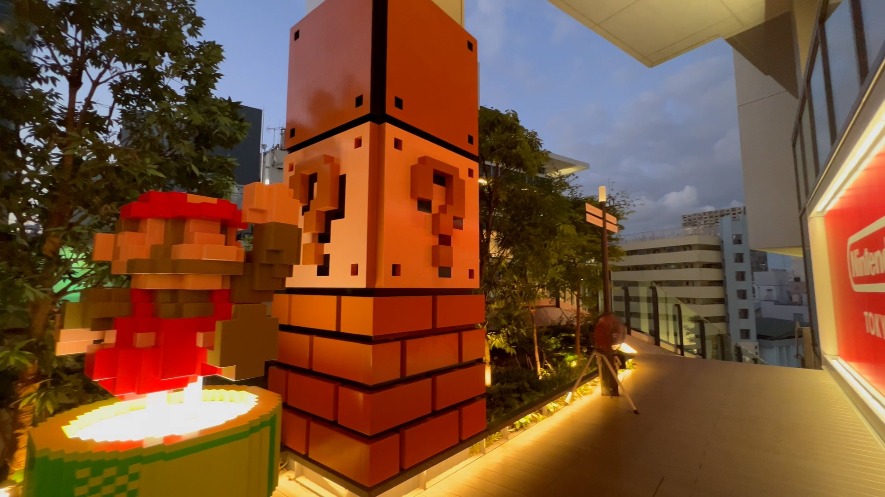

### 题目 1-2

1. **你还记得与学长见面这天是哪一天吗？（格式：yyyy-mm-dd）**

    答案：`2023-08-10`

2. **在学校该展厅展示的所有同种金色奖牌的得主中，出生最晚者获奖时所在的研究所缩写是什么？**

   答案：`ICRR`

### 题目 3-4

3. **帐篷中活动招募志愿者时用于收集报名信息的在线问卷的编号（以字母 S 开头后接数字）是多少？**

   答案：`S495584522`

4. **学长购买自己的博物馆门票时，花费了多少日元？**

   答案：`0`

### 题目 5-6

5. **学长当天晚上需要在哪栋标志性建筑物的附近集合呢？（请用简体中文回答，四个汉字）**

   答案：`安田讲堂`

6. **进站时，你在 JR 上野站中央检票口外看到「ボタン＆カフリンクス」活动正在销售动物周边商品，该活动张贴的粉色背景海报上是什么动物（记作 A，两个汉字）？在出站处附近建筑的屋顶广告牌上，每小时都会顽皮出现的那只 3D 动物是什么品种？（记作 B，三个汉字）？（格式：A-B）**

   答案：`熊猫-秋田犬`

## 题解

> 分别记上面的五张图片为题图、图一、图二、图三和图四。

1. 谷歌地图搜索图二中的文字“らーめん 一信”可知拉面店位于东京。因此这一天你和学长的故事发生在东京。该店步行距离范围内的大学只有东京大学本乡校区，学长留学所在的学校极大概率为东京大学。

   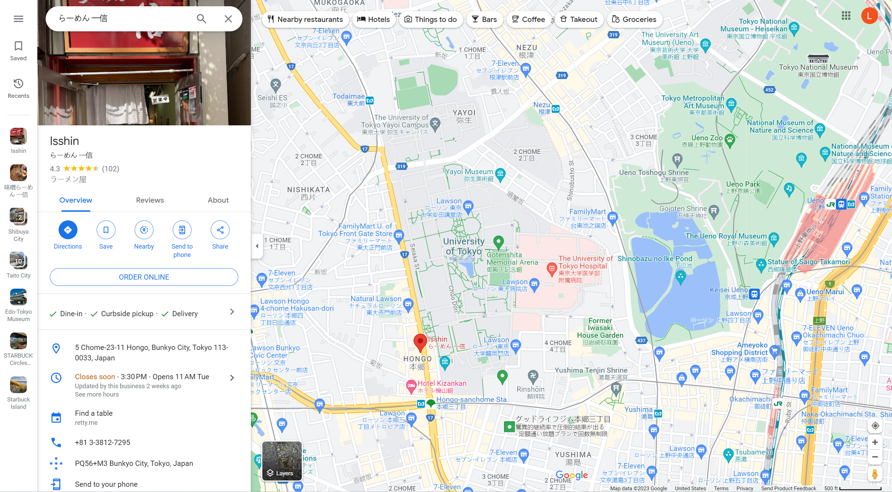

2. 留意到图二中学长（左一）脖子上的绳带上写着“STATPHYS28”字样，谷歌搜索“STATPHYS28”获得官网网址为：[https://statphys28.org/](https://statphys28.org/) 。从官网首页，我们可以知道这是一个为期五天的国际物理学术会议，时间为 2023 年 8 月 7 日至 2023 年 8 月 11 日。此外留意到 Banner 位置第一幅图片为多艘游船和彩虹大桥，这是后面第五小问的线索和提示。

   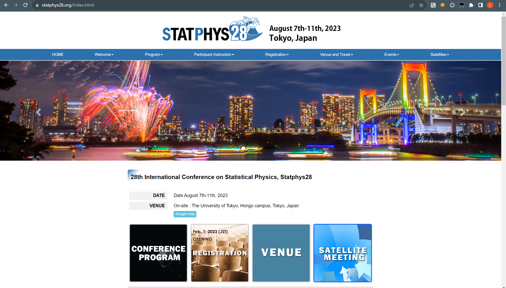

3. 使用谷歌图片搜索服务（<https://lens.google.com/search>）来搜索图一，通过奖牌上的人物造型可知这是诺贝尔物理学奖牌。

   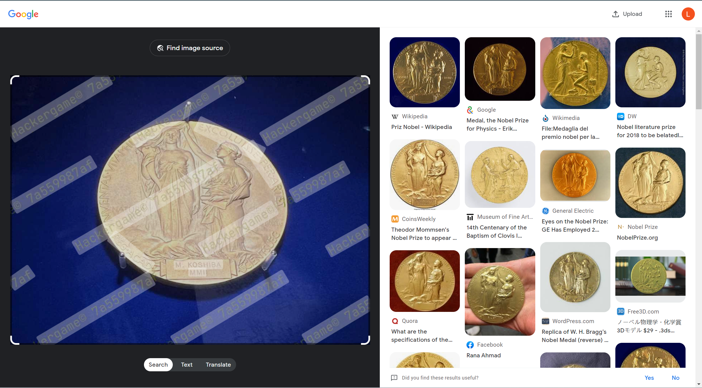

   由奖牌正面底部的文字，可以得知该奖牌对应的诺奖得主是"M. KOSHIBA"，小柴昌俊，日本物理学家。谷歌搜索“M. KOSHIBA’s Nobel Prize Medal Exhibition in Tokyo University”，搜索结果的第三条和第四条是东京大学理学部的网站，第四条结果与诺奖有关，网址为 https://www.s.u-tokyo.ac.jp/en/gallery/nobelprize/ ，点进去看看。

   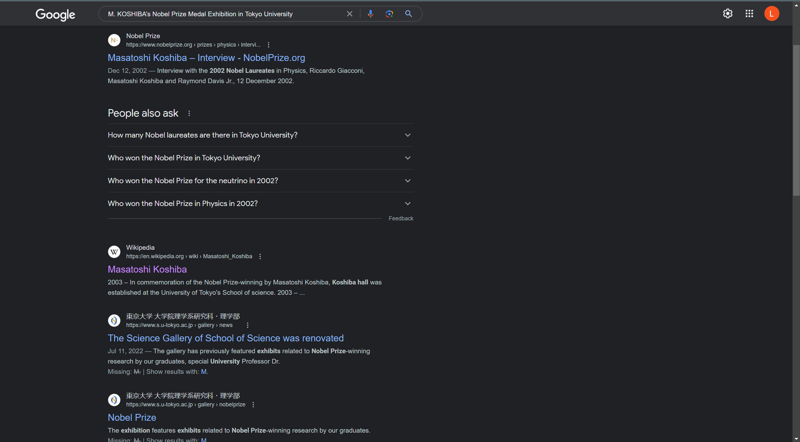

   进入该搜索结果后，发现这是一个对东京大学 Science Gallery 中诺奖展览部分的介绍，特别注意到该网页的第一段文字中提及了诺奖奖牌复制品，该网页后面有对小柴昌俊进行介绍的部分，这部分提及他是东京大学毕业生且长期在东京大学工作。因此，你和学长在校园里看到的展览正是东京大学 Science Gallery 的诺奖展览，也可以确定学长的学校就是东京大学。在该网页里，我们可以获知该展厅里共展示了三枚诺贝尔物理学奖牌，出生最晚的得主是 2015 年获奖的梶田隆章（Takaaki Kajita），他在东京大学宇宙射线研究所（***I**nstitute for **C**osmic **R**ay **R**esearch, **ICRR***）工作，因此第二小题的答案为 `ICRR`。

   

4. 对图三进行谷歌识图，可确定该地点是上野恩赐公园的喷泉广场，借助谷歌地图可知：该喷泉广场位于东京国立博物馆对面，与之相隔一条马路，距离一信拉面店也比较近。

   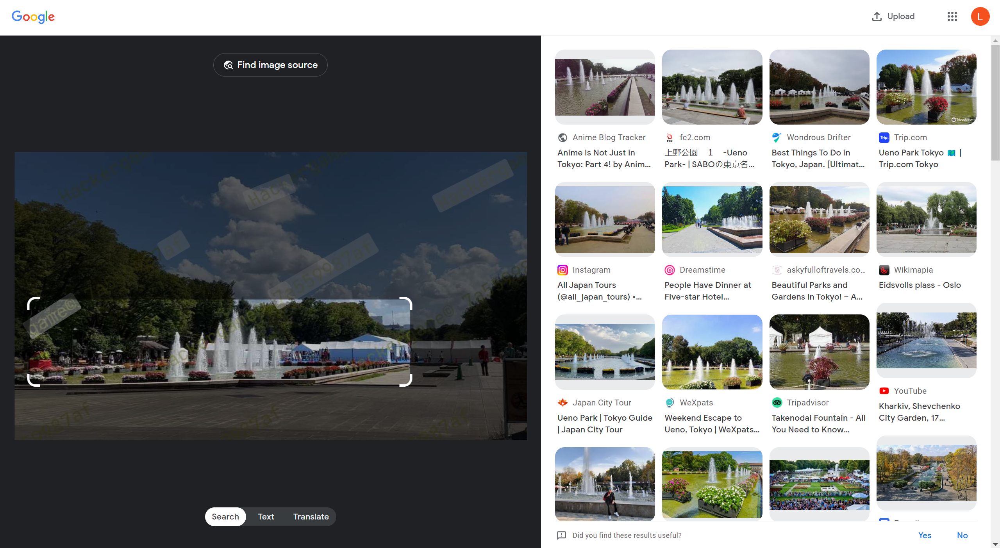

   接下来需要弄清楚喷泉旁边的帐篷里正在进行什么大型活动。谷歌搜索“东京上野公园 活动 2023/8/7 ~ 2023/8/11”，日期范围是 STATPHYS28 学术会议的时间范围，搜索结果第二条的时间恰好是 8 月份，网址为：https://tw.wamazing.com/media/article/a-3054/ 。

   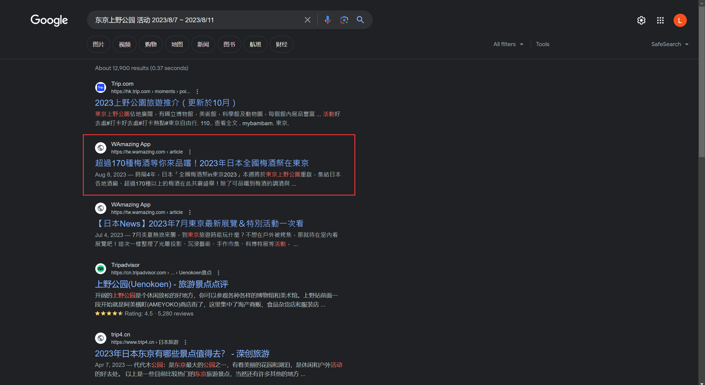

   点进该链接，发现该梅酒品鉴售卖活动为期三天半，与学术会议时间上有重叠，活动地点恰好为上野公园喷泉广场。因此你和学长在喷泉广场看到的活动就是这个梅酒活动。当天下午 15:00 活动才正式开始，中午时分你和学长路过时，忙碌的人们正在搬运和摆放梅酒，进行活动即将开始前的准备工作。由此可知，**你和学长见面这一天的日期为 2023 年 8 月 10 日**，这就是第一小题的答案。该梅酒活动的正式名称为“全国梅酒まつりin東京2023“。谷歌搜索该活动名称可以搜索到该活动的官网：https://umeshu-matsuri.jp/tokyo_ueno/ 。该页面中可以找到招募网址：https://umeshu-matsuri.jp/tokyo_staff/ 。

   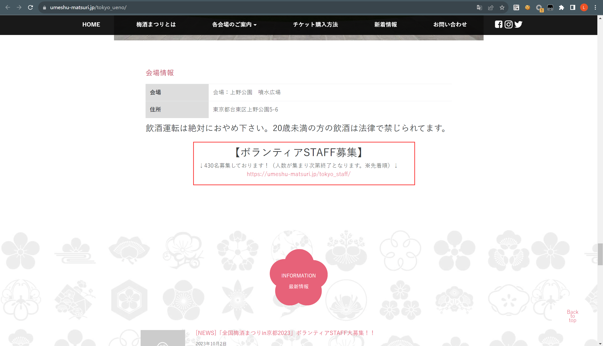

   在招募页面可以找到在线报名问卷的网址：<https://ws.formzu.net/fgen/S495584522>。因此，第三小题的答案为网址的最后一部分 `S495584522`。

   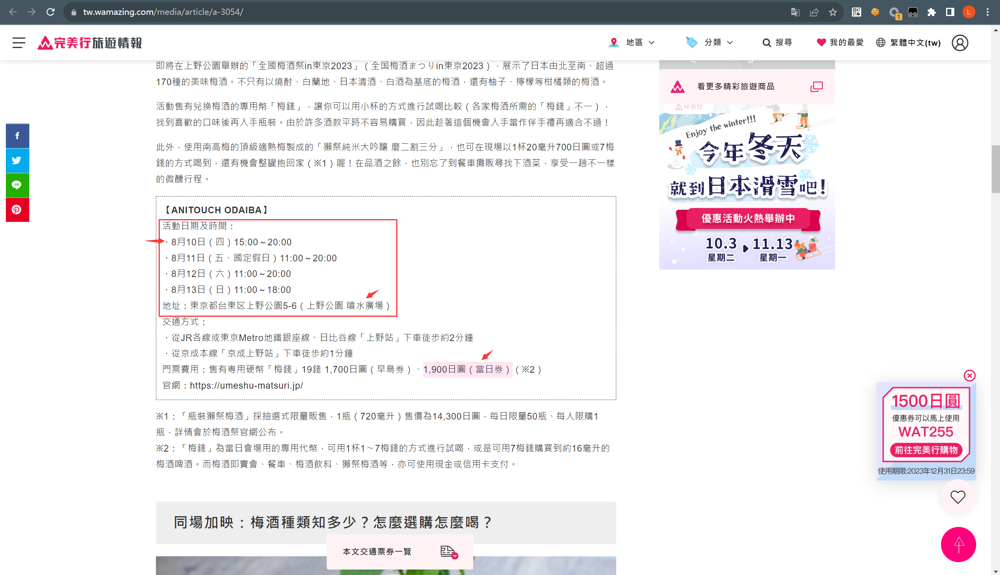

5. 通过谷歌搜索获得东京国立博物馆的官网：<https://www.tnm.jp/?lang=en>。点击“Visitor Information”，下面有"Admissions & Tickets"菜单。 

   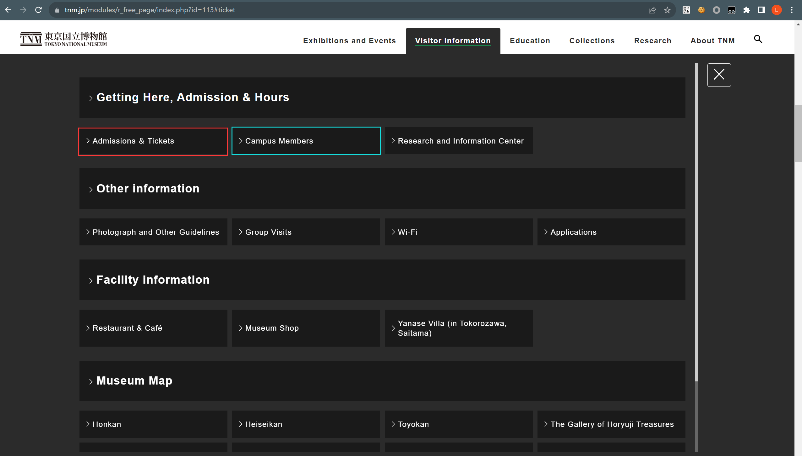

   进入后发现大学生的门票价格为 500 日元。

   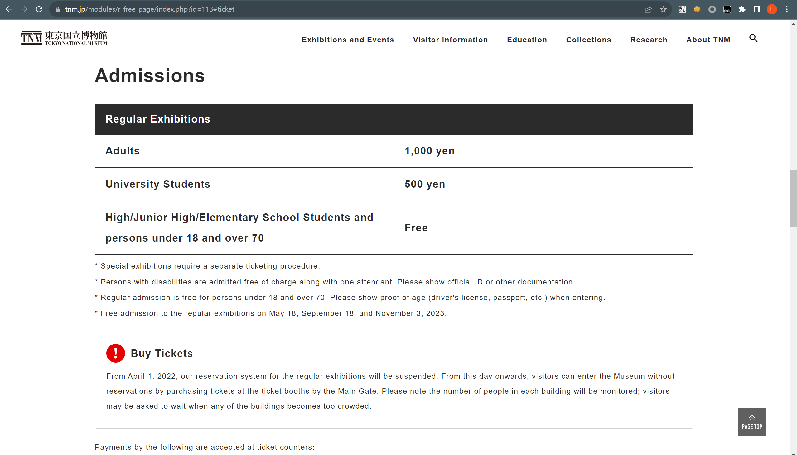

   但是，注意到“Visitor Information”里还有“Campus Members”菜单（网址为：<https://www.tnm.jp/modules/r_free_page/index.php?id=167>），第一段文字提及成员学校的学生可以免费参观常规展览，东京大学（The University of Tokyo）在成员名单中，而学长又是东京大学的学生，因此他免费参观了博物馆的常规展览。所以第四小题的答案为 `0`。

   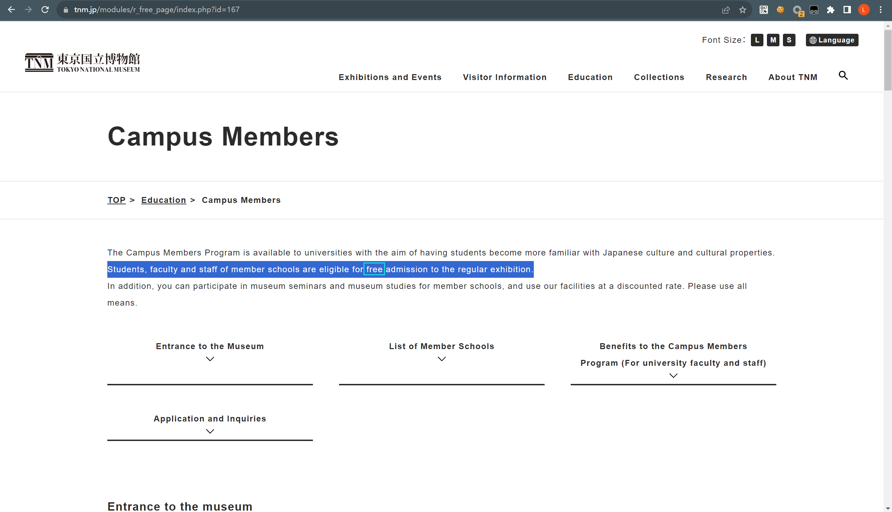

6. 晚上学长与你分开后**继续学术之旅**，打算乘**船**欣赏东京的迷人夜景和闪耀的**彩虹大桥**。结合前面会议官网首页 Banner 位置处的图片，可以联想到学长继续参加了当天晚上的学术会议日程。在 STATPHYS28 [学术会议官网](https://statphys28.org/index.html)的 Program 里可以找到[会议日程表](https://statphys28.org/programtt.html)。

   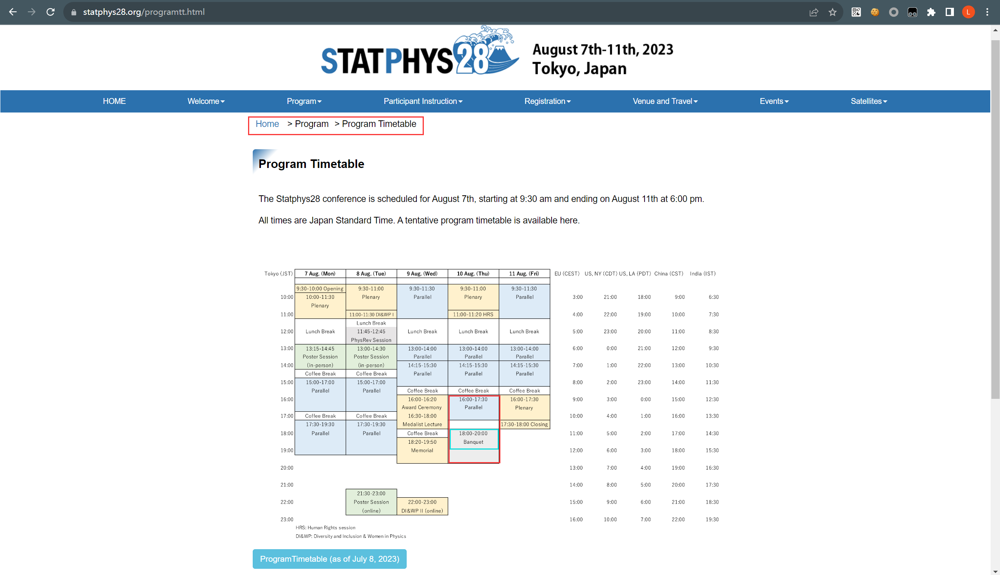

   日程表显示了当天晚上的日程中有“Banquet”。“Banquet”指的是什么呢？在学术会议官网导航栏的“Events”里有[“Banquet”菜单](https://statphys28.org/banquet.html)，该页面标题表明该晚宴是在游船上进行的，参与者可以品尝日式食物、环游东京，欣赏东京夜景。

   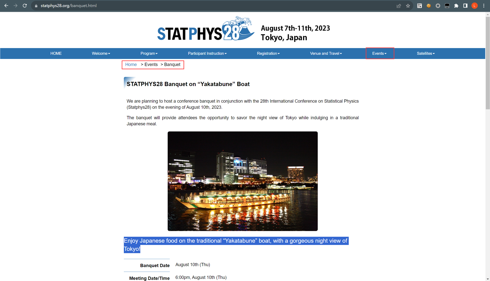

   向下继续浏览，在“Meeting Point”这里可以看到所有参加者当地时间晚上六点时需在按安田讲堂附近集合。因此第五小题的答案为`安田讲堂`。

   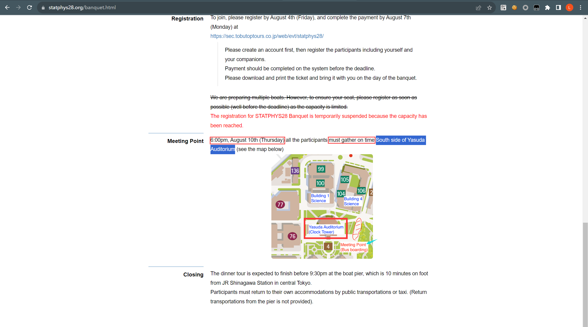

7. 和学长在 JR 上野站分开后，你搭乘了开往马里奥世界的电车。进站时，你在 JR 上野站中央检票口外看到「ボタン＆カフリンクス」活动（即 Buttons & Cufflinks）正在销售动物周边商品。使用[谷歌日本](https://www.google.co.jp/webhp)搜索“ボタン＆カフリンクス 上野駅中央改札口”，第二条搜索结果与你和学长见面这一天时间相近，对应的网址为：https://plaza.rakuten.co.jp/ayumilife/diary/202308110000/ 。

   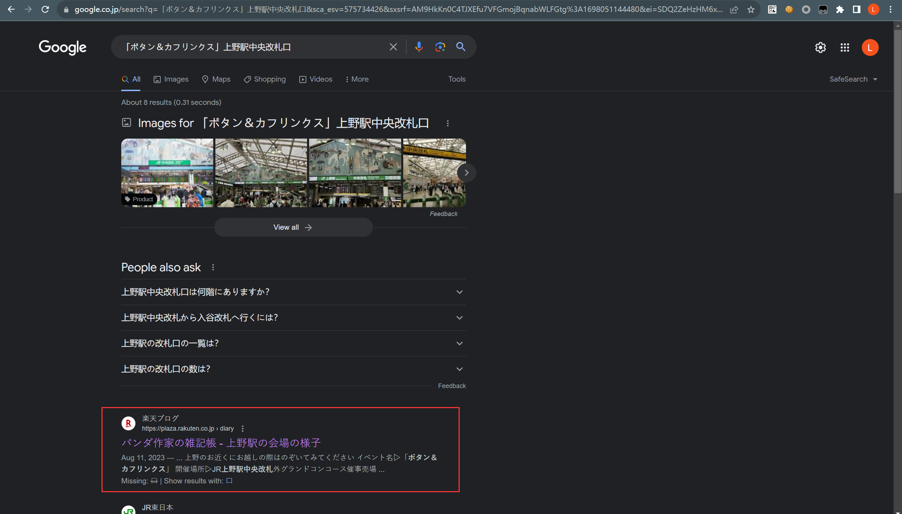

   在该页面可以看到上野站内该活动的摊位图片，以及摊位前面贴着的粉色背景的海报。因此，**粉色背景海报上的动物为熊猫**。

   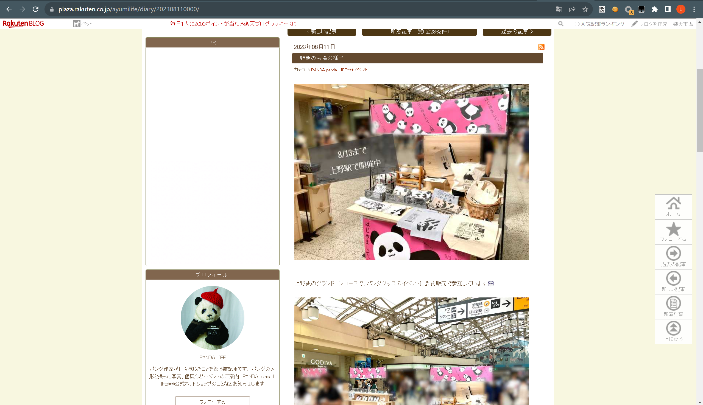

8. 由图四右侧的部分文字可以分辨出“Nintendo Tokyo”，因此你搭乘电车前往的地点为东京任天堂（Nintendo Tokyo）。使用谷歌地图查询下午从上野站至 Nintendo Tokyo 的电车路线，分别有 G 银座线和 JY 山手线两条电车路线。由于你经过了 JR 上野站中央检票口，说明你选择的是 JR 公司的 JY 山手线前往的 Nintendo Tokyo，在渋谷站出站下车（实际上两条电车路线均需要在渋谷站下车）。

   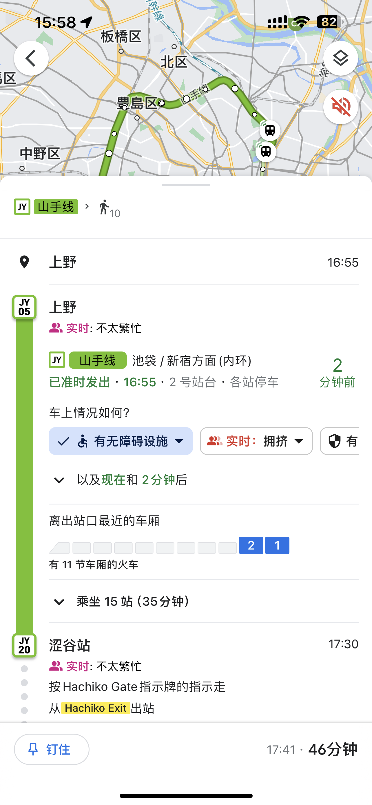

   通过谷歌搜索及[相关资料](https://www.tokyoweekender.com/art_and_culture/entertainment-art_and_culture/tech-trends/3d-billboards-tokyo/)可知，渋谷站附近建筑楼顶的大屏幕每到整点时分就会播放狗狗（**品种为秋田犬**）的报时影像，可可爱爱，呼之欲出。

   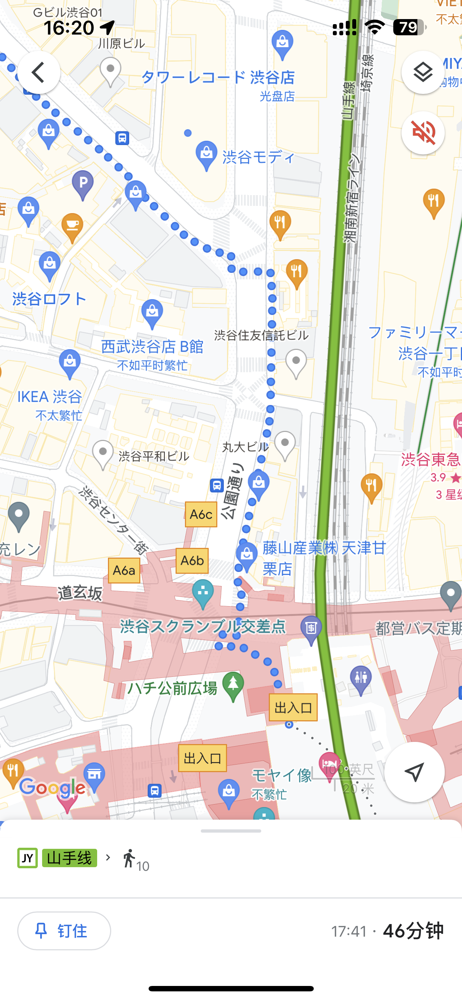

## 题外话

- 渋谷站的"Hachiko Exit"出口得名于日本最著名的秋田犬，忠犬八公。在此出口处，人们可以看到八公的铜像，作为其忠诚与不渝的纪念。今年是忠犬八公诞辰的 100 周年，为此，人们甚至发起了[HACHI100 Project](https://hachi100.visitakita.com/top/en/about/#:~:text=Hachiko%20celebrates%20its%20100th%20birthday,members%20from%20Shibuya%20and%20Odate.)，旨在纪念这条日本最受爱戴的狗狗。

- 题图中透过飞机舷窗可以看到东京湾一侧的风景，也能看到去年”旅行照片 2.0“题目中提及的建筑物千叶海洋球场（ZOZO Marine Stadium）哦。

  

- 该架飞机的航班号是 CZ385，有位群友盲猜一手没有猜对哦。

## 致谢

感谢 [@taoky](https://github.com/taoky) 为本题增加了动态 flag 机制和图片水印。感谢 [@emc2314](https://github.com/emc2314) 、 [@zzh1996](https://github.com/zzh1996) 和 [@liuly0322](https://github.com/liuly0322) 在出题过程中提供的修改建议和指导。

@taoky: 我在改代码的时候，没有充分考虑到「补充说明 1」中的问题，导致一些同学被「答案错误」的提示误导了，在此表示抱歉。
