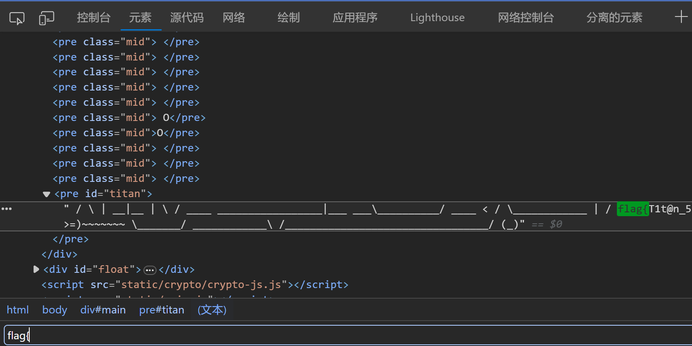
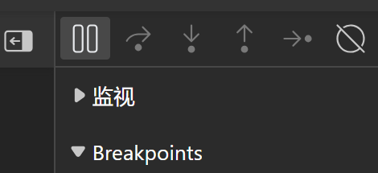
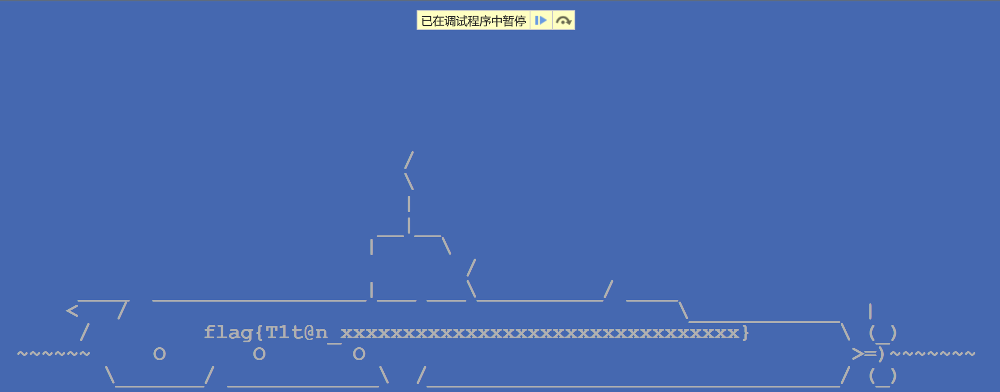

# 更深更暗

题解作者：[PRO-2684](https://github.com/PRO-2684)

出题人、验题人、文案设计等：见 [Hackergame 2023 幕后工作人员](../../credits.pdf)。

## 题目描述

- 题目分类：web

- 题目分值：100

小 E 正在收看电视新闻。

「诶，你知道吗，『泰坦』号潜水艇失事了！」小 E 对旁边的小 C 说。

小 C 凑近电视机，看了一眼新闻里的画面。

「是我眼花了吗？我刚刚有一瞬间好像在残骸上看到了一个 flag？」小 C 惊讶地说。

「玩 CTF 玩的。」小 E 对此不以为然，「一定是你看错了。」

小 C 却十分相信自己没有看错。

## 题解

这是一个可以无限向下滚动的网页，灵感最初来源于 [Endless Horse](http://endless.horse/)。

难度仅次于签到的简单题，有很多种解法。

### 出题时的想法

使用 F12 打开开发者工具，然后在 Elements/元素 里搜索 `flag{`，就可以找到 flag 了。



### 暂停脚本执行

使用 F12 打开开发者工具，进入 Sources/源代码，然后暂停脚本执行



就可以往下滚看到 flag。



### 分析源代码

查看 `static/main.js`，可以看到有这么一个函数：

```js
async function getFlag(token) {
    // Generate the flag based on user's token
    let hash = CryptoJS.SHA256(`dEEper_@nd_d@rKer_${token}`).toString();
    return `flag{T1t@n_${hash.slice(0, 32)}}`;
}
```

这个函数的作用是根据 token 生成 flag，那么复制这个函数到控制台，然后调用 `await getFlag('<Token>')` 就可以得到 flag 了。

> 你不满意于此的话也可以尝试用 Python 重写这段代码。

### 其它解法

- 性能较差的手机/电脑上快速往下滚动，也可以时不时看到一下 flag。手速快截图/录屏回放就可以获取 flag 了。
