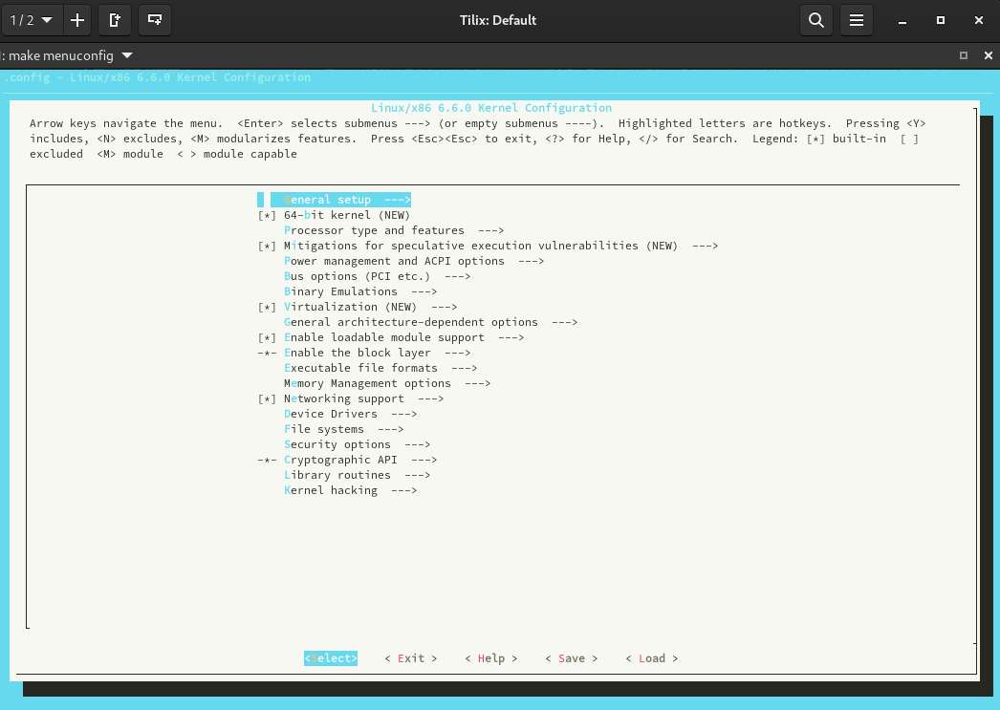
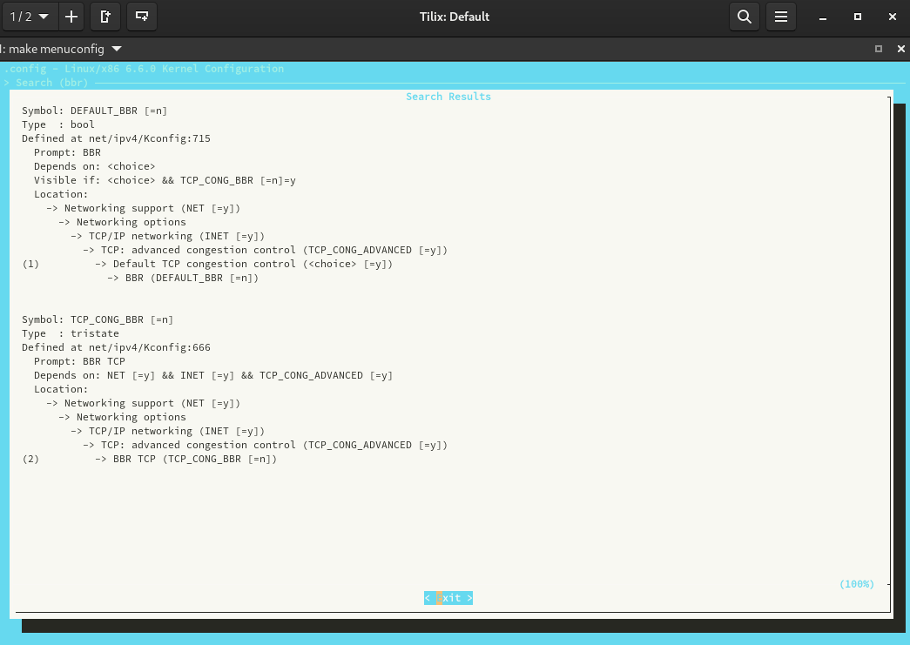
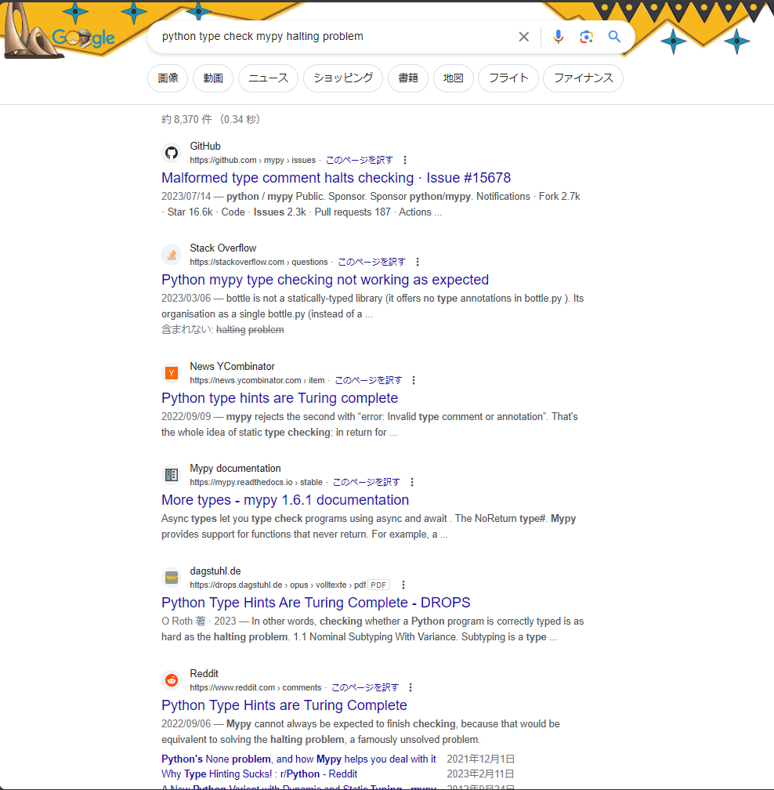
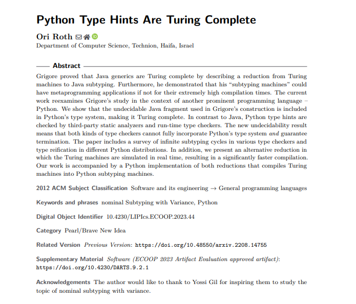
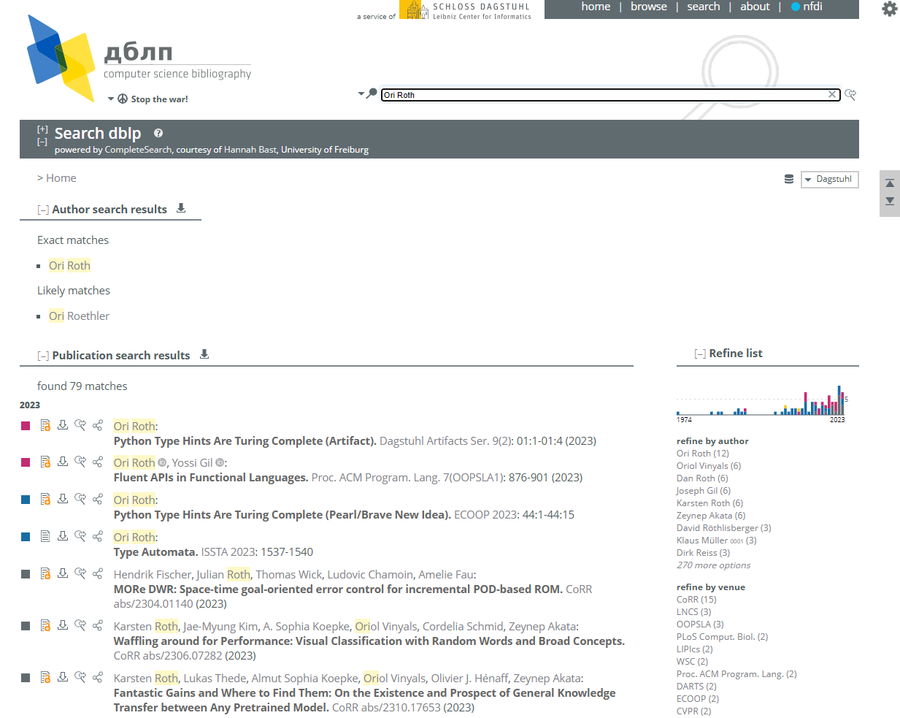

# 猫咪小测

题解作者：[emc2314](https://github.com/emc2314/)

出题人、验题人、文案设计等：见 [Hackergame 2023 幕后工作人员](https://hack.lug.ustc.edu.cn/credits/)。

## 题目描述

- 题目分类：general

- 题目分值：及格喵（100）+ 满分喵（150）


注意看，这只可爱的橙猫猫叫小喵。

只要有阳光的地方就能见到它的身影，只要有鱼干的地方就能听到它的喵声。但今天的小喵有些不同，它的眼神充满了紧张与期待，因为一年一度的风云际会，大师喵主办的全校猫咪小测马上就要开始了。

「在科大，即使身为猫咪，也要兼备充分的科大常识、扎实的数理基础、以及独立的科研能力」大师喵蹲坐在主席台上，目光炯炯。

小喵乖巧地坐在课桌前，爪子紧按着用来答题的鼠标，似乎一松开鼠标就会自己溜走一样。

不得不承认，这场小测并不容易。

「生而为猫，我很抱歉」

后排传来了一声沮丧而近乎绝望的呜咽，应该是今年刚入校的少年喵。本就有着比众喵更小的年龄，其当年足可引以为傲的天赋在科大里却也算不上什么，于是每次测验都只能位居末流。

小喵还没来得及回头，大师喵「噌」地一下从讲台上腾跃而下，扑到后排那名猫咪的身前，用舌头细细梳理这名猫咪的后颈上的绒毛。

「不可以这样说哦，静心努力你也可以做出来的喵~」

啊，大师喵那一如既往的温柔。

少年喵非常感动。「嗯嗯我明白了。それなら別の言い方をしよう：猫として生まれて、すみません」

「给我好好做题（敲），不是要你换一种语言再说一遍啊（kusa）」

「不愧是大师喵」，小喵钦佩地望着大师喵的身影。

「这种说话还能带括号的技巧我也想学！」


提示：**解出谜题不需要是科大在校猫咪**。解题遇到困难？你可以参考以下题解：

- [2018 年猫咪问答题解](https://github.com/ustclug/hackergame2018-writeups/blob/master/official/ustcquiz/README.md)
- [2020 年猫咪问答++ 题解](https://github.com/USTC-Hackergame/hackergame2020-writeups/blob/master/official/%E7%8C%AB%E5%92%AA%E9%97%AE%E7%AD%94++/README.md)
- [2021 年猫咪问答 Pro Max 题解](https://github.com/USTC-Hackergame/hackergame2021-writeups/blob/master/official/%E7%8C%AB%E5%92%AA%E9%97%AE%E7%AD%94%20Pro%20Max/README.md)
- [2022 年猫咪问答喵题解](https://github.com/USTC-Hackergame/hackergame2022-writeups/blob/master/official/%E7%8C%AB%E5%92%AA%E9%97%AE%E7%AD%94%E5%96%B5/README.md)

## 题解

今年猫咪问答四道题目的设计上目标明确：测试和培养选手的基本信息获取能力。四道题目对应了四个方面，校园生活、数理基础、动手能力和论文检索。虽然解出本题并不一定依赖如下条件，但是本题默认选手可以使用 Google，并且所在学校可以提供主流学术期刊会议论文的阅读权限。

> 1. 想要借阅世界图书出版公司出版的《A Classical Introduction To Modern Number Theory 2nd ed.》，应当前往中国科学技术大学西区图书馆的哪一层？

搜索「中国科学技术大学西区图书馆」，前两条结果分别是 [中国科学技术大学图书馆](https://lib.ustc.edu.cn/) 和 [西区图书馆简介](https://lib.ustc.edu.cn/%E6%9C%AC%E9%A6%86%E6%A6%82%E5%86%B5/%E5%9B%BE%E4%B9%A6%E9%A6%86%E6%A6%82%E5%86%B5%E5%85%B6%E4%BB%96%E6%96%87%E6%A1%A3/%E8%A5%BF%E5%8C%BA%E5%9B%BE%E4%B9%A6%E9%A6%86%E7%AE%80%E4%BB%8B/)。点开第一条结果，我们首先尝试在「检索馆藏纸本图书」处检索「A Classical Introduction To Modern Number Theory 2nd ed.」，发现无符合条件的书籍。注意到最后两个单词代表第二版，去掉后检索「A Classical Introduction To Modern Number Theory」的第一条结果即为符合题意的书籍。查看其馆藏信息，可以看到馆藏地在西区外文书库。将鼠标移上去可以看到悬浮字标显示「西区图书馆 12 楼」。如果没有注意到这个 UI 机制，可以通过第二条结果知道外文书库的位置。

> 2. 今年 arXiv 网站的天体物理版块上有人发表了一篇关于「可观测宇宙中的鸡的密度上限」的论文，请问论文中作者计算出的鸡密度函数的上限为 10 的多少次方每立方秒差距？

arXiv 是一个著名的论文预印本网站，作者可以自由上传论文并且公开。为了获取更精确的信息，我们应当尽可能使用英文关键词。搜索「arxiv observable universe chicken density」的第一条结果是一个 pdf 格式的论文，其摘要中提到「We find the most restrictive upper limit from the domains considered to be 10^23 pc^−3」。如果不理解秒差距这个天文单位，可以以之为关键词搜索，在第一条 Wikipedia 结果中得知其单位为 pc。

> 3. 为了支持 TCP BBR 拥塞控制算法，在编译 Linux 内核时应该配置好哪一条内核选项？

使用英文关键词搜索「kernel config bbr」，第一条结果是 [CONFIG_TCP_CONG_BBR: BBR TCP - cateee.net Homepage](https://cateee.net/lkddb/web-lkddb/TCP_CONG_BBR.html)，即为答案。另外，本题可以尝试下载内核源码：Linux 内核官方网站为 [The Linux Kernel Archives](https://kernel.org/)，找到随便一个内核版本：

```bash
wget https://cdn.kernel.org/pub/linux/kernel/v6.x/linux-6.6.tar.xz
tar xvf linux-6.6.tar.xz && cd linux-6.6
# 使用图形界面配置内核需要安装 C 编译器以及一些额外的库
# sudo apt install libncurses-dev flex bison
make menuconfig
```
可以进入如下界面：



按下 ```/``` 按钮，搜索「bbr」，可以得到两条结果：



第一条是默认使用 BBR 的配置，而第二条即为启用 BBR 的内核选项。在选项名前加上「CONFIG_」即可。

> 4. 🥒🥒🥒：「我……从没觉得写类型标注有意思过」。在一篇论文中，作者给出了能够让 Python 的类型检查器 ~~MyPY~~ mypy 陷入死循环的代码，并证明 Python 的类型检查和停机问题一样困难。请问这篇论文发表在今年的哪个学术会议上？

这道题难度略有提升。使用「python type check mypy halting problem」为关键词，第 5 条结果为一篇论文：


点击进入发现这篇论文被发表在 ECOOP 2023 上。



在比赛刚开始的几天，这条结果的权重还没有这么高。但是基本上可以搜索到 [Python Type Hints are Turing Complete](https://arxiv.org/abs/2208.14755) 这个 arXiv 的链接。为了找到这篇论文的发表情况，我们可以在 dblp.org 网站上搜索作者名：



从而得知本题答案。

## 其他

<details>
<summary>@taoky: 关于第四题</summary>

第四题的源头是被最后砍掉的一道我出的题目（因为太简单 + 无聊，这道 Python 的沙箱题绕过太轻松了），原题目如下：

```markdown
# It's MyPY!!!!!

- 题目分类：general

- 题目分值：我不会再触发段错误了（150）+ 满脑子都只想着类型呢（150）

「我要把我们的 Python 代码库的类型标注全部删掉。」

「诶？」

「为什么？出什么事了吗？如果我们有不好的地方，可以改……」

「这是我自己的想法。」

「为什么……之前写类型标注多开心呀，你也说过之后也会写吧。」

「我没说过。」

「但是，提出要加类型标注的是你……」

「好好沟通一下，好吗？难得之前都挺开心的，你也这么觉得吧。」

「**我……从没觉得写类型标注有意思过。**」

---

第一小题中，
你需要给出能够让 mypy 1.5.1 段错误（Segmentation Fault）的 Python 代码。
代码会被 mypy 检查，但不会被执行。

第二小题中，
你需要给出在 strict 模式下能够通过 mypy 检查的代码。该代码会作为模块导入，执行时如果
判定脚本认为你的模块抛出了 `TypeError` 异常，则视为成功（具体信息详见题目附件）。
```

文案灵感来源于 Ruby on Rails 的作者 DHH [在 Turbo 中删除了所有的 TypeScript 代码](https://github.com/hotwired/turbo/pull/971)。（~~DHH 祥子说？~~）

然后第一小题（预期解就是找到这篇论文，然后直接用里面的 payload）最后就变成了本次猫咪小测的第四题，当然不至于猫咪小测后端还跑个 mypy 看它崩不崩，所以就变成了文献搜索题。这道的文案梗也随之散落在了其他题目里面。

另外给大型 Python 项目加（能通过 mypy 检查的）类型标注确实是件头疼的事情：


*「我……从没觉得写类型标注有意思过」*

</details>