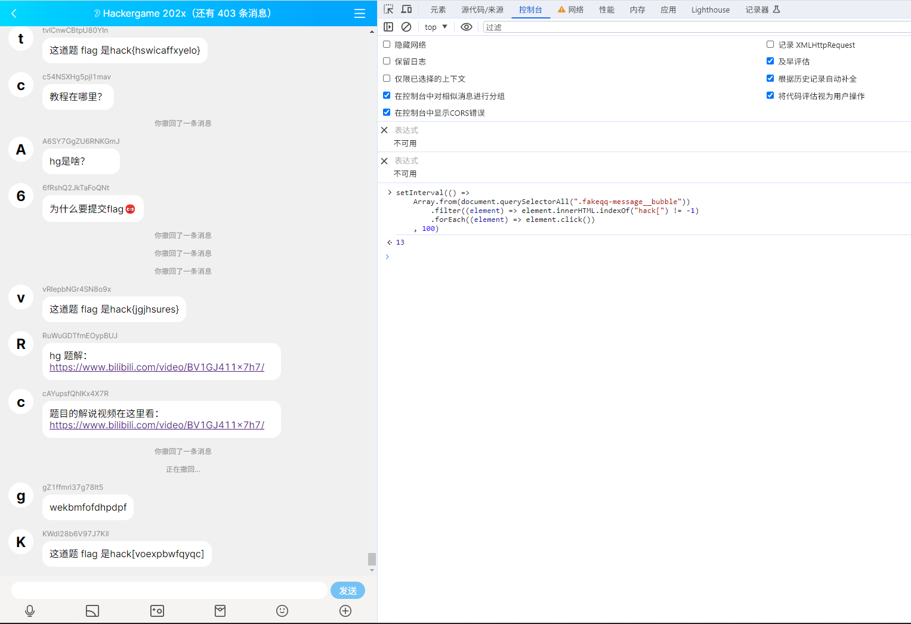
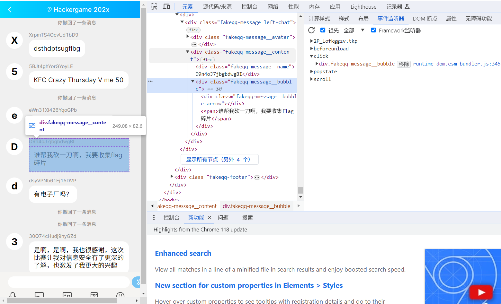

# 组委会模拟器

题解作者：[lly](https://github.com/liuly0322)

出题人、验题人、文案设计等：见 [Hackergame 2023 幕后工作人员](../../credits.pdf)。

## 题目描述

- 题目分类：web

- 题目分值：200

每年比赛，组委会的一项重要工作就是时刻盯着群，并且撤回其中有 flag 的消息。今年因为人手紧张，组委会的某名同学将这项工作外包给了你，你需要连续审查 1000 条消息，准确无误地撤回其中所有含 flag 的消息，并且不撤回任何不含 flag 的消息。

本题中，你需要撤回的 "flag" 的格式为 **`hack[...]`**，其中**方括号**内均为小写英文字母，点击消息即可撤回。你需要在 3 秒内撤回消息，否则撤回操作将失败。在全部消息显示完成后等待几秒，如果你撤回的消息完全正确（撤回了全部需要撤回的消息，并且未将不需要撤回的消息撤回），就能获得本题**真正的 flag**。

## 题解

这道题是 @volltin 的 idea，@taoky 完成了实现，@zzh1996 和 @emc2314 增加了更多群信息的文案。

尝试一下会发现群消息产生的速度非常快，手工完成是不可能的，因此我们需要写一个脚本来帮我们完成撤回任务。

下面的脚本会每隔 100 毫秒查找出网页中的所有可点击的消息元素，并撤回所有内容包含 "flag" 的消息。撤回操作通过模拟元素点击来完成。

```javascript
setInterval(() =>
    Array.from(document.querySelectorAll(".fakeqq-message__bubble"))
        .filter((element) => element.innerHTML.indexOf("hack[") != -1)
        .forEach((element) => element.click())
    , 100)
```

右键检查或按下 F12 键打开浏览器的开发者工具，选择「控制台」。将该脚本粘贴到控制台中，刷新页面（以重新开始题目）后按下回车执行脚本，就能自动撤回了。所有消息加载完毕后再稍等几秒，即可看到真正的 flag。



关于如何找到所有「可点击的」消息元素：可以通过浏览器的检查元素功能来查看消息的 HTML 结构，发现 `click` 事件绑定在了具有 `.fakeqq-message__bubble` 类名的 `<div>` 元素上，所以只要点击任意它的子元素（或它本身）就能触发撤回操作。



## 彩蛋

本题理论上也能通过分析并模拟网络请求来完成。可以发现前端首先是通过 `/getMessages` 接口获取所有消息以及它们的出现时间，然后撤回操作会使用 `/deleteMessage` 撤回某条消息，最后通过 `/getflag` 接口检验是否正确处理所有消息。所以可以带上自己的 cookie（从浏览器中复制或向完整的带有 token 的题目 URL 发送请求获取），通过发送请求来模拟所有的撤回操作。

使用这种方法需要等待某条信息「出现」后才能发送撤回请求，否则会提示「检测到时空穿越」，撤回失败。(/= _ =)/~┴┴

## 其他

@taoky:

本题前端界面基于 [Redlnn/Fake-QQ-Chat-Window](https://github.com/Redlnn/Fake-QQ-Chat-Window)（MIT License）修改，在此表示感谢。

此外这里是[模拟器会发的消息列表](src/src/backend/app/main.py#L84-L181)。
