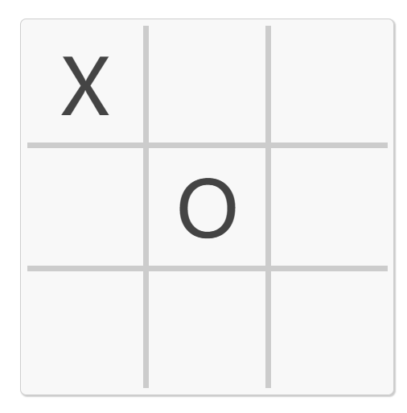
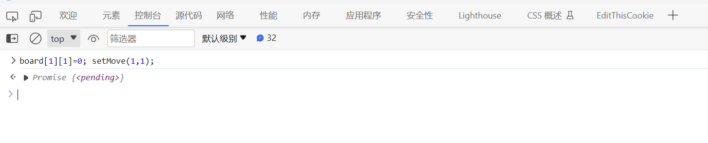
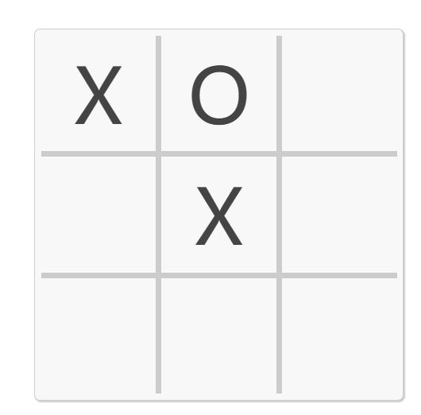
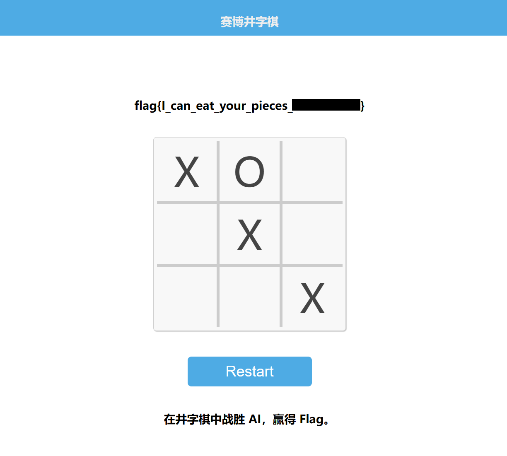
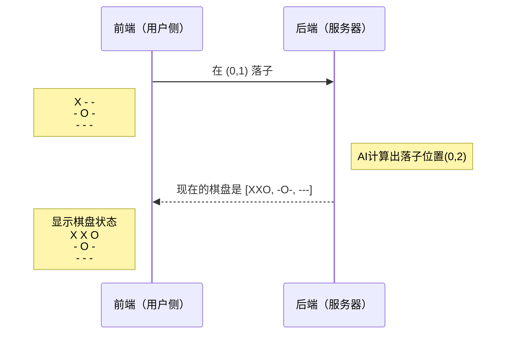
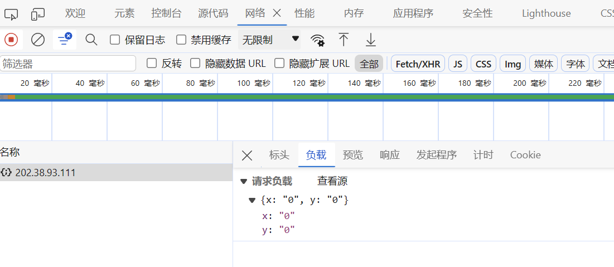
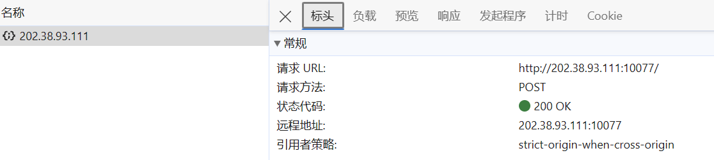
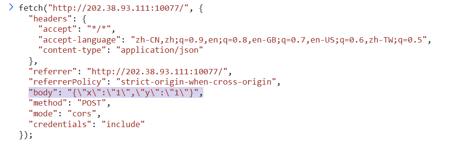
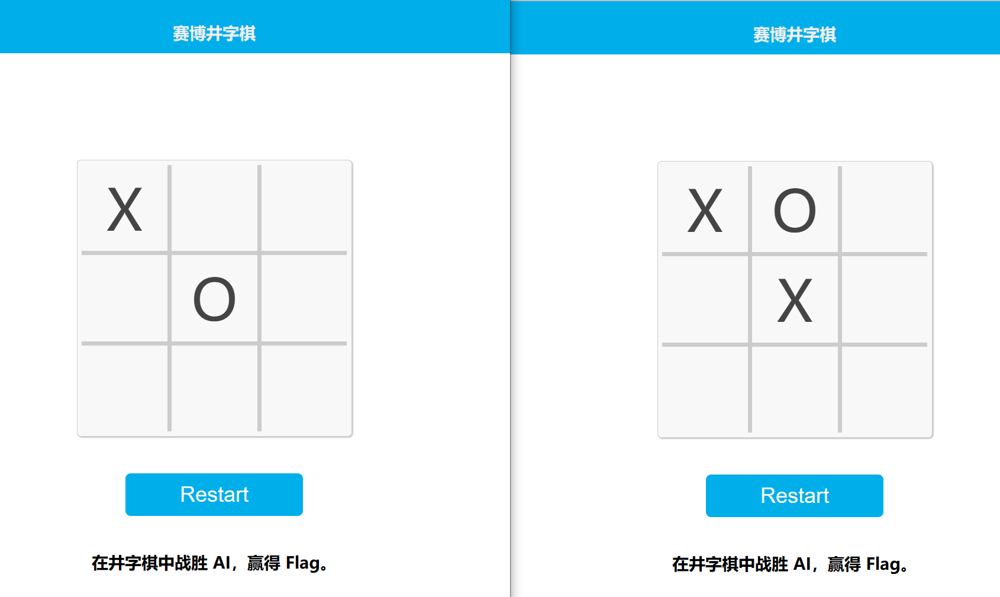

# 赛博井字棋

题解作者：[ldeng-ustc](https://github.com/ldeng-ustc)

出题人、验题人、文案设计等：见 [Hackergame 2023 幕后工作人员](https://hack.lug.ustc.edu.cn/credits/)。

## 题目描述

- 题目分类：web

- 题目分值：150

那一年的人机大战，是 AlphaGo 对阵柯洁，最终比分 3-0。当时我看见柯洁颓坐在椅子上泣不成声，这个画面我永生难忘。那一刻我在想，如果我能成为一名棋手，我一定要赢下人工智能。如今 AI 就在眼前，我必须考虑这会不会是我此生仅有的机会。重铸人类围棋荣光，我辈义不容辞！

……

但是围棋实在太难了，你决定先从井字棋开始练习。

## 题解

拍脑袋想的简单题，没给后端代码所以可能稍微需要一点点脑洞。

实际上落子位置只在前端做了验证，所以可以发请求将棋子落在对方的棋子上，从而“吃掉”对方的棋子。如果不是萌新，看到这行应该就足够了，后面的内容都是方便萌新理解和复现（不过大佬谁会来看这题的题解啊）。

### 解法演示

没有什么题解比直接体验一次战胜 AI 来得更直接了，所以这里我们先抛开原理，尝试用最简单的方式复现一遍战胜 AI 的过程吧！

下面的步骤以比较常见的 Chrome 浏览器或 Microsoft Edge 浏览器为例，大部分常见浏览器都能用类似方法复现：

1. 首先我们打开题目网站，**往棋盘左上角下一步棋**，此时棋盘状态如下图，AI 立即占据了棋盘中央。



2. 很明显，如果棋局正常，我们是不可能取得胜利的，所以我们需要用特殊手段，“吃掉”AI 下在棋盘中央的这颗子。我们可以**按 F12 键打开浏览器的开发人员工具**，如下图，在弹出的界面中选择**控制台**，在 `>` 后输入指令 `board[1][1]=0; setMove(1,1);` 然后按 `Enter` 键执行指令。



3. 此时，我们**刷新网页**，会发现局面变成了如下情况。棋盘中间变成了我们的棋子，而 AI 则又在棋盘上方下了一颗棋子。这是怎么做到的呢？原来，刚刚运行的指令绕过了游戏的检测机制（在之后的原理介绍中会详细说明），把我们的棋子下在了棋盘上已经有对方棋子的位置上，看起来就像吃掉了 AI 的棋子一样。



4. 接下来，我们只要再**在右下角落下最后一子**，就能获得游戏胜利，拿到 flag 了！



### 原理解析

实际上，一个网页通常分为前端和后端。前端运行在用户本地，通常负责将数据展示和页面绘制，例如在本题中，将棋子数据显示在棋盘上就是前端的工作。而后端运行在服务器上，通常负责数据处理等“幕后”工作，例如本题里，井字棋 AI 就运行在后端。我们的落子位置会发送给后端，然后 AI 根据棋盘当前状态和我们的落子位置，计算出落子位置，并将落子后的棋盘状态返回给前端。如下图，显示了一次落子时，前后端的交互情况。



因为前端运行在用户侧，实际上可以很轻易的被用户修改，所以通常不应该把关键的数据检查工作放在前端。而在本题中，确认用户落子位置没有其它棋子的验证工作就放在了前端。我们在棋盘随意一个格子上右键单击，选择“检查”，就能看到棋盘的 HTML 代码如下：

```html
<table id="tab-tic-tac-toe" cellspacing="0"><tbody>
    <tr>
        <td id="00" onclick="clickedCell(this)" style="color: rgb(68, 68, 68);"></td>
        <td id="01" onclick="clickedCell(this)" style="color: rgb(68, 68, 68);"></td>
        <td id="02" onclick="clickedCell(this)" style="color: rgb(68, 68, 68);"></td>
	</tr>
    ...
</tbody></table>
```

我们可以看到代码里有 `onclick="clickedCell(this)"` ，这说明在棋盘格子被单击时，会运行 `clickedCell(this)` 函数。我们在开发者工具中点击“源代码”，在左边打开 `static/script.js` 就能看到前端运行的 JavaScript 代码，在其中可以找到 `clickedCell` 和 `setMove` 两个函数。阅读代码可以发现，`clickedCell` 实际上调用了 `setMove(x,y)` ，将落子位置发送给服务端，而 `setMove` 函数的代码里，在第一行先检查了棋盘指定位置是否是空的。因此，只要绕开这个检查，就能在棋盘不是空的地方落子。

```javascript
async function setMove(x, y) {
  if (board[x][y] != 0) {   // ***** 这一行是关键 *****
    return;
  }
  if (frozen) {
    return;
  }
  let url = window.location.href; // 获取当前 URL
  let data = { x: x, y: y }; // 设置要发送的数据
  return fetch(url, {
    method: "POST", // 设置方法为 POST
    headers: {
      "Content-Type": "application/json", // 设置内容类型为 JSON
    },
    body: JSON.stringify(data), // 将数据转换为 JSON 格式
  }).catch(errorHandler);
}

```

绕开这个检查的方式有很多，前面我们演示了在控制台里输入指令 `board[1][1]=0; setMove(1,1);`  这行指令实际上先将前端保存的棋盘状态的 `board` 数组里的 (1,1) 位置改为 0，这样前端就会认为这个位置没有棋子，再调用 `setMove(1,1)` 往这个位置落子。实际上，我们也可以只运行 `board[1][1]=0`，然后手动单击棋盘中央的位置，也可以在这个已经有对方棋子的位置落子。

另一个更直接的绕开检查的方式是，直接把检查的代码删除（由于前端代码完全运行在客户端上，代码几乎是任用户修改的）。我们可以尝试在刚刚打开的`script.js`里，直接把 `setMove` 的前三行删除，按 `Ctrl+S`保存，回到网页后，就会发现棋盘上任何位置都可以随意落子了。（注意不要刷新页面，否则代码会被重新加载。）

当然，我们也可以通过开发者工具中的“网络”功能直接记录浏览器发送的请求。如图，实际上向服务器发送的请求是一个带坐标的 JSON 格式数据。我们也可以直接根据请求的格式，构造在任何位置落子的请求。最简单的方式是，在记录的请求上单击右键，选择“复制” -> “复制为 fetch”，然后在控制台中粘贴，修改 `fetch` 调用中的 `body` 后的坐标，再运行即可。







上面的种种方法都说明了，前端验证可以很容易地被绕过。通常，前端验证只应该用来改善"用户体验"，提供即时反馈（例如我们不需要先发送请求到服务器，才能知道某个位置能不能落子）。然而，不能因为数据在前端验证过，就不在后端重新验证。特别是在关键数据上，仅做前端验证往往会带来严重的漏洞。


### 有趣的解法

（感谢 @lly 发现这个解法。）

除了上述需要修改请求的解法外，还有选手发现，可以同时打开两个题目页面，在第一个页面落子后，在第二个页面下在 AI 棋子的位置上，也可以吃掉 AI 的棋子。这是因为两个页面前端是不实时同步的，所以第一个页面落子后，第二个页面的前端代码仍然认为棋盘是全空的，看起来棋盘还是空的，可以在任意位置落子。

如下图，是先在页面 1 的坐标 (0, 0) 落子，再在页面 2 的坐标 (1, 1) 位置落子后的结果，也成功吞掉了 AI 的棋子。（刷新页面状态就同步了。）




PS: 本体的井字棋前端和 AI 是基于 [Cledersonbc/tic-tac-toe-minimax](https://github.com/Cledersonbc/tic-tac-toe-minimax) 修改的。代码已开源，请参考 [src](./src) 下的文件。
