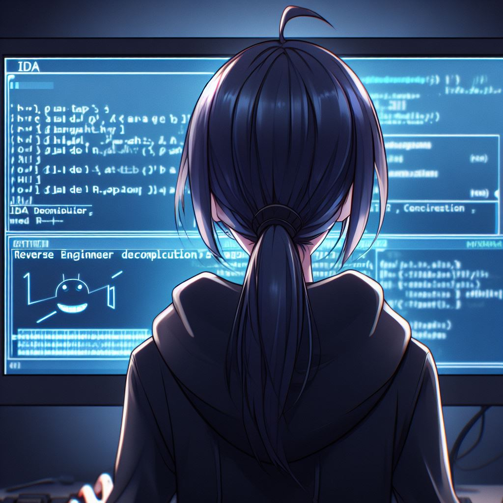
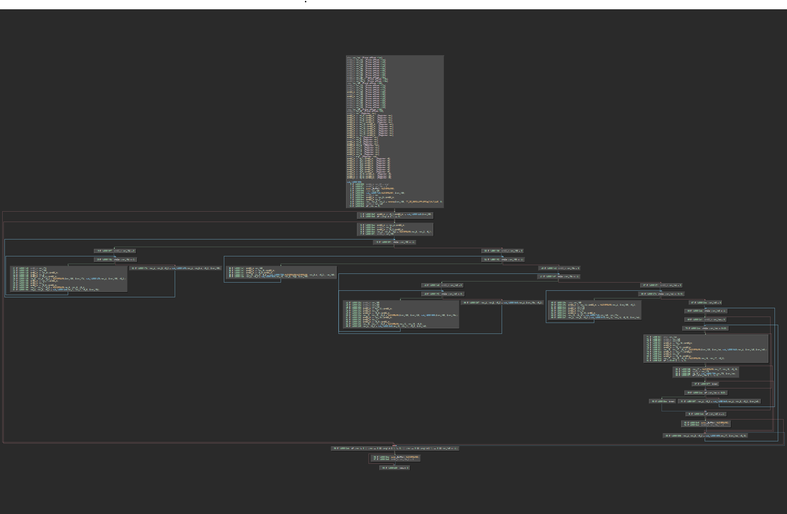

# 逆向工程不需要 F5

题解作者：[emc2314](https://github.com/emc2314/)

出题人、验题人、文案设计等：见 [Hackergame 2023 幕后工作人员](https://hack.lug.ustc.edu.cn/credits/)。

## 题目描述

- 题目分类：binary

- 题目分值：250


「呜呜呜，在 IDA 里按下 F5 之后还是看不懂怎么办！在线等，很急！」

逆向萌新瑟瑟发抖，已在二进制的世界中彻底迷失。

别怕！世界上并不只有 F5 这一个快捷键，逆向工程也不只有反编译器这一个工具。

其实，正如电子竞技不需要视力，逆向工程也不需要 F5。F5 充其量只是前人为新手设计的小小便利。好比老司机开车从来都拒绝使用自动挡，在真正的逆向工程中，越是硬气的人越是喜欢让自己那二极管的思维和二进制的数据亲密贴贴。

而对于某些长期隐世不出的逆向高手来说，他们甚至可能连 IDA 是什么都没听说过。

但也不必艳羡，这道 Hackergame 赛题将带你领略这难得一遇的高手体验。

**[打开/下载题目](files/no_need_for_F5.zip)**

## 题解

一直感觉近来 Hackergame 缺少那种传统而中规中矩的逆向题。虽然各种 esolang 各种字节码确实好玩，但是考虑到 Hackergame 毕竟是面向新手的入门级比赛，还是应该多多接触一下最常见的 x86-64 Windows PE 程序的逆向。这也是这道题目本可以但是没有编译出 Linux ELF 的原因。

但是给 Hackergame 出逆向题的难度并不好控制，朴实无华的 F5 送分题也未免太过无趣。所以本题的目标非常明确：只会打开 IDA 然后按下 F5 的同学多半是做不出来的。此外还有一个好处，就是可以让不愿意使用盗版并且没有正版 IDA 的同学感到更加公平。这一呼声在历年的调查问卷中颇有人气。

但是单靠花指令或是破坏 IDA 的栈分析从而破坏反编译器的结果的技术如今已经不太流行。为了让同学们亲切感受到近十年基于编译器框架的 IR 级混淆技术，本题专门写了一个自动把函数提取成单独一个 module 的 LLVM 插件，再配合上把 Basic Block 提取成函数的功能，就可以让一串简单的代码难以一次性通过 IDA 反编译出来。

本题代码非常简单：
```c
typedef union {
  uint8_t u8[32];
  uint16_t u16[16];
  uint32_t u32[8];
  uint64_t u64[4];
  unsigned __int128 u128[2];
} U;

int main() {
  char input[39];
  puts(HACKERGAME0);
  scanf_s(HACKERGAME1, input, 39);
  if (memcmp(input, "flag{", 5) || memcmp(input + 37, "}", 2)) {
    goto error;
  }
  U *u = (U *)(input + 5);
  for (int r = 0; r < 4; r++) {
    for (int m = 0; m < 2; m++) {
      u->u128[m] *= 0x55AA00FF ^ (r << 4);
    }
  }
  for (int l = 0; l < 4; l++) {
    u->u64[l] ^= 0x7A026655FD263677ULL;
  }
  for (int r = 0; r < 4; r++) {
    for (int k = 0; k < 8; k++) {
      u->u32[k] *= 0xDEADBEEF ^ (r << 2);
    }
  }
  for (int j = 0; j < 16; j++) {
    u->u16[j] ^= 0xCDEC;
  }
  for (int r = 0; r < 4; r++) {
    for (int i = 0; i < 32; i++) {
      u->u8[i] *= 0x21 ^ (r << 1);
      if (r == 3) {
        if (u->u8[i] != HACKERGAME[i]) {
          goto error;
        }
      }
    }
  }
  puts(HACKERGAME2);
  return 0;
error:
  puts(HACKERGAME3);
  return 0;
}
```

其实通过调试器简单跟踪一下代码，应该也能发现本题中对输入进行的计算都非常简单。虽然每个基本块的功能被提取出来，但是整个程序的控制流还可以通过静态分析工具看出来几个大的循环。



不知道同学们有没有在自己开始逆向之前，先把文件丢给 angr 之类的符号执行工具中先跑一跑的习惯。如果有的话，那这道题其实可以几分钟就解出来了：
```python
import angr, monkeyhex, claripy
proj = angr.Project('no_need_for_F5/main.exe')
flag_chars = [claripy.BVS('flag_%d' % i, 8) for i in range(32)]
flag = claripy.Concat(*[claripy.BVV(b'flag{')]+flag_chars+[claripy.BVV(b'}\x00')])
state = proj.factory.call_state(0x140001000)
input_addr = 0

@proj.hook(0x140001093, length=5)
def get_input(state):
    global input_addr
    input_addr = state.regs.rdx
    state.memory.store(input_addr,flag)
    print('Input done')

@proj.hook(0x140001079, length=5)
def printf(state):
    return

simgr = proj.factory.simgr(state)
simgr.explore(find=0x1400013A1, avoid=0x1400013B7)
simgr.found[0].solver.eval(flag).to_bytes(39,"big")
```