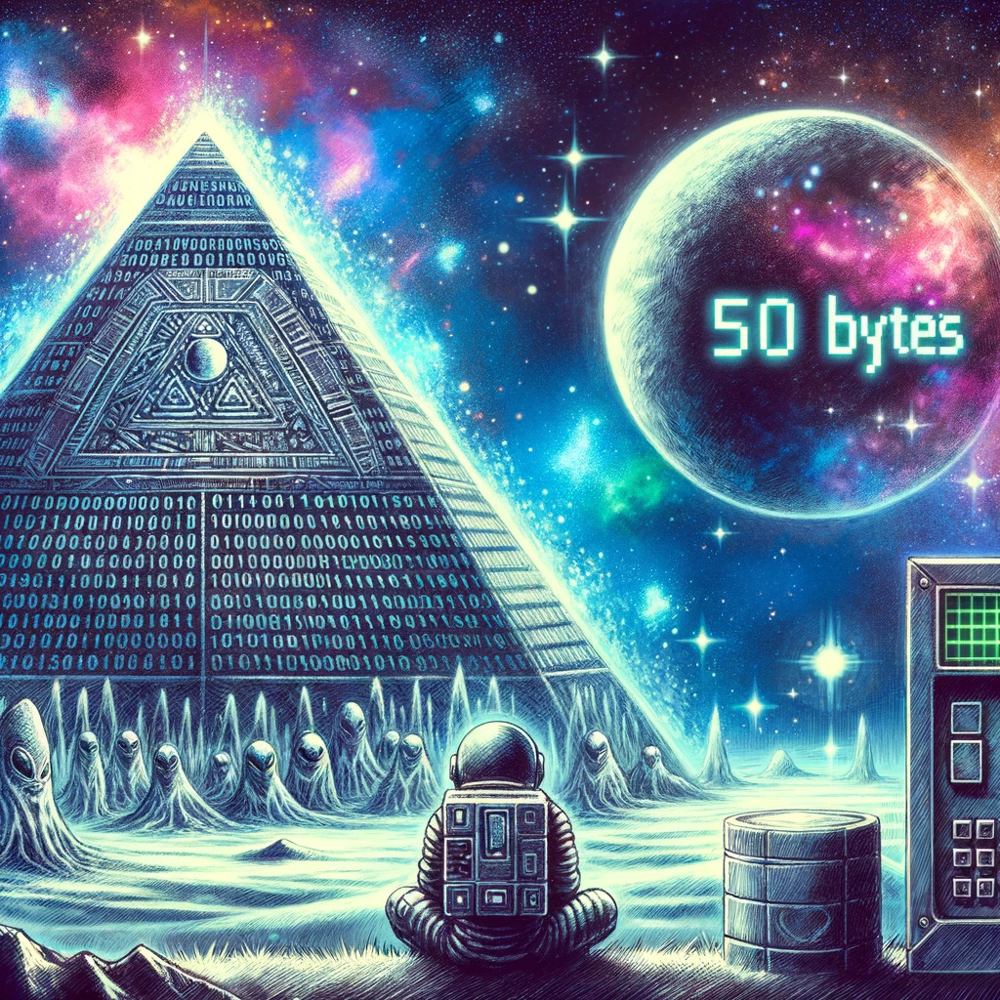

# 🪐 低带宽星球

题解作者：[taoky](https://github.com/taoky)

出题人、验题人、文案设计等：见 [Hackergame 2023 幕后工作人员](https://hack.lug.ustc.edu.cn/credits/)。

## 题目描述

- 题目分类：general

- 题目分值：小试牛刀（150）+ 极致压缩（250）

> 包含 AI 辅助创作



茫茫星系间，文明被分为不同的等级。每一个文明中都蕴藏了一种古老的力量 —— flag，被认为是其智慧的象征。

你在探索的过程中意外进入了一个封闭空间。这是一个由神秘的低带宽星人控制着的星球。星球的中心竖立着一个巨大的三角形任务牌，上面刻着密文和挑战。

低带宽星人的通信速度很低，只能以 1 字节 / 天的速度接受信息，所以在这个星球上，你需要将一张图片用很少的字节数传输给低带宽星人，然后获得 flag。具体来说你需要将一张图片无损压缩（每个像素的颜色都一致）：

- 压缩至 2KiB (2048 字节) 及以下，获得 flag1；
- 压缩至 50 字节及以下，获得 flag2。

[题目后端环境下载（Dockerfile 与脚本）](files/image-compressor-backend.zip)

## 题解

这题的难度梯度可能有一点问题：第一小问很简单，但是第二小问似乎太难了（提示也不足）。中间再加一问可能会好很多（从下面的测试结果来说，如果要加小问，200 字节可能比较合适）。这里向在这道题第二小问上花了很长时间还是没做出来的同学道歉。

首先每个人拿到的图片是不一样的（但是都验证过可解），然后第一小问找一个 PNG 的无损压缩软件就成，可以用 `optipng`：

```
optipng --keep -o1 image.png
```

或者像某个 flag 里面塞的私货一样用 flatpak 装 curtail 然后把图片拖进去压缩即可（PS：比赛期间它更新了，然后压缩 PNG 的功能就坏了，可能是被 hg 的重力场文案扭曲了）。

第二个 flag 的关键点是需要从 libvips 下手，可以注意到附件的比较器没有用 Python 最常见的 Pillow 库，而是用了 pyvips。所以关注点是 libvips 支持的图片格式（特别是比较少见的图片格式）。并且用传统的图片压缩的方法，做到 50 bytes 是几无可能的（更何况还要考虑文件头），所以肯定需要特殊的文件格式——能够用很小的空间就表示图上有三个色块的格式。

最容易想到的是 SVG，但是不幸的是 SVG 是纯文本格式，而表示三个色块就已经超过 50 bytes 了。在验题的时候测试过：即使像素比较脚本留了 LFI（本地文件包含）的漏洞，50 bytes 也是不够的。

一种发现是 JXL 的思路是：

1. 翻 <https://packages.debian.org> 上 libvips42 的[依赖](https://packages.debian.org/bookworm/libvips42)，可以大致看到它支持的图片格式（使用的图片库），一些比较新或者不太熟悉的格式包括 WebP, Whole Slide Images（给显微镜用的）, JPEG 2000, EXR（给电影行业用的）, JPEG XL, HEIF, FITS（给天文学用的）；
2. 简单搜资料可以排除掉一些，比如说 WSI（里面是用 JPEG 之类的方法压缩的），EXR（官网很简单的样例文件甚至一个都要几十 K，从 [layout](https://openexr.com/en/latest/OpenEXRFileLayout.html) 看也没有可以下手的地方），FITS（头很长而且是 ASCII，50 字节完全不够用）。然后对剩下的几种格式去官网（或者相关网站）翻一遍信息：
    - WebP: <https://developers.google.com/speed/webp?hl=zh-cn> or <https://developers.google.cn/speed/webp?hl=zh-cn>。支持无损压缩，但是可以用 `cwebp` 试一下：
        ```
        > cwebp -lossless image.png -z 9 -o image.webp
        Saving file 'image.webp'
        File:      image.png
        Dimension: 1024 x 1024
        Output:    172 bytes (0.00 bpp)
        Lossless-ARGB compressed size: 172 bytes
        * Header size: 45 bytes, image data size: 102
        * Lossless features used: PALETTE
        * Precision Bits: histogram=5 transform=4 cache=0
        * Palette size:   3
        ```
        甚至 header 就要 45 bytes，怎么说剩下 5 个 bytes 也装不下了。
    - JPEG 2000: JPEG 2000 的无损压缩……额……我自己测试下来感觉不如 PNG。
    - HEIF: <https://nokiatech.github.io/heif/>。HEIF 是一个容器，然后里面可以是 AVIF 或者需要专利费的 HEIC。用十六进制编辑器打开一个 HEIF 文件可以发现，它首先需要一个 `ftyp` box，这个 box 就需要 (8 + 12) bytes，剩下只有 30 bytes 了，我自己也查了资料，想不出来剩下 30 bytes 如何用 AVIF/HEIC 之类的来表示这三个色块。
    - JPEG XL: <https://jpegxl.info/> 就其实包含了线索："JXL Art! Beauty in a handful of bytes." 点进去可以看到有一个 34 bytes 并且纹理相对复杂（对大部分人来讲得下载下来看）的例子，既然这都能 34 bytes，那表示区区三个色块也有戏，而且还有[在线的编辑器](https://jxl-art.surma.technology/)。
        
        从文件头的角度，JPEG XL 也有足够的空间放下这些信息：<https://github.com/ImageMagick/jpeg-xl/blob/main/doc/format_overview.md#file-format> 中描述，只需要以 `0xFF0A` 开头，JPEG XL 就能开始存储实际的图片/动画数据。有 48 bytes 可供发挥。
    
所以接下来就是看怎么去写 JXL 树了。JXL Art 编辑器默认给的例子非常复杂，help 也需要花一点时间才能理解。相对地，我更推荐看这个视频：[JPEG XL art explained (YouTube)](https://www.youtube.com/watch?v=FIG3I8Sp2qQ)，实话讲比这个帮助好太多了……

简单概括一下，首先你可以写判断语句：

```jxl
if x > 123
  （如果条件为真，执行的东西）
  （如果条件为假，执行的东西）
```

比较运算符只能是大于，但是 `x` 这个 "property" 可以换成 `y` 或者 `c`。这里 `c` 变量代表 channel 的编号，0/1/2 分别代表 RGB（这里用不到 Alpha）。

然后树的叶子节点长这样：

```jxl
- Set 5
```

代表把当前的像素值设置为 5（这里知道这个就够了）。所以一副 1024*1024（默认大小），左边白，右边黑的图是这样的：

```jxl
if x > 511
  - Set 0      # x > 511, [512, 1024)
  - Set 255    # x <= 511, [0, 512)
```

（当然，jxl 的文本树解析器不允许写注释……所以要测试的话得把 `#` 去掉）

如果要把白色换成某种随机的颜色（比如就 `rgb(253, 246, 227)` 吧），那就这样：

```jxl
if x > 511
  - Set 0     # black for x >= 512
  if c > 1
    - Set 227  # c == 2
    if c > 0
      - Set 246  # c == 1
      - Set 253  # c == 0
```

那就变成了左边米色，右边黑色的图。

既然这样，那么三个色块也就小菜一碟：

```jxl
if x > {x1}
  if c > 1
    - Set {set1b}
    if c > 0
      - Set {set1g}
      - Set {set1r}
  if x > {x2}
    if c > 1
      - Set {set2b}
      if c > 0
        - Set {set2g}
        - Set {set2r}
    if c > 1
      - Set {set3b}
      if c > 0
        - Set {set3g}
        - Set {set3r}
```

根据自己的图片自行替换即可（每个人的图都是不一样的）。事实上，每个人拿到的图片就是这个模板生成的，并且生成的时候保证了 JXL 文件的大小小于等于 50 字节。[颜色空间与随机的范围等也有一些调整](src/web/app/jxltree.py)，防止有人抽卡抽到了特别容易的图。

## 其他

出这道题的起始点是看到了 [GNOME 45.beta login is very slow on medium aged hardware](https://gitlab.gnome.org/GNOME/gnome-shell/-/issues/6886)，然后去翻了一下 JXL 的官网，就发现——我去 JXL 怎么有这么好玩的 feature？于是花了点时间看怎么写 JXL 树，然后就有了这道题。

此外，我也了解到通过适当的 `libjxl` 版本 + 特定的参数，可以压缩到很接近 50 字节（我用听闻到的一组参数测试了一大堆生成的图，其中最小可以压到 55 字节）。但是截至题解写完，我还没有听说可以压到 50 字节以及以下的参数。实话讲，出题的时候我没有考虑到这一点——有可能是运气比较好？

我也非常期待是否有其他的做法能够接近或者甚至达到 50 字节。
