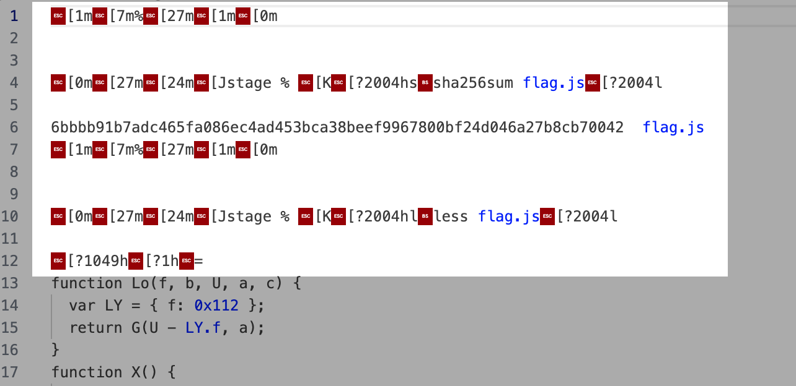
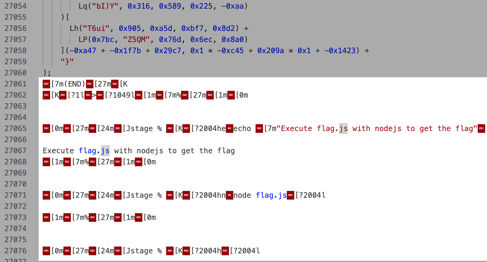

# 🪐 高频率星球

题解作者：[RTXUX](https://github.com/RTXUX)

出题人、验题人、文案设计等：见 [Hackergame 2023 幕后工作人员](https://hack.lug.ustc.edu.cn/credits/)。

## 题目描述

- 题目分类：general

- 题目分值：200

> 包含 AI 辅助创作


茫茫星系间，文明被分为不同的等级。每一个文明中都蕴藏了一种古老的力量 —— flag，被认为是其智慧的象征。

你在探索的过程中意外进入了一个封闭空间。这是一个由神秘的高频率星人控制着的星球。星球的中心竖立着一个巨大的三角形任务牌，上面刻着密文和挑战。

高频率星人的视觉输入频率极高，可以一目千行、过目不忘，他们的交流对地球人来说过于超前了。flag 被藏在了这段代码中，但是现在只有高频率星人在终端浏览代码的时候，使用 [asciinema](https://asciinema.org/) 录制的文件了，你能从中还原出代码吗？


上方动画仅供参考，请点击下面「打开/下载题目」按钮下载题目文件。

**[打开/下载题目](files/asciinema_restore.rec)**

## 题解

还原后的代码见[此处](src/flag.js)。

### 解法一

这题需要从 asciinema 的录像文件还原出代码，而 asciinema 的 `cat` 子命令可以将录像文件解析为输出到终端的字节流，于是，我们可以利用终端帮我们还原代码，但需要对字节流做一些小修改。

大致步骤如下：

1. 使用 `asciinema cat` 得到终端字节流。
2. 修改字节流，将前面无关代码的键入过程和后面的清屏序列删除。





3. 在一个无限 buffer 的终端中 cat 上一步编辑完的文件，并将结果复制出来。
4. 最后手动删除代码中所有的空行和不正常的部分，在文件末尾添加一个空行，即可获得与原 `flag.js` 完全一致的文件。使用 Node.js 运行该代码即可获得 flag。

### 解法二

使用脚本处理 asciinema 录像文件，提取代码。

参考脚本如下：

```python
import json
rec = open("asciinema_restore.rec").read().splitlines()
f = ''
for l in rec[38:]:
    s = json.loads(l)[-1]
    if ':\x1b[K' in s:
        s = s[:s.index(':\x1b[K')]
    f += s.replace('\x1b[K','').replace('~\x08~','').replace('6\x086','').replace('ESC\x08\x08\x08ESC[\x08[','')
open('flag.js','w').write(f)
```

得到的 `flag.js` 再手动删除最后几行垃圾，删除所有空行，最后补上一个换行符，即可获得与原 `flag.js` 完全一致的文件。使用 Node.js 运行该代码即可获得 flag。