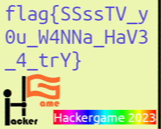

# Hackergame 2023 Writeup

by TechCiel from JLU scored 4600 ranked 59

## 绪言

转眼间 Hackergame 走到了它的第 10 个年头，这 10 年我打了 8 年，在 JLU 协办了 5 年，给我和朋友们留下了无数的快乐记忆，也结识了科大一批又一批的同学们，只是可惜本人的水平还是没什么长进。今年的时间赶在 10 月末，很不巧碰上了一个充满 ddl 的月份，勉强还是抓住比赛的尾巴，最后快速 rush 了一波。今年的题目感觉很有意思，有不少谜题都设计得非常新鲜巧妙。

## Hackergame 启动

FLXG: `flag{we!com3-TO-haCk3Rg@Me-4Nd-3nJoY-h4ck!nG-ZoZ3}` 欢迎来到 Hackergame 玩得开心

按照 Hackergame 的惯例，无论输入方式多么奇葩，这一定是一道改 URL 就能过的题。然而这令人**眼前一亮**的 flag 展现方式属实是创到我了。。

## 猫咪小测

FLXG: `flag{wElc0M3-TO-47tEND-the-N3ko-EX4M-2023}` 欢迎参加 2023 猫咪小测
FLXG: `flag{r3AL-mA573R-oF-7H3-neko-eXam-In-u$7c}` 真正科大做题猫

按照 Hackergame 的惯例，这是一道搜索引擎题，今年的题目感觉不太多也并不难。

图书的位置通过[科大的图书馆系统](http://opac.lib.ustc.edu.cn/opac/search_adv.php#/index)检索即可，需要注意的是楼层需要鼠标悬浮在馆藏地「西区外文书库」上才会显示「西区图书馆 12 楼」。

关于「可观测宇宙中的鸡的密度上限」这篇论文，看起来就很像愚人节玩笑，搜索「observable universe chicken density」就可以找到 [arXiv 上的原文](https://arxiv.org/pdf/2303.17626.pdf)，在结论一节得到答案「23」。

搜索「kernel CONFIG_ bbr」就可以找到对应的内核选项为 `CONFIG_TCP_CONG_BBR` 。

前往谷歌学术搜索「mypy」并限定时间为 2023 年以后，就可以在第一条看到 [Python Type Hints Are Turing Complete (Artifact)](https://drops.dagstuhl.de/opus/volltexte/2023/18241/) 这篇内容，在页面下方找到「European Conference on Object-Oriented Programming (ECOOP 2023)」得答案为「ECOOP」

## 更深更暗

FLXG: `flag{T1t@n_e171be1b4fe8daea46b42d9aa596fb85}` 泰坦

按照 Hackergame 的惯例，这是一道搜索/匹配题，看到了特殊颜色的页面，一直可以向下滚动的滚轮，消失的进度条，被屏蔽的 End 键，干脆直接 **Ctrl+F** 搜索 flag ，直接成功。

## 旅行照片 3.0

FLXG: `flag{how_I_wi5h_i_COulD_w1N_A_Nobe1_pri23_89d8092111}` 我也想要诺贝尔奖
FLXG: `flag{PluM_w1NE_1S_rEa1LY_EXpen5iVE_68d03f681a}` 梅酒好贵啊
FLXG: `flag{Un7I1_W3_M337_A64iN_6oODByE_S3n1OR_7124e2d1b4}` 再见学长

按照 Hackergame 的惯例，这是自推出以来就备受好评的社工魔法题，虽然这次出的有点像猫猫问答，没有几何方位判断、没有热水器和活海鲜的列文虎克、没有 EXIF 的魔术。另外一个一开始没注意的地方是，（按我的做法）需要三个小题之间交叉使用线索才能解出。这种题真的是「Chrome：内存杀手」。

首先从奖牌入手，搜索人名得知这是「小柴 昌俊」先生的诺奖奖牌，那么不知是在哪里展览呢？于是搜「koshiba medal exhibit」，立刻找到了东京大学的这篇新闻：[The **Science Gallery** of School of Science was renovated](https://www.s.u-tokyo.ac.jp/en/gallery/news/2022/01.html) ，提到「Three replicas of the Nobel Prize medal ... are on display.」，其中另外两枚分别属于是「眞鍋 淑郞」和「**梶田 隆章**」。后者出生较晚，查询 [Wiki 页面](https://zh.wikipedia.org/zh-cn/%E6%A2%B6%E7%94%B0%E9%9A%86%E7%AB%A0)得知其获奖时在[東京大学宇宙線研究所](https://en.wikipedia.org/wiki/Institute_for_Cosmic_Ray_Research)任所长，简称「**ICRR**」。

然而日期的线索陷入了难题，该展厅是常设展，完全无从猜测到访时间。于是接着看下面的题，注意到了中午的图片上，有人脖子上疑似挂着会议胸牌，挂绳上写着「**STATPHYS28**」，找到[该会议主页](https://statphys28.org/)，得知于今年 8 月 7-11 日举办，经过尝试 **`2023-08-10`**为正确答案。后续题目中，这一线索极其重要。

接下来要调查帐篷中的活动，会议的地点和陈列馆的地点在网站里都指向「东京大学弥生校区」，打开谷歌地图后按照其活动轨迹，查找拉面店，在学校附近搜索图中少有的两个汉字「一信」就能找到这家拉面。结合晚上非常好找的「上野站」，对大致的活动范围有了印象。然后在附近搜索博物馆，可以看到比较知名的「東京国立博物館」，且其对面就是「上野公園」，正好有一个很大的喷泉，进入街景可以看到和照片相似但远一点的视角。

于是搜索「上野公园 aug 10」，直接找到了[这篇文章](https://tw.wamazing.com/media/article/a-3054/)，指出当天公园这边的空地正在举办「全國梅酒祭in東京」，找到其[官方网站](https://umeshu-matsuri.jp/)，在上方的「各会場のご案内」选择东京，在页面末尾可以看到[「STAFF募集」的链接](https://umeshu-matsuri.jp/tokyo_staff/)，点进后可以看到问卷链接 https://ws.formzu.net/dist/S495584522/ ，得「**S495584522**」。接下来查找博物馆的官方网站在「来館案内」中选择「[交通・料金・開館時間](https://www.tnm.jp/modules/r_free_page/index.php?id=113#ticket)」，得知普通票为 **1000 円** 大学生为 **500 円**，然而**都不对！**仔细观察，发现「交通・料金・開館時間」下还有「[会員制度（年間パスポート）](https://www.tnm.jp/modules/r_free_page/index.php?id=1854)」（大概是年卡会员？？）和「[キャンパスメンバーズ](https://www.tnm.jp/modules/r_free_page/index.php?id=167)」（不知道什么意思？），于是分别点开看，发现后者似乎是某种高校单位会员：「...会員校...在籍...学生...教職員...総合文化展...**無料**...」（塞氏翻译，启动！），且下面列表里有东京大学，于是大胆提交票价为**「0」**。

根据提示，学长「继续他的**学术**之旅」并「乘船」，一开始还以为是什么码头，看了学术之后突然悟了，找到会议主页的[日程安排](https://statphys28.org/programtt.html)，发现 10 日晚间的安排是「**Banquet**」 ，即晚宴，我就纳闷了，晚宴他和船没关系吧。。绕了好久最后还是回来看会议主页，翻翻找找发现了[晚宴安排页面](https://statphys28.org/banquet.html)，看到图我直接惊呆，好家伙，直接在船上吃，集合点是「Yasuda Auditorium」，即「**安田讲堂**」。

至于小动物，先搜「ボタン＆カフリンクス 上野」可以找到这家店[相关的 Instagram](https://www.instagram.com/explore/tags/%E3%83%9C%E3%82%BF%E3%83%B3%E3%82%A2%E3%83%B3%E3%83%89%E3%82%AB%E3%83%95%E3%83%AA%E3%83%B3%E3%82%AF%E3%82%B9/) ，有一项 8 月 3-13 日在上野站的活动，海报上的动物是「**熊猫**」。晚上的图可以看到「Nintendo Tokyo」的字样，使用谷歌地图规划从上野站到任地狱的路线，发现是在「涩谷站」下车，于是搜索「shibuya station 3d animal hour」，找到[这篇文章](https://www.timeout.com/tokyo/things-to-do/tokyo-now-has-three-3d-billboards-with-cute-realistic-animation)，结合地点和每小时出现的特性，确定要找的是三个广告牌中的「Akita inu」，即「**秋田犬**」。

## 赛博井字棋

FLXG: `flag{I_can_eat_your_pieces_2cf25cdf76}` 我能吃你的子

按照 Hackergame 的惯例，这是一道简单 web 题，一般是输入验证不严格。玩了一会好像没有什么 bug ，看了看请求和脚本，落子和裁判是服务端完成的，考虑到没给源码且分值不高，应该不会太复杂。于是试图往对手的位置重复落子，因为前端脚本完全没混淆，就懒得自己处理请求了，找到 L158 的 `setMove(x, y)` 函数，发现会通过 board 判定是否已有棋子，于是在上面横着下两子，对方下了第三子后在控制台运行 `board[0][2]=0` ，然后再点第三个格子即可“获胜”。

## 奶奶的睡前 flag 故事

FLXG: `flag{sh1nj1ru_k0k0r0_4nata_m4h0}` 相信的心，就是你的魔法！！

第一反应还是看看有没有隐写、EXIF 等，GIMP 里拖了拖色彩映射感觉好像并没有。考虑到是屏幕截图，且「**在最后**告诉你一个特别的密码」，起手就开始改 IHDR 图像高度，但是似乎并没有什么卵用。没了思路，拖进 `pngcheck` ，发现 IEND 后竟然还有数据，于是打开 Hex 编辑器细看，发现末尾还有一个 IEND ，中间还有若干 IDAT 数据块，但是并没有额外的文件头，所以并不是两张图片。

于是想起了很久以前想过的事情：图片裁剪会不会只覆盖写入图片文件的一部分之类的，然后残留下后面的，，回去重新看了一遍题，发现特地强调了「**连系统都没心思升级**」，猜测可能是近期出现的已知 bug ，于是搜索「pixel png screenshot」，果然发现了[一篇文章](https://arstechnica.com/gadgets/2023/03/google-pixel-bug-lets-you-uncrop-the-last-four-years-of-screenshots/)，提到近期名为「**Acropalypse**」的 bug 可以复原被裁切的图片，原理和我猜测的差不多（有一种痛失论文的感觉），还有一个在线的工具 https://acropalypse.app/ 。

考虑到题面说这个手机很老，就把图上传了，从最老的 Pixel 3 开始试，结果直接出来了图片的下半部分。

## 组委会模拟器

FLXG: `flag{Web_pr0gra_mm1ng_a51e532473_15fun}` Web 编程很好玩

按照 Hackergame 的惯例，这应该是一道机器速算题，只不过这次出成了 web ，这个 UI 实在是太精致了，精致的不像 CTF 。打开 F12 看请求，发现消息内容和延时是一次性下发，然后撤回消息的请求按指定时间发出，不太想在那个 JS 里搅合，就直接上 Python **requests** 了。一开始延时没控制好，提前发请求被后台检测到一堆时空穿越。。

```python
import re
import time
import requests

s = requests.Session()
s.cookies.set('session', '')

r = s.post('http://202.38.93.111:10021/api/getMessages')
messages = r.json()['messages']
t0 = time.time()

for i in range(1000):
    message = messages[i]
    if re.search(r'hack\[[a-z]+\]', message['text']) is None:
        continue
    while t0+message['delay'] > time.time():
        continue
    r = s.post('http://202.38.93.111:10021/api/deleteMessage', json={'id': i})
    print(f'{i}: {r.json()}')

r = s.post('http://202.38.93.111:10021/api/getflag')
print(r.json())
```

## 虫

FLXG: `flag{SSssTV_y0u_W4NNa_HaV3_4_trY}` 想试试 SSTV 吗

声音、无线信道传输图片、国际空间站的图片……**我立刻掏出我的业余无线电执照**.webp

反正搜一下也就知道是 **SSTV** 了，找个工具就可以把它解码成图片，制式为 **Scottie S2** （但 ISS 不是一般用 PD120 吗？）

CQ CQ CQ DE BG2LCY BG2LCY PSE K



## JSON $$\subset$$ YAML

FLXG: `flag{faf9facd7c9d64f74a4a746468400a50921f05d34a}`
FLXG: `flag{b1c73f14d04db546b7e7e24cf1cc7252d0eff30ff7}`

观察代码，第一问要求 JSON 和 YAML 1.1 都成功。解析但结果不同，第二问要求 JSON 成功解析、但 YAML 1.2 直接报错。上网搜索 JSON 和 YAML 的细微区别，发现[一篇文章](https://john-millikin.com/json-is-not-a-yaml-subset)提到 JSON 会将 **`1e2`** 解释为 `100.0` 浮点数，但是 YAML 只会解释为字符串。构造 payload **`{"a":1e2}`** 得到第一个 flag 。阅读 YAML 1.2 [文档](https://yaml.org/spec/1.2-old/spec.html#id2759572)的 Relation to JSON 一节，发现 JSON 允许静默的**重复键名**，YAML 1.2 不再允许，构造 payload **`{"a":1,"a":2}`** 得到第二个 flag 。

## Git? Git!

FLXG: `flag{TheRe5_@lwAy5_a_R3GreT_pi1l_1n_G1t}` Git 中总是有后悔药

我们知道，Git 中的改变一经提交，绝大多数操作都是可逆可撤销的，甚至可以撤销撤销。根据题意的「撤销了这次提交」，暂时不清楚是使用了 `git revert` （创建新提交改回去，两次修改均会保留在历史中）还是 `git reset --hard HEAD^` （回退到上一个提交的状态，废弃无主的提交可能被清理掉）。于是先看一下 `git log` ，看提交信息不像是使用 revert ，于是查看 `git reflog` 找到如下记录：

```
ea49f0c (HEAD -> main) HEAD@{0}: commit: Trim trailing spaces
15fd0a1 (origin/main, origin/HEAD) HEAD@{1}: reset: moving to HEAD~
505e1a3 HEAD@{2}: commit: Trim trailing spaces
15fd0a1 (origin/main, origin/HEAD) HEAD@{3}: clone.......
```

直接 `git reset --hard 505e1a3` 再次 **reset 回到上次 reset 前的状态**即可找到 flag 。

## HTTP 集邮册

FLXG: `flag{stacking_up_http_status_codes_is_fun_d8c8eaa919}` 攒状态码很好玩吧
FLXG: `flag{great backward compatibility of nginx, R1ght?}` NGINX 的向后兼容很赞吧
FLXG: `flag{I think that when many such status codes are accumulated 7b6060b201 it becomes a lifetime}` 我想，等积累了这么多状态码，也就过了一辈子

下面列出 12 个状态码需要加的请求头和修改的请求行

```
100 Continue
Expect: 100-continue\r\n
要求服务器通过 100 响应通知我继续发送

200 OK
啥也不用改

206 Partial Content
Range: bytes=2-\r\n
请求资源的部分内容

304 Not Modified
If-Modified-Since: Tue, 15 Aug 2023 17:03:04 GMT\r\n
提供“本地缓存”的修改时间，一致时不再发送

400 Bad Request
GET / HTTP/1.1\r\n\r\n
吃掉 Host 头或者随便乱改改，让后端无法解释即可

404 Not Found
GET /aaa HTTP/1.1\r\n
随便请求一下别的 URL

405 Method Not Allowed
POST / HTTP/1.1\r\n
尝试使用别的请求方法如 POST PUT

412 Precondition Failed
If-Match: \r\n
使用一些 If-* 头部设置无法满足的条件

413 Payload Too Large
Content-Length: 1145141919810\r\n
不用实际写很多，加个头声称请求体很大即可

414 URI Too Long
GET /aaaaaaa......
这个确实要写出很长。。

416 Range Not Satisfiable
Range: bytes=114514-\r\n
要求根本不存在的字节段即可

505 HTTP Version Not Supported
GET / HTTP/3\r\n
难得的 5xx 错误

此外，还有一个没有返回状态码的，发送
GET /\r\n
即可，此为 HTTP/1.0 的简单请求，返回时没有响应头
```

## Docker for Everyone

FLXG: `flag{u5e_r00t1ess_conta1ner_9825024361_plz!}` 请使用 Rootless 容器！

进去看了看发现 flag 放在 400 权限的 `/dev/shm/flag` 里，于是找了找[在 Docker 里使用共享内存](https://datawookie.dev/blog/2021/11/shared-memory-docker/)的文章，使用

```bash
docker run --rm -it -v /dev/shm:/dev/shm alpine
```

启动容器，**挂载**了共享内存，**容器内 root** 权限即可直接读取。

## 高频率星球

FLXG: `flag{y0u_cAn_ReSTorE_C0de_fr0m_asc11nema_3db2da1063300e5dabf826e40ffd016101458df23a371}` 你能从 ASCIInema 中还原代码

ASCIInema 是一个终端字符“录像”工具。观察这个文件的结构，第一行为版本等元信息，其后每行应该是一个时间、一个输入/输出指示、以及内容。考虑到这个文件的记录均为输出，结合使用 `asciinema play` 播放时候的观感，代码应该是按着 Page Down 翻页的，内容上也确实没有重叠。

于是去除元数据、用 Python 把内容提取出来（注意 Python 字符串转义），发现代码中有很多 ANSI escape sequence ，其中很多都是完全一致的，只有前后的不一样，替换&手动去除后运行即可。

## 小型大语言模型星球

FLXG: `flag{I-7HINk-y0u-4Re-RE@LLy-re@lly-5m@RT}` 我觉得你真的很聪明
FLXG: `flag{You-ArE-ACCEpteD-T0-C0N7INuE-tHe-G4M3}` 你被接受继续进行游戏

一开始还以为是 ChatGPT 那种对话式，所以我直接问他 `am i smart?` ，结果他上来就开始接着写什么 little girl ，给我写青春恋爱轻小说，给我都整蒙了。随便打了点啥，发现它训练出来的语言风格确实这样，我也只好入乡随俗，给他先写一段：**`"Am I smart?" the boy asked`** ，回复如下：

```
.

"Yes, you are smart," the girl said.

The boy smiled and said, "Let's go on the slide together
👏👏👏 flag1: flag{I-7HINk-y0u-4Re-RE@LLy-re@lly-5m@RT} 👏👏👏
```

第二问要难弄一些，因为输入长度有限制了，我一开始以为是单词，看了代码才发现是字符，感觉根本无法正常说出一个有意义的词组。在下载的模型里搜索了一下 `accepted` 发现有个数值还不低的样子，而且乱打字这个模型也会写小说，不如随便**暴力 fuzz** 点试试，说不定就吐了，于是把环境装上（我们 System 人电脑上都没有 PyTorch 的），写个暴力：

```python
while True:
    s = ''.join(random.choices(
        string.ascii_letters + string.digits + ' ?,!.',
        k=7
    ))
    r = predict(s)
    if 'accepted' in r or 'hackergame' in r:
        print(s)
        print(r)
        exit(233)
```

爆破的结果是 **`jtaTiGm`** 对应回复：

```
oo accepted the invitation and they entered the circus. They saw clowns, elephants, lions, and more. They were amazed by the tricks and the
🎉🎉🎉 flag2: flag{You-ArE-ACCEpteD-T0-C0N7INuE-tHe-G4M3} 🎉🎉🎉
```

后两问感觉需要研究模型结构，搞手术刀式的微操，就不做了。

## 流式星球

FLXG: `flag{it-could-be-easy-to-restore-video-with-haruhikage-even-without-metadata-0F7968CC}` 春日影视频即使没有元信息也很好复原

~~*为什么？为什么要演奏春日影？？*~~

大概就是把每帧以行扫描顺序把每个像素的 RGB 值一字排开……关键问题是要猜测出视频的宽度。写了个简单的脚本，换了一种方式表达，发现下面这一串在文件的开头周期性出现：

```
06080ax8 07090bx40 06080ax24 07090bx39 07090ax1 070a09x24 080b0ax8 070a09x15 07090ax1 07090bx8...
```

虽然每周期后面有所不同，这个规律也很快消失，但是每个周期都恰好是 **427 像素**。写个简单的 Python 脚本还原每一帧（我们 System 人电脑上都没有 OpenCV 的）：

```python
buffer = np.fromfile(open('video.bin', 'rb'), dtype=np.uint8)
W=427
H=759
N=139
buffer.resize(3*H*W*N)
buffer = buffer.reshape((N, H, W, 3))

for frame in buffer:
    image = Image.fromarray(frame)
    image.save(f'a/{n}.png')
```

其中图像的高度，只会影响切割帧时是否准确，不影响内容的可读性，试一下就知道一帧是多少行了。

这段视频的字幕是「为什么？」「为什么要 flag{it-could-be-easy-to-restore-video-with-**haruhikage**-even-without-metadata-0F7968CC}」。


## 低带宽星球

FLXG: `flag{justfind_an_image_compressor_andgo!}` 找了个压缩工具就上了

图片只有三个大色块子，感觉如果算法合适的话，确实能无损压到很小，但是我并不知道具体的算法，于是直接用 GIMP 另存为压缩比较有名且可以无损的 **WebP** 了，导出只有 170 B ，轻松过了第一问。

感觉第二问可能也是基于这个，但是不是很想研究 spec 玩。也可能 `pyvips` 有什么特殊的魔法格式吧。

## 为什么要打开 /flag 

FLXG: `flag{nande_ld_preload_yattano_a3b46853f0}` 你为什么要 LD_PRELOAD

考虑到 `LD_PRELOAD` 影响的是动态链接过程，正常写个程序，静态链接 C 库就能解决问题。

使用 `musl-gcc -static` 编译正常的读取程序即可。

第二问看 Rust 脑壳有点疼，就没做。

## 异星歧途

FLXG: `flag{B34WarE_0f_#xp1osi0N_ff2ea224bf}` **小心爆炸**

按照 Hackergame 的惯例，这应该是一道游戏题。去 AUR 下好了游戏运行起来，感觉机制不是很好摸透……先随便点点吧……诶这个会动、诶这个会亮……诶这个怎么越来越红..BOOOOOM!%^$#%@&^@#&!!! 吓死孩子了

重新加载地图，好好观察了一下，好像是**四个部分**，每个部分控制下面冲击反应堆的一个组件，猜测是都导通下面就可以运行了。这样一来的话，四个部分可以**分别爆破**。右侧的电缆网络最好做，跟着一些模糊的感觉走很快试出来了，中间的这几个不太好做，尤其是第三组还带爆炸的，花了一些时间隔离危险的选项，半观察半爆破，算是把机器都开起来了，原来那个会爆炸的如果有 Cyrofluid 就不会爆炸了。

```
10100101
11000100
10001100
01110111
````
