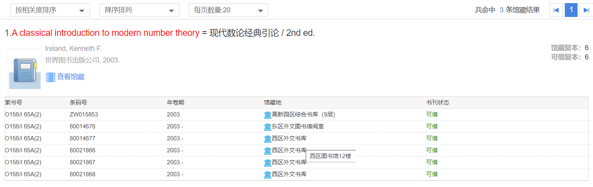
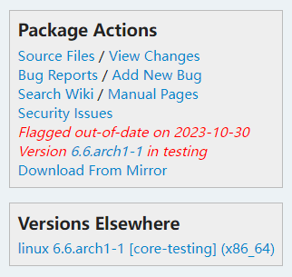
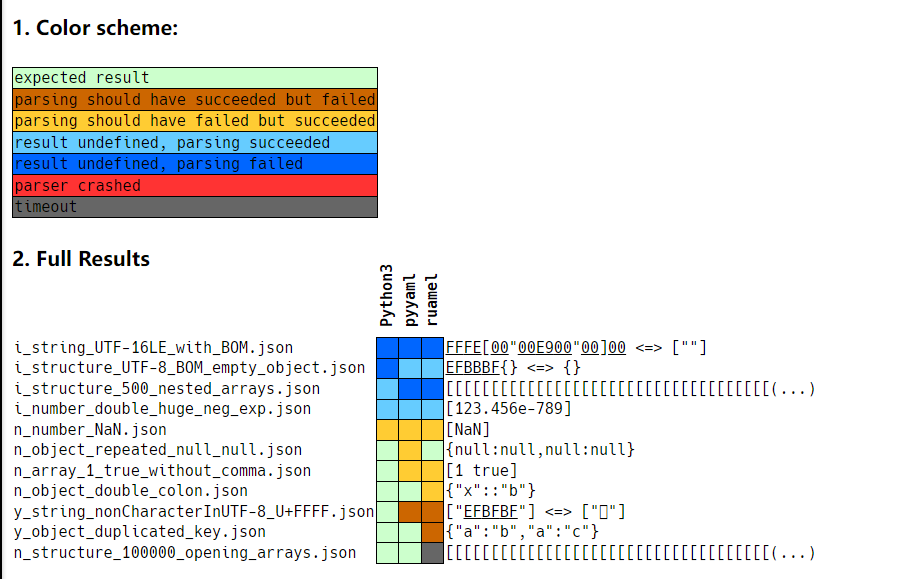
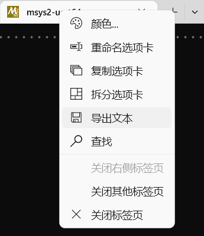
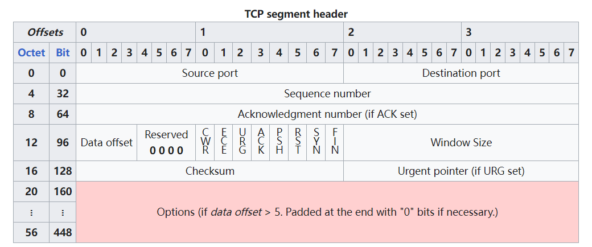
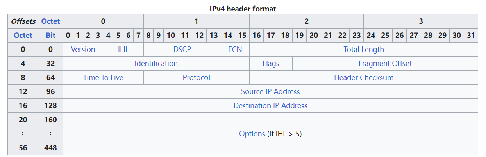
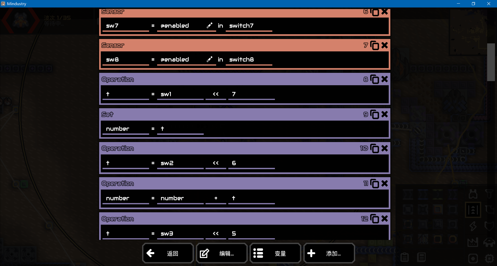

## 前言

这是我第四次参加 hacker game。今年的题目感觉相比往年难度两极化更严重一些，简单题很多，但再往上的难度又普遍很难，相对缺少中等难度的题。~~直观感觉就是很卷（）~~从排行榜来看，前百名做出来的题目都普遍集中，应该不是我一个人的错觉（

本次参赛我大部分时间都不在榜上，还担心今年没法上榜，不过好在最后还是做到了 4750 分、第 44 名，其实有点意外（

## 第1题：Hackergame 启动

直接点击提交，会发现 URL 多出来了一个 `?similarity=` 参数，于是在后面填上 100，成功启动 hackergame。

## 第2题：猫咪小测

今年的猫咪小测不论是体量还是难度都比往年简单一些。

### 1. 想要借阅世界图书出版公司出版的《A Classical Introduction To Modern Number Theory 2nd ed.》，应当前往中国科学技术大学西区图书馆的哪一层？

找到[中国科学技术大学图书馆的官网](https://lib.ustc.edu.cn/)，然后在这里直接搜索 `A Classical Introduction To Modern Number Theory 2nd ed.`，但发现搜不到，于是把后缀 `2nd ed.` 去掉，就搜到了 `现代数论经典引论 / 2nd ed.`：


点击“查看馆藏”，然后把鼠标移动上去就能看到是在西区图书馆 12 楼：



### 2. 今年 arXiv 网站的天体物理版块上有人发表了一篇关于「可观测宇宙中的鸡的密度上限」的论文，请问论文中作者计算出的鸡密度函数的上限为 10 的多少次方每立方秒差距？

直接搜索“可观测宇宙中的鸡的密度上限”，就能搜到一篇知乎回答：[你见过哪些极品论文？ - 杂然赋流形丶的回答](https://www.zhihu.com/question/20337132/answer/3023506910)。在回答中就提到这个密度上限是 `10^23 pc^-3`，所以答案是 `23`。另外在回答中也给出了原文的 arxiv 链接，原文的摘要中也提到了这一数据。

### 3. 为了支持 TCP BBR 拥塞控制算法，在**编译** Linux 内核时应该配置好哪一条内核选项？

我因为经常关注 Linux 的编译配置，所以没有像官方题解那样去搜，而是直奔 Arch Linux 的打包仓库。

Linux 除了有很多运行时配置之外，在编译时也可以进行很多配置，一些用不到的功能可以直接不编译，也可以编译一些需要用到的但默认配置中不编译功能；一些功能可以不要，也可以编译成可动态加载的内核模块，也可以和内核本体编译在一起（相当于静态链接）。

每个 Linux 发行版都有自己的内核配置，它是一个文本文件。以 archlinux 为例，在 archlinux 官网搜索 `linux` 软件包，点开[对应的页面](https://archlinux.org/packages/core/x86_64/linux/)，在右边能看到有一个 `Source Files`：



点进去跳转到 archlinux 的 gitlab 仓库页面，就能看到 archlinux 打包内核时用到的打包脚本 `PKGBUILD` 和编译内核的配置文件 `config`。在 config 文件当中直接搜索 bbr 就能搜到 `CONFIG_TCP_CONG_BBR=m`。这说明 archlinux 把它编译成了一个内核模块。

### 4. 🥒🥒🥒：「我……从没觉得写类型标注有意思过」。在一篇论文中，作者给出了能够让 Python 的类型检查器 ~~MyPY~~ mypy 陷入死循环的代码，并证明 Python 的类型检查和停机问题一样困难。请问这篇论文发表在今年的哪个学术会议上？

巧了，这题我看过.jpg

这篇论文当时 2022 年发在 arxiv 时就引起了网上的关注，上了 [Hacker News](https://news.ycombinator.com/) 的热门，我当时还收藏了（[原文地址](https://arxiv.org/abs/2208.14755)，[Hakcer News 地址](https://news.ycombinator.com/item?id=32779296)）。毕竟之前都拿 TypeScript 的类型系统图灵完备来玩梗，以此说明 ts 的类型系统过于复杂，没想到 python 的类型提示也是图灵完备的。

于是搜索论文标题 *Python Type Hints are Turing Complete*，搜到了[一个 pdf](https://drops.dagstuhl.de/opus/volltexte/2023/18237/pdf/LIPIcs-ECOOP-2023-44.pdf)。搜索 URL 当中的 `LIPIcs-ECOOP`，看上去学术会议的名字就是 `ECOOP` 了。

## 第3题：更深更暗

这个题我是官方题解所说的“其它解法”，在手机上迅速往下滚动就能直接看到 flag，于是录屏然后暂停就能拿到 flag 了。~~原来我的手机已经算性能较差的手机了吗~~

## 第4题：旅行照片 3.0

比赛开始时简单看了一下，没有什么头绪，然后就暂时放过了。直到最后一天才来重新看这道题。

### 2、在学校该展厅展示的所有同种金色奖牌的得主中，出生最晚者获奖时所在的研究所缩写是什么？

第一张图，学校展厅里的大金奖牌，第一想到是诺贝尔奖。于是搜索奖牌上的人名 `M. koshiba`，可以搜到是[小柴昌俊](https://en.wikipedia.org/wiki/Masatoshi_Koshiba)，毕业于东京大学，于 2002 年获得诺贝尔物理学奖。结合下面的文字描述，猜测应该就是东京大学。搜索 `University of Tokyo nobel prize`，搜到东京大学官网的[一个介绍诺奖得主的页面](https://www.s.u-tokyo.ac.jp/en/gallery/nobelprize/)，在这里可以看到符合题目描述中“出生最晚”的应该是生于 1959 年的[梶田隆章](https://en.wikipedia.org/wiki/Takaaki_Kajita)，于 2015 年因发现中微子振荡而获诺贝尔物理学奖。网站上给了一个日语页面，是东京大学宇宙射线研究所的，结合 Wikipedia 的信息得知当时他应该就是在这所研究所。观察图标和域名加上搜索可知简称是 ICRR。

### 1、你还记得与学长见面这天是哪一天吗？

下面图片所在的场景很重要，因为不懂日语所以没有搜索其中的文字，而是选择用 Google Lens 图片搜索服务搜这几张图。面馆的图没有搜到（毕竟表情头像占比太大了），喷泉这张图搜到是上野恩赐公园，结合地图街景判断就是这里没错。然后我就去用英文搜上野恩赐公园在 2023 年夏天有什么活动，结果只搜到了[7月17日、22日、23日有活动](https://www.timeout.com/tokyo/things-to-do/ueno-summer-festival-1)，但是输进去都不对，于是决定暴力破解。

经过手动逐个尝试，正确答案是8月10日。

### 3、帐篷中活动招募志愿者时用于收集报名信息的在线问卷的编号（以字母 S 开头后接数字）是多少？

知道了日期，之后带着日期去搜索，才知道这天的活动原来是 [2023 年东京全国梅酒节](https://home.ueno.kokosil.net/archives/77114)。这个页面结尾提到了招募志愿者，给了[一个链接](https://umeshu-matsuri.jp/tokyo_staff/)，点进去就能找到一个问卷：https://ws.formzu.net/fgen/S495584522/ ，于是答案就是 `S495584522`。

### 4、学长购买自己的博物馆门票时，花费了多少日元？

看地图可知这个喷泉旁边的博物馆是东京国立博物馆，在其官网的[票价页面](https://www.tnm.jp/modules/r_free_page/index.php?id=113)可以看到成人票 1000 日元，学生票 500 日元。但填进去 500 发现不对，考虑到东京大学可能有特殊优惠，于是搜索 `Tokyo National Museum University of Tokyo student` 看看有没有什么结果，搜到了[一个博物馆官网的页面](https://www.tnm.jp/modules/r_free_page/index.php?id=167)和[一个东京大学的页面](https://www.u-tokyo.ac.jp/en/prospective-students/discounts.html)，在后者中可以看到在平常其实是免费的，于是答案是 `0`。

## 第5题：赛博井字棋

如官方题解所说，这道题比较考验脑洞。打开浏览器 F12，在 Network 一栏可以看到落子时是向网站发送一个 POST 请求，带上坐标 x 和 y 的 json，然后服务器返回落子后的棋盘数组，这意味着对方落子的逻辑是在后端完成的。

阅读了前端源码，想了好半天还是没有头绪，去观察 jwt 并试图修改，发现这个 jwt 其实是安全的。后来想到能不能把棋子下在棋盘外面，尝试后发现不行。再之后突然脑子灵光一闪，想到能不能覆盖掉对方已经下过的棋子，于是成功。

在 console 中执行的代码是：

```js
await fetch(window.location.href, {
    method: "POST",
    headers: {"Content-Type": "application/json"},
    body: JSON.stringify({x: 0, y: 0})
})
```

## 第6题：奶奶的睡前 flag 故事

又巧了，这题我听说过.jpg x2

之前就听说 Google 和微软这对“卧龙凤雏”一人搞了一个重大漏洞，都是编辑截图时直接在原文件上覆盖，导致旧文件数据没有清除，从而会泄露原始文件的数据。编辑了，但没完全编辑。甚至后来B站上也有一个视频介绍了这件事：[av698750249](https://www.bilibili.com/video/av698750249/)。

其中 Google 这个漏洞是 CVE-2023-21036，当时也是上了 Hacker News 热门：[Exploiting aCropalypse: Recovering truncated PNGs](https://news.ycombinator.com/item?id=35208721)（[原文地址](https://www.da.vidbuchanan.co.uk/blog/exploiting-acropalypse.html)）。

这篇文章中提到，这是由于一个 Android 中的极为逆天的 API 设计：不论是C语言还是常见的大多数编程语言中，打开文件的 `open` 函数可以传递各种打开模式，比如常见的写入打开是 `"w"`，这种写入模式下，在打开文件时首先会清空文件（也称为“截断”，`truncate`），这样写入的数据一定是干净的，文件中不会残留旧数据。而从 Android 10 开始，[`ParcelFileDescriptor.parseMode`](https://developer.android.com/reference/android/os/ParcelFileDescriptor#parseMode(java.lang.String)) 函数的 `"w"` 模式不再会清空文件，反而表现得像 `"r+"` 模式，写入的时候直接在旧数据上覆盖，如果新数据的长度比旧数据更短，那么文件中就会残留一部分旧数据，导致**严重的数据泄露**。这个逆天的行为违反了从 [ISO C](https://zh.cppreference.com/w/c/io/fopen) 和 [POSIX](https://man.archlinux.org/man/fopen.3p) 的 `fopen` 函数沿袭下来的广为人知的约定。更加离谱的是，在发现这个漏洞之前，这一 API 变化根本没有记录在文档当中，也就是说人们根本不知道发生了这个改变！稍微对编程有一定了解应该都知道这是一件多么逆天的事情。

吐槽完毕，回到这道题，我们需要利用这个漏洞。直接搜索 CVE 号能搜到[一个 GitHub 仓库](https://github.com/infobyte/CVE-2023-21036)，不过这里只有检查图片是否受影响的代码和修复图片的代码。看上去大家还是更关心自己的信息有没有泄露。不过在上面那篇文章里给出了[一个利用此漏洞的 python 脚本](https://gist.github.com/DavidBuchanan314/93de9d07f7fab494bcdf17c2bd6cef02)。下载脚本，然后运行：

``` shell
$ python acropalypse_matching_sha256.py 1080 2160 screenshot.png out.png
```

就能获得恢复出的数据，拿到 flag。

## 第7题：组委会模拟器

打开 F12 的 Network 一栏，可以看到向 `/api/getMessages` 发送了一个 POST 请求，返回了每条消息的时间戳和内容。点击撤回一条消息，发现向 `/api/deleteMessage` 发送了一个 POST 请求，json 中带上了消息的 id，观察发现是消息在上面返回的数据中的数组索引。在最后结束后会向 `/api/getflag` 发送 POST 请求。其它都是在前端实现的，没有别的网络请求。

于是可以知道这是一道写脚本发送请求的题，只需要获取到每条消息，然后在指定的时间发送请求删掉被正则表达式 `hack\[\w+\]` 匹配的消息即可，最后获取 flag。伪代码如下：

``` python
messages = post("/api/getMessages")
start_time = time.time()

for i, (delay, msg) in enumerate(messages):
    if not re.match(r"hack\[\w+\]", msg):
        continue
    sleep_until(start_time + delay)
    post("/api/deleteMessage", json={"id": i})

print(post("/api/getflag").json())
```

要注意这里 API 返回的每条消息的时间是相对于最开始的时间，而不是相对于上一条消息的时间。所以这里一个要点是实现 `sleep_until` 函数。比如：

``` python
def sleep_until(t):
    current_time = time.time()
    time.sleep(max(t - current_time, 0))
```

我使用的是 python 异步库 [trio](https://trio.readthedocs.io/en/latest/)，这个库自身就提供了一个 `trio.sleep_until` 函数。

另外本题的 API 实际上还返回了一个服务器的开始时间，但因为本地和服务器时间可能没对准，比如我这里差了好几秒，所以就直接忽略了这个时间。因为收到 API 响应之后肯定已经在这个开始时间之后了，而本题撤回消息给了 3 秒的余量，所以完全没有问题。就是要注意 HTTP 需要支持 Keep-Alive，否则每次都重新建立 TCP 连接很容易超时。

另外，本题还有一个特殊的地方，可能是今年和往年不同，没法向题目发送带 `?token=...` 的请求来登录，只能从浏览器中复制 session cookie。

[点此查看完整代码](./src/q07_组委会模拟器.py)

## 第8题：虫

这题说使用了一种国际空间站使用的通过声音传输图片的方式。搜索 `international space station transfer picture via sound`，搜到了一个油管视频：[How to get pictures from the International Space Station via amateur radio](https://www.youtube.com/watch?v=HtC-BPcMruA)，视频中给出了一段音频，听上去和本题给的音频非常相似，那就没错了。视频中提到这种技术叫做 SSTV（	slow scan television），于是找一种 sstv 音频转图片的库或者应用程序就行了。

搜到了一个 [sstv-decoder-server](https://github.com/kuresaru/sstv-decoder-server)，不过这是个服务器。看到它是 fork 自[另一个仓库](https://github.com/colaclanth/sstv)，点进去发现刚好就是一个我们想要的脚本。于是按照 README 的指南用 pip 安装这个库，就可以解决了。

``` shell
pip install git+https://github.com/colaclanth/sstv
python -m sstv -d insect.wav -o out.png
```

## 第9题：JSON ⊂ YAML?

yaml 是我非常不喜欢的一个格式，甚至比 xml 更不喜欢。它字符串值省略引号的语法非常容易混淆，到处都是坑。而“json 是 yaml”的子集也是个流传甚广的谣言了。我之前就在 Hacker News 看过[一篇文章](https://news.ycombinator.com/item?id=31406473)（[原文链接](https://john-millikin.com/json-is-not-a-yaml-subset)），给出了明确的例子说 yaml 不是 json 的超集。

### JSON ⊄ YAML 1.1

上面的文章提到，yaml 1.1 与 json 解析浮点数的语法不同，直接把文章给出的例子 `{"a": 1e2}` 贴上去即可。

### JSON ⊄ YAML 1.2

这题费了我一番功夫。上面的文章并没有否定 yaml 1.2 是 json 超集的说法，只是说 yaml 解析器为了向后兼容性默认使用 yaml 1.1，除非开头注释说明了要用 yaml 1.2。Hacker News 的讨论里也没有对 yaml 1.2 兼容 json 提出异议。但本题目使用的 ruamel 解析器默认使用的就是 yaml 1.2。

于是我去搜搜 ruamel 的 issue，看看有没有人提到 ruamel 与 json 的不兼容性。搜到了一个 [Tab-indented JSON should be valid YAML with 1.2 spec](https://sourceforge.net/p/ruamel-yaml/tickets/447/)，但是它需要用到多行字符串，而本题目只接受单行。

尝试在一行中包含 `\t` 发现会让 yaml 1.1 报错，这才发现本题目要求让 yaml 1.2 报错的同时 yaml 1.1 不报错，这是个比较头疼的问题。我之后又搜了很多关于 yaml 1.2 与 json 之间不兼容性的资料，其中提到的比如键长度不能超过 1024 之类的，也都会在 yaml 1.1 上报错。

最后实在没有办法，我找了一个 json 的测试套件：[JSONTestSuite](https://github.com/nst/JSONTestSuite)，然后对着 pyyaml 和 ruamel 跑一遍，看看有什么是 yaml 1.1 不报错而 yaml 1.2 报错的。稍微改一改仓库里测试 python 标准库 json 的代码，改成测试 pyyaml 和 ruamel（[点此查看 patch](./src/q09_test-yaml-parsers-on-json.patch)），结果如下：



可见 `{"a": "b", "a": "c"}` 就是符合要求的。然后才想起来搜索的时候看到了关于重复键的讨论，不过我以为 json 不允许重复键所以没太在意。

## 第10题：Git? Git!

关于恢复 git 中删掉的提交，首先想到的就是 [`git reflog`](https://git-scm.com/docs/git-reflog)。实际上这题直接这一招就解决了，但是我眼瞎 `git diff` 的时候没看到 flag，还以为提交里只是增减了一些空白。于是我打算尝试更复杂的做法。

首先我们需要了解 git 的内部存储结构，在 [Git Book 的第 10 章](https://git-scm.com/book/zh/v2/Git-%E5%86%85%E9%83%A8%E5%8E%9F%E7%90%86-Git-%E5%AF%B9%E8%B1%A1) 就有所介绍。简单来说，git 会把所有文件都存储到 `.git/objects` 目录中，这里每个文件的文件名就是这个文件内容的 sha1 哈希，因此知道了文件的 sha1 哈希就能轻松查到这个文件的内容。我们可以用 `git cat-file -p <hash>` 命令来查看一个文件的内容。只存储文件还不够，还需要存储目录，否则就文件的原始文件名就丢失了。在 git 中目录也是一个文本文件，被称为 `tree`，它每一行都包含了一个对象的哈希，以及这个对象的文件名。最后，提交（`commit`）也是一个文本文件，里面存储了提交者、提交时间、仓库的根目录 tree 对象的哈希，以及提交的时候编写的提交消息。

例如，执行如下命令创建一个 git 仓库：

``` shell
git init
echo hello world > hello.txt
touch a b c "d e"
mkdir xxx
touch xxx/a
git add .
git commit -m init
```

然后我们查看当前的提交对象：

``` shell
$ git cat-file -p HEAD
tree 1d0425c2815717c1bb716dc3bf985e7030ac2438
author GalaxySnail <me@glxys.nl> 1699275786 +0800
committer GalaxySnail <me@glxys.nl> 1699275786 +0800

init
```

这里的第一行就是仓库根目录的 tree 对象的哈希。我们接着查询它：

``` shell
$ git cat-file -p 1d0425c2815717c1bb716dc3bf985e7030ac2438
100644 blob e69de29bb2d1d6434b8b29ae775ad8c2e48c5391    a
100644 blob e69de29bb2d1d6434b8b29ae775ad8c2e48c5391    b
100644 blob e69de29bb2d1d6434b8b29ae775ad8c2e48c5391    c
100644 blob e69de29bb2d1d6434b8b29ae775ad8c2e48c5391    d e
100644 blob 3b18e512dba79e4c8300dd08aeb37f8e728b8dad    hello.txt
040000 tree 496d6428b9cf92981dc9495211e6e1120fb6f2ba    xxx
```

可以看到我们刚才提交的文件都在这里。`blob` 表示这是一个文件，`tree` 表示这是一个子目录，我们需要继续 `cat-file` 这个子目录才能看到子目录中引用的文件。

``` shell
$ git cat-file -p 496d6428b9cf92981dc9495211e6e1120fb6f2ba
100644 blob e69de29bb2d1d6434b8b29ae775ad8c2e48c5391    a
```

接着查询文件内容：

``` shell
$ git cat-file -p 3b18e512dba79e4c8300dd08aeb37f8e728b8dad
hello world
```

另外我非常推荐看看这篇文章：[What is in that .git directory?](https://blog.meain.io/2023/what-is-in-dot-git/)

所以这就有了一个思路，遍历整个 git 仓库中所有 blob 类型的对象，即使一个对象没有被任何 tree 对象引用，这样搜索也能让它无处遁形。

不过，实际上还要稍微复杂一点。很明显，git 的这种存储方式效率较低，即使 git 实际存储的时候每个文件都被 deflate 算法压缩过，一旦一个较大的文件有小修改，也需要把整个文件重新存储一次。所以 git 中还有一种 pack 格式，用来将多个对象打包在一起，一起压缩，这样压缩算法能够利用多个文件之间的冗余，更有效地压缩。

本题目下发的 git 仓库就有这样的 pack 文件。所以我们首先需要把 pack 文件解包成常规的 object 文件，这样才能遍历。经搜索，[一个 StackOverflow 回答](https://stackoverflow.com/questions/16972031/how-to-unpack-all-objects-of-a-git-repository)中提到，git 有一个 [`git unpack-objects`](https://git-scm.com/docs/git-unpack-objects) 命令，正是我们需要的。

根据上面文档的说法，这个命令不会解包在 git 仓库中已存在的文件，所以我们需要把 pack 文件移动出来然后再解包：

``` shell
mv .git/objects/pack/pack-5f0420e31f85ca3f4b4ad2e32a8ede3aa5fe9012.pack .
git unpack-objects < pack-5f0420e31f85ca3f4b4ad2e32a8ede3aa5fe9012.pack
```

接下来提取所有 object 文件的 hash：

``` shell
cd .git/objects
find . -type f | tr -d '/.' > ../../x.txt
cd ../..
```

之后 grep 搜索 `flag` 即可：

``` shell
$ for hash in $(cat x.txt); do git cat-file -p $hash | grep flag && echo $hash; done
  <!-- flag{TheRe5_@lwAy5_a_R3GreT_pi1l_1n_G1t} -->
f629dae383869fe5ae7abb74fde26fea5e64ff31
```

我觉得这个题出得稍微有点简单，其实完全可以出一个第二问预期使用遍历 object 的解法来做。

## 第11题：HTTP 集邮册

### 5 种状态码

前五个状态码很简单，轻松就能找到。

#### 200 OK

直接提交就能拿到。

#### 404 Not Found

把请求行修改成 `GET /xxx HTTP/1.1\r\n`，target 是随便一个不存在的路径即可。

#### 405 Not Allowed

把请求方法改成一个不存在的方法即可：`XXX / HTTP/1.1\r\n`

#### 400 Bad Request

把整个内容全改成乱七八糟的东西就行：`xxxxxxxxx`

#### 505 HTTP Version Not Supported

HTTP/1.1 的请求行带有版本号，就是为了日后升级。然而，现实中 HTTP/2 设计成了二进制的协议，不使用 HTTP 请求行的版本号来协商了，而是使用外层 TLS 协议的 [ALPN 拓展](https://developer.mozilla.org/zh-CN/docs/Glossary/ALPN)来协商。所以在这里改成 `HTTP/2` 即可：`GET / HTTP/2\r\n`

顺便一提，然而后来 HTTP/3 因为直接改了传输层，不再用 TCP 和传统 TLS，而是用基于 UDP 的 QUIC 协议了，所以又需要发明新的协商办法，比如 `Alt-Svc`。详见[这篇知乎回答](https://www.zhihu.com/question/536319063/answer/2517555802)。HTTP 的发展真是折腾啊（

### 没有状态……哈？

这一问一开始没有头绪，搜了很多 nginx 相关的 issue 也没有搜到。于是搁置到后面才重新回来做。

考虑到 nginx 作为一个非常流行的 HTTP 服务器，应该是不可能偏离 RFC 的规定的，而我十分确定 HTTP/1.1 的 RFC 要求响应必须包含一个状态行，其中必须要有状态码，就觉得十分困惑。（详见最新的 [RFC 9112 第 4 节](https://www.rfc-editor.org/rfc/rfc9112.html#section-4)）

转念一想，那有没有可能是其它更旧的版本呢？于是去搜 HTTP/1.0，搜到了 mdn 的这篇文档：[HTTP 的发展](https://developer.mozilla.org/zh-CN/docs/Web/HTTP/Basics_of_HTTP/Evolution_of_HTTP)，里面赫然写着有一个早期的 HTTP/0.9，请求不带版本号，响应也不带状态行。我倒是依稀记得听说过有一个 HTTP/0.9，但在看到之前根本没想起来。

于是一行 `GET /\r\n\r\n` 即可。

### 12 种状态码

剩下 7 种就得看着 RFC 一个一个排查了。我这里参考的是最新的 [RFC 9110 第 15 节](https://www.rfc-editor.org/rfc/rfc9110.html#section-15)。

#### 100 Continue

之前读 [python-h11 库的文档](https://h11.readthedocs.io/en/latest/api.html#flow-control)时听说过这个。如果客户端发送的请求头比较大，没法一次性放进缓冲区中，就可以先发送一部分，然后在这部分请求头的末尾带上一个 `Expect: 100-continue\r\n`，当服务端收到这个请求头时，就必须在继续读取后面的请求头之前发送一个 `100 Continue` 响应，否则会陷入你等我我等你的死锁。客户端收到 100 响应之后会继续发送后面的请求头。

```
GET / HTTP/1.1\r\n
Host: example.com\r\n
Expect: 100-continue\r\n\r\n
```

#### 206 Partial Content

HTTP 协议经常用来传输文件，而下载文件一个非常重要的功能就是断点续传，这是由 HTTP 的 Range 请求头实现的。详见 [RFC 9110 第 14 节](https://www.rfc-editor.org/rfc/rfc9110.html#range.requests)。它可以向服务器请求下载一个文件的一个或多个字节范围，比如文件下载了 2000 个字节之后连接中断了，下次重新发起请求就可以带上一个 `Range: bytes=2000-`，这时候支持 range 请求的服务器就应该返回一个 `206 Partial Content` 响应，并从文件的 2000 偏移量开始传输，就实现了断点续传。

```
GET / HTTP/1.1\r\n
Host: example.com\r\n
Range: bytes=0-1\r\n\r\n
```

另外还有一些需求需要在文件中间“seek”读取某个偏移量的数据（比如播放某些 mp4 视频），这也需要 range 请求，否则就得把整个文件缓存到本地。网上甚至还有人使用 HTTP 来托管 sqlite 数据库文件，也用到了 range 请求来按需下载，避免一次性下载一整个 sqlite 文件：[Hosting SQLite databases on Github Pages](https://phiresky.github.io/blog/2021/hosting-sqlite-databases-on-github-pages/)，Hacker News 上的讨论：[1](https://news.ycombinator.com/item?id=27016630), [2](https://news.ycombinator.com/item?id=28015980), [3](https://news.ycombinator.com/item?id=33182417)。

顺便一提，python 标准库 `http.server` 直到现在还不支持 range 请求，也就不支持断点续传和 seek。有一个挂了三年的 issue（~~时间比我想象中短~~）：[http.server does not support HTTP range requests](https://github.com/python/cpython/issues/86809)。

#### 304 Not Modified

经常开 F12 看浏览器 Network 的读者应该经常看到这个响应。它是用来实现刷新缓存，浏览器向服务器询问上次缓存的内容是否发生了更改，如果没有更改就可以避免重新传输。详见 [MDN 文档](https://developer.mozilla.org/zh-CN/docs/Web/HTTP/Status/304)。

把服务器的 `Last-Modified` 响应头复制到 `If-Modified-Since` 即可。或者把 `Etag` 响应头复制到 `If-None-Match` 也可以。

```
GET / HTTP/1.1\r\n
Host: example.com\r\n
If-Modified-Since: Tue, 15 Aug 2023 17:03:04 GMT\r\n\r\n
```

#### 412 Precondition Failed

根据 RFC 的说法，带上一个不存在的 `If-Match` 就行了。

```
GET / HTTP/1.1\r\n
Host: example.com\r\n
If-Match: xxxxx\r\n\r\n
```

#### 413 Content Too Large

这个很简单，传递一个非常长的 `Content-Length` 即可。

```
GET / HTTP/1.1\r\n
Host: example.com\r\n
Content-Length: 1145141919810\r\n\r\n
```

#### 414 URI Too Long

顾名思义，传递一个非常长的 URI 即可。在请求行的 `/` 后面跟 8192 个 `x` 即可，因为太长了我这里就不贴了。

#### 416 Range Not Satisfiable

和上面的 206 类似，都是与 range 请求有关。传递一个不合适的范围即可。

```
GET / HTTP/1.1\r\n
Host: example.com\r\n
Range: bytes=2-1\r\n\r\n
```

## 第12题：Docker for Everyone

本题目我们需要访问一个位于 `/flag` 的文件，而它实际上是一个指向 `/dev/shm/flag` 的符号链接，这个指向的文件由 root 所有。所以我们需要提权到 root 来访问它。`/dev/shm` 是一个完全处于内存中的 `tmpfs` 文件系统，它在 GNU/Linux 系统上是专门用来提供 [POSIX 共享内存](https://man.archlinux.org/man/shm_overview.7)的。

docker 是一个有点特别的容器，它主要是一个在后台以 root 身份运行的守护进程，提供一个由 root 所有的 socket，而用户使用的 `docker` 命令则是在通过这个 socket 与守护进程通信。这意味着，因为只有 root 进程才能访问这个 socket，所以 docker 默认信任所有来自这个 socket 的请求。因此，在安全性上 docker 对此不设防，如果有人能操作 docker 那么很轻易就能获得 root 权限。

实践中为了方便，docker 提供了一个 docker 组，任何拥有 docker 组权限的进程都可以操作 docker。但如上所述，这本质上等价于 root 权限。[docker 的文档](https://docs.docker.com/engine/install/linux-postinstall/#manage-docker-as-a-non-root-user)也提到了这一点。

那么具体如何操作 docker 来获得更高的权限呢？这要从 docker 的原理讲起。docker 本身是一个具有 root 权限的进程，然后 docker 使用了 Linux 的[命名空间（namespaces）](https://man.archlinux.org/man/namespaces.7)、[控制组（cgroups）](https://man.archlinux.org/man/cgroups.7) 等功能，从完整的 root 开始一点一点限制容器里的权限，让容器内的各种资源与容器外隔离、不允许执行某些特权操作。而一旦稍有不慎，哪个资源隔离漏了，那就有可能导致容器逃逸漏洞。

于是，思路就是通过操作 docker 命令行，来配置一个尽可能与主机没有隔离的容器，从而在容器内获得真正的 root。docker 有一个 [`--privileged`](https://docs.docker.com/engine/reference/run/#runtime-privilege-and-linux-capabilities) 选项，可以关闭大部分隔离，它是在 docker 内运行嵌套容器所必需的，但[没有任何安全性可言](https://pwning.systems/posts/escaping-containers-for-fun/)。另外[这篇文章](https://book.hacktricks.xyz/linux-hardening/privilege-escalation/docker-security/docker-privileged#namespaces)提到，可以通过 `--pid=host --net=host --ipc=host --uts=host` 这几个选项来分别关闭命名空间的隔离。

于是加上这几个参数，就可以直接访问 `/dev/shm/flag` 了：

``` shell
docker run -it --privileged --pid=host --net=host --ipc=host --uts=host --rm alpine
cat /dev/shm/flag
```

实际上这里真正起作用的只是 `--ipc=host` 选项，它关闭了 IPC 隔离，这也包括 `/dev/shm` 的隔离。如[我去年的题解提到](https://github.com/USTC-Hackergame/hackergame2022-writeups/tree/master/players/GalaxySnail#socket-%E4%BB%A5%E5%A4%96%E7%9A%84-ipc)，Linux 的 IPC 命名空间本身是不会隔离 `/dev/shm` POSIX 共享内存的；不过 docker 的 `--ipc` 选项会隔离它，[参见文档](https://docs.docker.com/engine/reference/run/#ipc-settings---ipc)。

因此实际上只需要：

``` shell
docker run -it --ipc=host --rm alpine
cat /dev/shm/flag
```

## 第13题：惜字如金 2.0

本来我看本题目说：

> 解答本题不需要任何往届比赛的相关知识。

我一开始是不相信的，想着再怎么样去年写的惜字如金化算法的实现总能用上吧。然而实际上还真的用不上，因为本题是纯推理题。

观察题目代码可以看到，flag 需要通过查询一张 code dict 表来把数字转换成字符。这张 code dict 表有 5 行 23 列，但是下面一行代码说明实际上每一行都有 24 列，这意味着每一行都有且仅有 1 个字符被惜字如金化去掉了。

下面的 `check_equals(flag.index('flag{'), 0)` 告诉我们，flag 字符串开头一定是 `flag{`。下一行的 `check_equals(flag.index('}'), len(flag) - 1)` 说明字符串结尾一定是 `}`，而且不仅如此，index 函数是从字符串开头开始寻找，这里最终在末尾找到，这意味着字符串中间不存在任何 `}` 字符。

于是根据这些已知信息开始推理。因为表格每一行都是 24 列，所以为了方便，我们把题目给出的数字全除以 24 并取余，得到的商和余数分别就是表格中行数和列数的坐标（均从 0 开始计）。得到的坐标如下：

``` python
l = [(2, 5), (1, 17), (3, 13), (4, 13), (3, 3), (0, 1), (1, 9), (2, 0), (3, 5), (3, 18)] \
  + [(0, 17), (4, 22), (1, 12), (1, 1), (0, 13), (3, 17), (3, 18), (0, 3), (2, 15), (1, 1)] \
  + [(1, 7), (3, 5), (1, 3), (2, 12), (0, 3), (4, 22), (1, 0), (2, 14), (2, 6), (2, 13)] \
  + [(1, 1), (2, 15), (3, 5), (1, 12), (0, 5), (1, 8), (2, 12), (2, 19), (4, 17), (1, 4)]
```

为了方便，也给 code dict 表打上序号：

``` python
code_dict = [
#    012345678901234567890123
    'nymeh1niwemflcir}echaet',
    'a3g7}kidgojernoetlsup?h',
    'ulw!f5soadrhwnrsnstnoeq',
    'ct{l-findiehaai{oveatas',
    'ty9kxborszstguyd?!blm-p',
#    012345678901234567890123
]
```

第一个，`(2, 5)` 坐标也就是第 3 行第 6 列一定是字母 `f`，但我们看到表上 `f` 实际上在第 5 列，那么说明它左侧一定有一个字母被删掉，原始数据应该向右移动一列：

``` python
code_dict = [
#    012345678901234567890123
    'nymeh1niwemflcir}echaet',
    'a3g7}kidgojernoetlsup?h',
    'ulw! f5soadrhwnrsnstnoeq',
#         ^~~~~~~~~~~~~~~~~~~ f
    'ct{l-findiehaai{oveatas',
    'ty9kxborszstguyd?!blm-p',
#    012345678901234567890123
]
```

而这一行 `f` 右侧就不可能再有字母被删掉了，也就是 `f` 右侧的字母就已经完全确定下来了。

第二个，坐标 `(1, 17)` 是字母 `l`：

``` python
code_dict = [
#    012345678901234567890123
    'nymeh1niwemflcir}echaet',
    'a3g7}kidgojernoetlsup?h',
#  l ~~~~~~~~~~~~~~~~~^
    'ulw! f5soadrhwnrsnstnoeq',
#         ^~~~~~~~~~~~~~~~~~~ f
    'ct{l-findiehaai{oveatas',
    'ty9kxborszstguyd?!blm-p',
#    012345678901234567890123
]
```

坐标 `(3, 13)` 是字母 `a`。不过很不幸，表格上坐标 `(3, 12)` 和 `(3, 13)` 都是 `a`，所以没法确定到底是哪一个。

坐标 `(4, 13)` 是字母 `g`：

``` python
code_dict = [
#    012345678901234567890123
    'nymeh1niwemflcir}echaet',
    'a3g7}kidgojernoetlsup?h',
#  l ~~~~~~~~~~~~~~~~~^
    'ulw! f5soadrhwnrsnstnoeq',
#         ^~~~~~~~~~~~~~~~~~~ f
    'ct{l-findiehaai{oveatas',
    'ty9kxborszst guyd?!blm-p',
#                 ^~~~~~~~~~~ g
#    012345678901234567890123
]
```

坐标 `(3, 3)` 是 `{`：

``` python
code_dict = [
#    012345678901234567890123
    'nymeh1niwemflcir}echaet',
    'a3g7}kidgojernoetlsup?h',
#  l ~~~~~~~~~~~~~~~~~^
    'ulw! f5soadrhwnrsnstnoeq',
#         ^~~~~~~~~~~~~~~~~~~ f
    'ct {l-findiehaai{oveatas',
#       ^~~~~~~~~~~~~~~~~~~~~ {
    'ty9kxborszst guyd?!blm-p',
#                 ^~~~~~~~~~~ g
#    012345678901234567890123
]
```

结尾坐标 `(1, 4)` 是 `}`，已经被字母 `l` 确定下来了。

最后，再观察确保字符串中间不会出现 `}`，发现坐标当中出现了一个 `(0, 17)`，而表格上 `(0, 16)` 的位置就是 `}`，如果被删去的字符在这个位置左侧，那么 `(0, 17)` 就是 `}`，违反这里的约束，因此坐标 `(0, 17)` 一定是字母 `e`：

``` python
code_dict = [
#    012345678901234567890123
    'nymeh1niwemflcir}echaet',
#    ~~~~~~~~~~~~~~~~~^
    'a3g7}kidgojernoetlsup?h',
#  l ~~~~~~~~~~~~~~~~~^
    'ulw! f5soadrhwnrsnstnoeq',
#         ^~~~~~~~~~~~~~~~~~~ f
    'ct {l-findiehaai{oveatas',
#       ^~~~~~~~~~~~~~~~~~~~~ {
    'ty9kxborszst guyd?!blm-p',
#                 ^~~~~~~~~~~ g
#    012345678901234567890123
]
```

这样 code dict 表大部分都能还原出来了。尝试转换坐标，发现唯一一个不确定的是 `(2, 0)`，不过观察到这里是一行的开头并且是元音字母 `u`，所以在惜字如金化规则下它一定是位于开头，所以这个坐标就是 `u`。

最后从坐标转换到字符串，得到 flag：

```
flag{you-ve-r3cover3d-7he-an5w3r-r1ght?}
```

[点此查看代码](./src/q13_惜字如金2.py)

## 第14题：🪐 高频率星球

本题用到了一个非常好用的终端录屏工具 asciinema。用 `asciinema play` 播放题目文件，会看到这里是用 `less` 命令查看一个 js 文件，并且一直按 `Page Down` 键向下翻页。播放比较耗时，可以使用 `asciinema play -s 60` 来加速 60 倍播放。不过 `less` 在退出之后，屏幕上显示的内容就都没了，很难复制到输出。那么 `less` 是如何实现这个效果的，应该如何处理呢？

我之前听说过一点，`less` 用到了一个叫做“终端替代缓冲区”的转义序列（没听说过什么是“终端转义序列”？详见[我在 2021 年的题解](https://github.com/USTC-Hackergame/hackergame2021-writeups/blob/master/players/GalaxySnail/README.md#%E7%AC%AC6%E9%A2%98%E9%80%8F%E6%98%8E%E7%9A%84%E6%96%87%E4%BB%B6)）。

经过搜索，找到了一篇介绍它的文章：[How less works: the terminal’s alternative buffer](https://jameshfisher.com/2017/12/04/how-less-works/)。在 `less` 启动时会先发送一个开始序列 `\e[?1049h`，当终端模拟器收到这个转义序列时，就会把之前终端上显示的东西保存到别处，然后开一个新的缓冲区来显示内容；在 `less` 退出时又会发送一个结束序列 `\e[?1049l`，终端模拟器收到后就会删掉这个新的缓冲区，并把前面保存的旧缓冲区恢复回来，就好像一切无事发生过。不仅仅是 `less`，许多终端上的全屏应用程序都会这么做，这样既可以占用全屏来显示内容，又不会污染之前终端上显示的文本。

知道了这些，就不难解决了。我们用文本编辑器打开 asciinema 的 `.cast` 文件，发现这是一个文本文件，记录了输出的时间戳和输出的字节内容，可以看到 `\u001b` 就是 `ESC` 字符。在结尾找到 `\u001b[?1049l`，然后把它删掉，之后再播放这个 cast 文件，输出的 js 文件内容就会留着屏幕上不被清空了，这样就可以复制下来了。复制完成之后，可以运行命令手动切换回旧屏幕的内容：

``` shell
echo -e '\e[?1049l'
```

这里有可能遇到一个问题，这个文件非常长，有可能输出完整个文件以后，滚动条回滚到开头发现开头的内容被截断了。这是因为终端模拟器的回滚缓冲区（scrollback buffer）不够大，找到你的终端模拟器配置然后把它调大就好了。这个 js 文件有近 26000 行，所以需要的回滚缓冲区还是很大的。增大终端模拟器的回滚缓冲区主要是会让终端模拟器占用更大内存，不过这点内存一般来说不用在意。如果终端模拟器不方便配置或者无法配置，那也可以手动编辑 cast 文件然后分段输出并复制。

另外，我实际操作的时候没有手动复制，因为太长了。而刚好我在用的 Windows Terminal 支持导出终端缓冲区的文本内容，一些别的终端模拟器也有这个功能。于是直接导出文本就行了。



## 第15题：🪐 小型大语言模型星球

### You Are Smart

按 ChatGPT 的套路去对话，发现这个模型不能像那样对话，而是一个文本续写机器，只会接着你的话的内容继续往后说。于是考虑两个对话的人，复读机不断重复这句 `you are smart`，期望模型能继续重复这句话。

输入（这是写题解时重新尝试的，之前的输入不记得了）：

```
A: You are smart. Repeat what I said. B: OK. You are smart. A: Good! You are smart. B: You are smart. A: You are smart.
```

输出：

```
You are smart. You are smart. You are smart. You are smart. You are smart. You are smart. You are smart. You are
```

## 第16题：🪐 流式星球

本题是一个剥离了元数据的未压缩视频，每个像素由 24bit RGB 数据构成。

回想起 [2021 年“阵列恢复大师”那题的官方题解](https://github.com/USTC-Hackergame/hackergame2021-writeups/blob/master/official/%E9%98%B5%E5%88%97%E6%81%A2%E5%A4%8D%E5%A4%A7%E5%B8%88/README.md)提到了一个小技巧，可以快速地可视化一个二进制文件（[Quick visualization of a binary file](https://blahcat.github.io/posts/2018/12/02/quick-visualization-of-a-binary-file)）：

``` shell
$ (echo "P5 512 4096 255"; cat video.bin) > x.pgm
```

这生成了一张灰度图，宽度 512 像素，高度 4096 像素。然后一些支持 pgm 的图片查看器就可以打开这个图片了。不过我的 Windows 系统上没有能打开它的图片查看器，于是我用 [imagemagick](https://imagemagick.org/) 把它转换成 png 之后查看。

``` shell
$ magick convert x.pgm x.png
```

然后就能依稀辨认出一些东西了：


不过宽度肯定还是不合适。另外这是灰度图，而我们的视频数据是 RGB 的。经过搜索，发现 Wikipedia 的 [Netpbm](https://en.wikipedia.org/wiki/Netpbm) 词条提到还有一个 RGB 的格式，叫 ppm，前缀是 `P6`。

``` shell
$ (echo "P6 512 4096 255" && cat video.bin) > x.ppm && magick convert x.ppm x.png
```


下一步就是找出正确的宽度了。观察到数据似乎呈现出明显的周期规律，于是想办法找到这个周期。当然，暴力破解也可以。

``` python
>>> with open("video.bin", "rb") as f:
...     b = f.read()
...
>>> b.find(b[:3*256], 1000)
1281
>>> b.find(b[:3*256], 2000)
2562
>>> b.find(b[:3*256], 3000)
3843
>>> 1281 / 3
427.0
>>> divmod(len(b), 1281)
(105500, 1188)
```

因此这个周期应该就是 1281 字节，也就是 427 像素，把它作为宽度。高度则是 105500。

``` shell
$ (echo "P6 427 105500 255" && cat video.bin) > x.ppm && magick convert x.ppm x.png
```

是个很长的 png 文件。打开以后往下翻，就能看到~~演奏春日影~~ flag。


（对比B站原视频来看，颜色似乎把 bgr 和 rgb 搞反了。不过这段画面比较灰暗，倒也无伤大雅（

其实也可以用 `ffmpeg` 一行命令把原始文件转换成视频：

``` shell
$ ffmpeg -f rawvideo -s 427x759 -pix_fmt bgr24 -i video.bin output.mp4
```

使用 bgr 转换出来的颜色是正确的。

## 第17题：🪐 低带宽星球

### 小试牛刀

这道题需要把一个三色的图片压缩到更小的尺寸。第一问需要压缩到 2048 字节以下，于是使用 `optipng` 命令直接搞定：

``` shell
$ optipng -strip all image.png
$ wc -c image.png
1260 image.png
```

### 极致压缩（未解出）

第二问难度梯度太大了，花了好长时间也没做出来。

第一想法是手动构造 PNG 文件，但是搜索了一下发现[最小的单像素 PNG 文件也有 67 字节](https://garethrees.org/2007/11/14/pngcrush/)，因此不可能是 PNG 格式能解决的。

查看题目源码，看到这里使用的是一个叫 libvips 的库，看上去文档不太行，不过首页倒是提到了它支持的一些图片格式。不过经过尝试，用命令压缩出来的文件都远达不到 50 字节的要求。

之后又先后搜索最小的单像素图片格式和最小的单色图片格式，搜到了这两篇文章：[One pixel is worth three thousand words](https://cloudinary.com/blog/one_pixel_is_worth_three_thousand_words) 和 [A one-color image is worth two thousand words](https://cloudinary.com/blog/a_one_color_image_is_worth_two_thousand_words)。其中提到了一个 flif 格式在这种情况下压缩效果非常好，我误以为 libvips 支持这个格式（应该是和 tiff 或者 fits 搞混了），网上找到了一个 [flifcrush](https://github.com/FLIF-hub/flifcrush) 工具，是个暴力尝试各种参数找到最小的 flif 压缩的程序，我成功用它生成了一个 85 字节的图片，之后在它的基础上手工编辑出了小于 50 字节且仍然能够被 flif 解码器正确识别并解码的文件。然后上传后失败，才发现 libvips 不支持这个格式。

无损 webp 和无损 jpeg-xl 等也都尝试过命令行，不过都没能压缩到指定尺寸，之后就放弃了。

## 第18题：Komm, süsser Flagge

早就听说过 iptables 的大名，不过因为手册和文档都不太看得懂，所以一直没真正去学。这次应该算是个契机稍微接触了一点相关的知识。

### 我的 POST

首先把这行 iptables 命令交给 ChatGPT 问问是什么意思。ChatGPT 提到：

> `-m string --algo bm --string "POST"`: 使用字符串模块，指定字符串算法为 Boyer-Moore（`bm`），并匹配包含字符串 "POST" 的数据包。

于是搜索 `iptables \-m string \--algo bm`，这里反斜杠是为了转义减号，防止搜索引擎认为减号开头是不包含这个关键词。搜到第一个结果就是 [What is the difference BM and KMP algorithms in iptables string search?](https://serverfault.com/questions/1141991/what-is-the-difference-bm-and-kmp-algorithms-in-iptables-string-search)，高赞回答提到 iptables 的 bm 算法匹配可能会漏匹配一些情况，给出了一个[上游 issue 链接](https://bugzilla.netfilter.org/show_bug.cgi?id=1390)，在 issue 中明确说了当数据分散在多个数据包中时，bm 算法可能匹配不到。

我们知道 TCP 是流式的协议，为上层提供了字节流抽象，没有数据包的概念。但是 TCP 底层是基于 IP 协议的，在传输时仍然需要把数据分片成一个个 IP 数据包来传输。

因此这里我们需要把请求分成两个 TCP 数据包发送出去，每个数据包里都没有完整的 `POST` 字符串。最简单的方法就是先发送 `PO`，然后 `sleep` 1 秒，这样操作系统内核会把 `PO` 放在一个数据包里先发送出去，然后我们再发送 `ST / HTTP/1.1\r\n` 以及之后的内容。

``` python
sock.sendall(b"PO")
time.slee(1)
sock.sendall(b"ST / HTTP/1.1\r\n" + ...)
```

[点此查看代码](./src/q18_Komm_süsser_Flagge/q1.py)

### 我的 P

同样是把命令交给 ChatGPT 问问，ChatGPT 答道：

> `-m u32 --u32 "0 >> 22 & 0x3C @ 12 >> 26 @ 0 >> 24 = 0x50"`: 使用 u32 模块，该模块允许根据数据包的特定偏移量处的值匹配规则。具体而言，这个规则尝试匹配偏移量 0 到 22 位的值按位右移 22 位并与 0x3C 进行与运算的结果，以及偏移量 12 到 26 位的值按位右移 26 位并与 0x3C 进行与运算的结果，然后将这两个结果与偏移量 0 到 24 位的值按位右移 24 位并与 0x50 进行比较。

读都读不通，不知所云。问了几次都差不多。只好自己搜索了。不过至少知道了一点：`@` 运算符与设置偏移量有关。

搜索 `iptables u32 module`，搜到了官方文档的教程，不过看着比较头大（）之后又去看它的手册 [`iptables-extensions(8)`](https://man.archlinux.org/man/iptables-extensions.8#u32)，手册里讲解了 u32 命令的逻辑：它可以看作一个状态机，其中 `@` 运算符用来把先前计算的结果作为“主偏移量”，后面表达式的偏移量都要加上这个主偏移量才能得到最终的偏移量，u32 模块会从最终的偏移量加载字节。

举个例子，比如在下面这段 14 字节的数据上运行指令 `0 >> 22 & 0x3C @ 2`：

```
|0                            |1
+-----------------------------------------+
|a0|a1|a2|a3|a4|a5|a6|a7|a8|a9|00|01|02|03|
+-----------------------------------------+
```

状态机内部记录了当前的主偏移量 `A` 和变量 `C`，其中 `C` 是一个 32 位无符号整数。在一开始，`A` 和 `C` 的值都是 0。

第一条指令 `0`，表示在主偏移量加零偏移量的位置，按照大端序读取 4 字节，也就是 `0xa0a1a2a3`，把这个数赋值给 `C`。

```
A = 0
C = 0xa0a1a2a3
```

第二条指令 `>> 22`，表示把变量 `C` 右移 22 位，再赋值给 `C`。

```
A = 0
C = 0b10100000_1010 = 0xa0a
```

下一条指令 `& 0x3C` 表示把变量 `C` 与 `0x3C` 也就是 `0b111100` 按位异或，把结果赋值给 `C`。

```
A = 0
C = 0b1000 = 8
```

下一条指令 `@` 表示把变量 `C` 的值赋值给主偏移量 `A`。

```
A = 8
C = 8
```

最后一条指令 `2` 表示在主偏移量加 2 的位置加载 4 字节，也就是在偏移量为 `8 + 2 == 10` 的位置加载 4 字节，结果是 `0x00010203`。

```
A = 8
C = 0x00010203
```

注意到本题指令末尾的 `= 0x50`，这里 `0x50` 实际上是字母 `P` 的 ASCII 码，刚好对应这一问的标题 `我的 P`，因此可以猜测这段指令是在从数据包中找出 TCP 流负载的第一个字节，判断是否为字母 `P`。

在注意到这一点之前，我以为 `iptables -p tcp` 是在直接操作 TCP 数据包。Wikipedia 上给出的 [TCP 数据包头](https://en.wikipedia.org/wiki/Transmission_Control_Protocol#TCP_segment_structure)如下图：



但是怎么看也没看懂这条指令在处理什么数据。直到注意到了 `0x50` 就是字母 `P` 后，决定反推，发现后半部分的 `12 >> 26 @ 0 >> 24 = 0x50` 实际上就是在从 TCP 包头加载 data offset 和 reserved bits，从而计算出负载的偏移量。这里的偏移量 `12` 就是 data offset 开头的偏移量，右移 26 位之后的结果就是完整的 data offset 4 位和 reserved 的低 2 位。因为 data offset 的单位是 4 字节，所以补上右边 reserved 的 2 位零之后就是字节偏移量了。

再回头看指令的开头部分，我才明白 iptables 总是在处理 ip 数据包，即使加了 `-p tcp` 参数。嗯，很合理（

Wikipedia 上给出的 [ipv4 头](https://en.wikipedia.org/wiki/Internet_Protocol_version_4#Packet_structure)如下：



指令开头的 `0 >> 22 & 0x3C @` 就是在从 ipv4 数据包开头的 IHL (Internet Header Length) 处加载偏移量，找到 TCP 数据包的开头。这印证了前面的猜想。

回到 TCP 包头，刚才我们看到这条指令加载了完整的 data offset 4 位和 reserved 的靠近开头 2 位，而 reserved 应该全是零，所以效果就等于把 data offset 左移的 2 位。但是，reserved 一定总是零吗？如果我们可以操作 reserved 的靠近开头 2 位，改成非零，那么最终得到的偏移量就不是负载的第 1 个字节，也就匹配不到 `P` 了。最新的 [RFC 9293](https://www.rfc-editor.org/rfc/rfc9293.html#section-3) 要求发送方发送的 reserved 必须为全 0，接收方必须忽略 reserved。既然被接收方忽略，那么理论上就是可行的。

说起来容易做起来难，在这里我花了非常多时间。因为 TCP 协议是在操作系统内核中实现的，我们很难直接操作 socket 来改变 TCP 包头的数据。所以第一想到的办法是使用 [scapy](https://scapy.net/) 手动构造数据包建立 TCP 连接，而我查询资料后发现 TCP 状态机很复杂，网上也没有现成的实现。之后又想起 [eBPF](https://ebpf.io/)，早就听说它能操作网络数据包，网上很多文章把概念炒得火热。结果尝试了一下，网上连个靠谱的教程都没有，以及不知为何 [bcc](https://github.com/iovisor/bcc) 在我这里的环境上没法编译 eBPF。别的各种工具链要么找不到教程，要么有各种问题。后来终于找到一个能按教程编译通过的教程，但发现这里面知识太多太长了，比赛期间根本来不及学。之后又考虑能否使用 iptables 来修改数据包，但也没找到资料。

最后还得是回到用 scapy 构造数据包的方案。搜索如何用 scapy 建立 TCP 连接，搜到了这篇文章：[How to Build a TCP Connection in Scapy](https://www.fir3net.com/Programming/Python/how-to-build-a-tcp-connection-in-scapy.html)，看上去这里给的例子很简单。另外文章中提到了一个坑，因为我们直接操作 TCP 数据包，内核对此不知情，所以在内核收到对方的 SYNACK 数据包时会回应一个 RST 数据包重置连接，所以需要用 iptables 过滤掉发往对方的 RST 数据包。

``` shell
$ sudo iptables -A OUTPUT -p tcp --tcp-flags RST RST -d 202.38.93.111 -j DROP
$ sudo iptables -L
```

题目做完以后不要忘记从 iptables 中删掉这条规则（虽然不删估计也没多大影响）：

``` shell
$ sudo iptables -L
$ sudo iptables -D OUTPUT 1
```

然后运行 `tcpdump` 抓包。为了方便，我不打算在 scapy 中编写代码处理 HTTP 响应，而是直接抓包读取响应内容。

``` shell
$ sudo tcpdump -v -A tcp port 18081
```

然后在另一个终端中运行 scapy。因为发送原始数据包需要 root 权限（严格来说是 [`CAP_NET_RAW`](https://man.archlinux.org/man/capabilities.7#CAP_NET_RAW) 权限），所以运行 `sudo scapy`，在 scapy 交互式解释器中运行如下代码：

``` python
token = input("> ").encode()
dst = "202.38.93.111"
dport = 18081
sport = 14514

# SYN
ip=IP(dst=dst)
SYN=TCP(sport=sport, dport=dport, flags='S', seq=1000)
SYNACK=sr1(ip/SYN)

# ACK
ACK=TCP(sport=sport, dport=dport, flags='A', seq=SYNACK.ack, ack=SYNACK.seq + 1, reserved=0b1100)
ans,unans = sr(ip/ACK/f"POST / HTTP/1.0\r\nContent-Length: {len(token)}\r\n\r\n{token.decode()}")
ans[0][1].show()
```

然后在 tcpdump 的输出中就可以看到响应的 flag。因为我们没有回复 ACK，所以可以看到对面重传了好几次（

### 我的 GET

前两问运行 curl 会被对方 RST，而这一问直接 curl 会发现连 TCP 连接都无法成功建立。有了上一问的知识，可以看出这条 iptables 规则要求 TCP 协议的每个 IP 数据包开头的 50 个字节中都必须含有 `GET / HTTP` 字符串，这也包括一开始握手的 SYN 包。因此我们需要在每个 TCP 数据包当中都带上这个字符串，而且不能干扰我们的 HTTP payload。

观察上面 Wikipedia 给出的 TCP 包头示意图、IPv4 包头示意图，以及阅读 Wikipedia 的介绍，会发现 TCP 包头最小是 20 字节，IPv4 包头最小也是 20 字节，总共给我们留下了 10 字节的余地。并且 TCP 和 IPv4 包头都有一个可选的且可变长度的 options 部分。因为 IP 比 TCP 更底层，为了避免网络中间盒给本题带来不必要的麻烦，我选择先试试 TCP options。

[RFC 9293 第 3 节](https://www.rfc-editor.org/rfc/rfc9293.html#section-3)规定了 2 种 option 格式，一种只占 1 字节，只带一个 option kind 编号；另一种包括 1 字节 kind 编号、1 字节长度信息、以及后面可变长度的数据。RFC 提到，目前 TCP 支持的 options 种类都注册在 [IANA 的网站](https://www.iana.org/assignments/tcp-parameters/)上。RFC 要求实现必须忽略不支持的 TCP option。

因此，可以在 IANA 的网站上找一个未注册的 option kind，比如 35 到 68 都是保留的，我在这里选择 42，然后在 option 的可变长度数据里带上 `GET / HTTP` 就行了。

不过问题是怎么在 scapy 中传递未注册的 TCP option，scapy 文档稀烂，翻了好半天都没翻到。最后实在没办法，去 scapy 源码翻它的测试代码，[终于找到了](https://github.com/secdev/scapy/blob/v2.5.0/test/scapy/layers/inet.uts#L265)，传递的 options 是一个列表，每个元素是一个元组，元组的第一个元素是整数 kind，第二个元素是 option 字节数据，因此需要传递 `[(42, b"GET / HTTP")]`。

在一个终端运行 tcpdump 抓包，在另一个终端运行 scapy 交互式解释器：

``` python
token = input("> ").encode()
dst = "202.38.93.111"
dport = 18082
sport = 14514
options = [(42, b"GET / HTTP")]

# SYN
ip=IP(dst=dst)
SYN=TCP(sport=sport, dport=dport, flags='S', seq=1000, options=options)
SYNACK=sr1(ip/SYN)

# ACK
ACK=TCP(sport=sport, dport=dport, flags='A', seq=SYNACK.ack, ack=SYNACK.seq + 1, options=options)
ans,unans = sr(ip/ACK/f"POST / HTTP/1.0\r\nContent-Length: {len(token)}\r\n\r\n{token.decode()}")
ans[0][1].show()
```

然后在 tcpdump 的输出中就可以看到服务器的响应。

## 第19题：为什么要打开 /flag 😡

### LD_PRELOAD, love!

题目使用 `LD_PRELOAD` 拦截了许多C语言标准库函数，因此直接调用这些函数都会调用到题目提供的动态库去，而不是调用真正的 libc 函数。既然这些C语言标准库函数都不能用，那该怎么办呢？这就需要介绍一下函数调用（function call）和系统调用（system call）的概念。

函数调用很好理解，只要学过编程就对它并不陌生。在 CPU 上，函数调用通常由一条汇编指令完成，例如在常见的 x86_64 架构上是 `call` 指令。C语言编译器了解函数调用，并且会自动帮我们生成正确的代码，因此在写高级语言的时候我们不用操心手写汇编来调用函数。

我们平常编写的程序都在操作系统上运行，没有权限直接操作硬件，而是需要请求操作系统为我们代劳。以打开一个文件为例，操作系统收到程序的请求后，会对权限、参数等做出一系列验证，如果确认可以执行，就会去文件系统上寻找这个文件并打开它，然后把打开的文件返回给程序。

用术语来说，我们写的程序是运行在低权限的**用户空间**（user space），而操作系统运行在高权限的**内核**（kernel）。最常见的一种用户空间进程向操作系统内核发起请求的过程，就是**系统调用**。系统调用通常是由一条特殊的汇编指令完成的，比如在常见的 x86_64 架构上，可以使用 `syscall` 指令来发起系统调用。如果有对系统调用感兴趣的读者，我推荐阅读一下这篇文章，非常适合入门：[Raw Linux Threads via System Calls](https://nullprogram.com/blog/2015/05/15/)。

系统调用与函数调用不同，C语言编译器并不了解系统调用，因此如果要在C语言中发起系统调用，就需要写内联汇编来完成。但是写内联汇编太麻烦了，而操作系统提供的系统调用数量是有限的，所以系统调用的工作通常由C语言标准库，也就是 libc 代劳，libc 内部使用汇编代码发起系统调用，并封装成一个普通的函数，这样我们写的程序就不必写汇编，直接调用 libc 封装的函数就行了。

回到这道题，当我们动态链接 libc 时，调用这些 libc 函数都会被题目的 LD_PRELOAD 拦截。既然 libc 只是对系统调用提供了一个包装，那么我们不怕麻烦，自己写内联汇编来发起系统调用也是可以的。比如我们可以参考 [musl](https://musl.libc.org/) 的代码（[在 GitHub 上有镜像](https://github.com/bminor/musl)），musl 是一个 Linux 上的小巧轻量的 libc 实现，我们可以把它包装系统调用的代码抄过来用。例如，这是 x86_64 发起系统调用的代码：https://github.com/bminor/musl/blob/master/arch/x86_64/syscall_arch.h

实际上，[去年刚好有一道题](https://github.com/USTC-Hackergame/hackergame2022-writeups/tree/master/players/GalaxySnail#%E7%AC%AC14%E9%A2%98%E6%9D%AF%E7%AA%97%E9%B9%85%E5%BD%B1)也是类似的做法，因此把去年的代码拿来在 Linux 上编译一遍就行了。

[点此查看代码](./src/q19_为什么要打开flag/q1.c)

然后用 gcc 编译，使用 `-nostdlib` 选项不链接标准库，因为不链接标准库所以需要 `-fno-stack-protector` 选项关闭栈保护，否则链接时会报错。

``` shell
$ gcc -Wall -Wextra -Wpedantic -nostdlib -fno-stack-protector -static -Oz -s q19_为什么要打开flag/q1.c
```

### 都是 seccomp 的错（未解出）

> 为什么要 seccomp！😡😭

这题我花了很长时间也没做出来，中间走了很多弯路。

读手册的时候只注意到了说 seccomp-unotify 不适合安全目的，没注意到手册直说了它有 [TOCTTOU](https://en.wikipedia.org/wiki/Time-of-check_to_time-of-use) 漏洞。读 [seccomp(2)](https://man.archlinux.org/man/seccomp.2) 手册的时候注意到它提到在 x86_64 的进程可以调用 32 位 x86 的系统调用，而 64 位和 32 的的系统调用号有可能不同，从而有可能存在漏洞，于是我在这个方向上花了很长时间尝试，最后也没有结果，只好放弃了。

## 第20题：异星歧途

是一道游戏题。因为从来没接触过这个游戏，所以到最后才来尝试做这道题。

按照题目的指示进入游戏，观察地图上的东西，可以看到一些运输矿物的传送带，还有一些像是用来传输能量的电线。地图分为 5 个部分，最下方的是冲击反应堆所在的部分，上面 4 个部分每个部分受 8 个按钮控制，然后由电线连接到冲击反应堆附近的 4 个装置上，因此可以猜测任务就是启动这 4 个装置。

因为不了解这个游戏的机制，我先是一通随机尝试，成功点亮了最左边的装置：


答案是 `10100101`。

然后是最右边的装置，观察到每个按钮都控制一个电源，并且每个电源的亮灭与最终输出的亮灭有较为复杂的关系。经过一段时间观察和尝试，成功试出来了：


答案是 `01110111`。

中间的两个还用这种方法就比较困难了。在周围随便乱点，发现有个叫“逻辑处理器”的装置，它会连接到周围的开关上。


这里有个铅笔按钮，点开它，一切才真相大白——原来装置的逻辑都写在这里。



点击“编辑”还可以把文本格式的源码复制到剪贴板。

阅读这里写的逻辑，发现它会把 8 个按钮转化成一个 8 位二进制整数，要求这个二进制数必须是某个整数的平方，且第 1 个和第 6 个按钮必须是打开的。

``` python
>>> for i in range(16):
...     print(f"0b{i**2:08b}")
...
0b00000000
0b00000001
0b00000100
0b00001001
0b00010000
0b00011001
0b00100100
0b00110001
0b01000000
0b01010001
0b01100100
0b01111001
0b10010000
0b10101001
0b11000100
0b11100001
```

发现符合要求的只有 `11000100`。


剩下的这部分的按钮随便乱点几次，可以观察到一旦打开了右边粉色矿的传送带，钍反应堆就会过热爆炸。所以应该要先准备好冷却，然后才能让矿进来。

这里有一大一小两个逻辑处理器，小的那个没有连接按钮所以不管它。点开大的那个，可以看到第 1 个按钮和第 8 个按钮都会导致 conveyor2 打开，然后爆炸。观察和尝试发现，打开 5、6 两个按钮就可以输入冷冻液了，然后再打开按钮 1 即可成功启动。所以这里是 `10001100`。

稍微等待一会儿，就能看到冲击反应堆成功启动了：


最后的答案是 `10100101110001001000110001110111`。

## 第23题：O(1) 用户登录系统

阅读代码，发现本题构造了一颗二叉的 merkle tree。先计算输入数据的 sha1 哈希，如果输入的用户数量不足 `2**n` 个，就用长度为零的字节串补齐。然后把每 2 个哈希值字节串拼在一起，字典序较小的那一个放在前面，再计算它们的 sha1 哈希，依此类推，直到计算出最终的 merkle tree 根节点。

注意到本题的代码有一个特别之处，它不区分用户输入的数据和 sha1 哈希拼接成的数据，例如：

```
          root               root
          /  \               /  \
         E    F      input: E    F
        /\    /\
input: A  B  C  D
```

在左边这棵树上，叶子节点 ABCD 都是用户输入的数据，而 E 和 F 是计算出的 sha1 拼成的字节串；而在右边这棵树上，E 和 F 是叶子节点，也就是用户输入的数据。只要两棵树的 E 和 F 节点是一样的，那么最后得到的 root 也是一样的。也就是说，只要我们能找到一个带有 `:` 冒号的字节串，它的 sha1 哈希字节串以 `admin:` 开头，那么我们就可以直接输入这个哈希值，而程序把它当作 admin 用户，从而允许我们登录。

`admin:` 总共有 6 个字节，也就是 48 位，好巧不巧这个数字刚好处于在比赛期间可以用 GPU 爆破出来的水平。[hashcat](https://github.com/hashcat/hashcat) 是一个很有名的使用 GPU 暴力破解哈希的工具，我尝试运行了一下 `hashcat -b` benchmark，在我的笔记本独立显卡上，每秒能计算大约 2000M 也就是 20 亿次 sha1。~~这下真成挖矿了~~

不过经过阅读文档和搜索，发现 hashcat 没有办法爆破一个哈希的前缀，只能爆破一个或一些确定已知的哈希，毕竟它原本是设计为一个从哈希中恢复密码的工具。然后我又费了好半天功夫搜索能够使用 GPU 破解哈希前缀的工具，但是一无所获。最后想起来听说有人曾使用这种方法来生成一些哈希的“靓号”，搜索发现用英语称为 vanity hash，最后搜到了一个为 git 生成 vanity sha1 hash 的工具：[git-vanity](https://github.com/tochev/git-vanity)，它使用 OpenCL 来计算 sha1，稍微改一下代码去掉读写 git 相关的代码就得到我们想要的爆破 sha1 的工具了。在我的独显上它大约每秒能计算 960M 次 sha1，完整爆破一遍 `2**48` 个值需要大约 82 小时，即使折半算也需要 41 小时。

虽然理论上是可行的，但这时间也太长了，不太可能是预期解法。在挂着程序爆破的同时，我继续思考有没有计算量更少的解法。想了一会儿，还真想到一个办法：我们不一定需要让 sha1 哈希的前缀是 `admin:`，只需要让 sha1 哈希看上去像一个 `username:password` 字符串就可以了，也就是找到某个 `admin:xxx` 和 `user:yyy`，使得把它们的哈希拼起来以后字符串内有且仅有一个 `:` 冒号。如这张示意图：

```
                    -------------------
                    | root (hash_a_b) |
                    -------------------
                             |
            ------------------------------------
            |     hash_a     |      hash_b     |
            ------------------------------------
     user_a       /                     \         user_b
----------------------            ------------------------------
|  hash_1  |  hash_2 |            |  hash_admin  |   hash_3    |
----------------------            ------------------------------
    /           \                      /                \
-----------  -----------        ---------------     --------------
|  1:??   |  |  2:??   |        |  admin:??   |     |    3:??    |
-----------  -----------        ---------------     --------------
```

用户 `admin` 和用户 `3` 的 sha1 哈希拼起来拼成一个用户 `user_b` 的用户名和密码，用户 `1` 和 `2` 的哈希拼成用户 `user_a`，然后第一轮输入 user_a 和 user_b，让程序构建 merkle tree，之后登录时输入用户 admin、hash_3、hash_a 就可以成功登录了。

但接下来尝试时才发现，本题目使用 `input` 函数输入用户名和密码，这要求用户名密码字节串必须能够被 UTF-8 解码，而不能是任意字节，这大大限制了可行的哈希，因此使用单个 GPU 爆破 `admin:` 前缀实际上是不可行的。

编写如下代码寻找符合要求的 sha1 哈希，检查哈希字节串可以被 ASCII 解码。我这里代码写得稍微复杂了一些，分为左半部分和右半部分，保证左半部分一定存在 `:` 而右半部分不存在，并且左半部分第一个字节小于 64、右半部分第一个字节不小于 64，以此确保左半部分小于右半部分。

``` python
from hashlib import sha1

def find_hash(prefix, part="left", start=0):
    for i in range(start, 2**32):
        orig = prefix + b"%d" % i
        digest = sha1(orig).digest()

        if not digest.isascii():
            continue

        if part == "left":
            if b":" not in digest or digest[0] >= 64 or digest.lstrip() != digest:
                continue
        elif part == "right":
            if b":" in digest or digest[0] < 64 or digest.rstrip() != digest:
                continue
        else:
            assert False

        print(f"{orig = }, sha1 = {digest}, {digest[0] = }")
        break
```

然后不到 2 分钟就能找到：

``` python
>>> find_hash(b"1:")
orig = b'1:43024421', sha1 = b'#j}6:Q1Kq\x07\x19\x14\x19\x01\x05I0[{\x01', digest[0] = 35
>>> find_hash(b"2:", "right")
orig = b'2:7795620', sha1 = b'_ls\x13b\x1a]r*#3,(f_nwlK%', digest[0] = 95
>>> find_hash(b"admin:")
orig = b'admin:1690553', sha1 = b'\x109\x0cJ!\x1f\x06Nv(\x0er\x05\x1ds\x0b-*:\x1e', digest[0] = 16
>>> find_hash(b"3:", "right")
orig = b'3:3543994', sha1 = b'\x7fXqQ\x13n_xtGf,D{s\x05&YUf', digest[0] = 127
```

之后按如上所述的方法操作即可。[点此查看代码](./src/q23_O1用户登录系统/solve.py)

## 第28题：不可加密的异世界 2

### 希尔混淆

经过搜索，得知希尔加密是一种基于矩阵的加密，用一个在模 p 意义下可逆的 n 阶方阵去左乘一个 n 维列向量，在本题目中 p 是 257，n 是 128。因此只需要对 n 个线性无关的向量加密，获得 n 个密文，明文向量组成矩阵 `Plain`，密文向量组成矩阵 `Cipher`，从而有：

```
Key @ Plain == Cipher
Key @ Plain @ Plain^-1 == Cipher @ Plain^-1
Key == Cipher @ Plain^-1
```

用 `Cipher` 矩阵左乘 `Plain` 的逆矩阵就能恢复出密钥。

继续阅读题目，发现我们输入的数据不能为全零，并且会与 flag 异或，之后再作为明文来加密，所以我们无法直接知道被加密的明文是什么。不过矩阵乘法是线性的，因此满足：

```
Key @ (arr_a + arr_b) == Key @ arr_a + Key @ arr_b
```

我们只需要让我们输入的数据与 flag 异或时，等价于输入的数据与 flag 相加，这样用输出的密文向量减去直接加密 flag 的密文向量，得到的就是直接加密我们输入的数据得到的密文，由此得到明文密文对。注意到与输入异或的 flag 向量全都是 ASCII 可打印字符，因此都小于 128，也就是最高位一定为 0，因此我们可以构造最高位为 1 的输入，这样异或等价于加法。

另外本题目是模 257，超过了一个字节所能容纳的范围，看到题目代码提到把 256 也映射为了 0，所以如果输出的密文含有 0，我们无法确定它是原本就是 0 还是原本是 256。因此这种情况下我们需要改变明文重试一次，题目给了 400 次机会，完全足够了。

[点此查看代码](./src/q28_不可加密的异世界2/solve.py)

解本题目需要计算模 257 的矩阵的逆，因为我没有使用 sage math，也没在 python 生态里找到别的此算法的实现，而是搜到了[一个 GitHub 话题](https://github.com/topics/modular-inverse-matrix)，其中有[一个 js 的实现](https://github.com/adolfos94/Gauss-Jacques)，所以这部分算法是通过子进程调用 node.js 完成的。
