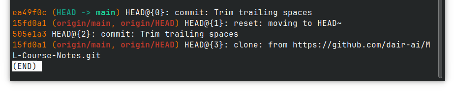
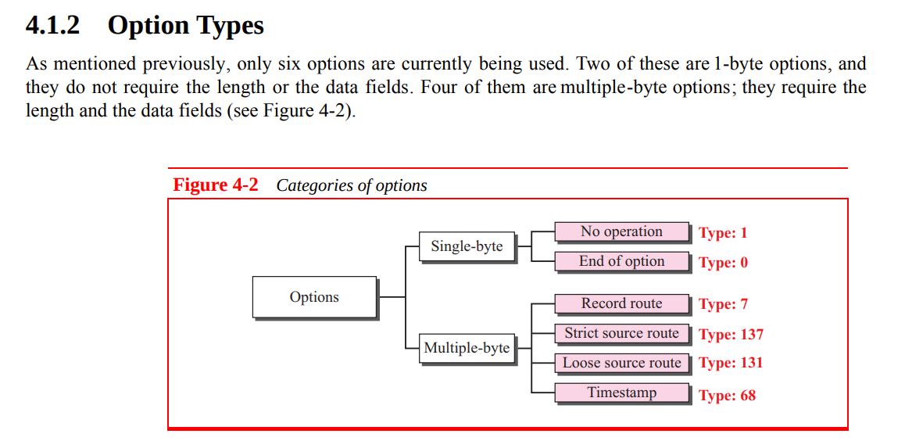
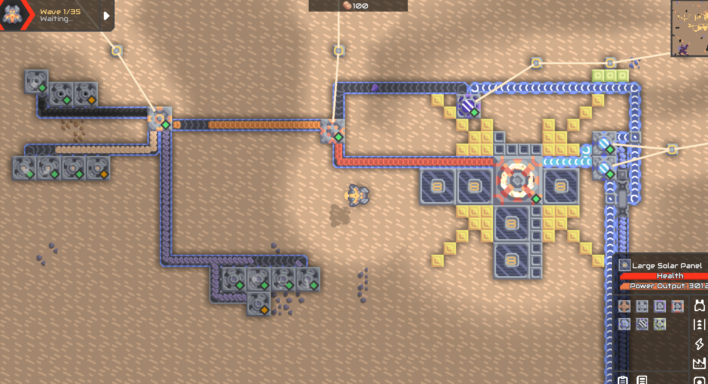

## 玩汞活动记录 2023 Ver. 

恩，总之还是浑浑噩噩地熬到现在了。<!--[去年 wp 的 epilogue][hg2022-wp-epilogue]-->

一觉睡醒已经是 28 号下午，就没啥一血能抢了哈哈。

往这边 PR 的版本，我只截取了我觉得比较有意思的一些题目

感谢 ChatGPT 助我上大分（


---

### 玩円神玩的（签到） 

这种一般都是改改 URL 的小把戏。

<!--但好像直接改 similarity 就提交会被打回来，就急了，对着 js 一顿改也改不出所以。-->


（似乎要先录制一遍提交上去？）结尾加参数 `?similarity=99.99999` 就行

这...太原了，不愧是 www.玩原神玩的.com


---

### Deep♂er & dark♂er

[是不是每年都有银梦梗啊](https://blog.h3a.moe/src/EX00007/#%E9%BB%91%E8%89%B2%E9%AB%98%E7%BA%A7%E8%87%AA%E5%8A%A8%E6%9C%BA%EF%BC%88Flag-%E8%87%AA%E5%8A%A8%E6%9C%BA%EF%BC%89)，端口号怎么是 11451（


但是呢就算一直按着 pgdown 也不是个头，就想去看看有没有哪里骗 flag 的，结果给在 main.js 里面碰上了：


那在 console 里面执行一遍就可以了：

```javascript
hash = CryptoJS.SHA256(`dEEper_@nd_d@rKer_${localStorage.token}`).toString();
flag = `flag{T1t@n_${hash.slice(0, 32)}}`
```


---

### 我脑子有病（赛博井字棋）

看起来前端做不了什么，没有 flag，数据丢给后端处理。

查了下，井子棋先手有不输的下法。先下在任意角，然后对手不下中间就必赢。如果对手下中间就下在对角，至少不输。

下了一整天全是平手。就盘算可能要对 POST 表单下点手脚。**不敢想，真就是吃棋子。**

但是观察发现 AI 很机灵，都是下中间，那我可以试试最后吃掉中间的棋子。

```
[0,0] -> [2,2] -> [1,1]
```

每次的动作都是通过 POST 表单完成。需要用的应该只有清零 `'act': 'reset'` 和下子 `{'x':a, 'y':b} // a,b is in {0,1,2}` ，然后后端把它下出来的棋盘发过来。

用 py 丢三个 POST 上去应该就行。

不知道咋回事直接 `?token=` 不能用，只能开个网页然后借 Cookie 来用，但是被奇葩的 `Set-Cookie` 折腾了一下午，不处理就一直是重开一局，保不住棋局的状态。`requests.Session` 居然在自己设置 Cookie 以后就不处理 `Set-Cookie` 了，我还要自己处理 response header 发来的新 Cookie. 

```python
import requests
import logging
import http.client as http_client
import re

http_client.HTTPConnection.debuglevel = 1

# You must initialize logging, otherwise you'll not see debug output.
logging.basicConfig()
logging.getLogger().setLevel(logging.DEBUG)
requests_log = logging.getLogger("requests")
requests_log.setLevel(logging.DEBUG)
requests_log.propagate = True


def getNextCookie(header):
    SetCookie = header['Set-Cookie']
    regexp = re.compile("session\=(.*)\;\ HttpOnly\; Path\=\/")
    nextCookie = re.findall(regexp, SetCookie)[0]
    return nextCookie


with requests.Session() as hgsession:
    hgheaders = {
        'Cookie': 'session=<YOUR_SESSION>'
    }

    r = hgsession.get(
        'http://202.38.93.111:10077/', 
        headers = hgheaders,
        )
    
    print(r.headers)
    # [0,0] -> [2,2] -> [1,1] 
    # so that the AI cannot win

    r = hgsession.post(
        'http://202.38.93.111:10077/',
        headers = hgheaders, 
        json = { 'act': 'reset' }
        # data = { 'x':0, 'y':0 }
        )
    nextCookie = getNextCookie(r.headers)
    # print(nextCookie)
    
    r = hgsession.post(
        'http://202.38.93.111:10077/',
        headers = {'Cookie': 'session=' + nextCookie}, 
        json = { 'x':0, 'y':0 }
        # data = { 'x':0, 'y':0 }
        )
    print(r.text)
    nextCookie = getNextCookie(r.headers)

    r = hgsession.post(
        'http://202.38.93.111:10077/',
        headers = {'Cookie': 'session=' + nextCookie}, 
        json = { 'x':2, 'y':2 }
        # data = { 'x':0, 'y':0 }
        )
    print(r.text)
    nextCookie = getNextCookie(r.headers)

    r = hgsession.post(
        'http://202.38.93.111:10077/',
        headers = {'Cookie': 'session=' + nextCookie}, 
        json = { 'x':1, 'y':1 }
        # data = { 'x':0, 'y':0 }
        )
    print(r.text)
    # nextCookie = getNextCookie(r.headers)

```

后来听说了中间人抓包非常简单，是我太笨了。

做了一下午，我脑子有病。


---

### 组委会模拟器

看了下要处理的元素长这样：


**大概感觉是用个 userscript 去帮我 click**，但我不会 js 啊，那就指挥 chatgpt 帮我写（

prompt 如下：

```
I need to write a js userscript to capture some content and perform a click for the specific element. How should I start it

the element I need to find looks like this: "<div  class="fakeqq-message__bubble"><div  class="fakeqq-message__bubble-arrow"></div><span>这道题 flag 是hack[vbzpobcbwyioysfz]</span></div>"

The condition to click is that the <span> element contains a  substring that starts with "hack", then a pair of square brackets with some chars in it.

well, the page scrolls very quickly. so I need to quickly find the newly added elements, how to do that?

```

多次迭代后，最终得到了如下能用的回复：


> To quickly find and interact with newly added elements on a page that scrolls quickly, you can use Mutation Observers. A Mutation Observer is a JavaScript API that allows you to watch for changes in the DOM (Document Object Model) and react to those changes in real-time. Here's how you can use a Mutation Observer to find and interact with newly added elements:

```javascript
(function() {
    // Function to check if a message is a "hack" message
    function isHackMessage(messageText) {
        return messageText && messageText.startsWith("这道题 flag 是hack[") && messageText.endsWith("]");
    }

    // Function to process a single message
    function processMessage(messageBubble) {
        const messageText = messageBubble.querySelector('span');
        if (isHackMessage(messageText.textContent.trim())) {
            console.log('Captured content:', messageText.textContent.trim());
            messageBubble.click();
        }
    }
    
    // Callback function for the Mutation Observer
    function handleMutations(mutationsList, observer) {
        for (const mutation of mutationsList) {
            if (mutation.type === 'childList') {
                // New elements have been added
                for (const node of mutation.addedNodes) {
                    if (node.nodeType === Node.ELEMENT_NODE) {
                        const messageBubble = node.querySelector('.fakeqq-message__bubble');
                        if (messageBubble) {
                            processMessage(messageBubble);
                        }
                    }
                }
            }
        }
    }
    
    // Set up a Mutation Observer to watch for changes in the DOM
    const targetNode = document.body; // You can change the target node to be more specific
    const config = { childList: true, subtree: true };
    const observer = new MutationObserver(handleMutations);
    observer.observe(targetNode, config);
})();

```

> In this code:
>
> - The `handleMutations` function is the callback for the Mutation Observer. It checks for added nodes and, if they are elements, it looks for the message bubble and processes it if it's a "hack" message.
> - The Mutation Observer watches for changes in the DOM, specifically child node additions (`childList: true`) and sub-tree mutations (`subtree: true`). You can adjust the `targetNode` to target a more specific part of the DOM if necessary.
>
> This code will monitor the DOM for any newly added elements with the class "fakeqq-message__bubble" and process them as they are added, making it suitable for pages with rapidly scrolling content.

唉，头一次弄出一个能用的用户脚本，看它自动撤回真的好爽啊（


---

### 考 A 证，有 A 罩（虫）

是一个音频文件，听一耳朵就知道是 SSTV. 那就很简单了，随便丢给一个 SSTV 解码器放一遍就出来了。

*P.S. 感觉这张图有改造成梗图的潜力（（*


---

### 真是个饭桶呢 ww~（Git？Git！）

诶呀，这个我熟。~~咱之前可是动不动就 reset 一下，不要太熟练了~~

你的确 reset 了，可是 commit 并没有消失，只是脱离了 commit graph 而已。

只要 `git reflog` 一下就能看到之前 reset 掉的 commit，很明显是从 `505e1a3` reset 到了 `15fd0a1`



对比一下 `git log` 看到的


那大概就是这个样子（mermaid 里面的 gitGraph 只能画成这样了，**实际上 `505e1a3` 是没有 main- 指针的**，请见谅）


那就很简单了，直接 `git checkout 505e1a3` 就行，然后看一下 log 的修改就知道去哪找 flag 了（这个 author 太申必了


哈哈，吃了饭桶里的后悔药，也是会被发现的（（


---

### 模仿游戏 图灵再世（惜字如金 2.0）

本来差点放弃了，但是仔细看了一遍代码以后发现 `flag{` 和 `}` 是固定的。

我不由得想起 *The Imitation Game* 当中，破译 Enigma 的灵光一闪：德国人每天早上的广播的结尾是一样的。

代码里面有这样一行：

```python
check_equals(set(len(s) for s in cod_dict), {24})
```

决定了每行必加一个字母。

对于每一行，这样加完以后，首尾的 offset 应该与如下值完全一致：

```
00    23
24    47
48    71
72    95
96    119
```

我们就先不加上那一个字母，但是按照新的 offset 去算。

就近选字母，以每行开头参照，算出新的 offset. 

```
f 52     L3
l 41     L2
a 84/85  L4
g 108    L5
{ 74     L4
} 28     L2
```

而在输出 flag 代码里的预期值是：

```
f 53
l 41
a 85
g 109
{ 75
} 28
```

就知道如果少于预期值就在这个字符前面补，否则在后面补

实际操作的时候赌了一把，全部在最前面和最后面加。

第一行没有涉及上面的字符，大胆地加在了最后。

完整代码

```diff
#!/usr/bin/python3

# Th siz of th fil may reduc after XZRJification

def check_equals(left, right):
    # check whether left == right or not
    if left != right: exit(1)

def get_cod_dict():
    # prepar th cod dict
    cod_dict = []
-    cod_dict += ['nymeh1niwemflcir}echaet']
+    cod_dict += ['nymeh1niwemflcir}echaetA']
-    cod_dict += ['a3g7}kidgojernoetlsup?h']
+    cod_dict += ['a3g7}kidgojernoetlsup?hB']
-     cod_dict += ['ulw!f5soadrhwnrsnstnoeq']
+    cod_dict += ['Culw!f5soadrhwnrsnstnoeq']
-     cod_dict += ['ct{l-findiehaai{oveatas']
+    cod_dict += ['Dct{l-findiehaai{oveatas']
-     cod_dict += ['ty9kxborszstguyd?!blm-p']
+    cod_dict += ['Ety9kxborszstguyd?!blm-p']
    check_equals(set(len(s) for s in cod_dict), {24})
    return ''.join(cod_dict)

def decrypt_data(input_codes):
    # retriev th decrypted data
    cod_dict = get_cod_dict()
    output_chars = [cod_dict[c] for c in input_codes]
    return ''.join(output_chars)

if __name__ == '__main__':
    # check som obvious things
    # check_equals('creat', 'cr' + 'at')
    # check_equals('referer', 'refer' + 'rer')
    # check th flag
    flag = decrypt_data([53, 41, 85, 109, 75, 1, 33, 48, 77, 90,
                         17, 118, 36, 25, 13, 89, 90, 3, 63, 25,
                         31, 77, 27, 60, 3, 118, 24, 62, 54, 61,
                         25, 63, 77, 36, 5, 32, 60, 67, 113, 28])
    check_equals(flag.index('flag{'), 0)
    check_equals(flag.index('}'), len(flag) - 1)
    # print th flag
    print(flag)

```

最后发现有一个字母变成了大写的 C，那就是第三行开头的。

flag 看起来是一个英文句子，大胆猜测是本来应该是小写 u，还原惜字如金应该补在后面（`uClw!`）

蒙对。


---

### 为什么！（流式星球）

读了小半天代码大概看出来是把每一帧都读出来，然后顺序输出成二进制。

我自己的理解是这样的

```
buffer[frame][height][width][color_channel]

buffer[frame*height*width][color_channel]

buffer[frame*height*width*color_channel]
```

那要做的就是进行一个反变换，但是反过来就是因数分解，肯定更难。而且生成流的代码会在最后随机删除 0-100 个字节，使得通过字节数猜测分辨率和帧数几乎不可能，只能猜。内容只有视频流所以不考虑其他，无脑相乘就行。

```python
import cv2
import numpy as np

def convert_binary_to_mp4(input_file, output_file, frame_width, frame_height, frame_count):
    # Read the binary data from the file
    buffer = np.fromfile(input_file, dtype=np.uint8)
    
    # Reshape the data to the original shape
    buffer = buffer.reshape((frame_count, frame_height, frame_width, 3))
    
    # Create a VideoWriter object to save the frames as an MP4 video
    fourcc = cv2.VideoWriter_fourcc(*'mp4v')  # Codec for MP4 format
    out = cv2.VideoWriter(output_file, fourcc, 30, (frame_width, frame_height))
    
    # Write each frame to the video file
    for frame in buffer:
        out.write(frame)
    
    # Release the VideoWriter
    out.release()

if __name__ == "__main__":
    input_file = "xaa"
    output_file = "output_video.mp4"
    frame_width =  427    # Enter the frame width used in your original code
    frame_height = 759  # Enter the frame height used in your original code
    frame_count =  138   # Enter the frame count used in your original code

    convert_binary_to_mp4(input_file, output_file, frame_width, frame_height, frame_count)

```

一开始不太确信这个代码能用，还自己用了 kazam 录了一个很小的屏，再用题目给的代码转成流，再转换回来。虽然画质稍有下降，但应该恢复了了八成。

当然了，这里的帧数和宽高是要自己指定的。

这个代码有个不好就是：每次都要提前算好帧数和对应的比特流大小，然后用 `split` 把题目给的 bin 切成这个大小（所以你才会看到 xaa 这个文件名。就这都比我一开始傻不拉叽用 `dd bs=1` 好多了）

拿几个常见的分辨率了一下，只有 640*480 的勉强能看，然后大概知道 flag 在视频后半段。

这个画面实在是太模拟电视了，梦回世纪之交

*P.S. 我非常在意为什么会出现这样的图像，以前是真的因为分辨率不足，那这又是**为什么**？*

*P.P.S. 好了，看完神司的 wp 以后就懂了。同一行上两个重复内容的距离就是本来的宽度。*


列表，计算所需的 bit stream 大小

csv 格式：

width, height, sizeof(frame), sizeof(video.bin)/sizeof(frame), floor(frames), sizeof(frame)*floor(frames)


**分辨率大了重影更多，那宽度应该更小，但是如果太小了也是对不准，那估计和 640*480 差不到哪里去。**

那就再试试，结果无一例外还是不行


后面看了生成代码分辨率不能以 0 结尾，

```python
    assert frame_width % 10 != 0
    assert frame_height % 10 != 0
```

意识到不应该瞎猜常见分辨率，每次抠掉 bin 的结尾来 make numpy happy，再还原一整个视频；而应该先对每个可能的分辨率采一点样，然后一个个识别，于是开始糊采样代码。


不会接入 OCR 真的痛苦，得自己一张张去看。然后硬是找到这张能看的，但是重影里还能看到字幕，那看来高度不够


跑完宽度跑高度，不过高度还好，就算稍有偏差，画面的偏移也不大

```diff
import cv2
import numpy as np

if __name__ == "__main__":
    input_file = "video.bin"  # Assuming you have the binary data already loaded

    # Load the binary data into the buffer (you should have the buffer already)
    buffer = np.fromfile(input_file, dtype=np.uint8)

    # Define the range for frame_width and frame_height
-    for frame_width in range(100, 640, 1):
+    for frame_width in range(427, 428, 1):
-        for frame_height in range(432, 433, 1):
+        for frame_height in range(600, 800, 1):
            # Calculate the size of one frame
            frame_size = frame_width * frame_height * 3  # 3 color channels (assuming no compression)
            # Extract the data of the 1st frame
            first_frame_data = buffer[:frame_size].reshape((frame_height, frame_width, 3))
            # Save the 1st frame as an image
            filename = f"{frame_width}_{frame_height}.png"  # Output image file
            cv2.imwrite(filename, first_frame_data)

```

逐张辨识，直到字幕位置合适


然后计算帧数和大小


成功了（


~~这不就手机短视频分辨率，是我落伍了~~

~~最后更是意识到应该去找那个B站帐号 MyGO_Official（（（~~

还有我怎么看到题解各位做出来 bangdream 的字都是黄色的，就我调出来是蓝色吗，问了群友说是 OpenCV 颜色通道顺序反了，弄成 BGR 了，但我真的没感觉到啊...

也就只有做做 misc 的份了，后面的计算器那题根本做不出来。唉，羡慕 MyGO，这部番我都还没看


---

### Batter my heart, three-personed God (Komm, süsser Flagge)

**从没觉得 TCP 有意思过**

```
-A myTCP-1 -p tcp -m string --algo bm --string "POST" -j REJECT --reject-with tcp-reset
```

过滤字符串 POST 的

想了下 payload 应该可以切开，那要么试试？

```python
import socket

ip = "202.38.93.111"
port = 18082
token = "YOUR_TOKEN"

# establish TCP conn
s = socket.socket(socket.AF_INET, socket.SOCK_STREAM)
s.connect((ip, port))

# "PO"
s.send(b"PO")

# "ST / HTTP/1.1"
request = "ST / HTTP/1.1\r\nHost: {}\r\nContent-Length: {}\r\n\r\n{}".format(ip, len(token), token)
s.send(request.encode())
# get response
response = s.recv(4096)
print(response.decode())

# close conn
s.close()

```

===

**那样就和单纯的复制没什么区别了**

```
-A myTCP-2 -p tcp -m u32 --u32 "0 >> 22 & 0x3C @ 12 >> 26 @ 0 >> 24 = 0x50" -j REJECT --reject-with tcp-reset
```

问 GPT，GPT 说 TCP Payload 的第一个字不能是 `\x50` 也就是 P。

我一开始傻不拉叽看反了，然后直接把第一问改了端口发出去了

flag 拿到了就没多想，现在一看是非预期（

===

**为什么 Layer 3 的东西都是又难又冷门的**

```
-A myTCP-3 -p tcp -m string --algo bm --from 0 --to 50 --string "GET / HTTP" -j ACCEPT
-A myTCP-3 -p tcp -j REJECT --reject-with tcp-reset
```

一开始想着是不是 TCP payload 的前五十个字，不行，发 SYN 的时候就给重置了

一查，结果好家伙，给我看到[这个](https://serverfault.com/a/1000470)：

> The `--to` option gives you the **maximal** offset at which your string can start. The offset is relative to the start of the IP packet. If you add up:
>
> - **20** bytes for the IP header,
> - **20** bytes for the TCP header,
> - **12** bytes for some TCP options
>
> you'll end up with 52 bytes. So the start of the TCP payload is at  offset 52, anything less than that will match just the TCP/IP headers.
>
> Remark that the TCP options do not have a fixed length. The number 12 was obtained experimentally through **tcpdump**, but every system can send a different number of options.

iptables 是从 IP 头开始筛，前面已经 20+20=40 byte 了，再带个时间戳就是 52 字节了 


我当时脑子抽了把 IP header Options 给无视了，觉得能够自由发挥的只剩 TCP header 里面的 Options，`GET / HTTP` 正好是 10 字节，算上刚才的就正好是50。

那些现成的客户端都不带改 TCP header 的选项，我居然还要自己糊 TCP 数据包。

*哈哈，没救了，我这辈子还没自己写过三次握手。*

窝当时是那么想的，于是闷头开始搞了。一开始是抄的[这个](https://zhuanlan.zhihu.com/p/372206740)，scapy 模拟三次握手发包，我三次握手都已经忘完了


顺便防止系统主动发 RST 还得再补一条 iptables 规则

```
iptables -A OUTPUT -d 202.38.93.111/32 -p tcp -m tcp --tcp-flags RST RST -j DROP
```

不然好不容易对面 SYN-ACK，结果自己这边 RST 了。

scapy 可以自己改 TCP header options，但是不幸地，我看不懂它的文档，写得太差了，~~连个例题都没有让人怎么做题啊~~此处省略一万字友好问候。问 google 也没结果，GPT 也变得跟个笨蛋一样

于是只能把我自己糊的 custom options 直接接在 20Byte TCP header 后面，然后把 header 长度（也就是 scapy 中的 `dataofs`）改上去。

不行，一直都是 HTTP 400，连电线鲨鱼都不认识我写的 TCP 包。特别是 fast open cookie 也过不去的时候，我真的快崩溃了，真的凑了很久的 header 啊，但是 HTTP 400 了。能确信的也就一件事情，就是调节 TCP header 长度的时候发现，服务器确实能辨认大于 20 字节的 TCP 包头。看了看电线鲨鱼抓出来的包，一般的 HTTP 的 TCP Options 似乎都是 12 字节的时间戳？但我真凑不出来，一凑就报错，估计是被系统动过了。

<!--中间反复尝试发包结果被墙的事情太丢脸了，实在说不出口-->

到这个时候已经四天没怎么合眼了，精神状态已经在崩溃了。怎么办呢，要么试试 IP header Options？

看了看这个介绍 IP Options 的[文件](https://net.academy.lv/lection/net_LS-08ENa_ip-options.pdf)



支持多字节的四个选项，两个 source-route 是用来路由的，不能用，剩一个 RR 和 timestamp

试 timestamp 吧

根据 RFC781 的规定：

```
II.  FORMAT SPECIFICATION

     As an IP option, the contents of the first two octets are dictated by the
IP header format to be option type and option length in octets [Postel 80].
The next two octets are used to control this option.


     0               7               15              23              31
     +---------------+---------------+---------------+---------------+
     |     type      |    length     |    offset     |overflw| flags |
     +---------------+---------------+---------------+---------------+
     |                          internet ID                          |
     +---------------+---------------+---------------+---------------+
     |                          time stamp                           |
     +---------------+---------------+---------------+---------------+
                                     .
                                     .
                                     .
     option type = 68 decimal (i.e., option class = 2 and option number = 4);

     option length = the number of octets with a maximum of 40 (limited by
                 IHL = 15);

     offset =    the number of octets from the beginning of this option to the
                 end of timestamps (i.e., the beginning of space for next
                 timestamp).  It is set to one, an odd number, when no more
                 space remains in the header for timestamps;

     overflow =  the number of IP modules that cannot register timestamps due
                 to lack of space;

     flag = 0 -- time stamps only
            1 -- each timestamp is preceded with internet ID of the
                 registering entity
            3 -- the internet ID fields are prespecified.  An IP module only
                 registers its timestamp if it matches its own ID with the
                 next specified internet ID;

     internet ID = ID for the timestamping device;

     timestamp = a right-justified, 32-bit timestamp in milliseconds modulo
                 24 hours from midnight UT.

     The timestamp option is not copied upon fragmentation.  It is carried in
the first fragment.

```

想让它不再被乱动，就把 flag 置 3 也可以？

然后 offset 置 1，

把 `GET / HTTP` 拆开成三段，然后 padding 一下就好了

`\x47\x45\x54\x20` 是一个合法的 IPv4 地址

`\x2F\x20\x48\x54` 是一个合法的 unix 时间戳

`\x54\x50\x00\x00` 也是一个合法的 IPv4 地址

最后 pad 一个更大的时间戳就好了 `\x60\x00\x00\x00`

那要构造的包大概长这样：

```python
b'\x44\x14\x01\x03\x47\x45\x54\x20\x2F\x20\x48\x54\x54\x50\x00\x00\x60\x00\x00\x00'
```

但好像这样跑会报错，试了把开头的 Copy 位改成 1 （e.g. `\xC4`）就好了。


这样的 IP header 长度是 40 Byte，把 ihl 置为 10. 顺便终于学会了怎么加 IPOptions

```python
from scapy.all import *
# src_ip = "149.28.128.196"
# dst_ip = "202.38.93.111"
dst_ip = "192.168.23.1"
dst_port = 18082
src_port = random.randint(1024,65535)
# custom_options_data = b'\x47\x45\x54\x20\x2F\x20\x48\x54\x54\x50\x2F\x31\x2E\x31\r\n'
# custom_options_data = b'\xE7\x0F\x04GET / HTTP\x00\x00\x00'
custom_options_data = b'\xE4\x14\x01\x03\x47\x45\x54\x20\x2F\x20\x48\x54\x54\x50\x00\x00\x60\x00\x00\x00'

spk1 = IP(ihl=10, dst = dst_ip, options=IPOption(custom_options_data)) / TCP(dport = dst_port, sport = src_port,  flags="S")  # sport = random.randint(1024,65535)
spk1.show()
res1 = sr1(spk1)
print(res1)

ack1 = res1[TCP].ack
ack2 = res1[TCP].seq + 1
spk2 = IP(ihl=10, dst = dst_ip, options=IPOption(custom_options_data)) / TCP(dport = dst_port, sport = src_port, seq=ack1, ack=ack2, flags="A")
send(spk2)
print("spk2 sent")

http_post_request = b"POST / HTTP/1.1\r\n" \
                    b"Host: 202.38.93.111\r\n" \
                    b"Content-Length: 101\r\n\r\n" \
                    b"YOUR_TOKEN\r\n\r\n"

spk3 = IP(ihl=10, dst = dst_ip, options=IPOption(custom_options_data)) /  TCP(dport = dst_port, sport = src_port, seq=ack1, ack=ack2, flags=24) / http_post_request
res2 = sr1(spk3)
# print("got res2")
print(res2)

```

不知道为什么，直接发到公网 IP 没反应，但是又跑了一遍前两问又没问题。接了一下 OpenVPN 以后好了。

然后电线鲨鱼抓一下包就可以。当然我在 VPS 上面跑的，抓包用的是 

```sh
tshark -i hgovpn-guest
```

然后在 `/tmp` 找到 pcap 拖回本地打开看到 flag。


---

### 开关序列也是一种二进制（异星歧途）

（此处需要一张九宫格梗图）

**做这题的手感就是：非常数字电路**

mindustry 下载界面居然逼捐，那个跳过的字太小了，一时竟找不到，差点对着 GitHub Release 一顿折腾了（


要让冲击反应堆工作。把四个依赖的机器都带起来就行，冷却液优先，防止过热。所以建议先做第 4 组。

总共 4 排，共计 32 个开关。稍微搜了一下发现开关是为处理器提供输入的，于是去找处理器。

从左至右编号为 1-8

===

第一部分就是让那个烧煤的小发电机工作


点进去好像还能复制处理器代码的。

```
sensor s1 switch1 @enabled
sensor s2 switch2 @enabled
sensor s3 switch3 @enabled
sensor s4 switch4 @enabled
sensor s5 switch5 @enabled
sensor s6 switch6 @enabled
sensor s7 switch7 @enabled
sensor s8 switch8 @enabled
jump 18 equal s1 false
jump 18 equal s2 true
jump 18 equal s3 false
jump 18 equal s4 true
jump 18 equal s5 true
jump 18 equal s6 false
jump 18 equal s7 true
jump 18 equal s8 false
control enabled generator1 1 
end
control enabled generator1 0 
end

```

一个开关符合条件就不能开机，所以全部取反

1010 0101

===

第二部分 让太阳板给抽水机供电，抽水机给蒸汽机供水，烧炉子发电（


```
sensor sw1 switch1 @enabled
sensor sw2 switch2 @enabled
sensor sw3 switch3 @enabled
sensor sw4 switch4 @enabled
sensor sw5 switch5 @enabled
sensor sw6 switch6 @enabled
sensor sw7 switch7 @enabled
sensor sw8 switch8 @enabled
op shl t sw1 7
set number t
op shl t sw2 6
op add number number t
op shl t sw3 5
op add number number t
op shl t sw4 4
op add number number t
op shl t sw5 3
op add number number t
op shl t sw6 2
op add number number t
op shl t sw7 1
op add number number t
set t sw8
op add number number t
set en 0
set i 0
jump 33 greaterThanEq i 16
op pow fl0 i 2
jump 31 notEqual fl0 number
set en 1
jump 33 always x false
op add i i 1
jump 26 always x false
op equal fl1 0 sw1
op equal fl2 0 sw6
op or fl3 fl1 fl2
jump 38 equal fl3 0
set en 0
control enabled generator1 en 
control enabled panel1 en 
end

```

按位加权应该是计算十进制的值

然后从1循环到15看是不是正整数的平方，让使能变量变成 1，并且 SW1 和 SW6 要开着，才能启动蒸汽炉子，烧开水发电（

画了个流程图长这样：


<!--[](./img/20-2-2.png)-->

`FL_3==0` 那个条件改写下表达式就是 !(SW1 and SW6)

想让 FL_3 为 0，那 SW1 和 SW6 都是 1，也就是说整个数字至少是 2^7 + 2^2 = 132，同时小于等于 15^2 = 225

那就一个个试，还剩 

```
12 144 = 132 + 12 = 128 + 8 + 4 + 4  

13 169 = 132 + 37 = 128 + 32 + 4 + 4 + 1

14 196 = 132 + 64 = 128 + 64 + 4

15 225 = 132 + 93 = 128 + 64 + 16 + 8 + 4 + 4 + 1 
```

12 13 15 中 4 都要出现两次，排除。

最终结果就是 1100 0010 

===

第三部分

小处理器控制炮塔的，不涉及开关，无视

要给反应堆喂燃料和冷却液，让它发电


```
sensor sw1 switch1 @enabled
sensor sw2 switch2 @enabled
sensor sw3 switch3 @enabled
sensor sw4 switch4 @enabled
sensor sw5 switch5 @enabled
sensor sw6 switch6 @enabled
sensor sw7 switch7 @enabled
sensor sw8 switch8 @enabled
sensor sw9 switch9 @enabled
control enabled conveyor2 sw1 
control enabled gate1 sw2 
op equal nsw3 sw3 0
control enabled reactor1 nsw3 
control enabled reactor2 nsw3 
control enabled conduit1 sw4 
control enabled conduit2 sw4 
control enabled mixer1 sw5 
control enabled extractor1 sw6 
control enabled meltdown1 sw7 
control enabled meltdown2 sw7 
op equal result sw8 sw9
jump 28 equal result true
control enabled mixer1 0
control enabled conduit2 1 
control enabled reactor1 1 
control enabled reactor2 1 
control enabled conveyor2 1 
wait 5
end

```

SW1 控制 conveyor2，开闸门，给反应堆喂矿石

SW2 控制 gate1，把冷却剂要用的钛矿石喂进虚空

SW3 取反后，控制反应堆开关。

SW4 控制 conduit1/2，两根一起漏水，会导致冷却液无法合成

SW5 控制 mixer，合成冷却液

SW6 控制 extracter，抽水上来喂给 mixer

SW7 控制炮台，开久了力场会缩小？总之不太妙，不开

SW8 会和 SW9 比较，如果不同，就会强制打开闸门、漏水管和反应堆，关闭冷却液合成器，导致反应堆过热爆炸

===

反应堆会炸，是因为矿石闸门打开，矿石涌入触发反应堆启动，但没有输入冷却水，导致过热。

**那先开 SW6 抽水，然后开 SW5 合成冷却液，然后等反应堆里冷却液满了再开 SW1 喂矿石就行**

SW9 是之前第二组的 SW8，是 0，那这边也置 0

1000 1100

===

第四部分 冲击反应堆的冷却液泵


高四位的 0111 是逐个枚举出来的，低四位的 0111 是在这之后嫌枚举太慢，凭手感猜出来的

拨开关的时候从电路的反馈有一点点时序电路的手感，但是最后趋稳了，应该是没有的

```
sensor t switch1 @enabled
control enabled source1 t 
sensor t switch2 @enabled
control enabled source2 t 
sensor t switch3 @enabled
control enabled source3 t 
sensor t switch4 @enabled
control enabled source4 t 
sensor t switch5 @enabled
control enabled source5 t 
sensor t switch6 @enabled
control enabled source6 t 
sensor t switch7 @enabled
control enabled source7 t 
sensor t switch8 @enabled
control enabled source8 t 

```

看了官方 wp 才知道这是门电路，我数字电路全都白学了

尝试恢复了一下电路

两个 NAND 合进 NOT 的位置可能加个 OR 更安全一些？


顺便吐槽一下，气动和机械的钻头不用电



钍反应堆的金属来源


冲击堆的冷却水是地表水，两个水泵打上来，旁边是虚空，但是不给掉下去


冲击堆冷却剂的钛来源，地图右下角了


---

### 写在最后

中间用到好多次 python. 

要用到好多平时不用的库，为了不弄脏我的宝贝环境，第一次学会用 `venv`. 

虽然方法也很残废就是

```shell
# init venv in the folder
python3 -m venv venv
# execute every time running a new terminal
source venv/bin/activate
```


---

[hg2022-wp-epilogue]: https://blog.h3a.moe/src/EX00007/#%E5%86%99%E5%9C%A8%E6%9C%80%E5%90%8E