# 中国科学技术大学第十届信息安全大赛非官方题解暨吐槽（Ishisashi 篇）
## \[web\] Hackergame 启动
一开始尝试内录，无果，猜想是把相似度 POST 过去的。于是打开 Fiddler 把 similarity 改成 114514，顺利通过。

但其实我赛后才知道它不是 POST，而是 GET，所以直接浏览器地址栏就可以改……

## \[general\] 猫咪小测
> 1. 想要借阅世界图书出版公司出版的《A Classical Introduction To Modern Number Theory 2nd ed.》，应当前往中国科学技术大学西区图书馆的哪一层？**（30 分）**

Google 搜寻中国科学技术大学西区图书馆简介，得到[情报](https://lib.ustc.edu.cn/%E6%9C%AC%E9%A6%86%E6%A6%82%E5%86%B5/%E5%9B%BE%E4%B9%A6%E9%A6%86%E6%A6%82%E5%86%B5%E5%85%B6%E4%BB%96%E6%96%87%E6%A1%A3/%E8%A5%BF%E5%8C%BA%E5%9B%BE%E4%B9%A6%E9%A6%86%E7%AE%80%E4%BB%8B/)。

可见外文书库在 12 楼。

> 2. 今年 arXiv 网站的天体物理版块上有人发表了一篇关于「可观测宇宙中的鸡的密度上限」的论文，请问论文中作者计算出的鸡密度函数的上限为 10 的多少次方每立方秒差距？**（30 分）**

恰巧在知乎上[刷到过](https://www.zhihu.com/question/20337132/answer/3023506910)。

那答案就是 23 呗。

> 3. 为了支持 TCP BBR 拥塞控制算法，在编译 Linux 内核时应该配置好哪一条内核选项？**（20 分）**

Google 搜寻 TCP BBR CONFIG_ 得 CONFIG_TCP_CONG_BBR。

> 4. 🥒🥒🥒：「我……从没觉得写类型标注有意思过」。在一篇论文中，作者给出了能够让 Python 的类型检查器 <del>MyPY</del> mypy 陷入死循环的代码，并证明 Python 的类型检查和停机问题一样困难。请问这篇论文发表在今年的哪个学术会议上？**（20 分）**

Google 搜寻 mypy infinite loop 得论文 [Python Type Hints Are Turing Complete](https://drops.dagstuhl.de/opus/volltexte/2023/18237/pdf/LIPIcs-ECOOP-2023-44.pdf)，看档案名 LIPIcs-ECOOP-2023-44.pdf 就知当然是 ECOOP 啦。

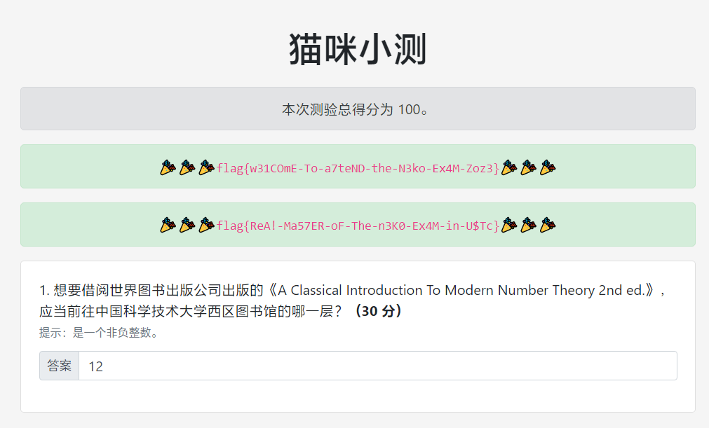

今年猫咪小测好简单，一遍过了属于是。


一次交两问 Flag 就报频繁，我能怎么办，我真的是一遍过的啊 www

### Omake：实况截图


## \[web\] 更深更暗
修改 static/main.js：
```JavaScript
    async function getFlag(token) {
        // Generate the flag based on user's token
        let hash = CryptoJS.SHA256(`dEEper_@nd_d@rKer_${token}`).toString();
        console.log(`flag{T1t@n_${hash.slice(0, 32)}}`);
        return `flag{T1t@n_${hash.slice(0, 32)}}`;
    }
```
就嗯 console.log 啊嗯（

## \[general\] 旅行照片 3.0
> 与学长碰面后，他带你参观了他的学校。在校园的一个展厅内，你发现了一枚神秘的金色奖牌，它闪闪发光，令人心生羡慕。

这个奖章一看就知道是诺贝尔科学奖的。2002 年（MMII）获得诺贝尔科学奖的日本人当然是小柴昌俊啦。

小柴昌俊获诺贝尔科学奖后，其母校东京大学特地设立了[小柴厅](https://www.s.u-tokyo.ac.jp/ja/hall/koshiba.html)。

东大 [Science Gallery](https://www.s.u-tokyo.ac.jp/ja/gallery/nobelprize/) 展出了真锅淑郎、梶田隆章、小柴昌俊三人奖牌的复制品。三人中最年轻的是 1959 年生的梶田隆章，所在的[东大宇宙线研究所](https://www.icrr.u-tokyo.ac.jp/)缩写为 ICRR。

> 离开校园后，你和学长走到了附近的一家拉面馆用餐。那家店里的拉面香气扑鼻，店内的装饰和氛围也充满了日式的风格。 学长（下图左一）与你分享了不少学校的趣事。饭后，你们决定在附近散步，享受这难得的闲暇时光。当你们走到一座博物馆前时， 马路对面的喷泉和它周围的景色引起了你的注意。下午，白色的帐篷里即将举办一场大型活动，人们忙碌的身影穿梭其中，充满了期待与热情。

这个喷泉乍一看有点眼熟……嗯……

到达世界最高层——上野！哎呀这不上野公园吗，还是看看上野动物园罢家人们。

——说起来之前见一上海人把上海野生动物园称作上野动物园，我没反应过来还以为人家在日本（

<del>从上野去龟有比较便捷，作为两津控想去龟有圣地巡礼了啊嗯</del>

我很清楚第二问的答案必定是 ICRR，但是一直没把第一问做出来。原来，我误以为活动在 6 月或 7 月，所以填了好几个活动的日期都不正确，甚至一度误以为有可能把第二问搞错了；其实应该是 8 月 10 日——还是破罐子摔碎，穷举六月到九月的日期才出来的……

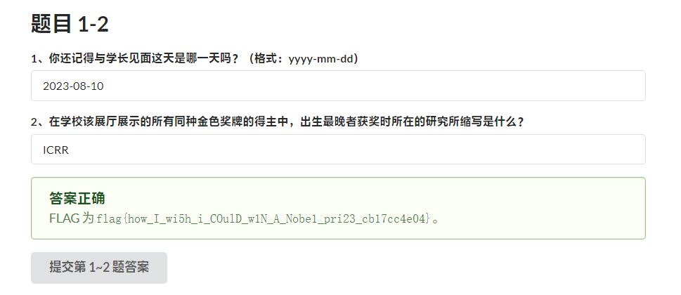

知道日期以后就能倒推活动了，上网搜寻得[「全国梅酒祭 in 东京 2023」](https://umeshu-matsuri.jp/tokyo_ueno/)。

网页中就有 Staff 募集的[连结](https://umeshu-matsuri.jp/tokyo_staff/)，点进去立刻就能看到 S495584522。

在上野公园的博物馆当然是东京国立博物馆。我印象中在特定日期留学生可以免费参观罢，但其实我也不确定……反正填 0 日元就过了。

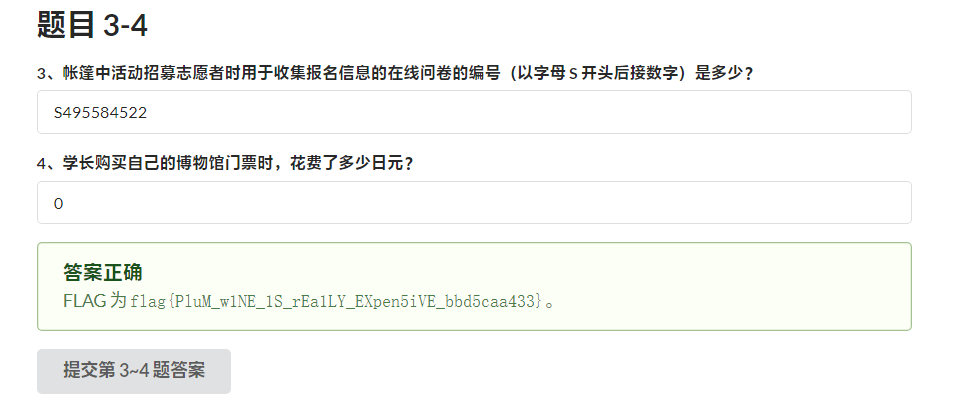

> 在参观完博物馆后，学长陪你走到了上野站。你们都感到有些不舍，但知道每次的分别也是为了下次更好的相聚。 学长那天晚上将继续他的学术之旅，打算乘船欣赏东京的迷人夜景和闪耀的彩虹大桥（Rainbow Bridge）。 而你则搭乘了开往马里奥世界的电车，在那里度过了一段欢乐的时光。

看到 2023 年 8 月 10 日我以为他去参加「东大 Week@Marunouchi 2023」了，但其实不是，而是直接回东大了。这样的话自然是安田讲堂了。

Google 一搜「ボタン＆カフリンクス JR上野」，好巧不巧，正好搜到一个翌日的[文章](https://plaza.rakuten.co.jp/ayumilife/diary/202308110000/)。那就是熊猫了。

东京任天堂旗舰店在涩谷。搜「渋谷駅前 3D」得秋田犬。

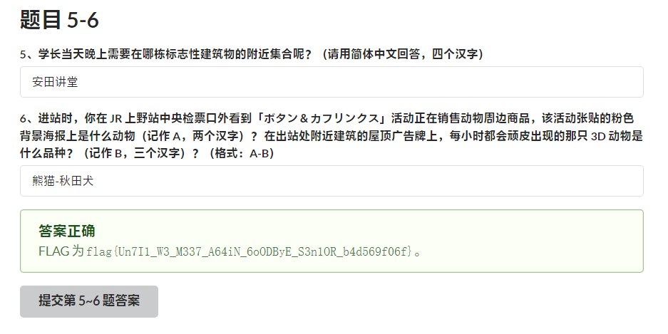

## \[web\] 赛博井字棋


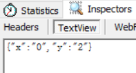

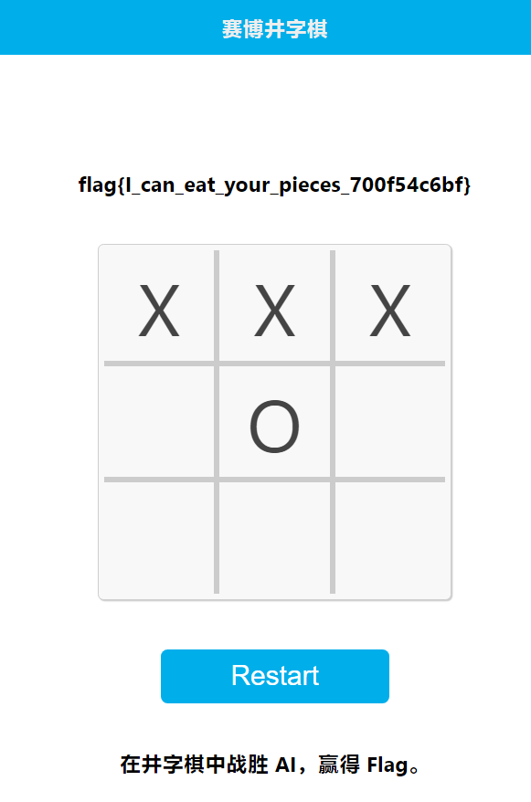

我真的万万没想到正解居然是把对手的棋子覆盖掉……本以为服务器会做这个判断的……

↑只是好奇看看强行覆盖会报甚么样的错，没想到是正解（

## \[general\] 奶奶的睡前 flag 故事
> 奶奶**在最后**会告诉你一个特别的密码

对啊就是在最后啊。

还是有点像建安某个[解密](https://www.bilibili.com/video/av699186735)，那个 HEX TO G.txt 就出现了两个 IEND，后面一截是另一张图的残片；这题同理。

其实很惭愧的是那道题我没做出来——删掉中间的一大堆 IDAT 才出现了色调严重失真的画面。反正眼睛花了都描不出完整的 QR 码。

我开始做本题的时候也是如此，狂删 IDAT，但是——


看到个「奶奶爱你」都硬是没看清楚 Flag，怎么办呢？

还是得从题干的粗体找答案。

「谷歌『亲儿子』」指的自然是 Pixel。搜寻「Pixel 截图 bug」可以找到 [acropalypse](https://acropalypse.app/)，这就是正解了。


（虽然但是，这网站处理不了建安那题就是）

## \[web\] 组委会模拟器
谢谢出题人，已经练出超高手速了（？）

（↑见 [bandicam 2023-10-29 00-28-37-734.mp4](https://github.com/mrhso/IshisashiWebsite/raw/master/CTF/Hackergame%202023/bandicam%202023-10-29%2000-28-37-734.mp4)）

——真的是手点的吗？

之前写过个把 Twitter 文本语文设定置零的[脚本](https://github.com/mrhso/IshisashiWebsite/blob/master/%E4%B9%B1%E5%86%99%E7%A8%8B%E5%BC%8F/Twitter%20lang%3D-und-.user.js)，感觉改改就能用。
```JavaScript
// ==UserScript==
// @name         组委会模拟器
// @namespace    https://github.com/mrhso
// @version      0.1919810
// @description  想被大（略）售人强（略）了啊嗯
// @author       Ishisashi
// @match        http://202.38.93.111:10021/*
// @grant        none
// ==/UserScript==

(function() {
    'use strict';

    let observer = new MutationObserver(() => {
        let messages = document.getElementsByClassName('fakeqq-message left-chat');
        for (let message of messages) {
            let box = message.childNodes[1].childNodes[1];
            if (box.innerText.match(/hack\[[a-z]+\]/gu)) {
                box.click();
            };
        };
    });

    observer.observe(document.body, { attributes: true, childList: true, subtree: true });
})();
```
那个录像用的脚本稍微加了点随机延迟而已。

## \[general\] 虫
这一听声音不就知道是 SSTV 吗？恰巧之前做建安那个[解密](https://www.bilibili.com/video/av356675524)用到过相关程式。


我前几天还买了正版 Virtual Audio Cable，用来内录别提多方便了（后仰）


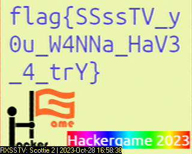

我是觉得建安那个难多了，还得用巧妙的方法除去噪声，不然根本不能看（尤其是最后一个 Robot 36 的）；有能力的读者不妨试试？（笑）

## \[general\] JSON ⊂ YAML?
直接 Google 搜寻 JSON is not a YAML subset 立刻就能看到一篇[文章](https://john-millikin.com/json-is-not-a-yaml-subset)。
```JSON
{"a": 1e2}
```
它就是 JSON ⊄ YAML 1.1 的答案。

而在 YAML 1.2 中似乎不允许重复 Key，因此……
```JSON
{"a": 1e2, "a": 1e2}
```
它既是 JSON ⊄ YAML 1.1 的答案，也是 JSON ⊄ YAML 1.2 的答案。

甚至可以卷一点，用 13 字符解决这题！
```JSON
{"":0,"":1e2}
```

## \[general\] Git? Git!
其实直接用百度搜「git 丢失 commit 还原」第一个就是 git reflog 啊嗯（


```
ea49f0c (HEAD -> main) HEAD@{0}: commit: Trim trailing spaces
15fd0a1 (origin/main, origin/HEAD) HEAD@{1}: reset: moving to HEAD~
505e1a3 HEAD@{2}: commit: Trim trailing spaces
15fd0a1 (origin/main, origin/HEAD) HEAD@{3}: clone: from https://github.com/dair-ai/ML-Course-Notes.git
```
我说好好好好好，直接 `git reset --hard 505e1a3` 就完事了嗷。

## \[web\] HTTP 集邮册
状态名称根据 [RFC 9110](https://datatracker.ietf.org/doc/html/rfc9110) 编写。

200 OK
```
GET / HTTP/1.1\r\n
Host: example.com\r\n\r\n
```
400 Bad Request
```
GET / HTTP/1.1\r\n
Host: example.com/aaa.txt\r\n\r\n
```
404 Not Found
```
GET /aaa.txt HTTP/1.1\r\n
Host: example.com\r\n\r\n
```
405 Method Not Allowed
```
POST / HTTP/1.1\r\n
Host: example.com\r\n\r\n
```
505 HTTP Version Not Supported
```
GET / HTTP/114.514\r\n
Host: example.com\r\n\r\n
```
414 URI Too Long
```
GET /gjbclckggghjkmnngjbclckggghjkmnnhfccchkogfyujhgjbclckggghjkmnngjbclckggghjkmnnhfccchkogfyujhggjbclckggghjkmnnhfgjbclckggghjkmnngjbclckggghjkmnnhfccchkogfyujhggjbclckggghjkmnnhfccchkogfyujhghhhhjiijjhhhyyhfcvvbhhhggfftujhhhhjiijjhhhyyhfcvvbhhhggfftujhfccchkogfyujhghhgjbclckggghjkmnngjbclckggghjkgjbclckggghjkmnngjbclckggghjkmngjbclckggghjkmnngjbclckggghjkmnnhfccchkogfyujhggjbclckggghjkmnnhfccchkogfyujhghhhhjiijjhhhyyhfcvvbhhhggfftujhhhhjiijjhhhyyhfcvvbhhhggfftujhfccchkogfyujhghhhhjiijjhhhyyhfcvvbhhhggfftujnhfccchkogfyujhggjbclckggghjkmnnhfccchkogfyujhghhhhjiijjhhhyyhfcvvbhhhggfftujhhhhjiijjhhhyyhfcvvbhhhggfftujhfccchkogfyujhghhhhjiijjhhhyyhfcvvbhhhggfftujmnnhfccchkogfyujhggjbclckggghjkmnnhfccchkogfyujhghhhhjiijjhhhyyhfcvvbhhhggfftujhhhhjiijjhhhyyhfcvvbhhhggfftujhfccchkogfyujhghhhhgjbclckggghjkmnngjbclckggghjkmnnhfccchkogfyujhgjbclckggghjkmnngjbclckggghjkmnnhfccchkogfyujhggjbclckggghjkmnnhfgjbclckggghjkmnngjbclckggghjkmnnhfccchkogfyujhggjbclckggghjkmnnhfccchkogfyujhghhhhjiijjhhhyyhfcvvbhhhggfftujhhhhjiijjhhhyyhfcvvbhhhggfftujhfccchkogfyujhghhgjbclckggghjkmnngjbclckggghjkgjbclckggghjkmnngjbclckggghjkmngjbclckggghjkmnngjbclckggghjkmnnhfccchkogfyujhggjbclckggghjkmnnhfccchkogfyujhghhhhjiijjhhhyyhfcvvbhhhggfftujhhhhjiijjhhhyyhfcvvbhhhggfftujhfccchkogfyujhghhhhjiijjhhhyyhfcvvbhhhggfftujnhfccchkogfyujhggjbclckggghjkmnnhfccchkogfyujhghhhhjiijjhhhyyhfcvvbhhhggfftujhhhhjiijjhhhyyhfcvvbhhhggfftujhfccchkogfyujhghhhhjiijjhhhyyhfcvvbhhhggfftujmnnhfccchkogfyujhggjbclckggghjkmnnhfccchkogfyujhghhhhjiijjhhhyyhfcvvbhhhggfftujhhhhjiigjbclckggghjkmnngjbclckggghjkmnnhfccchkogfyujhgjbclckggghjkmnngjbclckggghjkmnnhfccchkogfyujhggjbclckggghjkmnnhfgjbclckggghjkmnngjbclckggghjkmnnhfccchkogfyujhggjbclckggghjkmnnhfccchkogfyujhghhhhjiijjhhhyyhfcvvbhhhggfftujhhhhjiijjhhhyyhfcvvbhhhggfftujhfccchkogfyujhghhgjbclckggghjkmnngjbclckggghjkgjbclckggghjkmnngjbclckggghjkmngjbclckggghjkmnngjbclckggghjkmnnhfccchkogfyujhggjbclckggghjkmnnhfccchkogfyujhghhhhjiijjhhhyyhfcvvbhhhggfftujhhhhjiijjhhhyyhfcvvbhhhggfftujhfccchkogfyujhghhhhjiijjhhhyyhfcvvbhhhggfftujnhfccchkogfyujhggjbclckggghjkmnnhfccchkogfyujhghhhhjiijjhhhyyhfcvvbhhhggfftujhhhhjiijjhhhyyhfcvvbhhhggfftujhfccchkogfyujhghhhhjiijjhhhyyhfcvvbhhhggfftujmnnhfccchkogfyujhggjbclckggghjkmnnhfccchkogfyujhghhhhjiijjhhhyyhfcvvbhhhggfftujhhhhjiijjhhhyyhfcvvbhhhggfftujhfccchkogfyujhghhhhjiijjhhhyyhfcvvbhhhggfftujhhjiijjhhhyyhfcvvbhhhggfftujccchkogfyujhghhhhjiijjhhhyyhfcvvbhhhggfftujhhhhjiijjhhhyyhfcvvbhhhggfftujhfccchkogfyujhghhhhjiijjhhhyyhfcvvbhhhggfftujggjbclckggghjkmnnhfccchkogfyujhghhhhjiijjhhhyyhfcvvbhhhggfftujhhhhjiijjhhhyyhfcvvbhhhggfftujhfccchkogfyujhghhhhjiijjhhhyyhfcvvbhhhggfftujjjhhhyyhfcvvbhhhggfftujhfccchkogfyujhghhhhjiijjhhhyyhfcvvbhhhggfftujhhjiijjhhhyyhfcvvbhhhggfftujccchkogfyujhghhhhjiijjhhhyyhfcvvbhhhggfftujhhhhjiijjhhhyyhfcvvbhhhggfftujhfccchkogfyujhghhhhjiijjhhhyyhfcvvbhhhggfftujggjbclckggghjkmnnhfccchkogfyujhghhhhjiijjhhhyyhfcvvbhhhggfftujhhhhjiijjhhhyyhfcvvbhhhggfftujhfccchkogfyujhghhhhjiijjhhhyyhfcvvbhhhggfftujjiijjhhhyyhfcvvbhhhggfftujhhjiijjhhhyyhfcvvbhhhggfftujccchkogfyujhghhhhjgjbclckggghjkmnngjbclckggghjkmnnhfccchkogfyujhgjbclckggghjkmnngjbclckggghjkmnnhfccchkogfyujhggjbclckggghjkmnnhfgjbclckggghjkmnngjbclckggghjkmnnhfccchkogfyujhggjbclckggghjkmnnhfccchkogfyujhghhhhjiijjhhhyyhfcvvbhhhggfftujhhhhjiijjhhhyyhfcvvbhhhggfftujhfccchkogfyujhghhgjbclckggghjkmnngjbclckggghjkgjbclckggghjkmnngjbclckggghjkmngjbclckggghjkmnngjbclckggghjkmnnhfccchkogfyujhggjbclckggghjkmnnhfccchkogfyujhghhhhjiijjhhhyyhfcvvbhhhggfftujhhhhjiijjhhhyyhfcvvbhhhggfftujhfccchkogfyujhghhhhjiijjhhhyyhfcvvbhhhggfftujnhfccchkogfyujhggjbclckggghjkmnnhfccchkogfyujhghhhhjiijjhhhyyhfcvvbhhhggfftujhhhhjiijjhhhyyhfcvvbhhhggfftujhfccchkogfyujhghhhhjiijjhhhyyhfcvvbhhhggfftujmnnhfccchkogfyujhggjbclckggghjkmnnhfccchkogfyujhghhhhjiijjhhhyyhfcvvbhhhggfftujhhhhjiijjhhhyyhfcvvbhhhggfftujhfccchkogfyujhghhhhgjbclckggghjkmnngjbclckggghjkmnnhfccchkogfyujhgjbclckggghjkmnngjbclckggghjkmnnhfccchkogfyujhggjbclckggghjkmnnhfgjbclckggghjkmnngjbclckggghjkmnnhfccchkogfyujhggjbclckggghjkmnnhfccchkogfyujhghhhhjiijjhhhyyhfcvvbhhhggfftujhhhhjiijjhhhyyhfcvvbhhhggfftujhfccchkogfyujhghhgjbclckggghjkmnngjbclckggghjkgjbclckggghjkmnngjbclckggghjkmngjbclckggghjkmnngjbclckggghjkmnnhfccchkogfyujhggjbclckggghjkmnnhfccchkogfyujhghhhhjiijjhhhyyhfcvvbhhhggfftujhhhhjiijjhhhyyhfcvvbhhhggfftujhfccchkogfyujhghhhhjiijjhhhyyhfcvvbhhhggfftujnhfccchkogfyujhggjbclckggghjkmnnhfccchkogfyujhghhhhjiijjhhhyyhfcvvbhhhggfftujhhhhjiijjhhhyyhfcvvbhhhggfftujhfccchkogfyujhghhhhjiijjhhhyyhfcvvbhhhggfftujmnnhfccchkogfyujhggjbclckggghjkmnnhfccchkogfyujhghhhhjiijjhhhyyhfcvvbhhhggfftujhhhhjiigjbclckggghjkmnngjbclckggghjkmnnhfccchkogfyujhgjbclckggghjkmnngjbclckggghjkmnnhfccchkogfyujhggjbclckggghjkmnnhfgjbclckggghjkmnngjbclckggghjkmnnhfccchkogfyujhggjbclckggghjkmnnhfccchkogfyujhghhhhjiijjhhhyyhfcvvbhhhggfftujhhhhjiijjhhhyyhfcvvbhhhggfftujhfccchkogfyujhghhgjbclckggghjkmnngjbclckggghjkgjbclckggghjkmnngjbclckggghjkmngjbclckggghjkmnngjbclckggghjkmnnhfccchkogfyujhggjbclckggghjkmnnhfccchkogfyujhghhhhjiijjhhhyyhfcvvbhhhggfftujhhhhjiijjhhhyyhfcvvbhhhggfftujhfccchkogfyujhghhhhjiijjhhhyyhfcvvbhhhggfftujnhfccchkogfyujhggjbclckggghjkmnnhfccchkogfyujhghhhhjiijjhhhyyhfcvvbhhhggfftujhhhhjiijjhhhyyhfcvvbhhhggfftujhfccchkogfyujhghhhhjiijjhhhyyhfcvvbhhhggfftujmnnhfccchkogfyujhggjbclckggghjkmnnhfccchkogfyujhghhhhjiijjhhhyyhfcvvbhhhggfftujhhhhjiijjhhhyyhfcvvbhhhggfftujhfccchkogfyujhghhhhjiijjhhhyyhfcvvbhhhggfftujhhjiijjhhhyyhfcvvbhhhggfftujccchkogfyujhghhhhjiijjhhhyyhfcvvbhhhggfftujhhhhjiijjhhhyyhfcvvbhhhggfftujhfccchkogfyujhghhhhjiijjhhhyyhfcvvbhhhggfftujggjbclckggghjkmnnhfccchkogfyujhghhhhjiijjhhhyyhfcvvbhhhggfftujhhhhjiijjhhhyyhfcvvbhhhggfftujhfccchkogfyujhghhhhjiijjhhhyyhfcvvbhhhggfftujjjhhhyyhfcvvbhhhggfftujhfccchkogfyujhghhhhjiijjhhhyyhfcvvbhhhggfftujhhjiijjhhhyyhfcvvbhhhggfftujccchkogfyujhghhhhjiijjhhhyyhfcvvbhhhggfftujhhhhjiijjhhhyyhfcvvbhhhggfftujhfccchkogfyujhghhhhjiijjhhhyyhfcvvbhhhggfftujggjbclckggghjkmnnhfccchkogfyujhghhhhjiijjhhhyyhfcvvbhhhggfftujhhhhjiijjhhhyyhfcvvbhhhggfftujhfccchkogfyujhghhhhjiijjhhhyyhfcvvbhhhggfftujjiijjhhhyyhfcvvbhhhgggjbclckggghjkmnngjbclckggghjkmnnhfccchkogfyujhgjbclckggghjkmnngjbclckggghjkmnnhfccchkogfyujhggjbclckggghjkmnnhfgjbclckggghjkmnngjbclckggghjkmnnhfccchkogfyujhggjbclckggghjkmnnhfccchkogfyujhghhhhjiijjhhhyyhfcvvbhhhggfftujhhhhjiijjhhhyyhfcvvbhhhggfftujhfccchkogfyujhghhgjbclckggghjkmnngjbclckggghjkgjbclckggghjkmnngjbclckggghjkmngjbclckggghjkmnngjbclckggghjkmnnhfccchkogfyujhggjbclckggghjkmnnhfccchkogfyujhghhhhjiijjhhhyyhfcvvbhhhggfftujhhhhjiijjhhhyyhfcvvbhhhggfftujhfccchkogfyujhghhhhjiijjhhhyyhfcvvbhhhggfftujnhfccchkogfyujhggjbclckggghjkmnnhfccchkogfyujhghhhhjiijjhhhyyhfcvvbhhhggfftujhhhhjiijjhhhyyhfcvvbhhhggfftujhfccchkogfyujhghhhhjiijjhhhyyhfcvvbhhhggfftujmnnhfccchkogfyujhggjbclckggghjkmnnhfccchkogfyujhghhhhjiijjhhhyyhfcvvbhhhggfftujhhhhjiijjhhhyyhfcvvbhhhggfftujhfccchkogfyujhghhhhgjbclckggghjkmnngjbclckggghjkmnnhfccchkogfyujhgjbclckggghjkmnngjbclckggghjkmnnhfccchkogfyujhggjbclckggghjkmnnhfgjbclckggghjkmnngjbclckggghjkmnnhfccchkogfyujhggjbclckggghjkmnnhfccchkogfyujhghhhhjiijjhhhyyhfcvvbhhhggfftujhhhhjiijjhhhyyhfcvvbhhhggfftujhfccchkogfyujhghhgjbclckggghjkmnngjbclckggghjkgjbclckggghjkmnngjbclckggghjkmngjbclckggghjkmnngjbclckggghjkmnnhfccchkogfyujhggjbclckggghjkmnnhfccchkogfyujhghhhhjiijjhhhyyhfcvvbhhhggfftujhhhhjiijjhhhyyhfcvvbhhhggfftujhfccchkogfyujhghhhhjiijjhhhyyhfcvvbhhhggfftujnhfccchkogfyujhggjbclckggghjkmnnhfccchkogfyujhghhhhjiijjhhhyyhfcvvbhhhggfftujhhhhjiijjhhhyyhfcvvbhhhggfftujhfccchkogfyujhghhhhjiijjhhhyyhfcvvbhhhggfftujmnnhfccchkogfyujhggjbclckggghjkmnnhfccchkogfyujhghhhhjiijjhhhyyhfcvvbhhhggfftujhhhhjiigjbclckggghjkmnngjbclckggghjkmnnhfccchkogfyujhgjbclckggghjkmnngjbclckggghjkmnnhfccchkogfyujhggjbclckggghjkmnnhfgjbclckggghjkmnngjbclckggghjkmnnhfccchkogfyujhggjbclckggghjkmnnhfccchkogfyujhghhhhjiijjhhhyyhfcvvbhhhggfftujhhhhjiijjhhhyyhfcvvbhhhggfftujhfccchkogfyujhghhgjbclckggghjkmnngjbclckggghjkgjbclckggghjkmnngjbclckggghjkmngjbclckggghjkmnngjbclckggghjkmnnhfccchkogfyujhggjbclckggghjkmnnhfccchkogfyujhghhhhjiijjhhhyyhfcvvbhhhggfftujhhhhjiijjhhhyyhfcvvbhhhggfftujhfccchkogfyujhghhhhjiijjhhhyyhfcvvbhhhggfftujnhfccchkogfyujhggjbclckggghjkmnnhfccchkogfyujhghhhhjiijjhhhyyhfcvvbhhhggfftujhhhhjiijjhhhyyhfcvvbhhhggfftujhfccchkogfyujhghhhhjiijjhhhyyhfcvvbhhhggfftujmnnhfccchkogfyujhggjbclckggghjkmnnhfccchkogfyujhghhhhjiijjhhhyyhfcvvbhhhggfftujhhhhjiijjhhhyyhfcvvbhhhggfftujhfccchkogfyujhghhhhjiijjhhhyyhfcvvbhhhggfftujhhjiijjhhhyyhfcvvbhhhggfftujccchkogfyujhghhhhjiijjhhhyyhfcvvbhhhggfftujhhhhjiijjhhhyyhfcvvbhhhggfftujhfccchkogfyujhghhhhjiijjhhhyyhfcvvbhhhggfftujggjbclckggghjkmnnhfccchkogfyujhghhhhjiijjhhhyyhfcvvbhhhggfftujhhhhjiijjhhhyyhfcvvbhhhggfftujhfccchkogfyujhghhhhjiijjhhhyyhfcvvbhhhggfftujjjhhhyyhfcvvbhhhggfftujhfccchkogfyujhghhhhjiijjhhhyyhfcvvbhhhggfftujhhjiijjhhhyyhfcvvbhhhggfftujccchkogfyujhghhhhjiijjhhhyyhfcvvbhhhggfftujhhhhjiijjhhhyyhfcvvbhhhggfftujhfccchkogfyujhghhhhjiijjhhhyyhfcvvbhhhggfftujggjbclckggghjkmnnhfccchkogfyujhghhhhjiijjhhhyyhfcvvbhhhggfftujhhhhjiijjhhhyyhfcvvbhhhggfftujhfccchkogfyujhghhhhjiijjhhhyyhfcvvbhhhggfftujjiijjhhhyyhfcvvbhhhggfftujhhjiijjhhhyyhfcvvbhhhggfftujccchkogfyujhghhhhjiijjhhhyyhfcvvbhhhggfftujhhhhjiijjhhhyyhfcvvbhhhggfftujhfccchkogfyujhghhhhjiijjhhhyyhfcvvbhhhggfftujggjbclckggghjkmnnhfccchkogfyujhghhhhjiijjhhhyyhfcvvbhhhggfftujhhhhjiijjhhhyyhfcvvbhhhggfftujhfccchkogfyujhghhhhjiijjhhhyyhfcvvbhhhggfftujfftujhhjiijjhhhyyhfcvvbhhhggfftujccchkogfyujhghhhhjiijjhhhyyhfcvvbhhhggfftujhhhhjiijjhhhyyhfcvvbhhhggfftujhfccchkogfyujhghhhhjiijjhhhyyhfcvvbhhhggfftujggjbclckggghjkmnnhfccchkogfyujhghhhhjiijjhhhyyhfcvvbhhhggfftujhhhhjiijjhhhyyhfcvvbhhhggfftujhfccchkogfyujhghhhhjiijjhhhyyhfcvvbhhhggfftujiijjhhhyyhfcvvbhhhggfftujhhhhjiijjhhhyyhfcvvbhhhggfftujhfccchkogfyujhghhhhjiijjhhhyyhfcvvbhhhggfftujggjbclckggghjkmnnhfccchkogfyujhghhhhjiijjhhhyyhfcvvbhhhggfftujhhhhjiijjhhhyyhfcvvbhhhggfftujhfccchkogfyujhghhhhjiijjhhhyyhfcvvbhhhggfftuj HTTP/1.1\r\n
Host: example.com\r\n\r\n
```
206 Partial Content
```
GET / HTTP/1.1\r\n
Host: example.com\r\n
Range: bytes=0-10\r\n\r\n
```
416 Range Not Satisfiable
```
GET / HTTP/1.1\r\n
Host: example.com\r\n
Range: bytes=1-0\r\n\r\n
```
304 Not Modified
```
GET / HTTP/1.1\r\n
Host: example.com\r\n
If-Modified-Since: Tue, 15 Aug 2023 17:03:04 GMT\r\n\r\n
```
100 Continue
```
GET / HTTP/1.1\r\n
Host: example.com\r\n
Expect: 100-continue\r\n\r\n
```
412 Precondition Failed
```
GET / HTTP/1.1\r\n
Host: example.com\r\n
If-Match: "我对售人控很感兴趣嘿嘿嘿"\r\n\r\n
```
413 Content Too Large
```
GET / HTTP/1.1\r\n
Host: example.com\r\n
Content-Length: 1145141919810\r\n\r\n
```
无状态码
```
GET /HTTP/1.1\r\n
Host: example.com\r\n\r\n
```
……我只是手滑不小心删了个空格，怎么就达成了无状态成就呢？

虽然已经得到了三个 Flag，但我想再挑战挑战——能不能得到更多的状态码呢？

这时我开始阅读 Nginx 源代码。嘿，还真在 [ngx_http_request.c](https://github.com/nginx/nginx/blob/master/src/http/ngx_http_request.c) 找到了一个：
```C
            ngx_log_error(NGX_LOG_INFO, r->connection->log, 0,
                          "client sent unknown \"Transfer-Encoding\": \"%V\"",
                          &r->headers_in.transfer_encoding->value);
            ngx_http_finalize_request(r, NGX_HTTP_NOT_IMPLEMENTED);
```
501 Not Implemented
```
GET / HTTP/1.1\r\n
Host: example.com\r\n
Transfer-Encoding: homo\r\n\r\n
```
感觉已经到我的极限了（

## \[general\] Docker for Everyone
`ls -l /` 一看，发现 /flag 指向的其实是 /dev/shm/flag。

所以挂载 /dev/shm 就好了。
```Bash
docker run -it -v /dev/shm:/dev/shm --rm alpine
```
……哈？我还以为是甚么难题呢。

## \[math\] 惜字如金 2.0
观察 get_code_dict 发现每次拼接时都只是长为 23 的字符串，而预期都应该是 24，说明每次都少了一个字母。

28、41、53、85、109 对应的应该是 }、l、f、a、g、{ 才对。

当然众所周知，(28,41,53,85,109)=24(1,1,2,3,4)+(4,17,5,13,13)。

所以试着在满足这些条件的同时乱插字：
```Python
    code_dict += ['nymeh1niwemflcir}echaet,']
    code_dict += ['a3g7}kidgojernoetlsup?h,']
    code_dict += [',ulw!f5soadrhwnrsnstnoeq']
    code_dict += [',ct{l-findiehaai{oveatas']
    code_dict += [',ty9kxborszstguyd?!blm-p']
```
得到一个不完全正确的结果：
```
flag{yo,-ve-r3cover3d-7he-an5w3r-r1ght?}
```
出错的位置是 48，所以让逗号往后稍稍：
```Python
    code_dict += ['nymeh1niwemflcir}echaet,']
    code_dict += ['a3g7}kidgojernoetlsup?h,']
    code_dict += ['u,lw!f5soadrhwnrsnstnoeq']
    code_dict += [',ct{l-findiehaai{oveatas']
    code_dict += [',ty9kxborszstguyd?!blm-p']
```
```
flag{you-ve-r3cover3d-7he-an5w3r-r1ght?}
```
……有语义就行了，好像不可逆。

## \[general\] 🪐 高频率星球
把代码前后的内容删掉，这样就不会清屏了。

asciinema 的网页本身提供纯文本下载。

（还原档案为 flag.js，SHA-256 验证通过）

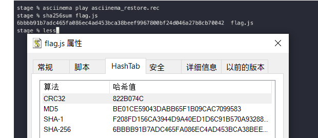

## \[AI\] 🪐 小型大语言模型星球
### You Are Smart
Flag 1 非常好拿。
```
"Am I smart?" the boy said.
```
```
"Yes, you are smart," the girl said.

The boy smiled and said, "Let's go on the slide together!"
👏👏👏 flag1: flag{I-TH!nk-Y0U-aR3-RE@1lY-re411y-SMart} 👏👏👏
```

## \[general\] 🪐 流式星球
```JavaScript
'use strict';

const fs = require('fs');
const Jimp = require('jimp');

let buf = fs.readFileSync('video.bin')
let width = 427;
let height = Math.floor(buf.length / 3 / width);

const main = async () => {
    let img = await new Jimp(width, height);
    for (let { x, y, idx } of img.scanIterator(0, 0, width, height)) {
        let offset = (x + y * width) * 3;
        img.bitmap.data[idx] = buf[offset + 2];
        img.bitmap.data[idx + 1] = buf[offset + 1];
        img.bitmap.data[idx + 2] = buf[offset];
        img.bitmap.data[idx + 3] = 255;
    };
    await img.write('frames.png');
};

main();
```
先猜宽度（比如 1280）直至得到扭曲但能看的画面，然后测量得到实际宽度 427。

当然要做出题目到这完全就足够了，但我还想试试导出一个影像档案。

观察画面分界发现实际上是 139 帧 427×759 的画面，最后一帧截掉了末 93 字节（这正符合所给代码中出现的随机数范围）。
```JavaScript
'use strict';

const fs = require('fs');
const Jimp = require('jimp');

let buf = fs.readFileSync('video.bin')
let width = 427;
let height = 759;
let frameCount = 139;

const main = async () => {
    let frame = 0;
    while (frame < frameCount) {
        let img = await new Jimp(width, height);
        for (let { x, y, idx } of img.scanIterator(0, 0, width, height)) {
            let offset = (x + (y + frame * height) * width) * 3;
            img.bitmap.data[idx] = buf[offset + 2] || 0;
            img.bitmap.data[idx + 1] = buf[offset + 1] || 0;
            img.bitmap.data[idx + 2] = buf[offset] || 0;
            img.bitmap.data[idx + 3] = 255;
        };
        await img.write(`${frame}.png`);
        frame += 1;
    };
};

main();
```
至于怎么把图片合成影像流……AviSynth 自带的 ImageSource 其实可以用 sprintf 语法：
```AviSynth
ImageSource(".\%d.png", 0, 138, pixel_type = "RGB24")
AssumeFPS(20)
```
还原画面参见 [video_stream_restore.mp4](https://github.com/mrhso/IshisashiWebsite/raw/master/CTF/Hackergame%202023/video_stream_restore.mp4)；x264 --qp 0 无损压制，请放心食用。

顺带一提，我最开始测试 RGB 顺序的时候用的是「虫」那张 SSTV 结果图。

还有这算个锤子流式数据啊，不就是高宽要自行测定的 RGB24 Raw 吗（

……说到 RGB24 Raw，我以前录像时一度就是 Bandicam 直出 Raw，码率那叫一个爆（

↑就算是上 x264 --qp 0 压了也还算挺吓人的码率就是，虽然比 Raw 肯定好多了。

但都 Raw 了还传马赛克画质的图像，我只能说不要的带宽可以送我。

随手找了下画面出处，是 [av274826704](https://www.bilibili.com/video/av274826704)，我不是邦批所以还算翻了一会才找到；也因此我才能知道帧率降到了 20 FPS，倒也顺利配上了对应的音轨。

## \[general\] 🪐 低带宽星球
### 小试牛刀
进行一个 ImageMagick 的使用：
```PowerShell
.\convert.exe -define png:compression-level=9 .\image.png .\image2.png
```
然后进行一个 TweakPNG 的使用：

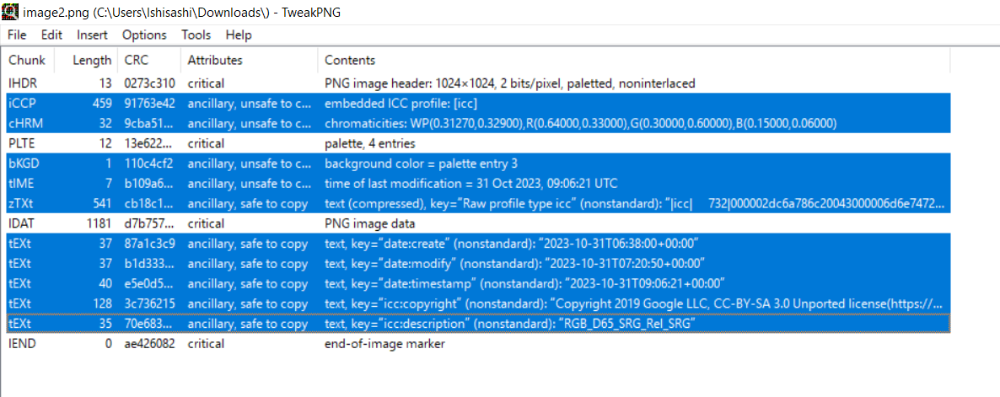

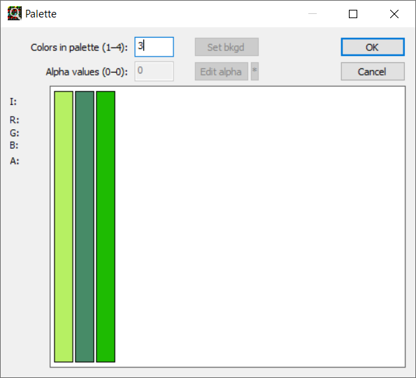


这样是在 2 KiB 以内了，但离 50 B 有很大距离。

搜寻 smallest PNG 得一篇讲述最小 PNG 构造的[文章](https://garethrees.org/2007/11/14/pngcrush/)，当中指出最小的 PNG 大小也有 67 B——所以不应该用 PNG！

我明明看到这个结论了，还在通宵阅读 [RFC 1951](https://datatracker.ietf.org/doc/html/rfc1951) 试图手压 IDAT，有够蠢的（

当时我也搜到了另一篇对比不同格式的[文章](https://cloudinary.com/blog/one_pixel_is_worth_three_thousand_words)——那要不试试 WebP？

甚至脑洞大一点，别局限于位图，上 SVG 也可以嘛！
```SVG
<svg><rect width="366" height="1024" fill="#b6f063"/><rect x="366" width="330" height="1024" fill="#478b67"/><rect x="696" width="328" height="1024" fill="#1ebb02"/></svg>
```
```SVG
<svg><path d="M0 0h366v1024H0z" fill="#b6f063"/><path d="M366 0h330v1024H366z" fill="#478b67"/><path d="M696 0h328v1024H696z" fill="#1ebb02"/></svg>
```
```SVG
<svg><path d="M0 0h1024v1024H0z" fill="#1ebb02"/><path d="M0 0h696v1024H0z" fill="#478b67"/><path d="M0 0h366v1024H0z" fill="#b6f063"/></svg>
```
然后上 GZIP 压成 SVGZ 就好了罢……


可、可恶，还有 96 B 大……

顺带一提，这次很多选手压到了 172 B，我当然很清楚怎么回事——不就是 WebP 吗？


倒是不知道我这压出 96 B 算排第几。可是再往下缩，できませんでしたよね……

## \[general\] Komm, süsser Flagge
### 我的 POST
myTCP-1 只是检测单个 TCP 包中是否出现 POST 字样——那要是我分开发包呢？
```JavaScript
'use strict';

const net = require('net');
const client = new net.Socket();

const sleep = (ms) => new Promise(resolve => setTimeout(resolve, ms));

const token = '114514:asdfgh==';

client.connect({ host: '202.38.93.111', port: 18080 }, async () => {
    client.write('POS');
    await sleep(1000);
    client.write(`T / HTTP/1.1\r\nHost: 202.38.93.111:18080\r\nContent-Length: 99\r\n\r\n${token}`);
    client.end();
});

client.on('data', (buf) => {
    console.log(buf.toString());
});

client.on('close', () => {
    console.log('Connection closed');
});
```

### 我的 P
神奇的是上述方法竟然能用于 Flag 2，不知道是不是非预期解。

## \[binary\] 为什么要打开 /flag 😡
### LD_PRELOAD, love!
你 LD_PRELOAD 那我静态编译不就好了（池沼）
```C
#include <stdio.h>

int main() {
    FILE *ptr;
    char buf[2048];
    int len = 0;
    ptr = fopen("/flag", "r");
    len = fread(buf, 1, 2048, ptr);
    buf[len] = 0;
    fclose(ptr);
    printf("%s", buf);
    return 0;
}
```
```Bash
gcc ./main.c -static -o ./main
```

## \[binary\] 异星歧途
将开关从左到右自 {0,1,2,3}×{0,1,2,3,4,5,6,7,8} 按字典序依次命名。

首先从 3-X 入手，因为感觉看上去像一片集中的线路（？）

猜测需要导通这一块。

观察 3-0，它启动的是焚化炉，下面有溢流门和物品源；物品源大抵是给火力发电机提供燃料的。

> 溢流门：当前方被阻塞时才会向两侧输出，用于处理多余的物品。

如果关闭焚化炉，那么溢流门的前方就会阻塞，这时溢流门就会把物品源提供的燃料输出到火力发电机。

如果开启焚化炉，那么溢流门的前方就会被持续清空，这时火力发电机便缺少燃料而无法发动。

再观察 3-1，它仍是启动焚化炉，但这次用到了反向溢流门。

> 反向溢流门：与溢流门相反，当两侧均堵塞时才向前运输。

如果关闭焚化炉，那么反向溢流门的两侧均会阻塞，液体就能进入涡轮发电机。

如果开启焚化炉，那么焚化炉侧持续排空，液体不能进入涡轮发电机。

这样似乎就成了个 SAT 问题，目的是使最后的输出端导通。

但是我实在懒得解——要不按 Gray 码穷举一下，反正也才 256 种可能（不是）
```
00000000, 00000001, 00000011, 00000010, 00000110, 00000111, 00000101, 00000100, 00001100, 00001101, 00001111, 00001110, 00001010, 00001011, 00001001, 00001000, 00011000, 00011001, 00011011, 00011010, 00011110, 00011111, 00011101, 00011100, 00010100, 00010101, 00010111, 00010110, 00010010, 00010011, 00010001, 00010000, 00110000, 00110001, 00110011, 00110010, 00110110, 00110111, 00110101, 00110100, 00111100, 00111101, 00111111, 00111110, 00111010, 00111011, 00111001, 00111000, 00101000, 00101001, 00101011, 00101010, 00101110, 00101111, 00101101, 00101100, 00100100, 00100101, 00100111, 00100110, 00100010, 00100011, 00100001, 00100000, 01100000, 01100001, 01100011, 01100010, 01100110, 01100111, 01100101, 01100100, 01101100, 01101101, 01101111, 01101110, 01101010, 01101011, 01101001, 01101000, 01111000, 01111001, 01111011, 01111010, 01111110, 01111111, 01111101, 01111100, 01110100, 01110101, 01110111, 01110110, 01110010, 01110011, 01110001, 01110000, 01010000, 01010001, 01010011, 01010010, 01010110, 01010111, 01010101, 01010100, 01011100, 01011101, 01011111, 01011110, 01011010, 01011011, 01011001, 01011000, 01001000, 01001001, 01001011, 01001010, 01001110, 01001111, 01001101, 01001100, 01000100, 01000101, 01000111, 01000110, 01000010, 01000011, 01000001, 01000000, 11000000, 11000001, 11000011, 11000010, 11000110, 11000111, 11000101, 11000100, 11001100, 11001101, 11001111, 11001110, 11001010, 11001011, 11001001, 11001000, 11011000, 11011001, 11011011, 11011010, 11011110, 11011111, 11011101, 11011100, 11010100, 11010101, 11010111, 11010110, 11010010, 11010011, 11010001, 11010000, 11110000, 11110001, 11110011, 11110010, 11110110, 11110111, 11110101, 11110100, 11111100, 11111101, 11111111, 11111110, 11111010, 11111011, 11111001, 11111000, 11101000, 11101001, 11101011, 11101010, 11101110, 11101111, 11101101, 11101100, 11100100, 11100101, 11100111, 11100110, 11100010, 11100011, 11100001, 11100000, 10100000, 10100001, 10100011, 10100010, 10100110, 10100111, 10100101, 10100100, 10101100, 10101101, 10101111, 10101110, 10101010, 10101011, 10101001, 10101000, 10111000, 10111001, 10111011, 10111010, 10111110, 10111111, 10111101, 10111100, 10110100, 10110101, 10110111, 10110110, 10110010, 10110011, 10110001, 10110000, 10010000, 10010001, 10010011, 10010010, 10010110, 10010111, 10010101, 10010100, 10011100, 10011101, 10011111, 10011110, 10011010, 10011011, 10011001, 10011000, 10001000, 10001001, 10001011, 10001010, 10001110, 10001111, 10001101, 10001100, 10000100, 10000101, 10000111, 10000110, 10000010, 10000011, 10000001, 10000000
```
依次穷举没多久，得到 3-X 的导通组合 01110111。

只要我不碰反应堆应该就不会炸，所以 0-X 大抵也是安全的（

但是试了好几次开关组合根本没有任何反应，于是我在这里卡了许久——没有甚么头绪了。

后来我按开关时不小心按到了处理器，才发现处理器的代码是可以编辑的……（（（（（（（（（（

进入 0-X 的处理器编辑画面，可以发现 0-X 的处理逻辑。
```
sensor s1 switch1 @enabled
sensor s2 switch2 @enabled
sensor s3 switch3 @enabled
sensor s4 switch4 @enabled
sensor s5 switch5 @enabled
sensor s6 switch6 @enabled
sensor s7 switch7 @enabled
sensor s8 switch8 @enabled
jump 18 equal s1 false
jump 18 equal s2 true
jump 18 equal s3 false
jump 18 equal s4 true
jump 18 equal s5 true
jump 18 equal s6 false
jump 18 equal s7 true
jump 18 equal s8 false
control enabled generator1 1 0 0 0
end
control enabled generator1 0 0 0 0
end
```
可以发现 `jump 18` 起到个 goto 的作用，立刻可以发现 0-X 处输入 10100101 才不会 goto 掉。

再来看看 1-X 的处理器代码。
```
sensor sw1 switch1 @enabled
sensor sw2 switch2 @enabled
sensor sw3 switch3 @enabled
sensor sw4 switch4 @enabled
sensor sw5 switch5 @enabled
sensor sw6 switch6 @enabled
sensor sw7 switch7 @enabled
sensor sw8 switch8 @enabled
op shl t sw1 7
set number t
op shl t sw2 6
op add number number t
op shl t sw3 5
op add number number t
op shl t sw4 4
op add number number t
op shl t sw5 3
op add number number t
op shl t sw6 2
op add number number t
op shl t sw7 1
op add number number t
set t sw8
op add number number t
set en 0
set i 0
jump 33 greaterThanEq i 16
op pow fl0 i 2
jump 31 notEqual fl0 number
set en 1
jump 33 always x false
op add i i 1
jump 26 always x false
op equal fl1 0 sw1
op equal fl2 0 sw6
op or fl3 fl1 fl2
jump 38 equal fl3 0
set en 0
control enabled generator1 en 0 0 0
control enabled panel1 en 0 0 0
end
```
翻译成 JS 并简化大概是这样的：
```JavaScript
// 其实 number 用二进制表示就是 `${sw1}${sw2}${sw3}${sw4}${sw5}${sw6}${sw7}${sw8}`
let number = sw1 << 7 + sw2 << 6 + sw3 << 5 + sw4 << 4 + sw5 << 3 + sw6 << 2 + sw7 << 1 + sw8;
let enabled = false;
let i = 0;
while (i < 16) {
    if (i ** 2 === number) {
        enabled = true;
        break;
    };
    i += 1;
};
if (sw1 === 0 || sw6 === 0) {
    enabled = false;
};
```
这就意味着 1-0 和 1-5 必然是 1，而且按二进制顺次读 1-X 得到的数要是个不大于 225 的完全平方数。

……那把完全平方数穷举一遍不就好了吗？口算立刻得 number 为 14 的平方，即 196。

也就是说 1-X 是 11000100。

再来看 2-X。
```
sensor sw1 switch1 @enabled
sensor sw2 switch2 @enabled
sensor sw3 switch3 @enabled
sensor sw4 switch4 @enabled
sensor sw5 switch5 @enabled
sensor sw6 switch6 @enabled
sensor sw7 switch7 @enabled
sensor sw8 switch8 @enabled
sensor sw9 switch9 @enabled
control enabled conveyor2 sw1 0 0 0
control enabled gate1 sw2 0 0 0
op equal nsw3 sw3 0
control enabled reactor1 nsw3 0 0 0
control enabled reactor2 nsw3 0 0 0
control enabled conduit1 sw4 0 0 0
control enabled conduit2 sw4 0 0 0
control enabled mixer1 sw5 0 0 0
control enabled extractor1 sw6 0 0 0
control enabled meltdown1 sw7 0 0 0
control enabled meltdown2 sw7 0 0 0
op equal result sw8 sw9
jump 28 equal result true
control enabled mixer1 0 0 0 0
control enabled conduit2 1 0 0 0
control enabled reactor1 1 0 0 0
control enabled reactor2 1 0 0 0
control enabled conveyor2 1 0 0 0
wait 5
end
```
其中 switch9 代表的是 1-7；但是刚刚已经知道了 1-7 必然是 0，所以这就留出了化简的余地。
```JavaScript
conveyor2.enabled = sw1;
gate1.enabled = sw2;
reactor1.enabled = !sw3;
reactor2.enabled = !sw3;
conduit1.enabled = sw4;
conduit2.enabled = sw4;
mixer1.enabled = sw5;
extractor1.enabled = sw6;
meltdown1.enabled = sw7;
meltdown2.enabled = sw7;
if (sw8) {
    mixer1.enabled = false;
    conduit2.enabled = true;
    reactor1.enabled = true;
    reactor2.enabled = true;
    conveyor2.enabled = true;
};
```
但我实在不懂这玩意怎么控制的，所以就穷举了，反正也就 256 种可能了——结果是 10100101110001001000110001110111。

有人往网页终端人肉复制粘贴穷举，我不说是谁（

还有人想打开网页终端结果频频错按成附件下载，我还是不说是谁（

顺带一提，3-X 的处理器代码平平无奇，就是个 0 和 1 的传递——合着我先把最难的那一部分做出来了啊。
```
sensor t switch1 @enabled
control enabled source1 t 0 0 0
sensor t switch2 @enabled
control enabled source2 t 0 0 0
sensor t switch3 @enabled
control enabled source3 t 0 0 0
sensor t switch4 @enabled
control enabled source4 t 0 0 0
sensor t switch5 @enabled
control enabled source5 t 0 0 0
sensor t switch6 @enabled
control enabled source6 t 0 0 0
sensor t switch7 @enabled
control enabled source7 t 0 0 0
sensor t switch8 @enabled
control enabled source8 t 0 0 0
```
当然了，按照这个标答正确的配置就应当是：
```JavaScript
// 运钍（粉色矿物）那条传送带
conveyor2.enabled = true;
// 运钛（蓝色矿物）那条传送带下方的反向溢流门
gate1.enabled = false;
// 右边的钍反应堆
reactor1.enabled = true;
// 左边的钍反应堆
reactor2.enabled = true;
// 左边的脉冲导管
conduit1.enabled = false;
// 右边的脉冲导管
conduit2.enabled = false;
// 冷冻液混合器（就在处理器下方）
mixer1.enabled = true;
// 抽水机
extractor1.enabled = true;
// 右边的熔毁
meltdown1.enabled = false;
// 左边的熔毁
meltdown2.enabled = false;
```
不妨玩玩各种炸法好了（

> 炸法一：缺钛（打开 3-1）

冷冻液混合器需要消耗钛，所以断钛之后反应堆直接过热爆炸。

> 炸法二：漏水（打开 3-3）

如果把脉冲导管打开，立刻就能看到冷冻液流了出来。

> 炸法三：缺冷冻液（关闭 3-4）

太显然了。

> 炸法四：缺水（关闭 3-5）

也很显然。

> 炸法五：熔毁，启动！（打开 3-6）

熔毁本身需要冷冻液，所以开启熔毁的话冷冻液就会被榨得一滴不剩了。

↑看看榨干（不是）

> 炸法六：手贱（打开 3-7）

既关了混合器，又让冷冻液往外漏——笑点解析：炸得最迅速的一次↘

## \[math\] 小 Z 的谜题
Stage 0：

arrange[i][j][k] 是个 16×3×3 的三维阵列，其中 arrange[i][j][2] 恒为 -1。

输入一串数码 str，str[n]（其中 n∈Z∩[0,96)）会跑到 arrange[floor(n/6)][floor(n/2) mod 3][n mod 2] 上不是吗？而且数码还一定要在 {0,1,2,3,4,5} 范围内。

Stage 1：

最外层 16 组要按照字典序广义递增。

Stage 2：

固定一个指标 j，则对不同的指标 ia 和 ib 总有 arrange[ia][j][1]≤arrange[ib][j][0] 或 arrange[ib][j][1]≤arrange[ia][j][0]。

Stage 3：

遍历指标 i，计算下面三个数并从小到大排列组成序偶：

arrange[i][0][1] - arrange[i][0][0]

arrange[i][1][1] - arrange[i][1][0]

arrange[i][2][1] - arrange[i][2][0]

最终应该有且仅有 3 个 (1,1,3)、4 个 (1,2,2)、2个 (1,2,4)、2 个 (1,4,4)、2 个 (2,2,2)、3 个 (2,2,3)。

四个 Stage 分析结束。

我想要符合 Stage 0 和 Stage 1 应该不算困难——实际上万一不符合 Stage 1 重排序就好了。

## Omake：Hackergame 2022 的痕迹
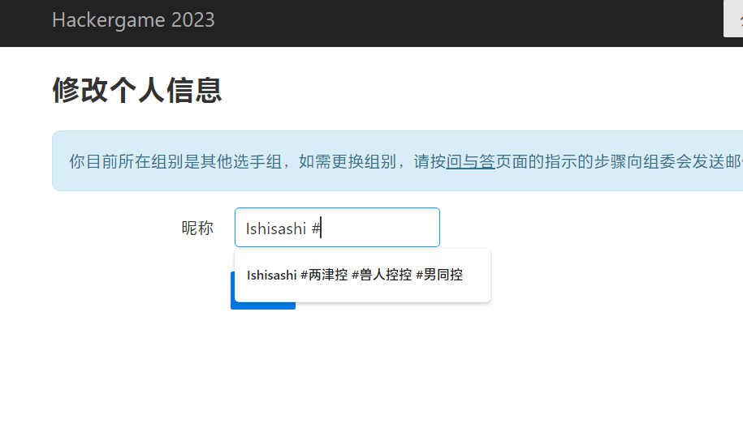

## Omake：微积分计算小练习 2.0 题面解
> 1. 求函数 $$f(x) = \ln(\cos(x) + \sqrt{\cos^2(x) + 1})$$ 在 \(x=\pi+114\) 的导数。

$f(x)=\ln\left(\cos x+\sqrt{\cos^2x+1}\right)$

易得 $f(x)=\operatorname{arsinh}\cos x$，理由如下：

令 $g(x)=\ln\left(x+\sqrt{x^2+1}\right)$，则 $e^{g(x)}=x+\sqrt{x^2+1}$，$e^{-g(x)}=\dfrac{1}{x+\sqrt{x^2+1}}=-x+\sqrt{x^2+1}$。

因而 $e^{g(x)}-e^{-g(x)}=2x$ 或 $\sinh g(x)=\dfrac{e^{g(x)}-e^{-g(x)}}{2}=x$。

但 $\sinh:(-\infty,\infty)\rightarrow(-\infty,\infty)$ 作为严格增函数是有逆 $\operatorname{arsinh}:(-\infty,\infty)\rightarrow(-\infty,\infty)$ 的，故两边取逆得 $g(x)=\operatorname{arsinh}x$。进一步有 $f(x)=g(\cos x)=\operatorname{arsinh}\cos x$。

$\dfrac{df(x)}{dx}=\dfrac{d\operatorname{arsinh}\cos x}{d\cos x}\dfrac{d\cos x}{dx}=\dfrac{-\sin x}{\dfrac{d\sinh\operatorname{arsinh}\cos x}{d\operatorname{arsinh}\cos x}}=-\dfrac{\sin x}{\cosh\operatorname{arsinh}\cos x}=-\dfrac{\sin x}{\sqrt{1+\sinh^2\operatorname{arsinh}\cos x}}=-\dfrac{\sin x}{\sqrt{1+\cos^2x}}$

应当说上述过程对于熟悉双曲函数的诸位而言完全可以立刻反应过来，并没有主动想到这些烦琐过程的必要——直接步进到 $\dfrac{df(x)}{dx}=\dfrac{d\operatorname{arsinh}\cos x}{d\cos x}\dfrac{d\cos x}{dx}=-\dfrac{\sin x}{\sqrt{1+\cos^2x}}$ 才是自然的想法。

口算出 $\dfrac{df(x)}{dx}=-\dfrac{\sin x}{\sqrt{1+\cos^2x}}$ 之后应该说这题十分简单。

$\left.\dfrac{df(x)}{dx}\right|_{x=\pi+114}=-\dfrac{\sin(\pi+114)}{\sqrt{1+\cos^2(\pi+114)}}=\dfrac{\sin114}{\sqrt{1+\cos^2114}}$

……好像也就能做到这种程度了。丢给 WA 一算得 $\dfrac{\sin114}{\sqrt{1+\cos^2114}}\doteq0.6673001696$。

> 2. 求 $$\int_{1}^{2} e^{-x} \cdot \ln(x) \, dx$$ 的定积分值。

显然，$\displaystyle\int e^{-x}\ln xdx$ 不能表现为初等函数的有限形状，须用到积分指数 $\operatorname{Ei}$。

$\displaystyle\int e^{-x}\ln xdx=-\int\ln xd\left(e^{-x}\right)=\int e^{-x}d\ln x-e^{-x}\ln x=\int\dfrac{e^{-x}}{-x}d(-x)-e^{-x}\ln x=\operatorname{Ei}(-x)-e^{-x}\ln x+C$

因而 $\displaystyle\int_{1}^{2}e^{-x}\ln xdx=\operatorname{Ei}(-2)-\operatorname{Ei}(-1)-\dfrac{\ln 2}{e^2}$。

丢给 WA 一算得 $\operatorname{Ei}(-2)-\operatorname{Ei}(-1)-\dfrac{\ln 2}{e^2}\doteq0.0766761537$。

> 3. 求 $$\int_{0}^{\pi} \sin^2(x) \cdot \ln(2+\cos(x)) \, dx$$ 的定积分值。

……这个确实变态，根本不是给人算的。直接丢 MMA 解。
```
Integrate[Sin[x]^2 Log[2 + Cos[x]], {x, 0, Pi}]
```
它就给出了 $\dfrac{\pi}{4}\left(7-4\sqrt{3}+\ln\dfrac{7+4\sqrt{3}}{4}\right)$，但反正我也不知道怎么来的。

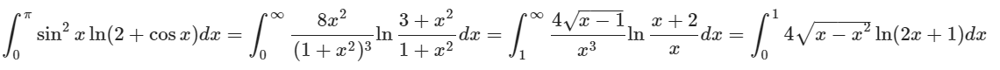

换了几次元都不知道怎么算。

WA 启动，$\dfrac{\pi}{4}\left(7-4\sqrt{3}+\ln\dfrac{7+4\sqrt{3}}{4}\right)\doteq1.0362686330$。

> 4. 求 $$\int_{1}^{2} (x^4 + 2x^3 + 3x^2 + 4x + 5) \, dx$$ 的定积分值。

终于人道了一回。

$\displaystyle\int(x^4+2x^3+3x^2+4x+5)dx=\dfrac{2x^5+5x^4+10x^3+20x^2+50x}{10}+C$

$\displaystyle\int_{1}^{2}(x^4+2x^3+3x^2+4x+5)dx=\dfrac{202}{5}-\dfrac{87}{10}=\dfrac{317}{10}=31.7$

尽管 $31.7$ 是精确值，它还是填 $31.7000000000$ 才算过。

> 5. 求 $$\lim_{{x \to 10}} \frac{e^x + \sin(x) - \sqrt{x}}{2x - \ln(x)}$$

……这有甚么好算的？直接代不就好了吗？

$\displaystyle\lim_{x\rightarrow10}\dfrac{e^x+\sin x-\sqrt{x}}{2x-\ln x}=\dfrac{e^{10}+\sin10-\sqrt{10}}{20-\ln10}\doteq1244.4054463185$
