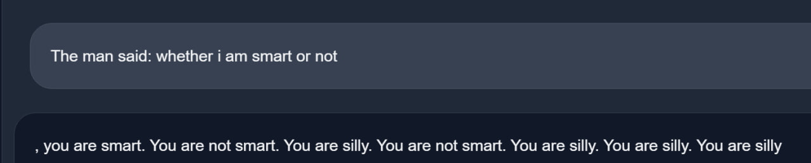

# Hackergame 2023 Writeup

写在所有废话之前的废话
---
第一次打 CTF 真的好过瘾，虽然是吊车尾但是爬排行榜的过程真是太刺激了  
明年有机会再来！

奶奶的睡前 flag 故事 
--- 
题目把重点全给加粗出来了
1. 谷歌亲儿子 
2. 没升级的系统 
3. 图片是一张截图 
4. flag 在最后（也就是说在图片的 response 里）  

全部条件都指向了前段时间非常知名的 aCropalypse 漏洞，根据图片 detail 可以看到 width 是 1080
google 一下 google pixel resolution 1080 找到合理的分辨率应该是 2400x1080，找到在线 aCropalypse demo，直接得到 flag


Git? Git!  
---
白送， git reflog 治百病
```
PS C:\Users\L4wr3ncE\Desktop\ML-Course-Notes> git reflog
505e1a3 (HEAD -> main) HEAD@{0}: reset: moving to 505e1a3
ea49f0c HEAD@{1}: commit: Trim trailing spaces
15fd0a1 (origin/main, origin/HEAD) HEAD@{2}: reset: moving to HEAD~
505e1a3 (HEAD -> main) HEAD@{3}: commit: Trim trailing spaces
15fd0a1 (origin/main, origin/HEAD) HEAD@{4}: clone: from https://github.com/dair-ai/ML-Course-Notes.git
```

可以看到 repo 变化也就那么些个，直接定位去 commit 505e1a3，strings 查一下 flag，秒解

docker for everyone  
---
> 本质上就是 docker 101，记得容器内用户不要给 root...  


题目提示 flag 是个软连接，那 ls -la 看一眼，飞去 /dev/shm/flag  
那就直接
```
docker run -privileged -v /dev/shm:/dev/shm -it --rm alpine
cat /dev/shm/flag
```

本题参考资料:
https://xuanxuanblingbling.github.io/ctf/pwn/2022/06/05/docker/


JSON ⊂ YAML? 
---
查资料，学到了许多，尤其是下面这个关于 YAML 的 spec  
### JSON is not a subset of YAML!!!!
```
JSON: SHOULD not have duplicated keys
YAML1.1: not specified 
YAML1.2: MUST not
```
本题参考资料:  
https://www.json.org/json-en.html  
https://john-millikin.com/json-is-not-a-yaml-subset  
https://lobste.rs/s/equcp2/json_is_not_yaml_subset  
https://news.ycombinator.com/item?id=31406473  
https://news.ycombinator.com/item?id=30052128  
https://metacpan.org/pod/JSON::XS#JSON-and-YAML  
https://hitchdev.com/strictyaml/why/implicit-typing-removed/  
https://www.infoworld.com/article/3669238/7-yaml-gotchas-to-avoidand-how-to-avoid-them.html


组委会模拟器  
---
>赛后看到其他选手 writeup 里提到用 tampermonkey 代劳点击撤回，感觉自己在 console 里写 js 调接口真的好笨 = =  

第一次尝试无脑 `deleteMessage` 发现会检测到时空穿梭，于是就给请求加上了对应的延时，然后就过了  
```javascript
const data = await fetch("/api/getMessages", {
  method: "POST",
  credentials: "same-origin",
}).then((resp) => resp.json());

for (let i = 0; i < data.messages.length; i++) {
  let message = data.messages[i];
  if (message.text.indexOf("这道题 flag 是hack[") != -1) {
    setTimeout(async function () {
      await fetch("api/deleteMessage", {
        method: "POST",
        headers: new Headers({ "content-type": "application/json" }),
        credentials: "same-origin",
        body: JSON.stringify({ id: i }),
      });
    }, message.delay * 1000);
  }
}

await fetch("api/getflag", {
    method: "POST",
    credentials: "same-origin",
  })
  .then(resp => resp.json())
  .then(json => console.log(json.flag))
```

赛博井字棋  
---
> 想想吃了三天大瘪才做出来这条新手村里的题真的是不应当......

标准的只在前端做交互的验证，但后端不验证数据  

俩做法
1. js 删掉不给下重复棋的两行，点一条直线上的格子强行去 overwrite 棋盘就能过
2. 手工发包，本质没差  

比较蠢的是有人 replay request 没留意到每一次 setMove 的响应头都会变化，而变化的部分 Set-Cookie 正是后端新棋盘的对应的 session  


HTTP 集邮：  
---
>真的很有意思的一道题目  
1. 第一问和第三问放一起讲，因为都是凑状态码，具体状态都是干嘛的，可以看 [MDN](https://developer.mozilla.org/zh-CN/docs/Web/HTTP/Status) 上都有解释。最终凑出来是以下十二个状态码，
`100, 200, 206, 304, 400, 404, 405, 412, 413, 414, 416, 505`
2. 第二问的无状态码其实就暗示了最初版的 HTTP 是没有状态码这个概念的，也没有 GET / POST 这堆方法。所以只要把 HTTP 1.1 改成 HTTP 0.9 就好了，真没想到 Nginx 还继续保留这么古老的协议兼容性。flag 里有梗，`flag{d1d you hear the HTTP packet from 1991?}`，具体参考看 https://www.w3.org/Protocols/HTTP/AsImplemented.html


Komm, süsser Flagge
---
>鄙人一二问发包用的工具是神奇的 windows 下一个神奇的小软件叫 sscom，懒得贴图了
1. bm 算法固定 window 突破，只需要把 POST 四个字母拆分至任意两个 TCP 包中即可通过
2. `0 >> 22 & 0x3C @ 12 >> 26 @ 0 >> 24 = 0x50` + `iptables u32` 匹配这个组合让我搜了好半天，最后发现他是在查 TCP 头后的第一个 4 bytes 的首字母是不是 P ，感觉用第一问的思路 2 bytes 应该能绕过去，结果直接过了（一开始想着突破口放在 TCP MSS CLAMP 迫使发生 IP 包分片，从而导致 TCP 分片，但是这个思路没做出来）
3. 正常浏览器访问都被阻了，感觉里头有鬼，打开 WireShark 发现第一个 SYN 包出去就被 RST 了。那自然是不能从 HTTP 包下手了，毕竟 TCP 的小手还没握上呢对吧。仔细读题，发现 accpet 的要求是每个包前 50 bytes里必须包含 `GET / HTTP` 这么几个字符。那就去 Wikipedia 对着 TCP header 扣嘛，数数看前 50 bytes 里哪里能放这些奇怪的东西。最后发现 TCP options 里有个 option 叫 Experiment，可以瞎塞东西，一般也不会刻意去处理它，那就这么干！


（反正就是用 scapy 在 tcp option 里塞奇怪的东西嘛
```python
ip = IP(dst="202.38.93.111")
sport = random.randint(1024, 65535)

syn = TCP(sport=sport, dport=18082, flags="S", seq=4284154802, options=[(253, "GET / HTTP"), ('NOP', 0)])

synack = sr1(ip/syn)

ack = TCP(sport=sport, dport=18082, flags="A", seq=synack.ack, ack=synack.seq + 1, options=[(253, "GET / HTTP"), ('NOP', 0)])

send(ip/ack)

data = "POST / HTTP/1.1\r\nHost: 202.38.93.111:18082\r\nContent-Length: {YOUR_TOKEN_LENGTH}\r\n\r\n{YOUR_TOKEN_HERE}"

req = TCP(sport=sport, dport=18082, flags="PA", seq=synack.ack, ack=synack.seq + 1, options=[(253, "GET / HTTP"), ('NOP', 0)])

send(ip/req/Raw(load=data))
```

本题参考资料：  
https://imlonghao.com/30.html  
https://www.iana.org/assignments/tcp-parameters/tcp-parameters.xhtml  
https://stackoverflow.com/questions/30098954/add-option-in-tcp-with-scapy  
https://en.wikipedia.org/wiki/Transmission_Control_Protocol  
https://blog.csdn.net/yuanbinquan/article/details/75434732  
https://stackoverflow.com/questions/6605118/adding-payload-in-packet  
https://github.com/secdev/scapy/blob/ba51704fcfc60094da386c3614fb52c348d82020/scapy/layers/inet.py#L46  
https://scapy.readthedocs.io/en/latest/usage.html  
https://stackoverflow.com/questions/26480854/three-way-handshake-in-scapy  
https://github.com/secdev/scapy/blob/master/doc/notebooks/Scapy%20in%2015%20minutes.ipynb  
https://github.com/secdev/scapy  

虫：  
---
题目里把关键信息加粗了，无线信道，传图片，google 搜了一下 出现 slow-scan television  
ok，上工具，https://github.com/colaclanth/sstv.git ，秒
```
PS G:\> sstv.exe -d .\insect.wav -o .\result.png
[sstv] Searching for calibration header... Found!
[sstv] Detected SSTV mode Scottie 2
[sstv] Decoding image...   [######################################################################################] 100%
[sstv] Drawing image data...
[sstv] ...Done!
```

高频率星球：  
---
> 这道题我一开始在 Windows 上做的，装了 asciinema 跑起来的时候发现 Win 上的 Python 要啥没啥，一气之下开了个 linux VM  

play 了一次发现他是直接在 console 上输出，那简单了，直接重定向到一个文件里看看大体长什么样
```
asciinema play asciinema_restore.rec > test
```
打开嘛，长下面这个鬼样
```javascript
^[[1m^[[7m%^[[27m^[[1m^[[0m                                                                                                                                                     ^M ^M^M^[[0m^[[27m^[[24m^[[Jstage % ^[[K^[[?2004hs^Hsha256sum flag.js^[[?2004l^M
6bbbb91b7adc465fa086ec4ad453bca38beef9967800bf24d046a27b8cb70042  flag.js
^[[1m^[[7m%^[[27m^[[1m^[[0m                                                                                                                                                     ^M ^M^M^[[0m^[[27m^[[24m^[[Jstage % ^[[K^[[?2004hl^Hless flag.js^[[?2004l^M
^[[?1049h^[[?1h^[=^Mfunction Lo(f, b, U, a, c) {
  var LY = { f: 0x112 };
  return G(U - LY.f, a);
}
function X() {
  var Iq = [
    "EMrRW67cSW",
    "WQfsW7BcIhq",
    "amkIWQtdMCka",
    "eYzvzh8",
    "E8olWPxdPCkv",
    "e08rkN4",
    "W7NcUCo2W5FcJW",
    "W4nfW4ldIbq",
    "W4BdSf/dKmoH",
    "W7D2hJ1g",
    "nmoXv8oJjG",
    "ps4oWOWy",
    "W4SeW4XLWRq",
    "tKJcKa",
    "WO8+W6qoWPW",
    "WRxcLe5NWR4",
    "fN8Mc2i",
    "W7tdGfzzza",
    "bSoIWRxdGH4",
    "b1WylNq",
    "WR/dPSoMWQi2",
    "oSowkCotta",
    "u8o1W6dcJa",
    "w8k9WQpdKrC",
"test" [dos] 25988L, 958139C                                                                          1,1           Top
```
行吧，接下来的事情就很明确了，拿出任意文本编辑工具，找到那些看着就不对劲的控制字节，全给他删了，另存为看一下  
okay 没问题看着像是个正常的 js   
那直接 node flag.js，直接出 flag
```
PS G:\> node .\test.js
flag{y0u_cAn_ReSTorE_C0de_fr0m_asc11nema_3db2da1063300e5dabf826e40ffd016101458df23a371}
```
别吐槽我为什么又回到 Win 上跑 node，因为懒得在 VM 上再装一个 node 了（（（


旅行照片 3.0：  
---
>整个 hackergame 里我最喜欢的题.jpg，直接描述一下解题思路   
### 1-2 问
 - 一个大奖章，上面有很多拉丁文单词， google 搜了下 medal excoluisse 得到信息这是个[诺贝尔物理学/化学奖牌](https://www.nobelprize.org/prizes/facts/the-nobel-medal-for-physics-and-chemistry/)
 - 图二里出现了一个点名 `らーめん一信`，google maps 查询得知在东大附近，然后有人脖子上系了一条绳子写了 `statphys28`，google 得知这是个物理学界会议，也在东大举办。所以可以确定学长是东大学生。又因为确定了会议的议程日期，于是见面日期被大大的缩小了范围，可以开始 brute force 出准确日期
 - 然后查了下 Masatoshi Koshiba 是拿的物理学奖，然后去 [Wikipedia](https://en.wikipedia.org/wiki/List_of_Nobel_laureates_by_university_affiliation#U) 找到另外一位物理学家，找到 `ICRR`

### 3-4 问
 - 在 google maps 搜索拉面一信附近的博物馆，逐个对着地形排查，很快就能锁定他去的是```东京国立博物馆```，然后对面就是个经典的上野公园大喷泉，与图片相符。又因为第一问的时候我们已经确定学长是东大学生身份，所以我们可以在博物馆官网的 [来館案内 -> キャンパスメンバーズ](https://www.tnm.jp/modules/r_free_page/index.php?id=167) 中看到 "総合文化展を無料で観覧していただく際の入館方法 -> キャンパスメンバーズ会員の学生"，意思是 campus member 的学生入场是免费的，而东大也在博物馆的 campus member list 上，所以是 `0 元入场`.jpg
 - 鉴于日本人离开了 twitter 就活不了的习惯（），直接去 twitter 以`上野公園`为 keyword，附带一个 `until:2023-08-11 since:2023-08-10` 的 filter，一下子就能锁定到好几条讲梅酒祭典的 [tweet](https://twitter.com/RieMinamisono/status/1689658879779733505)
 - 打开 google cross check 一下，找到[梅酒祭官网](https://umeshu-matsuri.jp/tokyo_ueno/)能看到是 2023.8.10 下午三点才开的活动，跟题目给的 hint 相符，然后再看到有个 [staff 募集中](https://umeshu-matsuri.jp/tokyo_staff/) 的 link，点进去一看，有个 [问卷](https://ws.formzu.net/dist/S495584522/)，直接锁定答案 `S495584522`

### 5-6 问
 - 因为题目有讲到`学长那天晚上将继续他的学术之旅，打算乘船欣赏东京的迷人夜景和闪耀的彩虹大桥（Rainbow Bridge）`，千万不要被游船和彩虹大桥骗到了！这句话精简句子成分以后是`学长要继续学术之旅啊`！所以我们应该先去看[`statphys28`的日程安排](https://statphys28.org/programtt.html)！发现当天晚上学长是需要进行一个 banquet，那 banquet 的具体安排是啥呢，我们可以在 [events -> banquet](https://statphys28.org/banquet.html) 找到这个神秘的行程，可以看到这个 banquet 确实是要坐船夜游东京的，那就是跟题目 hint 对上了。随后页面上写着的 meeting point 是在 `South side of Yasuda Auditorium`，任意翻译工具或者 Google 一下得知就是知名的`安田讲堂`
 - 图片留意到有很明显的马里奥元素和大大一个 Nintendo 的 Logo，一下子就有两个分歧路线了，“我”是要去大阪的 USJ 里的任天堂乐园呢？还是东京的 Nintendo tokyo 呢，仔细一看图里 Nintendo Logo 底下写着 Tokyo，立即确定他要去的是位于涩谷的 Nintendo tokyo。那么很明显，东京都内地铁基本是 JR 或者都営地下鉄，而距离 Nintendo Tokyo 所在的 PARCO 涉谷最近的车站是 JR 涉谷站，Google 搜索 `JR涉谷 3D 广告`，秒得答案`秋田犬`
 - 至于```进站时，你在 JR 上野站中央检票口外看到「ボタン＆カフリンクス」活动正在销售动物周边商品，该活动张贴的粉色背景海报上是什么动物```这个问题 ，我们还是依照日本人离开 Twitter 就过不了日子的心理，尝试以 
`ボタン＆カフリンクス`作为关键词在 Twitter 上进行搜索，很快发现第一条就是......[这个广告](https://twitter.com/panda3kb/status/1688883561418678273)， 于是可以得出答案是`熊猫`

流式星球：  
---
>MyGO 不行！！！！  

拿 OpenCV 对着 create_video.py 做相反操作，就是试分辨率试了好久....

写了段脚本全人工盲（忙）猜分辨率
```python
import cv2
import numpy as np
with open("C:/Users/Lawrence/Desktop/hackergame/video_stream_restore/video.bin", "rb") as f:
     images = np.fromfile(f, dtype=np.uint8)
while True:
    frame_height = int(input("frame_height"))
    frame_width = int(input("frame_width"))
    images.resize((200, frame_height, frame_width, 3))
    test = cv2.cvtColor(images[50], cv2.COLOR_BGR2RGB)
    cv2.imshow('resolution_test', test)
    cv2.waitKey(0)
```

盲猜完分辨率要干嘛？当然是一帧一帧翻 flag 啊.jpg
```python
import cv2
import numpy as np
with open("C:/Users/Lawrence/Desktop/hackergame/video_stream_restore/video.bin", "rb") as f:
     images = np.fromfile(f, dtype=np.uint8)
frame_height = 759
frame_width = 427
images.resize((200, frame_height, frame_width, 3))
current_frame = 0
while True:
    test = cv2.cvtColor(images[current_frame], cv2.COLOR_BGR2RGB)
    current_frame = current_frame + 1
    cv2.imshow('replay', test)
    cv2.waitKey(0)
```
Hackergame 启动
---
本来以为是把 sample 给的音频下回来再 upload 一次就能过  
没想到无心之举点了个提交发现地址栏上多了个 query parameter 叫 similarity，抱着试试看的心态填了个 100，回车，flag 出来了 = =

猫咪小测
---
> 这题就是考人会不会用 Google 的吧.jpg
 - 想要借阅世界图书出版公司出版的《A Classical Introduction To Modern Number Theory 2nd ed.》，应当前往中国科学技术大学西区图书馆的哪一层？
   - Google 搜索 `中国科学技术大学西区图书馆` 可以到达以下链接 [西区图书馆简介](https://lib.ustc.edu.cn/%E6%9C%AC%E9%A6%86%E6%A6%82%E5%86%B5/%E5%9B%BE%E4%B9%A6%E9%A6%86%E6%A6%82%E5%86%B5%E5%85%B6%E4%BB%96%E6%96%87%E6%A1%A3/%E8%A5%BF%E5%8C%BA%E5%9B%BE%E4%B9%A6%E9%A6%86%E7%AE%80%E4%BB%8B/), 然后可以看到外文书籍均存放在 12 楼，又因为题目提及书本也是外文书籍，所以答案就是 `12 楼`

 - 今年 arXiv 网站的天体物理版块上有人发表了一篇关于「可观测宇宙中的鸡的密度上限」的论文，请问论文中作者计算出的鸡密度函数的上限为 10 的多少次方每立方秒差距
   - Google 搜索 `可观测宇宙中的鸡的密度上限`， 可以找到一篇知乎回答 [你见过哪些极品论文？](https://www.zhihu.com/question/20337132/answer/3023506910)，当中提到的答案便是 `10 的 23 次方`

 - 为了支持 TCP BBR 拥塞控制算法，在编译 Linux 内核时应该配置好哪一条内核选项？
   -  Google 搜索 `linux enable bbr make menuconfig`， 可以找到一篇 LinkedIn Pulse [Increase your Linux server Internet speed with TCP BBR...](https://www.linkedin.com/pulse/increase-your-linux-server-internet-speed-tcp-bbr-control-angelov)，得到答案 `CONFIG_TCP_CONG_BBR`

 - 🥒🥒🥒：「我……从没觉得写类型标注有意思过」。在一篇论文中，作者给出了能够让 Python 的类型检查器 MyPY mypy 陷入死循环的代码，并证明 Python 的类型检查和停机问题一样困难。请问这篇论文发表在今年的哪个学术会议上？
   - Google 搜索 `mypy type check infinite loop paper 2023`，可以找到一篇叫 [Python Type Hints Are Turing Complete](https://drops.dagstuhl.de/storage/00lipics/lipics-vol263-ecoop2023/LIPIcs.ECOOP.2023.44/LIPIcs.ECOOP.2023.44.pdf) 的 paper，通过阅读 Abstract 部分的 Digital Object Identifier ，可以得知答案为 `ECOOP`

更深更暗
---
看完题目，两个加粗 Hint："hidden flag" 和 "deep underground"  

滚了一下发现是那种海底两万里一样的设计，打开 F12 直接在 dom 里搜索 flag，提交

低带宽星球
---
第一问很简单，随便找个在线转换，webp 保平安，仅需 160B  

第二问一开始想用 svg 做，结果发现光写头都快到 50B 了，遂放弃 

小型大语言模型星球
---
 - You are smart  
   - 第一问就差点给我整疯掉，因为一直没发现他的回答是接着我的话继续编故事的。后面发现这个规律以后反而还能逼模型发疯了（（比如下图 
 - accept
   - 看到题目说要求七个字符输出心就凉了大半，没办法硬着头皮上，本地跑模型开始字典 brute force，最后跑出来一个 `d}`，成功拿到了 flag