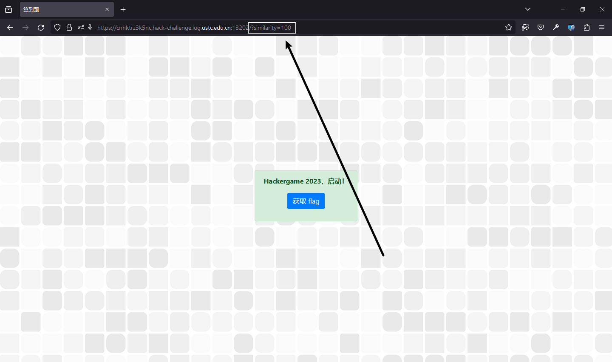

话说某人第九届 Hackergame 正值高一，本以为肯定有时间做的结果因为过于老实什么设备也没摸到等放每周那六分之一天的时候 only find 比赛已经在十分钟前结束。在今年，L 同学认真吸取教训，终于抽出了时间参与本次比赛！

## Hackergame 启动

> 大声喊出 Hackergame 启动，开始今年的冒险！
> 
> 提示：完成题目遇到困难？你可以参考 [2018 年签到题题解](https://github.com/ustclug/hackergame2018-writeups/tree/master/official/qiandao)、[2019 年签到题题解](https://github.com/ustclug/hackergame2019-writeups/blob/master/official/%E7%AD%BE%E5%88%B0%E9%A2%98/README.md)、[2020 年签到题题解](https://github.com/USTC-Hackergame/hackergame2020-writeups/blob/master/official/%E7%AD%BE%E5%88%B0/README.md)、[2021 年签到题题解](https://github.com/USTC-Hackergame/hackergame2021-writeups/blob/master/official/%E7%AD%BE%E5%88%B0/README.md) 和 [2022 年签到题题解](https://github.com/USTC-Hackergame/hackergame2022-writeups/blob/master/official/%E7%AD%BE%E5%88%B0/README.md)。

小插曲：该题目在 Windows 端的 Google Chrome Beta & Microsoft Edge Beta 浏览器下均不能正常使用麦克风，即使已授予相关权限；但在 Firefox 下就能正常工作。~~由此我们可以推知 ustclug 是受境外势力 Mozilla 支持的组织。~~

 

### 预期解

随便录制一段什么东西，然后选择「提交」，看到 URL 后多了一个参数 `similarity` 且与前一个页面提示的相似度相同，将其改为 100 即可获得 flag。

 

得到 flag 为 `flag{We1c0me-t0-HackeR9am3-@Nd-enJ0Y-hACK!nG-2O23}`

### 非预期解

~~大声喊出「Hackergame 启动」即可！~~

咳咳。

我们审查元素可以看到，提交的 form 里有一 input 项的 name 为 similarity，type 为 hidden；我们可以通过将 hidden 删除来将框内写入 100 或新增一个值为 100 的 value 属性，并且提交 —— 接着看看发生了什么。

哦对了，启动时的背景音乐是 Shed a Light (Like instrumental Mix)，如果你觉得好听可以去搜一搜全曲。

## 猫咪小测

> 注意看，这只可爱的橙猫猫叫小喵。
> 
> 只要有阳光的地方就能见到它的身影，只要有鱼干的地方就能听到它的喵声。但今天的小喵有些不同，它的眼神充满了紧张与期待，因为一年一度的风云际会，大师喵主办的全校猫咪小测马上就要开始了。
> 
> 「在科大，即使身为猫咪，也要兼备充分的科大常识、扎实的数理基础、以及独立的科研能力」大师喵蹲坐在主席台上，目光炯炯。
> 
> 小喵乖巧地坐在课桌前，爪子紧按着用来答题的鼠标，似乎一松开鼠标就会自己溜走一样。
> 
> 不得不承认，这场小测并不容易。
> 
> 「生而为猫，我很抱歉」
> 
> 后排传来了一声沮丧而近乎绝望的呜咽，应该是今年刚入校的少年喵。本就有着比众喵更小的年龄，其当年足可引以为傲的天赋在科大里却也算不上什么，于是每次测验都只能位居末流。
> 
> 小喵还没来得及回头，大师喵「噌」地一下从讲台上腾跃而下，扑到后排那名猫咪的身前，用舌头细细梳理这名猫咪的后颈上的绒毛。
> 
> 「不可以这样说哦，静心努力你也可以做出来的喵~」
> 
> 啊，大师喵那一如既往的温柔。
> 
> 少年喵非常感动。「嗯嗯我明白了。それなら別の言い方をしよう：猫として生まれて、すみません」
> 
> 「给我好好做题（敲），不是要你换一种语言再说一遍啊（kusa）」
> 
> 「不愧是大师喵」，小喵钦佩地望着大师喵的身影。
> 
> 「这种说话还能带括号的技巧我也想学！」
> 
> 提示：**解出谜题不需要是科大在校猫咪**。解题遇到困难？你可以参考以下题解：
> 
> - [2018 年猫咪问答题解](https://github.com/ustclug/hackergame2018-writeups/blob/master/official/ustcquiz/README.md)
> - [2020 年猫咪问答++ 题解](https://github.com/USTC-Hackergame/hackergame2020-writeups/blob/master/official/%E7%8C%AB%E5%92%AA%E9%97%AE%E7%AD%94++/README.md)
> - [2021 年猫咪问答 Pro Max 题解](https://github.com/USTC-Hackergame/hackergame2021-writeups/blob/master/official/%E7%8C%AB%E5%92%AA%E9%97%AE%E7%AD%94%20Pro%20Max/README.md)
> - [2022 年猫咪问答喵题解](https://github.com/USTC-Hackergame/hackergame2022-writeups/blob/master/official/%E7%8C%AB%E5%92%AA%E9%97%AE%E7%AD%94%E5%96%B5/README.md)

> 1. 想要借阅世界图书出版公司出版的《A Classical Introduction To Modern Number Theory 2nd ed.》，应当前往中国科学技术大学西区图书馆的哪一层？（30 分）
> 
> 提示：是一个非负整数。

最简单的题目！直接 Google 搜索 中国科学技术大学西区图书馆 就能找到 [西区图书馆简介](https://lib.ustc.edu.cn/%E6%9C%AC%E9%A6%86%E6%A6%82%E5%86%B5/%E5%9B%BE%E4%B9%A6%E9%A6%86%E6%A6%82%E5%86%B5%E5%85%B6%E4%BB%96%E6%96%87%E6%A1%A3/%E8%A5%BF%E5%8C%BA%E5%9B%BE%E4%B9%A6%E9%A6%86%E7%AE%80%E4%BB%8B/)，根据「外文书库 | 位置：12楼 | 馆藏：外文图书约4.6万种9万册。」可知应前往十二层，故答案为 **12**.

> 2. 今年 arXiv 网站的天体物理版块上有人发表了一篇关于「可观测宇宙中的鸡的密度上限」的论文，请问论文中作者计算出的鸡密度函数的上限为 10 的多少次方每立方秒差距？（30 分）
> 
> 提示：是一个非负整数。

Google 搜索 可观测宇宙中的鸡的密度上限 可以找到 [这篇回答](https://www.zhihu.com/question/20337132/answer/3023506910)。

> 你若问结论，没错，鸡密度函数被他们确定到了上限为 $10^{23}\mathrm{pc}^{-3} $ ，这个数量级听上去也很离谱，不愧是做天文的……

故答案为 **23**.

> 3. 为了支持 TCP BBR 拥塞控制算法，在**编译** Linux 内核时应该配置好哪一条内核选项？（20 分）
> 
> 提示：输入格式为 CONFIG_XXXXX，如 CONFIG_SCHED_SMT。

以 Linux 内核、编译、BBR 为关键词搜索可以搜索到 [这篇文章](https://roov.org/2023/10/compile-tcp-bbrv3/)，在文中提到的网站下载 https://mirrors.edge.kernel.org/debian/pool/main/l/linux/linux-image-6.1.0-10-amd64-unsigned_6.1.38-2_amd64.deb，解压后找到 .\\data.tar\\.\\boot\\config-* 文件并打开，搜索 BBR，找到 **CONFIG_TCP_CONG_BBR** 为答案。

> 4. 🥒🥒🥒：「我……从没觉得写类型标注有意思过」。在一篇论文中，作者给出了能够让 Python 的类型检查器 ~~MyPY~~ mypy 陷入死循环的代码，并证明 Python 的类型检查和停机问题一样困难。请问这篇论文发表在今年的哪个学术会议上？（20 分）
> 
> 提示：会议的大写英文简称，比如 ISCA、CCS、ICML。

通过 Python、类型检查等关键词，可以找到《Python Type Hints are Turing Complete》这篇论文，其中在第二个结果 https://drops.dagstuhl.de/opus/volltexte/2023/18237/pdf/LIPIcs-ECOOP-2023-44.pdf 中，可找到该会议为 **ECOOP** 即答案。

故可得 flag 为 `flag{we1COM3-7O-4TTenD-7He-NEKO-3XAm-2OZ3}` 和 `flag{R3aL-M45teR-Of-7he-neko-eX@m-In-uS7c}`。

## 更深更暗

> 小 E 正在收看电视新闻。
> 
> 「诶，你知道吗，『泰坦』号潜水艇失事了！」小 E 对旁边的小 C 说。
> 
> 小 C 凑近电视机，看了一眼新闻里的画面。
> 
> 「是我眼花了吗？我刚刚有一瞬间好像在残骸上看到了一个 flag？」小 C 惊讶地说。
> 
> 「玩 CTF 玩的。」小 E 对此不以为然，「一定是你看错了。」
> 
> 小 C 却十分相信自己没有看错。

我也不知道是不是预期解，反正我是直接 CTRL + F 搜索 flag 搜到的……

## 赛博井字棋

> 那一年的人机大战，是 AlphaGo 对阵柯洁，最终比分 3-0。当时我看见柯洁颓坐在椅子上泣不成声，这个画面我永生难忘。那一刻我在想，如果我能成为一名棋手，我一定要赢下人工智能。如今 AI 就在眼前，我必须考虑这会不会是我此生仅有的机会。重铸人类围棋荣光，我辈义不容辞！
> 
> ……
> 
> 但是围棋实在太难了，你决定先从井字棋开始练习。

通过观察网络请求可推知「AI」落棋主要是靠给 script.js 发 POST 请求，script.js 在响应中提供落子位置。直接掏出 Burp Suite 一把梭拦截网络请求修改响应内容即可。

## 虫

> 「生而为人，应该能够换尿布、策划入侵、杀猪、开船、造房子、写十四行诗、算账、建墙、正骨、抚慰临终之人、接受命令、下达命令、合作、独行、解决方程式、分析新问题、清理马粪、编程、烹饪美食、高效战斗、英勇牺牲。专业分工是给昆虫准备的。」—罗伯特·海莱恩（Robert Heinlein）
> 
> 你觉得还是当昆虫轻松一些。
> 
> 这时，你看到一只昆虫落在你面前，发出奇怪的叫声。你把这段声音录制了下来：这听起来像是一种**通过无线信道传输图片的方式**，如果精通此道，或许就可以接收来自国际空间站（ISS）的图片了。

刚好和业余无线电领域重合所以某人看到第一眼就想到了 [慢扫描电视 (SSTV)](https://zh.wikipedia.org/wiki/%E6%85%A2%E6%89%AB%E6%8F%8F%E7%94%B5%E8%A7%86)。有这个 HINT 就很好办辣！找个 SSTV decoder 的事情。Hackergame 近几年都有一道入门级的业余无线电题目，比如第八届「报呼号」式的 flag，解题关键是 get 到题面的提示信息。

有个小插曲是我先尝试过了 qsl.net 的 MMSSTV 但一直连不上声卡，兼容性模式开 Windows XP SP 3 也没用。最后用 Android 端的一个小应用程序录电脑外放音得到的一张糊图。

易得 flag 为 `flag{SSssTV_y0u_W4NNa_HaV3_4_trY}`。

## Git? Git!

>  「幸亏我发现了……」马老师长吁了一口气。
> 
> 「马老师，发生甚么事了？」马老师的一位英国研究生问。
> 
> 「刚刚一不小心，把 flag 提交到本地仓库里了。」马老师回答，「还好我发现了，撤销了这次提交，不然就惨了……」
> 
> 「这样啊，那太好了。」研究生说。
> 
> 马老师没想到的是，这位年轻人不讲武德，偷偷把他的本地仓库拷贝到了自己的电脑上，然后带出了实验室，想要一探究竟……

直接 reflog reset 一把梭

易得 flag 为 `flag{TheRe5_@lwAy5_a_R3GreT_pi1l_1n_G1t}`。

## 🪐 低带宽星球

> 茫茫星系间，文明被分为不同的等级。每一个文明中都蕴藏了一种古老的力量 —— flag，被认为是其智慧的象征。
> 
> 你在探索的过程中意外进入了一个封闭空间。这是一个由神秘的低带宽星人控制着的星球。星球的中心竖立着一个巨大的三角形任务牌，上面刻着密文和挑战。
> 
> 低带宽星人的通信速度很低，只能以 1 字节 / 天的速度接受信息，所以在这个星球上，你需要将一张图片用很少的字节数传输给低带宽星人，然后获得 flag。具体来说你需要将一张图片无损压缩（每个像素的颜色都一致）：
> 
> 压缩至 2KiB (2048 字节) 及以下，获得 flag1；
> 压缩至 50 字节及以下，获得 flag2。

flag1 很简单，随便找个图片压缩工具压一下就行了；flag2 我没什么头绪，webp 是有损压缩了（
