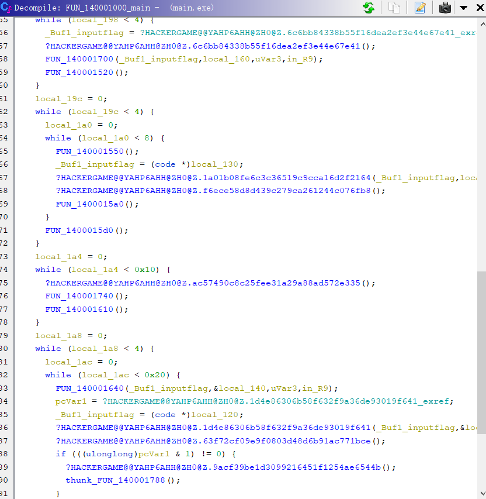

# Hackergame2023 个人题解/复盘
by Lysithea with 4750 scores

[TOC]

----------

官方PR这里为了不打扰只放了有非预期解/感觉比较重量级的题的WP在这里，其他题的WP和一些废话吐槽就不在这里发了，如果各位想看完整版可以到[我github仓库](https://github.com/RibomBalt/CTF-GG3-HG2023-Personal-Writeup/tree/HG2023)看，谢谢喵


## Komm, süsser Flagge

> flag2（我的P）非官方预期解

iptable和防火墙。挺喜欢的一个题，第一次让非科班出身的我认真学了一下TCP/IP报文协议和三次握手。

作为考底层网络协议的题，首先要找到趁手的工具，配置环境。BurpSuite原生不支持TCP协议抓包修改，有个插件好像是能做到这一点但是还是抓不到TCP包，折腾了很久放弃。期间我还查到一个用[原生socket库手搓的改IP包的库](https://github.com/AlecHang/packet_sender)，TCP包要自己手写，一看就不怎么靠谱。最后查到scapy这个框架可以拿来做底层网络的发包，当然是需要sudo权限的，使用也算便利，文档虽然写的不怎么样但是stackoverflow还是能搜到一些初级问题的答案。然后，我还用了wireshark辅助抓包，因为不太会用scapy，好像有些包的返回内容抓不到，但是wireshark可以全抓了。

然后需要读懂题目的要求，即iptable filter的配置。注意iptable里报文是相对于IP头的，而IP包的载荷是TCP头，TCP的载荷才是HTTP报文。第一问和第三问是strings模块，匹配对应字符串是否在报文中出现。第二问的u32语法则比较晦涩，在Claude和Google帮助下，我了解到这是一种基于四个字节固定位置匹配的语法，这一套连招可以精准读出IPV4包长度和TCP包长度，并精准匹配到HTTP报文的第一个字节。

flag1用strings匹配报文里不能含有【POST】。不需要知道TCP协议的细节，只需要知道各个协议层之间是解耦的就可以了。所谓的【粘包】【分包】的问题，即一个TCP包里可能只包含HTTP包的一部分，甚至一个包的结尾+第二个包的开头，甚至包的顺序还可以因为网络延迟发生调换。但是没有关系，TCP协议自己会处理好这些事情，留给后面HTTP协议的只是一段连续的数据流。而iptables是基于IP/TCP协议的，也就是说它面对的只是一个一个的TCP包。这样就好办了，我们只要把HTTP头里的POST拆成两个TCP包发送就可以了。这一问不是特别底层，甚至不需要额外配其他工具，直接用pwntools里的send函数分两次发送就好了。（补充两个小细节，发包的时候会有提示需要正确的Host和Content-Length头，加上就是能被go的http服务器解析的包了，这个问题要在第一问内解决不要带到后面）

flag2用u32匹配HTTP报文的第一个字符不能是【P】，当然我是尝试了一下小写，加空格，加空行这些不规范的语法的，通通不认（但我的flask/Werkzeug就可以认其中一些，go的http果然还是比较严格）。那么到这里，我们就需要了解一些TCP是如何解决延迟/分包问题的细节了，可以看这个[博客](https://blog.csdn.net/a19881029/article/details/38091243)。

> TCP三次握手：首先客户端向服务端发送一个flag为SYN的包，表示发起连接，然后服务器返回一个ACK/SYN的包（ACK表示确认），表示接受连接。然后客户端和服务端就可以发送数据。结束时需要四次挥手，会有FIN包。拒绝连接重置时，发的则是RST（reset）包，事实上这个题服务端拒绝我们也是用的这个包。
> TCP包用seq跟踪已发送的字节数，用ack表示自己已经收到多少对应的字节。SYN/FIN这种包比较特殊，不带数据但也会让ack+1。

因此，我们知道服务端对TCP解包的时候，是通过TCP头里的seq字段判断当前包是第几个字节的。那么如果我主动把seq减1，服务端会作何应对？

答案是服务端会机械地去找seq相等的那个字节，把内容加入HTTP报文里，而前面的部分就直接丢弃了。然而，对于IP包来说，这相当于有效载荷往后移了一位。所以我们只要在POST前面加个空格，然后修改第二次连接的TCP包seq为seq-1，就可以达成目标。于是你按照这个思路，写了一个[scapy程序](./iptable/the_lie_of_P.py)，以sudo权限运行，结果……你会发现连接超时。打开Wireshark抓包的结果，你会发现个很奇怪的现象：怎么第二个包发出去的是ACK/RST啊？我发的不是ACK吗？

这是因为服务端发给我们的报文先被内核给截胡了。一般来说操作系统都是内核来管理网络发包的，而内核态的程序并不知道用户态这边进行了一些比较僭越的发包操作。于是内核收到了服务端发来的SYN/ACK包，缓缓打出一个问号：你谁啊，哪个单位的？由于内核不知道这个请求是用户态发出的，那常规的操作只能是认为这个包发错了，于是发出RST中断连接。之后我们自己再发出ACK包，因为服务端已经中断了，而TCP三次握手是从SYN开始的，所以服务端也表示缓缓打出一个问号，最终以RST拒绝我们。解决方案就是用iptable简单粗暴屏蔽掉内核发出的RST包，我参考了[stackoverflow的问答](https://stackoverflow.com/questions/9058052/unwanted-rst-tcp-packet-with-scapy)，至少这次攻击流程里是不需要发出RST的，之后把规则改回来就行了。

flag3是一个白名单匹配，要求IP报文前50个字符中包含【GET / HTTP】字串。但是一般来说，IPV4包头就是20字节，TCP包头最短20字节，但加上一些额外设置，一般就会达到32字节，也就根本无法从应用层把这句话插进去（这也是为什么浏览器直接打开第三个网址/curl等工具会直接报无法连接的原因）。不过好在，根据TCP/IP协议，我们可以允许包的后面加入可变长度的选项内容，这个选项并不需要真的有意义，因为解包时如果看不懂会直接忽略。而10个字节长度，刚好可以满足最短IP头+TCP头+虚假载荷=50字节的需要。试了一下，IP Options加进去会丢包，但是TCP头加进去是可以通过的。[我的代码](./iptable/send_pack.py)。


## 微积分计算小练习2.0
有点难的XSS，做出来也非常有成就感。这个题给了一个有漏洞的网站，然后我们可以提供一个静态HTML，题目会有一个selenium bot模拟受害者，先访问漏洞网站设置cookie，然后访问我们的静态HTML，整个过程不会出现任何输出，也不能连接外网。我们的目标是偷到bot设置的cookie。

### 网页XSS漏洞

首先开始挖网站上的漏洞，做题页面没有东西，结果页面有个评论区功能，只能留25个字符，并且过滤了一大堆字符。本来想讲讲思路的，不过想来还是直接把我当时做的笔记直接放上来比较有节目效果（

```js
- 按上一届，后台可能是uWSGI？
- 反斜杠可以转义
- 单个双引号会报错，说明整个是双引号括起来的？
    - "+"注入，后台不会eval了吧？
    - 1"*2+"2，会得到NaN2
    - "+url_for+"，会出现只有第二行加载中（运行时报错？）
    - "["__name__"]+" 出undefined
    - 23"||7+" 会去除前面的"你的评论"的提示
    - "+{a:12}+" 会出[object Object]，基本确定是js解释器，有window，document
        - 这好像是我自己的浏览器解释器啊？
        - 拿cookie payload: "+document["cookie"]+"
- md破案了，模板是：
updateElement("#comment", "你留下的评论：{{input}}");
```
如上面所示，加载评论的模板其实放在JS段的一个字符串中间，又没有过滤双引号和转义，那很容易就会造成前端的模板注入（并不是在模板引擎中注入而是在前端JS代码注入），因为评论区其他人也可以看到所以可以转化为持久性XSS。

到这一步就有两个分支思路了：
- 利用反斜杠转义功能制造通用XSS。市面上能见到最短的有效载荷是这个：`<svg/onload=eval(name)>`，但问题在于尖括号和圆括号被过滤了，尽管我们可以用`\74svg/onload=eval\50name\51\76`这样的8进制语法绕过，但很不幸还是太长了。
- 利用`"+ __ +"`结构截断字符串，注入JS代码。有很多有意思的变量可以用，比如`document["cookie"]`可以直接读出来放在页面上，比如`name`全局变量，可以在`window.open`时指定。`location["hash"]`变量，可以在URL的#后面插入内容来指定。只可惜这种方法里面调用函数是不行的，因为离开字符串环境就不能用反斜杠转义了，括号打不出来，也就没法用`"+eval(name)+"`这种手段执行代码了。

等下，如果我把两种方法结合起来用，阁下将如何应对？

- 在评论区注入`"+name+"`，
- 在`window.open`创建漏洞网站的窗口时，指定`name`如下。因为hash内容是#+URL转义后的内容，这样可以直接还原原文。

```js
<svg/onload=eval(decodeURI(location.hash.substring(1)));>
```

- 访问`http://web/result#<your js code>`可以在svg标签加载时直接执行后面的JS代码。

因为location.hash的长度限制很宽松，也没有WAF，我们实现了任意XSS。

### 跨域XSS + 结果返回
接下来还有两大难点需要解决：
- 漏洞网站在web上，而我们的网页挂载在localhost上，两者处于不同的源。因此基于浏览器的同源安全策略，不能用window, iframe等直接访问对方DOM内容，用fetch/XHR访问时不能携带cookie
- 本题的bot没有回显，没有外网，唯一的输出通道就是漏洞网站本身，而bot和我们处于不同的session，它对网站的修改我们是看不到的（甚至于一开始我都不知道bot的session是不是真的和我们不一样，也许id参数会给它一样的session也说不定呢）

首先解决跨域的问题。跨域通信有很多奇技淫巧，但是最正统的方法应该还是`postMessage`API，可以向对方发送一段字符串，对方可以监听`message`事件后用一个回调函数处理这个发送的字符串。这个通信是双向的，父窗口可以用`window.open`返回对象访问子窗口，而子窗口也可以用`window.opener`返回父窗口。为了方便调试，我实现了一个shell的功能，子窗口直接eval父窗口的命令，然后把结果返回去。因为后续命令会包含fetch等异步函数，所以这个shell也必须是一个异步的。我的实现如下：
```js
// 把回车缩进去掉变成一行塞到URL的#后面
w=window.opener;
window.addEventListener("message",(e)=>{
    console.log(e.data);
    eval("async ()=>{"+e.data+"}")().then(
        m=>w.postMessage(m, "*")
    )});
w.postMessage("OK:web","*");
```
这样一来，我们就可以在localhost源发送代码到web源执行，再也不用担心#后面代码过长导致的问题了。

接下来解决传回数据的问题。我一开始想了很多办法修改自己的cookie，想着既然跨域不能在headers里加cookie，那同源总可以了吧？结果不行，浏览器根本不鸟我（最重要的是这个在本地环境是无法直接测出来的，我不可能有两套合法的cookie除非作弊）。后来突发奇想，如果我在web上重新用我自己token登录，会怎么样？终于成功换成了我自己的session。注意重新登录后cookie被清理了，所以在此之前我们要先把flag拿到父窗口，然后手动输入进子窗口的表单里，这里会遇到评论区25字符+WAF限制（有%哦）。最后我的方案是直接base64编码，分段传进去。

[点进去就会被立刻XSS的网页](./xss/index.html)

## 逆向工程不需要F5
标题是假的，F5还是用的，只是不能只用F5（ghidra用户表示F5是什么？）。

附件解压出来16个dll已经感觉非常重量级了，把main.exe拖进ghidra看着反编译的代码，大脑原地死机



与之相对，程序执行流程非常简单，只有一次输入（容易找到是个vscanf），输入长度是0x26并满足flag格式要求（第一个if之前的两个函数，还是可以勉强看懂的，后面就看不懂了）

直接硬上是非常愚蠢的行为，这个程序很明显用了控制流平坦化的混淆思想，把程序拆到16个DLL里去运行。所以接下来开始去平坦化，我的思路非常简单粗暴，就是把汇编复制出来（具体来说我是直接复制python byte strings然后让pwntools帮我反汇编），加上跳转label并修改掉跳转目标，然后把所有的CALL替换成对应的代码（把CALL, ret和导入CALL地址的几个指令去掉）。整个过程持续3个小时，极其折磨，这是我的[成果](./f5_rev/dump.a)。如果程序再复杂点，我可能就得考虑写自动化工具了（不过不懂DLL要怎么取符号表和偏移，pwntools对windows支持不好，也是一种折磨）。

成形的程序直接dump进二进制文件里，再丢进ghidra反编译，经历几次复制错位置的BUG之后，终于得到了一个完整的程序了（不过毕竟没有ELF结构，输入参数比较抽象，不过有栈地址倒也能看）之后就相对简单了，倒着看的话，程序最后一步是逐字节和某个key相乘了几次，只要key是奇数就可以用模数域的逆元解决。然后把字符串当成short数组，每2字节异或操作。接下来是当成int数组做乘法，当成long数组做异或。

第一步就比较关键了，反编译甚至给了我两个我没见过的符号`ZEXT816`和`SUB168`，以至于我一直没搞明白为什么一个long能右移0x40。
```c
  for (local_160 = 0; local_160 < 4; local_160 = local_160 + 1) {
    for (local_164 = 0; local_164 < 2; local_164 = local_164 + 1) {
      uVar4 = (ulonglong)(int)(local_160 << 4 ^ 0x55aa00ff);
      lVar5 = (longlong)local_164;
      uVar1 = auStack_d3[lVar5 * 2];
      uVar2 = auStack_d3[lVar5 * 2 + 1];
      auVar3 = ZEXT816(uVar1) * ZEXT816(uVar4);
      auStack_d3[lVar5 * 2] = SUB168(auVar3,0);
      auStack_d3[lVar5 * 2 + 1] =
           SUB168(auVar3 >> 0x40,0) + uVar1 * ((longlong)uVar4 >> 0x3f) + uVar2 * uVar4;
    }
  }
```
最后查到[github上一个issue](https://github.com/NationalSecurityAgency/ghidra/issues/2916)，这才知道原来这是64位整数到128位整数的一个拓展，原先C没有这种语法，而引入这种语法会让反编译代码变得简单，这一步实际上也是一个看作128位整数和key相乘的过程，也很容易求出逆元（中间那个右移0x3f确实是纯干扰项，那项一定为0）。
[逆向flag过程](./f5_rev/rev_f5.py)附在这里。其实没什么技术含量，就是折磨。逆向到半夜，天哪。

> 赛后补充：我之前没听说过angr，现在听说了，谢谢

## O(1)用户登录系统
因为题目背景设定比较有趣所以做起来不困的一个math/Crypto（？）

从没听过merkle tree，仔细读了一遍源码直呼思路巧妙。这实际上是一个二叉树，对于所有输入条目，在二叉树的所有叶子节点存储hash值，然后每个父节点由两个子节点的hash值按序排列后hash得到，直到根节点，然后记录根节点，把每个用户到根节点一路所有兄弟节点的hash连起来作为key返回。验证的时候，如果明文和hash是一致的，那么对明文取hash之后，按key的hash一路hash过去，一定能得到根节点hash。（当然我觉得这个是假的O(1)，毕竟用户越多树也越长，计算散列的时间是O(logN)的）

这种基于hash的安全系统，最怕的就是碰撞攻击，也就是两个不同的数据得到相同的hash。具体到这个题，我们会发现一个漏洞：这个树并没有验证我们token的长度是否相同，即我们可以给出高度和树不同的hash。所以如果我们要伪造一个不存在于用户列表的admin用户，无非就是两种思路：向上伪造，向下伪造。

- 向上伪造：找到两个合法的用户名密码串A,B，使得$H(A).H(B)$是一个合法的用户名:密码串，且用户名为admin
- 向下伪造：找到两个合法的用户名密码串A,B，其中A以`admin:`开头，使得$H(A).H(B)$的合法用户名:密码串。

很容易发现向下伪造凭空少一个约束条件`admin:`，平均时间约少$2^{40}/2^{6}$倍（有人一上来就去爆破更难的那种，我不说是谁）。值得注意这个题用户名密码可以是不可打印字符，只要能解码，不是回车/冒号就行，可以增大爆破概率。我爆出来这两个可以用的
```
admin:Lysithea5a76f79c775b11eea0b19c29762f6781
admin:Lysitheae8f590aa775b11eea53a9c29762f6781
```
利用这两个得到的父节点是一个满足条件的用户名密码，把它输入系统就可以用这两个用户名密码之一登录啦。

## It's my Calculator!!!!!
这个题给了一个带存取功能的计算器程序和源代码，涉及到的flex和bison我都没听说过。不过看了编译过程，似乎会先编译成中间的C语言，再编译成可执行程序的。这种用第三方框架的题，多半不是攻击第三方框架，而是攻击题目给的代码的。好在`.l`和`.y`文件可读性足够好。

我目前理解是这个程序定义了一个语法树和对于的执行逻辑。l文件是给出了一些token的定义，以及如何匹配一个token。y文件给出了如何把一长串命令拆分成token与token之间的运算，并且定义了得到返回值的处理逻辑，是C语言写的，可以在中间态C语言找到对应代码。

进行一些试玩（可以考虑Makefile里加调试参数看语法树解析过程），会发现这个模式匹配有点僵硬，比如-1这样的数就是不合法的模式，必须要写成0-1。重点关注的GET和PUT的第一个操作数，即地址，只能是NUMBER，也就是0-9构成的字串，经过atoi得到，而不能是包含其他字符的表达式。PUT和GET有个简单的数组越界判断，但是很容易发现它们没考虑序号为负数的情况，而且atoi这个函数也有整数溢出问题（或者说这个函数本来返回的是unsigned int），只要输入大于$2^{31}-1$的数，它就会返回负数，这样就实现了缓冲区溢出，我们可以访问比数组更低地址的内容。

放在ghidra里看一下，发现给的程序保留了符号表。我们最关心的缓冲区位于.bss段，而它的楼上就是.got.plt段，也就是GOT表所在的地址。再加上checksec能得到这个题的保护是Partial RELRO，到这里思路已经很清楚了，就是想办法改写GOT表劫持程序执行流程，getshell或者读取文件。唯一问题是这个程序并不是交互的，而是我们交一段代码上去跑完把结果返还回来，但这并没有关系，因为访问特定GOT表项的偏移是固定的，我们可以写死在程序里。至于需要动态计算的偏移地址，你还记得这个程序本身就是个计算器吗？

思路有了，还得看看怎么执行，比较理想状态是直接调用system（这个题可行），如果不太好就得先open再read。无论如何，我们首先得找到一个第一个参数能够被我们控制的函数调用。我找到的调用在`yyerror`函数里，有一个`fprintf(stderr, "error: %s", param_1);`，但是stderr作为一个缓冲区，也是在bss段我们可写的范围内，并且其实平时并不太会被用到。所以我们把stderr指向我们控制的一个字符串，然后把fprintf的GOT表修改成system，手动触发一次报错触发yyerror调用，就达成了任意代码执行。

接下来虽然是常规流程但我也叙述一遍：找到一个已经被用过的函数和没有被用过的函数，前者可以泄露出libc基址（小小的细节问题，题目给了编译时dockerfile，可以build之后把里面的libc拿出来），后者可以泄露出plt段偏移从而泄露PIE，这样能知道缓冲区的地址。然后在缓冲区布置`cat /flag`字符串。之后在stderr布置指向缓冲区对应命令的指针，把fprintf的GOT改成system，触发一次报错，就打印出了flag。我也尝试了`/bin/sh`之后继续从输入流读命令的方法，不过没有成功，可能是计算器本身的缓冲区已经把我的输入全都输进去了？

这个题的flag是`flag{libcue+gnome_track_miners=1clickRCE_CVE-2023-43641_c45f8fa3c8}`，原来是gnome和libcue的一个CVE啊，就一个月还挺新的，回头研究下看看怎么复现。看了下自己Ubuntu的libcue版本，居然在被影响范围内，瑟瑟发抖。啊我不用gnome啊，那没事了（