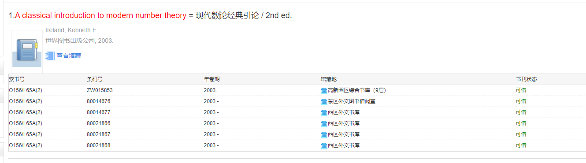
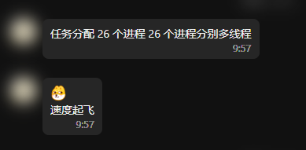
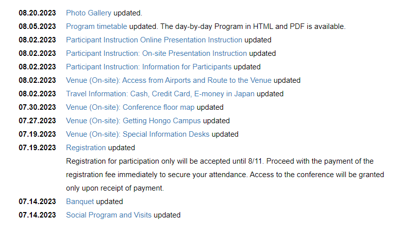
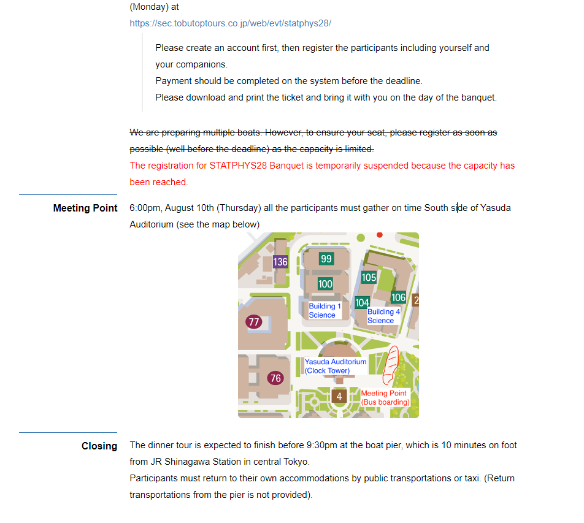
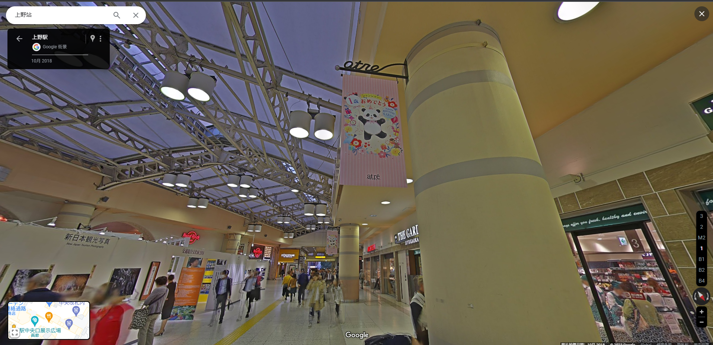
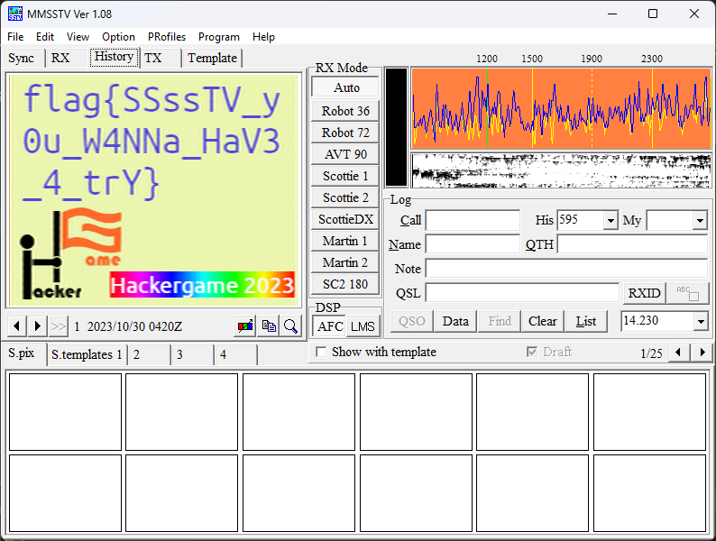

# Hackergame 2023 Writeup by Simplxs

Scored 4650, Ranked 51

作为 3 年老玩家, 感觉今年的简单题数量变多了些, 很多题都是到处查资料过的, 不过 Binary 和 Math 题还是一如既往的做不出几道.

## Hackergame 启动
每年的经典签到题, 熟练的 F12 启动, 随便录制一段提交, 发现 chrome 顶部地址栏直接跳转到了 `https://cnhktrz3k5nc.hack-challenge.lug.ustc.edu.cn:13202/?similarity={similarity}` 直接把 similarity 改成 9999 然后回车就能看到下图:


直接获取flag:


不对是这张 (:


然后复制提交一把梭, 一看排名20+(悲).

<del>(话说我打开 F12 干嘛来着)</del>

## 猫咪小测
> 1. 想要借阅世界图书出版公司出版的《A Classical Introduction To Modern Number Theory 2nd ed.》，应当前往中国科学技术大学西区图书馆的哪一层？**（30 分）**

Google 搜索[中科大图书馆](https://lib.ustc.edu.cn/), 尝试直接搜索书名号中的内容, 结果没查到书. 然后截取 A Classical Introduction To Modern Number Theory 搜索, 第一个结果就是世界图书出版公司出版的, 点击查看馆藏, 能看到 西区外文书库.

 

但我当时直接单击西区外文书库, 发现不能打开, 而且楞是没发现只要把鼠标移动到上面就能显示楼层. 到处搜索西区外文书库无果, 直接抄起 python 爆破.

```python
import requests
import re

r = requests.session()

r.get("http://202.38.93.111:11461/",
      params={"token": "{id}:{token}"})

r.headers.update({'Content-Type': 'application/x-www-form-urlencoded'})

for i in range(100):
    ret = r.post('http://202.38.93.111:10001/',
                 data=f'q1={i}&q2=&q3=&q4=')
    score = re.findall('本次测验总得分为 (.*)。', ret.text)[0]
    print(i, a)
    if score == '30':
        break
```

跑 3 秒就能发现答案为 *12*.

> 2. 今年 arXiv 网站的天体物理版块上有人发表了一篇关于「可观测宇宙中的鸡的密度上限」的论文，请问论文中作者计算出的鸡密度函数的上限为 10 的多少次方每立方秒差距？**（30 分）**

Google 搜索引号内容, 得到 10^(-23). 这里问次方, 所以是 *23*.

> 3. 为了支持 TCP BBR 拥塞控制算法，在编译 Linux 内核时应该配置好哪一条内核选项？**（20 分）**

ssh 到我的 Ubuntu 服务器, vi /boot/config-*, 输入 /BBR 即可找到答案为 *CONFIG_TCP_CONG_BBR*.

> 4. 🥒🥒🥒：「我……从没觉得写类型标注有意思过」。在一篇论文中，作者给出了能够让 Python 的类型检查器 <del>MyPY</del> mypy 陷入死循环的代码，并证明 Python 的类型检查和停机问题一样困难。请问这篇论文发表在今年的哪个学术会议上？**（20 分）**

这道题我做的挺曲折的, 首先上 Google 搜索关键词 "python", "mypy", "infinite loop", "type hints", "paper"等等, 但是没什么有效信息, 然后在 Mypy 的 GitHub issues 搜索 infinite loop, 但是也没有找到什么关键信息, 最后上论文查询网站用相关关键词搜索, 加上时间筛选, 也没得到答案. 去问 new bing, 直接不让我查论文. 消耗相当多的时间后决定爆破:

```python
import requests
import re

r = requests.session()

r.get("http://202.38.93.111:11461/",
      params={"token": "{id}:{token}"})

r.headers.update({'Content-Type': 'application/x-www-form-urlencoded'}

s = 'ABCDEFGHILKMNOPQRSTUVWXYZ'
for i in range(pow(len(s), 3)):
    ss = s[i // pow(len(s), 2)] + s[i // len(s) % len(s)] + s[i % len(s)]
    print(ss)
    ret = r.post('http://202.38.93.111:10001/',
                 data=f'q1=12&q2=23&q3=CONFIG_TCP_CONG_BBR&q4={ss}')
    a = re.findall('本次测验总得分为 (.*)。', ret.text)[0]
    print(a)
    if a == '100':
        break
```

跑了一会没结果, 我估计继续爆破的难度过大, 就放弃了, 抱着随便试的态度继续翻论文, 结果试了一篇我原来觉得肯定没关系的论文竟然就是答案, 我只能说这名字也太有迷惑性了把.....答案为 *ECOOP*.

[Python Type Hints Are Turing Complete - DROPS](https://drops.dagstuhl.de/opus/volltexte/2023/18237/pdf/LIPIcs-ECOOP-2023-44.pdf) 「Python 类型提示被证明具有完备性」*Ori Roth* on **ECOOP**

这标题怎么看都不想在说 Python 的坏话吧!!!啊啊啊啊!

<del>顺带一提, 我有个朋友直接枚举了 1 ~ 4 位的所有组合, 到最后也没试出来(废话 答案五位数).</del>



## 更深更暗
没看题干, 一打开网页看到蓝底白字的英文吓得我直接回题目链接仔细读题去了, 看了好一会才明白是要"打捞"这艘船. 于是乎往下翻网页, 翻了一会发现好像有点看不到头, 而且也没滑动条, 直接 F12 启动. 随便追踪下就能找到一段非常显眼的代码:

```html
<pre id="titan">
                               /
                               \
                               |
                             __|__
                            |     \
                                    /
     ____  _________________|___ ___\__________/ ____
    &lt;   /                                            \____________  |
     /         flag{T1t@n_8a45c7220a8011980c6bbf030da99d82}       \ (_)
~~~~~~     O       O       O                                       &gt;=)~~~~~~~
       \_______/ ____________\  /_________________________________/ (_)</pre>
```

直接提交, pass.

## 旅行照片 3.0

这道题解题顺序与图序不一致, 先读题, 然后跟着题干分析.

> ## 上午
> 与学长碰面后，他带你参观了他的学校。在校园的一个展厅内，你发现了一枚神秘的金色奖牌，它闪闪发光，令人心生羡慕。

直接搜索奖牌下面的人名, 发现原来是诺贝尔物理学奖得主**[小柴昌俊](https://zh.wikipedia.org/wiki/%E5%B0%8F%E6%9F%B4%E6%98%8C%E4%BF%8A)**并且得知学长所在的学校是**东京大学**.

Google 搜索"日本 诺贝尔奖", 转到[维基百科](https://zh.wikipedia.org/zh-hans/%E6%97%A5%E6%9C%AC%E4%BA%BA%E8%AB%BE%E8%B2%9D%E7%88%BE%E7%8D%8E%E5%BE%97%E4%B8%BB), Ctrl + F 搜索京都帝国大学(东京大学), 通过获奖年份(2015)就能猜到出身最晚者为**[梶田隆章](https://ja.wikipedia.org/wiki/%E6%A2%B6%E7%94%B0%E9%9A%86%E7%AB%A0)**, 查看概述可以看到他多年在[宇宙線研究所](https://ja.wikipedia.org/wiki/東京大学宇宙線研究所)进行研究, 缩写为 *ICRR*, 即第二题答案.

> ## 中午
> 离开校园后，你和学长走到了附近的一家拉面馆用餐。那家店里的拉面香气扑鼻，店内的装饰和氛围也充满了日式的风格。 学长（下图左一）与你分享了不少学校的趣事。饭后，你们决定在附近散步，享受这难得的闲暇时光。当你们走到一座博物馆前时， 马路对面的喷泉和它周围的景色引起了你的注意。下午，白色的帐篷里即将举办一场大型活动，人们忙碌的身影穿梭其中，充满了期待与热情。

> ## 下午和夜晚
>
> 在参观完博物馆后，学长陪你走到了上野站。你们都感到有些不舍，但知道每次的分别也是为了下次更好的相聚。 学长那天晚上将继续他的学术之旅，打算乘船欣赏东京的迷人夜景和闪耀的彩虹大桥（Rainbow Bridge）。 而你则搭乘了开往马里奥世界的电车，在那里度过了一段欢乐的时光。

仔细查看图片(图二)可以发现左一的先辈脖子上挂的牌子的绳子上清楚的写着 **STATPHYS28**, Google 一下发现是一个物理学会议[官网](https://statphys28.org/)上写了最新的会议介绍, 往下翻到News能找到[Program timetable](https://statphys28.org/programtt.html), [Photo Gallery](https://statphys28.org/photogallery.html)和[Banquet](https://statphys28.org/banquet.html).






根据照片(彩虹大桥 乘船)和时间表能确定这天为 10 Aug.(Thu), 所以第一题答案为 *2023-08-10*.

同时, 还能确定集合地点为 South side of Yasuda Auditorium. 第五题答案为*安田讲堂*

打开谷歌地图搜索[东京大学](https://www.google.com/maps/place/University+of+Tokyo/@35.7130318,139.7593514,15.75z/data=!4m6!3m5!1s0x60188c2ffa206ea3:0x30e407498313ba95!8m2!3d35.7126775!4d139.761989!16zL20vMDE3bHZk?entry=ttu), 然后搜索[博物馆](https://www.google.com/maps/search/%E5%8D%9A%E7%89%A9%E9%A6%86/@35.7130522,139.7593514,15z/data=!3m1!4b1?entry=ttu)得知图片(图三)此处为东京国立博物馆对面的上野公园大喷泉, Google 搜索""上野公园 10 Aug."发现该活动为[「全国梅酒まつりin東京2023｜全国梅酒まつり」](https://umeshu-matsuri.jp/tokyo_ueno/), 在该文章结尾能找到STAFF募集的[链接](https://umeshu-matsuri.jp/tokyo_staff/). 点击进去就能看到调查问卷的[网址](https://ws.formzu.net/dist/S495584522/), 提取出问卷编号 *S495584522*, 即第三题答案.

至于博物馆门票, 谷歌地图上有写, 但是我这显示的是美元.


不过没关系, 点击 Admission 中的第一个进入[博物馆官网](https://www.tnm.jp/modules/r_free_page/index.php?id=113#access_01), 就能找到价格表了.


<del>所以第四题答案为 *500*</del>. 嗯, 本来应该是这样的, 但是当我提交时却显示答案错误, 再试一试 1000, 阿巴阿巴, 还是答案错误. 合理推测应该是某种原因免费了或者不是他付的钱, 试一试输入 *0*, 然后. 嗯, 过了.

<del>过了就行, 管他什么原因呢....</del>

最后一题基本靠猜的.

Google 搜索"ボタン＆カフリンクス"但是并没有得到什么有效信息, 上 Google Maps 看街景图 发现时间为 2017 年. 找了很久也没找到, 最后直接猜了*熊猫*.



然后 3d 广告牌也找了很久, 因为根据题目描述我以为他去了环球影城, 搜索了很久也没找到有什么东西. 最后发现好像理解错了, Google 了一下"上野站 3d广告" 意外得出答案*秋田犬*.

所以第六题答案为*熊猫-秋田犬*.

## 赛博井字棋
没啥好说的, 经典的服务端不校验, HTTP 模拟发包即可, 不过要注意棋盘数据是存在 Session 里面的, 手动发包每次都要要修改 cookies.

## 奶奶的睡前 flag 故事
看一眼题目描述就知道是在说 Windows 和 Pixel 的截图漏洞, 直接上 [Acropalypse](https://acropalypse.app/).


## 组委会模拟器
打开网页抓包观察一下, 然后直接上脚本.
```python
import requests
import re

r = requests.session()

r.get("http://202.38.93.111:11461/",
      params={"token": "{id}:{token}"})
msg = r.post('http://202.38.93.111:10021/api/getMessages')

t = time.time()
id = 0
for i in msg.json()['messages']:
    m = re.match('.*hack\[.*\].*', i['text'])
    tt = time.time()
    if (tt-t < i['delay']):
        time.sleep(1)
    if m is not None:
        print(r.post('http://202.38.93.111:10021/api/deleteMessage',
              json={'id': id}).json())
    id += 1

res = r.post('http://202.38.93.111:10021/api/getflag')

print(res.json())
```
我一开始没加 sleep, 没想到这题竟然有时间效验, 返回一片的检测到时空穿越 (:

## 虫

这题整了挺久的, 当时一看到题目就明白是什么意思了, 但是搜索半天都没找到能将波信号二值化的工具, 就暂时作罢了. 结果有一天我中午吃饭时在 b 站看视频时正好给我推送了接受国际空间站传输图片的视频, 然后就找到了 MMSSTV. 不过 MMSSTV 不能直接载入 wav 格式的文件, 需要用 ffmpeg 先转成 mmv, 然后在 mmsstv 中选择 Play sound from the file, 静待一会即可得到图片.



## JSON ⊂ YAML?
直接 Google 搜寻"yaml 1.2 json"能找到[一些讨论](https://lobste.rs/s/equcp2/json_is_not_yaml_subset)。

所以第一题答案为:

```JSON
{"a": 1e2}
```
而且 yaml 1.2 似乎不能接受重复键, 但 json 似乎可以, 所以构造json:
```JSON
{"a": 0, "a": 0}
```
## Git? Git!
谷歌搜索"git 恢复撤销的commit", 可以找到[文章](https://www.jianshu.com/p/21fdec09a8eb).


```bash
> git reflog
ea49f0c (HEAD -> main) HEAD@{0}: commit: Trim trailing spaces
15fd0a1 (origin/main, origin/HEAD) HEAD@{1}: reset: moving to HEAD~
505e1a3 HEAD@{2}: commit: Trim trailing spaces
15fd0a1 (origin/main, origin/HEAD) HEAD@{3}: clone: from https://github.com/dair-ai/ML-Course-Notes.git
> git reset --hard 505e1a3
HEAD is now at 505e1a3 Trim trailing spaces
```
然后查看 README.md 即可找到被隐藏起来的 flag.

## HTTP 集邮册
状态码为在 [Mozilla](https://developer.mozilla.org/en-US/docs/Web/HTTP/Status) 上查的.

100 Continue

```
GET / HTTP/1.1\r\n
Host: example.com\r\n
Expect: 100-continue\r\n\r\n
```

200 OK

```
GET / HTTP/1.1\r\n
Host: example.com\r\n\r\n
```
206 Partial Content

```
GET / HTTP/1.1\r\n
Host: example.com\r\n
Range: bytes=114-514\r\n\r\n
```

304 Not Modified

```
GET / HTTP/1.1\r\n
Host: example.com\r\n
If-Modified-Since: Tue, 15 Aug 2023 17:03:04 GMT\r\n\r\n
```

400 Bad Request

```
GET / HTTP/1.1\r\n
```
404 Not Found

```
GET /114514 HTTP/1.1\r\n
Host: example.com\r\n\r\n
```
405 Method Not Allowed
```
POST / HTTP/1.1\r\n
Host: example.com\r\n\r\n
```
412 Precondition Failed

```
GET / HTTP/1.1\r\n
Host: example.com\r\n
If-Match: 114514\r\n\r\n
```

413 Content Too Large

```
GET / HTTP/1.1\r\n
Host: example.com\r\n
Content-Length: 1145141919810\r\n\r\n
```

414 URI Too Long

```
GET /(... 此处省略 1kb 乱码 ...) HTTP/1.1\r\n
Host: example.com\r\n\r\n
```
416 Range Not Satisfiable

```
GET / HTTP/1.1\r\n
Host: example.com\r\n
Range: bytes=114514-1919810\r\n\r\n
```
501 Not Implemented

```
GET / HTTP/1.1\r\n
Host: example.com\r\n
Transfer-Encoding: homo\r\n\r\n
```

505 HTTP Version Not Supported

```
GET / HTTP/114.514\r\n
Host: example.com\r\n\r\n
```

无状态码
```
GET /\r\n
Host: example.com\r\n\r\n
```
当时做题时我没做出 416 Range Not Satisfiable, 是在朋友的提醒下才知道原来还有一个.

## Docker for Everyone
这题明摆着就是要挂载文件到docker下读取.
```Bash
alpine:~$ docker run -it -v /dev/shm/flag:/flag --rm alpine
/ # cat /flag
flag{u5e_r00t1ess_conta1ner_1edc1d7f3e_plz!}
```
## 惜字如金 2.0
首先观察 get_code_dict 发现会检查 cod_dict 是不是每行都是 24 个字符, 但实际每行只有 23 个字符, 说明每次都少了一个字母。

那么首先在前两个 dict 结尾加上 e, 然后第三行, 第四行和第五行开头的 l(u 为元音), c, t 双写, 得到:

```python
    cod_dict = []
    cod_dict += ['nymeh1niwemflcir}echaete']
    cod_dict += ['a3g7}kidgojernoetlsup?he']
    cod_dict += ['ullw!f5soadrhwnrsnstnoeq']
    cod_dict += ['cct{l-findiehaai{oveatas']
    cod_dict += ['tty9kxborszstguyd?!blm-p']
```

跑一遍测试得到: *flag{you-ve-r3cover3d-7he-an5w3r-r1ght?}*

<del>这就过了???</del>

## 🪐 高频率星球
首先 Google 一下 [asciinema](https://asciinema.org/), 发现是个 Linux 的命令行录制工具. 直接 WSL 启动.

```bash
sudo apt install asciinema
asciinema cat asciinema_restore.rec >output.txt
```

然后发现这段命令似乎是在编辑一个 js 文件. 于是将 [flag.js](flag.js) 提取了出来, 但是其中包含许多重复的控制字符, 用 VScode 批量替换一下, 然后`node flag.js`即可得到 flag.

<del>(不知道为啥我的 sha256 和提供的对不上, 不过能跑就行)</del>

## 🪐 小型大语言模型星球
### You Are Smart
Flag 1 非常好拿。
```
"Am I smart?" the boy said.
```
```
"Yes, you are smart," the girl said.

The boy smiled and said, "Let's go on the slide together!"
👏👏👏 flag1: flag{I-tHink-YoU-AR3-ReA!Ly-r3@lLy-smarT} 👏👏👏
```

### <del>Accepted</del>

这题我试了很多单词也没试出来, 本来想爆破的, 但我这电脑性能可能两天半都爆不出来, 遂放弃.

## 🪐 流式星球

这题的难度主要在于猜长宽, 我一开始是直接因式分解算的长宽,但是发现太麻烦就放弃了, 直接先固定高度枚举宽度, 测得宽度为 427 , 然后再用截图测得单帧高度为 759, 最后根据文件大小计算出总帧数应为 139(-93 字节). 

实际上编写脚本反而其实很简单.

```python
import os
import cv2
import numpy as np

def guess_width(input):
    q = np.fromfile(input, dtype=np.uint8)
    frame_height = 1000
    frame_count = 1
    
    buffer = q.copy()
    os.mkdir("test")
    for frame_width in range(100, 1000)
        buffer.resize(frame_count * frame_height * frame_width * 3, refcheck=False)
        buffer = buffer.reshape((frame_count * frame_height * frame_width, 3))
        buffer = buffer.reshape((frame_count, frame_height, frame_width, 3))
        cv2.imwrite(f"test/{frame_width}x{frame_height}.jpg", buffer[0])
        
def restore_video(file, input):
    buffer = np.fromfile(input, dtype=np.uint8)
    frame_height = 759
    frame_width = 427
    frame_count = 139

    print(frame_count * frame_height * frame_width * 3 - buffer.size)
    buffer.resize(frame_count * frame_height * frame_width * 3, refcheck=False)
    buffer = buffer.reshape((frame_count * frame_height * frame_width, 3))
    buffer = buffer.reshape((frame_count, frame_height, frame_width, 3))

    vidcap = cv2.VideoWriter(file, cv2.VideoWriter_fourcc(
        *'mp4v'), 24.0, (frame_width, frame_height))
    for i in range(frame_count):
        vidcap.write(buffer[i])
    vidcap.release()

if __name__ == "__main__":
    with open("video.bin", "rb") as input:
        # guess_width(input)
        restore_video("video.mp4", input)
```

不过值得注意的是最后生成的视频会丢失 1 行 1 列的像素, 似乎是编码器仅支持偶数倍的长宽.

## 🪐 低带宽星球
### 小试牛刀
直接上 webp 完事.

## Komm, süsser Flagge
### 我的 POST
### 我的 P
### 我的 GET

这三题实际上甚至可以用同一段代码完成.

第一第二题都是利用的就是分包发送, 第三题利用的是 TCP Header 的 Option 区域, 这俩并不冲突, 稍微调整下就能同时实现, 不过当时我还是写了两个程序. <del>raw socket 用 Python 实现太麻烦了.</del>

另外, 第二题其实还有一种办法, 就是利用紧急指针在数据区的第一个字节处放置一个除 P 以外的字符, 然后在后面跟上正常的 HTTP 数据包, 不过因为这道题 iptable 规则漏洞直接用第一题的方法过了, 所以没有完全实现, 不知道有没有感兴趣的接着研究一下.

第一二题脚本如下:

```python
with socket.socket(socket.AF_INET, socket.SOCK_STREAM) as so:
    so.connect(("192.168.23.1", 18080))
    so.send("PO".encode())
    so.send("""ST / HTTP/1.1
Host: 192.168.23.1:18080
Connection: keep-alive
Pragma: no-cache
Cache-Control: no-cache
User-Agent: Mozilla/5.0 (Windows NT 10.0; Win64; x64) AppleWebKit/537.36 (KHTML, like Gecko) Chrome/118.0.0.0 Safari/537.36
Accept-Language: en-US,en;q=0.9,zh-CN;q=0.8,zh;q=0.7,ja;q=0.6
Accept-Encoding: gzip, deflate
Content-Length: 100

{id}:{token}""".encode())
    print(so.recv(1000).decode())
```

第三题脚本是从 [GitHub](https://github.com/MaxXor/raw-sockets-example) 上找的代码(GPL-3.0 license)并进行修改的, 参见 [raw_socket](raw_socket.c).

## 为什么要打开 /flag 😡
### LD_PRELOAD, love!

直接上静态编译, 完事.

```C
#include <stdio.h>

int main() {
    FILE *ptr;
    char buf[2048];
    int len = 0;
    ptr = fopen("/flag", "r");
    len = fread(buf, 1, 2048, ptr);
    buf[len] = 0;
    fclose(ptr);
    printf("%s", buf);
    return 0;
}
```
```Bash
gcc -static -o main ./main.c
```

### <del>都是 seccomp 的错</del>

阅读 main.rs, 发现给了我们提示 [greenhook crate](https://crates.io/crates/greenhook), Ctrl+鼠标左键点开网页查看, 发现是 Hook Syscall 的框架, 并且在文章最底下发现 Limitation.

> ## Limitation
>
> 1. Your hook functions are executed by supervisor process (thread), not supervised one! This means that you may find difficulties when you need to do something on behalf of supervised process.
> 2. Be careful of TOCTOU attack! Seccomp unotify will NOT stop whole process when handling syscalls, so it is possible that the supervised process may change the syscall arguments after supervisor has checked them, and `continue_syscall` can be dangerous (thus it is marked as `unsafe` here).
> 3. Handling signals could be troublesome. It is possible that signals can interrupt syscalls or restart them, but supervisor has no knowledge of this. Try to check request validity in your functions to alleviate this problem. For more information please read `seccomp_unotify(2)`.

第一条和第三条在阅读题目所给源代码后发现似乎无法利用, 于是编写利用第二条的程序.

```cpp
#include <unistd.h>
#include <string.h>
#include <pthread.h>

char path[100] = "/fack";

void changePath()
{
    usleep(300);
    strcpy(path, "/flag");
}
int main()
{
    pthread_create(a, NULL, (void *)changePath, NULL);

    FILE *fp;
    char buffer[80];
    fp = popen(path, "r");
    fgets(buffer, sizeof(buffer), fp);
    printf("%s", buffer);
    pclose(fp);
}
```

但是上传执行时一直报 128. 经过测试后发现不能使用 sleep, 于是作罢, 没想到题解是直接暴力循环测试....

另外我也尝试了一些其他办法, 比如 execve 调用 cp, bash, cat 等等, 还有 fork, clone 进程等等, 无一实现.

## 异星歧途

每年的常规游戏题, 今年的小游戏是 [Mindustry](https://anuke.itch.io/mindustry). 从题目所给链接下载, 启动. 导入地图, 开始游戏, 进去随便看看, 然后乱按几下按钮. BOOM, 嗯, 炸了...

于是退出游戏, 上 Google 搜索"Mindustry 开关"<del>(题目不是说叫按钮吗 为什么实际叫开关 害得我半天没查到)</del>. 找到 TapTap 上的一篇文章[处理器基本原理 #1 处理器系统基本介绍](https://www.taptap.cn/moment/116324443369769048). 于是大概了解了游戏玩法.

重新打开游戏, 新开一个存档, 在第一组按钮周围找到微型处理器, 点击编辑查看.


伪代码如下:

```cpp
bool generator1;
bool s1, s2, s3, s4, s5, s6, s7, s8;

if (s1 == false || s2 == true || s3 == false || s4 == true || s5 == true || s6 == false || s7 == true || s8 == false)
    generator1 = false;
else
    generator1 = true;
```

很容易得到第一组密码为 *10100101*.


然后查看第二组的代码:

```cpp
bool generator1, panel1;
bool sw1, sw2, sw3, sw4, sw5, sw6, sw7, sw8;
int number;
number = sw1 << 7;
number += sw2 << 6;
number += sw3 << 5;
number += sw4 << 4;
number += sw5 << 3;
number += sw6 << 2;
number += sw7 << 1;
number += sw8;
bool en;
for (int i = 0; i < 16; i++)
{
    int fl0 = i * i;
    if (fl0 == number)
        en = true;
}
bool fl1 = !sw1;
bool fl2 = !sw6;
bool fl3 = fl1 || fl2;
if (fl3)
    en = false;
generator1 = en;
panel1 = en;
```

稍微分析一下, 可以得到要求:

1. 答案二进制为一个平方数.
2. sw1 和 sw6 必须打开, 即二进制的第 8 位和第 3 位为 1.

稍微口算下得出答案为 14^2 = 196, 即 *11000100*.


第三组代码比较麻烦, 我在这炸了不知道多少次...

不过似乎可以直接在设置把反应堆爆炸关了, 这样能稍微降低爆炸造成的影响(指重开).

这边的组件比较多, 先大致分析下各个组件的作用.

首先传输带应该打开, 溢流门应该关闭, 保证原料的输送.

然后抽水机和混合器应该打开, 两个管道应该关闭, 保证冷却液的输送.

两个不知道干什么的熔化炉应该关了, 否则会电力不足, 导致抽水机和混合器停止运行.

还有两个反应堆要最后启动, 否则会发生爆炸.

这里有两个处理器, 一个微型处理器和一个逻辑处理器, 微型处理器是控制熔化炉指向鼠标指针的, 逻辑处理器才是控制整个核反应堆的, 下面给出伪代码:

```cpp
bool mixer1, extractor1, gate1, conveyor2;
bool meltdown1, meltdown2;
bool conduit1, conduit2;
bool reactor1, reactor2;
bool sw1, sw2, sw3, sw4, sw5, sw6, sw7, sw8, sw9; // sw9 is the sw8(is false) in the second group
conveyor2 = sw1;
gate1 = sw2;
bool nsw3 = !sw3;
reactor1 = nsw3;
reactor2 = nsw3;
conduit1 = sw4;
conduit2 = sw4;
mixer1 = sw5;
extractor1 = sw6;
meltdown1 = sw7;
meltdown2 = sw7;
bool result = sw8 == sw9;
if (!result)
{
    mixer1 = false;
    conduit2 = true;
    reactor1 = true;
    reactor2 = true;
    conveyor2 = true;
}
```

根据上面推断的结果反推开关的值, 可以得知第三组密码为 *10001100*.

不过要注意的是在打开开关前必须先打开3, 并且在其他全部开完以后再重新关上, 否则可能发生爆炸.


第四组很普通的代码很普通, 逻辑集中在焚化炉, 蒸汽发电机等等上. 简单尝试以后发现是简单的与门, 反门的组合, 随便试试就能得出结果, 答案为 *01110111*.


## 微积分计算小练习 2.0

和去年的 xss 题目差不多, 不过我一开始以为会是 csrf 攻击, 但是试了很久也没找到有漏洞能跨域获取 cookie 并发包, 最后发现原来就是普通的 xss 题.

题目禁用字符 `& > < ' ( ) \`` . , %`, 但是没有禁用 `\ "`. 于是使用`\x3cscript\x3ealert(1)\x3c/script\x3e`来绕过, 但是由于长度限制, 发现没办法直接执行.

于是去寻找有什么 popup 父子窗口通讯的方式, 将脚本从父窗口传入子窗口, 于是发现`window.open(url, target)`中的 target 传递给了子窗口的 name 属性中. 这样就可以利用它绕过字数限制了, 攻击 payload 为`"+name+"`.

然后书写 html, 值得注意的是由于禁用字符的原因, 这里的 flag 也需要进行转码, 我这里是转成了 Hex 然后提交的, 并且因为长度限制, 每次仅提交 20 字节.

```html
<!-- FILEPATH: index.html -->
<!DOCTYPE html>
<html>

<head>
    <title>My Page</title>
</head>

<body>
    <script>
        const js = '<\/img>';
        const popup = window.open("http://web/result", js);
    </script>
</body>

</html>
```

接下来就是重复性劳动了, 修改 html 中`result.substring(0, 20)`获取下一段flag, 获得全部结果后拼接起来 Hex 转回原编码, 并且再用`urllib.parse.unquote_plus`解出 flag.

<del>当时我因为没有二次解码提交答案错了好多次</del>

## <del>逆向工程不需要 F5</del>

首先直接上 IDA, 进行一个 F5 的摁. 然后 emmm, 什么玩意(掀桌).


还是回去看汇编吧.


大致看一眼就能发现, 开头比较了`flag{}`的标识后就进入了 n 多循环. 其中参杂了很多的函数调用和 dll 调用, 看起来非常复杂, 很明显, IDA 对于这种 大量调用 dll 方法的程序没什么好办法. 但是进入 dll 函数内部一看, 基本都是执行的很简单的命令.

那就好说了, 你不是 dll 多吗, 我把 func 全部移到主程序不就能分析了吗? 于是经几个小时的努力把关键的汇编代码提取了出来, 共 543 行, 见 [F5.asm](f5.asm).

然后经过一些骚操作编译出 exe, 再次 IDA 启动!


看起来逻辑上没什么问题, 再来看看 F5 吧!


逻辑清晰, 基本没有问题, 稍微修改一下得到源程序:

```cpp
#include <cstdio>

int main()
{
    // flag{...}
	unsigned char Buf1[] = "DECOmP!leR_Is_NO7_@1ways_En0ugH~";
	unsigned char Buf2[] = "\x7F\x02\x57\xED\xE0\xC6\xA3\xA2\xCB\xC2\xAB\xD6\xCA\xBE\x82\xBE\x2C\xAA\x5B\x19\x10\x0A\x09\x47\xB2\x22\xEE\x12\xFC\x0B\x26\x44";

	int i, j, k, m, n, ii, jj, kk;

	for (i = 0; i < 4; ++i)
		for (j = 0; j < 2; ++j)
			((__int128 *)Buf1)[j] *= (i << 4) ^ 0x55AA00FF;
	for (k = 0; k < 4; ++k)
		((long long *)Buf1)[k] ^= 0x7A026655FD263677;
	for (m = 0; m < 4; ++m)
		for (n = 0; n < 8; ++n)
			((int *)Buf1)[n] *= (m << 2) ^ 0xDEADBEEF;
	for (ii = 0; ii < 16; ++ii)
		((short *)Buf1)[n] ^= 0xCDEC;
	for (jj = 0; jj < 4; ++jj)
		for (kk = 0; kk < 32; ++kk)
		{
			Buf1[kk] *= (jj << 1) ^ 0x21;
			if (jj == 3 && Buf1[kk] != Buf2[kk])
				printf("Flag is not correct!/n");
				return 0;
		}
	printf("Congratulations!!!/n");
	return 0;
}
```

然后编写解密程序:

```cpp
unsigned __int128 mod_pow(unsigned __int128 num, unsigned __int128 pow, unsigned __int128 mod)
{
	__int128 test;
	for (test = 1; pow; pow >>= 1)
	{
		if (pow & 1)
			test = (test * num) % mod;
		num = (num * num) % mod;
	}

	return test;
}

unsigned __int128 mod_pow(unsigned __int128 num, unsigned __int128 pow)
{
	__int128 test;
	for (test = 1; pow; pow >>= 1)
	{
		if (pow & 1)
			test = (test * num);
		num = (num * num);
	}

	return test;
}

int main()
{
	unsigned char Buf2[] = "\x7F\x02\x57\xED\xE0\xC6\xA3\xA2\xCB\xC2\xAB\xD6\xCA\xBE\x82\xBE\x2C\xAA\x5B\x19\x10\x0A\x09\x47\xB2\x22\xEE\x12\xFC\x0B\x26\x44";
	int i, j, k, m, n, ii, jj, kk;

	for (jj = 3; jj >= 0; --jj)
		for (kk = 0; kk < 32; ++kk)
			Buf2[kk] *= mod_pow((jj << 1) ^ 0x21, -1, 0x100);
	for (ii = 0; ii < 16; ++ii)
		((short *)Buf2)[ii] ^= 0xCDEC;
	for (m = 3; m >= 0; --m)
		for (n = 0; n < 8; ++n)
			((int *)Buf2)[n] *= mod_pow((m << 2) ^ 0xDEADBEEF, -1, 0x100000000);
	for (k = 0; k < 4; ++k)
		((long long *)Buf2)[k] ^= 0x7A026655FD263677;
	for (i = 3; i >= 0; --i)
		for (j = 0; j < 2; ++j)
			((__int128 *)Buf2)[j] *= mod_pow((i << 4) ^ 0x55AA00FF, -1);
	printf("flag{%s}/n", Buf2);
	return 0;
}
```

这题我在写出 asm 以后就没空继续做了, cpp 源程序和解密程序都是写这篇 Writeup 时才写出来的, 主要这个 int128 还有整数溢出我没找到有什么好的方法解决, 听别人提我才知道原来 gcc 支持 128 位数字, 又查了很多关于模运算的资料, 才写出来这俩程序.

## <del>小 Z 的谜题</del>

此处附上我编写的暴力搜索的程序, 不知道是哪里的问题, 跑了几个小时也没出结果, 希望有大佬能够指点一下.

```cpp
#include <iostream>
#include <vector>
#include <set>
#include <string>
#include <fstream>
#include <functional>

#include "ThreadPool.h"

ThreadPool tpool;

int constraints[][3] = {{1, 1, 3}, {1, 2, 2}, {1, 2, 4}, {1, 4, 4}, {2, 2, 2}, {2, 2, 3};
int count[] = {3, 4, 2, 2, 2, 3};

// (0, 2) -> 1, (3, 6) -> 2, ...
// {2, 6, 8, 10, 12, 15}
int in[] = {count[0] - 1, count[0] + count[1] - 1, count[0] + count[1] + count[2] - 1, count[0] + count[1] + count[2] + count[3] - 1, count[0] + count[1] + count[2] + count[3] + count[4] - 1, count[0] + count[1] + count[2] + count[3] + count[4] + count[5] - 1};

// store possible order of each constraints
// {{{1, 1, 3}, {1, 3, 1}, {3, 1, 1}}, {{1, 2, 2}, {2, 1, 2}, {2, 2, 1}}, ...}
std::vector<std::vector<int>> con[6];

std::vector<std::vector<int>> combine(int com[])
{
    std::set<std::vector<int>> input = {{com[0], com[1], com[2]}, {com[0], com[2], com[1]}, {com[1], com[0], com[2]}, {com[1], com[2], com[0]}, {com[2], com[0], com[1]}, {com[2], com[1], com[0]}};
    return std::vector<std::vector<int>>(input.begin(), input.end());
}

bool check2(const int arrange[16][3][2], const int offset)
{
    // only the last row need to check with the former rows.
    for (int j = 0; j < offset; ++j)
    {
        if (arrange[offset][0][1] < arrange[j][0][0] || arrange[j][0][1] < arrange[offset][0][0] ||
            arrange[offset][1][1] < arrange[j][1][0] || arrange[j][1][1] < arrange[offset][1][0] ||
            arrange[offset][2][1] < arrange[j][2][0] || arrange[j][2][1] < arrange[offset][2][0])
            continue;
        else
            return false;
    }
    return true;
}

void fori(int arrange[16][3][2], const int offset, const std::vector<int> &t, const std::function<void()> &lambda)
{
    for (int i = 0; i <= 5 - t[0]; ++i)
        for (int j = 0; j <= 5 - t[1]; ++j)
            for (int k = 0; k <= 5 - t[2]; ++k)
            {
                arrange[offset][0][0] = i;
                arrange[offset][0][1] = i + t[0];
                arrange[offset][1][0] = j;
                arrange[offset][1][1] = j + t[1];
                arrange[offset][2][0] = k;
                arrange[offset][2][1] = k + t[2];

                if (check2(arrange, offset))
                    lambda();
            }
};

void func(int arrange[16][3][2], const int index = 0, const int offset = 0, const int pret = 0)
{
    for (size_t i = pret; i < con[index].size(); i++)
    {
        const auto &t = con[index][i];

        fori(arrange, offset, t,
             [arrange, index, offset, i]
             {
                 if (offset == in[index])
                 {
                     if (index == 5)
                     {
                         std::cout << "check2 pass\n";
                         std::string s;
                         for (int j = 0; j < 16; ++j)
                             for (int k = 0; k < 3; ++k)
                                 s += std::to_string(arrange[j][k][0]) + std::to_string(arrange[j][k][1]);
                         s += "\n";
                         std::cout << s;

                         std::ofstream outFile("output.txt", std::ios::app);
                         outFile << s;
                         outFile.close();
                     }
                     else
                         func(arrange, index + 1, offset + 1);
                 }
                 else
                     func(arrange, index, offset + 1, i);
             });
    }
}

int main()
{
    for (int i = 0; i < 6; ++i)
        con[i] = combine(constraints[i]);

    // single thread
    // auto arrange = new int[16][3][2];
    // func(arrange);

    // multi thread
    tpool.init(8);
    tpool.start();
    for (auto t : con[0])
    {
        auto arrange = new int[16][3][2];
        fori(arrange, 0, t, [arrange]()
             { tpool.exec(func, arrange, 0, 1, 0); });
        delete[] arrange;
    }
    tpool.waitForAllDone(-1);
    return 0;
}
```
