# Hackergame 2023 Writeup
by SodiumCl10

## 前言

去年参加过一次 Hackergame，但是当时事情很多，拿满了二课学时就走了。

然后今年开始对 CTF 相关的内容开始感兴趣了，暑假学习了一些 CTF 相关知识，这次认真打了一下，虽说分数也不是特别高，但是能在几乎满课的情况下抽出时间来打一打 Hackergame 也是挺有乐趣的。~~确实让人上瘾~~。

题解中以我寻找 flag 的过程为主，毕竟有些知识我也不是一开始就知道的，而寻找知识的过程才是核心。

## Hackergame 启动

根据去年的经验，我感觉这题不需要操作这个音频文件，于是我就直接点了“提交”，然后果然网址栏中多出了一个 `?similarity=`。

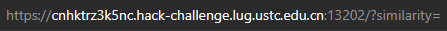

猜测这个 `similarity` 应该是一个百分比，于是直接在后面填上 `100` 刷新，就拿到了 flag。

`flag{welCom3-t0-H4cKERG4M3-4nD-Enj0Y-HacKING-2023}`

动画做的还不错。

## 猫咪小测

**1. 想要借阅世界图书出版公司出版的《A Classical Introduction To Modern Number Theory 2nd ed.》，应当前往中国科学技术大学西区图书馆的哪一层？**

不会，先跳过。

**2. 今年 arXiv 网站的天体物理版块上有人发表了一篇关于「可观测宇宙中的鸡的密度上限」的论文，请问论文中作者计算出的鸡密度函数的上限为 10 的多少次方每立方秒差距？**

直接百度搜索“可观测宇宙中的鸡的密度上限”，跳出来一篇知乎：[你见过哪些极品论文？]([(19 封私信 / 67 条消息) 你见过哪些极品论文？ - 知乎 (zhihu.com)](https://www.zhihu.com/question/20337132/answer/3023506910?utm_source=zhihu))

点进去，就能找到答案：

> 你若问结论，没错，鸡密度函数被他们确定到了上限为 $10^{23}\rm pc^{-3}$，这个数量级听上去也很离谱，不愧是做天文的……

所以答案是 23。

下面就开始搜索第一题的答案，其实第一题答案不可能太大，图书馆不可能有 100 层楼高的，所以直接从 1 开始往上一个个输入提交，输入到 12 的时候出 flag 了。

`flag{WelcoMe-TO-atTENd-tHE-NEKo-3XAm-zo23}`

下面看后两题。

**3. 为了支持 TCP BBR 拥塞控制算法，在编译 Linux 内核时应该配置好哪一条内核选项？**

用万能的谷歌，搜索 `TCP BBR algorithm linux`，然后一篇篇看，能看到一个名为 [How to Boost Linux Server Internet Speed with TCP BBR?](https://www.geeksforgeeks.org/how-to-boost-linux-server-internet-speed-with-tcp-bbr/) 的页面，里面就有答案：`CONFIG_TCP_CONG_BBR`。

**4. 🥒🥒🥒：「我……从没觉得写类型标注有意思过」。在一篇论文中，作者给出了能够让 Python 的类型检查器 ~~MyPY~~ mypy 陷入死循环的代码，并证明 Python 的类型检查和停机问题一样困难。请问这篇论文发表在今年的哪个学术会议上？**

还是使用万能的谷歌，搜索 `mypy infinite loop`，往下翻就能看到一篇论文的链接：[Python Type Hints Are Turing Complete (dagstuhl.de)](https://drops.dagstuhl.de/opus/volltexte/2023/18237/pdf/LIPIcs-ECOOP-2023-44.pdf)，这篇文章中确实讲到了 `mypy` 死循环的问题。文中 Supplementary Material 中写有：Software (ECOOP 2023 Artifact Evaluation approved artifact)，说明会议的名称为 `ECOOP`。

至此，第二个 flag 也就得到了。

`flag{REAl-mA$7eR-of-ThE-neko-ExAM-IN-usTc}`

## 更深更暗

打开网页后一看，太长了，于是我就按下 Ctrl+A 复制粘贴到了 VSCode 里面，结果一粘贴进去就看到了 flag（因为粘贴完之后光标会在最下面）。

`flag{T1t@n_a160ce0cf71be14897500151f1ca89c1}`

好家伙甚至都没有加密。

不过直接在网页上翻应该是翻不到的，因为中间的垃圾信息会越来越长（动态生成的），而且就算翻到了最下面也会很快被刷掉。

## 旅行照片 3.0

### 神秘奖牌

**1、你还记得与学长见面这天是哪一天吗？**

仔细看第二章图片，离相机最近的人胸牌的带子上写有 STATPHYS28。


于是我就在谷歌上搜了一下，找到了活动的主页：[STATPHYS28](https://statphys28.org/)。

主页中有一行：

> Date August 7th-11th, 2023

说明这张照片拍摄的世界肯定是 2023-08-07 到 2023-08-11 之间的某一天，至于具体是哪一天，后面再来暴搜。

**2、在学校该展厅展示的所有同种金色奖牌的得主中，出生最晚者获奖时所在的研究所缩写是什么？**

说实话我平时不怎么看颁奖典礼的，所以我还是把这张图弄到网上搜了一下，才发现是诺贝尔物理学奖的奖牌。

看奖牌下面的名字：M. KOSHIBA，我在谷歌上查询这个名字，并找到了这位诺奖得主：[Masatoshi Koshiba](https://en.wikipedia.org/wiki/Masatoshi_Koshiba)（小柴昌俊），在东京大学，于 2002 年获得诺贝尔物理学奖，则显然奖牌是展示在东京大学的。

然后谷歌搜索诺贝尔物理学奖，在维基百科里面可以找到一个历年诺贝尔物理学奖的列表：[List of Nobel laureates in Physics - Wikipedia](https://en.wikipedia.org/wiki/List_of_Nobel_laureates_in_Physics)。

为了找到同在东京大学的诺奖得主，先在列表中找日本人，发现 2014 年和 2015 年均有日本人获得诺贝尔物理学奖，2014 年获奖的 Hiroshi Amano 出生于 1960 年，2015 年获奖的 Takaaki Kajita 出生于 1959 年。查询 Hiroshi Amano 的资料，发现其并没有在东京大学做研究，而是在 Nagoya University（名古屋大学），所以排除。再查询 Takaaki Kajita 的资料，发现他在东京大学做研究，且还看到了这一句话：

> One of the first people Kajita called after receiving the Nobel Prize was 2002 Nobel physics laureate [Masatoshi Koshiba](https://en.wikipedia.org/wiki/Masatoshi_Koshiba), his former mentor and a fellow neutrino researcher.
>
> 机翻：梶田获得诺贝尔奖后第一批打电话的人之一是 2002 年诺贝尔物理学奖获得者 [Masatoshi Koshiba](https://en.wikipedia.org/wiki/Masatoshi_Koshiba)，他是他的前导师，也是中微子研究员。

这就说明，在东京大学被展出的奖牌中还有一块肯定是他的。而这位梶田隆章获奖时所在的研究所是 [Institute for Cosmic Ray Research](https://en.wikipedia.org/wiki/Institute_for_Cosmic_Ray_Research) (ICRR)。

最后再来暴搜第一题，在输入 2023-08-10 后出现了 flag。

`flag{how_I_wi5h_i_COulD_w1N_A_Nobe1_pri23_078ee4ada5}`

### 这是什么活动？

**3、帐篷中活动招募志愿者时用于收集报名信息的在线问卷的编号（以字母 S 开头后接数字）是多少？**

将第三张图片放到谷歌上搜索，出现了一张很相似的图，标题为“Ueno Park”。


再加上前面得出的日期时 2023-08-10 的结论，在谷歌上搜索 `ueno park aug 10 2023`，第一个网页便是一个活动：[National Plum Wine Festival at Tokyo's Ueno Park Aug. 10 - 13](https://japan.stripes.com/travel/national-plum-wine-festival-tokyos-ueno-park-aug-10-13)，日期也刚好符合。可以断定这个活动就是图中帐篷里的活动。

下面将这个标题 `National Plum Wine Festival at Tokyo's Ueno Park` 继续放到谷歌中搜索，可以搜到一个日本的网站：[https://home.ueno.kokosil.net/en/archives/77158](https://home.ueno.kokosil.net/en/archives/77158)（网站标题太长了就不放了），讲的就是这次活动。网站的最下方写有这样两行：

> We are looking for 420 people! (It will end as soon as the number of people gathers. *First-come-first-served basis)
>
> https://umeshu-matsuri.jp/tokyo_staff/

这一看就是活动在招募志愿者，于是我点进了这个链接，进入了一个全日文的网站，正文的前两行：

> 下記の応募フォームからエントリーしてください。
>
> https://ws.formzu.net/dist/S495584522/

而这个 `S495584522` 刚好与题目中描述的“以字母 S 打头后接数字”对应，于是这肯定就是答案。

**4、学长购买自己的博物馆门票时，花费了多少日元？**

在地图中搜索 `Ueno Park`，找到这个公园所在的位置，这个水池的形状与图片中完全吻合。

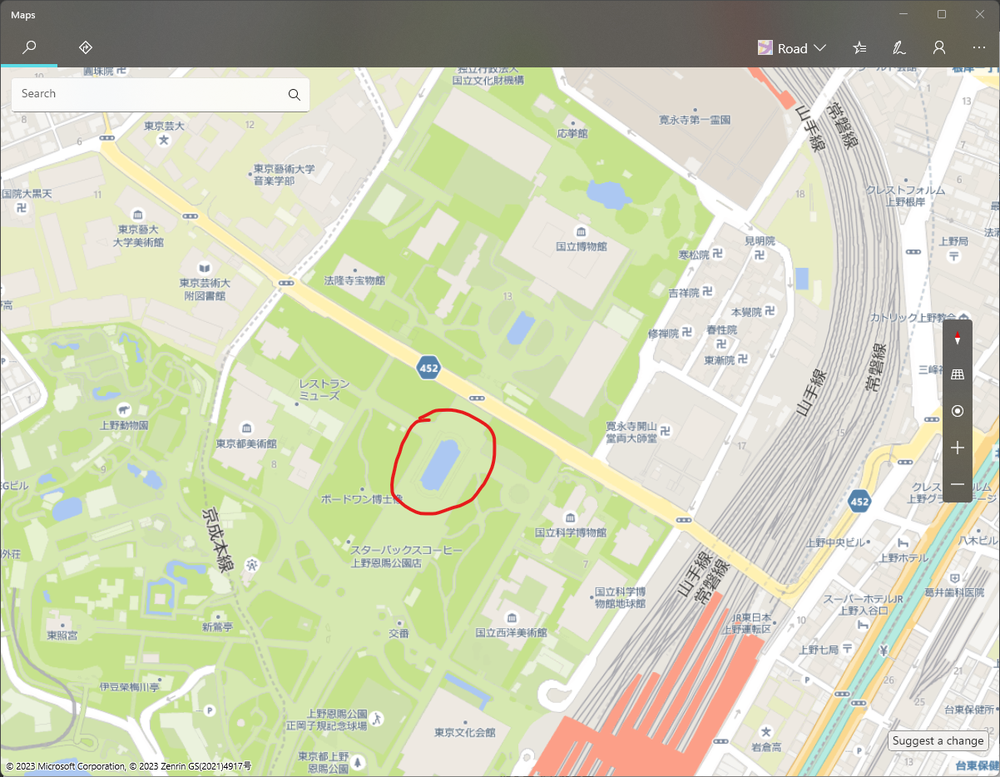

而在路对面，是东京国立博物馆。网上搜索东京国立博物馆，进入其官网可以看到票价：

> 成人：1000 日元
>
> 大学生：500 日元
>
> 中小学生、未成年人以及老年人：免费

然后我试了一下 1000 和 500，都不对，我还怀疑是不是我找错了，直到我输入了一下 0，结果对了......

哦原来是苕皮啊！

 `flag{PluM_w1NE_1S_rEa1LY_EXpen5iVE_81da1627d3}`

### 后会有期，学长！

**5、学长当天晚上需要在哪栋标志性建筑物的附近集合呢？**

谷歌搜索 `statphys28 time table`，可以进入一个官网的网页，是活动的时间表，其中 8 月 10 日晚上是 Banquet：


在网站中点击 Events -> Banquet，可以看到这次 Banquet 是在一艘船上吃晚饭。下面有 Meeting Point 说明：

> 6:00pm, August 10th (Thursday) all the participants must gather on time South side of Yasuda Auditorium (see the map below)

其中 Yasuda Auditorium 翻译过来是“安田讲堂”，故这就是答案。

**6、进站时，你在 JR 上野站中央检票口外看到「ボタン＆カフリンクス」活动正在销售动物周边商品，该活动张贴的粉色背景海报上是什么动物？ 在出站处附近建筑的屋顶广告牌上，每小时都会顽皮出现的那只 3D 动物是什么品种？**

谷歌图片搜索 `ボタン＆カフリンクス 上野`，可以找到这样一张图：


上面的动物是**熊猫**。

而后面那一问看上去有点困难，但是每小时出现，还是 3D 动物，这样的特征并不常见，于是谷歌搜索 `日本 广告牌 每小时出现 动物`，下面有一篇知乎：[巨型秋田犬引热议！裸眼3D化身广告牌新流量密码？](https://zhuanlan.zhihu.com/p/553993484)

点进去，可以看到每隔一小时这只秋田犬就会在涩谷站前的多座大厦顶部的广告牌中出现。再加上任天堂刚好就在涩谷站附近，所以可以确定这只动物就是**秋田犬**。

提交即可得到 flag：

` flag{Un7I1_W3_M337_A64iN_6oODByE_S3n1OR_6627f51d7c}`

## 赛博井字棋

理论上这个 AI 应该是无法被击败的（而且一个无法被击败的井字棋 AI 实现起来不难），所以只能通过其他方法来 hack 进这个网页。

首先看网页的源代码，点击的功能是在 `script.js` 中实现的，而关键的函数是 `setMove`。这个函数会发送一个 POST 到服务器，然后获取服务器返回的结果。

而这个函数是定义的 `async`，也就是说，如果同时运行多个 `setMove` 函数，可能会导致冲突，从而可以一次走两步。于是我便做了这么一个尝试，在 F12 的终端里输入这段代码：

```js
setMove(0, 0); setMove(0, 1); setMove(0, 2)
```

运行，没反应。但是点一下中间这一格，可以看到棋盘变成了这样：


也就是说，我连走了两步，AI 只走了一步，下一步又轮到我了，那就简单了，点一下左下角，就赢了。

`flag{I_can_eat_your_pieces_92604138d1}`

## 奶奶的睡前 flag 故事

这题唯一有用的就是这张图片，将这张图片下载下来，然后用 `pngcheck` 进行检查：

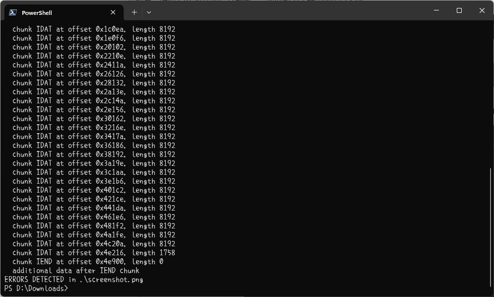

可以看出，程序报错了，错误信息是 `IEND` 之后有多余内容。

之后通过在二进制编辑器中检查文件，发现 `IEND` 之后还有一堆东西，而且之后还有不少 `IDAT`，在文件结尾甚至还有一个 `IEND`。这就说明，应该一个图片文件被另一个图片文件覆盖了。之后我尝试了很多种方法，去破解这个被覆盖的部分，但是都没有用。

然后我就看到题目中这个谷歌“亲儿子”，而且系统都没升级，看来应该是手机相册的 bug 导致的。而这个谷歌的亲儿子，大概率就是 Google Pixel 手机。

然后我就在谷歌上面搜 `google pixel bug photo`，然后就找到了这篇文章：[Google Pixel photo edit bug puts phones dangerously at risk — update yours now](https://www.tomsguide.com/news/google-pixel-photo-edit-bug-puts-phones-dangerously-at-risk-update-yours-now)。文章中明确说明了 Google Pixel 手机中编辑照片时的 bug，使得被编辑过的图片可以被还原回原图，并且提到了一个网站：acropalypse，于是我在谷歌上搜索，找到了这个网站，正是用于还原图片的。

鉴于题目中说是老手机，型号这里我就选了 Pixel 3。然后将图片放进去，得到了如下的输出图片：


`flag{sh1nj1ru_k0k0r0_4nata_m4h0}`

评价为：好题！

## 组委会模拟器

这题又是一个拼反应速度的题，和去年的 Xcaptcha 有点类似。当然这种题不可能真的靠手速来点的。

打开题面，进入 F12，可以看到每条消息都是一个 `<div>` 块。但是这些块没有 `id`，其上一层和上两层都没有 `id`，只有上面第三层有个 `id="app"`，于是就可以通过先 `app = document.getElementById('app')` 然后访问 `app.childNodes[0].childNodes[1].childNodes[i]` 来访问消息。注意用这种方式访问消息时 `i` 是从 2 开始的（0 和 1 都不是消息），所以范围是 2 到 1001。

接着去测试如何点击这条消息，直接对这个 `<div>` 来 `click` 肯定是不行的，只有点一个子元素 `<div class="fakeqq-message__bubble">` 才能达到效果。于是就可以写出这样一个程序来进行点击：

```js
app = document.getElementById('app')

for (var i = 2; i < 1002; ++i) {
    if (app.childNodes[0].childNodes[1].childNodes[i].childNodes[0].childNodes[1].childNodes[1].textContent.search(/hack\[[a-z]+\]/) != -1) {
        app.childNodes[0].childNodes[1].childNodes[i].childNodes[0].childNodes[1].childNodes[1].click()
        console.log("processed " + i)
    }
}
```

但是这个网页中消息是一条条发的，而不是一起发的，如果在所有消息都发完后再运行这段代码，前面的消息就超时了，所以必须加入一个定时，一打开网页就开始运行程序，然后每 200ms 运行一次（服务器那边也有延迟，如果时间差比较大的话还是会有超时的可能性）。修改过的代码如下：

```js
app = document.getElementById('app')

function tryit() {
    for (var i = 2; i < 1002; ++i) {
        try {
            if (app.childNodes[0].childNodes[1].childNodes[i].childNodes[0].childNodes[1].childNodes[1].textContent.search(/hack\[[a-z]+\]/) != -1) {
                app.childNodes[0].childNodes[1].childNodes[i].childNodes[0].childNodes[1].childNodes[1].click()
                console.log("processed " + i)
            }
        }
        catch (e) {
        }
    }
    time = new Date().getTime();
    while (new Date().getTime() < time + 200) ;
    requestAnimationFrame(tryit)
}
requestAnimationFrame(tryit)
```

这里用 `requestAnimationFrame` 是为了让页面不要卡死（因为我就卡死过一次页面）。

经历了两分钟左右的等待后，就能看到 flag 了。

`flag{Web_pr0gra_mm1ng_fd3e266fb1_15fun}`

## 虫

这题的题目中有个提示：接收来自国际空间站的图片。于是就在网上搜怎样接收来自国际空间站的图片，找到一篇文章：[如何接收来自ISS空间站发的图片|卫星|宇航员|手机|iss_网易订阅 (163.com)](https://www.163.com/dy/article/FJM0JILK0531B2T9.html)。文章中提到了一个软件：MMSSTV，于是就把这个软件下载下来打开，然后播放题目中下载的音频，软件中就出现了 flag 的图片：

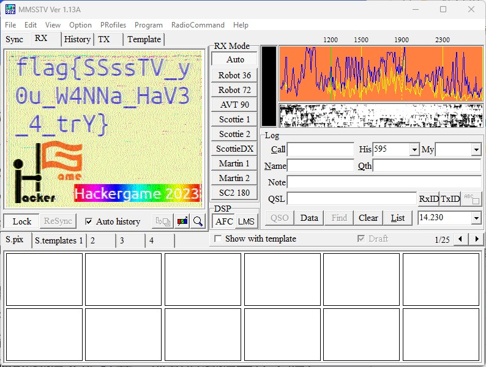

`flag{SSssTV_y0u_W4NNa_HaV3_4_trY}`

## JSON ⊂ YAML?

### JSON ⊄ YAML 1.1

还是使用谷歌，搜索 `yaml json compatibility`，下面有一篇文章：[JSON is not a YAML subset](https://john-millikin.com/json-is-not-a-yaml-subset)，很详细的解释了 JSON 和 YAML 1.1 的区别，最主要的区别就是 YAML 1.1 不支持 `1e2` 这样的浮点数，而是会当作字符串来处理（可能是个 bug？），所以使用这样的代码就可以让 JSON 和 YAML 输出不同结果了：`{"a": 1e2}`。

`flag{faf9facd7c9d64f74a4a746468400a5052699246b7}`

### JSON ⊄ YAML 1.2

下面我们要把 `ruamel.yaml` 给 hack 掉，这种事情靠我一个人肯定是无法解决的，肯定需要靠群众的智慧，所以我去 SourceForge 上去找了这个项目的 Ticket（相当于 GitHub 中的 Issue）。

然后虽然我没找到和这个直接相关的 ticket，但是当我看到这个 ticket：[#409 Ruamel.yaml comsiders two merge keys as a duplicate key](https://sourceforge.net/p/ruamel-yaml/tickets/409/)，里面提到有个 `DuplicateKeyError`，于是我就突然受到了启发：

> 如果 JSON 里面有重复的键，那是不是就会出现 JSON 可以读取但是 `ruamel.yaml` 会报错的情况呢？

于是就设计了一个很简单的代码 `{"a": "b", "a": "c"}`，测试了一下，果然可以：JSON 和 YAML 1.1 会直接用后面的覆盖前面的，而 YAML 1.2 会报错。

`flag{b1c73f14d04db546b7e7e24cf1cc72523d5ecfbe07}`

## Git? Git!

百度搜索 Git 恢复撤销的内容，就可以找到这篇文章：[Git已经在本地提交过文件了，但又给撤销了，恢复已经撤销的内容](https://blog.csdn.net/qq_45094682/article/details/130981549)。按照文章的指示，输入 `git reflog`，可以看到中间撤回了一个 `505e1a3`。

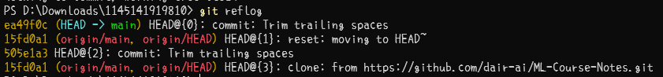

下面使用 `git reset 505e1a3`，此时会显示 Unstaged changes after reset 表示撤回成功了，但是在文件中并不能看到 flag，而此时如果再使用 `git diff`，就可以看到了。

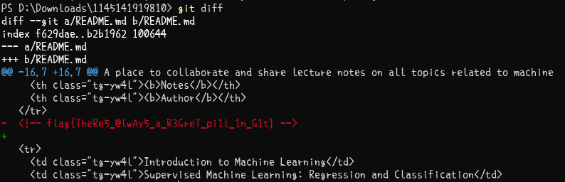

`flag{TheRe5_@lwAy5_a_R3GreT_pi1l_1n_G1t}`

## HTTP 集邮册

### 5 种状态码

首先，正常的请求，返回 200，第一种。

脸滚一些字符进去，让格式错误，返回 400，第二种。

改成 `HTTP/2`，返回 505，第三种。

在 `/` 后面随便输入一些东西，变成不存在的路径，返回 404，第四种。

`GET` 换成 `POST`，返回 405，第五种。

`flag{stacking_up_http_status_codes_is_fun_b18ddc5ab6}`

### 没有状态……哈？

说实话这个我也不知道是什么情况，我当时只是随便试，然后把 `HTTP/1.1` 去掉，就弄出来了。

好像是在 HTTP 1.0 出现之前，还都是通过 HTML 直接返回错误码的，所以响应结果也就没有头部，而是直接一个 HTML。（这只是我的猜测）

`flag{congratu1ations you discovered someth1ng before http1.0}`

### 12 种状态码

在 `GET /` 后面加入数百万个字符，返回 414，第六种。

改成 `POST` 请求，`Content-Length` 填一个大数字（如 1145141919810），返回 413，第七种。

下面两个东西需要查阅 Nginx 的源代码。

加入一行 `Transfer-Encoding`，后面的东西任意，返回 501，第八种（好像 501 也只有这种触发方案，这也必须从源代码中找）。

加入一行 `If-Unmodified-Since: 1 Jan 2023`，这里的日期可以换成其他较早的日期，返回 412，第九种。

到这里的时候，源代码已经无法给我任何更多信息了。不过从计网课上我了解到有一种 304 状态码，我还试了一下加一行 `If-Modified-Since` 发现不行，不过我认为这个东西并不是不能触发，而是禁用了这种触发方法。所以我就查了一下还有没有别的方案，再结合我之前的计网实验报告，找到了下面这种触发方案：

加入一行 `If-Unmodified-Since: Tue, 31 Oct 2023 14:01:51 GMT`（从下面复制的时间），再加入一行 `If-None-Match: `，后面接上 ETag，返回 304，第十种。

最后这个是我试出来的，我到 nginx 的源代码中去找每一行开头有哪些可能，然后找到了一个 Range，搜索得到这个 Range 确实可以返回两种和之前完全不一样的状态码，试了一下，果然可以：

加入一行 `Range: bytes=0-1`，返回 206，第十一种。

加入一行错误的 Range：`Range: bytes=-0`，返回 416，第十二种。

`flag{I think that when many such status codes are accumulated 1c55dbbfe8 it becomes a lifetime}`

## Docker for Everyone

首先，在这个 docker 容器中，几乎没什么权限，所以要想获得权限，必须要逃逸出去，获得容器外的权限。

查询 docker 逃逸的方法，在[宸极实验室—『杂项』Docker 逃逸方法汇总](https://zhuanlan.zhihu.com/p/614513965?utm_id=0)这篇文章中，提到了 Docker Socket 逃逸的各种方法，检测发现对面的 docker 并没有启用 `--privileged`，所以不能使用 privileged 特权模式进行逃逸。

而下面又提到了一种挂载 Docker Socket 逃逸的方法，运行 `find / -name docker.sock`，在一大堆 Permission denied 当中，果然找到了 `/run/docker.sock` 的身影。

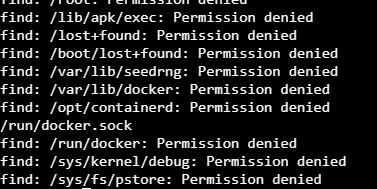

再加上之前测试过这个容器中已经安装了 docker，就可以开始进行逃逸了。按照文中的指示，运行 `docker -H unix:///var/run/docker.sock run -v /:/test -it alpine:latest /bin/sh`，可以成功进入一个终端，进入 `test` 目录后 `ls`，可以看到和 docker 容器中相同的结构，但是此时运行的权限已经不再是 docker 内用户的权限了。

直接打开 `flag` 文件发现打不开，用 `ls -l` 发现 `flag` 是一个链接，指向了 `/dev/shm/flag`，运行 `cat dev/shm/flag`，即可看到 flag 的内容。

`flag{u5e_r00t1ess_conta1ner_e1d5e4a699_plz!}`

## 惜字如金 2.0

> 说实话我第一眼并没有看出来 referer 这个词有什么问题

把程序下载下来之后打开，按照程序的说明，`cod_dict` 中加入的每一条字符串的长度都应该是 24，而实际的长度都是 23，说明每条字符串都被压掉了一个字符。

再来看对 flag 的描述：flag 以 `flag{` 开头，以 `}` 结尾，而加密的数组以 `53, 41, 85, 109, 75` 开头，以 `28` 结尾。下面对其进行一一对应（行列下标均为 0 开头）：

+ 53 位于第 2 行第 5 列，而这个位置并不是 `f`，而上一个位置是 `f`，故前面有一个字符被删掉了，随便在前面重复一个字符；
+ 41 位于第 1 行第 17 列，这个位置就是 `l`，故删掉的字符在后面，末尾加个 `e`；
+ 85 位于第 3 行第 13 列，这个位置就是 `a`，其前面一个位置也是 `a`，故删掉的字符位置不确定，先不管；
+ 109 位于第 4 行第 13 列，这个位置不是 `g`，而上一个位置是 `g`，故删掉的字符在前面，随便在前面重复一个字符；
+ 75 位于第 3 行第 3 列，这个位置不是 `{`，而上一个位置是，故删掉的字符在前面，随便在前面重复一个字符；
+ 28 位于第 1 行第 4 列，前面已经判断过该行了。

剩下的第 0 行还没确定，可以通过下面的方式进行确定：第 0 行中有个 `}`，如果在 `}` 之前加入一个字符的话，则生成的字符串中间会有个 `}` 字符，这也是不合法的，所以第 0 行删掉的字符在后面，在结尾加个 `e`。

将代码中其他的语法错误修一修，再运行代码，就可以得到 flag：

`flag{you-ve-r3cover3d-7he-an5w3r-r1ght?}`

## 🪐 高频率星球

把文件下载下来，一打开，一堆乱七八糟的格式，不看。

但是题目中有提示，是用 asciinema 录制的，所以把 asciinema 下载下来，然后运行，就可以看到和题目中一样的效果。

下面要看代码，所以需要把输出的东西导出来，使用 `asciinema play asciinema_restore.rec > code.js`，等一段时间后程序运行结束，打开 `code.js`，即可看到所有的代码，以及一部分无关内容。对于开头和结尾的那些无关内容，直接删掉即可。但是文件中间也会有一些无关内容，像这样：

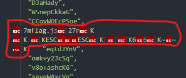

使用正则表达式替换，里面所有的控制字符都用 `.` 来代替，第二行内容不完全一致，那就把后面有不同的地方用 `.+` 代替。最终的正则表达式如下：`(:?.\[.+\n.\[K .\[.+\n.\[K)`。替换为空之后，运行代码，即可得到 flag：

`flag{y0u_cAn_ReSTorE_C0de_fr0m_asc11nema_3db2da1063300e5dabf826e40ffd016101458df23a371}`

## 🪐 小型大语言模型星球

### You Are Smart

这个只能靠慢慢试，我也试了很多种方法，诱导 AI 说出这句话，但是这个 AI 也很聪明，知道我在诱导，于是故意不说。直到我发了个问：`Am I smart?`

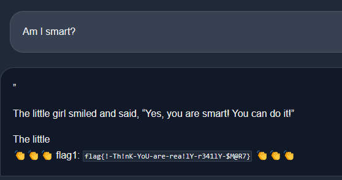

然后就成功了。

`flag{!-Th!nK-YoU-are-rea!lY-r341lY-$M@R7}`

### Accepted

这题有个提示很关键，只能输入 7 个字符，而 7 个字符是基本上无论如何都无法表达出有意义的信息的（甚至 `accepted` 单词本身都有 8 个字符了）。

但是我发现，脸滚键盘输入几个字符进去，也能输出一串有意义的内容，而且就像随机种子一样，输入相同的字符串进去输出总是相同的。而且，accepted 是一个英文单词，所以词库里面肯定是有这个词的，而在某些情况下 AI 就会调用这个词输出。

因此，我就把程序下载到了本地，并且修改了一下代码，不断生成长度为 7 的字符串，放进 AI 获取输出，检查输出中是否含有 `accepted`。暴搜的过程很漫长也很费 CPU（12 个逻辑处理器全部 100%），大概搜了一个多小时，搜索了 1.5w 个左右的字符串，终于找到了一个字符串能让 AI 输出 `accepted`：`weqkmUr`。

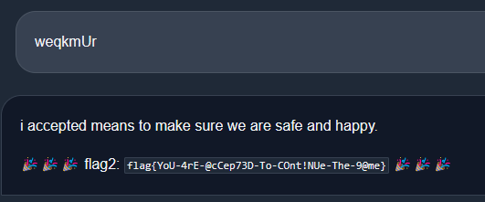

`flag{YoU-4rE-@cCep73D-To-COnt!NUe-The-9@me}`

## 🪐 流式星球

看一眼代码，这个二进制文件生成的方式非常简单，甚至 naive：直接把每一帧每一行每一列的像素点的 RGB 值依次排列，最后删掉若干个字符。也就是说，我们现在只是不知道图片的宽度和高度，只要知道了这个，就可以把视频基本生成出来。

使用 114 作为宽度和高度（homo 特有的），用如下代码生成一张图片：

```python
from PIL import Image

wid = 114
hei = 114
img = Image.new('RGB', (wid, hei), color='white')

with open("video.bin", "rb") as vid:
    for i in range(hei):
        for j in range(wid):
            chr = ord(vid.read(1))
            chg = ord(vid.read(1))
            chb = ord(vid.read(1))
            img.putpixel((j, i), (chr, chg, chb))
    img.save(f"test.png", format='png')
```


图片中这些白线对的很齐，中间隔着两三排，于是猜测宽度应该不大。将宽度从 200 到 500 分别生成一张图片，高度还是 114：

```python
from PIL import Image

hei = 114

for wid in range(200, 500):
    img = Image.new('RGB', (wid, hei), color='white')
    with open("video.bin", "rb") as vid:
        for i in range(hei):
            for j in range(wid):
                chr = ord(vid.read(1))
                chg = ord(vid.read(1))
                chb = ord(vid.read(1))
                img.putpixel((j, i), (chr, chg, chb))
        img.save(f"test/{wid}.png", format='png')
        print(wid)
```

然后一张张看过去（看文件资源管理器中的缩略图），终于在 `427.png` 发现了最正常的一张：


这说明图片的宽度就是 427，但是高度还不能确定。将高度设置为 1145，导出一张图片：


发现图片中有了多余的部分，上下两部分有明显的分界线，说明高度小于 1145。将图片导入画图中，将下面多余的部分裁剪掉，看到分辨率为 `427 x 759px`，说明高度是 759。


接着计算帧数，已知一帧的大小为 $427\times 759\times 3=972279$ 字节，而 bin 文件的大小为 135146688 字节，两者相除略小于 139，去掉最后不完整的一帧，导出前 138 帧：

```python
from PIL import Image

wid = 427
hei = 759

with open("video.bin", "rb") as vid:
    for fr in range(138):
        img = Image.new('RGB', (wid, hei), color='white')
        for i in range(hei):
            for j in range(wid):
                chr = ord(vid.read(1))
                chg = ord(vid.read(1))
                chb = ord(vid.read(1))
                img.putpixel((j, i), (chr, chg, chb))
        img.save(f"test/{fr}.png", format='png')
        print(fr)
```

等待导出完之后，打开中间的一帧，就可以看到 flag 了：


`flag{it-could-be-easy-to-restore-video-with-haruhikage-even-without-metadata-0F7968CC}`

## 🪐 低带宽星球

### 小试牛刀

要将图片压缩到 2048 字节以下，直接用 ffmpeg 或者 Photoshop 保存都不行。在谷歌上搜索 png 图片压缩，进入这样一个网站：[TinyPNG – Compress WebP, PNG and JPEG images intelligently](https://tinypng.com/)。将文件放进去，成功的将图片压缩到了 1341 字节。

`flag{justfind_an_image_compressor_andgo!}`

## 为什么要打开 /flag 😡

### LD_PRELOAD, love!

题目提示了 LD_PRELOAD，查询得知，这是一种应用程序代码注入的方式。而再查看注入的代码，发现这个代码几乎把所有系统函数全部禁用了。那么就只能在编译的时候把这玩意弄死。

谷歌搜索 `how to disable ld_preload when compiling`，第一条是 Stack Overflow，点进去，下面有个回答，其中有一句话：

> *If I compile the binary statically, I heard that LD_PRELOAD will not work, right?*

下面作者写 that is basically true。于是我就在编译的时候加了一个 `--static`，提交，成功。

`flag{nande_ld_preload_yattano_86213aec9f}`

猜测是因为编译时加上 `--static` 后，编译器就会把库函数给写入可执行文件中，而不是进行系统调用，从而让 LD_PRELOAD 的注入失效。（没学过编译原理，不清楚）

## 异星歧途

我是周五晚上开的这个题，当时开的时候已经晚上十点了，宿舍十二点断电，而我用的是台式机，所以其实留给我的时间并不多了。

文档没怎么看，直接下了个游戏打开，然后把存档加载进去。

首先看这一块乱七八糟的东西：

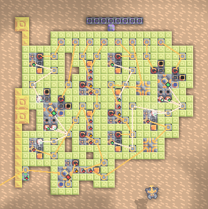

事实上这个东西开关的功能不难理解，一个开关对应一个电力源，然后中间那些乱七八糟的东西大概就是各种逻辑门，比如说：

+ 非门


+ 与门


+ 与非门


然后就根据这些来拨开关就行了，目标是让左下角那个变绿，最终的开关序列为 `01110111`。

下面是这一块非常离谱的东西：


本来以为也像刚才一样每个开关拨一拨试试，看看各是什么功能，结果发现我 naive 了……这玩意会炸！我打开了一下 8 号开关，然后这玩意炸了，这一炸就得全部重来。

之后我发现，两个反应堆里面可以注入冷冻液，发电的过程中冷冻液会消耗，而消耗完之后就会急剧发热，然后爆炸。至于冷冻液怎么来，可以看到旁边有个冷冻液混合器，让这玩意开始工作就行了。之后通过测试其他开关发现，5 号开关能启用混合器，而 6 号开关能让混合器开始工作，同时拉下这两个开关，冷冻液就能进入反应堆。

之后发现 4 号和 8 号开关会让反应堆中的冷冻液往外漏，这肯定不行，所以 4 和 8 不能按。2 号开关会让制造冷冻液的钛无条件销毁，也不能按。3 号开关会直接关闭反应堆，也不能按。

1 号开关可以控制钍有序流进反应堆，需要打开（不然反应堆没用燃料），然后 7 号开关控制的是上面两个熔毁，这玩意我也不知道是干啥的，但是打开之后过一段时间冷冻液就会减少，所以也不能按。最终被按下的是 1、5、6 三个开关，序列为 `10001100`。

接下来是左边这两块：

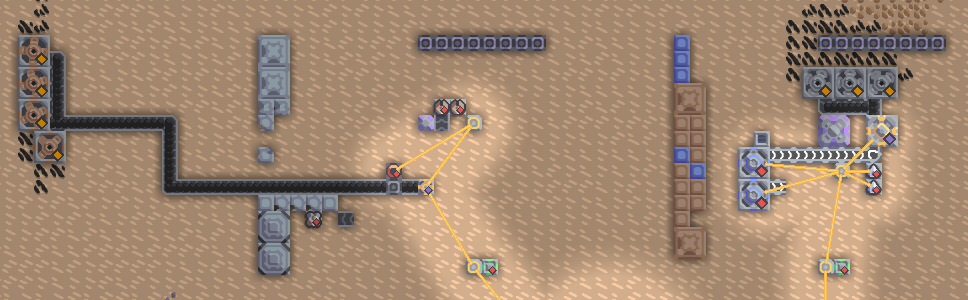

这两块最神奇的地方就在于，我按下其中任何一个开关，但是看不到任何反应（除了右边这块的 8 号开关会让反应堆炸掉）。这块我卡了挺长时间的，然后我就去看文档，发现里面有个 Logic 的功能，而这个功能是通过一个叫“逻辑处理器”的东西实现的。我就在游戏中找逻辑处理器，还真的在两边各找到了一个：

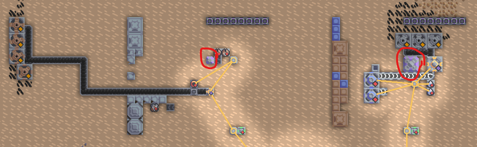

点开左边这个，发现按下的开关序列已经由一大堆 if 硬编码了：


但是这些 if 跳到的地方是设置为 0，所以必须要让这些 if 全部不满足，即开关序列为 `10100101`。

进入第二个处理器，代码变得复杂了起来，有了一大堆运算符。导出这段代码，通过正则表达式替换的方式将其替代成等效的 C 代码：

```c
int t, number, fl0, fl1, fl2, fl3, en, i;
t = sw[1] << 7;
number = t;
t = sw[2] << 6;
number = number + t;
t = sw[3] << 5;
number = number + t;
t = sw[4] << 4;
number = number + t;
t = sw[5] << 3;
number = number + t;
t = sw[6] << 2;
number = number + t;
t = sw[7] << 1;
number = number + t;
t = sw[8];
number = number + t;
en = 0;
i = 0;
erliu:; if (i >= 16) goto sansan;
fl0 = i * i;
if (fl0 != number) goto sanyi;
en = 1;
goto sansan;
sanyi: i = i + 1;
goto erliu;
sansan: fl1 = (0 == sw[1]);
fl2 = (0 == sw[6]);
fl3 = fl1 | fl2;
if (fl3 == 0) goto sanba;
en = 0;
sanba:; return en;
```

下面对所有开关状态进行枚举，从 0 到 255，依次通过上面的代码进行测试：

```c
for (int i = 0; i <= 255; ++i) {
    int sw[9];
    for (int j = 0; j < 8; ++j) sw[j + 1] = ((i >> j) & 1);
    if (judge(sw)) printf("%d\n", i);
}
```

运行代码，输出 `35`，二进制为 `8'b00100011`，将其反转（低位在前高位在后），得到开关序列 `11000100`。

综上，总的开关序列为：`10100101110001001000110001110111`。提交得到 flag：

`flag{B34WarE_0f_#xp1osi0N_743dad3354}`

做完这个之后时间已经到了 23:45，时间还是非常紧张的，不过最后好在完成了。最终的得分是 4000 分，校内排名 25 名。

一周的作业一个字没动，不说了，赶 ddl 去。
