# 旧日之痕

观察出题脚本，随机生成字符串后，opt指定llvm-pass，字符串作为参数后生成bc文件，bc编译出程序

需要分析libbw.so中传入字符串后干了什么

搜索字符串 watermark ,看到有相关调试信息

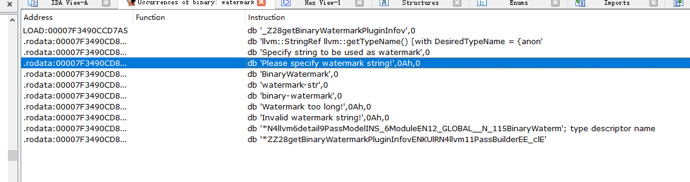

找到相关代码

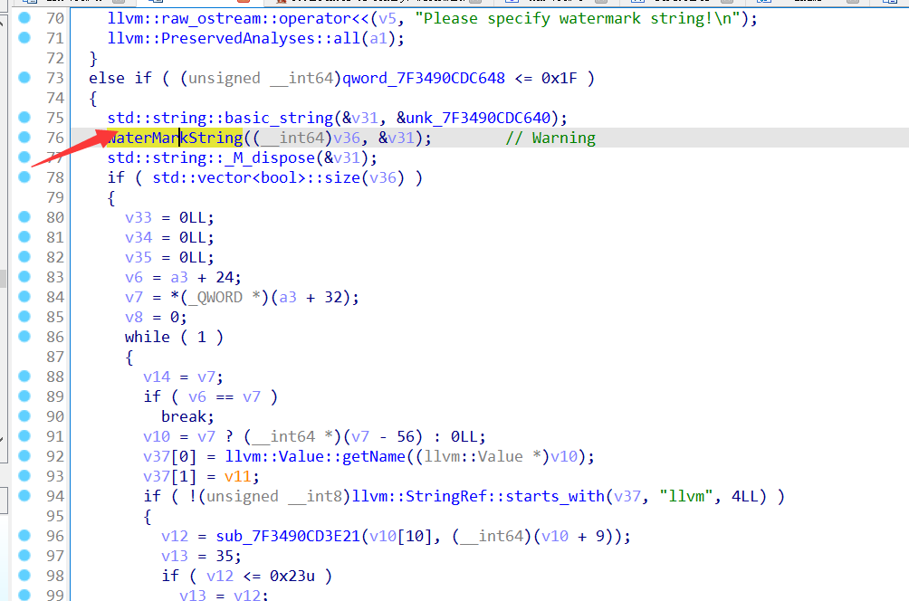

1.查表替换，范围在0x00-0x3f

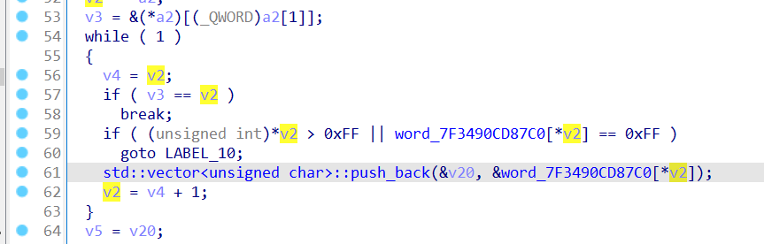

2.替换后转成一个个bool，并push，计算奇偶

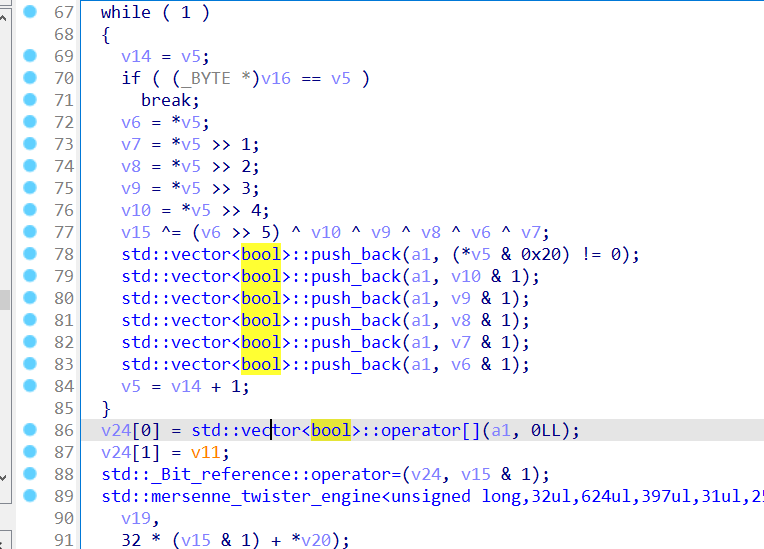

3.调试发现，将长度放到开头，并根据奇偶结果调整

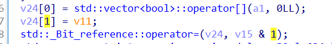

4.默认mersenne_twister随机数，seed为长度值 + 32 * 奇偶校验结果

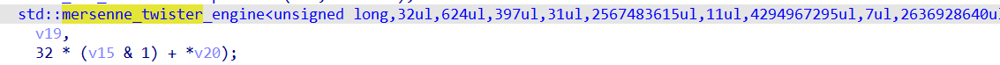

5.shuffle，打乱bit数组，从第6位开始（这个M_incr难以看出，需要一点感觉，实际上就是  `std::shuffle(v.begin()+6, v.end(), gen32);`  ）

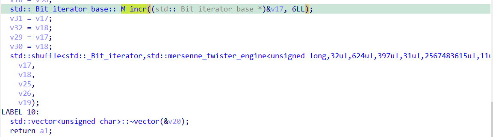

函数结束，得到了一串01序列（在内存中还是以byte形式表示的，难以辨认）

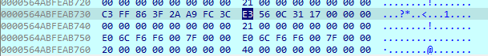

下硬件断点

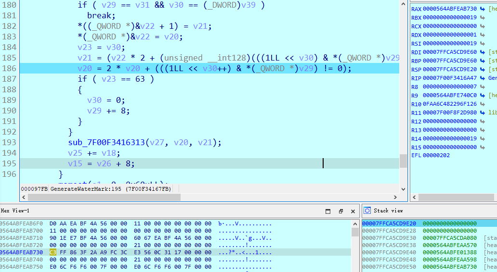

单步跟下去，进入到下面的函数里

循环除法操作，模数从1到N，每次+1

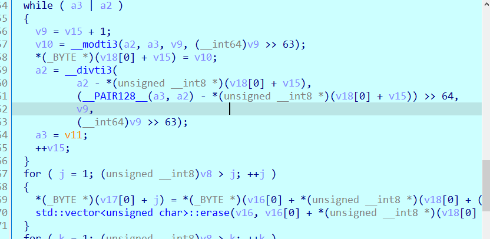

观察到是0-0xB的一种排列

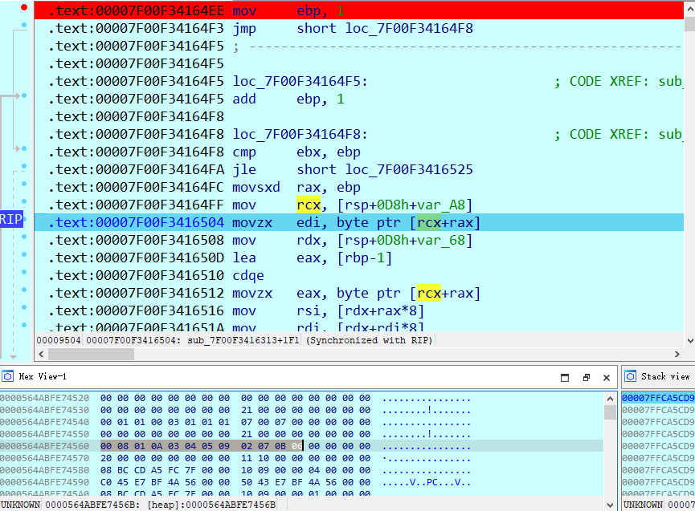

然后进行 BasicBlock::moveAfter 移动基本块的操作

重复这样的函数4次，程序结束

生成1份原版文件，与加了watermark后的文件对比

发现程序执行会有多余的跳转

原版程序的流程图

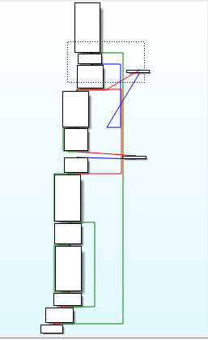

加入水印后（附件 2）

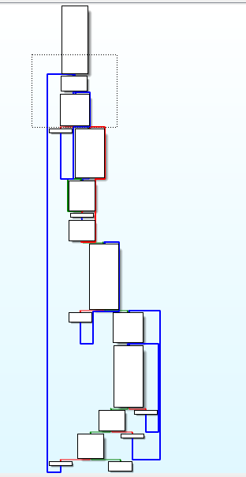

按照执行顺序标记好Block后，发现加了水印的块并不是按照代码偏移顺序往下，是打乱的

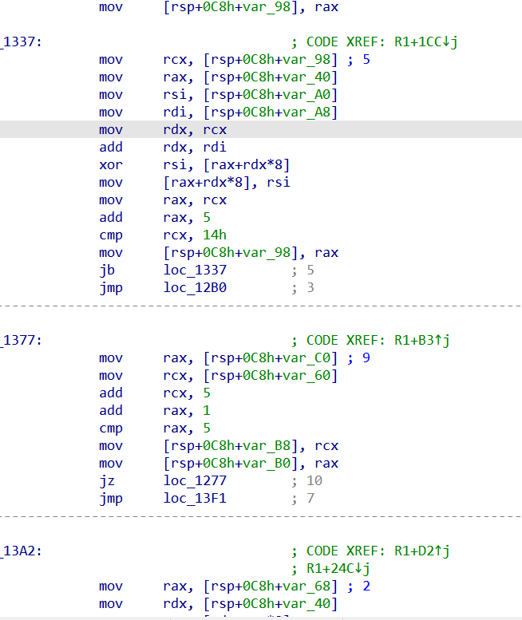

手动标记5个函数中的基本块，得到顺序（2 号文件）

```python
[0,8,1,10,3,4,5,9,2,7,11,6,],
[0,3,4,2,1,5],
[0,1,5,4,2,3,6],
[0,2,4,1,5,3],
[0,1,2,3,4,5,6,7,8,9,10,11,12,13,14,15,19,26,18,29,32,28,25,30,34,24,20,27,31,17,22,33,16,21,23],
```

还原对应数字,并根据shuffle还原

```python
ORDER = [
[0,8,1,10,3,4,5,9,2,7,11,6,],
[0,3,4,2,1,5],
[0,1,5,4,2,3,6],
[0,2,4,1,5,3],
[0,1,2,3,4,5,6,7,8,9,10,11,12,13,14,15,19,26,18,29,32,28,25,30,34,24,20,27,31,17,22,33,16,21,23],
bytes.fromhex("00 04 06 09 0B 0A 08 07 02 03 05 01"),
bytes.fromhex("00 02 05 03 04 01 "),
bytes.fromhex("00 01 06 02 04 05 03 "),
bytes.fromhex("00 01 04 05 03 02"),
bytes.fromhex("00 01 02 03 04 05 14 10 11 09 20 0C 0D 0A 08 15 12 1C 0E 07 1B 13 0B 06 18 16 19 21 1E 0F 1D 1F 1A 17 22")
]

import math

def calcOrder(Order):
    O = [i - 1 for i in Order[1:]]
    normal = [i for i in range(len(O))]
    count = len(O)
    num = 0
    for i in range(count):
        idx = normal.index(O[i])
        num += idx
        normal.pop(idx)
        if(len(normal) != 0):
            num *= len(normal)
    print(hex(num))
    return num
s = ""
num = 0
num = calcOrder(ORDER[0])
s = s +bin(calcOrder(ORDER[0]))[2:].zfill(0x19)
s = s +bin(calcOrder(ORDER[1]))[2:].zfill(0x6)
s = s +bin(calcOrder(ORDER[2]))[2:].zfill(0x9)
s = s +bin(calcOrder(ORDER[3]))[2:].zfill(0x6)
s = s + '0' +bin(calcOrder(ORDER[4]))[2:].zfill(0) 
# s+="110"
ss= s.ljust(32*6+6,"0")
print(ss)
#16-32
B = []
sss=""
for i in range(len(ss)//8):
    sss+=ss[8*i:8*i+8][::-1]
    B.append(int(ss[8*i:8*i+8][::-1],2))
    
print(bytearray(B).hex())


print(ss)
SH=[
0,1,2,3,4,5,76,69,58,86,55,99,92,98,36,74,17,94,96,33,7,81,66,59,38,26,50,51,67,8,79,45,49,62,18,84,29,88,77,90,21,71,87,14,57,56,10,31,83,100,12,23,40,73,70,46,22,47,80,72,48,11,95,78,35,75,42,15,60,6,89,64,68,28,82,30,52,24,91,54,44,53,37,97,41,65,16,63,61,27,9,93,20,19,13,32,101,43,25,85,34,39,
]
ssss = [0 for _ in range(6*16+4)]
for i in range(16*6+4):
    ssss[i] = ss[SH[i]]
print(ssss)

ssss+=['0' for _ in range(18)]
print("".join(ssss))
for i in range(len(ssss)//6+1):
    num6 = "".join(ssss[i*6:i*6+6])
    if(num6==''):
        break
    print(hex(int(num6,2)),",",end='')
print()
print("".join(ssss))
```

```C++
#include <algorithm>
#include <iostream>
#include <iterator>
#include <random>
#include <vector>
#include<stdio.h>
#include<string.h>
const unsigned char T[]={
0xff,0xff,0xff,0xff,0xff,0xff,0xff,0xff,0xff,0xff,0xff,0xff,0xff,0xff,0xff,0xff,
0xff,0xff,0xff,0xff,0xff,0xff,0xff,0xff,0xff,0xff,0xff,0xff,0xff,0xff,0xff,0xff,
0xff,0xff,0xff,0xff,0xff,0xff,0xff,0xff,0xff,0xff,0xff,0xff,0xff,0xff,0xff,0xff,
0x39,0x14,0xff,0x04,0x0b,0x2d,0x26,0x2b,0x38,0x27,0xff,0xff,0xff,0xff,0xff,0xff,
0xff,0x06,0x24,0x29,0x3f,0x0c,0x15,0x3a,0x0a,0x28,0x21,0x3b,0x36,0x0f,0x03,0x1f,
0x05,0x2f,0x19,0x3d,0x02,0x1a,0x22,0x09,0x35,0x12,0x01,0xff,0xff,0xff,0xff,0x1d,
0xff,0x37,0x00,0x32,0x08,0x2e,0x11,0x13,0x23,0x07,0x3e,0x34,0x10,0x3c,0x20,0x2c,
0x0d,0x16,0x2a,0x33,0x25,0x1e,0x18,0x30,0x17,0x0e,0x1b,0x31,0xff,0x1c,0xff,0xff
};

void burteOrder(int len){
    unsigned int order[512]={0};
    for(int i=0;i<len*6+6;i++){
        std::mt19937 gen32(len + 32);
        std::vector<bool> v {};
        for(int j=0;j<len*6+6;j++){
            if(i==j){
                v.push_back((  1 ));
            }
            else{
                v.push_back((0));
            }
        }
        std::shuffle(v.begin()+6, v.end(), gen32);
        for(int j=0;j<len*6+6;j++){
            if(v[j] == 1){
                order[i] = j;
            }
        }
    }
    for(int i =0;i<len*6+6;i++){
        printf("%d,",order[i]);
    }
printf("\n");
}


void reverseChar(char o[] ,int len){
    for(int A=0;A<len;A++){
        for(int i=0;i<0x7f;i++){
            if(T[i]==o[A]){
                printf("%c",i);
                break;
            }
        }
    }
    printf("\n");
}

int main()
{
    std::mt19937 gen32(23);
    char  s[]  = "66666666666666666666666666666666";
    char ss[] ={0x3a ,0x36 ,0x39 ,0x1d ,0x12 ,0x31 ,0x12 ,0x3f ,0x24 ,0x16 ,0x1d ,0x1b ,0x17 ,0x13 ,0x32 ,0x18};
reverseChar(ss,16);
    burteOrder(16);
    std::vector<bool> v {};
        unsigned char value = 0x18;
        v.push_back((value & 0x20 )!=0);
        v.push_back(((value >> 4) & 1 ));
        v.push_back(((value >> 3) & 1 ));
        v.push_back(((value >> 2) & 1 ));
        v.push_back(((value >> 1) & 1 ));
        v.push_back(((value >> 0) & 1 ));
    for(int i=0;i<0x18;i++){
        unsigned char value = ss[i];
        v.push_back((value & 0x20 )!=0);
        v.push_back(((value >> 4) & 1 ));
        v.push_back(((value >> 3) & 1 ));
        v.push_back(((value >> 2) & 1 ));
        v.push_back(((value >> 1) & 1 ));
        v.push_back(((value >> 0) & 1 ));
    }
    

    for(int i = 0;i<19*8;i++){
        //v.push_back(i);
    }
//v.std::_Bit_iterator_base::_M_incr(6);
std::copy(v.begin(), v.end(), std::ostream_iterator<int>(std::cout, ""));
    std::cout << '\n';
    std::shuffle(v.begin()+6, v.end(), gen32);
    std::copy(v.begin(), v.end(), std::ostream_iterator<int>(std::cout, ""));
    std::cout << '\n';
    return 0;
}
```

还原出一个

`GL0_Y{YDBq_zxgcv`

批量自动化？

没有思路+时间太短（周五晚看的，到解出第一个已经是早上9：30），没兴趣，鸽了

