# 逆向工程不需要 F5

**First Blood**

说好的不用F5，IDA，那就不用吧，x64dbg启动！

不过在此之前先关闭随机基址

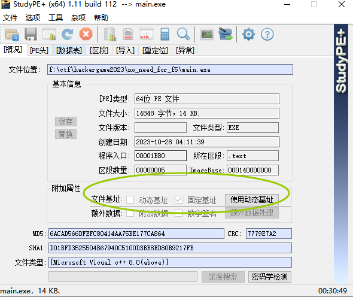

运行程序，该你输入了，这时候暂停程序

随意输入完之后，程序停下，点一下返回到程序领空，随后点(运行到返回，一次F8)，直到程序输出flag错误,最后一次运行之前就是flag 开始检查的地方

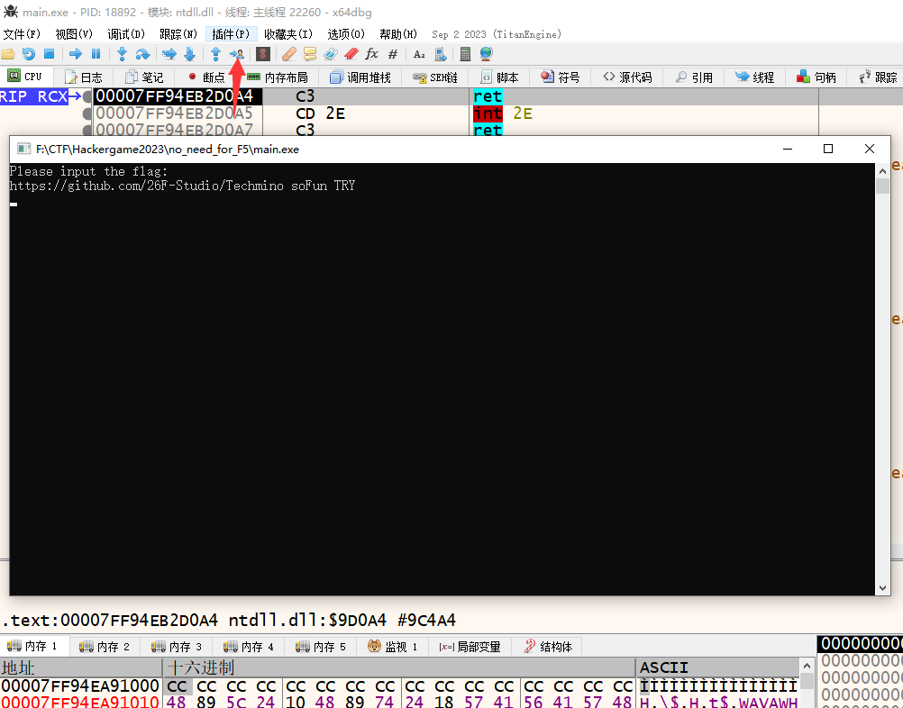

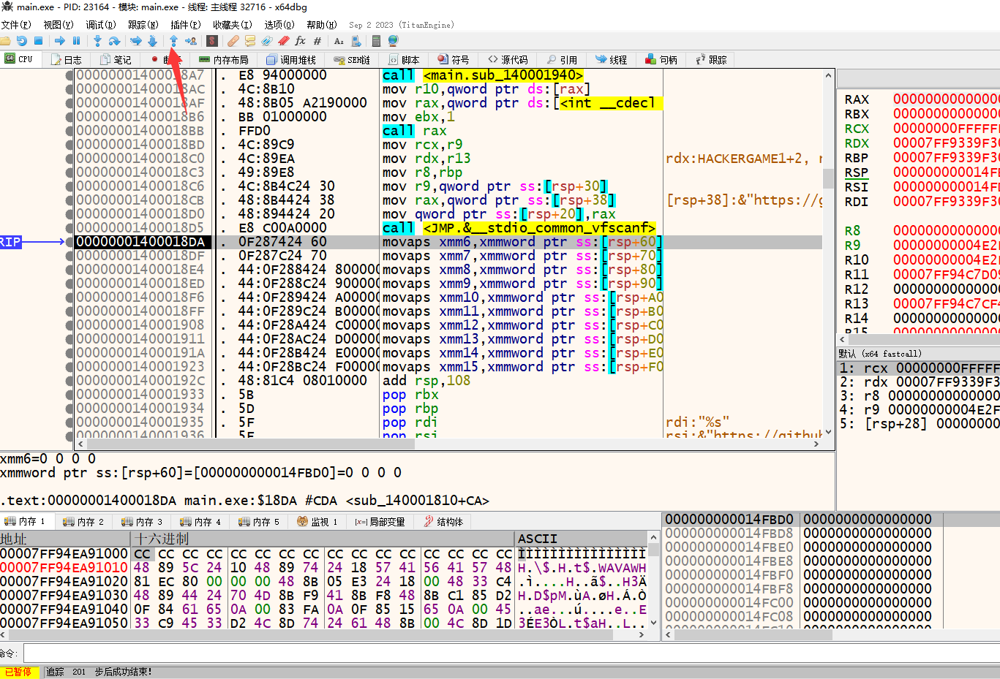

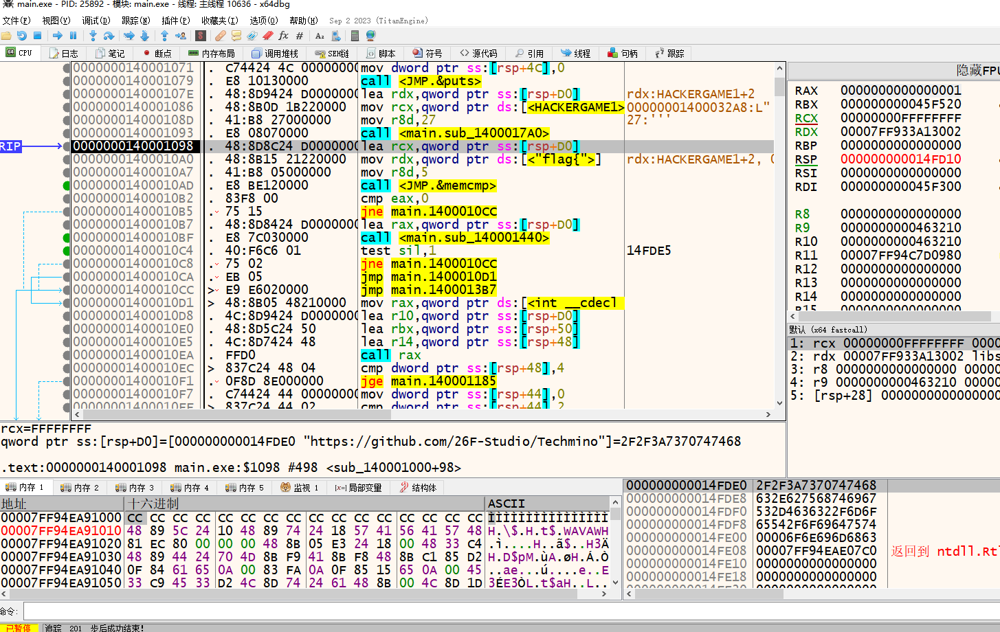

运行到memcmp，要求 输入前5个字符为 `flag{`  ,很明显随便乱输的不符合要求，程序会jmp到flag错误

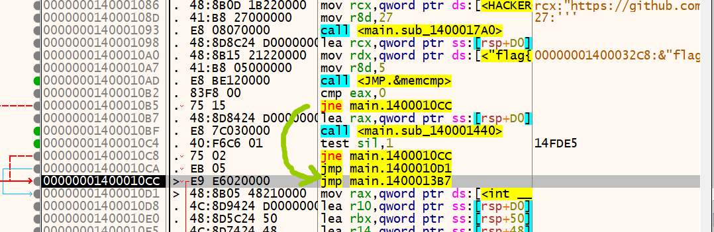

在memcmp下个断点（F2），相当于存档点

重新运行程序

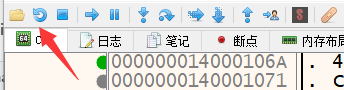

我们随便输入一个以 `flag{` 开头的，通过这个memcmp，下面进入一个call

F7 进入这个call看看干了什么

单步调试 F7/F8 均可，在遇到call指令会有区别，F7进入call，F8执行到call的下一条指令

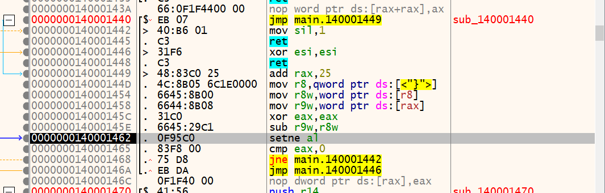

调试发现，是取出输入的flag +0x25单字节 比较是不是为 `}`,比较的结果会控制返回值

也就是说 输入flag格式应该为 `flag{......}` 总长度为 0x26

随后进入校验flag，先找到最后的判断条件，一路F8

遇到跳转时，如果往上跳，一般是循环，这时候选跳转指令的下一条指令 运行到此处（F4）

例：如下图所示，选中 0000000140001174 按下 F4

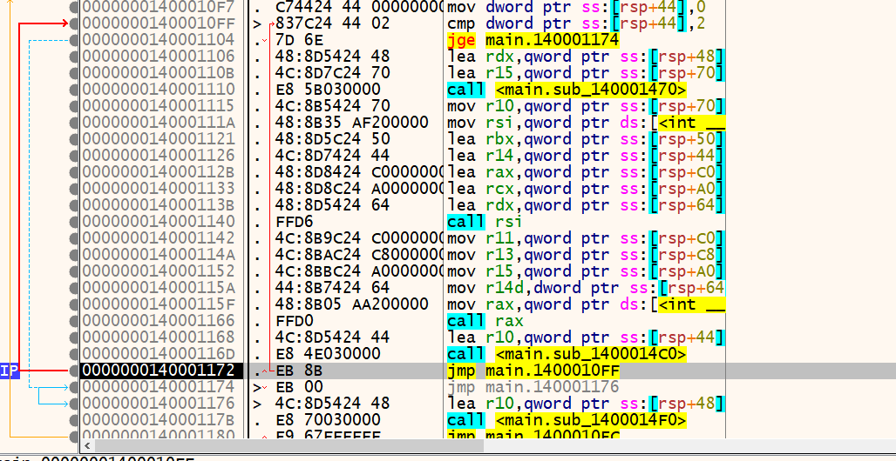

运行到此时，发现下一条指令运行到此处就会跑飞，程序结束，同时下一行就是 flag正确提示，需要分析这里的判断逻辑，F8单步，看看是哪个跳转跳过了flag正确，转到flag错误

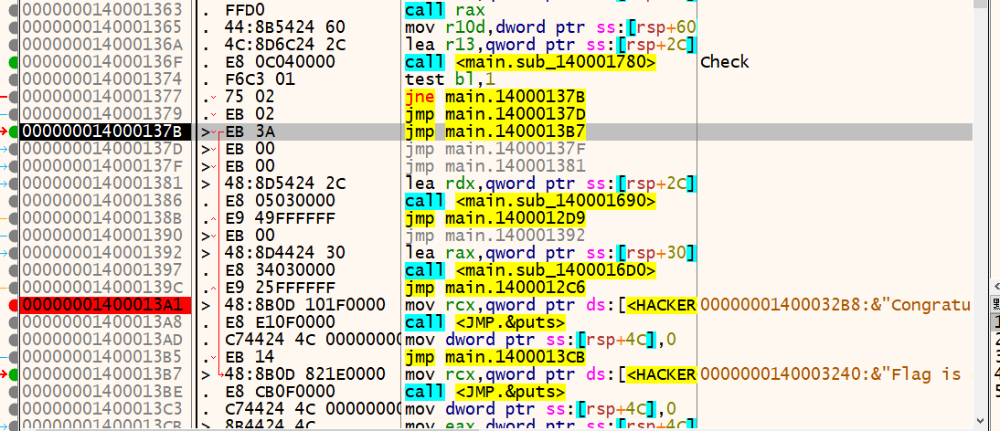

需要分析上一个call运行了什么

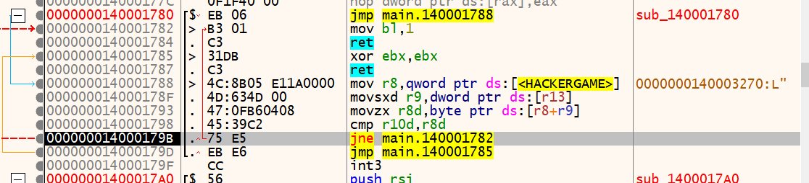

进行比较运算，查看比较的内容

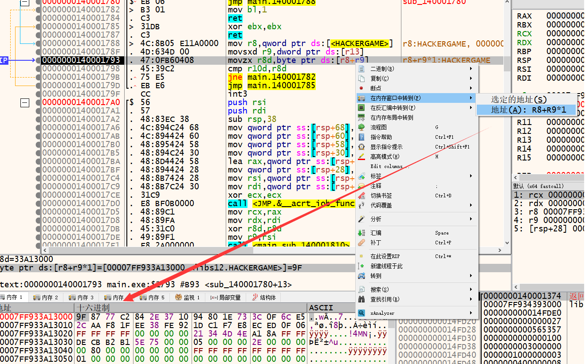

r10d是哪里的?,在之前的一个call中

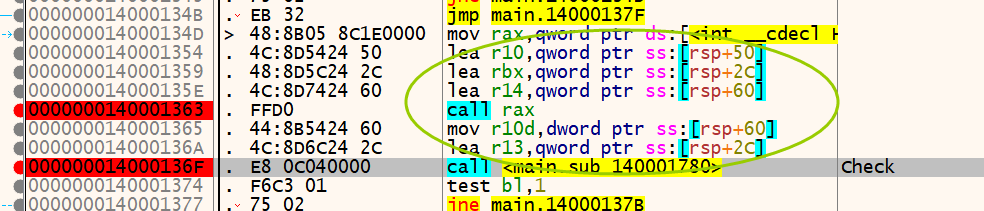

跟进去

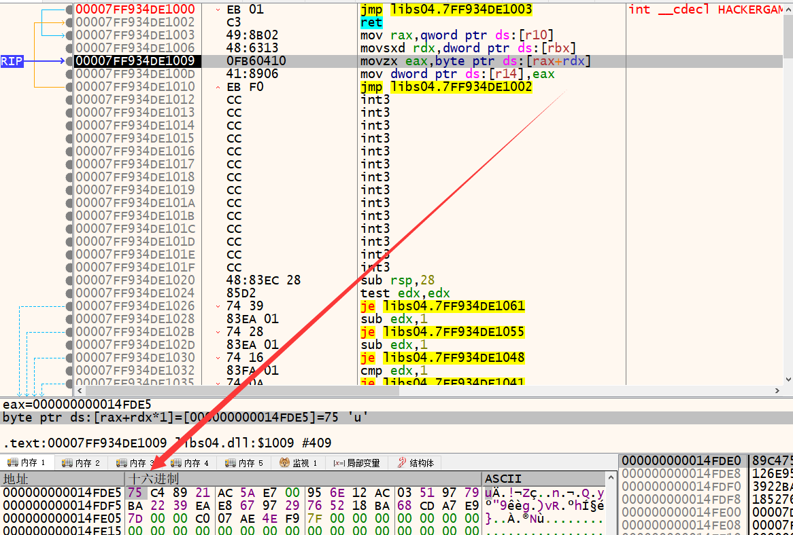

输入不同的字符串，观察到r10取到的字符变化，说明这是由输入变化而来，r8+r9取到的没有变化，是固定的

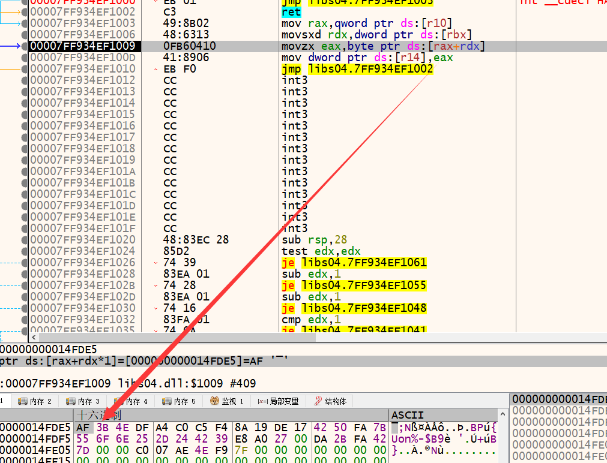

如何得知对flag做了哪些运算呢？

可以在flag输入完后，对flag做硬件断点（需要注意对齐地址，下断flag第5个字符只能用1字节硬件断点）

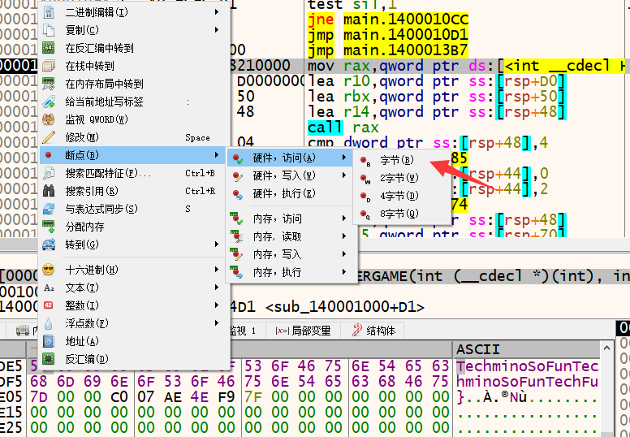

运行程序，程序会断在读取到flag字符后的指令

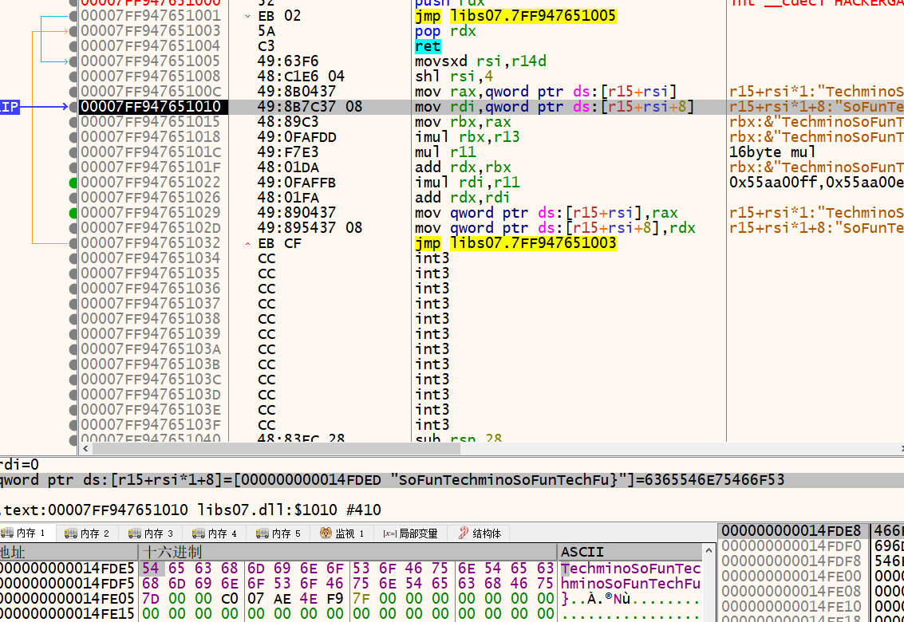

下断点后调试，发现是进行128位（16字节）乘法运算，多次改变输入后发现，每次乘数相同 0x55aa00ff,0x55aa00ef,0x55aa00df,0x55aa00cf

继续调试，硬件断点断下，发现取值，没有变化，先略过

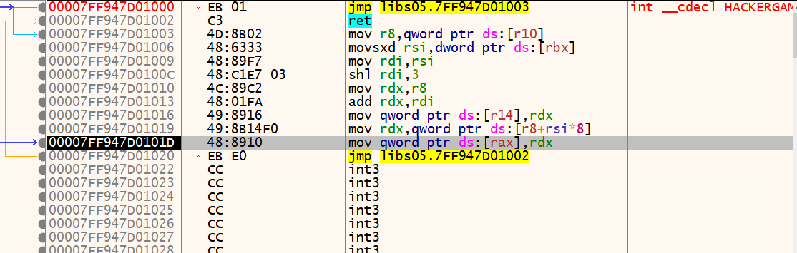

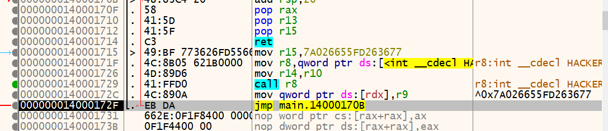

调试上一个call r8，发现是进行 xor运算  0x7A026655FD263677

下一处运行，同样是进行乘法，32位（4字节）0xDEADBEEF,0xDEADBEEB,0xDEADBEE7,0xDEADBEE3

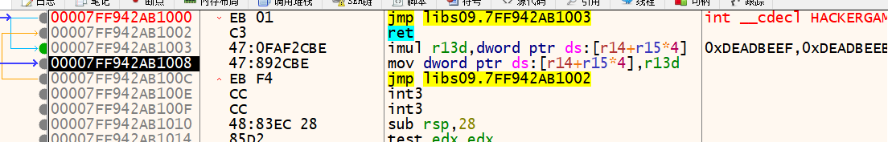

下一处xor运算，r14 ^ 0xcdec

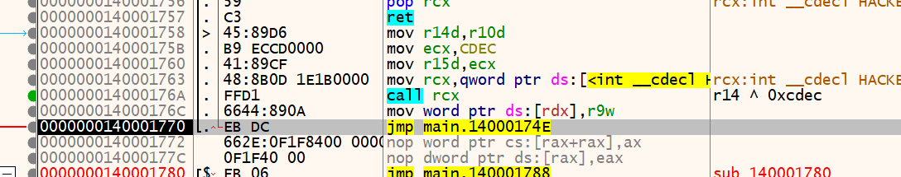

下一处乘法运算，单字节乘法， 0x21,0x23,0x25,0x27

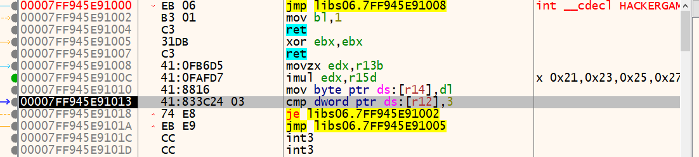

这些运算完后，程序断在取值比较，至此flag运算分析完了

有限域整数乘法运算可逆（这里可能有点难度了，如果信息安全数学基础没学会）

`ANS[i]  =  (ANS[i]  * pow(S1[3-j],-1,2**8)) & (2**8 - 1)`

xor运算再次xor自身即可还原

写出solve脚本

```python
ANS = [0x9F, 0x87, 0x77, 0xC2, 0x84, 0x2E, 0x37, 0x10, 0x94, 0x80, 0x1E, 0x73, 0x3C, 0x0F, 0x6C, 0xE5,0x2C, 0xAA, 0xF8, 0x1F, 0xEE, 0x38, 0xFE, 0x92, 0x1D, 0xC1, 0xF7, 0xE8, 0xEC, 0xED, 0x0F, 0x06]

#0x55aa00ff,0x55aa00ef,0x55aa00df,0x55aa00cf 16

# ^ ^0x7A026655FD263677 7A026655FD263677 

# 0xDEADBEEF,0xDEADBEEB,0xDEADBEE7,0xDEADBEE3 4

# ^ 0xcdec

# x 0x21,0x23,0x25,0x27

#step 1
S1=[0x21,0x23,0x25,0x27]
for j in range(4):
    for i in range(32):
        ANS[i]  =  (ANS[i]  * pow(S1[3-j],-1,2**8)) & (2**8 - 1)
        
for i in range(16):
    ANS[2*i + 0]  ^= 0xec 
    ANS[2*i + 1]  ^= 0xcd 
    
ANS2 = [0 for i in range(8)]

for i in range(8):
    for k in range(4):
        ANS2[i] |= ANS[i*4+k] << (8*k)

S2  = [0xDEADBEEF,0xDEADBEEB,0xDEADBEE7,0xDEADBEE3]
for j in range(4):
    for i in range(8):
        ANS2[i]  =  (ANS2[i]  * pow(S2[3-j],-1,2**32)) & (2**32 - 1)
        
for i in range(4):
    ANS2[2*i + 0]  ^= 0xFD263677
    ANS2[2*i + 1]  ^= 0x7A026655


ANS3 = [0 for i in range(2)]
for i in range(2):
    for k in range(4):
        ANS3[i] |= ANS2[i*4+k] << (32*k)

S3 =[0x55aa00ff,0x55aa00ef,0x55aa00df,0x55aa00cf]
for j in range(4):
    for i in range(2):
        ANS3[i]  =  (ANS3[i]  * pow(S3[3-j],-1,2**128)) & (2**128 - 1)
print(ANS3[0].to_bytes(128,'little').decode() + ANS3[1].to_bytes(128,'little').decode())
```

得到flag：`flag{decOMpi1eR_i5_n07_ALwAY$_eNOugh~}`

