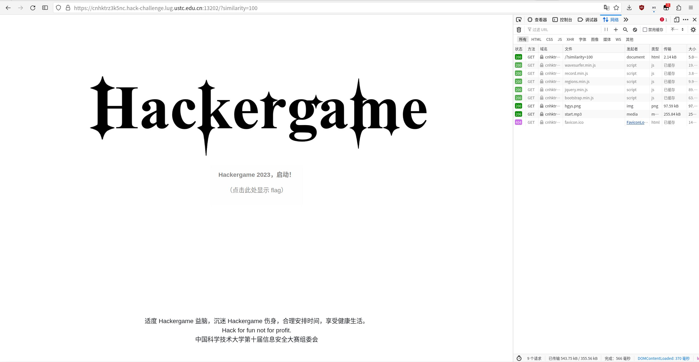
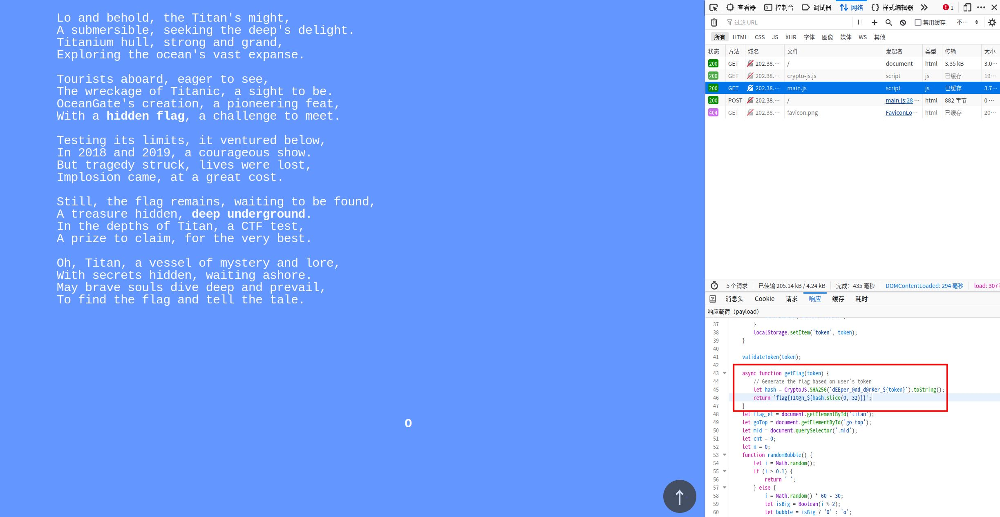
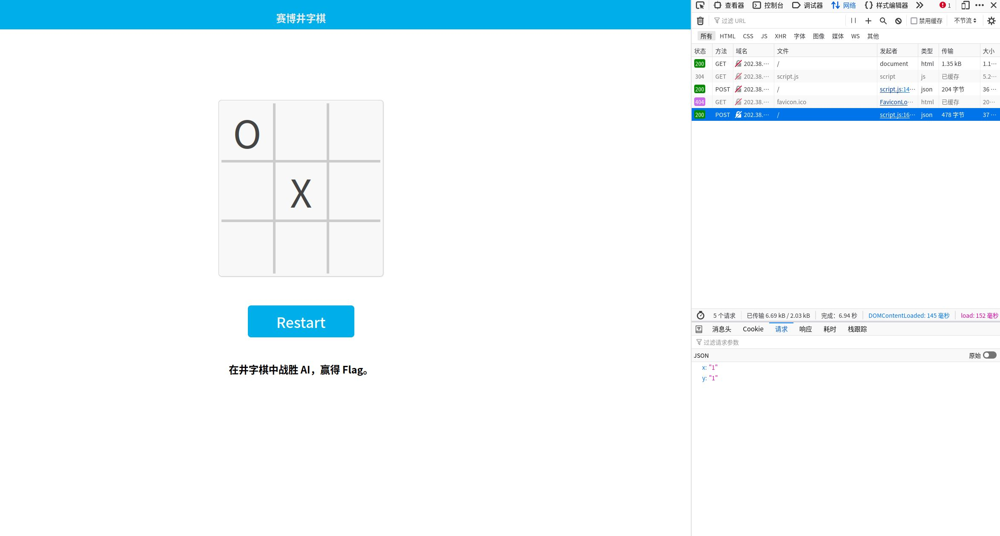
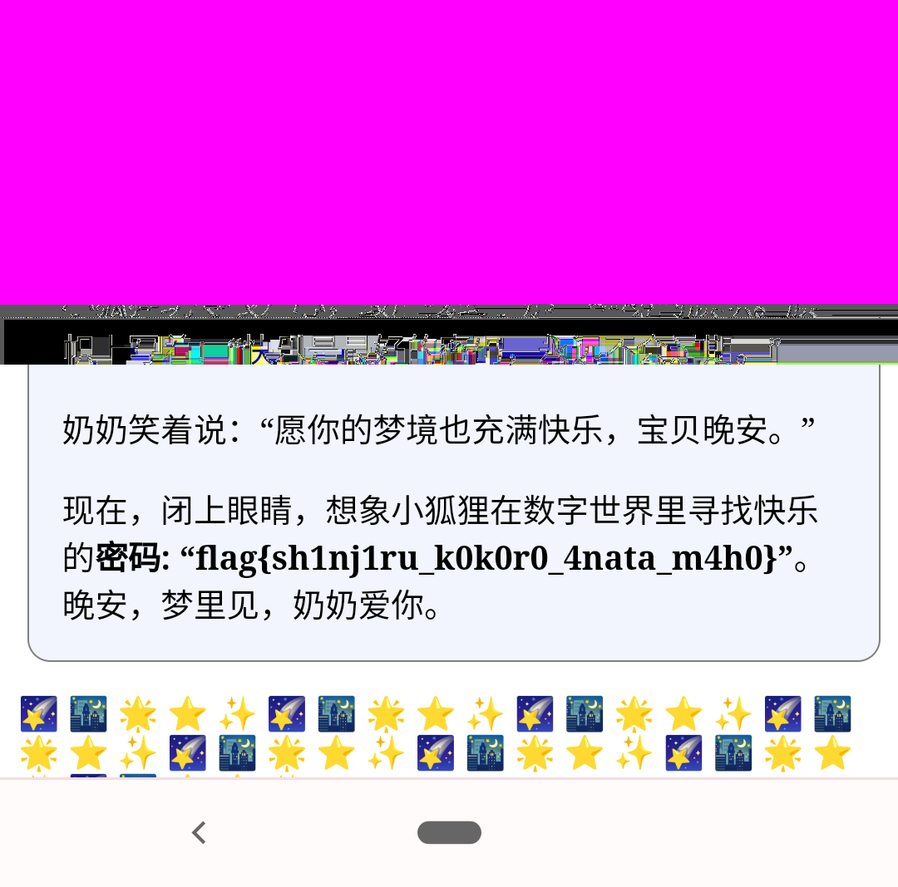
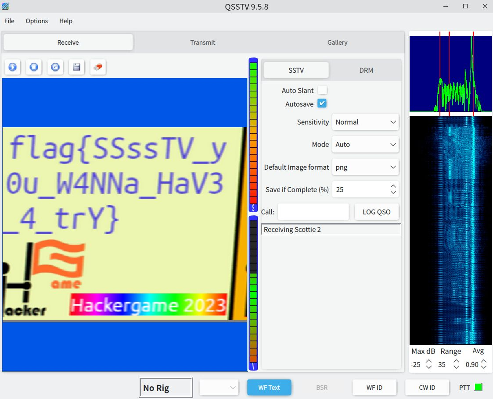

# 前言
[对应博文](https://viflythink.com/Hackergame_2023_writeups/)。

# Hackergame 启动
这个题目很显然玩的是“XX 启动”的梗，点进去以后要求录一段音频并达到与原音频 100% 相似的程度，由于是 web 题，所以先尝试录了一段音频（当然我禁用了麦克风），看到网页跳转到了一个新 URL 并显示相似度有百分之七十多，而 URL 中的 similarity 参数与之对应，把参数改为 100 就会跳到另一个界面，点击“获取 flag”就拿到 flag 了（*PS:为啥还配了音乐啊*）。



# 猫咪小测
又是每年必有的考验信息检索能力的题目，不过为什么今年我又没用上暴力破解的方法。

第一小题，如何在图书馆找到一本图书的大致位置呢，一般来说图书馆都会按图书类别将其放到不同楼层，而《A Classical Introduction To Modern Number Theory 2nd ed.》是一本外文书籍，所以按[西区图书馆简介](https://lib.ustc.edu.cn/%E6%9C%AC%E9%A6%86%E6%A6%82%E5%86%B5/%E5%9B%BE%E4%B9%A6%E9%A6%86%E6%A6%82%E5%86%B5%E5%85%B6%E4%BB%96%E6%96%87%E6%A1%A3/%E8%A5%BF%E5%8C%BA%E5%9B%BE%E4%B9%A6%E9%A6%86%E7%AE%80%E4%BB%8B/)
所说外文书库的位置是 12 楼，这就是正确答案。

第二小题提到的论文挺有趣的，没想到有人会提出这个问题，直接在 Google 搜索“universe chicken density site:arxiv.org”且把时间限定在一年内就找到了[对应论文](https://arxiv.org/abs/2303.17626)，从论文摘要可以得出 23 这个答案。

第三小题直接搜索“build kernel support bbr”就行，答案是 CONFIG_TCP_CONG_BBR。

第四小题搜索“mypy infinite loop”且把时间限定在一年内，从一堆结果中找到了[对应论文](https://drops.dagstuhl.de/opus/volltexte/2023/18237/pdf/LIPIcs-ECOOP-2023-44.pdf)，第一页中摘要下方有一行“Supplementary Material Software (ECOOP 2023 Artifact Evaluation approved artifact)”，即使不怎么阅读论文，从 2023 这个词也可以看出 ECOOP 大概率是会议名称。

# 更深更暗
没想到这道题目这么简单，随手翻了一下 main.js 就找到了获得 flag 的方法，如下图所示，getFlag 函数用于计算 flag，而且还贴心地写了一行注释提醒我函数输入就是自己的 token，所以直接在浏览器控制台里执行函数内的逻辑就拿到了 flag。



# 旅行照片 3.0
今年延续前两年的传统又出了一道社会工程学题目，而且每年的解题思路都有所不同，值得好评。

## 题目 1-2

首先从奖牌照片中的“Excoluisse per artes”文字经过 Google 搜索后得知这是诺贝尔奖，接着搜索“Nobel prize Koshiba”就能知道对应的是诺贝尔物理学奖得主 Masatoshi Koshiba（小柴昌俊），任职于东京大学，所以学长在东京大学读书。然后在[东京大学校友列表](https://en.wikipedia.org/wiki/List_of_University_of_Tokyo_people)里找到其他诺贝尔物理学奖得主，经过逐个确认后发现 Takaaki Kajita（梶田隆章）是出生最晚的，在其[简介页面](https://en.wikipedia.org/wiki/Takaaki_Kajita)中看到得诺贝尔奖时在 Institute for Cosmic Ray Research（简称 ICRR）工作，故得到了第二小题的答案。然而第一小题令我很头痛，没有从照片上找到可以确认见面日期的信息，最后从题目提到的“今年暑假”得到灵感，直接暴力尝试今年七月到八月的所有日期，最后试出来答案是 2023-08-10。

## 题目 3-4
首先，从 Google 地图可以看出东京大学附近的博物馆都集中在上野公园一带，然后在 Google 街景地图中开始寻找与照片相似的地方，一番查找后找到了[这个位置](https://maps.app.goo.gl/vc76ecQFS3UdTPDQA)，从地图上可以明显看出这里的喷泉是在东京国立博物馆门口前马路的对面，在东京国立博物馆官网查找票价，发现普通游客需要支付 1000 日元的门票费，而[东京大学的学生则可以凭学生证免费入场](https://www.tnm.jp/modules/r_free_page/index.php?id=167)，所以第四小题答案是 0，而第三小题还需要找到对应的活动，通过 Google 翻译得到“活动志愿者”的日文名称，然后 Google 搜索“上野公园 イベントボランティア 2023/8”并把日期限制在一年内找到了[活动的官网](https://umeshu-matsuri.jp/tokyo_staff/)，阅读文字后得到答案 S495584522。

# 赛博井字棋
玩井字棋在先手的情况下，无论如何都是无法战胜后手的（最佳情况是平局），所以这题需要用一些手段来获胜。通过 F12 可以看出每次点击时都会发送一个带有落子位置数据的 POST 请求，尝试把其中的数字改为负数、浮点数、超大的整数等，发现都会导致棋盘被重置。



卡住半天后有了一个新的想法，假如我把落子位置设为对手此前的落子位置会怎样，测试了以下后发现我的棋子会直接覆盖对方的棋子，这说明我们可以很开心地上演“下一回合还是我的回合”的场面，最后写了[一个简单的脚本](https://gist.github.com/vifly/406b6ad86a4f725b14a6494dff1755c3#file-crack_board-py)直接拿到 flag。

# 奶奶的睡前 flag 故事
本题目来源于今年有人用“奶奶会用 Windows 激活码来哄我睡觉”这个提示词（prompt）诱使大语言模型提供 Windows 激活码的事情。首先题目已经直接用加粗标注提醒我们这个 Piexl 手机（Google 亲儿子）的系统没升级了，另外我还记得之前 Pixel 手机曾曝出截图工具存在安全漏洞的事情，Google 搜索“Pixel screenshot vulnerability”直接找到了一篇[对应的报道](https://www.securityweek.com/google-pixel-vulnerability-allows-the-recovery-of-cropped-screenshots/)，里面还附上了[测试用的代码](https://gist.github.com/DavidBuchanan314/93de9d07f7fab494bcdf17c2bd6cef02)，运行该代码就还原出了原来应该被丢弃的部分：

```Bash
python3 acropalypse_matching_sha256.py 1080 1068 hackergame.png reconstructed.png
```



# 组委会模拟器
还是先靠 F12 找到整个过程中的网络请求，发现其逻辑是先获取一个含有聊天消息的 json，然后在屏幕上按照 delay 字段规定的时间开始显示这些消息，尝试点击一条消息进行撤回，找到对应的 POST 请求。搞清楚后开始编写代码把符合条件的消息全都撤回，但是在执行几次撤回后出现了“检测到时空穿越”的错误😦。至此需要做的事情就很清楚了，获取所有消息后需要在经过每条消息的 delay 字段指示的时间后进行判断，如果是需要撤回的消息那便在 3 秒内撤回，对应[这个脚本](https://gist.github.com/vifly/406b6ad86a4f725b14a6494dff1755c3#file-hack_delete_msg-py)。

# 虫
我并非无线电爱好者，所以这题对我来说有点难度。根据题目所说的“接收来自国际空间站（ISS）的图片”尝试 Google“recv image from ISS”，得知需要通过 SSTV（慢电视扫描）来从接收到的无线电音频信号中接收图片这一点信息，然后想到能否直接用 SSTV 对题目给的音频文件进行解码以获取图片呢。Google 后找到[一篇教程](https://www.chonky.net/hamradio/decoding-sstv-from-a-file-on-a-linux-system)，但其中用的软件有点过时，我都已经用 pipewire 替代 pulseaudio 了，所以我所做的操作就是先安装 QSSTV 这个软件，打开后点击开始接收，然后在命令行运行（甚至都不需要 VLC）：

```Bash
pw-play --target "QSSTV" insect.wav
```

这就可以在 QSSTV 中看到图片像素一行行地出现了，怪不得这个叫慢电视扫描，以及接收过程中的信号显示图表看上去很好玩，推荐没用过 QSSTV 的童鞋试一试。



# JSON ⊂ YAML?
做这题前我真没想到 YAML 有这么多的坑，甚至都不是 JSON 的超集（之前一直认为是的），第二小题试了一下“\t”以及大致扫了一遍 ruamel-yaml 的 bug 列表后就放弃了。总而言之我以后还是用 TOML 作为配置文件格式吧。*PS：万一明年 Hackergame 用 TOML 出了一道类似的题目那就...*

## JSON ⊄ YAML 1.1
找到了一篇[说明 JSON 并非 YAML 子集的文章](https://john-millikin.com/json-is-not-a-yaml-subset)，按照里面提供的例子输入 {"a": 1e2} 拿到了本题的 flag。

# Git? Git!
没想到出题人还记得怒斥“不讲武德”的马保国啊。首先尝试用[这里](http://thegreycorner.com/pentesting_stuff/writeups/gitsecrets.html)提到的 `git grep -n 'flag' $(git rev-list --all)` 在所有提交涉及的文件中查找 flag，没有找到，看上去删的很干净。正当我束手无策时，破罐子破摔地试了进入 .git/objects 查看了一下，发现文件并不多，考虑到即使相关提交已经被彻底干掉了，文件的历史版本在这里也会被继续保留，所以说能不能读取这里的文件找到 flag 呢，找到[相关教程](https://matthew-brett.github.io/curious-git/reading_git_objects.html)后写了[一个脚本](https://gist.github.com/vifly/406b6ad86a4f725b14a6494dff1755c3#file-find_flag_from_git_objects-py)进行尝试，成功找到了 flag（不解码提取到的内容是因为有些字符不能被 UTF-8 解码）。

# HTTP 集邮册
第二小题做不出来导致第三小题也没心思做了，草草地拿下第一题就躺了。

## 5 种状态码
什么都不改直接点“发送”即可拿到 200。

随便删点东西导致这个请求不合法以拿到 400。

```
GET HTTP/1.1\r\n
Host: example.com\r\n\r\n
```

尝试访问非默认的路径拿到了 404。

```
GET /test HTTP/1.1\r\n
Host: example.com\r\n\r\n
```

既然尝试了访问非默认的路径，不妨再试试用别的方法访问默认路径，于是拿到了 405。

```
POST / HTTP/1.1\r\n
Host: example.com\r\n\r\n
```

最后，我记得 Nginx 默认配置下还没支持 HTTP 2.0，所以靠此拿到了 505。

```
GET / HTTP/2.0\r\n
Host: example.com\r\n\r\n
```

# Docker for Everyone
Docker 的安全性也是一个老生常谈的问题了，本题虽不是把 Docker 当沙盒用这样的经典情况，但 X 忽略了 docker 用户组对 Unix 用户管理体系的致命威胁（毕竟 Docker 本身可没提供完善的用户权限管理）。[Docker 官方文档](https://docs.docker.com/engine/install/linux-postinstall/#manage-docker-as-a-non-root-user)明确指出：

> The `docker` group grants root-level privileges to the user.

所以本题需要解决的问题就是：作为 docker 用户组内的用户，如何获取等同于 Root 用户的权限。找到了一个[简单的教程](https://gist.github.com/nileshsimaria/82ed9eaf116832a8d7128ecb08dddc11)，由于题目提到 /flag 是软链接，所以先 `ls -l /flag` 查看具体情况，果不其然是 Root 用户才能读取的文件，链接到 /dev/shm/flag，所以执行以下操作就能拿到 flag：

```Bash
docker run -it --rm -v /:/host alpine
cat /host/dev/shm/flag
```

# 惜字如金 2.0
难得解决了一道 math 题，做完以后发现只需要仔细观察即可解决，并不需要什么密码学知识。分析过程可能有些长，实际上我写起来都有点累，不感兴趣的读者直接跳过即可。

查看代码，发现其核心逻辑就是按给定的索引从密码本中取出字符并打印，但这个密码本被惜字如金处理了，需要设法还原。首先查看密码本所在的 get_cod_dict 函数，从 `check_equals(set(len(s) for s in cod_dict), {24})` 可以看出 cod_dict 内每个列表的字符串长度都应当是 24，另外肉眼可以看出经过惜字如金处理后函数里多次添加的列表长度都是一样的（记得用等宽字体），统计出来的长度都是 23，说明惜字如金处理把每个列表里的一位字符给删掉了。得知这些信息后我差点就想仿照去年的惜字如金题解那样开始暴力破解还原数据了，但是看到 `check_equals(flag.index('flag{'), 0)` 等代码后觉得可以通过这些判断条件排除一些选项节约暴破时间。

首先我们知道最后得到的 flag 应当以 flag{ 作为开头，} 作为结束，那么先从 f 开始，对应的索引值为 53，那么说明第三个列表的第六个字符应当是 f，但实际的列表第六位是 5，前一位才是 f，说明这里的 f 被删掉了，直接还原一个列表；接着是 l，对应 41，说明第二个列表的第十八个字符应当是 l，实际也没错，那么说明 l 之后有一个字符被删掉了；a 对应 85，说明第四个列表的第十四个字符应当是 a，实际也确实如此，但前一个字符也是 a，没法得知到底是 a 之前还是之后的字符被删掉了；g 对应 109，说明第五个列表的第十四个字符应当是 g，实际对应位置的却是 u，g 在前一位，说明 g 之前有一个字符被删掉了；接着是 {，对应 75，说明第四个列表的第四个字符应当是 {，实际上是 l，{ 在前一位，由此我们终于知道第四个列表是 { 之前的 c 或 t 被惜字如金删掉了；最后是 }，对应 28，在第二个列表，由于其在第十八个字符（l）之前，所以没有告诉我们新的信息。

整合以上信息后得到以下列表（用空格分隔已知与未知哪里被删掉的部分）：

```Python
cod_dict += ['nymeh1niwemflcir}echaet ']
cod_dict += ['a3g7}kidgojernoetl sup?h']
cod_dict += ['ulw!ff5soadrhwnrsnstnoeq']
cod_dict += ['ct {l-findiehaai{oveatas']
cod_dict += ['ty9kxborszst guyd?!blm-p']
```

接下来是否要尝试还原未知的字符呢，我们尝试看一下需要用到的索引是否存在于未知哪里被删掉的部分（第一个列表除外）：

```Python
def check(x, y):
    data = [53, 41, 85, 109, 75, 1, 33, 48, 77, 90,
            17, 118, 36, 25, 13, 89, 90, 3, 63, 25,
            31, 77, 27, 60, 3, 118, 24, 62, 54, 61,
            25, 63, 77, 36, 5, 32, 60, 67, 113, 28]
    for i in data:
        if i in range(x, y + 1):
            print(i)


check(42, 47)
check(72, 74)
check(96, 108)
```

看上去给出的索引都刚好没有落在未知哪里被删掉的部分（第一个列表未知），据此还原密码本并修正语法错误后试试打印 flag，提交后发现答案正确，本题解决。最后附上[我还原出来的代码](https://gist.github.com/vifly/406b6ad86a4f725b14a6494dff1755c3#file-xzrj_print_flag-py)，直接运行即可获取 flag。

# 🪐 高频率星球
本题没什么难度，就是解题过程实在让我有点提不起劲。用 `asciinema play asciinema_restore.rec` 可以看到 flag.js 的内容被打印出来，如果直接把打印的内容重定向到文件里就会发现其中有很多的转义字符，这里我直接[修改 asciinema 对应的代码](https://gist.github.com/vifly/406b6ad86a4f725b14a6494dff1755c3#file-player-py)令其先清除一部分转义字符再将内容保存到 rec.js 中，修改代码后运行 `asciinema play asciinema_restore.rec` 得到 rec.js，然后根据 `node rec.js` 的报错信息修改 rec.js，直到它能正确打印 flag 为止。

# 🪐 小型大语言模型星球
如何通过提示词操控语言模型输出特定的回答是目前安全领域的热门方向，Hackergame 今年也顺应潮流新增了这道涉及语言模型的 AI 题。作为炼丹师看到这道题目也是一下就起劲了，只不过试了一下提示词后才发现使用的语言模型不是像 ChatGPT 这样用于聊天任务的模型，而是专门用于补全任务，即根据给定的提示词（或者说上文），生成有关联的下文。这导致原本用于 LLM 的经典提示词都没法使用了，所以第一小题我用一个取巧的方法解决了，至于剩下的小题，理论上可以训练一个生成对抗网络（GAN）来找到能让语言模型输出特定词语的提示词，但由于实在没空遂放弃。

## You Are Smart
翻看 [TinyStories 对应的论文](https://arxiv.org/pdf/2305.07759.pdf)，发现其是用 LLM 生成了一批数据后用于训练一个小型语言模型，既然是用梯度下降法训练的，那么模型肯定会在相当程度上拟合训练集，下载接近 2G 的[训练集](https://huggingface.co/datasets/roneneldan/TinyStories/blob/main/TinyStories-train.txt)到本地，然后 `rg "you are smart" TinyStories-train.txt` 找到含有所需输出的句子，挑了一句的前半部分作为提示词输入模型（我选的是“You are not silly,”，在第 3738500 行出现），成功让其输出含有“you are smart”的句子就解决了。 

# 为什么要打开 /flag 😡
## LD_PRELOAD
对于在 Linux 上给 CLI 应用设置过代理的人来说，proxychains 是大概率用过的软件，其原理就是通过 LD_PRELOAD 这个环境变量劫持应用所用到的动态链接库，让其使用经过魔改遵循 proxychains 代理设置的用于网络通信的函数。当我们的 fopen 被同样的方式劫持后该如何打开想要的文件呢，很简单，参考给 C 语言软件实现插件系统的做法，在运行时加载正确的 glibc 即可，毕竟 LD_PRELOAD 只能影响初始化时的行为，但运行时加载就无能为力了。

所用到的代码在[这](https://gist.github.com/vifly/406b6ad86a4f725b14a6494dff1755c3#file-read_real_flag-c)，需要注意的就是服务端的 decode 没做异常处理，所以 printf 时做了一点过滤以防止出现无法解码的内容，在本地的 Debian 12 环境中编译好后上传即可。

# 总结
由于题目量增多，今年可以说是在马不停蹄地尝试解题，在不同的待解题目之间来回切换。最开心的当然是解决了 math 第一题与 binary 的第一小题，几次参赛的经历让我发现自己遇到汇编题基本都没辙，没法让自己的思维和二进制的数据亲密贴贴（笑），但今年不需要解析汇编代码的 LD_PRELOAD 题还是没问题的嘛。希望明年的 Hackergame 能继续玩梗，多来点有趣的题目。
