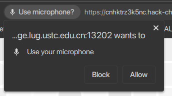
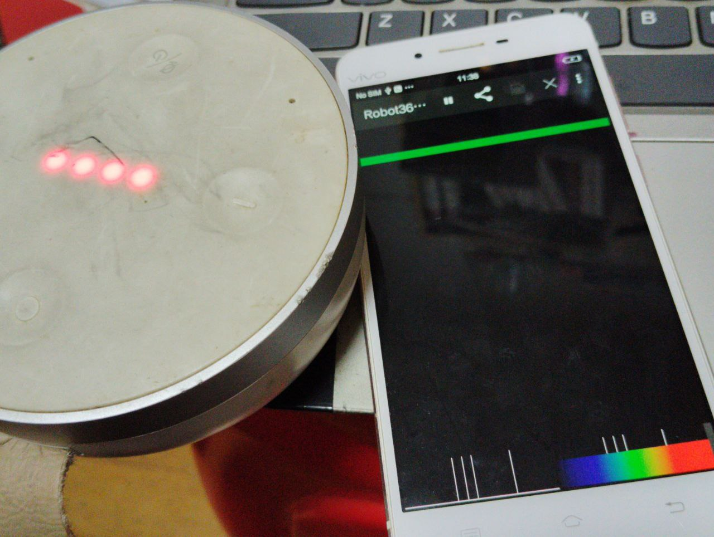
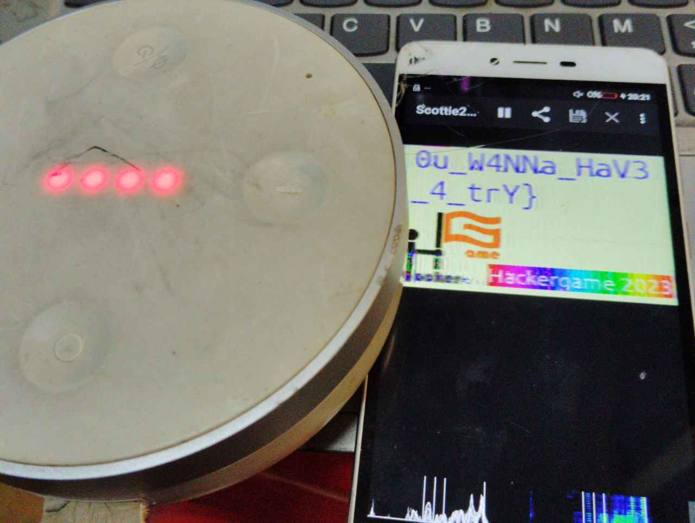
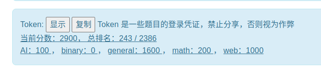

# 年轻人的第一届Hackergame —— Some writeups for USTC Hackergame 2023

本文同步发布于[我的个人博客](https://blog.chihuo2104.dev/posts/ustc-hackergame2023-writeups/)

## TL;DR

这是我参加的第一届Hackergame，作为一个什么都不会什么都不知道的屑雪生（对于我自己来说）已经算可以了，因为7天的比赛里面有5天我是缺席的（在nbfls），下次可能就要大学再见辣，Hackergame！

## 题解正文

## 1. Hackergame,启动！

~~玩Hackergame玩的~~

什么签到题（bushi

我们打开题目，然后:什么启动?还要我录音？还要我的麦克风权限？去你的罢！



~~然而最后还是开启了麦克风权限~~

开启了麦克风权限，点击提交，可以看到浏览器地址栏多了`/?similarity=`显示为相似度，根据下面的提示`说得不够标准哦，相似度大于 99.9% 才能拿到 flag。`，可以知道直接query设置成99.9以上就可以成功拿到Flag辣！

最后点击获取Flag，然后是高仿某你说的对游戏的UI（x


EOF

## 2. 猫咪小测喵

```
1. 想要借阅世界图书出版公司出版的《A Classical Introduction To Modern Number Theory 2nd ed.》，应当前往中国科学技术大学西区图书馆的哪一层？（30 分）
提示：是一个非负整数。
```

> 不是ustc猫喵，不知道喵，遍历喵，得到12喵。

```
2. 今年 arXiv 网站的天体物理版块上有人发表了一篇关于「可观测宇宙中的鸡的密度上限」的论文，请问论文中作者计算出的鸡密度函数的上限为 10 的多少次方每立方秒差距？（30 分）
提示：是一个非负整数。
```

> 在arXiv翻遍了喵，找到了[这篇论文](https://arxiv.org/abs/2303.17626)喵，论文中的abstract(*We find the most restrictive upper limit from the domains
considered to be 10^23 pc^−3
, which ruffles the feathers of long-standing astrophysics theory.*)中提示为23喵。

及格了喵，好耶喵！

```
3. 为了支持 TCP BBR 拥塞控制算法，在编译 Linux 内核时应该配置好哪一条内核选项？（20 分）
提示：输入格式为 CONFIG_XXXXX，如 CONFIG_SCHED_SMT。
```

> 网上翻到了[这篇文章](https://blog.csdn.net/liangchen0322/article/details/50603325)喵，在自己的Linux电脑或者是容器输入`zcat /proc/config.gz | grep BBR`，得到`CONFIG_TCP_CONG_BBR`喵

实测执行结果喵(Kernel版本为`6.5.9-arch2-1`喵)
```shell
chihuo2104@konnyaku ~> zcat /proc/config.gz | grep BBR
CONFIG_TCP_CONG_BBR=m
```

```
4. 🥒🥒🥒：「我……从没觉得写类型标注有意思过」。在一篇论文中，作者给出了能够让 Python 的类型检查器 MyPY mypy 陷入死循环的代码，并证明 Python 的类型检查和停机问题一样困难。请问这篇论文发表在今年的哪个学术会议上？（20 分）
提示：会议的大写英文简称，比如 ISCA、CCS、ICML。
```

> 直接上Google搜索喵，搜索到了[这篇论文](https://arxiv.org/abs/2208.14755)喵，又根据这篇论文搜索到[作者的博客](https://oriroth.github.io/)喵，在作者的博客中介绍了参与的大会（ECOOP）喵。

满分了耶喵！

EOF

## 3. 更深更暗

点进去，一看这么多的东西，肯定一直往下划啊，什么，有潜水艇？？？

不行，再来一次，这次我可是开了OBS录屏的！

成功搞到Flag！

EOF

## 4. 旅行照片 3.0

原来做这道题其实没有什么思路的，也是今天凌晨想到的思路。

第一张照片是诺贝尔奖章（用Google Lens搜了看），然后突然发现下面有个`MMII`，怀疑是罗马数字，遂搜索，得到2002，获得学长所在学校为东京大学。

于是在[东京大学的诺贝尔奖获得者](https://zh.wikipedia.org/wiki/%E4%B8%9C%E4%BA%AC%E5%A4%A7%E5%AD%A6#%E7%9F%A5%E5%90%8D%E6%A0%A1%E5%8F%8B)中搜索，得到了[这个人](https://zh.wikipedia.org/wiki/%E6%A2%B6%E7%94%B0%E9%9A%86%E7%AB%A0)出生最晚，其任职于[東京大学宇宙線研究所(ICRR)](https://ja.wikipedia.org/wiki/%E6%9D%B1%E4%BA%AC%E5%A4%A7%E5%AD%A6%E5%AE%87%E5%AE%99%E7%B7%9A%E7%A0%94%E7%A9%B6%E6%89%80)

第二个也找不太到，于是使用python爆破了一下，爆破出来的答案是`2023-08-10`

爆破代码：
```python
# encoding = utf8
# Powered by chihuo2104(c)2018-2023.
import random
import time
import urllib.parse

import requests
import base64

import urllib3

cookie = "Cookie喵"

for i in [7,8]:
    for j in range(1,32):
        ans = ""
        if j < 10:
            ans = base64.b64encode(("Answer1=2023-0" + str(i) + "-0" + str(j) + "&Answer2=ICRR").encode()).decode() + ".txt"
        else:
            ans = base64.b64encode(("Answer1=2023-0" + str(i) + "-" + str(j)  + "&Answer2=ICRR").encode()).decode() + ".txt"
        resp = requests.post("http://202.38.93.111:12345/", headers={
            "cookie": cookie,
        }, data=ans)
        print(ans, str(i) + "-" + str(j), resp.status_code, resp.text)
        time.sleep(random.randint(1,5))
```

第一题完成！

既然拿到了日期`2023-08-10`，再结合Google Lens搜索第二张图，可以鉴定拍摄地点为`上野公园大喷泉`，在日文环境下搜索`上野公園 大噴水 8月10日(木)`，可以得到帐篷里的活动是[全国梅酒まつりin東京2023](https://umeshu-matsuri.jp/tokyo_ueno/)，其志愿者招募的网址链接是<https://umeshu-matsuri.jp/tokyo_staff/>，获得问卷编号`S495584522`

然后再搜索东京国立博物馆的票价就行了（但是最后我测试出来是0JPY(恼）

第二题完成！

第三题我只找到上野站卖的那个粉色海报上面是熊猫，还是太屑了...

EOF

## 5. 赛博井字棋

~~看到这井字棋我忍不住玩了30分钟，想人力打赢AI（x~~

然而最后还是开了F12...

打开F12->Networks看了下Payload，发现：

按下Reset时: POST发送了`{"act": "reset"}`

开始对局时候：POST发送了`{x: "[下子X坐标]", y: "[下子Y坐标]"}`

座标系如下：

```
(0,0)|(1,0)|(2,0)
(0,1)|(1,1)|(2,1)
(0,2)|(1,2)|(2,2)
```

然后我就想了，*可不可以复写AI的落子呢*，没想到成了！

打开postman(这么小工作量都不用请出python杀手锏)，然后POST，先reset，然后再输入坐标(0,0),(1,1),(2,2)，然后就取得了Flag！

EOF

## 6. 奶奶的睡前 flag 故事

其实去Google上面搜索`Pixel screenshot hack`就可以知道有个CVE漏洞（pixel的图片编辑器只是把png的END符往前面移了而没全删），然后使用[这个网站](https://acropalypse.app/)，机型选择`Pixel3`就可以取得Flag了！

其实我原来还考虑的是IEDF破解没想到是这破玩意（恼

EOF

## 7. 组委会模拟器

~~其实我原来是想尝试自己一个一个点没的，后面人都眼花缭乱了，遂打开F12~~

打开F12，可以发现几个API：

- `/api/getMessages`：获取信息列表，列表是json文件，里面包含了delay(消息几秒钟后发送)，和消息内容，我们只要这几个就可以了。
- `/api/deleteMessage`: 撤回符合要求的信息，payload是json({"id":[Message id])
- `/api/getflag`: 获取flag（所有消息撤回后使用）

这个只需要使用python模拟一下就好了

之前用的是for循环delay什么的，反正很复杂，然后有些时候就会快，有些时候就会慢...

现在的代码用的是先循环消息数组，符合的消息开线程撤回，线程delay结束后自动请求，可以保证3s内撤回

代码如下：

```python
# encoding = utf8
# Powered by chihuo2104(c)2018-2023.
import json
import math
import time
import datetime
import requests
from threading import Thread, activeCount


cookie = "cookie喵"

# post请求撤回
def postans(id, delay):
    print(id, delay)
    time.sleep(delay)
    jsondata = json.dumps(dict(id=id))
    resp2 = requests.post("http://202.38.93.111:10021/api/deleteMessage", headers={
        "Cookie": cookie,
        "Content-Type": "application/json",
    }, data=jsondata)
    print(id, resp2.text)

# 获取flag喵
def getFlag(delay):
    time.sleep(delay + 1)
    resp3 = requests.post("http://202.38.93.111:10021/api/getflag", headers={
        "Cookie": cookie,
        "Content-Type": "application/json",
    })
    print(resp3.text)


resp = requests.post("http://202.38.93.111:10021/api/getMessages", headers={
    "Cookie": cookie,
    "Content-Type": "application/json",
})
messages = json.loads(resp.text)
for i in range(0, len(messages["messages"])):
    # print(delay)
    # print(messages["messages"][i])
    if "hack[" in messages["messages"][i]["text"] and "]" in messages["messages"][i]["text"] and \
            messages["messages"][i]["text"].lower() == messages["messages"][i]["text"]:
        print(i, messages["messages"][i])
        t = Thread(target=postans, args=(i, messages["messages"][i]["delay"]))
        t.start()
t2 = Thread(target=getFlag, args=(messages["messages"][len(messages["messages"]) - 1]["delay"],))
t2.start()
```

EOF

## 8. 虫

根据题目中的描述*这听起来像是一种通过无线信道传输图片的方式，如果精通此道，或许就可以接收来自国际空间站（ISS）的图片了。*，网上搜得这种方式叫做SSTV。

PC端装的Linux，Wine跑RX-SSTV又跑不起来，遂作罢，然后发现手机版本也有这种APP(Robot36)，下载了，下载好之后，播放这段声音，就可以获得了！

小插曲：我的Note12R甚至还打不开麦克风，于是拿出了我那遥遥领先的VivoX6s，发现麦克风坏了，没办法，只好拿出最为先进的SD410了，没想到它没有让我失望！







EOF

## 9. JSON ⊂ YAML?

翻了Yaml和Json各自的规范文件

- Yaml：<https://yaml.org/spec/1.2.2/>
- Json：<https://www.ecma-international.org/publications-and-standards/standards/ecma-404/>

但是我只看出了浮点的问题(Json的浮点1e-23会被yaml1.1解析成字符串)

EOF

## 10. Git? Git!

由于git的特性，提交了之后如果撤回了commit，没有执行`git gc`的话是不会彻底删除撤回的commit的，这时候我们只要看reflog进行比对即可。

我们先下载这个文件夹，然后使用`git reflog`读取操作记录，再对它进行diff

[`git reflog`的结果]
```shell
chihuo2104@konnyaku ~/D/ML-Course-Notes (main)> git reflog
036a4dd (HEAD -> main) HEAD@{0}: commit: test
ea49f0c HEAD@{1}: commit: Trim trailing spaces
15fd0a1 (origin/main, origin/HEAD) HEAD@{2}: reset: moving to HEAD~
505e1a3 HEAD@{3}: commit: Trim trailing spaces
15fd0a1 (origin/main, origin/HEAD) HEAD@{4}: clone: from https://github.com/dair-ai/ML-Course-Notes.git
```
我们看到了`HEAD@{3}`和`HEAD@{4}`,对它们进行diff，就可以获得flag辣！(其实你也可以几个HEAD都试试)
```shell
git diff HEAD@{3} HEAD@{4}

diff --git a/README.md b/README.md
index f629dae..8f13fd4 100644
--- a/README.md
+++ b/README.md
@@ -5,7 +5,7 @@ A place to collaborate and share lecture notes on all topics related to machine
 
 ---
 
-### Machine Learning Specialization (2022)
+### Machine Learning Specialization (2022) 
 [Website](https://www.coursera.org/specializations/machine-learning-introduction) | Instructor: Andrew Ng
 
 <table class="tg">
@@ -16,7 +16,7 @@ A place to collaborate and share lecture notes on all topics related to machine
     <th class="tg-yw4l"><b>Notes</b></th>
     <th class="tg-yw4l"><b>Author</b></th>
   </tr>
-  <!-- flag{TheRe5_@lwAy5_a_R3GreT_pi1l_1n_G1t} -->
+  
   <tr>
     <td class="tg-yw4l">Introduction to Machine Learning</td>
```

EOF
## 11. HTTP 集邮册

点进去，就是创造HTTP请求的文本辣！

可以随便乱玩就能拿到的请求：

1. 200 OK(直接发！)
```
GET / HTTP/1.1\r\n
Host: example.com\r\n\r\n
```
2. 404 Not Found(随便找个没的页面)
```
GET /neko.miao HTTP/1.1\r\n
Host: example.com\r\n\r\n
```
3. 400 Bad Request(乱写一通)
```
/ HTTP/1.1\r\n
Host: example.com\r\n\r\n
```
4. 405 Method Not Allowed(乱改请求动词字符串)
```
POST / HTTP/1.1\r\n
Host: example.com\r\n\r\n
```
5. 505 HTTP Version Not Supported(乱改http版本)
```
GET / HTTP/114514\r\n
Host: example.com\r\n\r\n
```
(你看5个不就有了吗)
6. 414 Request-URI Too Large(超长url链接)
```
GET /?yajuu=(超级长的恶臭字符)
Host: example.com\r\n\r\n
```

接下来是[查文档](https://developer.mozilla.org/zh-CN/docs/Web/HTTP/Status)才能拿到的请求

7. [100 Continue](https://developer.mozilla.org/zh-CN/docs/Web/HTTP/Status/100)
```
GET / HTTP/1.1\r\n
Host: example.com\r\n
Expect: 100-continue\r\n\r\n
```
8. [206 Partial Content](https://developer.mozilla.org/zh-CN/docs/Web/HTTP/Status/206)(Range获取部分内容)
```
GET / HTTP/1.1\r\n
Host: example.com\r\n
Range: bytes=114-514\r\n\r\n
```
9. [304 Not Modified](https://developer.mozilla.org/zh-CN/docs/Web/HTTP/Status/304)(缓存匹配)
> 官方题解用的是`If-Modified-Since`，我做题的时候用的是`If-Non-Match`和html的那个ETag匹配
```
GET / HTTP/1.1\r\n
Host: example.com\r\n
If-None-Match: "返回的ETag"\r\n\r\n
```
10. [412 Precondition Failed](https://developer.mozilla.org/zh-CN/docs/Web/HTTP/Status/412)(缓存匹配不起了)
```
GET / HTTP/1.1\r\n
Host: example.com\r\n
If-Match: "yajuu"\r\n\r\n
```
11. [413 Payload Too Large](https://developer.mozilla.org/zh-CN/docs/Web/HTTP/Status/413)(服务器怀疑你请求太大了)
```
GET / HTTP/1.1\r\n
Host: example.com\r\n
Content-Length: 1145141919810\r\n
```
12.  [416 Range Not Satisfiable](https://developer.mozilla.org/zh-CN/docs/Web/HTTP/Status/416)(超流了)
```
GET / HTTP/1.1\r\n
Host: example.com\r\n
Range: bytes=114514-1919810\r\n\r\n
```
13. 无状态码(官方说是HTTP/0.9):
```
GET /r\n\r\n
```
[我的集邮结束]

接下来是官方题解的附加内容
14. 501 Not Implemented(在nginx中，`Transfer-Encoding`不支持除chunk外的所有内容)
```
GET / HTTP/1.1\r\n
Transfer-Encoding: gzip\r\n
Host: example.com\r\n\r\n
```

EOF

## 12. Docker for Everyone

从[这篇文章](https://blog.csdn.net/weixin_46700042/article/details/109532502)得知Docker用户有权限开容器之后开启容器的时候挂载卷的时候是可以以root权限挂载的

于是只要挂载flag所在卷即可获得Flag：

```shell
alpine:~$ docker run -it -v /flag:/flag --rm alpine cat /flag
flag{u5e_r00t1ess_conta1ner_c89d12d724_plz!}
```

所以为什么不用Podman呢（乐

EOF

## 13. 惜字如金 2.0

下载了Python小代码，代码如下：

```python
#!/usr/bin/python3

# Th siz of th fil may reduc after XZRJification

def check_equals(left, right):
    # check whether left == right or not
    if left != right: exit(1)

def get_cod_dict():
    # prepar th cod dict
    cod_dict = []
    cod_dict += ['nymeh1niwemflcir}echaet']
    cod_dict += ['a3g7}kidgojernoetlsup?h']
    cod_dict += ['ulw!f5soadrhwnrsnstnoeq']
    cod_dict += ['ct{l-findiehaai{oveatas']
    cod_dict += ['ty9kxborszstguyd?!blm-p']
    check_equals(set(len(s) for s in cod_dict), {24})
    return ''.join(cod_dict)

def decrypt_data(input_codes):
    # retriev th decrypted data
    cod_dict = get_cod_dict()
    output_chars = [cod_dict[c] for c in input_codes]
    return ''.join(output_chars)

if __nam__ == '__main__':
    # check som obvious things
    check_equals('creat', 'cr' + 'at')
    check_equals('referer', 'refer' + 'rer')
    # check th flag
    flag = decrypt_data([53, 41, 85, 109, 75, 1, 33, 48, 77, 90,
                         17, 118, 36, 25, 13, 89, 90, 3, 63, 25,
                         31, 77, 27, 60, 3, 118, 24, 62, 54, 61,
                         25, 63, 77, 36, 5, 32, 60, 67, 113, 28])
    check_equals(flag.index('flag{'), 0)
    check_equals(flag.index('}'), len(flag) - 1)
    # print th flag
    print(flag)
```
先把它反惜字如金化，反creat原则，获得代码如下：
```python
#!/usr/bin/python3

# Th size of the file may reduce after XZRJification

def check_equals(left, right):
    # check whether left == right or not
    if left != right: exit(1)

def get_code_dict():
    # prepare the code dict
    code_dict = []
    code_dict += ['nymeh1niwemflcir}echaet'] # 0-23
    # l #41?
    code_dict += ['a3g7}kidgojernoetlsup?h'] # 24-47
    code_dict += ['ulw!ff5soadrhwnrsnstnoeq'] # 48-71
    # a #85?
    code_dict += ['ct{{l-findiehai{oveatas'] # 72-95
    # g #109?
    code_dict += ['ty9kxborszstguyd?!blm-p'] # 96-119
    check_equals(set(len(s) for s in code_dict), {24})
    return ''.join(code_dict)

def decrypt_data(input_codes):
    # retrieve the decrypted data
    code_dict = get_code_dict()
    output_chars = [code_dict[c] for c in input_codes]
    return ''.join(output_chars)

if __name__ == '__main__':
    # check some obvious things
    check_equals('create', 'cre' + 'ate')
    check_equals('referer', 'refe' + 'rer')
    # check the flag
    flag = decrypt_data([53, 41, 85, 109, 75, 1, 33, 48, 77, 90,
                         17, 118, 36, 25, 13, 89, 90, 3, 63, 25,
                         31, 77, 27, 60, 3, 118, 24, 62, 54, 61,
                         25, 63, 77, 36, 5, 32, 60, 67, 113, 28])
    print(flag)

```
给你的初始字典都是长度23，所以你基本上无法运行这段代码，于是我们需要进行反referer原则。

根据代码，其实就是一个字典(长度120)然后取数组值，其实很简单，前5位(53,41,85,109)对应'f','l','a','g','{'，最后一位28对应'}'，从字典中读取，如果发现字典不对应，就在前面补一个辅音。

最后可以发现第一个字典有点问题，只要在**不干扰6个固定字符的情况下**添加双写辅音即可。

最后的代码是这样的：

```python
#!/usr/bin/python3

# Th size of the file may reduce after XZRJification

def check_equals(left, right):
    # check whether left == right or not
    if left != right: exit(1)

def get_code_dict():
    # prepare the code dict
    code_dict = []
    code_dict += ['nymeh1niwemflcir}echaett'] # 0-23
    # l #41?
    code_dict += ['a3g7}kidgojernoetllsup?h'] # 24-47
    code_dict += ['ulw!ff5soadrhwnrsnstnoeq'] # 48-71
    # a #85?
    code_dict += ['ct{{l-findiehaai{oveatas'] # 72-95
    # g #109?
    code_dict += ['ty9kxborszstgguyd?!blm-p'] # 96-119
    check_equals(set(len(s) for s in code_dict), {24})
    return ''.join(code_dict)

def decrypt_data(input_codes):
    # retrieve the decrypted data
    code_dict = get_code_dict()
    output_chars = [code_dict[c] for c in input_codes]
    return ''.join(output_chars)

if __name__ == '__main__':
    # check some obvious things
    check_equals('create', 'cre' + 'ate')
    check_equals('referer', 'refe' + 'rer')
    # check the flag
    # 53 -> f 41
    flag = decrypt_data([53, 41, 85, 109, 75, 1, 33, 48, 77, 90,
                         17, 118, 36, 25, 13, 89, 90, 3, 63, 25,
                         31, 77, 27, 60, 3, 118, 24, 62, 54, 61,
                         25, 63, 77, 36, 5, 32, 60, 67, 113, 28])
    print(flag)

```

运行就能获得flag辣！

EOF

## 14. 🪐 高频率星球

根据[这篇文章](https://zhuanlan.zhihu.com/p/261744578)，我们可以把asciinema输出的内容导入到一个文件：

```shell
asciinema cat asciinema_restore.rec > a.js
```

打开a.js，替换无关字符，使用node运行即可获得flag辣！

EOF

## 15. 🪐 低带宽星球

第一题做出来了，用的图片压缩器(完全无损)是G家的`optipng`无损压缩把5.8K->1.8K，网上的那些压缩都是有损压缩...

第二题原来想通过构造PNG文件骗过pyvips的，但是因为时间问题遂没实现。

EOF

## 看了官方题解的一些想法

## 1. 旅行照片 3.0

我其实是没有留意学长的`STATPHYS28`字样，所以我第五题也做不出来，原来是这样。然后0JPY的话原来是因为东京大学在东京国立博物馆常驻免费名单内（

第六题是我没看清，一直在翻上野站，而不知道是渋谷站。

## 2. 组委会模拟器 & 赛博井字棋

没想到可以直接用js完成（

## 3. JSON ⊂ YAML?

没想到json规范除了ecma404还有一个RFC 8259（

## 4. 惜字如金2.0

其实我也是想用遍历遍历出字典的（ 但是后面感觉还是自己推理加枚举快（

## 5. 🪐 小型大语言模型星球

没想到第二题Accept是要枚举的（（

第三题第四题得好好学学解法，攻击LLM是吧（

## 6. 🪐 低带宽星球

果然第二道题是攻击libvips（ pillow：*乐*

但是不是空造一个PNG（

最后的赢家居然是JPEG XL（

## 7. Komm, süsser Flagge

1. 嗯？还能这么玩？？分包发送是真的6
2. 人晕了...
3. 看都看不懂呜呜呜

## 8. 为什么要打开 /flag 😡

看不懂呜呜呜，留着

## 9. 异星歧途

其实没时间熟悉这个游戏（（（

woc好抽象，想到了最近在学的电控（

## 10. 微积分计算小练习 2.0

其实我已经XSS进了留言界面（就是用双引号），但是看不懂这个bot在干什么（

我甚至忘记了`{}` 也可以执行js脚本，草！~~悔恨终身~~

## 11. 逆向工程不需要 F5

草，根本不会用，留着

## 12. O(1) 用户登录系统

oh，原来是碰撞，也留着

## 13. 链上猎手

草这居然是区块链，也留着

## 14. It's MyCalculator!!!!! && 小 Z 的谜题 && 黑客马拉松 && 不可加密的异世界 2 && 旧日之痕

CVE、三维积木和密码学。没看懂，留着


## End



最后还是拿了2.9k分（ 排名240左右，和[SCI](https://koishi514.moe/)一个分数,SCI强强！

马上也要期中统考了，祝自己期中统考可以考出自己理想的成绩，Hackergame 2025见！
