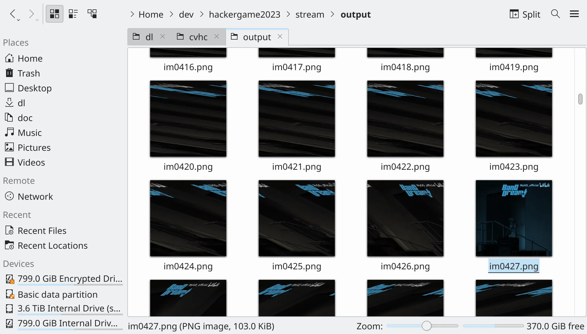

## 🪐 流式星球

拿了个一血。

> 流式星人用流式数据交流，比如对于视频来说，他们不需要同时**纵览整个画面**，而是直接使用像素流。

所以人类的解题方法就是肉眼纵览整个画面快速过图。

`video.bin` 是个截断了的 `count x height x width x 3` 的 NumPy array。只要猜对 `width` 就能打出来人眼能辨认的图像了。直接枚举合理的 `width` 范围，输出图片，肉眼识别图像是否正确恢复就行。生成图片的代码如下：

```python
import numpy as np
import cv2

arr = np.fromfile('video.bin', dtype=np.uint8)
count = 0

for w in np.arange(100, 2000):
    img = arr[:w*w*3].reshape(w, w, 3)
    cv2.imwrite(f'output/im{w:04d}.png', img)
    count += 1
```

之后用一个方便的 image viewer 一张张看就好了。我直接用的文件管理器的图片预览（上面代码生成正方形图片也是为了方便看预览）：



知道宽度后出图继续肉眼找 flag，高度 `h=500` 是瞎写的，帧对不齐不影响肉眼识别内容：

```python
w = 427
h = 500
img_size = w * h * 3
arr = arr[0:(arr.size // img_size) * img_size + 0]
imgs = arr.reshape(-1, h, w, 3)

for i in range(imgs.shape[0]):
    cv2.imwrite(f'output/im{i:04d}.png', imgs[i, ...])
```

**插曲**：题目代码中的 `assert frame_width % 10 != 0` 感觉是坑人的。我一开始看成等于 0 了，用了 `np.arange(100, 2000, 10)`，得不到正确结果。但问题也不大，会发现 `w=1280` 时会出现勉强可以辨认的图像，但每行偏移一个像素，于是重新试了 `1281` 就能得到对齐的图像了。这是正确宽度 `427` 的三倍。