博客版本参考：[https://blog.huggy.moe/posts/2023/5-ustclug-ctf-writeup/](https://blog.huggy.moe/posts/2023/5-ustclug-ctf-writeup/)  
CC BY-NC-SA 3.0
# 开篇废话
又是一年 hackergame ，今年开启了新的生活比较忙，博客都半年更了（绝望），不过按照惯例一年一度的 Hackergame 还是参加一下的。
  

历年题解：  
- [2022](https://blog.huggy.moe/posts/2022/14-ustclug-ctf-writeup/)
- [2021](https://blog.huggy.moe/posts/2021/14-ustclug-ctf-writeup/)
- [2020](https://blog.huggy.moe/posts/2020/15-ustclug-ctf-writeup/)
- [2019](https://blog.huggy.moe/posts/2019/3-ustclug-ctf-writeups/)
# 题目
## 签到
hackergame 启动！

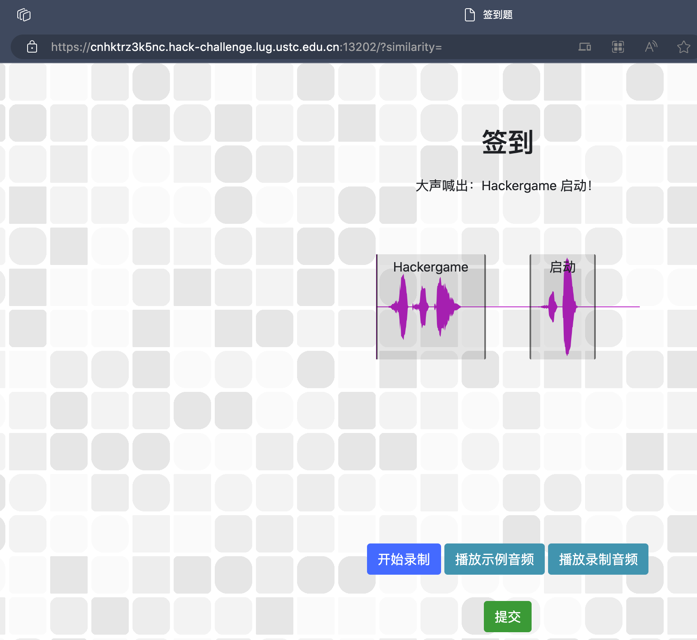  

> https://cnhktrz3k5nc.hack-challenge.lug.ustc.edu.cn:13202/?similarity=100

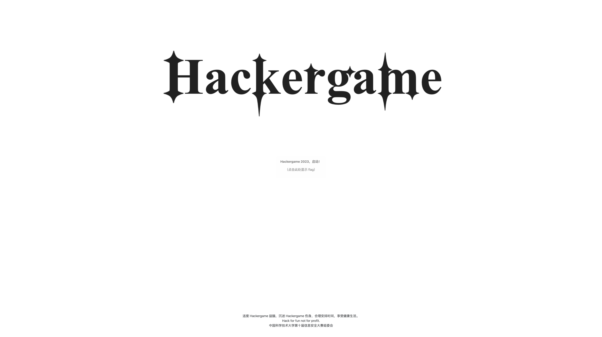  

不玩原神，不评价  

## 猫咪小测
> Q1: 想要借阅世界图书出版公司出版的《A Classical Introduction To Modern Number Theory 2nd ed.》，应当前往中国科学技术大学西区图书馆的哪一层？（30 分）  
> A1: 12
往图书馆里请： http://opac.lib.ustc.edu.cn/opac/search_adv.php#/index
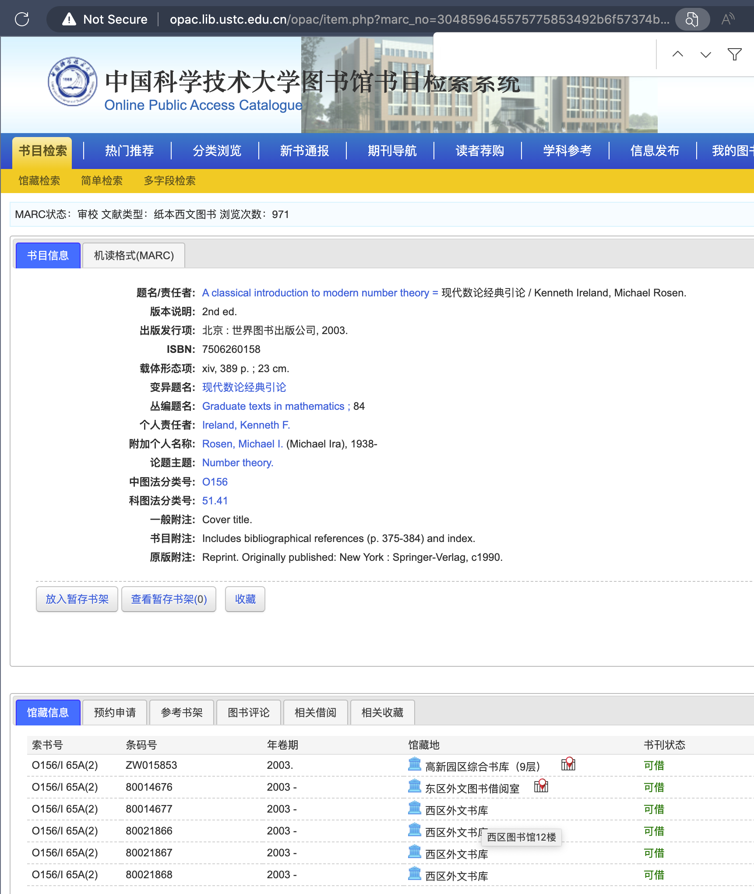  
---
> Q2: 今年 arXiv 网站的天体物理版块上有人发表了一篇关于「可观测宇宙中的鸡的密度上限」的论文，请问论文中作者计算出的鸡密度函数的上限为 10 的多少次方每立方秒差距？（30 分）  
懒得找原文，上穷举：
> A2：23
---
> Q3: 为了支持 TCP BBR 拥塞控制算法，在编译 Linux 内核时应该配置好哪一条内核选项？（20 分）  
> A3: CONFIG_TCP_CONG_BBR

自己问 GPT 去

---
> Q4: 「我……从没觉得写类型标注有意思过」。在一篇论文中，作者给出了能够让 Python 的类型检查器 MyPY mypy 陷入死循环的代码，并证明 Python 的类型检查和停机问题一样困难。请问这篇论文发表在今年的哪个学术会议上？  
> A4: ECOOP  

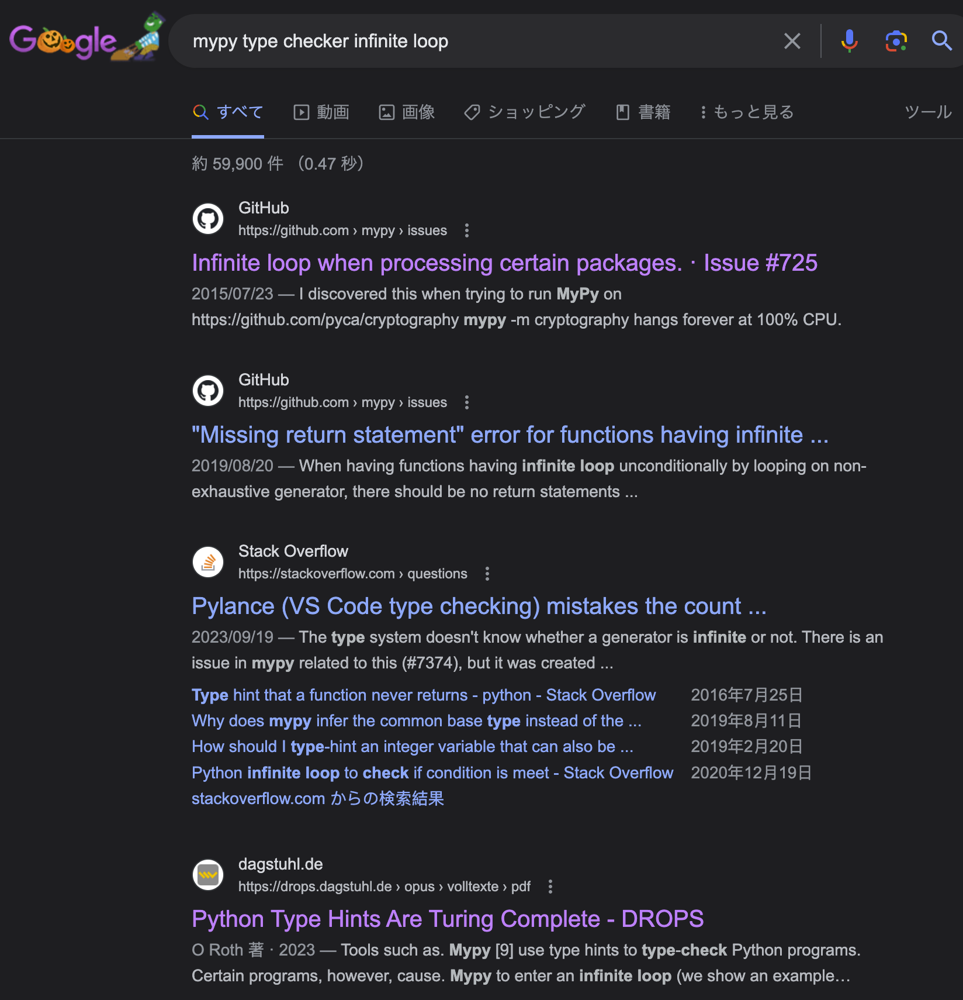  
找到 pdf 后就有出处了。  
Supplementary Material Software (ECOOP 2023 Artifact Evaluation approved artifact):

## 更深更暗
地狱笑话  
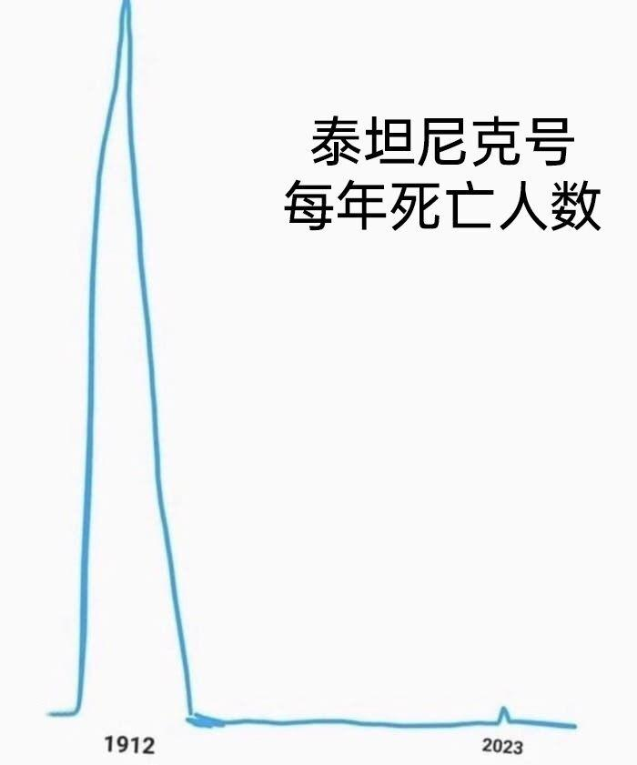  

F12 在底下藏着 flag  
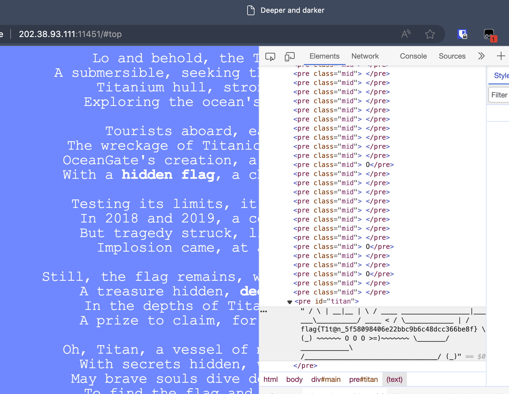  

基于 token 的 sha256 的 flag：
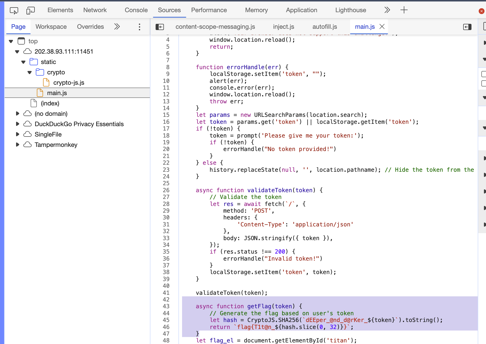  

    async function getFlag(token) {
      // Generate the flag based on user's token
      let hash = CryptoJS.SHA256(`dEEper_@nd_d@rKer_${token}`).toString();
      return `flag{T1t@n_${hash.slice(0, 32)}}`;
    }

## 旅行照片 3.0
> 来日本快一年了甚至没去过上野 >_<

### 上午
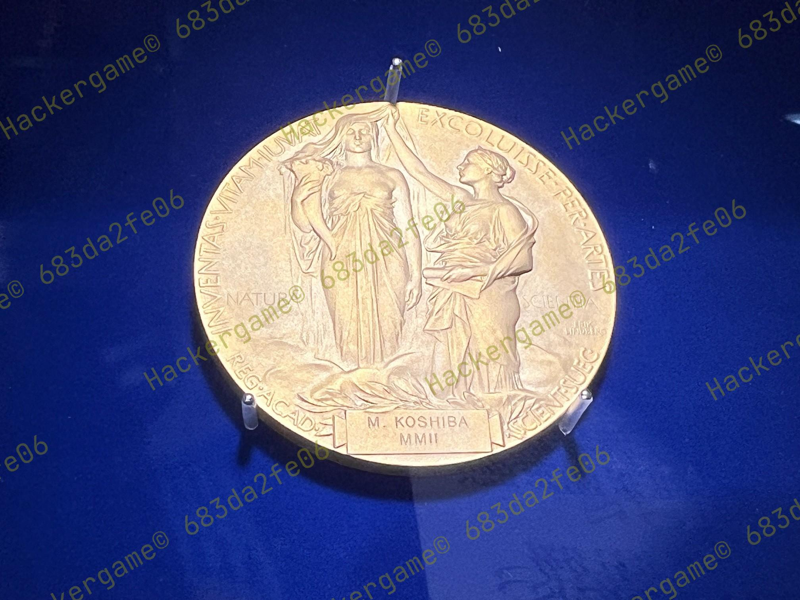  

一眼诺贝尔奖，得奖主人为 koshiba ，日文输入法直接打出来丢 　グウグル　就有了：

ノーベル賞 koshiba
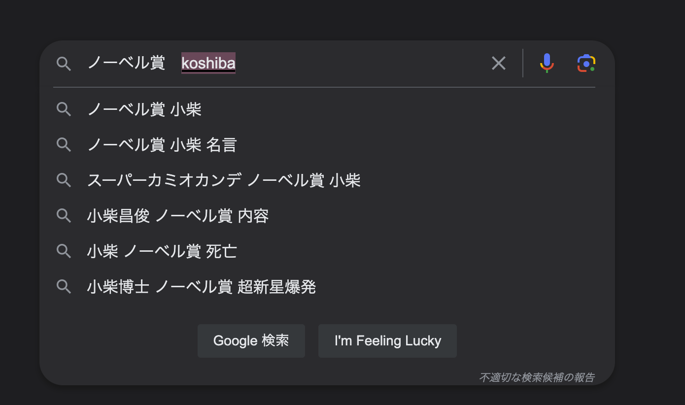  

> 永远怀念小柴昌俊先生。
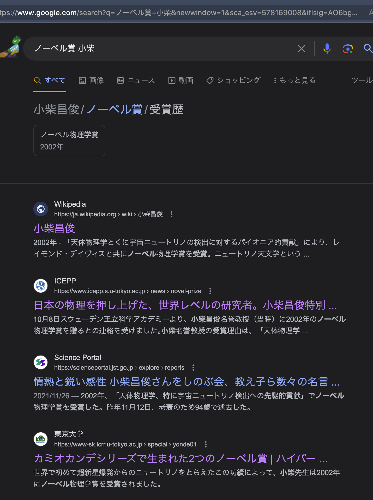  

于是知道作者和朋友参观了东京大学的展览，于是我们搜索东京大学得到诺贝尔奖的名单：  

https://www.s.u-tokyo.ac.jp/ja/gallery/nobelprize/

还是 iCRR 草（東京大学宇宙線研究所） 

Q2: 在学校该展厅展示的所有同种金色奖牌的得主中，出生最晚者获奖时所在的研究所缩写是什么？  
A2: ICRR

Q1: 你还记得与学长见面这天是哪一天吗？（格式：yyyy-mm-dd）  
A1: 2023-08-10  
这个答案也太臭了吧（绝望）  
^ 当初是做第二题推断出第一题的，请看第二问的分析。
### 中午
> 离开校园后，你和学长走到了附近的一家拉面馆用餐。那家店里的拉面香气扑鼻，店内的装饰和氛围也充满了日式的风格。 学长（下图左一）与你分享了不少学校的趣事。饭后，你们决定在附近散步，享受这难得的闲暇时光。当你们走到一座博物馆前时， 马路对面的喷泉和它周围的景色引起了你的注意。下午，白色的帐篷里即将举办一场大型活动，人们忙碌的身影穿梭其中，充满了期待与热情。

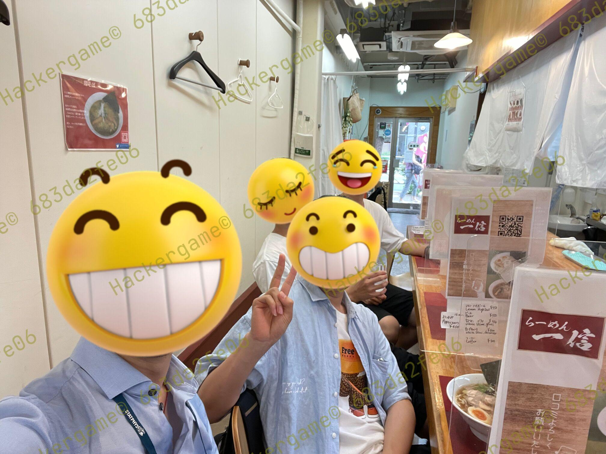  

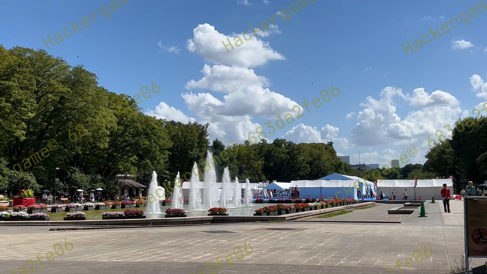  

拉面馆名字叫 ラーメン　一信　不会打日语的应该也很容易打得出来， グウグル　マップ　一搜就有了，不搜也没关系，不影响解题（题目说了在上野附近逛，还是可以找到喷泉所在的地方的）  
于是在 Google earth 一个公园一个公园点过去，终于找到了所在公园 --- 上野公园。
（搜索过程略，比对了快1小时）  

我们再看看问题：
Q3:帐篷中活动招募志愿者时用于收集报名信息的在线问卷的编号（以字母 S 开头后接数字）是多少？
生草，不知道时间还能怎么办？
这里我们继续搜索：

上野公園 イベント ボランティア  
中文翻译：  
上野公园  活动  志愿者  

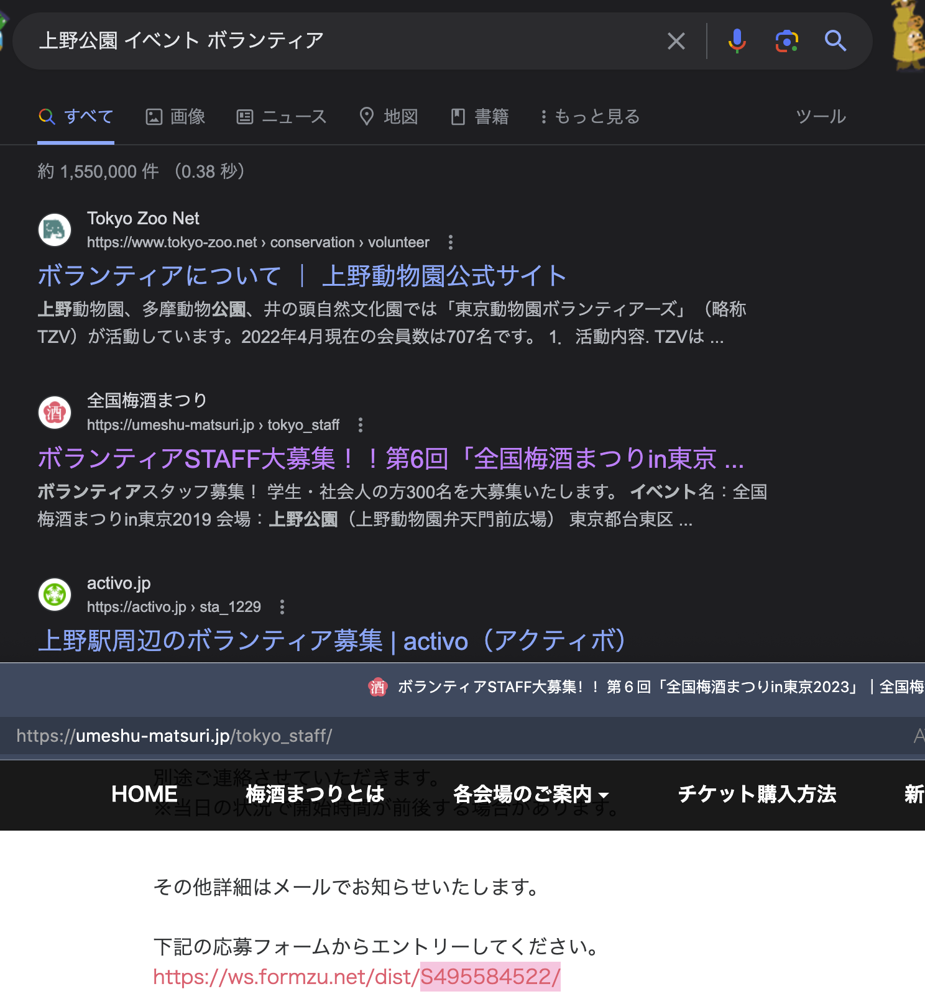  

A3：S495584522

活动上的时间是 2023年8月10日到13日，于是第一题手动爆破就可以得到答案了。  
A1: 2023-08-10

事后复盘，只要搜索 博物館 噴水 基本上就只有一个地方了，上野公园：
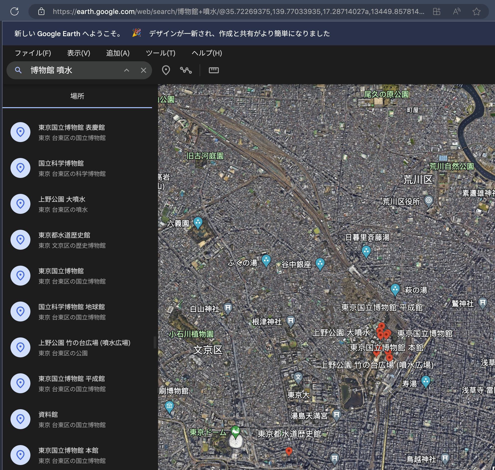 

### 下午

这套社工题我都做了一个下午时间，大家是如何得到 400 份做出来的成绩的？是有奇迹发生么。  
学长到底去哪里了¿
## 赛博井字棋
对方的棋子可以盖过去，不说什么了。  
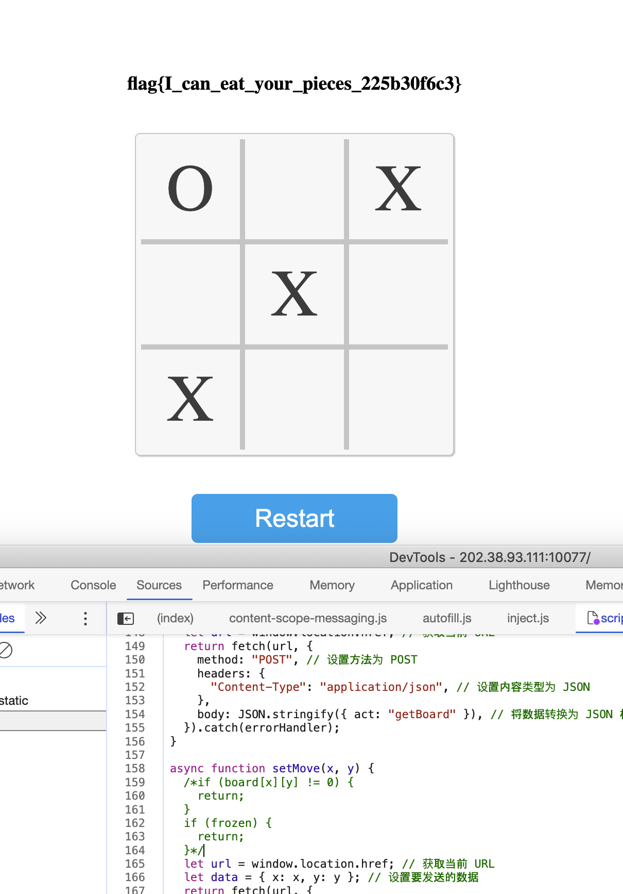  
把此处判断去掉即可，当然也可以手动发包。

## 奶奶的睡前 flag 故事
>「这个地方怎么连个华为手机都不卖。若是买个苹果手机，心疼的是它连个实体 SIM 卡槽都藏起来了，回国肯定成了个大摆设。不如来个谷歌的『亲儿子』？」L 同学踌躇满志地嘀咕道。  
> 那时，像是上天的安排，「咱这儿正好有个谷歌『亲儿子』的老手机，你拿去逍遥吧」。  
> L 同学满眼星光地接过，连系统都没心思升级，就开始疯狂安装那个久闻大名的 GPT 程序，甚至雀跃地在群里晒出一张跟 GPT 对话的精彩截图，一时间成为了群里的焦点人物。

已经说的这么明显了，是 CVE-2023-21036 ，丢 https://acropalypse.app/ 解下半部分就行。

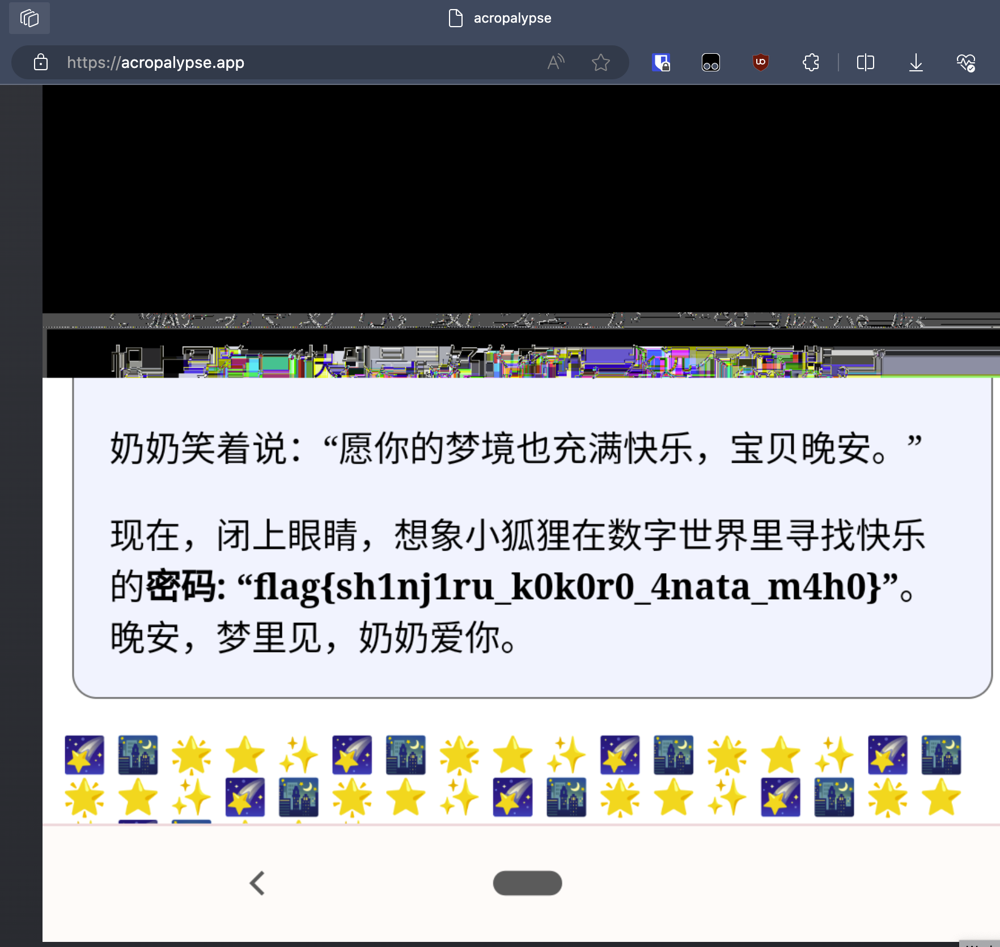  

## 组委会模拟器
写个脚本撤回即可
    // ==UserScript==
    // @name         撤回带师
    // @match        http://202.38.93.111:10021
    // ==/UserScript==

    setInterval(() => {
        const chatList = document.querySelectorAll('.fakeqq-container > div')
        for (let i = 0; i < chatList.length; i++) {
            const d = chatList[i];
            const text = d.textContent
            if (text.includes('hack[') && text.includes(']')) {
                d.click()
                d.children[0].click()
                console.log(text)
                d.querySelector('.fakeqq-message__bubble').click()
            }
        }
    },1000)

比较懒，这里是循环运行，能用就是

## JSON ⊂ YAML?
### YAML1.1
老朋友，一眼 NaN  

{"a": NaN}

    Input your JSON: {"a": NaN}
    As JSON: {'a': nan}
    As YAML 1.1: {'a': 'NaN'}
    Flag1: flag{faf9facd7c9d64f74a4a746468400a50645e101577}

    No flag2
### YAML1.2
问 gpt 问的 .jpg
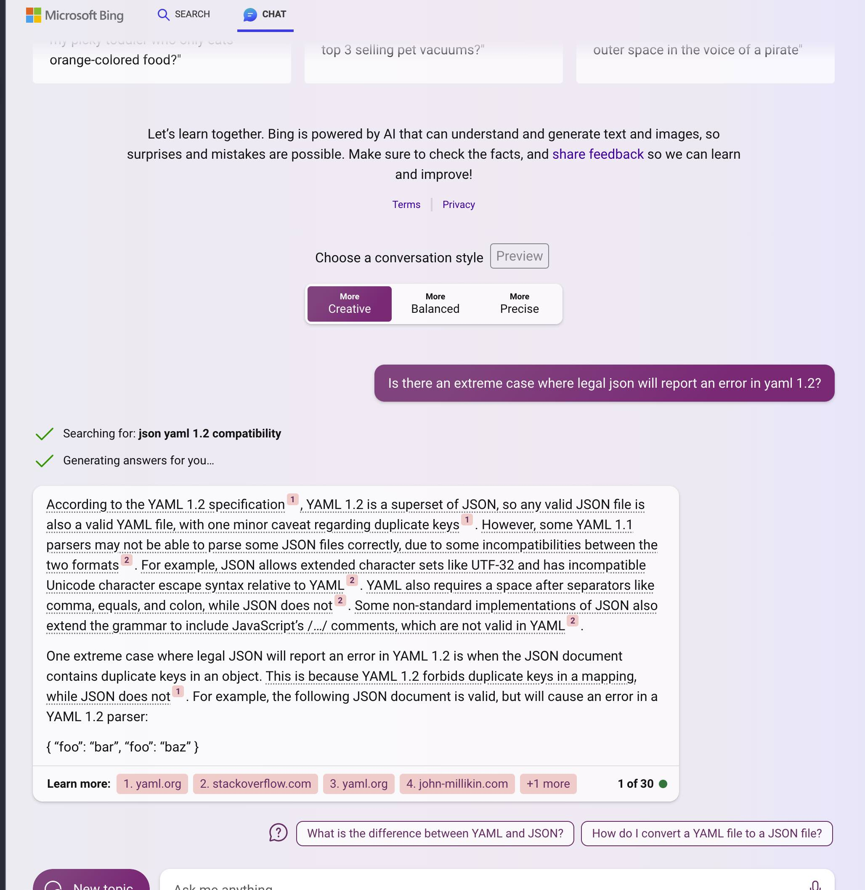  

{"a":1,"a":2}

    Input your JSON: {"a":1,"a":2}
    As JSON: {'a': 2}
    As YAML 1.1: {'a': 2}
    No flag1
    Flag2: flag{b1c73f14d04db546b7e7e24cf1cc7252aaae60c417}

## Git? Git!

`git reflog` 找最近修改然后 `git checkout` 就好了

## HTTP 集邮册
对着 [mdn](https://developer.mozilla.org/zh-CN/docs/Web/HTTP/Status) 一顿读然后构造请求头即可
（内容请展开）

    # 没有状态码
    GET /

    # 100
    GET / HTTP/1.1\r\n
    Expect: 100-continue\r\n
    Host: example.com\r\n\r\n

    # 200 
    看我干什么（

    # 206
    GET / HTTP/1.1\r\n
    Host: example.com\r\n
    Range: bytes=0-10\r\n\r\n

    # 304
    GET / HTTP/1.1\r\n
    Host: example.com\r\n
    If-Modified-Since: Tue, 15 Aug 2023 17:03:04 GMT\r\n
    If-None-Match: "64dbafc8-267"\r\n
    Cache-Control: max-age=0\r\n\r\n

    # 400
    # 太容易触发了，随便玩
    GET / HTTP/1.1\r\n
    Haost: example.com\r\n\r\n

    # 404
    看我干什么（

    # 405
    PUT / HTTP/1.1\r\n
    Host: example.com\r\n\r\n

    # 412
    GET / HTTP/1.1\r\n
    Host: example.com:9999 \r\n
    If-Match: "123456"
    \r\n\r\n

    # 413
    GET / HTTP/1.1\r\n
    Host: example.com:9999 \r\n
    Content-Length: 11451419\r\n
    \r\n\r\n

    # 414
    GET /114514191981085311451419198108531145141919810853114514191981085311451419198108531145141919810853114514191981085311451419198108531145141919810853114514191981085311451419198108531145141919810853114514191981085311451419198108531145141919810853114514191981085311451419198108531145141919810853114514191981085311451419198108531145141919810853114514191981085311451419198108531145141919810853114514191981085311451419198108531145141919810853114514191981085311451419198108531145141919810853114514191981085311451419198108531145141919810853114514191981085311451419198108531145141919810853114514191981085311451419198108531145141919810853114514191981085311451419198108531145141919810853114514191981085311451419198108531145141919810853114514191981085311451419198108531145141919810853114514191981085311451419198108531145141919810853114514191981085311451419198108531145141919810853114514191981085311451419198108531145141919810853114514191981085311451419198108531145141919810853114514191981085311451419198108531145141919810853114514191981085311451419198108531145141919810853114514191981085311451419198108531145141919810853114514191981085311451419198108531145141919810853114514191981085311451419198108531145141919810853114514191981085311451419198108531145141919810853114514191981085311451419198108531145141919810853114514191981085311451419198108531145141919810853114514191981085311451419198108531145141919810853114514191981085311451419198108531145141919810853114514191981085311451419198108531145141919810853114514191981085311451419198108531145141919810853114514191981085311451419198108531145141919810853114514191981085311451419198108531145141919810853114514191981085311451419198108531145141919810853114514191981085311451419198108531145141919810853114514191981085311451419198108531145141919810853114514191981085311451419198108531145141919810853114514191981085311451419198108531145141919810853114514191981085311451419198108531145141919810853114514191981085311451419198108531145141919810853114514191981085311451419198108531145141919810853114514191981085311451419198108531145141919810853114514191981085311451419198108531145141919810853114514191981085311451419198108531145141919810853114514191981085311451419198108531145141919810853114514191981085311451419198108531145141919810853114514191981085311451419198108531145141919810853114514191981085311451419198108531145141919810853114514191981085311451419198108531145141919810853114514191981085311451419198108531145141919810853114514191981085311451419198108531145141919810853114514191981085311451419198108531145141919810853114514191981085311451419198108531145141919810853114514191981085311451419198108531145141919810853114514191981085311451419198108531145141919810853114514191981085311451419198108531145141919810853114514191981085311451419198108531145141919810853114514191981085311451419198108531145141919810853114514191981085311451419198108531145141919810853114514191981085311451419198108531145141919810853114514191981085311451419198108531145141919810853114514191981085311451419198108531145141919810853114514191981085311451419198108531145141919810853114514191981085311451419198108531145141919810853114514191981085311451419198108531145141919810853114514191981085311451419198108531145141919810853114514191981085311451419198108531145141919810853114514191981085311451419198108531145141919810853114514191981085311451419198108531145141919810853114514191981085311451419198108531145141919810853114514191981085311451419198108531145141919810853114514191981085311451419198108531145141919810853114514191981085311451419198108531145141919810853114514191981085311451419198108531145141919810853114514191981085311451419198108531145141919810853114514191981085311451419198108531145141919810853114514191981085311451419198108531145141919810853114514191981085311451419198108531145141919810853114514191981085311451419198108531145141919810853114514191981085311451419198108531145141919810853114514191981085311451419198108531145141919810853114514191981085311451419198108531145141919810853114514191981085311451419198108531145141919810853114514191981085311451419198108531145141919810853114514191981085311451419198108531145141919810853114514191981085311451419198108531145141919810853114514191981085311451419198108531145141919810853114514191981085311451419198108531145141919810853114514191981085311451419198108531145141919810853114514191981085311451419198108531145141919810853114514191981085311451419198108531145141919810853114514191981085311451419198108531145141919810853114514191981085311451419198108531145141919810853114514191981085311451419198108531145141919810853114514191981085311451419198108531145141919810853114514191981085311451419198108531145141919810853114514191981085311451419198108531145141919810853114514191981085311451419198108531145141919810853114514191981085311451419198108531145141919810853114514191981085311451419198108531145141919810853114514191981085311451419198108531145141919810853114514191981085311451419198108531145141919810853114514191981085311451419198108531145141919810853114514191981085311451419198108531145141919810853114514191981085311451419198108531145141919810853114514191981085311451419198108531145141919810853114514191981085311451419198108531145141919810853114514191981085311451419198108531145141919810853114514191981085311451419198108531145141919810853114514191981085311451419198108531145141919810853114514191981085311451419198108531145141919810853114514191981085311451419198108531145141919810853114514191981085311451419198108531145141919810853114514191981085311451419198108531145141919810853114514191981085311451419198108531145141919810853114514191981085311451419198108531145141919810853114514191981085311451419198108531145141919810853114514191981085311451419198108531145141919810853114514191981085311451419198108531145141919810853114514191981085311451419198108531145141919810853114514191981085311451419198108531145141919810853114514191981085311451419198108531145141919810853114514191981085311451419198108531145141919810853114514191981085311451419198108531145141919810853114514191981085311451419198108531145141919810853114514191981085311451419198108531145141919810853114514191981085311451419198108531145141919810853114514191981085311451419198108531145141919810853114514191981085311451419198108531145141919810853114514191981085311451419198108531145141919810853114514191981085311451419198108531145141919810853114514191981085311451419198108531145141919810853114514191981085311451419198108531145141919810853114514191981085311451419198108531145141919810853114514191981085311451419198108531145141919810853114514191981085311451419198108531145141919810853114514191981085311451419198108531145141919810853114514191981085311451419198108531145141919810853114514191981085311451419198108531145141919810853114514191981085311451419198108531145141919810853114514191981085311451419198108531145141919810853114514191981085311451419198108531145141919810853114514191981085311451419198108531145141919810853114514191981085311451419198108531145141919810853114514191981085311451419198108531145141919810853114514191981085311451419198108531145141919810853114514191981085311451419198108531145141919810853114514191981085311451419198108531145141919810853114514191981085311451419198108531145141919810853114514191981085311451419198108531145141919810853114514191981085311451419198108531145141919810853114514191981085311451419198108531145141919810853114514191981085311451419198108531145141919810853114514191981085311451419198108531145141919810853114514191981085311451419198108531145141919810853114514191981085311451419198108531145141919810853114514191981085311451419198108531145141919810853114514191981085311451419198108531145141919810853114514191981085311451419198108531145141919810853114514191981085311451419198108531145141919810853114514191981085311451419198108531145141919810853114514191981085311451419198108531145141919810853114514191981085311451419198108531145141919810853114514191981085311451419198108531145141919810853114514191981085311451419198108531145141919810853114514191981085311451419198108531145141919810853114514191981085311451419198108531145141919810853114514191981085311451419198108531145141919810853114514191981085311451419198108531145141919810853114514191981085311451419198108531145141919810853114514191981085311451419198108531145141919810853114514191981085311451419198108531145141919810853114514191981085311451419198108531145141919810853114514191981085311451419198108531145141919810853114514191981085311451419198108531145141919810853114514191981085311451419198108531145141919810853114514191981085311451419198108531145141919810853114514191981085311451419198108531145141919810853114514191981085311451419198108531145141919810853114514191981085311451419198108531145141919810853114514191981085311451419198108531145141919810853114514191981085311451419198108531145141919810853114514191981085311451419198108531145141919810853114514191981085311451419198108531145141919810853114514191981085311451419198108531145141919810853114514191981085311451419198108531145141919810853114514191981085311451419198108531145141919810853114514191981085311451419198108531145141919810853114514191981085311451419198108531145141919810853114514191981085311451419198108531145141919810853114514191981085311451419198108531145141919810853114514191981085311451419198108531145141919810853114514191981085311451419198108531145141919810853114514191981085311451419198108531145141919810853114514191981085311451419198108531145141919810853 HTTP/1.1\r\n
    Host: example.com\r\n\r\n

    # 416
    GET / HTTP/1.1\r\n
    Host: example.com:9999 \r\n
    Range: bytes=1000-1001
    \r\n\r\n

    # 505
    GET / HTTP/2.0\r\n
    Host: example.com\r\n\r\n

## Docker for Everyone

简单 docker 提权，我们创建一个带特权的容器把 /dev/shm 挂载进来即可

    alpine:~$ docker run -it --rm -v/dev/shm:/mnt alpine
    / # cat /mnt/flag 
    flag{u5e_r00t1ess_conta1ner_22aa7813bf_plz!}
    / # 

## 惜字如金 2.0
今年大放水，随便加几个字符串就做完了  
修复后的源码参考：  

    #!/usr/bin/python3

    def check_equals(left, right):
        if left != right:
            print("g")
            print(left,right)
            exit()

    def get_cod_dict():
        # prepar th cod dict
        cod_dict = []
        cod_dict += ['nymeh1niwemflcir}echaete']
        cod_dict += ['a3g7}kidgojernoetlsup?he']
        cod_dict += ['ulw!ff5soadrhwnrsnstnoeq']
        cod_dict += ['cct{l-findiehaai{oveatas']
        cod_dict += ['ty9kxborszstgguyd?!blm-p']
        check_equals(set(len(s) for s in cod_dict), {24})
        return ''.join(cod_dict)

    def decrypt_data(input_codes):
        # retriev th decrypted data
        cod_dict = get_cod_dict()
        output_chars = [cod_dict[c] for c in input_codes]
        return ''.join(output_chars)

    if __name__ == '__main__':
        # check som obvious things
        check_equals('create', 'cre' + 'ate')
        check_equals('referrer', 'refer' + 'rer')
        # check th flag
        flag = decrypt_data(
        [   53, 41, 85, 109, 75, 1, 33, 48, 77, 90,
            17, 118, 36, 25, 13, 89, 90, 3, 63, 25,
            31, 77, 27, 60, 3, 118, 24, 62, 54, 61,
            25, 63, 77, 36, 5, 32, 60, 67, 113, 28
        ])
        print(flag)
        check_equals(flag.index('flag{'), 0)
        check_equals(flag.index('}'), len(flag) - 1)
        # print th flag
        print(flag)

我们可以解析一下，首先把 `if __name__ == '__main__':` 修了

和之前一样，有个测长度的函数，我们简单改造一下，方便知道哪里错了：  

    def check_equals(left, right):
        if left != right:
            print("g")
            print(left,right)
            exit()

在 get_cod_dict 中，可以看到没个数组（字典）都是 24 个字，先全部末尾加 e

    cod_dict += ['nymeh1niwemflcir}echaete']
    cod_dict += ['a3g7}kidgojernoetlsup?he']
    cod_dict += ['ulw!f5soadrhwnrsnstnoeqe']
    cod_dict += ['ct{l-findiehaai{oveatase']
    cod_dict += ['ty9kxborszstguyd?!blm-pe']

然后肯定不行嘛，不过我们仍然可以找到规律：

    ❯ python3 print_flag.py
    5laulyoufeepr3cvees3df7weparsn3sfr1gwn!
    Traceback (most recent call last):
      File "/Users/h/Downloads/hackergame-2023/print_flag.py", line 38, in <module>
        check_equals(flag.index('flag{'), 0)
                    ^^^^^^^^^^^^^^^^^^^
    ValueError: substring not found

这不就是明摆着是以 `flag{` 开头的吗，于是我们大概就可以猜哪里要补了。  
首先是 `f`，给的顺序是 53，实际显示的是 `5`，所以我把第三行的 `f` 多加了一个（结尾的e记得去掉）  
（运气比较好，一次成功，如果实际上是 `f` 前面的 `w` 或者 了 再试几次就行）  

    cod_dict += ['ulw!ff5soadrhwnrsnstnoeq']

la 没问题，接下来修复为 109 的 `g` ，同样也是 `g` 多加一个

    cod_dict += ['ty9kxborszstgguyd?!blm-p']

然后修复75 的 `{` 不是 `c` 就是 `t` 先猜 `c`

    cod_dict += ['cct{l-findiehaai{oveatas']

结束：

    flag{you-ve-r3cover3d-7he-an5w3r-r1ght?}

这不送分题？

## 🪐 高频率星球

用

    asciinema cat file > a

dump 然后去除杂质即可运行。

源码太长贴不出来，参考官方题解就好？  

## 🪐 小型大语言模型星球
随便玩了玩，没研究
### You Are Smart

prompt 忘了，参考题解吧 >_<

## 为什么要打开 /flag 😡
### LD_PRELOAD, love!
LD_PRELOAD 一眼静态编译

    # gcc -static flag1.c
    #include<stdio.h>

    int main(){
      printf("¿ from huggy\n");
      FILE *file;

      file = fopen("/flag", "r");
      char line[100];
      while (fgets(line, sizeof(line), file) != NULL) {
          printf("%s", line);
      }
      fclose(file);
      return 0;
    }

第二题没研究（

# 残念区
## 旅行照片 3.0
此处也是难度大提升，学术之旅没想到是真的参加学术之旅（而不是摸鱼旅游）
## 微积分计算小练习 2.0
本来是有做计划 window.open 的，但是找不到相关注入点，没想到 .open 的 name 就行 >_<
（由于 25 个字符限制，想不到什么好的 callback 点）

# 总结
今年相比前两年没有那么多时间肝了，不然应该还有2-3题可以干出来的（这次甚至有很多题没有打开过），然后可以预见地明年时间更少，今年也许真的是最后一次参与。

 
 
 
完