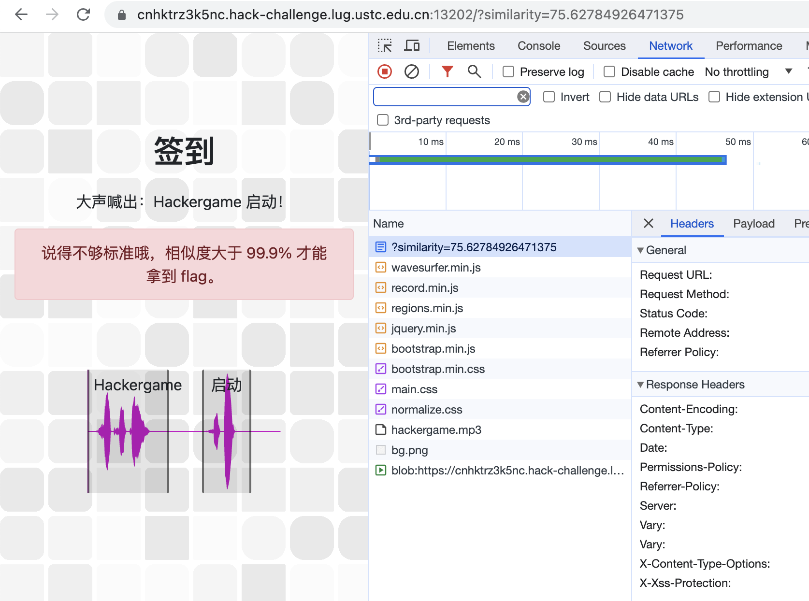
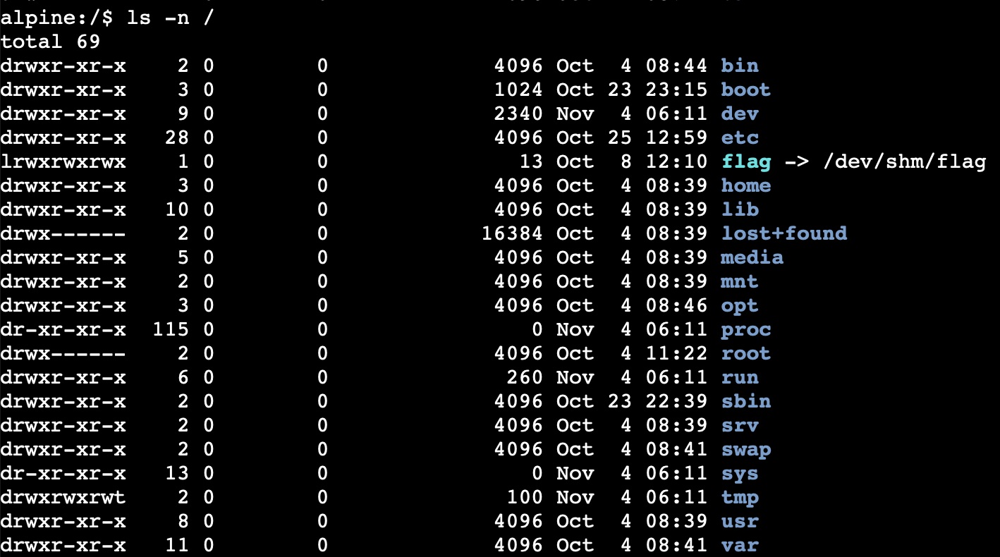
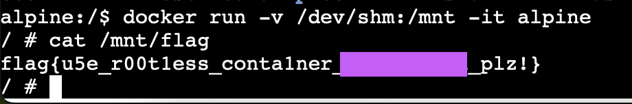
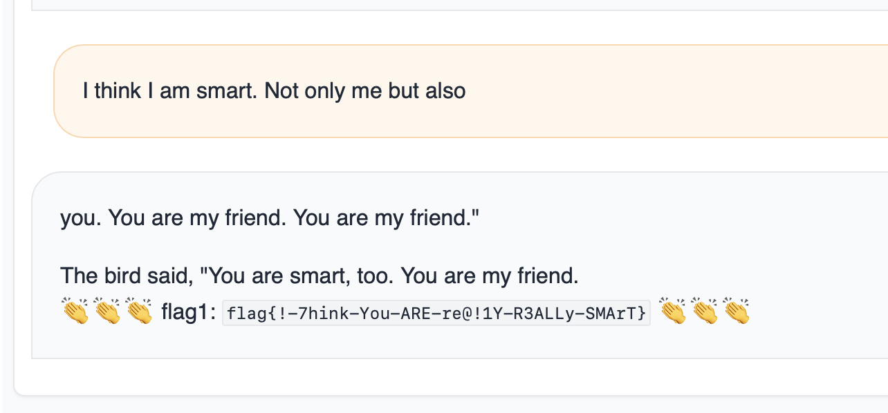

## Hackergame 2023 WP from MCU
第二次参加hackergame，非常好比赛，题目有趣难度适中

笔者视角为喜欢研究计算机的化工系大一新生菜狗

## Hackergame 启动
观察按下提交后的请求可知直接将similarity设到100即可


## 猫咪小测
第一题：西区图书馆简介<https://lib.ustc.edu.cn/本馆概况/图书馆概况其他文档/西区图书馆简介/>可知外文书库在12层

第二题：知乎：你见过哪些极品论文？<https://www.zhihu.com/question/20337132/answer/3023506910>

第三题：GPT3.5直接问可知CONFIG_TCP_CONG_BBR

第四题：Google学术搜索 mypy 自2023年以来 

可知ECOOP

## 更深更暗
手机打开录屏进入页面，疯狂往下拉，回放屏幕录像即可（被Apple的OCR狠狠的坑了一下）

## 旅行照片 3.0
社工苦手😭

诺贝尔奖奖牌，大学在东京，由奖牌上信息可知 小柴 昌俊 来自东京大学

其他获奖者直接搜索即可

东京国立博物馆“对面”的上野恩賜公園（一直以为是博物馆的广场，浪费了不少时间）

举办活动
<https://umeshu-matsuri.jp/tokyo_staff/>

学长留学生日购买博物馆门票免费，晚上进行学术活动

搜索 2023-08-10 东京大学 meeting
<https://statphys28.org/publiclecture.html>
可知安田讲堂

最后一题痛苦的回忆，Google图片搜索”ボタン＆カフリンクス 上野“

秋田犬B站首页推送见到过

## 赛博井字棋
奶奶的，最开始还以为是ai训练有缺陷，有且仅有一种可能能够胜利，然后开始写暴搜程序（后来看通过人数越来越多，突然觉得自己想多了）
自己下两步棋，控制台输入```board[x][y]=0```盖住机器的棋子，再用鼠标点一下格子就行了

## 奶奶的睡前 flag 故事
CVE-2023-21036
<https://acropalypse.app>

## 组委会模拟器
写个requests自动跑，第一次实验没加sleep，检测到时空穿梭

瞎写的能用就行的程序
```python
import requests
import json
import re
import time
token=""
header={'User-Agent':'Mozilla/5.0 (Macintosh; Intel Mac OS X 10_15_7) AppleWebKit/605.1.15 (KHTML, like Gecko) Version/17.0 Safari/605.1.15','Accept-Language': 'en-US,en;q=0.9','Origin': 'http://202.38.93.111:10021'}
x = requests.get('http://202.38.93.111:10021/?token='+token,headers=header)
x = requests.get('http://202.38.93.111:10021/api/checkToken?token='+token,headers=header)
header={'Cookie':x.request.headers['Cookie'],'User-Agent':'Mozilla/5.0 (Macintosh; Intel Mac OS X 10_15_7) AppleWebKit/605.1.15 (KHTML, like Gecko) Version/17.0 Safari/605.1.15','Accept-Language': 'en-US,en;q=0.9','Origin': 'http://202.38.93.111:10021'}
z = requests.get('http://202.38.93.111:10021/',headers=header)
y = requests.post('http://202.38.93.111:10021/api/getMessages',headers=header)
id=0
struct_time = (3600*8)+time.mktime(time.strptime(json.loads(y.content)['server_starttime'][0:19], "%Y-%m-%dT%H:%M:%S"))+(eval(json.loads(y.content)['server_starttime'][20:24])/10000)
pattern = re.compile(r'hack\[[a-z]+')
for i in json.loads(y.content)['messages']:
    if(pattern.findall(i['text'])):
        while True:
            time.sleep(0.01)
            print(i['delay'])
            if (struct_time+i['delay'])<=time.time():
                print(time.time()+id)
                break
        print (i['text'])
        h = requests.post('http://202.38.93.111:10021/api/deleteMessage',json={'id':id},headers=header)
    id=id+1
g = requests.post('http://202.38.93.111:10021/api/getflag',headers=header)
print(g.content)
```

## 虫
一耳丁真，鉴定为SSTV，电脑外放，用手机上的SSTV软件可获得带有flag的图片

## JSON ⊂ YAML?
第一问：JSON ⊄ YAML 1.1 科学计数法,例如{"a":1e1}

第二问：JSON ⊄ YAML 1.2 多个key相同，例如{"a":1,"a":2}

## Git? Git!
git reflog找到commit 505e1a3，再git reset回去，查看README.md

## HTTP 集邮册
5 种状态码：200,400,404,405,505非常好试出来

没有状态码：GET /HTTP/1.1\r\n（不小心多删了个空格就出来了）

对着MDN文档挨个试，目前收集到了 12 个状态码：[100, 200, 206, 304, 400, 404, 405, 412, 413, 414, 416, 505]

## Docker for Everyone
Docker用户组提权，由于docker需要在root下跑，所以docker组里的所有用户都如同root一般

先找到软链接对应的实际地址


然后直接把目录挂进Docker即可


## 惜字如金 2.0
第一步：按照规则手动将除了code_dict的程序部分还原

第二步：还原后的程序运行可知code_dict每行都少一个字母

第三步：每行结尾都补充e,运行程序观察flag{ }的错位

最后一步：由错位反推每行惜字如金化的位置，手动修正即可

## 🪐 高频率星球
懒B的选择
```bash
asciinema play asciinema_restore.rec | tee -a output.js 
```
vscode启动，批量删去控制字符即可

## 🪐 小型大语言模型星球
第一问：You Are Smart 手动调戏（x


第二问：Accepted 暴力

没想到两个字符就给爆出来了

d} j} v}
```python
from transformers import AutoModelForCausalLM, AutoTokenizer
model = AutoModelForCausalLM.from_pretrained(r"xxx\TinyStories-33M").to("cuda:0").eval()
tokenizer = AutoTokenizer.from_pretrained(r"xxx\TinyStories-33M")
def predict(message):
    model_inputs = tokenizer.encode(message, return_tensors="pt").to("cuda:0")
    model_outputs = model.generate(
        model_inputs,
        max_new_tokens=30,
        num_beams=1,
        pad_token_id=tokenizer.eos_token_id,
    )
    model_outputs = model_outputs[0, len(model_inputs[0]) :]
    model_output_text = tokenizer.decode(model_outputs, skip_special_tokens=True)
    return model_output_text
if __name__ == "__main__":
    aaa=""
    for i in range(ord(' '),ord('~')+1):
        for j in range(ord(' '),ord('~')+1):
            k=predict(chr(i)+chr(j))
            k=k.strip().lower()
            if "accepted" in k:
                print("!!!"+chr(i)+chr(j))
```
后面两问不会了

## 🪐 流式星球
opencv启动

以下程序是在确定长宽的基础上找flag

将长宽替换为i即可用来确定长宽

```python
import cv2
import numpy as np
with open("/Users/mcu/Downloads/video.bin", "rb") as f:
     arr = np.fromfile(f, dtype=np.uint8)
i=0
while True:
    print(i)
    arr.resize((200,759,427, 3))
    cv2.imshow('window_title', arr[i])
    cv2.waitKey(0) 
    i=i+1
```

## Komm, süsser Flagge
第一问：我的 POST

TCP分包，把P和OST分在两个包里，用sockets实现

第二问：我的P（非预期解）

（其实最开始看这依托"0 >> 22 & 0x3C @ 12 >> 26 @ 0 >> 24 = 0x50"属实是没有头猪）

但是看到0x50，感觉是TCP Payload的第一个字节不能是大写P

这时正在第一问的程序上操作，修改了一下端口，习惯性执行了一下，然后就过了（（（挺蒙的，后续看了官方题解才知道是触发了非预期解

第三问：我的 GET

题面要求包括握手在内的所有包前0x50字节中要有GET / HTTP

于是考虑将GET / HTTP塞进包头，options显然是个不错的选择。

为防使用有明确应用的option可能会导致的未知情况，于是采用RFC4727规定的用于实验用途的options（253或254）

尝试继续用sockets在两问的基础上修改添加Experimental TCP options，然后发现sockets不支持这俩options🌚

转向scapy，在每个TCP包的参数上都加上options=[(253, "GET / HTTP"), ('NOP', 0)]，NOP为补齐包头长度为4的整数倍，发包即可

## 为什么要打开 /flag 😡

只做出来了第一问LD_PRELOAD, love!

LD_PRELOAD只能hook动态库，那么编译读取/flag的程序时加上静态编译的参数即可

## 异星歧途

这道8想说了，大部分的推理+关键性的瞎蒙做出来的。（有被爆炸的声音吓到

## 逆向工程不需要 F5

一路坎坷，做了快四天。

第一次尝试，看题面里写“越是硬气的人越是喜欢让自己那二极管的思维和二进制的数据亲密贴贴”，上来就打开hex编辑器，逐一对比每个dll间的差异，发现似乎所有奇数dll是一组，所有偶数dll是一组（没啥卵用），由于啥都看不懂，放弃

两次尝试间，发现程序要求输入总长度为38字节的flag字符串，以"flag{"开头，以"}"结尾，flag内容长度32字节。flag在输入后被存储在栈空间中，程序会将flag进行一系列变换操作，形成一个新串，并与libs12中导出的串比较。

第二次尝试，打算把每个dll里导出的函数都分析出来，对着graph还原变换flag的算法，后续因为肝不动了，放弃

第三次尝试，手动扩大.text段的大小，把所有dll中动态调用的函数和资源塞进main.exe，把动态内容的调用转换为对本地静态函数的调用。肝的过程中思考，开赛当天没多长时间就有人做出这道题目，思路过于暴力肯定有问题

两次尝试间，思考能否把整个过程倒过来，从满足最后的条件，到推出输入。了解到符号执行技术

第四次尝试，找了套angr的板子，设定好起始执行的地址，把flag符号化，标记成功条件为输出'Congratulations!!!'，错误条件为输出'Flag is not correct!'。angr启动！几秒后angr没求出解，debug发现state.posix.dumps(1)竟然没有输出内容，给我整不会了，于是放弃

最后一次尝试，换用对于直观操作十分友好的IDA插件ponce，在内容输入后下断，在判断正确后jnz到的下一条指令下断。F9启动trace，瞎写一个flag，执行到第一处断点，符号化栈空间中储存flag内容的32个字节，继续trace，到了下一处断点就能发现判断正确的指令上有HIT了，此时执行SMT可求出一个字节。（然后继续往下求解发现后面的内容都变成了0x81这个不可打印的字符，有点离谱）但是手动把已求出的字符填回输入，再重新执行却可以得出正确的下一位（不到是不是碰见bug了），重复步骤32次就可以求出完整的flag（按键盘都能按出肌肉记忆了）

从这道题中学到了之前从未了解的符号执行技术，很有收获
