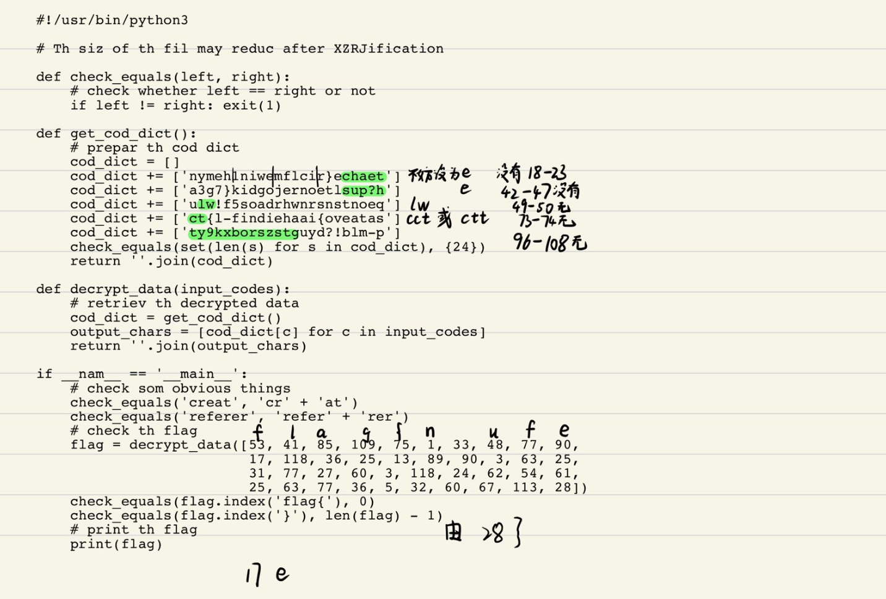
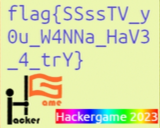

[TOC]

### 感想

我和ChatGPT（3.5）合砍4200分！ChatGPT让0基础打CTF成为可能！

HG真是时间黑洞，感觉像玩游戏一样，实时排行榜pvp也很激动。


### Hackergame 启动

尝试念出Hackergame 启动，匹配度不够，阅读去年签到题解。

观察地址栏并修改URL可解。


### 猫咪小测

1. 想要借阅世界图书出版公司出版的《A Classical Introduction To Modern Number Theory 2nd ed.》，应当前往中国科学技术大学西区图书馆的哪一层？**（30 分）**

   12

   [西区图书馆简介 | 中国科学技术大学图书馆 (ustc.edu.cn)](https://lib.ustc.edu.cn/本馆概况/图书馆概况其他文档/西区图书馆简介/)

2. 今年 arXiv 网站的天体物理版块上有人发表了一篇关于「可观测宇宙中的鸡的密度上限」的论文，请问论文中作者计算出的鸡密度函数的上限为 10 的多少次方每立方秒差距？**（30 分）**

   23

   [[2303.17626\] Nuggets of Wisdom: Determining an Upper Limit on the Number Density of Chickens in the Universe (arxiv.org)](https://arxiv.org/abs/2303.17626)

3. 为了支持 TCP BBR 拥塞控制算法，在**编译** Linux 内核时应该配置好哪一条内核选项？**（20 分）**

   提示：输入格式为 CONFIG_XXXXX，如 CONFIG_SCHED_SMT。

   CONFIG_TCP_CONG_BBR

   问ChatGPT可解

4. 🥒🥒🥒：「我……从没觉得写类型标注有意思过」。在一篇论文中，作者给出了能够让 Python 的类型检查器 ~~MyPY~~ mypy 陷入死循环的代码，并证明 Python 的类型检查和停机问题一样困难。请问这篇论文发表在今年的哪个学术会议上？**（20 分）**
   提示：会议的大写英文简称，比如 ISCA、CCS、ICML。

   ECOOP

   问ChatGPT这篇论文可能发表在哪个学术会议上，ChatGPT说相关研究可能发表在计算机科学、编程语言、静态分析等领域的学术会议上，如OOPSLA、PLDI、POPL等。
   
   追问编程语言、静态分析等领域的知名学术会议有哪些，在ChatGPT给的答案中爆破。


### 更深更暗

浏览器按F12, 0.5s后flag出现在html代码中


### 旅行照片 3.0！

这题真的太有意思了，0基础第一次做这样的题。

除了第一张图上的奖牌获得者人名外，题目的4张图唯一清晰可见的文字信息可能来自于第2张图学长的袋子。


STATPHYS28，搜索发现是今年在东京大学举办的学术会议。


#### 1、你还记得与学长见面这天是哪一天吗？（格式：yyyy-mm-dd）

范围大的话考虑整个今年暑假，通过STATPHYS28可以迅速缩小范围，找到2023-08-10

#### 2、在学校该展厅展示的所有同种金色奖牌的得主中，出生最晚者获奖时所在的研究所缩写是什么？

搜索图1人名可知学校是东京大学，奖牌是诺贝尔物理学奖，与STATPHYS28举办地吻合，双重保障！

然后查看诺贝尔物理学奖历届得主发现好像东京大学出生最晚的获奖者是2015 年获奖的Takaaki Kajita，他在东京大学宇宙射线研究所工作。

搜索可知缩写为ICRR


先猜一手博物馆是东京国立博物馆，在地图上可以看到博物馆距离东京大学和上野站不远。

#### 3

通过地图搜索确定喷泉是上野公园，Google搜索上野公园2023 August，查找可能的活动，确定活动名称后再搜索活动名称+志愿者，最终搜索到包含志愿者招募链接的网页。

[[ボランティアSTAFF大募集！！第６回「全国梅酒まつりin東京2023」｜全国梅酒まつり (umeshu-matsuri.jp)](https://umeshu-matsuri.jp/tokyo_staff/)](https://prtimes.jp/main/html/rd/p/000000035.000021306.html)


#### 4

在东京国立博物馆查到门票1000日元，学生票500，发现都不对？心想该不会学长能免票吧输个0看看，竟然对了！

0


#### 5

通过STATPHYS28主页可以了解日程并锁定英文的集合地点名，搜索发现有2种翻译，安田礼堂和安田讲堂，最终是安田讲堂

安田讲堂


#### 6

一开始搜索引擎死活搜不出有效信息，后面去社交媒体搜索一下子就看到了粉色熊猫海报。

然后一直没理解出站口是哪，一开始以为上野出站口，折腾半天发现上野出站口没3D广告，然后搜索东京3D广告，发现了三花猫，也不对，然后以为马里奥是大阪的主题公园，搜索大阪3D广告找到了秋田犬。

[日本大阪3D广告牌秋田犬呆萌逗趣|日本大阪_新浪财经_新浪网 (sina.com.cn)](https://finance.sina.com.cn/jjxw/2023-07-02/doc-imyzharv7609690.shtml)

结果这题是任天堂附近的东京涩谷出站口的3D广告，也是秋田犬……误打误撞

熊猫-秋田犬


### 赛博井字棋

F12修改监视变量可解


### Git? Git!

搜索引擎学习

```bash
admin@DESKTOP-RJ8J56I MINGW64 /e/USTC/Hackergame/ML-Course-Notes (main)
$ git reflog
ea49f0c (HEAD -> main) HEAD@{0}: commit: Trim trailing spaces
15fd0a1 (origin/main, origin/HEAD) HEAD@{1}: reset: moving to HEAD~
505e1a3 HEAD@{2}: commit: Trim trailing spaces
15fd0a1 (origin/main, origin/HEAD) HEAD@{3}: clone: from https://github.com/dair-ai/ML-Course-Notes.git

admin@DESKTOP-RJ8J56I MINGW64 /e/USTC/Hackergame/ML-Course-Notes (main)
$ git show 15fd0a1 HEAD@{2}
commit 15fd0a13eb46c39f34cfc0dfb4757ad23a23d026 (origin/main, origin/HEAD)
Author: Elvis Saravia <ellfae@gmail.com>
Date:   Sun Feb 12 21:38:54 2023 -0600

    Update README.md

diff --git a/README.md b/README.md
index 93874da..8f13fd4 100644
--- a/README.md
+++ b/README.md
@@ -89,20 +89,6 @@ A place to collaborate and share lecture notes on all topics related to machine
     <td class="tg-yw4l"><a href="https://dair-ai.notion.site/Lecture-5-Deep-Reinforcement-Learning-8ecc8b16a5ad4fcc81b5c3ceb21608b5">Notes</a></td>
     <td class="tg-yw4l"><a href="https://twitter.com/omarsar0">Elvis<a></td>
   </tr>
-  <tr>
-    <td class="tg-yw4l">Limitations and New Frontiers</td>
-    <td class="tg-yw4l">Limitations and New Frontiers in Deep Learning.</td>
-    <td class="tg-yw4l"><a href="https://youtu.be/wySXLRTxAGQ">Video<a></td>
-    <td class="tg-yw4l">WIP</td>
-    <td class="tg-yw4l"><a href="https://twitter.com/omarsar0">Elvis<a></td>
-  </tr>
-  <tr>
-    <td class="tg-yw4l">Autonomous Driving with LiDAR</td>
-    <td class="tg-yw4l">Autonomous Driving with LiDAR.</td>
-    <td class="tg-yw4l"><a href="https://youtu.be/NHZMfSMAHlo">Video<a></td>
-    <td class="tg-yw4l">WIP</td>
-    <td class="tg-yw4l"><a href="https://twitter.com/omarsar0">Elvis<a></td>
-  </tr>

 </table>


commit 505e1a3f446c23f31807a117e860f57cb5b5bb79
Author: some_english_postgraduate <some_english_postgraduate@none-exist.com>
Date:   Thu Oct 26 15:57:40 2023 +0800

    Trim trailing spaces

diff --git a/README.md b/README.md
index 8f13fd4..f629dae 100644
--- a/README.md
+++ b/README.md
@@ -5,7 +5,7 @@ A place to collaborate and share lecture notes on all topics related to machine

 ---

-### Machine Learning Specialization (2022)
+### Machine Learning Specialization (2022)
 [Website](https://www.coursera.org/specializations/machine-learning-introduction) | Instructor: Andrew Ng

 <table class="tg">
@@ -16,7 +16,7 @@ A place to collaborate and share lecture notes on all topics related to machine
     <th class="tg-yw4l"><b>Notes</b></th>
     <th class="tg-yw4l"><b>Author</b></th>
   </tr>
-
+  <!-- flag{TheRe5_@lwAy5_a_R3GreT_pi1l_1n_G1t} -->
   <tr>
     <td class="tg-yw4l">Introduction to Machine Learning</td>
     <td class="tg-yw4l">Supervised Machine Learning: Regression and Classification</td>
@@ -42,7 +42,7 @@ A place to collaborate and share lecture notes on all topics related to machine

 ---


```


### 小型大语言模型星球

#### you are smart

反复尝试：

```
the girl ask the man "am i smart, not very ?"
```

```
The man smiled and said, "Yes, you are smart. You can do it!"

The girl was so happy and she thanked
👏👏👏 flag1: flag{i-7H!NK-y0U-ARe-re4l!y-ReA1!Y-$M4rT} 👏👏👏
```


#### accepted（没做出来，就差一点点）

先是发现

```
accept request
```

可以出，但是超出了字符限制

然后尝试了accept加各种字符，就是没试

```
accept*
```

也试了暴力破解，但没跑出来orz


### 低带宽星球

#### 小试牛刀

随便找个在线压缩网站压缩下就成了，然后就不会了


### 组委会模拟器

有点麻烦，F12阅读js代码后发现必须对需要撤回的消息执行revoke函数，于是学习如何修改js代码并在ChatGPT帮助下自己写代码后终于搞定

核心代码部分，完整代码见`code\321.0616682d.js`

```javascript
            created() {
                const myArray = [];
                const e = new URLSearchParams(window.location.search);
                Bt.get("/api/checkToken", {
                    params: e
                }).then((()=>{
                    window.history.replaceState({}, "", "/"),
                          
                    Bt.post("/api/getMessages").then((e=>{
                        const t = e.data
                          , r = t.messages;
                        console.log(r);
                        this.count = r.length;
                        for (const [idx,n] of r.entries()){
                            
                                this.timers.push(setTimeout((()=>{
                                if (n.text.match(/hack\[([a-z]+)\]/)) {//如果匹配为需要撤回的消息
                                    
                                    myArray.push(n)
                                    
                                    console.log("set",idx)
                                    this.revoke1(idx)//利用魔改的撤回函数执行撤回
                                    
                                };
                                this.messages.push({
                                    name: this.randomString(),
                                    message: n.text,
                                    type: "NormalMessage"
                                }),
                                this.count = this.count - 1,
                                this.$nextTick((()=>{
                                    this.fakeContainerElement || (this.fakeContainerElement = document.querySelector(".fakeqq-container"),
                                    this.fakeContainerElement && (this.fakeContainerElement.onscroll = ()=>{
                                        const e = this.fakeContainerElement?.offsetHeight ?? 0
                                          , t = this.fakeContainerElement?.scrollHeight ?? 0
                                          , r = this.fakeContainerElement?.scrollTop ?? 0;
                                        this.stopScroll = !(e + r >= t - 10)
                                    }
                                    )),
                                    this.stopScroll || (this.currentScrollHeight = this.fakeContainerElement?.scrollHeight ?? 0,
                                    this.fakeContainerElement?.scrollTo(0, this.currentScrollHeight))
                                }
                                ))
                            }
                            ), 1e3 * n.delay))
                        }
                        this.timers.push(setTimeout((()=>{
                            Bt.post("/api/getflag").then((e=>{
                                const t = e.data;
                                // t.success ? alert("获取 flag 失败，原因：" + t.error) : alert("恭喜你，flag 是：" + t.flag)  一开始发现这样不行，必须正确撤回消息
                                t.success ?  alert("恭喜你，flag 是：" + t.flag) : alert("获取 flag 失败，原因：" + t.error) 
                            }
                            )).catch((()=>{
                                alert("网络错误，请刷新页面重新开始1")
                            }
                            ))
                        }
                        ), 1e3 * r[r.length - 1].delay + 5e3))
                    }
                    )).catch((()=>{
                        alert("网络错误，请刷新页面重新开始2")
                    }
                    ))
                }
                )).catch((()=>{
                    window.location.href = "/api/checkToken"
                }
                ))

                for (const n of myArray){
                        console.log(n)
                }
            },
            beforeUnmount() {
                if (this.timers)
                    for (const e of this.timers)
                        clearTimeout(e)
            },
            methods: {
                revoke(e) {
                    this.messages[e].message = "正在撤回...",
                    this.messages[e].type = "ToastMessage",
                    Bt.post("/api/deleteMessage", {
                        id: e
                    }).then((t=>{
                        const r = t.data;
                        r.success ? this.messages[e].message = "你撤回了一条消息" : this.messages[e].message = `撤回失败（${r.error}）`
                    }
                    )).catch((()=>{
                        alert("网络错误，请刷新页面重新开始4")
                    }
                    ))
                },
                revoke1(e) {//魔改的撤回函数，删除了对this.messages的处理，只执行Bt.post
                    Bt.post("/api/deleteMessage", {
                        id: e
                    }).then((t=>{
                        const r = t.data;
                        r.success ? console.log("ok"): console.log("noo!")
                    }
                    )).catch((()=>{
                        alert("网络错误，请刷新页面重新开始4")
                    }
                    ))
                },
```


### YAML

磨人，特别是1.2，我的ChatGPT在这题里始终没帮到我，也可能是提示词不对。

#### JSON ⊄ YAML 1.1

搜索引擎查找后1.1容易解，特别是搜小题标题， json is not subset of yaml 1.1

发现典型的解就是带e的数字表示，例如0e0，除此以外还发现NaN也可以，虽然Json文档说不行


####  JSON ⊄ YAML 1.2

看了Json文档和YAML 1.2文档都搞不出来，搞出了好几个json可以但yaml1.1会崩溃的，突然某天晚上随手一试重复键名就出了……

[JSON 标准 ECMA-404_json标准-CSDN博客](https://blog.csdn.net/qq_41554403/article/details/125481411)


```
{"num": -0.0e0  , "num": -0.00}
```

```
{"n":1,"n":0e0}
```


### 惜字如金2.0

一开始看代码没搞懂，后面上课时对着代码手推搞明白了



关键在于cod_dict长度应该是24，但惜字如金化后的代码里只有23个字符，但是通过代码最后对 'flag{' 和 '}' 的校验可以提示到，可以利用确定的这部分结果反推可能的惜字如金化字符范围，反推后就是上图绿色的部分。


最后其中一种可以正确得到结果的代码

```python
#!/usr/bin/python3

# Th siz of th fil may reduc after XZRJification

def check_equals(left, right):
    # check whether left == right or not
    if left != right: exit(1)

def get_cod_dict():
    # prepar th cod dict
    cod_dict = []
    cod_dict += ['nymeh1niwemflcir}echaete']
    cod_dict += ['a3g7}kidgojernoetlsup?he']
    cod_dict += ['ullw!f5soadrhwnrsnstnoeq']
    cod_dict += ['cct{l-findiehaai{oveatas']
    cod_dict += ['tty9kxborszstguyd?!blm-p']
    check_equals(set(len(s) for s in cod_dict), {24})
    return ''.join(cod_dict)

def decrypt_data(input_codes):
    # retriev th decrypted data
    cod_dict = get_cod_dict()
    output_chars = [cod_dict[c] for c in input_codes]
    return ''.join(output_chars)

if __name__ == '__main__':
    # check som obvious things
    check_equals('create', 'cre' + 'ate')
    check_equals('referrer', 'refer' + 'rer')
    # check th flag
    flag = decrypt_data([53, 41, 85, 109, 75, 1, 33, 48, 77, 90,
                         17, 118, 36, 25, 13, 89, 90, 3, 63, 25,
                         31, 77, 27, 60, 3, 118, 24, 62, 54, 61,
                         25, 63, 77, 36, 5, 32, 60, 67, 113, 28])
    check_equals(flag.index('flag{'), 0)
    check_equals(flag.index('}'), len(flag) - 1)
    # print th flag
    print(flag)
```


### HTTP集邮册

我的最终结果：

你目前收集到了 12 个状态码：[100, 200, 206, 304, 400, 404, 405, 412, 413, 414, 416, 505]

听说有13个，我这12个部分乱推的没了。后面大部分是对照着MDN的状态码大全，问ChatGPT你能不能构造一个xxx状态码的请求，我批判性地去尝试（

#### 没有状态 

试出来的，后面发现好像GET也行

```http
TRACE /\r\n\r\n
```


##### 416

```http
GET / HTTP/1.1\r\n
Host: example.com\r\n
Range: bytes=1000-2000\r\n\r\n
```


##### 412

```http
GET / HTTP/1.1\r\n
Host: example.com\r\n
If-Match: 666\r\n\r\n
```


##### 206

```http
GET / HTTP/1.1\r\n
Host: example.com\r\n
Range: bytes=0-499\r\n\r\n
```


##### 304

```http
GET / HTTP/1.1\r\n
Host: example.com\r\n
If-None-Match: "64dbafc8-267"\r\n\r\n
```


##### 414

这个卡住我了，当时ChatGPT给了一个GET /long-url 之类的写法，我略微增长后发现不行就跳过了。

后面看某个文档才发现GET URL的长度要超过2048个字符才能触发服务器返回414状态，于是我疯狂复制粘贴延长URL

```http
GET /??????????????v这里有超过2048个字符v2=2,v333================3 HTTP/1.1\r\n
Host: example.com\r\n\r\n
```


### Docker for Everyone

居然有我能比较轻松解出的题目！以前上操作系统实验要用docker挂载目录，于是无需别人提示我就想到挂载目录是否可行，果然可以！

```bash
alpine:/$ ls -l /flag
lrwxrwxrwx    1 root     root            13 Oct  8 12:10 /flag -> /dev/shm/flag
alpine:/$ cd dev/shm/flag
-ash: cd: can't cd to dev/shm/flag: Not a directory
alpine:/$ cd dev
alpine:/dev$ ls
block            sr0              tty30            tty57
bsg              stderr           tty31            tty58
cdrom            stdin            tty32            tty59
console          stdout           tty33            tty6
cpu_dma_latency  tty              tty34            tty60
disk             tty0             tty35            tty61
fd               tty1             tty36            tty62
full             tty10            tty37            tty63
kmsg             tty11            tty38            tty7
loop             tty12            tty39            tty8
loop-control     tty13            tty4             tty9
loop0            tty14            tty40            ttyS0
loop1            tty15            tty41            ttyS1
loop2            tty16            tty42            ttyS2
loop3            tty17            tty43            ttyS3
loop4            tty18            tty44            urandom
loop5            tty19            tty45            vcs
loop6            tty2             tty46            vcs1
loop7            tty20            tty47            vcsa
mem              tty21            tty48            vcsa1
mqueue           tty22            tty49            vcsu
null             tty23            tty5             vcsu1
port             tty24            tty50            vda
ptmx             tty25            tty51            vda1
pts              tty26            tty52            vda2
random           tty27            tty53            vda3
root             tty28            tty54            vdb
rtc0             tty29            tty55            zero
shm              tty3             tty56
alpine:/dev$ cd shm
alpine:/dev/shm$ ls
flag
alpine:/dev/shm$ flag
-ash: flag: not found
alpine:/dev/shm$ docker run -v /dev/shm:/shm -it alpine
/ # ls
bin    etc    lib    mnt    proc   run    shm    sys    usr
dev    home   media  opt    root   sbin   srv    tmp    var
/ # cd shm
/shm # ls
flag
/shm # flag
/bin/sh: flag: not found
/shm # cat flag
flag{u5e_r00t1ess_conta1ner_53424ec4b9_plz!}
alpine:/dev/shm$ cat flag
cat: can't open 'flag': Permission denied
```


### 虫

一开始卡住了，0基础没见过，CTF-wiki的音频隐写没教这个，好在某天中午还是搜到了疑似的信息，进一步搜索后发现了这玩意能空间站，和题目对上了，没错，就是MMSV！

我是通过下面这个视频0基础学习的。

https://www.bilibili.com/video/BV1LE411v7BL


看到图像一步步出现，非常激动人心！




### 奶奶的睡前 flag 故事

一开始没理解对，谷歌亲儿子是Pixel，我以为是什么像素，藏在像素里，然后卡住，同样搜了各种CTF 图像MISC都搞不定。

非常值得一提的是，在我自行摸索的过程种，我确实觉得答案应该就是这个图片下面还有一截被截掉了，而且当我使用截图工具对图像截掉一小点后，会发现文件几乎小了1半（这个BUG是不是一开始就这么被发现的？），但当我照着传统的misc教学里用脚本测试图片宽高，会发现没有问题orz


某天中午bing搜索 png misc pixel 截图 连系统都没心思升级，发现一篇知乎文章

打过码的图片等于没打，用Windows的要小心了 - 差评的文章 - 知乎 https://zhuanlan.zhihu.com/p/619038753

然后就是这个网站[acropalypse](https://acropalypse.app/) ，选择Pixel 7

看到图像出现，有点生气，就这卡了我好几天！


### 高频率星球

用asciinema工具（LInux）下，cat输出到文件，然后发现有一堆乱码，查询发现是控制字符。

然后我就被卡住了，研究了好几天如何输出不带控制字符的文件，都没研究出来。

某天心一横，直接Ctrl+H替换，发现乱码替换就行，我真傻

完整代码见`code\flag.js`


### 异星歧途

进入游戏，开启建筑状态显示，出了按钮点点其他建筑，发现每组按钮都有一个写控制的建筑，进去看逻辑。

第一组

打开逻辑对应的开关

10100101


第二组

研究发现逻辑是是i^2，i不超过15，同时第1个和第6个确定是1

于是196 == 11000100 == 13^2

11000100


第四组，逻辑对应开关，但不理解，于是尝试，发现好像是得给冲击发动机这一路供电，尝试后

01110111能供电


第三组，最麻烦，动不动钍反应堆就炸了，既要看逻辑，也要看建筑是什么功能

资源都打开，泄露管不能开

熔毁消耗冷却液，不能开

钍反应堆最后开

10001100


终于对了

10100101110001001000110001110111


### 流式星球

ChatGPT写脚本，反复尝试宽高组合，有的只能看到乱的条纹

搜索常见视频宽高，发现了一个宽854

宽854->427

高240-360-854-754774-763-759

最后执行脚本，视频非常清晰


看别人的好像有人用条纹估算宽高，有人质因数分解……


代码见`code\recover.py`


### 为什么要打开 /flag

#### stage1（动态库加载函数dlsym）

ChatGPT立大功，先把`stage1/lib.c`丢给它问这是啥，它说

这段代码是一个C语言程序，它使用了Linux的动态链接库劫持（LD_PRELOAD技术），通过重定义标准库函数的方式，来修改特定文件操作函数的行为，使它们在处理文件名中包含"flag"的情况下，返回一个伪造的文件名"/fakeflag"，而不是真实的文件名。

于是我学会了一个词叫做 Linux的动态链接库劫持（虽然好像小标题里也有）

然后我就开始尝试不被劫持，让ChatGPT不要用fopen吧啦吧啦，然后它给了好多解决方案，但是都被劫持了……

结果最后我直接问

以下代码使用Linux动态链接劫持了一系列标准库函数 你需要写一个c代码，绕过被劫持的函数，输出file-name文件的内容

它直接给了用动态库加载函数dlsym的正确方法代码，泪目，好像这个函数没有被劫持

代码见`code\dlsym.c`


### Komm, süsser Flagge

卡了很久很久？最后30min做出了前2问，用的拆分包的方法！激动人心！

我的搜索能力还是太弱了，就没搜到这种方法，还是靠依稀的计网记忆想的。

其实在探索时，ChatGPT已经提过可能的手段，但当时我忽略了

```
分片数据包：HTTP请求可以被分割成多个TCP数据包进行传输，特别是对于大型请求。如果字符串"POST"被分割成不同的数据包，规则可能不会同时匹配这些数据包，从而导致规则不起作用。

编码：HTTP请求可以使用不同的编码方式进行传输，如chunked编码。在这种情况下，字符串"POST"可能以不同的方式编码，从而不会以明文形式出现在数据包中。
```

ChatGPT还经常拒绝配合获取flag的行动，通常把flag换成tag它就配合了。


最后当我坚持让ChatGPT用socket写一个拆分tcp包的http请求，很快就收到了invalid token的提示，说明绕过规则成功。

然后我改了token得到flag，发现答案错误？！我发现还能得到第2问flag，也答案错误？！

最后发现，不知怎的，这个flag服务器获取到不完整的token也能生成flag而不是提示invalid token

改正代码后可解

详细代码见`code\chunk.py`

