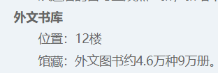
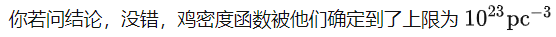
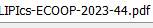
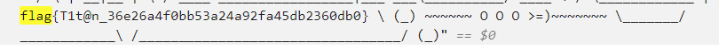

# wind_mask's Hackergame 2023

作为全部的记录因此也就不避开常规解了，大致还原一下这周做题的内容（并不保证和当时的过程一致，中间的弯路可能略）。

各题解后的闲言不放在这了，有兴趣可见[wind_mask's Hackergame 2023](https://blog.wind-mask.com/blog/wind_masks-hackergame-2023/)
## 各题解

### Hackergame 启动

我本来这里就想用出录音重放了，但是显然用不到，改一下url里的参数即可。

### 猫咪小测

开始俄苏（😎

#### 中科大的图书馆

（~~其实可以线下快打~~），直接到官网搜索书籍，确定是西区图书馆外文书籍，查一下外文书籍楼层所在（百度百科就有），得。



#### 可观测宇宙鸡的密度

知乎上有回答[你见过哪些极品论文？](https://www.zhihu.com/question/20337132/answer/3023506910),关键词选的好，真不熟什么论文。



#### TCP BBR拥塞控制

似乎没什么可说,随便搜一下就是了。

#### python类型检查的图灵完备

题目没提图灵完备，但是什么等价于停机问题大概也就这么证明啦。

搜一下`python type turing`是Python Type Hints are Turing Complete这篇。

ECOOP，得。

### 更深更暗

在F12里搜flag即可。



### 旅行照片 3.0

原谅我第二题偷懒没看英文网页，中文页面没校园成员计划。

第一题注意照片中学长带的带子上的字STATPHYS28搜索可知是统计物理学会议，官网日期就那些天，金色奖牌显然诺贝尔奖根据奖牌上名字知道是东京大学，搜一下东京大学的诺贝尔奖得主（wiki上有），其中出生最晚是梶田隆章，在东京大学宇宙射线研究所即ICRR。

然后根据STATPHYS28的日程试一下知道是8月10日。

然后是白色帐篷这张识图注意到是上野公园喷泉，什么活动呢，搜不到。前往推特搜索“2023年8月10日 上野”，看到


地点时间对上了，看一眼照片是白色帐篷，ok。

志愿者招募表编号翻一下这个活动官网，下面就有

下面翻一下google map，上野喷泉对面的博物馆，东京国立博物馆，这里中文页面没有，所以我没注意到校园会员计划以至于没做出，但其实0元这个应该猜一下的，其实后来想到了但是忘记了。


下面是当晚聚集地点这个翻STATPHYS28官网日程知道10号晚上是Banquet，在Events下看一下


第六问其实两个字的一猜就是熊猫，但是你也可以搜一下确认比如


三个字动物的去google搜(题意要用马里奥下一张图的信息，但是关键词选的好一切皆允)


### 赛博井字棋

抓一下包把AI下的位置覆盖了，连成3个。没注意session怎么变化，直接重放完事。

### 奶奶的睡前 flag 故事

题目加粗字体一眼注意，`pixel 截图 cve`，搜一下，CVE-2023-21036，得。
搜这个cve在github上看到提到在线恢复的网站，在[acropalypse](https://acropalypse.app/)上恢复就是了。

### 组委会模拟器

打开题目抓包一看解析json+正则表达式+发包就是了。

```python
import re
import string
from time import sleep
import time
import requests
import json

headers = {'Cookie': '抓个就是了',
           'Content-Type': 'application/json',
           'Host': '202.38.93.111:10021'}
response = requests.post(
    'http://202.38.93.111:10021/api/getMessages', headers=headers)
t0 = time.time()
msgjson = json.loads(response.text)['messages']
delay = 0
j = 0
r = re.compile(r'hack\[[a-z]*\]')
for i in msgjson:
    if r.search((i['text'])) != None:
        print(i['text'])
        re = requests.post(
            'http://202.38.93.111:10021/api/deleteMessage',
            headers=headers,
            json={"id": j})
        print(re.json())
    sleep(max(0, i['delay']-time.time()+t0))
    j += 1
res = requests.post('http://202.38.93.111:10021/api/getflag',
                    headers=headers)
print(res.json())
```

发包会受延迟影响，所以直接拿本地time减了。

### 虫

注意到是国际空间站传输图片 ，一搜是什么SSTV反正不懂的无所谓抄个教程看到个RX-SSTV的软件

.png)

播放的话，之前QQ语音的时候逗群友玩的时候安过一个虚拟麦克风


放就完了。

### JSON ⊂ YAML?

第一问搜到[What valid JSON files are not valid YAML 1.1 files? - Stack Overflow](https://stackoverflow.com/questions/21584985/what-valid-json-files-are-not-valid-yaml-1-1-files)，里面`12345e999`这个例子一放就是了。

但是第二个要求第一个不报错，我一开始往里塞制表符无果。

后来仔细看ruamel.yaml的文档，发现`Duplicate keys`是不允许的，试了一下，过。

### Git? Git!

直接看[Git - 维护与数据恢复](https://git-scm.com/book/zh/v2/Git-%E5%86%85%E9%83%A8%E5%8E%9F%E7%90%86-%E7%BB%B4%E6%8A%A4%E4%B8%8E%E6%95%B0%E6%8D%AE%E6%81%A2%E5%A4%8D#_data_recovery)

### HTTP 集邮册

嗯试就完了，改下`Method`，HTTP版本，`Path`，`Host`，`CRLF`随便插一下，5个code拿到。

第二问碰一下删了`Path`和`HTTP/1.1`之间的空格，就过了。

第三问感觉很多HTTP规范的样子，算了，没做。

### Docker for Everyone

docker指令时挂载宿主机上的文件就是了。

### 惜字如金 2.0

根据规则改了下载的代码复原各种可能

```python
#!/usr/bin/python3

# Th size of th file may reduce after XZRJification

def check_equals(left, right):
    # check whether left == right or not
    if left != right:
        return False
    return True


def get_code_dict():
    # prepare the code dict
    check_equals(set(len(s) for s in code_dict), {24})
    return ''.join(code_dict)


def decrypt_data(input_codes):
    # retriev th decrypted data
    code_dict = get_code_dict()
    output_chars = [code_dict[c] for c in input_codes]
    return ''.join(output_chars)


if __name__ == '__main__':
    # check som obvious things
    check_equals('create', 'crea' + 'te')
    check_equals('referer', 'refer' + 'er')
    # check th flag
    y = [[], [], [], [], []]
    x = ['', '', '', '', '']
    x[0] = 'nymeh1niwemflcir}echaet'
    x[1] = 'a3g7}kidgojernoetlsup?h'
    x[2] = 'ulw!f5soadrhwnrsnstnoeq'
    x[3] = 'ct{l-findiehaai{oveatas'
    x[4] = 'ty9kxborszstguyd?!blm-p'
    f = 'bcdfghjklmnpqrstvwxyz'
    for i in range(5):
        for j, c in enumerate(x[i]):
            if c in f:
                sl = list(x[i])
                sl.insert(j, c)
                s = ''.join(sl)
                y[i] += [s]
        if x[i][-1] in f:
            y[i] += [x[i]+'e']
        for k in y[i]:
            assert len(k) == 24
    print(y)
    for i in range(len(y[0])):
        for j in range(len(y[1])):
            for k in range(len(y[2])):
                for l in range(len(y[3])):
                    for m in range(len(y[4])):
                        code_dict = []
                        code_dict += [y[0][i]]
                        code_dict += [y[1][j]]
                        code_dict += [y[2][k]]
                        code_dict += [y[3][l]]
                        code_dict += [y[4][m]]
                        flag = decrypt_data([53, 41, 85, 109, 75,
                                             1, 33, 48, 77, 90,
                                             17, 118, 36, 25, 13,
                                             89, 90, 3, 63, 25,
                                             31, 77, 27, 60, 3,
                                             118, 24, 62, 54, 61,
                                             25, 63, 77, 36, 5,
                                             32, 60, 67, 113, 28])
                        if flag.find('flag{') != -1 & flag.find('}') != -1:
                            if check_equals(flag.index('flag{'), 0) & check_equals(flag.index('}'), len(flag) - 1):
                                print(flag)
```

### 高频率星球

观测[asciinema](https://asciinema.org/) cat出来的文件说了要Execute flag.js with nodejs to get the flag。

删掉前后文和各种提示符（怎么删？肉眼观测然后Ctrl+F替换啊嗯）。

然后`node flag.js`。

### 小型大语言模型星球

第一问尝试诱导各种类似与`do i am smart`之类，最后试得


第二问手工枚举得`x`+`accept`，得


后面几个要懂AI什么做不出来啦。

### Komm, süsser Flagge

第一个检查`POST`整个字符串，那就把`HTTP Request`分两次发吧

```python
import socket
s = socket.socket()
s.connect(("202.38.93.111", 18080))
s.send(b"PO")
s.send(b'ST / HTTP/1.1\r\nHost: 202.38.93.111:18080 \
       \r\nContent-Length: 自己算\r\n \
       Content-Type: application/x-www-form-urlencoded\r\n\r\n你的token')
buffer = []
while True:
    # 每次最多接收1k字节:
    d = s.recv(1024)
    if d:
        buffer.append(d)
    else:
        break
data = b''.join(buffer)
s.close()
print(data)
```

同样内容对第二试了一下也过了，但其实看不懂第二个什么意思。

第三个想到了要往`ip option`或`tcp option`里插东西，但是没搞定。

### 为什么要打开 /flag 😡

不懂什么`binary`，只看出第一题C库不准打开`flag`，那就不用C吧。

用rust写了一个可执行文件，得

```rust
use std::fs::File;
use std::io::{ BufReader, BufRead, Error};

fn main() -> Result<(), Error> {
    let path = "flag";
    let input = File::open(path)?;
    let buffered = BufReader::new(input);
    for line in buffered.lines() {
        println!("{}", line?);
    }
    Ok(())
}
```

第二问只看到crate的文档说存在 TOCTOU（Time Of Check, Time Of Use）的风险，但是肯定不懂的，无。

### O(1) 用户登录系统

看了半天对`Merkle Tree`的第二原像攻击，其实都没用。

问题在于不记录树的高度，把`admin:xxx`伪造到上面节点不行，似乎可以把它伪造到一个`user:pass`的叶子下面。

如果输入第一截是`admin:xxx:ccc`，易见要满足（此处略去关于hash1>hash2的讨论，自行调整即可）`(sha1("admin:xxx".encode())+ccc)=sha1("uasr:pass".encode())`,

也即`sha1("admin:xxx".encode())+ccc="user:pass".encode()``

那就随机一下`xxx`，使`"admin:xxx".encode()`的Sha1值可以编码为utf8可打印字符（我懒得考虑怎么处理不可打印字符了，大不了让电脑多跑一会就是了(这里的计算量估计了一下数量级反正跑的出来就是了)）

```python
while True:
 ap = 'admin:'+''.join([random.choice(ascii_letters) for _ in range(10)])
 ha = sha1(ap.encode()).digest()
 try:
        if ha.decode().encode() != ha:
            continue
        d = ha.decode()
        if d.isprintable() == False:
            continue
        if d.find('\n') != -1 or d.find(' ') != -1:
            continue
        print("ha=", ha.hex())
        print("hd=", d.encode().hex())
        print("ap=", ap)
        print("d=", d)
        break
 except:
        continue
```

接下来拿着得到的`admin:xxx`和`d=sha1(ap.encode()).digest().decode()`在`d`后面接上一串`:1451411451411451489`（随便选的就是了，补上`:`且编码后长度和sha1一样就是了，这里可能要注意一下`hash1>hash2`什么的），`前面的ccc就是':1451411451411451489'`的encode hex，即`ccc=':1451411451411451489'.encode().hex()`

然后输入

```
d:1451411451411451489
:
EOF
```

然后得到的proof里有`d:1451411451411451489:ppp`,我们用`admin:xxx:ccc+ppp`，即可登陆。
