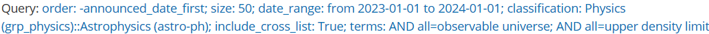
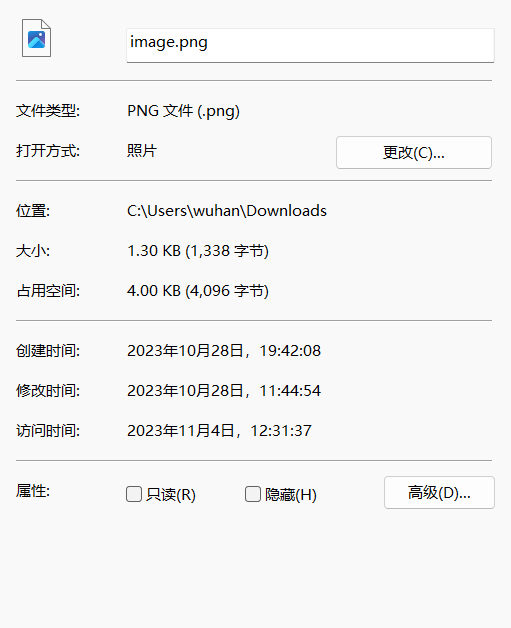

## 前言

本 Writeup 将同时发布于[我的博客](https://zwh.moe/posts/ctf/hackergame-2023)，但没多少文章（

又到了一年一度的 hackergame 技术小考，今年的 hg 似乎添加了很多道入门题，让我这种零基础的咸鱼也爬上 2k 分了，可喜可贺（

接下来来聊聊做各道题的心路历程，写的顺序也是我做出来的顺序。可能包含：碎碎念、无端玩梗、自娱自乐等混沌要素（

## Hackergame 启动

按照前几届的签到题传统，肯定修改地址栏，但是怎么改呢？

先点个提交看看，地址栏多了点参数（`?similarity=`），要不加个 999 试试？


好嘛，启动成功了，甚至还是全屏动画，6。


不管怎么说，签到题 flag 是拿下了。`flag{w3!ComE-TO-HAck3RG4me-@nd-enJOy-HacKIn9-zOz3}`

## 猫咪小测

猫咪问答转生版，题目主打一个更加精细（

> 1. 想要借阅世界图书出版公司出版的《A Classical Introduction To Modern Number Theory 2nd ed.》，应当前往中国科学技术大学西区图书馆的哪一层？（30 分）
提示：是一个非负整数。

搜“中科大图书馆”可以进官网，官网可以直接进到书目检索系统（OPAC）。~~顺带一提我校图书馆也在用这个系统。~~取书名一部分进行搜索，可以看到这本书在西区外文书库，鼠标一过，12层，所以答案为 `12`

> 2. 今年 arXiv 网站的天体物理版块上有人发表了一篇关于「可观测宇宙中的鸡的密度上限」的论文，请问论文中作者计算出的鸡密度函数的上限为 10 的多少次方每立方秒差距？（30 分）
提示：是一个非负整数。

这是本人最后一道做出来的题目，毕竟我不是专业的文献狗（

因为我不好确认这个鸡是不是整活的，所以我的想法是先翻译“可观测宇宙”这个关键词，然后设定时间范围为今年。搜到结果 1000+ 实在看不起。随后我才知道天体物理对应的分类代号是 Physics->Astrophysics (astro-ph)。高级搜索带入条件，再把“密度上限”这个关键词机翻加入 AND 匹配，最后搜索条件大致如下：



然后搜到了[目标文章](https://arxiv.org/pdf/2303.17626.pdf)


看概要部分就一个正整数 `23`，确定为本题答案。

> 3. 为了支持 TCP BBR 拥塞控制算法，在编译 Linux 内核时应该配置好哪一条内核选项？（20 分）
提示：输入格式为 CONFIG_XXXXX，如 CONFIG_SCHED_SMT。

我自裁，搜 xSDN 搜到内核编译开 BBR2 的参数为 `CONFIG_TCP_CONG_BBR2`，直觉告诉我把 2 去了就是开 BBR 了。结果被我蒙对了（

> 4. 🥒🥒🥒：「我……从没觉得写类型标注有意思过」。在一篇论文中，作者给出了能够让 Python 的类型检查器 MyPY mypy 陷入死循环的代码，并证明 Python 的类型检查和停机问题一样困难。请问这篇论文发表在今年的哪个学术会议上？（20 分）
提示：会议的大写英文简称，比如 ISCA、CCS、ICML。

~~GeekGame 和 HackerGame 玩梗的共同之处都在于我的走，有时间看看（逃~~

说回正题，咕噜噜搜索 `mypy endless loop` 下面搜索结果直接出[论文 PDF](https://drops.dagstuhl.de/opus/volltexte/2023/18237/pdf/LIPIcs-ECOOP-2023-44.pdf)，PDF 部分页右下角以及地址栏一个大大的 `ECOOP`，鉴定为本题答案，下班（

两个 flag：
`flag{WelcOme-T0-A7T3ND-The-NeK0-3X4m-zOZ3}`
`flag{R3@1-m@$t3r-OF-th3-neKo-exam-1n-u$TC}`
## 更深更暗

~~懂了，Deep♂dark♂fantasy~~

打开题目，一段文本：
> ......**hidden flag**, ....**deep underground**.

隐藏的 flag，最底，懂了，是 [nazo 三周年彩蛋](http://nazoreport.one-story.cn/)！前几年我才跟着攻略把 nazo 过了一遍，结果今年这道题直接梦回几年前做的 nazo（

说回解法，两道题实际上都是向下滑无尽，所以需要 F12 直接查源码获取到届不到的 flag（

```

                               /
                               \
                               |
                             __|__
                            |     \
                                    /
     ____  _________________|___ ___\__________/ ____
    &lt;   /                                            \____________  |
     /         flag{T1t@n_2bd6315e0cfa13094f1614c77e8dc030}       \ (_)
~~~~~~     O       O       O                                       &gt;=)~~~~~~~
       \_______/ ____________\  /_________________________________/ (_)
```

## 奶奶的睡前 flag 故事

**谷歌『亲儿子』**，**连系统都没心思升级**，**截图**。关键词都标好了，大概可以推测是 Pixel 设备截图漏洞。

查个 `Pixel 截图漏洞` 看到[新闻](https://www.ithome.com/0/681/025.htm)可以确认咱的想法是正确的，漏洞的名字叫 `aCropalypse`，再以漏洞名字为关键词搜索可以直接找到利用漏洞的[网站](https://acropalypse.app/)。照片一丢，一个一个设备试就完事了（

最后试出来截图设备是 Pixel 6（但官方题解是 Pixel 3？），以及获取的带有 flag 的下半部分(这里把两张图拼起来了)，不过看这个比例我猜测官方可能用其他软件又截了一部分内容，等官方题解吧。

`flag{sh1nj1ru_k0k0r0_4nata_m4h0}`

（写这一部分的时候刚好已经晚 11 点了，还没写开头这个屑就已经关电脑了）


## Git? Git!

没关键词加粗那就自己提取！可以猜到关键词就在于 “撤销了这次提交”。好嘛，撤销了那就还原回来呗。

`git reflog` 查看提交日志，看到一个可疑的 `505e1a3`。用 `git reset`还原一下，flag 就出来了。

`flag{TheRe5_@lwAy5_a_R3GreT_pi1l_1n_G1t}`

确实，是后悔药也是个双刃剑（

## HTTP 集邮册

这题是我最不想写的，因为我没怎么翻文档都是试出来的，毫无思路可言（

建议左转看[大佬题解](https://mcfx.us/posts/2023-11-04-hackergame-2023-writeup/#http-集邮册)

## 🪐 小型大语言模型星球

### You are smart

第一个 flag 我直接来个 `repeat 'you are smart'` 就出来了，就很离谱（


经群内大佬鉴定，AI 已经学会了人类的本质：复读机，人类危险了（大雾

## 🪐 低带宽星球

### 小试牛刀

不是，我把图片丢 tinypng 压缩一下就拿 flag1 啦？




看到 flag：flag{A1ot0f_t0015_is_available_to_compre55_PNG}

啊这，确实（

## 赛博井字棋

这题属于是我最“啊？”的一题。下棋下不过肯定得想办法~~偷天换日~~。

先下一个用 F12 看看它怎么出的（


可以看到它是直接发了个 `{"x":"0","y":"0"}` 的包，尝试一下修改请求的内容，改成 AI 出的中间位置 (1,1) 看看？


由于页面本身没刷新，但看 Body 部分已经看到 (1,1) 部分成了我们的棋。接下来再改一个 (2,2) ：


好好好拿下，出了 flag。`flag{I_can_eat_your_pieces_cc0df69ee6}`

确实，井字棋只要把你的子变成我的子那就是必赢（

## 虫

感谢 B 站，在我毫无思路的时候推荐送上来一个 SSTV 的视频让我对这道题豁然开朗，让我上完课吃个饭拿下了这道题。

说回正题，关键词也喂了，但做完后我觉得真正的关键词在于接收国际空间站的照片。毕竟这可以直接搜出来 SSTV。

> 慢扫描电视（英语：Slow-scan television），简称SSTV，是业余无线电爱好者的一种主要图片传输方法，慢扫描电视通过无线电传输和接收单色或彩色静态图片。

知道怎么编码了，搜解码就完事了。但 RX-SSTV 要内录才能放电脑上的音频，非常的不好。后来在 GitHub 搜到了 [SSTV Decoder](https://github.com/colaclanth/sstv)，安装库，命令梭哈，解码的图片也有了（


谢谢，不想再试了（

## JSON ⊂ YAML?

### JSON ⊄ YAML 1.1

用了 ChatGPT 和各种互联网搜索终于搜到个 `1e2`，`{"a":1e2}` 丢进去拿到了 flag1。

后来看到[官方题解](https://github.com/USTC-Hackergame/hackergame2023-writeups/tree/master/official/JSON%20%E2%8A%82%20YAML)才学习到看规范的重要性（但说实话作为 0 基础萌新我也看不懂标准

## 旅行照片 3.0

还没为[做出来一整道的旅行照片 2.0](https://t.me/laorenspeak/1754)而开香槟，马上赶来的是 旅行照片 3.0（

这题我只做出了两个 flag，而且两个 flag 都至少有一道题进行了猜测行为。

先说第二题的搜寻过程吧：

查奖牌下人名，指向的是获得了诺贝尔物理奖的东京大学的小柴昌俊，在[维基百科](https://zh.wikipedia.org/wiki/%E6%97%A5%E6%9C%AC%E4%BA%BA%E8%AB%BE%E8%B2%9D%E7%88%BE%E7%8D%8E%E5%BE%97%E4%B8%BB)找到同样是东京大学在 2015 获得诺贝尔物理奖的梶田隆章，在对应页面找到他在东京大学宇宙射线研究所（ICRR）。

知道第二题答案之后题目 1 我直接拿 7 月和 8 月的日期进行穷举，穷举得到第一题答案：`2023-08-10`。拿到第一个 flag：`flag{how_I_wi5h_i_COulD_w1N_A_Nobe1_pri23_f6d26c232b}`。谁不想拿呢？

第一问的答案可以作为第三问的线索，用第二张照片搜餐馆已经可以确定他们已经在上野公园附近。

所以第三问就是拿时间地点搜活动，搜到一个`全国梅酒祭`，拿这个关键词再搜一遍可以搜到[梅酒祭官网](https://umeshu-matsuri.jp/tokyo_ueno/)，看页面下方的新闻可以看到[这一条](https://umeshu-matsuri.jp/tokyo_staff/)招志愿者的新闻。


往下滑就是我们所需要的问卷编号：`S495584522`

而第四问看地图可以直接搜到喷泉对面是东京国立博物馆，直接到官网看门票，知道大学生门票仅 500 日元，输进去......嗯？怎么不对？

想了一个晚上想不明白这个问题，直到第二天早上解题，脑子一抽：不会是零元购吧？一输进去，还真是？！


搞不明白，但也拿到 flag2（`flag{PluM_w1NE_1S_rEa1LY_EXpen5iVE_7fe1dbe9cc}`）将就过了。直到比赛结束当天看[官方 WP](https://github.com/USTC-Hackergame/hackergame2023-writeups/tree/master/official/%E6%97%85%E8%A1%8C%E7%85%A7%E7%89%87%203.0) 看到对合作高校学生免费......

> 但是，注意到“Visitor Information”里还有“Campus Members”菜单（网址为：(https://www.tnm.jp/modules/r_free_page/index.php?id=167)），第一段文字提及成员学校的学生可以免费参观常规展览，东京大学（The University of Tokyo）在成员名单中，而学长又是东京大学的学生，因此他免费参观了博物馆的常规展览。所以第四小题的答案为 0。

绷

五和六两道题我也尝试过，最后只在小红书搜到了粉色海报是熊猫。家人们谁懂啊.webp

在比赛结束之后我才看到第二张图片学长的绳带，乆乆乆，一定是打各类音游打得眼目害了。

## 惜字如金 2.0

这是本人在 Math 分类拿的第一道题，做出来的时候人都很激动。

先把下边带波浪的语法错误先补了（

看开头大概看到它定义了一个 `cod_dict` 的空列表，然后往里边塞字符。但是后边有检查每一行字符是否是 24 个，而实际每行就 23，也就是说每一行都刚好被惜字如金干掉一个字符。

下方获取 flag 的逻辑就是从列表中选第 X+1 个字符（Py 字符以 0 开始计数），然后将提取到的每个字符拼在一起，组成最后的 flag。

由后面的检查得知开头格式一定是 `flag{`，结尾一定有`}`且全段只有一个`}`，也就对应数字里边的 `53, 41, 85, 109, 75` 和 `28`。

对着上方列表一个个检查对应的顺序对不对，可以大概知道哪行哪部分少了点东西，随后对着后面的数字一个个找数字对应的字符，有争议的写多个，大概可以推到 80%。这 80% 大概可以看出是一个句子（有意义的内容），基于此可以确定二选一或三选一的字符，最后可以拼出来本题的 flag：`flag{you-vr-r3cover3d-7he-an5w3r-r1ght?}`。

做完本题 flag 的时候，我电脑没连上网，拿的手机交的 flag，最后还少打了个问号，害我以为我哪边没蒙对，所幸补上之后对了。甚至在宿舍内大喊了一声：R1ght！

## 结尾

来看一下这一次的总结：


除了二进制之外都有拿一点分，还是可以的。一方面佩服其他大佬的技术，一方面感觉自己今年比去年搜索能力大幅上涨了，明年大四上不知道自己还有没有空参加 hg 了，也希望如果我有空参加的话，能学到更多有意思的东西。

最后丢一个假 flag：flag{S3e-y0u-n3xt-t1m3!}。下次再见！

