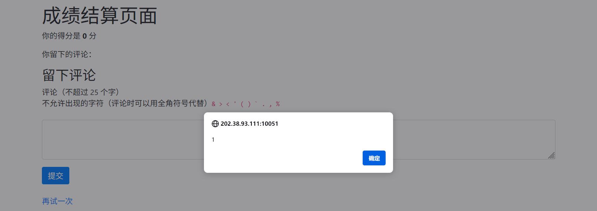

## 21. 微积分计算小练习 2.0

### 尝试与解决

免 责 声 明 ：我做出这道题之前没看题面下面的提示，因此有些迷惑操作请不要见怪。

这题的整个思路有亿点复杂，因此一点点解释。

#### 做做微积分，看看结算界面

拿到这题，首先要做的是看看这个练习网站的成绩结算界面长啥样。随便输入五个答案，提交，我们获得了零昏的好成绩。这次的成绩没有出现在 URL 参数中，看来应该是根据选手 token 存储在后端的。换一个浏览器或者换一个终端设备登录同一个选手账户，也会看到同样的成绩。

然而，最重要的是成绩结算页面下面的输入框，我们可以利用这个在页面上留下一条评论（多次提交会覆盖之前的评论）。这个评论看起来也是存在后端的。

根据题目描述，评论不能超过 25 字符，且有一大堆敏感字符不能碰，这可能是比较安全的，但更可能是滑稽搞笑的。但凡敏感字符中漏了什么，都会导致 XSS 攻击的发生。更何况题目里还说了一句话：

> 留言的长度也做了限制，这样就算能 XSS，也只能弹个框，大概没啥实际危害吧。

这样的**侥幸心理**是更加滑稽搞笑的。基本可以肯定，通过评论进行 XSS 攻击是此题的重要一环。

#### 研究 bot 逻辑

结合 bot 代码和题目描述，可以知道，bot 做的是这些事情：

1. 通过 `BOT_SECRET` 和用户 `id` 登录微积分练习网站。结合代码注释可知，这相当于选手用 token 登录。（注意，因为小 X 决定比赛结束前绝对不去访问成绩页面，这里 bot 登录后并**没有访问**成绩结算界面）
2. 在练习网站上设置 Cookie，内含经过 **URL Encode** 的 flag。
3. 访问选手的网站，也就是选手输入的 HTML 文档。

这里登录的意义在于，如果选手的网站通过某种形式打开了微积分练习网站的成绩结算界面，bot 是**会看到选手留下的评论**的。这就给 XSS 攻击获取 Cookie 提供了机会。

#### 确定回传信息的方式

这次的 bot 不会输出任何页面内容，甚至连出错都不会向选手提供错误信息，因此需要特殊的方法来回传信息。诚然，通过某种手段控制 webdriver 是否报错，可以传输 1bit 的信息，但这肯定不是优先考虑的方式。

事实上，既然 bot 已经以选手身份登录，我们就可以控制 bot 提交一条评论覆盖原来的，这样就能传递不少的信息。不过，必须注意的是，**不能触碰敏感字符**，**不能超过长度限制**。通过下面的代码，我们可以进行简单的验证：

```html
<html lang="en">
<body>
  <form id="comment-form" method="POST" action="http://web/result">
    <input type="text" id="comment" name="comment" value="Hello" />
  </form>
  <script>
    document.getElementById('comment-form').submit()
  </script>
</body>
</html>
```

提交这份代码后，应当能够看到结算页面上的评论被替换为 `Hello`。

#### 确定攻击方式

根据浏览器的安全策略，如果练习网站本身没有 XSS 漏洞，Cookie 应当是**固若金汤**的，bot 访问第三方网站并不能导致泄露练习网站上的 Cookie；而如果选手提供的第三方页面不对练习网站做点什么，那为什么这道题要让 bot 访问选手提供的页面，而非**直接访问成绩结算页面**呢？

这两点论据说明，评论 XSS 和第三方页面两种攻击手段，缺一不可。攻击的方式，一定是评论 XSS 和第三方页面里应外合，形成一个**两面包夹芝士**。

然而，浏览器对于跨域名的网页交互有着非常严格的限制，事实上，第三方页面不可能真正对成绩结算页面**做点什么**，而只能向它**传递被动的信息**；评论 XSS 能做的事情也不多，因为评论最多只能有 25 个字符，但是短短 25 个字符，或许可以**接收**来自第三方页面的信息，并赋予这些信息**活性**，从而做更多的事。这就是**里应外合**的意义。

评论 XSS 也有可能通过某种方法“放弃”浏览器的安全保护机制，主动将控制权暴露给第三方页面，但网上的资料表明，这不是 25 个字符加上一堆敏感字符的限制下能做到的。

#### 评论 XSS 端的攻击实施方式

首先，查看结算页面的源代码，了解页面如何显示选手的评论。

```html
    <script>
      function updateElement(selector, html) {
        document.querySelector(selector).innerHTML = html;
      }

      updateElement("#score", "你的得分是 <b>0</b> 分");
updateElement("#comment", "你留下的评论：Hello");
    </script>
```

看起来似乎是将选手的评论直接插入到 JavaScript 中，并通过 JavaScript 显示到页面的元素上。很明显，这种显示方式存在三个问题：

1. 通过在评论里加入 `</script>`，可以逃逸出脚本环境并注入任意 HTML 内容。但这是做不到的，因为 `<` 是敏感字符。
2. 通过在评论里加入 `"`，可以逃逸出字符串环境；更进一步，再加一个 `)`，可以逃逸出函数参数的环境。后者做不到，但前者却可以，因为 `"` 恰好不是敏感字符。
3. ~~小 X 死不悔改~~，仍然选择通过 `innerHTML` 来显示内容。通过在评论里加入 HTML 标签，可以实现任意元素的插入。这一步中敏感字符不是问题，因为敏感字符可以用转义序列代替（例如 `<` 用 `\x3c` 代替）。

如何在**有限的 25 个字符**中做到**里应**呢？

- 通过方法 3 直接插入 HTML 标签，要想执行脚本，至少要注入 `<svg onload=>` 这一部分代码。考虑到要使用转义序列，只有 6 个字符的空间留给脚本。而脚本要做的，是**读取**来自第三方页面的数据并**赋予其活性**（通过 `eval` 等方式），这是远远不够的。
- 通过方法 2 **执行代码**，完成**里应**的任务也是几乎不可行的。  
  这是因为在不允许使用括号和反引号的情况下，几乎没有办法**调用** `eval` 函数。其他能用的方法都太长了，无法在 25 字符内完成。

看来，难点在如何**赋予活性**上。然而，方法 2 可以向字符串中注入一段可动态加载的内容。例如输入 `"+foo+"`，最后显示的字符串就是 `"：Hello"+foo+""`，变量 foo 就会被加载并注入到其中。而这个注入的动态字符串接下来会被通过 `innerHTML` 显示出来，这就自动赋予了其活性。

因此，最后用来注入的评论应当形如 `"+<something>+"`。

*搞 XSS 攻击从来都没有这么**惜字如金**过*

#### 传递信息的方式

那么，上面提到的 `<something>` 究竟是什么呢？选手的第三方页面如何向成绩结算页面传递信息呢？因为，我们现在的任务太极限了，远非正常业务场景所能遇到的。因此，上网搜索大概是不管用了，只能更多依靠自己想办法了。

首先要问的是，第三方页面以何种方式**打开**成绩结算页面？

1. 通过 `iframe`。然而，为避免 CSRF 攻击，现代浏览器通过 `iframe` 加载页面时是**不会携带 Cookie** 的，这样连微积分练习网站的登录都进行不了，更别说获取 Cookie 中的 flag 了。
2. 通过 `window.open` 在新标签页中打开。考虑到这会~~引入一些不可控因素~~（不看提示导致的），暂不优先考虑。
3. 通过直接重定向。

接下来考虑如何传递信息。

- 通过标准的 `postMessage`。这是不可行的，因为光是注册一个 postMessage 的监听器就不知道要花掉多少字符。这在评论 XSS 端是无法实现的。
- 通过 `window.open` 打开成绩结算页面并获取其 `window` 对象，双方通过存取相同 `window` 中的某些信息来交互（XSS 端可以通过类似 `window["property"]` 的方式读取，从而**避免使用 `.` 字符**）。但是由于跨域的 `window` 对象访问受到限制，这很难做到。
- 通过 `document.referrer` 或 `location`。乍一看这是可行的，但实际上传递不了什么有用的信息，因为 URL 中不能包含 `<` 或 `>` 字符！它们始终会被 URL 编码，这样，XSS 注入端必须通过 `decodeURI` 才能获得**有活性**的内容，但是在如此严格的限制下，调用 `decodeURI` 函数是非常困难的。

然而，第三个方法指明了一条路——我们可以看看除了 `location` 和 `referrer` 外，`window` `document` 对象**还有哪些属性**可以帮助我们传递信息。在浏览器控制台上打出 `window.`，然后逐个翻阅自动补全列表中的项目就可以了解它们。

不出所料，大部分属性都是函数，它们即使能够被赋值，在页面跳转后也大概率会被重置。然而，当我翻到 `window.name`，发现它是一个空字符串时，我长期以来的一个困惑终于解开了：

> 我常常用 VSCode 写 JavaScript/TypeScript 前端代码。究竟是为什么，每当我打出变量名 `name` 时，上面就会出现一条一闪而过的删除线？
>
> 原来是因为 `window` 有一个属性 `name`。这使得 `name` 成为了“全局变量”。并且，一闪而过的删除线表明，`window.name` 是一个已弃用的属性。

顺着这个思路继续往下想。为什么好端端的浏览器窗口，会需要 `name` 呢？`name`，顾“名”思义，是用来**标识**事物以便区分的。因此，`window.name` 就是用来标识窗口的。**转瞬即逝**的标识没有什么意义，因此，`window.name` 应该在页面跳转后是会**保留**的，从而就能用来跨域传递信息。

我们知道，跨域传递信息最安全最标准的方法是使用  `postMessage`，其他任何 JavaScript 或 Cookie 层面的方法，近期都被认为是不安全的。或许正是因为这种“不安全”，`window.name` 才会被弃用（弃用意味着未来可能会失效，但现在可以用）。这让我的信念更加确凿了。

上网搜索 `window.name`，很快就看到了一个开门见山的标题：[【9大跨域解决方案】window.name解决跨域的原理](https://blog.csdn.net/qq_17175013/article/details/89007334)。不出意外的话，我来对地方了。

这篇文章给出了一个场景：

1. 首先，`domain1/a.html` 通过 `iframe` 引用 `domain2/c.html`。
2. `c.html` 加载后会更改 `iframe` 内部窗口的 `window.name`。
3. 接下来，**`domain1/a.html` 修改** `iframe` 的目标**地址**到 `domain1/b.html`。这一步中，`iframe` 内部窗口的 `window.name` 并**不会消失**。
4. 现在，`a.html` 和 `iframe` 内的 `b.html` 的**域名已经相同**了，因此 `a.html` 可以**无限制地访问** `iframe` 的内部窗口了，从而能够读取其 `window.name`。这就实现了 `domain2/c.html` 到 `domain1/a.html` 的跨域通信。

单从**业务场景**看，这种通信方式无疑是一种相当糟糕的手段——能够传递的信息非常有限，且每次传递信息都要进行两次网页加载，效率奇低无比。然而，**对这道题**，这篇文章却似乎**一语道破天机**——`iframe` 内部窗口在跳转前后其实是同一个，并且其 `window.name` 会得到保留。

我们上面说明了，选手第三方页面通过 `iframe` 打开成绩结算页面是不可行的。但是，`window.name` 的保留机制是否对浏览器**顶层窗口**也有效？我们来试试看。由于一个已经弃用的标准可能会出现各种不可靠的行为，我们与 bot 保持一致，用 **Chrome** 浏览器测试。

1. 在浏览器中访问 `https://example.com/`。
2. 打开开发者工具，执行 `window.name = "test"`。
3. 执行 `location.href = "https://example.org/"`，跳转至 `example.org`。
4. 在开发者工具中查询 `window.name` 的值。

这是可以的！

#### 测试 `window.name` 注入

万事俱备。但是为了确保万无一失，我们先测试一下 `window.name` 的注入。

1. 提交评论 `"+name+"`。
2. 在开发者工具中执行 `window.name = '<svg onload=alert(1)>'`。
3. 刷新页面。

为什么没有用呢？打开开发者工具可以发现，`<svg>` 标签确实注入进去了，但是没触发。或许现在的浏览器已经不会为无内容的 `<svg>` 触发 `onload` 了。试试换成 ``。



这个测试表明，我们成功通过注入向页面上注入，并且执行脚本了。更好的消息是，这个脚本现在通过 `window.name` 注入，再也不受 25 字符长度和敏感字符的限制了。

#### 所以呢？

所以可以构造出用于实施攻击的第三方页面了！

```html
<html lang="en">
<body>
  <script>
    const offset = 0;
    const payload = ``;
    window.name = payload;
    location.href = 'http://web/result';
  </script>
</body>
</html>
```

*最后的样子竟然如此简单*

接下来我们要做的，以及会发生的事情也就掐指可算：

1. 手动向成绩结算页面提交评论 `"+name+"`。
2. 提交上述攻击 HTML。
3. bot 先登录练习网站。
4. bot 访问我们的网站，我们将 `payload` 写到了 `window.name` 中，然后直接跳转至成绩结算页面。
5. 成绩结算页面中被注入了一行 `updateElement("#comment", "你留下的评论："+name+"");`。这行代码会将我们放在 `window.name` 中的 `<svg>` 标签原样写到页面正文中。
6. `<svg>` 标签的 `onload` 脚本执行。
   - 脚本首先获取 Cookie，**并将 `%` 替换为 `/`**（因为 `%` 是敏感字符），截取前 25 个字符，填入评论输入框中。
   - 然后模拟点击“提交”按钮提交评论。

然后我们只需要自己刷新成绩结算页面（通过点击地址栏后按 Enter 刷新，**避免重新提交表单**），就可以看到传回的数据了。

```plain
flag=flag/7Bx55_still_ali
```

这显然还不是完整的 flag。我们将 HTML 中的 `offset` 加上 25，重复上面所有步骤，获取接下来 25 个字符。如此往复直到获取到完整的 flag（右括号 `/7D` 可以作为依据）。

```plain
ve/26/3D/3E_/3C+_908838c0
```

```plain
51/7D
```

因此完整的样子是：

```plain
flag=flag/7Bx55_still_alive/26/3D/3E_/3C+_908838c051/7D
```

但是将 `%` 替换为 `/` 可能并不靠谱，万一 flag 中本来就有 `/` 字符呢？于是，我们修改规则，让 `%` 替换为 `*`，再来一轮，得到

```plain
flag=flag*7Bx55_still_alive*26*3D*3E_*3C+_908838c051*7D
```

这样就能确凿地还原出 Cookie 的原样：

```plain
flag=flag%7Bx55_still_alive%26%3D%3E_%3C+_908838c051%7D
```

通过 URL 解码

```js
decodeURIComponent('flag%7Bx55_still_alive%26%3D%3E_%3C+_908838c051%7D')
```

获得：

```plain
flag{x55_still_alive&=>_<+_908838c051}
```

然而交上去却错了。怎么回事呢？

#### 最后一个坑

*~~为死在这一步上的选手默哀（大概率是有的）~~ 哦，提示了啊，那没事了*

规范的 URL 编码中，空格一般编码成 `%20`，但是实践中为了方便，**常常将其替换成 `+`**。例如，观察搜索引擎搜索时的网址，就可以看到：

```plain
https://cn.bing.com/search?q=Pixel+截图裁剪+漏洞
```

这里的 `+` 指的是用户输入的空格。事实上，包括 PHP 在内的许多框架所实现的 URL 解码，都使用了这一约定。因此，我们 flag 中的那个加号可能实际上也是个空格。

```plain
flag{x55_still_alive&=>_< _908838c051}
```

好的，终于过了。

### Flag

```plain
flag{x55_still_alive&=>_< _908838c051}
```

XSS still alive >_<

信息安全的壁垒一定是通过不厌其烦的测试和精益求精的态度打造的，建设过程中切不能有一点侥幸心理，认为“这是个小漏洞，危害不大”。须知，**千里之堤，溃于蚁穴**。

### 不可行的做法

下面的做法也有一定合理性，但似乎都因为不够**惜字如金**而无法实施。

#### XSS 暴露接口

XSS 评论可以通过一些脚本向第三方页面暴露自己的一些信息或控制权。但是，不调用函数，这似乎是做不到的，而在不能使用反引号和括号的情况下调用函数，一定会超出 25 字符。

#### XSS 加载外部脚本

XSS 也可以尝试从第三方网站 `http://localhost:10240` 加载脚本。这个网址的最短可能表示是 `//[::1]:10240` 或者 `//127.1:10240`，都太长了。
