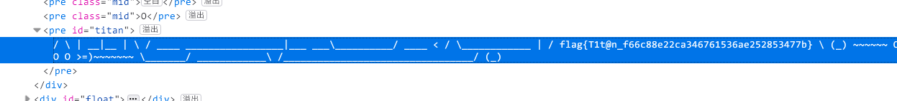
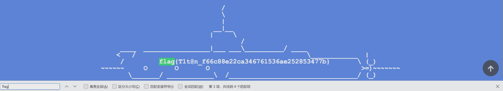

## 3. 更深更暗

### 尝试与解决

> 关键词：开发者工具

我们并不知道 flag 藏在多深的地方。为了尽快跳转，尝试使用浏览器查找功能（Ctrl + F）查找 `flag{`。

结果是，页面并不会滚动，但是底部会出现一个一闪而过的残骸字符画和 flag，这说明 flag 确实是藏在页面中某处的。打开开发者工具的元素检查功能并查找 `flag{`，即可查找出包含 flag 的文本。



### Flag

```plain
flag{T1t@n_f66c88e22ca346761536ae252853477b}
```

### 其他做法

#### 一眼盯帧

我们刚刚提到查找 flag 时会出现一闪而过的 flag 文本。可以使用录屏方式并使用一眼盯帧技能看到 flag。



事实上，在 5000m 之后的地方快速向下滚动，有时残骸也会一闪而过。

### 不可行的做法

#### 海底两万里

并不能通过疯狂滚动直接看到 flag，因为就算到了马里亚纳海沟底部，滚动也不会结束，flag 也不会稳定地显示。

#### 从网页源代码中寻找 flag

如果查看网页源代码，并不能直接找到 flag，因为 flag 是加密写在程序中的，需要由 JavaScript 动态计算得到。然而使用开发者工具直接检查元素，就能绕开这一限制。
