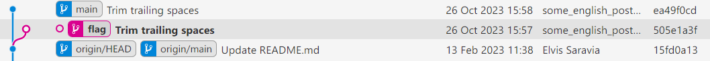

## 10. Git? Git!

### 尝试与解决

> 关键词：Git、孤儿节点

按题目描述，包含 flag 的提交已经从仓库中删掉了，不能再从历史中找到。然而，删除提交只是将节点标记为删除，并且从树中切掉，使其称为“孤儿节点”，并不会立即删掉相关的节点和对象。下一次执行 `git prune` 时，无用的节点才会被彻底删除。

于是，上网搜索“git restore orphan”，就可以找到[手把手教操作的文章](https://confluence.atlassian.com/bbkb/how-to-restore-orphaned-or-deleted-commits-763167184.html)。照着做：


```plain
> git fsck --lost-found
Checking object directories: 100% (256/256), done.
Checking objects: 100% (177/177), done.
dangling commit 505e1a3f446c23f31807a117e860f57cb5b5bb79
> git cat-file -p 505e1a3f446c23f31807a117e860f57cb5b5bb79
tree 738cad0f94e7a927d5ff69d8d94763df30652d3f
parent 15fd0a13eb46c39f34cfc0dfb4757ad23a23d026
author some_english_postgraduate <some_english_postgraduate@none-exist.com> 1698307060 +0800
committer some_english_postgraduate <some_english_postgraduate@none-exist.com> 1698307060 +0800

Trim trailing spaces
```

已经找到了一个孤儿节点，并成功确认了相关信息。继续操作，将提交检出到一个新的 `flag` 分支。

```plain
> git checkout -b flag 505e1a3f446c23f31807a117e860f57cb5b5bb79
```



此时观察检出的 `README.md`，即可找到包含 flag 的注释。

```markdown
    <th class="tg-yw4l"><b>Author</b></th>
  </tr>
  <!-- flag{TheRe5_@lwAy5_a_R3GreT_pi1l_1n_G1t} -->
  <tr>
    <td class="tg-yw4l">Introduction to Machine Learning</td>
```

### Flag

```plain
TheRe5_@lwAy5_a_R3GreT_pi1l_1n_G1t
```

There's always a regret pill in Git. 在 Git 里做错操作，例如误删东西，（几乎）总是有后悔药吃的。
