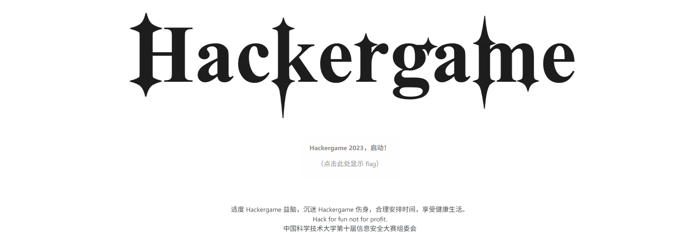

## 1. HackerGame 启动

### 尝试与解决

> 关键词：URL 参数

签到题很可能与[往期](https://github.com/USTC-Hackergame/hackergame2022-writeups)是如出一辙的套路，即通过修改 URL 参数通过验证。不妨先随便录制一段东西。


Wow，金色传说！

点击提交看看效果，果不其然，

```plain
https://[redacted]/?similarity=75.64317516575701
```

```plain
说得不够标准哦，相似度大于 99.9% 才能拿到 flag。
```

只要将网址中的 `similarity` 改成 100，就可以获取 flag 了。



### Flag

```plain
flag{w31COmE-70-HAcKergAMe-ANd-3NjoY-hAcKIN9-20Z3}
```

Welcome to HackerGame and enjoy hacking! 2023

### 其他做法

#### 修改相似度计算逻辑

修改相似度计算逻辑也可以达到目的。不过相比于修改 URL 参数，这有点略显麻烦。

### 不可行的做法

#### 通过虚拟音频内录等手段得到完美音频

据不可靠情报，有选手尝试利用虚拟音频线等手段内录示例音频，但是这样还是不能做到 100% 的相似度。~~想必是因为录制的音频和原音频颜色不一样罢。~~


