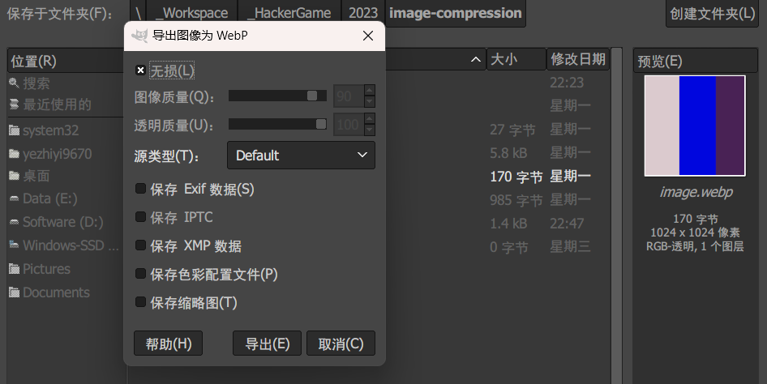

## 17. 🪐 低带宽星球

### 尝试与解决

> 关键词：图像格式、图像压缩

使用常规的压缩工具进行 PNG、JPEG 无损等压缩，得到的文件甚至常常比原文件大。不妨试试大名鼎鼎的高效率格式——WebP。使用 GIMP 打开图像导出为无损 WebP，



170MB！这就拿到了 flag1。

至于 flag2，感觉需要以二极管思维和二进制数据亲密贴贴。我试图看了一下 PNG 和 WebP 的编码标准，然后放弃了。

### Flag

```plain
flag{justfind_an_image_compressor_andgo!}
```

Just find an image compressor and go!
