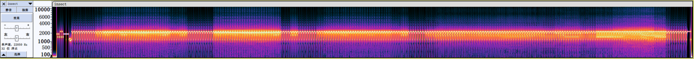

## 8. 虫

### 尝试与解决

> 关键词：音频隐写、SSTV

首先听一听这个奇怪的音频。里面是一些非常规则的、有音高的蜂鸣声的组合。图像可能是通过频谱图隐写的，不妨使用 Audacity 软件看看。



然而这里并不能看出什么有用的信息，频谱图更像是一张规则的信号波形。莫非有什么编码规则？我们直接搜索题面中的关键词：通过无线信道传输图片的方式。

简单检索后，我们知道，确实有一种无线电传输图像的编码规则，叫做 SSTV，编码后的信号确实也是以音频形式存储的。这很可能就是答案了。然而，搜索能够找到的 SSTV Decoder，多数需要从接收设备读取信号，不能直接读取 wav 文件。要解码 wav 文件，还需要配置虚拟音频驱动，非常麻烦。

那不妨去万能 GitHub 搜索一下 SSTV。马上，我们就找到了[一个基于 Python 的解码工具](https://github.com/colaclanth/sstv)。并且，这个工具在 README 中开门见山地说，用法是：

```plain
$ sstv -d audio_file.wav -o result.png
```

这正是我们需要的 wav 文件解码功能。下载并安装这个工具，运行命令：

```plain
$ sstv -d insect.wav -o insect.jpg
```

即可立即得到图像。


### Flag

```plain
flag{SSssTV_y0u_W4NNa_HaV3_4_trY}
```

SSTV you wanna have a try!
