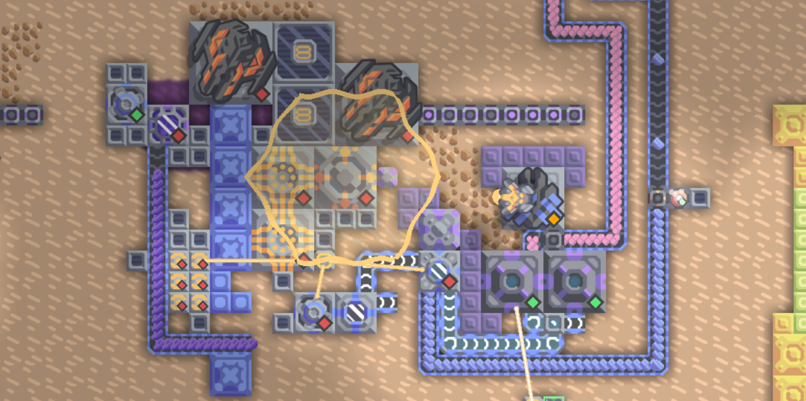

## 20. 异星歧途

### 尝试与解决

> 关键词：多尝试、开技、游戏理解

#### 先让地图跑起来

打开地图后将会降落在左上角，可通过 WASD 移动。图中框出的四组按钮每组各 8 个，共 32 个，可以分别点击。


*舍友：你也开始玩这个了吗？要不要看看新手教程？*

*我：没逝的，相信我的寄术！没有新手教程照样玩！*

*A few seconds later...*


*我：我反应堆呢？*

#### 理解整体结构

纵观整体结构，似乎装置间连接的细线是非常关键的线索。

先看右侧一大坨黄色方块的地方。这里有两种细线，一种是黄色的，一种是白色的。这些线似乎都连接着发电机、电力节点和用电器，看起来像输电线，而结合发电机的工作状态信息可以知道，白色的是有电的线，黄色的是没电的。


上图中心五角星区域就是冲击反应堆，而外边四条输电线连接至四组按钮控制的四个系统。它们看起来就是发电系统。只有当它们都能发电时，冲击反应堆系统才能持续工作。

#### 探索系统 4

尝试点击各种按钮，会发现按钮似乎都是以一种“神秘的超距作用”方式控制着各种组件，莫可原理。然而，第 4 组按钮的控制逻辑非常明显——每个按钮控制下方电力源是否工作。它们的状态变化后一段时间，别的输电线状态也会发生变化，看起来像是一个逻辑电路。

观察系统的电力输出端，可以发现其能够分为两个子系统。合理猜测只有两个子系统的输出输电线都点亮时，最终输出才会点亮。根据各个线缆中发电机的位置，还可以合理判断信号的传导方向。


但是现在按按钮之后整个“电路”的反应太慢了，不方便尝试。我们需要一个变速齿轮。搜索“Mindustry speed up”，即可找到一个[控制时间速度的模组](https://github.com/sk7725/TimeControl)。加载此模组之后，合理调高速度，即可开始尝试。尝试完成后得到：


答案的第四部分：`01110111`

那么，按钮究竟是如何控制电力源的呢？注意到按钮组下面有个奇怪的紫色方块，叫做“微型处理器”。


看来这正是“神秘超距作用”的控制装置。进一步点击编辑按钮，


这就是微处理器的程序。那么，对于剩下三个系统，我们只需要找到微处理器并研究其程序就行了。

#### 探究系统 1

系统 1 看起来是一个简单的火力发电装置，所有开关只控制一个发电机。


查看处理器程序：

```plain
 0 : sensor s1 switch1 @enabled
   : sensor s2 switch2 @enabled
   : sensor s3 switch3 @enabled
   : sensor s4 switch4 @enabled
   : sensor s5 switch5 @enabled
   : sensor s6 switch6 @enabled
   : sensor s7 switch7 @enabled
   : sensor s8 switch8 @enabled
   : jump 18 equal s1 false
   : jump 18 equal s2 true
   : jump 18 equal s3 false
   : jump 18 equal s4 true
   : jump 18 equal s5 true
   : jump 18 equal s6 false
   : jump 18 equal s7 true
   : jump 18 equal s8 false
   : control enabled generator1 1 0 0 0
   : end
18 : control enabled generator1 0 0 0 0
   : end
```

看来 `jump` 的条件不能满足，否则发电机就会被关掉。因此 `switch1` 到 `switch8` 的状态应当是 `10100101`。


答案的第一部分：`10100101`

#### 探索系统 2

系统 2 的处理器不是微型处理器，而是一个大的逻辑处理器，看起来要出现一些复杂的逻辑了。


```plain
 0 : sensor sw1 switch1 @enabled
   : sensor sw2 switch2 @enabled
   : sensor sw3 switch3 @enabled
   : sensor sw4 switch4 @enabled
   : sensor sw5 switch5 @enabled
   : sensor sw6 switch6 @enabled
   : sensor sw7 switch7 @enabled
 7 : sensor sw8 switch8 @enabled
 8 : op shl t sw1 7
   : set number t
   : op shl t sw2 6
   : op add number number t
   : op shl t sw3 5
   : op add number number t
   : op shl t sw4 4
   : op add number number t
   : op shl t sw5 3
   : op add number number t
   : op shl t sw6 2
   : op add number number t
   : op shl t sw7 1
   : op add number number t
   : set t sw8
23 : op add number number t
   : set en 0
   : set i 0
26 : jump 33 greaterThanEq i 16
   : op pow fl0 i 2
28 : jump 31 notEqual fl0 number
   : set en 1
30 : jump 33 always x false
31 : op add i i 1
32 : jump 26 always x false
33 : op equal fl1 0 sw1
   : op equal fl2 0 sw6
   : op or fl3 fl1 fl2
36 : jump 38 equal fl3 0
   : set en 0
38 : control enabled generator1 en 0 0 0
   : control enabled panel1 en 0 0 0
   : end
```

前面（L0-7）显然是读取每个开关的状态，而接下来（L8-23）是将按钮所表示的二进制数值存进 `number`。这里，`switch8` 的值被赋予了最小的权重，也就是说这一组开关的右端是小权值端。

接下来是一段复杂的逻辑，我们来理一下跳转关系写出伪代码：

```cpp
in int sw1, ..., sw8, number;
bool en = false;
int i = 0;
while(i < 16) {  // #26
    int fl0 = i ** 2;
    if(fl0 == number) {  // #28
        en = true;
        break;  // #30
    }  // #31
    instr31: i += 1;
}  // #33
bool fl1 = !sw1;
bool fl2 = !sw6;
bool fl3 = fl1 || fl2;
if(fl3) {  // #36
    en = false;
}  // #38
generator1.enabled = en;
panel1.enabled = en;
```

整理得到，

```cpp
in int sw1, ..., sw8, number;
bool en = false;
for(int i = 0; i < 16; i++) {
    if(i ** 2 == number) {
        en = true;
        break;
    }
}
if(!(sw1 && sw6)) {
    en = false;
}
generator1.enabled = panel1.enabled = en;
```

也就是说，`number` 为完全平方数，并且 `switch1` 和 `switch6` 均开启时（也就是 `number` 的 $2^2$ 和 $2^7$ 二进制位均为 `1`），发电系统才能开启。我们枚举 0~15 的平方，

```python
print("\n".join(list( map(lambda x: bin(x), [i ** 2 for i in range(16)]) )))
```

满足条件的数是 $(11000100)_{\text{bin}} = 196$。

试试看。


答案的第二部分：`11000100`

#### 探索系统 3

现在来到第三部分，也是最容易爆炸的一部分。


系统 2 的最后一个开关甚至作为 `switch9` 添加到了这里。不过既然系统 2 的状态已经确定了，就没必要再考虑 `switch9` 了。

首先，反应堆的运作肯定需要燃料运作。如果之前注意观察反应堆是怎么炸的，会知道这个红色物质就是燃料，因此最后，运输燃料的 `conveyor2` 必须打开。反应堆还需要冷却水，而这个蓝色的东西似乎是产生冷却水所必须的，因此 `gate1` 必须导通。用来产生冷却水的 `mixer1` 也必须开启。`extractor1` 是抽水机，显然必须开启。`conduit1` 和 `conduit2` 会导致冷却水漏出，因此必须截止。

```plain
// --- snip --- (retrieve switch states)
control enabled conveyor2 sw1 0 0 0
control enabled gate1 sw2 0 0 0
op equal nsw3 sw3 0
control enabled reactor1 nsw3 0 0 0
control enabled reactor2 nsw3 0 0 0
control enabled conduit1 sw4 0 0 0
control enabled conduit2 sw4 0 0 0
control enabled mixer1 sw5 0 0 0
control enabled extractor1 sw6 0 0 0
control enabled meltdown1 sw7 0 0 0
control enabled meltdown2 sw7 0 0 0
op equal result sw8 sw9
jump 28 equal result true
control enabled mixer1 0 0 0 0
control enabled conduit2 1 0 0 0
control enabled reactor1 1 0 0 0
control enabled reactor2 1 0 0 0
control enabled conveyor2 1 0 0 0
wait 5
end
```

也就是，

```cpp
conveyor2.enabled = sw1;
gate1.enabled = sw2;
reactor1.enabled = reactor2.enabled = !sw3;
conduit1.enabled = conduit2.enabled = sw4;
mixer1.enabled = sw5;
extractor1.enabled = sw6;
meltdown1.enabled = meltdown2.enabled = sw7;
if(sw8 != sw9) {
    mixer1.enabled = false;
    conduit2.enabled = true;
    reactor1.enabled = reactor2.enabled = true;
    conveyor2.enabled = true;
}
sleep(5);
```

这里的 `sw8 != sw9` 分支显然是自毁程序，因为这会启用反应堆、添加燃料并且不给冷却水。因此，我们只需要观察上面部分。根据之前的分析，八个按钮的状态是 `100011?0`。

*需要特别注意，`enabled = false` 状态的 `gate` 才是导通的，这不难观察出来。*

`switch7` 的状态还不能确定，因为不知道 `meltdown` 是啥，但是试一下就知道了。调节按钮过程中应当先打开 `switch3` 关闭反应堆，最后再关闭 `switch3` 开启反应堆，防止中道崩殂。

先将 `switch7` 打开试试，可以看到一段时间后，图中的大六边形变小了。



又过了一段时间，冷却水管道里的水越来越少了，然后...


看来 `meltdown` 是不能开启的。


答案的第三部分：`10001100`

#### 冲击反应堆，启动！

答案：`10100101 11000100 10001100 01110111`


#### Flag，启动！

序列：`10100101110001001000110001110111`

```plain
请输入按钮序列，1 表示开，0 表示关，顺序从左到右：(如 00001111000011110000111100001111):
10100101110001001000110001110111
成功！
flag{B34WarE_0f_#xp1osi0N_f71c7d166f}
```

### Flag

```plain
flag{B34WarE_0f_#xp1osi0N_f71c7d166f}
```

Beware of explosion! 你说得对，


猜猜重开了多少次 : (
