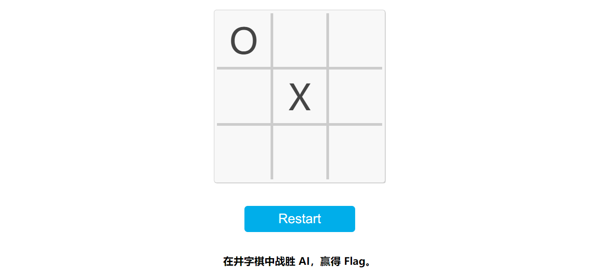

## 5. 赛博井字棋

### 尝试与解决

> 关键词：非法请求

众所周知，井字棋后手是有必平局策略的，和 AI 下，怎么可能赢嘛！除非 AI 出现失误。失误是指玩家先手在中间落子后，AI 将棋下载边上而非角上。这时，玩家有必胜策略。

尝试几次后，不难发现 AI 确实不会失误。这下坏了。

然而，这个网页有一点行为非常怪异——玩家点击棋盘后落子并不会立即显示，而是会卡一下之后和电脑的落子一起显示。这说明，AI 的下棋逻辑是后端处理的。果不其然，


那么能否尝试修改会话的状态的？简单探索，发现棋盘状态并没有存储在任何本地存储中，并且还可以跨浏览器同步。看来状态是根据 Token 存在后端的。

这题剩下的方法不多了。一个很可能的方法就是修改前端行为，向后端发送未预期的请求。手段类似于去年的题目[猜数字](https://hg2022.lug.ustc.edu.cn/#%E7%8C%9C%E6%95%B0%E5%AD%97)。怎么做呢？我们可以利用 Chrome 浏览器 DevTools 的脚本热修改功能改变代码的行为。

通过 POST 请求追踪到脚本发送请求的位置，

```js
  let data = { x: x, y: y }; // 设置要发送的数据
  return fetch(url, {
    method: "POST", // 设置方法为 POST
    headers: {
      "Content-Type": "application/json", // 设置内容类型为 JSON
    },
    body: JSON.stringify(data), // 将数据转换为 JSON 格式
  }).catch(errorHandler);
```

在这个代码视图内编辑，然后按 Ctrl + S，就可以热修改脚本。首先尝试发送一个越界的数据，

```js
  let data = { x: 3, y: 1 }; // 设置要发送的数据
```

点击任意棋盘格，发现并没有任何效果。尝试第二个方案——发送 AI 已经落过子的位置，尝试覆盖 AI 的棋子。首先重置修改过的脚本，在中间落一个子。



然后立刻热修改脚本，使其发送的请求覆盖 AI 的落子。

```js
  let data = { x: 0, y: 0 }; // 设置要发送的数据
```

点击任意空白格子尝试，


成功！接下来将热修改的脚本复原，再在右下角落子，大功告成！

### Flag

```plain
flag{I_can_eat_your_pieces_46c9147c57}
```

I can eat your pieces! 我可以把你的棋子吃了！

### 其他做法

#### 调用 `setMove`

这题中的 `setMove` 方法其实是暴露到全局中的，这就意味着在开发者工具中可以直接执行。看看 `setMove` 的逻辑：

```js
async function setMove(x, y) {
  if (board[x][y] != 0) {
    return;
  }
  if (frozen) {
    return;
  }
  let url = window.location.href; // 获取当前 URL
  let data = { x: x, y: y }; // 设置要发送的数据
  return fetch(url, {
    method: "POST", // 设置方法为 POST
    headers: {
      "Content-Type": "application/json", // 设置内容类型为 JSON
    },
    body: JSON.stringify(data), // 将数据转换为 JSON 格式
  }).catch(errorHandler);
}
```

首先判断 `board[x][y]` 是否有棋子。但是，注意到 `setMove` 中没有任何更新 `board` 的过程，也就是说，直接执行 `setMove`，`board` 是不会更新的。

在开发者工具中依次执行 `await setMove(1,1)` `await setMove(0,0)`（由于本地的 `board` 不会更新，其始终为空，两次执行都会发送请求）。最后点击右下角格子即可取胜。

### 不可行的做法

#### 下棋

如果 AI 遵循必平局策略并且没有失误，玩家是无法获胜的。然而，井字棋的必平局策略太简单了，这里的“AI”甚至可能不是通过深度学习实现的，而是使用了一系列硬编码的规则。这样就很难有失误的机会了。
